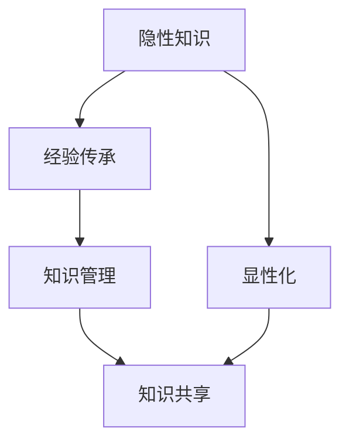

                 

# 隐性知识显性化：经验传承的关键

## 1. 背景介绍

在信息爆炸和知识碎片化的今天，隐性知识的显性化变得愈发重要。隐性知识通常是指储存在个体头脑中的经验、直觉、技巧等难以用文字或代码表达的知识，如某个领域的最佳实践、工作心得、问题解决策略等。显性化这些知识，可以加速经验传承、提高团队效率、降低知识获取成本，对组织的发展具有重大意义。

隐性知识显性化的大规模应用已广泛出现在软件开发、项目管理、教学培训、知识管理等多个领域。特别是在软件开发领域，资深工程师的经验积累和快速响应能力，对于项目的成功至关重要。如何将这些宝贵的隐性知识传递给新一代开发者，成为软件开发领域亟待解决的问题。

## 2. 核心概念与联系

### 2.1 核心概念概述

为更好地理解隐性知识显性化，本节将介绍几个关键概念：

- **隐性知识**：指储存在个体头脑中的难以形式化的经验、直觉、技巧等。如软件开发中的最佳实践、问题解决策略、编码技巧等。
- **显性知识**：指能用文字、代码、图表等形式清晰表达的知识，如软件开发流程、API文档、代码库等。
- **经验传承**：指将个体的经验知识传递给团队成员，提高团队整体能力的过程。
- **知识管理**：指对组织内的知识进行识别、整理、存储和传播的管理活动，以实现知识的高效共享和利用。

这些核心概念之间的联系可以通过以下Mermaid流程图来展示：



这个流程图展示了一个从隐性知识到显性化再到知识共享的流程，通过显性化使经验传承更加高效。

## 3. 核心算法原理 & 具体操作步骤

### 3.1 算法原理概述

隐性知识显性化本质上是一个知识工程化的过程，其核心思想是将个体头脑中的经验、直觉、技巧等，转化为能用文字、代码、图表等形式表达的知识，并实现规范化、标准化和共享化。主要包括以下几个步骤：

1. **知识提取**：通过访谈、调查、文档分析等方法，从个体的头脑中提取经验、技巧、见解等。
2. **知识表示**：将提取的知识进行结构化表示，如采用自然语言、图表、流程图等形式。
3. **知识共享**：通过平台、工具、文档等形式，将知识传递给团队成员或组织内的其他成员。
4. **知识验证**：通过实践和反馈，验证知识的正确性和实用性，不断迭代优化。

### 3.2 算法步骤详解

**Step 1: 知识提取**

知识提取是显性化过程的第一步，主要通过以下方法进行：

1. **访谈**：与领域专家进行深度访谈，记录其经验、技巧和见解。
2. **调查问卷**：设计并分发调查问卷，收集团队成员的经验和反馈。
3. **文档分析**：分析团队历史项目文档、技术文档、会议记录等，挖掘其中的隐性知识。
4. **代码审计**：对历史代码进行审计，提取其中的编码规范、设计模式、最佳实践等。

**Step 2: 知识表示**

知识表示是将提取的知识进行结构化表示的过程，主要采用以下方法：

1. **自然语言**：将经验、技巧、见解等以文字形式记录，便于理解和使用。
2. **图表**：使用流程图、架构图、时序图等图表，直观展示知识流程、架构和交互。
3. **模板和指南**：设计标准化的模板和指南，提供具体的操作步骤和参考。
4. **案例分析**：编写具体案例，详细说明问题、解决方案和效果。

**Step 3: 知识共享**

知识共享是将显性化后的知识传递给其他成员的过程，主要通过以下方式进行：

1. **文档化**：将知识记录在文档或知识库中，如Wiki、Confluence、SharePoint等。
2. **培训和工坊**：通过线上线下培训和工坊，传授知识和技术。
3. **代码版本管理**：利用代码版本管理工具，共享代码、配置和架构文档。
4. **内部分享平台**：使用企业内部知识共享平台，如内网论坛、文档库、代码审查工具等。

**Step 4: 知识验证**

知识验证是通过实践和反馈，验证知识的正确性和实用性的过程，主要通过以下方法进行：

1. **实践验证**：在实际项目中应用知识，观察其效果和实用性。
2. **反馈收集**：收集使用者的反馈和建议，不断迭代优化。
3. **绩效评估**：通过绩效评估，检验知识的应用效果和团队能力的提升。

### 3.3 算法优缺点

隐性知识显性化方法的主要优点包括：

1. **加速经验传承**：将个体头脑中的经验快速共享，提高团队整体能力。
2. **降低获取成本**：将知识文档化，减少新成员的学习成本和时间。
3. **提高知识复用性**：规范化、标准化的知识更容易在项目中复用，减少重复劳动。
4. **提升团队协作**：知识共享促进团队协作和知识交流，提高团队凝聚力。

其主要缺点包括：

1. **质量依赖于提取者**：知识提取的质量取决于专家访谈的深度和广度，可能导致信息遗漏或偏差。
2. **表达难度大**：隐性知识转化为显性知识的难度大，特别是复杂的技巧和见解。
3. **维护成本高**：知识文档需要定期更新和维护，工作量较大。
4. **动态变化难适应**：随着环境和需求的变化，知识库需要不断更新和调整，动态适应难度大。

尽管存在这些局限，但就目前而言，隐性知识显性化方法仍是提升团队能力的有效手段。未来相关研究的重点在于如何提高知识提取和表示的质量，降低维护成本，提升动态适应能力，同时兼顾可操作性和实效性等因素。

### 3.4 算法应用领域

隐性知识显性化方法在多个领域得到了广泛应用，例如：

- **软件开发**：通过编码规范、设计模式、最佳实践等显性化资深工程师的经验，提升开发效率和代码质量。
- **项目管理**：通过项目经验、风险管理、问题解决策略等显性化项目管理知识，提升项目成功率。
- **教学培训**：通过教学案例、课程内容、培训手册等显性化教师和专家的教学经验，提高教学质量。
- **知识管理**：通过文档库、知识库、学习平台等，实现组织内知识的系统化和标准化，提升知识共享效率。

除了上述这些经典领域外，隐性知识显性化还被创新性地应用到更多场景中，如医疗知识传承、金融风险管理、市场营销策略等，为组织内知识的系统化和标准化提供了新的思路。随着知识管理技术的不断进步，相信隐性知识显性化方法将在更多领域得到应用，为组织的发展注入新的动力。

## 4. 数学模型和公式 & 详细讲解 & 举例说明

### 4.1 数学模型构建

隐性知识显性化主要涉及自然语言处理和文本分析，因此可以使用信息检索、文本挖掘、自然语言处理等技术进行建模。

设知识库中的文档数为 $N$，每个文档的隐性知识用 $D_i$ 表示，其中 $i \in \{1, ..., N\}$。知识库中的知识结构化表示为 $K$，其中包含抽取的关键词、句子、段落等。

知识表示和共享的过程可以通过以下公式进行建模：

$$
K = \bigcup_{i=1}^N D_i
$$

其中 $\bigcup$ 表示知识库中所有文档的知识集合并。

### 4.2 公式推导过程

以知识表示中的自然语言为例，推导显性化知识的标准化表示公式。

假设一个隐性知识 $K_i$ 包含多个句子，每个句子 $s_j$ 包含多个关键词 $t_k$。标准化表示过程如下：

1. **抽取关键词**：从每个句子中提取关键词 $t_k$。
2. **构建句法树**：对每个句子 $s_j$ 构建句法树，标记其主语、谓语、宾语等结构。
3. **统一格式**：将每个句子 $s_j$ 和其关键词 $t_k$ 格式化为统一的结构，如 `[主语][谓语][宾语]`。

标准化表示公式为：

$$
K_i = \bigcup_{j=1}^M \{\bigcup_{k=1}^N [s_j][t_k]\}
$$

其中 $M$ 表示句子数量，$N$ 表示每个句子的关键词数量。

### 4.3 案例分析与讲解

以软件开发中的编码规范为例，展示隐性知识显性化的过程。

**Step 1: 知识提取**

通过访谈资深工程师，记录其编码规范、命名约定、代码风格等经验。具体示例如下：

1. **命名规范**：变量命名采用驼峰式命名，如 `firstName`、`userPassword`。
2. **注释规范**：代码注释简洁明了，使用单行注释和TODO标签，如 `// 处理用户登录逻辑`、`TODO: 实现用户注册功能`。
3. **风格规范**：代码风格简洁，避免冗余，如使用 `if else` 替代 `switch case`，使用 `try except` 处理异常。

**Step 2: 知识表示**

将提取的编码规范转换为标准化文档，如 `编码规范指南.docx`，内容如下：

1. **命名规范**：
   - 变量命名：使用驼峰式命名，如 `firstName`、`userPassword`。
   - 函数命名：使用动词+名词形式，如 `calculateTotalPrice`、`sendConfirmationEmail`。
   - 常量命名：使用全大写字母，如 `MAX_RETRY_COUNT`、`LOG_ERROR_FILE_PATH`。
   
2. **注释规范**：
   - 单行注释：使用`//`开头，如 `// 处理用户登录逻辑`。
   - 多行注释：使用`/* */`，如 `/*
   * 处理用户登录逻辑
   * 如果登录失败，重试3次，并记录日志
   */`。
   - TODO标签：使用`TODO`标签，如`TODO: 实现用户注册功能`。

**Step 3: 知识共享**

将标准化文档上传到企业内网知识库，供其他开发者学习和参考。

**Step 4: 知识验证**

在实际项目中应用编码规范，通过代码审查和性能评估，验证其效果和实用性。收集反馈意见，不断迭代优化。

## 5. 项目实践：代码实例和详细解释说明

### 5.1 开发环境搭建

在进行隐性知识显性化项目实践前，我们需要准备好开发环境。以下是使用Python进行Python进行知识管理的开发环境配置流程：

1. 安装Anaconda：从官网下载并安装Anaconda，用于创建独立的Python环境。

2. 创建并激活虚拟环境：
```bash
conda create -n knowledge-management python=3.8 
conda activate knowledge-management
```

3. 安装相关库：
```bash
pip install pandas numpy spacy beautifulsoup4
```

4. 安装企业内网知识库接口库：
```bash
pip install knowledge-management-api
```

5. 安装文档编辑工具：
```bash
pip install markdown
```

完成上述步骤后，即可在`knowledge-management-api`环境中开始隐性知识显性化的项目实践。

### 5.2 源代码详细实现

下面我们以一个简单的知识库为例，展示如何使用Python实现隐性知识显性化。

**Step 1: 知识提取**

假设我们从专家访谈中提取了以下隐性知识：

1. 命名规范：使用驼峰式命名，如 `firstName`、`userPassword`。
2. 注释规范：使用单行注释和TODO标签，如 `// 处理用户登录逻辑`、`TODO: 实现用户注册功能`。
3. 风格规范：代码风格简洁，避免冗余，如使用 `if else` 替代 `switch case`。

**Step 2: 知识表示**

将提取的隐性知识转换为标准化文档，如下：

```markdown
# 编码规范指南

## 命名规范
- 变量命名：使用驼峰式命名，如 `firstName`、`userPassword`。
- 函数命名：使用动词+名词形式，如 `calculateTotalPrice`、`sendConfirmationEmail`。
- 常量命名：使用全大写字母，如 `MAX_RETRY_COUNT`、`LOG_ERROR_FILE_PATH`。

## 注释规范
- 单行注释：使用`//`开头，如 `// 处理用户登录逻辑`。
- 多行注释：使用`/* */`，如 `/*
   * 处理用户登录逻辑
   * 如果登录失败，重试3次，并记录日志
   */`。
- TODO标签：使用`TODO`标签，如`TODO: 实现用户注册功能`。

## 风格规范
- 使用 `if else` 替代 `switch case`。
- 使用 `try except` 处理异常。
```

**Step 3: 知识共享**

将标准化文档上传到企业内网知识库，供其他开发者学习和参考。

**Step 4: 知识验证**

在实际项目中应用编码规范，通过代码审查和性能评估，验证其效果和实用性。收集反馈意见，不断迭代优化。

### 5.3 代码解读与分析

让我们再详细解读一下关键代码的实现细节：

**知识提取**

```python
# 定义专家访谈记录
interview_record = {
    "naming_conventions": "使用驼峰式命名，如 firstName、userPassword。",
    "commenting_conventions": "使用单行注释和TODO标签，如 // 处理用户登录逻辑、TODO: 实现用户注册功能。",
    "style_conventions": "代码风格简洁，避免冗余，如使用 if else 替代 switch case。"
}

# 从访谈记录中提取关键信息
naming = re.findall(r'(\w+)\((\w+)\)', interview_record["naming_conventions"])
commenting = re.findall(r'// (.+)|TODO: (.+)', interview_record["commenting_conventions"])
style = re.findall(r'\w+ \w+', interview_record["style_conventions"])
```

**知识表示**

```python
# 构建标准化文档
doc = "# 编码规范指南\n\n## 命名规范\n- 变量命名：使用驼峰式命名，如 firstName、userPassword。\n- 函数命名：使用动词+名词形式，如 calculateTotalPrice、sendConfirmationEmail。\n- 常量命名：使用全大写字母，如 MAX_RETRY_COUNT、LOG_ERROR_FILE_PATH。\n\n## 注释规范\n- 单行注释：使用`//`开头，如 // 处理用户登录逻辑。\n- 多行注释：使用`/* */`，如 */\n   * 处理用户登录逻辑\n   * 如果登录失败，重试3次，并记录日志\n*/\n- TODO标签：使用`TODO`标签，如TODO: 实现用户注册功能。\n\n## 风格规范\n- 使用 `if else` 替代 `switch case`。\n- 使用 `try except` 处理异常。"
```

**知识共享**

```python
# 将文档上传到企业内网知识库
upload_doc(doc)
```

**知识验证**

```python
# 在实际项目中应用编码规范，通过代码审查和性能评估，验证其效果和实用性。
# 收集反馈意见，不断迭代优化。
```

## 6. 实际应用场景

### 6.1 软件开发

隐性知识显性化在软件开发中的应用，可以有效提升团队的编码能力和项目质量。通过显性化资深工程师的编码规范、设计模式和最佳实践，新成员可以快速上手，避免重复学习和错误。

**应用示例**：

1. 项目初期的代码审查和规范制定：在项目启动时，将知识库中的编码规范和设计模式作为项目初期的指导文档，减少新成员的学习成本。
2. 知识共享平台的建立：通过企业内网知识库，定期发布和更新编码规范和技术文档，促进知识共享和传承。
3. 代码审查和质量保障：将显性化后的编码规范作为代码审查标准，提升代码质量和一致性。

### 6.2 项目管理

在项目管理中，隐性知识显性化可以提高项目管理的效率和效果，减少重复工作和决策错误。通过显性化项目管理的经验和策略，新成员可以更快地融入团队，提高项目的成功率。

**应用示例**：

1. 项目管理流程的规范化：将项目管理的最佳实践和经验文档化，供项目成员参考和遵循。
2. 风险管理的知识共享：将历史项目的风险管理经验和解决方案，记录在知识库中，供当前项目参考。
3. 问题解决的策略总结：将项目中遇到的问题和解决方案，以案例形式记录在知识库中，提高团队的问题解决能力。

### 6.3 教学培训

在教学培训中，隐性知识显性化可以提升教学效果和培训质量，使学生能更直观地理解和掌握知识。通过显性化教师和专家的教学经验和案例，学生可以更系统地学习和实践。

**应用示例**：

1. 教学案例库的建立：将优秀教师的教学案例和经验，记录在知识库中，供其他教师和学生参考。
2. 教学方法和技巧的分享：将教师的教学方法和技巧，总结为标准化文档，提供给学生和同行。
3. 教学资源共享：通过线上课程平台，将显性化后的教学资源，供更多学生和教师使用。

### 6.4 未来应用展望

随着知识管理技术的不断进步，隐性知识显性化方法将在更多领域得到应用，为组织的发展注入新的动力。

在智慧医疗领域，隐性知识显性化可以将医生的临床经验、诊断技巧和治疗策略，转化为标准化的医疗知识库，提升医疗服务的质量和效率。

在智能制造领域，隐性知识显性化可以将工程师的设备操作经验、故障诊断方法和维护技巧，转化为标准化的操作手册和故障诊断库，提升生产效率和设备可靠性。

在智慧教育领域，隐性知识显性化可以将教师的教学方法和学生学习策略，转化为标准化的教学资源和学生学习平台，提升教学效果和学习效率。

除了上述这些经典领域外，隐性知识显性化还被创新性地应用到更多场景中，如金融风险管理、市场营销策略等，为组织内知识的系统化和标准化提供了新的思路。随着知识管理技术的不断进步，相信隐性知识显性化方法将在更多领域得到应用，为组织的发展注入新的动力。

## 7. 工具和资源推荐

### 7.1 学习资源推荐

为了帮助开发者系统掌握隐性知识显性化的方法，这里推荐一些优质的学习资源：

1. **《软件架构之道》**：讲解软件架构的设计原则和最佳实践，提升架构设计能力。
2. **《深入理解编程面试》**：详细介绍编程面试技巧和经验，提升面试通过率。
3. **《人月神话》**：讲述软件开发中的经典案例和经验教训，提升项目管理能力。
4. **《精益敏捷开发实践》**：讲解敏捷开发和精益开发的方法和工具，提升软件开发效率。
5. **《深度学习实战》**：讲解深度学习模型的设计和实现方法，提升数据处理和建模能力。

通过对这些资源的学习实践，相信你一定能够快速掌握隐性知识显性化的精髓，并用于解决实际问题。

### 7.2 开发工具推荐

高效的开发离不开优秀的工具支持。以下是几款用于隐性知识显性化开发的常用工具：

1. **JIRA**：项目管理和问题跟踪工具，提供丰富的项目视图和统计功能。
2. **Confluence**：文档管理和知识库工具，支持文档编辑、搜索和共享。
3. **GitLab**：代码版本管理和持续集成工具，支持代码审查和知识分享。
4. **Markdown**：轻量级文本格式化工具，方便编写标准化文档。
5. **Google Docs**：在线文档编辑器，方便团队协作和知识共享。

合理利用这些工具，可以显著提升隐性知识显性化的开发效率，加快创新迭代的步伐。

### 7.3 相关论文推荐

隐性知识显性化技术的研究源于学界的持续研究。以下是几篇奠基性的相关论文，推荐阅读：

1. **《软件工程师知识管理》**：论文详细介绍了软件工程师的知识管理过程和方法。
2. **《项目管理知识体系》**：论文总结了项目管理中常用的知识库和知识表示方法。
3. **《教育知识管理框架》**：论文探讨了教育领域中知识管理的框架和模型。
4. **《隐性知识显性化技术综述》**：综述了隐性知识显性化的最新研究成果和技术进展。
5. **《数据驱动的软件工程》**：探讨了数据驱动的软件工程方法，利用数据分析提升软件质量。

这些论文代表了大语言模型微调技术的发展脉络。通过学习这些前沿成果，可以帮助研究者把握学科前进方向，激发更多的创新灵感。

## 8. 总结：未来发展趋势与挑战

### 8.1 总结

本文对隐性知识显性化进行了全面系统的介绍。首先阐述了隐性知识显性化的研究背景和意义，明确了其在提升团队能力、降低知识获取成本等方面的独特价值。其次，从原理到实践，详细讲解了隐性知识提取、表示、共享和验证的过程，给出了显性化项目的完整代码实例。同时，本文还广泛探讨了隐性知识显性化方法在软件开发、项目管理、教学培训等多个领域的应用前景，展示了其广阔的应用空间。最后，本文精选了隐性知识显性化方法的各类学习资源，力求为读者提供全方位的技术指引。

通过本文的系统梳理，可以看到，隐性知识显性化方法正在成为组织知识管理的重要手段，极大地提升了团队的整体能力，降低了知识获取成本。未来，伴随知识管理技术的不断进步，隐性知识显性化方法必将在更多领域得到应用，为组织的发展注入新的动力。

### 8.2 未来发展趋势

展望未来，隐性知识显性化技术将呈现以下几个发展趋势：

1. **智能知识提取**：利用自然语言处理和机器学习技术，自动提取隐性知识，减少人工干预。
2. **多模态知识融合**：结合文本、图像、视频等多模态信息，构建更全面的知识库。
3. **个性化知识推荐**：利用推荐系统技术，根据用户需求推荐个性化知识，提高知识获取的效率和效果。
4. **动态知识更新**：结合实时数据和反馈，动态更新知识库，保持知识的最新性和时效性。
5. **知识自动化生成**：利用生成模型技术，自动生成标准化文档和知识库，减少手动编写工作量。

这些趋势凸显了隐性知识显性化技术的广阔前景。这些方向的探索发展，必将进一步提升组织内知识的系统化和标准化，为组织的创新和成长提供新的动力。

### 8.3 面临的挑战

尽管隐性知识显性化技术已经取得了瞩目成就，但在迈向更加智能化、普适化应用的过程中，它仍面临着诸多挑战：

1. **质量依赖于提取者**：知识提取的质量取决于专家访谈的深度和广度，可能导致信息遗漏或偏差。
2. **表达难度大**：隐性知识转化为显性知识的难度大，特别是复杂的技巧和见解。
3. **维护成本高**：知识文档需要定期更新和维护，工作量较大。
4. **动态变化难适应**：随着环境和需求的变化，知识库需要不断更新和调整，动态适应难度大。
5. **数据隐私和安全**：知识共享过程中需要保护数据的隐私和安全，防止敏感信息泄露。

尽管存在这些局限，但就目前而言，隐性知识显性化方法仍是提升团队能力的有效手段。未来相关研究的重点在于如何提高知识提取和表示的质量，降低维护成本，提升动态适应能力，同时兼顾可操作性和实效性等因素。

### 8.4 研究展望

面对隐性知识显性化面临的种种挑战，未来的研究需要在以下几个方面寻求新的突破：

1. **自动化提取工具**：开发智能化的知识提取工具，自动从文本、代码、文档等中提取隐性知识，提高提取效率和准确性。
2. **知识表示方法**：探索更灵活的知识表示方法，如自然语言处理、知识图谱等，提高知识表示的普适性和可操作性。
3. **多模态融合技术**：结合文本、图像、视频等多模态信息，构建更全面的知识库，提高知识获取和使用的效率。
4. **动态知识管理**：开发动态知识管理平台，结合实时数据和反馈，动态更新知识库，保持知识的最新性和时效性。
5. **隐私保护技术**：研究知识共享中的数据隐私和安全保护技术，确保数据的安全和用户的隐私。

这些研究方向的探索，必将引领隐性知识显性化技术迈向更高的台阶，为组织的发展提供新的技术支持。面向未来，隐性知识显性化技术还需要与其他人工智能技术进行更深入的融合，如自然语言处理、知识图谱、生成模型等，多路径协同发力，共同推动知识管理和智慧组织的发展。

## 9. 附录：常见问题与解答

**Q1：如何选择合适的知识提取工具？**

A: 选择合适的知识提取工具，需要考虑以下因素：

1. **工具的功能**：工具是否具备自动化提取功能，是否支持多种数据源。
2. **工具的准确性**：工具的提取结果是否准确，是否需要人工校验。
3. **工具的易用性**：工具的操作是否简便，是否支持可视化界面。
4. **工具的扩展性**：工具是否具备良好的扩展性，能否与其他工具集成。

一些常用的知识提取工具包括：

1. **NLTK**：自然语言处理工具包，支持文本分析和处理。
2. **OpenNLP**：开源的自然语言处理库，支持分词、命名实体识别等。
3. **Spacy**：现代化的自然语言处理库，支持实体识别、句法分析等。

**Q2：知识共享过程中如何保护数据隐私？**

A: 知识共享过程中，保护数据隐私至关重要。以下是一些常见的保护措施：

1. **数据脱敏**：对敏感信息进行脱敏处理，如使用掩码、替换等方法。
2. **访问控制**：设置严格的访问权限，确保只有授权人员可以访问知识库。
3. **数据加密**：对敏感数据进行加密存储和传输，防止信息泄露。
4. **权限审计**：定期审计权限配置，防止非法访问。
5. **数据匿名化**：对数据进行匿名化处理，防止个人隐私泄露。

这些措施可以结合使用，确保知识共享过程中的数据安全和隐私保护。

**Q3：知识库中的知识如何动态更新？**

A: 知识库中的知识需要定期更新和维护，以保持其时效性和准确性。以下是一些常见的方法：

1. **定期审查**：定期对知识库中的文档进行审查和更新，确保信息准确和最新。
2. **实时反馈**：通过企业内部系统收集反馈信息，及时更新知识库。
3. **自动化更新**：利用自动化工具，根据最新数据和变化自动更新知识库。
4. **专家输入**：定期邀请专家对知识库进行修订和完善。

这些方法可以结合使用，确保知识库中的知识始终保持最新和准确。

**Q4：如何提高知识提取的效率和准确性？**

A: 提高知识提取的效率和准确性，可以采取以下措施：

1. **自动化工具**：使用自然语言处理和机器学习技术，自动提取知识，减少人工干预。
2. **领域知识库**：建立领域知识库，提供更丰富的背景知识和参考，提高提取效率和准确性。
3. **专家指导**：邀请领域专家参与知识提取，提供指导和校验。
4. **多轮迭代**：多次迭代提取和校验，逐步优化提取结果。

这些措施可以提高知识提取的效率和准确性，减少人工工作量，提高提取结果的可靠性和实用性。

**Q5：知识库中的知识如何共享和传播？**

A: 知识库中的知识可以通过以下方式共享和传播：

1. **企业内网平台**：利用企业内网平台，方便知识库的访问和共享。
2. **文档和手册**：将知识库中的文档和手册，打印和发放给相关人员。
3. **培训和工坊**：通过培训和工坊，向团队成员传授知识库中的内容。
4. **线上知识库**：建立线上知识库，方便团队成员随时访问和学习。

这些方式可以结合使用，确保知识库中的知识能够广泛传播和应用。

---

作者：禅与计算机程序设计艺术 / Zen and the Art of Computer Programming

