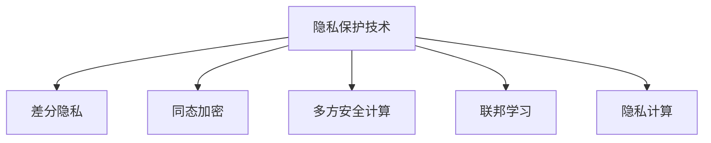

                 

# 隐私安全：为人类计算保驾护航

## 1. 背景介绍

### 1.1 问题由来

随着数字化技术的飞速发展，大数据、人工智能等新技术的应用为人类社会带来了前所未有的便利和效率。然而，与此同时，隐私和安全的挑战也随之而来。在数据驱动的计算时代，如何保护个人隐私、防止数据滥用，成为社会关注的焦点。隐私保护技术不仅关系到用户的切身利益，更是构建数字化社会信任的基石。

近年来，全球范围内频繁发生的数据泄露事件，如Cambridge Analytica数据丑闻、谷歌广告隐私门事件，引发了社会对隐私保护的广泛关注和热议。数据滥用、用户画像、行为追踪等现象，暴露了当前隐私保护技术的不足。因此，如何通过技术手段，构建更为安全、透明的隐私保护机制，成为亟待解决的问题。

### 1.2 问题核心关键点

隐私保护的核心在于数据使用与共享的权衡。如何在保障隐私的同时，充分利用数据价值，最大化地服务于社会和经济效益，是隐私保护技术面临的主要挑战。传统的隐私保护方法如加密、匿名化等，虽然能够在一定程度上保护隐私，但在实际应用中往往存在数据可用性差、计算效率低等问题。

为了应对这些挑战，隐私保护技术不断发展，涌现出了一系列创新方法，如差分隐私、同态加密、多方安全计算等。这些方法结合现代计算技术，能够在保留隐私的前提下，提升数据的可用性和计算效率。同时，隐私保护技术还与区块链、联邦学习、边缘计算等前沿技术紧密结合，为大数据时代的隐私保护提供了新的解决方案。

## 2. 核心概念与联系

### 2.1 核心概念概述

为更好地理解隐私保护技术的原理和架构，本节将介绍几个密切相关的核心概念：

- 隐私保护技术（Privacy-Preserving Technology）：通过技术手段，在不泄露个人隐私的前提下，实现数据的共享和利用。隐私保护技术包括差分隐私、同态加密、多方安全计算等。

- 差分隐私（Differential Privacy）：一种概率性隐私保护方法，通过在统计查询中引入噪声，确保个体数据不被泄露，同时保证数据统计的准确性。

- 同态加密（Homomorphic Encryption）：一种密码学技术，允许在密文上进行计算，计算结果仍为密文，从而实现数据的隐私保护。

- 多方安全计算（Secure Multi-Party Computation, SMPC）：一种安全计算协议，允许多个参与方在不泄露各自输入数据的情况下，共同计算一个函数的结果，适用于多方数据分析场景。

- 联邦学习（Federated Learning）：一种分布式机器学习方法，通过在多个分布式设备上联合训练模型，实现数据本地化处理，保护用户数据隐私。

- 隐私计算（Privacy Computing）：涵盖差分隐私、同态加密、多方安全计算等技术，致力于在不泄露个体数据的情况下，实现数据的共享和利用。

这些核心概念之间的逻辑关系可以通过以下Mermaid流程图来展示：



这个流程图展示了这个隐私保护技术的核心概念及其之间的关系：

1. 隐私保护技术是整个隐私保护架构的顶层概念，包括差分隐私、同态加密、多方安全计算等技术。
2. 差分隐私、同态加密、多方安全计算等技术都是隐私保护技术的重要组成部分，各自有独特的优势和适用场景。
3. 联邦学习则是隐私保护技术在分布式计算环境中的应用，适用于多方数据分析场景。
4. 隐私计算是涵盖上述所有技术的一个更广义的概念，旨在保护个体数据隐私的同时，实现数据的共享和利用。

## 3. 核心算法原理 & 具体操作步骤
### 3.1 算法原理概述

隐私保护技术的核心在于通过技术手段，在不泄露个体数据的前提下，实现数据的共享和利用。其基本原理是利用数学和计算理论，将数据的隐私信息与计算结果分离，确保个体数据的隐私性。

形式化地，设隐私保护算法为 $\mathcal{A}$，输入为原始数据 $D$，输出为计算结果 $R$。隐私保护的目标是满足以下条件：
1. 同态性：计算结果 $R$ 不泄露任何个体数据 $d_i$ 的信息，即对于任何 $\epsilon$ 和 $\delta$，满足差分隐私条件 $\epsilon$-Differential Privacy 或同态加密的安全性条件。
2. 可用性：计算结果 $R$ 仍可被用于有效的数据分析和决策，即保证数据可用性。

### 3.2 算法步骤详解

隐私保护技术的实现通常包括以下几个关键步骤：

**Step 1: 设计隐私保护算法**

- 选择合适的隐私保护算法，如差分隐私、同态加密、多方安全计算等。
- 设计隐私保护算法的具体实现，包括噪声添加、加密解密、计算协议等。

**Step 2: 实现隐私保护算法**

- 将隐私保护算法转化为具体代码，实现其计算逻辑。
- 优化算法的计算效率和资源消耗，确保其在实际应用中的可行性。

**Step 3: 评估隐私保护效果**

- 设计隐私保护效果评估指标，如差分隐私的 $\epsilon$ 和 $\delta$、同态加密的安全性等。
- 使用模拟实验或实际数据，对隐私保护算法的保护效果进行评估和测试。

**Step 4: 部署隐私保护系统**

- 将隐私保护算法集成到实际应用系统中，进行测试和验证。
- 配置系统参数，确保隐私保护机制的高效运行。

**Step 5: 持续监控和维护**

- 定期监测隐私保护系统的运行状态，及时发现和修复问题。
- 根据新的数据和业务需求，对隐私保护算法进行持续优化和改进。

### 3.3 算法优缺点

隐私保护技术具有以下优点：
1. 提供高强度的隐私保护。差分隐私、同态加密等方法，能够在不泄露个体数据的情况下，实现数据的共享和利用。
2. 提升数据可用性。隐私保护技术通过计算还原，可以保留数据的统计特性，提升数据在分析和决策中的应用价值。
3. 兼容性强。隐私保护技术可以与多种计算模型和数据处理方式兼容，适用于多种业务场景。

同时，该方法也存在一些局限性：
1. 计算复杂度高。隐私保护技术涉及复杂的数学和计算理论，计算开销较大。
2. 算法实现复杂。隐私保护算法的设计和实现需要高水平的数学和计算技术。
3. 资源消耗大。隐私保护算法往往需要大量的计算资源和时间，可能影响系统的实时性和可用性。
4. 隐私保护效果有限。一些隐私保护技术，如差分隐私，只能在一定程度上保护隐私，不能完全消除隐私风险。

尽管存在这些局限性，但隐私保护技术在大数据和人工智能应用的普及中，发挥着越来越重要的作用，成为了保障个体数据隐私的重要手段。

### 3.4 算法应用领域

隐私保护技术已经在多个领域得到了广泛应用，例如：

- 金融领域：通过差分隐私和同态加密，保护用户的金融数据，如交易记录、信用评分等，防止数据泄露和滥用。
- 医疗领域：利用多方安全计算和隐私计算，保护患者隐私，如病历数据、基因信息等，确保医疗数据的隐私和安全。
- 公共安全：通过差分隐私和联邦学习，保护公共数据，如犯罪记录、交通流量等，防止数据滥用。
- 社交网络：使用同态加密和多方安全计算，保护用户隐私，如聊天记录、好友关系等，防止数据泄露。
- 电子商务：采用差分隐私和隐私计算，保护用户行为数据，如购买记录、浏览历史等，防止数据滥用。

除了上述这些领域外，隐私保护技术还被应用于更多场景中，如智能合约、物联网、云计算等，为保障数据隐私和数据安全提供了新的解决方案。随着隐私保护技术的不断进步，相信在更广泛的应用领域，隐私保护技术将发挥更大的作用。

## 4. 数学模型和公式 & 详细讲解
### 4.1 数学模型构建

隐私保护技术通常涉及复杂的数学模型和算法。以下介绍几种主要的隐私保护模型及其数学构建方式。

#### 4.1.1 差分隐私

差分隐私的数学模型可以表示为：
$$
\mathcal{A}(D) = \sum_{i=1}^n \mathcal{N}(\mu, \sigma^2)
$$
其中，$D$ 为原始数据集，$\mathcal{A}$ 为差分隐私算法，$\mu$ 为统计查询的真实结果，$\sigma$ 为噪声标准差，$n$ 为数据集大小。

差分隐私的核心在于引入噪声，保护个体数据的隐私。噪声的引入方式包括拉普拉斯噪声、高斯噪声等，具体选择取决于数据类型和查询任务。

#### 4.1.2 同态加密

同态加密的数学模型可以表示为：
$$
E(P) = C_0
$$
$$
C = E_{k,CT}(P) \cdot E_{k,CT}(D)
$$
$$
\hat{P} = D_{k,CT}(C)
$$
其中，$P$ 为明文，$C$ 为密文，$E$ 为加密算法，$D$ 为解密算法，$k$ 为密钥，$CT$ 为计算可信方。

同态加密的核心在于在密文上进行计算，计算结果仍为密文，从而实现数据的隐私保护。同态加密分为全同态加密和部分同态加密，其中全同态加密可以在密文上执行任意计算，而部分同态加密仅支持特定类型的计算。

#### 4.1.3 多方安全计算

多方安全计算的数学模型可以表示为：
$$
P = \prod_{i=1}^n f_i(A_i)
$$
其中，$P$ 为计算结果，$n$ 为参与方数量，$f_i$ 为每个参与方的计算函数，$A_i$ 为每个参与方的输入数据。

多方安全计算的核心在于通过安全协议，允许多个参与方在不泄露各自输入数据的情况下，共同计算一个函数的结果。多方安全计算通常依赖于可信的第三方或加密技术，确保计算过程中数据的隐私性。

### 4.2 公式推导过程

#### 4.2.1 差分隐私公式推导

差分隐私的数学公式推导基于拉普拉斯机制，假设查询函数为 $f$，噪声分布为拉普拉斯分布 $N(0,\sigma^2)$，则差分隐私的数学公式为：
$$
\mathcal{A}(D) = f(D) + \mathcal{N}(0,\sigma^2)
$$
其中，$\mathcal{A}(D)$ 为差分隐私算法，$f(D)$ 为查询函数，$\mathcal{N}(0,\sigma^2)$ 为拉普拉斯噪声。

差分隐私的目标是确保个体数据的隐私，即对于任意两个相邻的数据集 $D$ 和 $D'$，满足：
$$
Pr[\mathcal{A}(D) = f(D) + z] \leq e^{\epsilon}Pr[\mathcal{A}(D') = f(D') + z]
$$
其中，$\epsilon$ 为隐私参数，$z$ 为拉普拉斯噪声。

#### 4.2.2 同态加密公式推导

同态加密的数学公式推导基于Paillier加密算法，假设明文为 $P$，密钥为 $k$，密文为 $C$，计算可信方为 $CT$，则同态加密的数学公式为：
$$
E_{k,CT}(P) = (g,g^kP,g)
$$
$$
C = (n,r,c_1,c_2)
$$
$$
\hat{P} = D_{k,CT}(C)
$$
其中，$E$ 为加密算法，$D$ 为解密算法，$n$ 为模数，$r$ 为随机数，$c_1$ 和 $c_2$ 为密文，$CT$ 为计算可信方。

同态加密的核心在于在密文上进行计算，计算结果仍为密文，即：
$$
E_{k,CT}(P) \cdot E_{k,CT}(D) = (g,g^kP,g) \cdot (n,r,c_1,c_2) = (g^{k+1},g^{k+1}P^n,g^{\frac{n+1}{2}r},g^{\frac{n+1}{2}r})
$$
计算结果为密文 $C'$，解密后的结果为明文 $\hat{P}$。

#### 4.2.3 多方安全计算公式推导

多方安全计算的数学公式推导基于安全多方计算协议，假设参与方数量为 $n$，查询函数为 $f$，每个参与方的输入为 $A_i$，则多方安全计算的数学公式为：
$$
P = \prod_{i=1}^n f_i(A_i)
$$
其中，$P$ 为计算结果，$n$ 为参与方数量，$f_i$ 为每个参与方的计算函数，$A_i$ 为每个参与方的输入数据。

多方安全计算的核心在于通过安全协议，确保每个参与方仅能获得其输入数据的信息，而无法获取其他参与方的数据。通常使用布尔电路或半可信计算等方式实现多方安全计算。

## 5. 项目实践：代码实例和详细解释说明
### 5.1 开发环境搭建

在进行隐私保护技术实践前，我们需要准备好开发环境。以下是使用Python进行差分隐私实践的环境配置流程：

1. 安装Anaconda：从官网下载并安装Anaconda，用于创建独立的Python环境。

2. 创建并激活虚拟环境：
```bash
conda create -n privacy-env python=3.8 
conda activate privacy-env
```

3. 安装必要的库：
```bash
pip install numpy pandas scikit-learn scipy statsmodels
```

4. 安装差分隐私库：
```bash
pip install python-differential-privacy
```

5. 安装相关的数据分析库：
```bash
pip install pandas-stubs
```

完成上述步骤后，即可在`privacy-env`环境中开始差分隐私实践。

### 5.2 源代码详细实现

下面我们以差分隐私在数据集上的应用为例，给出使用Python实现差分隐私的代码实例。

首先，定义原始数据集和隐私参数：

```python
import numpy as np
from differential_privacy import PrivacyMethod, LaplaceMechanism

data = np.array([1, 2, 3, 4, 5, 6, 7, 8, 9, 10])
epsilon = 1  # 隐私参数

# 计算差分隐私机制的噪声参数
noise = (epsilon / 2) * np.sqrt(np.log(2 / delta) / data.shape[0])
```

然后，定义差分隐私机制：

```python
# 定义差分隐私机制
privacy_method = PrivacyMethod(LaplaceMechanism)
```

接着，在原始数据上应用差分隐私机制：

```python
# 应用差分隐私机制
private_data = privacy_method.private(data, noise, epsilon)
```

最后，输出差分隐私处理后的数据：

```python
print("原始数据：", data)
print("差分隐私处理后的数据：", private_data)
```

以上就是使用Python实现差分隐私的完整代码实现。可以看到，利用Python的差分隐私库，可以方便地对原始数据进行差分隐私处理，保护数据的隐私性。

### 5.3 代码解读与分析

让我们再详细解读一下关键代码的实现细节：

**原始数据集定义**：
- 定义一个包含10个数值的数组`data`，作为原始数据集。

**隐私参数定义**：
- 定义差分隐私参数`epsilon`，用于控制差分隐私的强度。

**噪声参数计算**：
- 计算差分隐私机制所需的噪声参数`noise`，用于确保隐私性。

**差分隐私机制定义**：
- 定义差分隐私机制`privacy_method`，使用Laplace机制。

**差分隐私机制应用**：
- 对原始数据集`data`应用差分隐私机制，得到隐私处理后的数据`private_data`。

**输出结果分析**：
- 打印原始数据集`data`和差分隐私处理后的数据`private_data`，对比可见，差分隐私机制在数据中添加了噪声，保护了数据的隐私性。

可以看到，差分隐私技术的实现相对简单，主要涉及噪声的计算和隐私保护机制的应用。差分隐私的优势在于其概率性和通用性，能够在不同类型的数据和查询任务中应用。同时，差分隐私的实现也不依赖于特定的计算模型和算法，具有较好的通用性和兼容性。

## 6. 实际应用场景
### 6.1 金融数据隐私保护

金融领域的数据隐私保护是隐私保护技术的重要应用场景。银行和金融机构需要处理大量的个人金融数据，如交易记录、信用评分等。为了保护这些数据的隐私，可以使用差分隐私和同态加密技术。

具体而言，可以采用差分隐私技术对交易记录进行匿名化处理，添加噪声后发布统计数据，保护用户的隐私。同时，可以使用同态加密技术对交易记录进行加密存储，确保数据在处理和查询过程中始终处于加密状态，防止数据泄露。

### 6.2 医疗数据隐私保护

医疗数据隐私保护是隐私保护技术的另一个重要应用场景。医院和医疗机构需要处理大量的患者数据，如病历、基因信息等。为了保护这些数据的隐私，可以使用多方安全计算和隐私计算技术。

具体而言，可以采用多方安全计算技术，允许多个医疗机构在不泄露患者数据的情况下，共同计算疾病统计数据，如发病率、死亡率等。同时，可以使用隐私计算技术，将医疗数据分布式存储在多个设备上，确保数据在本地进行处理和计算，保护患者的隐私。

### 6.3 社交网络隐私保护

社交网络的数据隐私保护也是隐私保护技术的重要应用场景。社交平台需要处理大量的用户数据，如聊天记录、好友关系等。为了保护这些数据的隐私，可以使用同态加密和多方安全计算技术。

具体而言，可以采用同态加密技术对聊天记录进行加密存储，确保数据在处理和查询过程中始终处于加密状态，防止数据泄露。同时，可以使用多方安全计算技术，允许多个社交平台在不泄露用户数据的情况下，共同计算社交网络数据统计信息，如好友数、互动频率等。

### 6.4 未来应用展望

随着隐私保护技术的不断发展，其在更多领域的应用前景将不断拓展，为构建安全、透明的社会环境提供新的解决方案。

在智慧城市治理中，隐私保护技术可以应用于城市事件监测、舆情分析、应急指挥等环节，提高城市管理的自动化和智能化水平，构建更安全、高效的未来城市。

在智能制造领域，隐私保护技术可以应用于工业互联网的数据共享和协作，保护企业的商业机密和知识产权，确保数据的安全性和合法性。

在互联网金融领域，隐私保护技术可以应用于金融数据的共享和分析，保护用户的隐私和数据安全，提升金融服务的可信度和可靠性。

此外，在物联网、区块链、量子计算等前沿技术领域，隐私保护技术也有望发挥重要作用，为数据安全和隐私保护提供新的技术路径。总之，隐私保护技术的应用场景不断拓展，为数据驱动的智能社会建设提供了坚实保障。

## 7. 工具和资源推荐
### 7.1 学习资源推荐

为了帮助开发者系统掌握隐私保护技术的理论基础和实践技巧，这里推荐一些优质的学习资源：

1. 《隐私保护技术导论》系列博文：由隐私保护技术专家撰写，深入浅出地介绍了差分隐私、同态加密、多方安全计算等前沿技术，并提供了详细的代码实现和案例分析。

2. 《数据隐私保护》课程：斯坦福大学开设的隐私保护课程，涵盖了隐私保护的基础理论和实践技术，适合入门学习和进阶研究。

3. 《隐私保护技术实战》书籍：详细介绍了隐私保护技术的原理、算法和应用场景，提供了丰富的案例和实践代码。

4. IACR网站：国际密码学会，提供了大量密码学和隐私保护技术的最新研究进展和标准规范。

5. IEEE P1363《信息安全技术密码算法》标准：介绍了各种密码学算法，包括差分隐私、同态加密等，适合深入学习和参考。

通过对这些资源的学习实践，相信你一定能够快速掌握隐私保护技术的精髓，并用于解决实际的隐私保护问题。

### 7.2 开发工具推荐

高效的开发离不开优秀的工具支持。以下是几款用于隐私保护技术开发的常用工具：

1. Python：开源的编程语言，拥有丰富的第三方库和工具，适合隐私保护技术的实现。

2. numpy：Python的数值计算库，提供了高效的数据处理和计算能力。

3. pandas：Python的数据分析库，提供了数据预处理和统计分析功能。

4. Scikit-learn：Python的机器学习库，提供了多种隐私保护算法的实现和评估工具。

5. Statsmodels：Python的统计分析库，提供了多种差分隐私和同态加密的实现和评估工具。

6. Differential Privacy：Python的差分隐私库，提供了多种差分隐私算法的实现和评估工具。

合理利用这些工具，可以显著提升隐私保护技术的开发效率，加快创新迭代的步伐。

### 7.3 相关论文推荐

隐私保护技术的发展源于学界的持续研究。以下是几篇奠基性的相关论文，推荐阅读：

1. "Differential Privacy" 论文：差分隐私的奠基性论文，提出了差分隐私的定义和实现方法，奠定了差分隐私的理论基础。

2. "Fully Homomorphic Encryption: Revisiting A Symmetric-Key Paradigm" 论文：同态加密的奠基性论文，提出了同态加密的定义和实现方法，奠定了同态加密的理论基础。

3. "Secure Computation: Techniques and Models" 论文：多方安全计算的奠基性论文，介绍了多方安全计算的定义和实现方法，奠定了多方安全计算的理论基础。

4. " federated learning in mobile devices: user privacy vs. learning accuracy" 论文：联邦学习的奠基性论文，提出了联邦学习的定义和实现方法，奠定了联邦学习的理论基础。

5. "A Survey of Privacy-Preserving Methods for Big Data in the era of IoT" 论文：介绍了隐私保护技术在物联网领域的应用，提供了多种隐私保护算法的实现和评估方法。

这些论文代表了大隐私保护技术的发展脉络。通过学习这些前沿成果，可以帮助研究者把握学科前进方向，激发更多的创新灵感。

## 8. 总结：未来发展趋势与挑战

### 8.1 研究成果总结

本文对隐私保护技术的核心概念和算法原理进行了详细讲解，并通过代码实例展示了隐私保护技术在实际应用中的应用。隐私保护技术在金融数据、医疗数据、社交网络等领域有着广泛的应用前景，为数据驱动的智能社会建设提供了重要保障。

### 8.2 未来发展趋势

展望未来，隐私保护技术将呈现以下几个发展趋势：

1. 技术多样性增强。隐私保护技术将结合现代计算技术，如区块链、联邦学习、边缘计算等，发展出更多样化的保护方法。

2. 应用场景拓展。隐私保护技术将应用于更多领域，如智慧城市、智能制造、互联网金融等，为数据驱动的社会治理提供新的解决方案。

3. 标准和规范完善。隐私保护技术的发展将逐步标准化，形成行业规范和统一标准，提升隐私保护技术的可操作性和可互操作性。

4. 隐私计算框架成熟。隐私计算框架将成为隐私保护技术的重要组成部分，提供统一的计算和隐私保护平台，简化隐私保护算法的应用。

5. 隐私保护与数据利用并重。未来的隐私保护技术将更加注重数据利用和隐私保护之间的平衡，确保数据在保护隐私的同时，能够最大程度地发挥其价值。

### 8.3 面临的挑战

尽管隐私保护技术已经取得了显著进展，但在实际应用中仍面临诸多挑战：

1. 计算资源消耗大。隐私保护技术涉及复杂的计算和协议，需要大量的计算资源和时间，可能影响系统的实时性和可用性。

2. 隐私保护效果有限。一些隐私保护技术，如差分隐私，只能在一定程度上保护隐私，不能完全消除隐私风险。

3. 隐私保护技术复杂。隐私保护算法的实现需要高水平的数学和计算技术，对于开发者和研究者提出了较高的要求。

4. 隐私保护技术兼容性差。不同隐私保护技术之间缺乏互操作性，难以在多种场景中协同应用。

5. 隐私保护与业务需求冲突。隐私保护技术在实现过程中，可能与业务需求存在冲突，难以兼顾数据隐私和数据利用之间的平衡。

### 8.4 研究展望

面对隐私保护技术面临的挑战，未来的研究需要在以下几个方面寻求新的突破：

1. 隐私保护与计算效率的平衡。发展更加高效的隐私保护算法，降低计算资源消耗，提高隐私保护技术的实时性和可用性。

2. 多隐私保护技术的融合。结合差分隐私、同态加密、多方安全计算等多种隐私保护技术，发展更全面、更强大的隐私保护方案。

3. 隐私保护技术的标准化。制定和完善隐私保护技术的行业标准和规范，提高隐私保护技术的可操作性和可互操作性。

4. 隐私保护技术的应用落地。将隐私保护技术结合实际业务场景，进行多维度的应用研究和实践，提升隐私保护技术的实用性和可行性。

5. 隐私保护技术的伦理考量。研究隐私保护技术的伦理问题，确保隐私保护技术在应用过程中，符合社会伦理和道德规范。

这些研究方向将引领隐私保护技术迈向更高的台阶，为构建安全、透明的社会环境提供新的技术保障。

## 9. 附录：常见问题与解答

**Q1: 隐私保护技术和加密技术有何区别？**

A: 隐私保护技术和加密技术都是保障数据安全的重要手段，但两者侧重点不同。加密技术主要关注数据的机密性，即防止未授权用户获取数据；而隐私保护技术则更注重数据的隐私性，即在保护数据隐私的前提下，实现数据的共享和利用。隐私保护技术通过在数据处理过程中引入噪声和计算协议，确保个体数据的隐私不被泄露，同时保留数据的统计特性和可用性。

**Q2: 如何衡量隐私保护效果？**

A: 隐私保护效果的衡量通常从两个方面进行：

1. 隐私参数：隐私保护技术通常使用差分隐私和同态加密等技术，通过引入噪声和计算可信方，保护数据的隐私。隐私参数如$\epsilon$和$\delta$用于衡量隐私保护的强度和概率。

2. 安全性：隐私保护技术通过加密和多方安全计算等技术，保护数据在传输和存储过程中的机密性和完整性。安全性通常通过安全协议和加密算法的强度来衡量。

**Q3: 隐私保护技术与联邦学习有何不同？**

A: 隐私保护技术与联邦学习是两种不同的数据保护技术。隐私保护技术主要关注个体数据的隐私保护，通过在数据处理过程中引入噪声和计算协议，保护个体数据的隐私；而联邦学习则关注数据本地化处理，通过在多个分布式设备上联合训练模型，保护用户数据隐私。

联邦学习通过在多个设备上协同训练模型，将计算和隐私保护技术结合，既保护了用户数据的隐私，又实现了数据共享和模型更新。相比之下，隐私保护技术更注重个体数据的隐私保护，适用于数据量较小、计算资源有限的情况。

**Q4: 隐私保护技术在实际应用中是否会降低数据可用性？**

A: 隐私保护技术通过引入噪声和计算协议，在一定程度上会降低数据的可用性，这是隐私保护技术的固有特性。但是，通过合理的参数设置和算法优化，可以在保护隐私的前提下，提升数据可用性。例如，差分隐私可以通过选择合适的噪声分布和隐私参数，控制隐私泄露和数据可用性的平衡。同态加密可以在密文上进行计算，保留数据的统计特性和可用性。

综上所述，隐私保护技术虽然可能降低数据可用性，但通过合理的参数设置和算法优化，可以在隐私保护和数据可用性之间取得平衡，确保数据的隐私性和可用性。

---

作者：禅与计算机程序设计艺术 / Zen and the Art of Computer Programming

