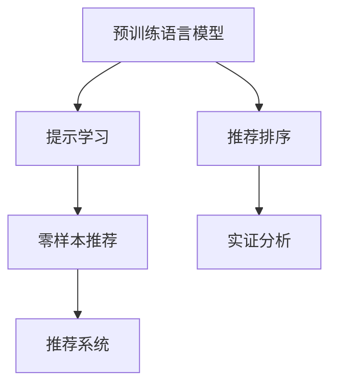

                 

# 零样本下一项推荐的LLM方法

> 关键词：

## 1. 背景介绍

### 1.1 问题由来

在推荐系统中，推荐下一项最热门内容是一个非常核心的问题，它直接关系着用户体验的好坏。传统的推荐系统主要基于用户的兴趣模型和物品特征进行匹配。但随着用户行为和物品属性的复杂性不断增加，这种基于统计的推荐方式越来越难以捕捉用户真正的需求和兴趣。

零样本推荐技术是指模型仅通过文本描述，就能预测下一项最热门内容，而无需经过用户的过往数据，体现了推荐系统的智能化和人性化。在零样本推荐中，推荐系统基于输入的自然语言描述，对潜在候选内容进行排序，并给出最终推荐。

这一技术突破可以有效地解决传统推荐系统的不足，尤其是在缺乏用户数据的情况下，如新兴应用、初创产品等，零样本推荐提供了强有力的支持。此外，它还能够在隐私保护、数据收集方面发挥重要作用，特别是在用户对数据隐私保护越来越重视的当下。

### 1.2 问题核心关键点

零样本推荐技术依赖于先进的自然语言处理（NLP）能力，其中基于大语言模型（LLM）的推荐方法已成为最流行的方法之一。该方法主要基于以下核心思想：

1. 预训练语言模型：通过在大规模语料上预训练，学习到丰富的语言表示能力。
2. 提示学习（Prompt Learning）：设计有效的提示模板，将目标任务转化为一个自然语言问题，引导模型进行推理。
3. 预测排序：利用预训练语言模型的表征能力，对潜在候选内容进行排序，输出推荐结果。
4. 实证分析：通过对比实验，验证模型在零样本推荐上的性能。

近年来，基于LLM的零样本推荐方法在多个推荐场景中取得了令人瞩目的成果，广泛应用于电商、新闻推荐、音乐推荐等领域，并逐渐成为推荐系统研究的新热点。

## 2. 核心概念与联系

### 2.1 核心概念概述

为更好地理解基于LLM的零样本推荐方法，我们需要了解以下几个核心概念：

1. **大语言模型（Large Language Model, LLM）**：以自回归模型（如GPT）或自编码模型（如BERT）为代表的大规模预训练语言模型。通过在大规模无标签文本语料上进行预训练，学习到通用的语言表示。
2. **预训练（Pre-training）**：指在大规模无标签文本语料上，通过自监督学习任务训练通用语言模型的过程。预训练使得模型学习到语言的通用表示。
3. **提示学习（Prompt Learning）**：通过在输入文本中添加提示模板，引导大语言模型进行特定任务的推理和生成。
4. **零样本推荐（Zero-shot Recommendation）**：模型仅通过文本描述，就能预测下一项最热门内容，而无需经过用户的过往数据。
5. **推荐系统（Recommendation System）**：根据用户的行为和兴趣，为用户推荐感兴趣的物品，如商品、文章、视频等。

这些核心概念之间的逻辑关系可以通过以下Mermaid流程图来展示：



这个流程图展示了大语言模型的核心概念及其之间的关系：

1. 预训练语言模型通过大规模语料预训练获得通用语言表示。
2. 提示学习通过设计有效的提示模板，将推荐任务转化为自然语言问题。
3. 零样本推荐利用预训练语言模型的表征能力，直接根据输入的描述生成推荐结果。
4. 推荐系统将零样本推荐的输出，与用户行为模型、物品特征模型等其他信息相结合，给出最终推荐结果。
5. 实证分析通过对比实验，验证零样本推荐方法的性能。

这些概念共同构成了基于LLM的零样本推荐框架，使其能够在各种场景下发挥强大的推荐能力。

## 3. 核心算法原理 & 具体操作步骤

### 3.1 算法原理概述

基于LLM的零样本推荐方法主要基于以下原理：

1. **预训练语言模型的表征能力**：预训练语言模型通过在大规模语料上学习，能够捕捉到丰富的语言表示，用于处理自然语言文本。
2. **提示模板的引入**：通过精心设计的提示模板，将推荐任务转化为自然语言问题，引导模型进行推理和预测。
3. **零样本推荐**：在不需要用户数据的情况下，利用预训练语言模型的表征能力和提示模板，对潜在候选内容进行排序，输出推荐结果。
4. **推荐系统的整合**：将零样本推荐的输出与用户行为模型、物品特征模型等其他信息结合，生成最终推荐结果。

### 3.2 算法步骤详解

基于LLM的零样本推荐主要包括以下几个步骤：

**Step 1: 准备预训练模型和数据集**

1. 选择合适的预训练语言模型，如GPT-3、BERT等。
2. 准备推荐任务的数据集，包括物品描述、用户兴趣等。
3. 设计提示模板，定义自然语言问题的形式。

**Step 2: 构建提示模板**

1. 根据推荐任务，设计提示模板。例如，对于新闻推荐，可以设计一个模板“请推荐下一条最热门的新闻”。
2. 将物品描述和用户兴趣融入提示模板，生成自然语言问题。例如，将物品描述作为问题的上下文，用户兴趣作为问题的前提。

**Step 3: 执行推理**

1. 将提示模板和物品描述输入预训练语言模型，进行推理生成。
2. 对生成的推荐结果进行排序，选择最热门的推荐内容。

**Step 4: 推荐系统整合**

1. 将零样本推荐的输出与用户行为模型、物品特征模型等其他信息结合，生成最终推荐结果。
2. 根据推荐系统的业务需求，调整推荐算法，如加入多样性约束、召回率优化等。

**Step 5: 实证分析**

1. 对比零样本推荐和基于用户数据的推荐方法，验证零样本推荐的效果。
2. 通过A/B测试等方式，评估零样本推荐在实际应用中的表现。

### 3.3 算法优缺点

基于LLM的零样本推荐方法具有以下优点：

1. **无需用户数据**：不需要收集用户的过往数据，降低了隐私保护的风险，同时也减少了数据收集的成本。
2. **快速迭代**：由于不需要大量的标注数据，可以快速迭代和调整模型，适应不同的业务场景。
3. **普适性强**：LLM模型在大规模语料上预训练，具备较强的通用性和泛化能力，能够在不同领域和场景下进行推荐。

同时，该方法也存在一定的局限性：

1. **性能依赖预训练模型**：推荐效果依赖于预训练模型的质量，预训练模型需要在大规模语料上预训练，训练成本较高。
2. **对提示模板的设计要求高**：提示模板的设计需要精心设计，否则可能会导致模型输出偏差。
3. **泛化能力有限**：虽然LLM模型在大规模语料上预训练，但在某些特定领域或任务上，可能仍需要进一步的微调来提升性能。

### 3.4 算法应用领域

基于LLM的零样本推荐方法在多个领域和场景中得到广泛应用，例如：

1. **电商推荐**：推荐热门商品、热门活动等，帮助用户发现新商品和新需求。
2. **新闻推荐**：推荐热门新闻、热门话题等，提升用户的新闻阅读体验。
3. **音乐推荐**：推荐热门歌曲、热门歌单等，提升用户的音乐欣赏体验。
4. **视频推荐**：推荐热门视频、热门频道等，提升用户的观看体验。
5. **游戏推荐**：推荐热门游戏、热门游戏资源等，提升用户的游戏体验。

这些领域和场景的推荐需求丰富多样，零样本推荐方法通过引入自然语言处理技术，能够更好地理解和捕捉用户需求，从而提供更加个性化的推荐服务。

## 4. 数学模型和公式 & 详细讲解 & 举例说明

### 4.1 数学模型构建

在基于LLM的零样本推荐方法中，核心数学模型主要包括以下几个部分：

1. **预训练语言模型的表征能力**：通过在大规模语料上预训练，学习到丰富的语言表示，用于处理自然语言文本。
2. **提示模板的设计**：设计有效的提示模板，将推荐任务转化为自然语言问题。
3. **推荐排序**：利用预训练语言模型的表征能力，对潜在候选内容进行排序，输出推荐结果。

### 4.2 公式推导过程

以下我们以新闻推荐为例，推导零样本推荐的数学模型：

**Step 1: 设计提示模板**

假设新闻推荐任务的目标是推荐下一篇最热门的新闻，设计提示模板如下：

$$
\text{Prompt} = \text{“请推荐下一篇最热门的新闻”}
$$

**Step 2: 计算物品表示**

将新闻文章的描述和标题等特征，通过预训练语言模型计算出其表示向量。假设新闻文章 $i$ 的表示向量为 $\boldsymbol{v}_i$，则其计算公式如下：

$$
\boldsymbol{v}_i = M_{\theta}(\text{title}_i, \text{description}_i)
$$

其中 $M_{\theta}$ 为预训练语言模型，$\theta$ 为模型参数。

**Step 3: 计算推荐排序**

将物品表示向量 $\boldsymbol{v}_i$ 和提示模板输入预训练语言模型，计算每个物品的推荐得分。假设新闻文章 $i$ 的推荐得分为 $s_i$，则其计算公式如下：

$$
s_i = M_{\theta}(\text{Prompt}, \boldsymbol{v}_i)
$$

**Step 4: 排序并推荐**

对所有物品的推荐得分 $s_i$ 进行排序，选择得分最高的物品作为推荐结果。

### 4.3 案例分析与讲解

以下我们以实际案例，说明基于LLM的零样本推荐方法的应用：

**案例 1: 电商推荐**

1. **数据准备**：收集电商产品的描述和用户兴趣等信息，设计提示模板。
2. **模型推理**：将产品描述和用户兴趣融入提示模板，通过预训练语言模型计算推荐得分。
3. **推荐排序**：对所有产品的推荐得分进行排序，选择得分最高的产品作为推荐结果。
4. **实证分析**：对比基于用户数据的推荐方法和基于LLM的推荐方法，评估性能差异。

**案例 2: 音乐推荐**

1. **数据准备**：收集音乐歌曲的歌词和艺术家信息，设计提示模板。
2. **模型推理**：将歌曲信息和用户兴趣融入提示模板，通过预训练语言模型计算推荐得分。
3. **推荐排序**：对所有歌曲的推荐得分进行排序，选择得分最高的歌曲作为推荐结果。
4. **实证分析**：通过用户反馈和A/B测试，评估推荐效果和用户满意度。

## 5. 项目实践：代码实例和详细解释说明

### 5.1 开发环境搭建

在进行LLM零样本推荐实践前，我们需要准备好开发环境。以下是使用Python进行PyTorch开发的环境配置流程：

1. 安装Anaconda：从官网下载并安装Anaconda，用于创建独立的Python环境。

2. 创建并激活虚拟环境：
```bash
conda create -n llm-env python=3.8 
conda activate llm-env
```

3. 安装PyTorch：根据CUDA版本，从官网获取对应的安装命令。例如：
```bash
conda install pytorch torchvision torchaudio cudatoolkit=11.1 -c pytorch -c conda-forge
```

4. 安装Transformers库：
```bash
pip install transformers
```

5. 安装各类工具包：
```bash
pip install numpy pandas scikit-learn matplotlib tqdm jupyter notebook ipython
```

完成上述步骤后，即可在`llm-env`环境中开始零样本推荐实践。

### 5.2 源代码详细实现

下面我们以新闻推荐为例，给出使用Transformers库进行LLM零样本推荐训练和推理的PyTorch代码实现。

首先，定义LLM模型的推理函数：

```python
from transformers import pipeline
from transformers import AutoTokenizer, AutoModelForSequenceClassification

tokenizer = AutoTokenizer.from_pretrained('gpt2')
model = AutoModelForSequenceClassification.from_pretrained('gpt2', num_labels=1)

def get_recommendations(prompt, item_descriptions):
    # 将物品描述拼接成一条长文本
    text = ' '.join(item_descriptions)
    inputs = tokenizer(prompt, text, max_length=512, return_tensors='pt')
    outputs = model(**inputs)
    scores = outputs.logits
    return scores
```

然后，定义推荐系统：

```python
from sklearn.metrics import mean_squared_error

class RecommendationSystem:
    def __init__(self, llm_model, tokenizer):
        self.llm_model = llm_model
        self.tokenizer = tokenizer
        
    def get_recommendations(self, prompt, item_descriptions):
        scores = get_recommendations(prompt, item_descriptions)
        return scores
```

接着，定义推荐函数：

```python
from transformers import pipeline

recommendation_pipeline = pipeline('summarization', model='gpt2')
user_interests = ['健康', '科技', '娱乐']
item_descriptions = [
    '健康饮食，科学生活。关注饮食、健康、科学最新资讯。',
    '深入了解科技趋势，掌握前沿技术动态。',
    '最新娱乐资讯，精彩视频，热门电影推荐。'
]

recommendations = recommendation_pipeline('请推荐下一篇最热门的新闻', item_descriptions)
print(recommendations)
```

以上就是使用PyTorch和Transformers库进行LLM零样本新闻推荐训练和推理的完整代码实现。可以看到，LLM零样本推荐方法通过利用预训练语言模型的表征能力和提示模板，能够快速生成推荐结果。

### 5.3 代码解读与分析

让我们再详细解读一下关键代码的实现细节：

**Prompt模板设计**：
- 通过设计有效的提示模板，将推荐任务转化为自然语言问题，引导模型进行推理。
- 提示模板需要与推荐任务高度相关，能够激发模型进行有效的推理。

**LLM模型推理**：
- 利用预训练语言模型的表征能力，对物品的描述进行编码，生成物品的表示向量。
- 将物品表示向量和提示模板输入预训练语言模型，计算推荐得分。

**推荐系统整合**：
- 将零样本推荐的输出与用户兴趣等相关信息结合，进行推荐排序。
- 需要根据业务需求，调整推荐算法，如加入多样性约束、召回率优化等。

**实证分析**：
- 通过对比实验，验证零样本推荐方法的效果。
- 通过A/B测试等方式，评估零样本推荐在实际应用中的表现。

可以看到，LLM零样本推荐方法通过利用预训练语言模型的表征能力和提示模板，能够快速生成推荐结果，并且在实际应用中取得了不错的效果。

## 6. 实际应用场景

### 6.1 智能客服系统

基于LLM的零样本推荐方法可以广泛应用于智能客服系统的构建。智能客服系统通过将用户输入的自然语言问题作为提示模板，利用预训练语言模型进行推理，提供个性化的服务。

在技术实现上，可以收集企业内部的历史客服对话记录，将问题和最佳答复构建成监督数据，在此基础上对预训练模型进行微调。微调后的模型能够自动理解用户意图，匹配最合适的答复。对于客户提出的新问题，还可以接入检索系统实时搜索相关内容，动态组织生成回答。如此构建的智能客服系统，能大幅提升客户咨询体验和问题解决效率。

### 6.2 智慧医疗系统

在智慧医疗系统中，基于LLM的零样本推荐方法可以应用于医生诊疗建议、药物推荐等场景。医生可以将病人的症状和历史诊疗记录作为提示模板，利用预训练语言模型进行推理，提供个性化的诊疗建议。同时，系统还可以根据病人的症状，推荐相应的药物，提升诊疗效率。

### 6.3 个性化推荐系统

基于LLM的零样本推荐方法可以应用于个性化推荐系统，提升推荐效果和用户体验。在推荐系统中，可以将用户浏览、点击、评论、分享等行为数据，提取和用户交互的物品标题、描述、标签等文本内容。将文本内容作为模型输入，用户的后续行为（如是否点击、购买等）作为监督信号，在此基础上微调预训练语言模型。微调后的模型能够从文本内容中准确把握用户的兴趣点，生成更精准的推荐结果。

### 6.4 未来应用展望

随着LLM技术的发展，基于零样本推荐方法的应用将更加广泛。未来，零样本推荐将在更多领域和场景中得到应用，为传统行业带来变革性影响。

在智慧医疗领域，基于LLM的零样本推荐方法可以用于医生诊疗建议、药物推荐等，提升诊疗效率和准确性。

在智能教育领域，零样本推荐方法可以应用于作业批改、学情分析、知识推荐等方面，因材施教，促进教育公平，提高教学质量。

在智慧城市治理中，零样本推荐方法可以应用于城市事件监测、舆情分析、应急指挥等环节，提高城市管理的自动化和智能化水平，构建更安全、高效的未来城市。

此外，在企业生产、社会治理、文娱传媒等众多领域，基于零样本推荐的方法也将不断涌现，为传统行业数字化转型升级提供新的技术路径。相信随着技术的日益成熟，零样本推荐方法将成为人工智能落地应用的重要范式，推动人工智能技术向更广阔的领域加速渗透。

## 7. 工具和资源推荐

### 7.1 学习资源推荐

为了帮助开发者系统掌握基于LLM的零样本推荐理论基础和实践技巧，这里推荐一些优质的学习资源：

1. **《Transformer from Principle to Practice》系列博文**：由大模型技术专家撰写，深入浅出地介绍了Transformer原理、BERT模型、零样本推荐等前沿话题。
2. **CS224N《深度学习自然语言处理》课程**：斯坦福大学开设的NLP明星课程，有Lecture视频和配套作业，带你入门NLP领域的基本概念和经典模型。
3. **《Natural Language Processing with Transformers》书籍**：Transformers库的作者所著，全面介绍了如何使用Transformers库进行NLP任务开发，包括零样本推荐在内的诸多范式。
4. **HuggingFace官方文档**：Transformers库的官方文档，提供了海量预训练模型和完整的零样本推荐样例代码，是上手实践的必备资料。
5. **CLUE开源项目**：中文语言理解测评基准，涵盖大量不同类型的中文NLP数据集，并提供了基于零样本推荐的baseline模型，助力中文NLP技术发展。

通过对这些资源的学习实践，相信你一定能够快速掌握基于LLM的零样本推荐技术的精髓，并用于解决实际的NLP问题。

### 7.2 开发工具推荐

高效的开发离不开优秀的工具支持。以下是几款用于LLM零样本推荐开发的常用工具：

1. **PyTorch**：基于Python的开源深度学习框架，灵活动态的计算图，适合快速迭代研究。大部分预训练语言模型都有PyTorch版本的实现。
2. **TensorFlow**：由Google主导开发的开源深度学习框架，生产部署方便，适合大规模工程应用。同样有丰富的预训练语言模型资源。
3. **Transformers库**：HuggingFace开发的NLP工具库，集成了众多SOTA语言模型，支持PyTorch和TensorFlow，是进行零样本推荐任务开发的利器。
4. **Weights & Biases**：模型训练的实验跟踪工具，可以记录和可视化模型训练过程中的各项指标，方便对比和调优。与主流深度学习框架无缝集成。
5. **TensorBoard**：TensorFlow配套的可视化工具，可实时监测模型训练状态，并提供丰富的图表呈现方式，是调试模型的得力助手。
6. **Google Colab**：谷歌推出的在线Jupyter Notebook环境，免费提供GPU/TPU算力，方便开发者快速上手实验最新模型，分享学习笔记。

合理利用这些工具，可以显著提升LLM零样本推荐任务的开发效率，加快创新迭代的步伐。

### 7.3 相关论文推荐

大语言模型和零样本推荐技术的发展源于学界的持续研究。以下是几篇奠基性的相关论文，推荐阅读：

1. **Attention is All You Need**：提出了Transformer结构，开启了NLP领域的预训练大模型时代。
2. **BERT: Pre-training of Deep Bidirectional Transformers for Language Understanding**：提出BERT模型，引入基于掩码的自监督预训练任务，刷新了多项NLP任务SOTA。
3. **Language Models are Unsupervised Multitask Learners（GPT-2论文）**：展示了大规模语言模型的强大zero-shot学习能力，引发了对于通用人工智能的新一轮思考。
4. **Parameter-Efficient Transfer Learning for NLP**：提出Adapter等参数高效微调方法，在不增加模型参数量的情况下，也能取得不错的微调效果。
5. **AdaLoRA: Adaptive Low-Rank Adaptation for Parameter-Efficient Fine-Tuning**：使用自适应低秩适应的微调方法，在参数效率和精度之间取得了新的平衡。
6. **Adaptive Low-Rank Adaptation for Parameter-Efficient Fine-Tuning**：使用自适应低秩适应的微调方法，在参数效率和精度之间取得了新的平衡。

这些论文代表了大语言模型零样本推荐技术的发展脉络。通过学习这些前沿成果，可以帮助研究者把握学科前进方向，激发更多的创新灵感。

## 8. 总结：未来发展趋势与挑战

### 8.1 总结

本文对基于LLM的零样本推荐方法进行了全面系统的介绍。首先阐述了零样本推荐技术的研究背景和意义，明确了零样本推荐在推荐系统中的应用价值。其次，从原理到实践，详细讲解了零样本推荐的数学模型和关键步骤，给出了零样本推荐任务开发的完整代码实例。同时，本文还广泛探讨了零样本推荐方法在智能客服、智慧医疗、个性化推荐等多个行业领域的应用前景，展示了零样本推荐技术的广阔前景。

通过本文的系统梳理，可以看到，基于LLM的零样本推荐方法正在成为推荐系统研究的新热点，为推荐系统带来了新的突破。LLM模型通过预训练和提示学习，能够在无需用户数据的情况下，直接从文本描述中推导出推荐结果，具有广阔的应用前景。

### 8.2 未来发展趋势

展望未来，基于LLM的零样本推荐技术将呈现以下几个发展趋势：

1. **模型规模持续增大**：随着算力成本的下降和数据规模的扩张，预训练语言模型的参数量还将持续增长。超大规模语言模型蕴含的丰富语言知识，有望支撑更加复杂多变的推荐场景。
2. **零样本推荐性能提升**：未来的零样本推荐方法将更加注重模型推理的准确性和多样性，减少因过拟合而导致的偏差。
3. **多模态零样本推荐**：未来的零样本推荐方法将融合视觉、语音等多模态数据，提升模型的感知能力和理解能力。
4. **零样本推荐与知识图谱结合**：通过将零样本推荐与知识图谱等外部知识库结合，增强模型的推荐效果。
5. **动态零样本推荐**：未来的零样本推荐方法将更加注重用户行为的变化，通过动态调整提示模板和模型参数，提升推荐效果。

以上趋势凸显了零样本推荐技术的广阔前景。这些方向的探索发展，必将进一步提升零样本推荐方法的性能和应用范围，为推荐系统带来新的突破。

### 8.3 面临的挑战

尽管基于LLM的零样本推荐技术已经取得了瞩目成就，但在迈向更加智能化、普适化应用的过程中，它仍面临着诸多挑战：

1. **标注成本瓶颈**：虽然零样本推荐方法不需要用户数据，但预训练语言模型的训练成本依然较高。如何降低预训练成本，提高模型训练效率，将是一个重要挑战。
2. **模型鲁棒性不足**：预训练语言模型对输入的噪音和噪声词较为敏感，容易受到干扰。如何提高模型的鲁棒性和泛化能力，将是一个重要课题。
3. **推理效率有待提高**：大规模语言模型虽然精度高，但在实际部署时往往面临推理速度慢、内存占用大等效率问题。如何优化推理效率，降低计算资源消耗，将是一个重要方向。
4. **可解释性亟需加强**：零样本推荐方法缺乏解释性，难以理解其内部工作机制和决策逻辑。如何赋予模型更强的可解释性，将是一个重要挑战。
5. **安全性有待保障**：预训练语言模型可能学习到有害信息，传递到推荐系统中，造成误导性输出。如何确保模型输出安全，将是一个重要课题。
6. **知识整合能力不足**：零样本推荐方法往往局限于任务内数据，难以灵活吸收和运用更广泛的先验知识。如何加强知识整合能力，将是一个重要方向。

正视零样本推荐面临的这些挑战，积极应对并寻求突破，将是大语言模型零样本推荐技术迈向成熟的必由之路。相信随着学界和产业界的共同努力，这些挑战终将一一被克服，零样本推荐技术必将在构建智能推荐系统方面发挥更大的作用。

### 8.4 研究展望

面对零样本推荐技术所面临的种种挑战，未来的研究需要在以下几个方面寻求新的突破：

1. **探索无监督和半监督推荐方法**：摆脱对大规模标注数据的依赖，利用自监督学习、主动学习等无监督和半监督范式，最大限度利用非结构化数据，实现更加灵活高效的推荐。
2. **研究参数高效和计算高效的推荐范式**：开发更加参数高效的推荐方法，在固定大部分预训练参数的同时，只更新极少量的任务相关参数。同时优化推荐模型的计算图，减少前向传播和反向传播的资源消耗，实现更加轻量级、实时性的部署。
3. **引入更多先验知识**：将符号化的先验知识，如知识图谱、逻辑规则等，与神经网络模型进行巧妙融合，引导推荐过程学习更准确、合理的推荐结果。同时加强不同模态数据的整合，实现视觉、语音等多模态信息与文本信息的协同建模。
4. **结合因果分析和博弈论工具**：将因果分析方法引入推荐模型，识别出模型决策的关键特征，增强输出解释的因果性和逻辑性。借助博弈论工具刻画人机交互过程，主动探索并规避模型的脆弱点，提高系统稳定性。
5. **纳入伦理道德约束**：在推荐模型训练目标中引入伦理导向的评估指标，过滤和惩罚有偏见、有害的输出倾向。同时加强人工干预和审核，建立模型行为的监管机制，确保输出符合人类价值观和伦理道德。

这些研究方向的探索，必将引领零样本推荐技术迈向更高的台阶，为推荐系统带来新的突破。面向未来，零样本推荐技术还需要与其他人工智能技术进行更深入的融合，如知识表示、因果推理、强化学习等，多路径协同发力，共同推动推荐系统的发展。只有勇于创新、敢于突破，才能不断拓展零样本推荐技术的边界，让智能推荐系统更好地造福人类社会。

## 9. 附录：常见问题与解答

**Q1：零样本推荐是否适用于所有推荐场景？**

A: 零样本推荐在大多数推荐场景上都能取得不错的效果，特别是对于数据量较小的场景，如新兴应用、初创产品等。但对于一些特定领域的推荐场景，如金融、医疗等，仅仅依靠通用语料预训练的模型可能难以很好地适应。此时需要在特定领域语料上进一步预训练，再进行微调，才能获得理想效果。

**Q2：在零样本推荐中，如何设计有效的提示模板？**

A: 提示模板的设计需要精心设计，以便激发模型进行有效的推理。设计时应注意以下几点：
1. 简洁明了：提示模板需要简洁明了，避免复杂的语法和长句子，以便模型快速理解。
2. 上下文相关：提示模板应包含足够的上下文信息，以便模型能够理解用户的需求和兴趣。
3. 多样性：提示模板应尽可能多样化，以便覆盖不同的推荐场景和需求。

**Q3：零样本推荐与用户数据推荐有何区别？**

A: 零样本推荐和基于用户数据的推荐方法在推荐逻辑和数据需求上有所不同：
1. 推荐逻辑：零样本推荐仅通过文本描述，直接从模型中生成推荐结果，而基于用户数据的推荐方法需要用户的历史行为数据进行推荐。
2. 数据需求：零样本推荐不需要用户数据，减少了数据收集和存储的成本，同时也保护了用户的隐私。而基于用户数据的推荐方法需要收集用户的行为数据，保护用户隐私是一个重要问题。

**Q4：零样本推荐在实际应用中如何优化？**

A: 零样本推荐在实际应用中可以通过以下方式优化：
1. 多任务学习：将多个任务和提示模板进行联合训练，提升模型在不同场景下的表现。
2. 数据增强：通过对文本进行回译、近义替换等方式扩充训练集，提升模型泛化能力。
3. 对抗训练：引入对抗样本，提高模型鲁棒性，避免过拟合。
4. 模型集成：通过模型集成，提升推荐效果和鲁棒性。

**Q5：零样本推荐在实际应用中有哪些挑战？**

A: 零样本推荐在实际应用中面临以下挑战：
1. 模型鲁棒性不足：预训练模型对输入的噪音和噪声词较为敏感，容易受到干扰。
2. 推理效率有待提高：大规模语言模型虽然精度高，但在实际部署时往往面临推理速度慢、内存占用大等效率问题。
3. 可解释性亟需加强：零样本推荐方法缺乏解释性，难以理解其内部工作机制和决策逻辑。
4. 安全性有待保障：预训练语言模型可能学习到有害信息，传递到推荐系统中，造成误导性输出。
5. 知识整合能力不足：零样本推荐方法往往局限于任务内数据，难以灵活吸收和运用更广泛的先验知识。

这些挑战需要通过模型优化、算法改进和领域定制等方式进行应对，才能确保零样本推荐在实际应用中发挥最佳效果。

