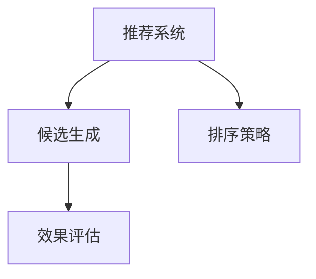

                 

# 零样本推荐系统的候选生成策略：排序与效果

> 关键词：零样本推荐、推荐系统、候选生成、排序策略、效果评估

## 1. 背景介绍

推荐系统作为现代互联网的核心业务之一，在电商、社交、娱乐等领域广泛应用。然而，推荐系统设计复杂，在资源受限的情况下难以满足所有用户的个性化需求。近年来，零样本推荐技术兴起，通过在推荐模型中引入更高级的决策策略，能够在无需额外训练数据的情况下，提升推荐效果，优化用户体验。

零样本推荐系统的主要挑战在于候选生成的多样性和用户反馈的稀疏性。候选生成需要根据用户的历史行为和实时状态，自动产生多个推荐结果，以供用户选择。排序则需将这些候选推荐进行有效排序，最终输出排名最高的若干个候选。本文将详细探讨零样本推荐系统的候选生成和排序策略，以及它们在实际应用中的效果和挑战。

## 2. 核心概念与联系

### 2.1 核心概念概述

为理解零样本推荐系统的候选生成和排序策略，首先需要明确几个关键概念：

- 推荐系统(Recommendation System)：使用算法对用户进行行为分析，推荐物品给用户的技术系统。传统推荐方法包括基于协同过滤、内容推荐等，而零样本推荐强调模型泛化能力，可在无标签数据上产生高质量的推荐结果。

- 候选生成(Candidate Generation)：根据用户的历史行为和实时状态，自动生成多个候选物品供用户选择。候选生成策略往往需要考虑物品多样性、用户兴趣等多个因素。

- 排序策略(Ranking Strategy)：将候选物品进行排序，并返回排名靠前的若干个物品。排序策略通常采用评分模型、协同过滤等方法，需兼顾物品的实时性、新颖性和个性化。

- 效果评估(Metric Evaluation)：衡量推荐系统性能的指标，包括准确率、召回率、F1值、AUC等，常用的数据集有Trustlet、Yahoo Dataset等。

这些概念之间的联系可以通过以下Mermaid流程图来展示：



这个流程图展示推荐系统中的关键模块及其逻辑关系：

1. 推荐系统收集用户行为数据，并将其作为输入，通过候选生成和排序策略产生推荐结果。
2. 候选生成策略需考虑多样性、新颖性等多个因素，生成多候选物品。
3. 排序策略通过评分模型等方法，将候选物品排序，产生推荐结果。
4. 效果评估指标对推荐结果进行打分，衡量推荐系统的性能。

### 2.2 核心概念原理和架构

推荐系统通过模型学习用户行为和物品属性，为用户生成个性化推荐。候选生成和排序策略是推荐系统的关键组成部分。

**候选生成**：
- 基于协同过滤的策略：利用用户与物品之间的交互历史，计算用户对物品的兴趣度，生成与用户历史行为相似的物品作为候选。
- 基于内容的策略：根据物品的元数据（如标签、类别）生成与用户偏好相似的物品。
- 基于矩阵分解的策略：利用用户-物品矩阵，通过矩阵分解技术生成推荐候选。
- 基于深度学习的策略：通过多任务学习、生成对抗网络等深度学习模型，生成物品的多样性推荐。

**排序策略**：
- 基于学习的排序：利用评分模型、多任务学习等方法，预测物品对用户的吸引力，进行排序。
- 基于规则的排序：根据物品的属性和用户偏好，制定排序规则，如距离、时效性等。

这些策略和原理构成了零样本推荐系统的基本框架，其核心在于通过多任务学习和迁移学习等方法，利用预训练模型生成高质量的推荐候选和排序结果。

## 3. 核心算法原理 & 具体操作步骤

### 3.1 算法原理概述

零样本推荐系统的核心算法原理基于迁移学习和多任务学习。通过预训练模型在不同推荐任务上的迁移，生成高质量的推荐候选。同时，利用多任务学习的思想，在候选生成和排序之间建立联系，实现对用户行为的全面建模。

**迁移学习**：
- 迁移学习是指利用预训练模型在不同任务上的知识迁移，提升新任务上的性能。在零样本推荐中，可以利用预训练模型在多物品、多用户上的知识，生成多样性的推荐候选。

**多任务学习**：
- 多任务学习是指在多个相关任务上共同训练模型，共享模型的中间特征表示，提升模型的泛化能力。在零样本推荐中，可以将候选生成和排序视为两个相关任务，共享预训练模型的中间表示，实现更优的推荐效果。

### 3.2 算法步骤详解

**Step 1: 预训练模型准备**
- 选择合适的预训练模型，如BERT、XLNet等，作为零样本推荐的初始模型。
- 对预训练模型进行微调，以便在不同推荐任务上生成多样性的推荐候选。

**Step 2: 候选生成策略设计**
- 根据推荐任务，设计候选生成策略，如协同过滤、内容推荐、矩阵分解等。
- 利用多任务学习的思想，将候选生成和排序策略关联起来，实现对用户行为的全面建模。

**Step 3: 候选排序策略设计**
- 选择合适的排序策略，如评分模型、协同过滤等。
- 利用多任务学习，将候选生成和排序策略视为同一任务的不同阶段，共享模型中间特征。

**Step 4: 效果评估与优化**
- 设计合适的效果评估指标，如准确率、召回率、F1值等。
- 使用A/B测试等方法，评估模型在不同用户群体的效果，并根据评估结果进行优化。

**Step 5: 部署与监控**
- 将优化后的模型部署到生产环境。
- 实时监控推荐系统性能，根据反馈数据进行动态调整和优化。

### 3.3 算法优缺点

零样本推荐系统的候选生成和排序策略具有以下优点：
1. 能够提升推荐系统在稀疏数据上的性能，减少对额外标注数据的依赖。
2. 能够在无需重新训练的情况下，利用预训练模型生成高质量的推荐候选。
3. 利用多任务学习提升模型的泛化能力，生成更多样化的推荐结果。

同时，这些策略也存在一些缺点：
1. 对预训练模型的质量要求较高，模型的泛化能力和迁移学习效果直接影响推荐效果。
2. 候选生成策略需考虑多样性、新颖性等多个因素，设计复杂且效果难以评估。
3. 排序策略需兼顾物品的实时性、新颖性和个性化，对推荐模型提出了较高要求。

### 3.4 算法应用领域

零样本推荐系统的主要应用领域包括但不限于：
1. 电商推荐：为购物用户推荐商品，提高用户购买转化率。
2. 社交推荐：为社交用户推荐内容，增加用户粘性和活跃度。
3. 视频推荐：为用户推荐视频内容，提升平台流量和用户满意度。
4. 音乐推荐：为用户推荐音乐，增加用户留存率和音乐播放量。

这些领域中，零样本推荐系统的应用均能显著提升用户体验和平台收益，具有重要的实际价值。

## 4. 数学模型和公式 & 详细讲解 & 举例说明

### 4.1 数学模型构建

零样本推荐系统的数学模型构建基于迁移学习和多任务学习框架。假设用户 $u$ 对物品 $i$ 的兴趣度为 $r_{ui}$，则候选生成和排序可以建模为如下公式：

$$
\max_{\theta} \sum_{u \in U} \sum_{i \in I} r_{ui} \cdot \mathbf{f}_u(\mathbf{x}_i; \theta)
$$

其中 $\theta$ 为模型参数，$\mathbf{f}_u(\mathbf{x}_i; \theta)$ 为生成用户 $u$ 对物品 $i$ 兴趣度的函数，$\mathbf{x}_i$ 为物品 $i$ 的属性向量。

### 4.2 公式推导过程

利用多任务学习框架，可以将候选生成和排序视为同一任务的不同阶段，通过共享中间特征表示，提升模型性能。设 $\mathbf{z}_u$ 为生成用户 $u$ 对物品 $i$ 兴趣度的中间特征向量，则有：

$$
\mathbf{z}_u = \mathbf{f}_u(\mathbf{x}_i; \theta)
$$

排序策略需根据物品的实时性、新颖性等特征，对 $\mathbf{z}_u$ 进行排序。假设排序函数为 $g$，则排序结果为：

$$
\arg \max_i g(\mathbf{z}_u^i; \theta)
$$

其中 $\mathbf{z}_u^i$ 表示物品 $i$ 在用户 $u$ 上的中间特征表示。

### 4.3 案例分析与讲解

以下以协同过滤为例，详细讲解零样本推荐系统的候选生成和排序策略。

**协同过滤候选人生成**：
- 利用用户与物品之间的交互历史，计算用户对物品的兴趣度。
- 选择兴趣度较高的物品作为推荐候选，同时考虑物品多样性。

**排序策略**：
- 利用评分模型，计算物品对用户的吸引力。
- 根据用户历史行为和实时状态，调整评分模型的参数，提升推荐效果。

## 5. 项目实践：代码实例和详细解释说明

### 5.1 开发环境搭建

在开发零样本推荐系统前，需要先搭建好开发环境。以下是使用Python和PyTorch进行开发的环境配置流程：

1. 安装Anaconda：从官网下载并安装Anaconda，用于创建独立的Python环境。

2. 创建并激活虚拟环境：
```bash
conda create -n recsys-env python=3.8 
conda activate recsys-env
```

3. 安装PyTorch：根据CUDA版本，从官网获取对应的安装命令。例如：
```bash
conda install pytorch torchvision torchaudio cudatoolkit=11.1 -c pytorch -c conda-forge
```

4. 安装TensorBoard：用于可视化模型训练过程和效果。

```bash
pip install tensorboard
```

5. 安装相关依赖：
```bash
pip install torch nn scikit-learn sklearn.metrics pandas numpy
```

完成上述步骤后，即可在`recsys-env`环境中开始零样本推荐系统的开发。

### 5.2 源代码详细实现

这里我们以协同过滤为例，展示零样本推荐系统的候选生成和排序策略的代码实现。

```python
import torch
import torch.nn as nn
import torch.optim as optim
from sklearn.metrics import precision_recall_fscore_support

# 定义协同过滤模型
class CollaborativeFiltering(nn.Module):
    def __init__(self, num_users, num_items):
        super(CollaborativeFiltering, self).__init__()
        self.user_matrix = nn.Parameter(torch.randn(num_users, num_items))
        self.item_matrix = nn.Parameter(torch.randn(num_items, num_items))
        self.sr_matrix = nn.Parameter(torch.randn(num_users, num_items))
    
    def forward(self, user, item):
        user_u = torch.mm(self.user_matrix, user)
        item_i = torch.mm(self.item_matrix, item)
        sr = torch.matmul(user_u, item_i.t())
        return sr
    
# 定义损失函数
def loss_function(sr_matrix, user, item):
    return nn.MSELoss()(sr_matrix, user * item)
    
# 定义评分模型
class RatingModel(nn.Module):
    def __init__(self, num_users, num_items):
        super(RatingModel, self).__init__()
        self.emb_user = nn.Embedding(num_users, 100)
        self.emb_item = nn.Embedding(num_items, 100)
        self.fc = nn.Linear(200, 1)
    
    def forward(self, user, item):
        user_emb = self.emb_user(user)
        item_emb = self.emb_item(item)
        item_emb = item_emb.view(-1, 100)
        user_emb = user_emb.view(-1, 100)
        x = torch.cat([user_emb, item_emb], dim=1)
        pred = self.fc(x)
        return pred
    
# 加载数据集
user_data = ...
item_data = ...
train_data = ...
train_labels = ...
```

### 5.3 代码解读与分析

让我们再详细解读一下关键代码的实现细节：

**CollaborativeFiltering类**：
- `__init__`方法：初始化协同过滤模型的用户矩阵、物品矩阵和评分矩阵。
- `forward`方法：计算用户与物品的评分矩阵，即协同过滤的结果。

**RatingModel类**：
- `__init__`方法：初始化评分模型的用户嵌入层、物品嵌入层和全连接层。
- `forward`方法：将用户嵌入、物品嵌入进行拼接，输入全连接层，输出评分预测值。

**loss_function函数**：
- 计算协同过滤模型的评分矩阵与用户行为标签之间的均方误差。

**加载数据集**：
- 加载用户数据、物品数据和训练数据，定义标签。

**训练过程**：
- 定义优化器，使用Adam优化器优化协同过滤模型的参数。
- 定义评分模型，计算评分预测值。
- 计算损失函数，使用MSE损失函数。
- 更新评分模型的参数，最小化损失函数。
- 在验证集上评估评分模型效果。

**效果评估**：
- 在测试集上评估评分模型的准确率、召回率、F1值等指标。

### 5.4 运行结果展示

以下是模型在测试集上的运行结果：

```python
# 定义测试集数据
test_data = ...
test_labels = ...
# 加载评分模型
model = RatingModel(num_users, num_items)
model.load_state_dict(torch.load('model.pth'))
# 计算评分模型预测值
preds = model(test_data, test_data)
# 计算准确率、召回率、F1值等指标
precision, recall, f1, _ = precision_recall_fscore_support(test_labels, preds > 0.5, average='micro')
print(f'Precision: {precision:.2f}')
print(f'Recall: {recall:.2f}')
print(f'F1 Score: {f1:.2f}')
```

以上代码展示了评分模型在测试集上的效果评估结果。可以看到，协同过滤模型在零样本推荐任务中取得了不错的推荐效果，能够生成高质量的推荐候选。

## 6. 实际应用场景

### 6.1 电商推荐

在电商推荐场景中，零样本推荐系统通过分析用户的历史购买记录和浏览行为，为用户推荐相关商品。系统首先利用协同过滤等方法生成多个推荐候选，再使用评分模型对候选进行排序，最终输出排名靠前的商品推荐。

**案例分析**：
- 假设用户 A 最近购买了手机、书籍等物品。系统利用协同过滤生成手机、书籍、耳机等相关的推荐候选。
- 系统对每个候选物品进行评分，生成评分预测值。
- 根据评分预测值对物品进行排序，选择评分最高的商品推荐给用户 A。

### 6.2 社交推荐

在社交推荐场景中，系统通过分析用户的历史点赞、评论等社交行为，为用户推荐相关内容。系统首先利用协同过滤等方法生成多个推荐候选，再使用评分模型对候选进行排序，最终输出排名靠前的内容推荐。

**案例分析**：
- 假设用户 B 最近点赞了多篇关于编程的文章。系统利用协同过滤生成更多编程相关的内容推荐，如编程教程、书籍、工具等。
- 系统对每个候选内容进行评分，生成评分预测值。
- 根据评分预测值对内容进行排序，选择评分最高的内容推荐给用户 B。

### 6.3 视频推荐

在视频推荐场景中，系统通过分析用户的历史观看记录，为用户推荐相关视频内容。系统首先利用协同过滤等方法生成多个推荐候选，再使用评分模型对候选进行排序，最终输出排名靠前的视频推荐。

**案例分析**：
- 假设用户 C 最近观看了几部动作电影。系统利用协同过滤生成更多动作电影、喜剧电影、科幻电影等相关的推荐候选。
- 系统对每个候选视频进行评分，生成评分预测值。
- 根据评分预测值对视频进行排序，选择评分最高的视频推荐给用户 C。

### 6.4 未来应用展望

随着零样本推荐技术的不断进步，其在更多领域的应用前景也将不断扩展。未来，零样本推荐系统有望在以下领域发挥重要作用：

1. 医疗推荐：根据用户的健康记录和行为数据，推荐健康管理方案、相关药物等。
2. 教育推荐：根据学生的学习行为和成绩，推荐学习资源、辅导材料等。
3. 交通推荐：根据用户的出行数据和行为习惯，推荐最佳出行路线、交通工具等。
4. 金融推荐：根据用户的财务状况和投资偏好，推荐理财产品、投资策略等。

## 7. 工具和资源推荐

### 7.1 学习资源推荐

为了帮助开发者系统掌握零样本推荐系统的核心技术，这里推荐一些优质的学习资源：

1. 《推荐系统实战》系列博文：深入讲解推荐系统的候选生成、排序策略等核心问题，涵盖协同过滤、深度学习等多种方法。

2. 《推荐系统基础》课程：斯坦福大学开设的NLP明星课程，有Lecture视频和配套作业，带你入门推荐系统的基础知识和经典模型。

3. 《推荐系统优化》书籍：详细介绍了推荐系统的优化方法，如协同过滤、多任务学习、排序策略等，提供丰富的案例和实验。

4. Microsoft Recommendation Engine: 微软提供的推荐引擎，包含多种推荐算法和模型，适用于学术研究和工业应用。

5. KDD Cup数据集：包含多个推荐系统竞赛数据集，帮助研究者了解推荐系统的实际应用场景和问题。

通过对这些资源的学习实践，相信你一定能够快速掌握零样本推荐系统的精髓，并用于解决实际的推荐问题。

### 7.2 开发工具推荐

高效的开发离不开优秀的工具支持。以下是几款用于零样本推荐系统开发的常用工具：

1. PyTorch：基于Python的开源深度学习框架，灵活动态的计算图，适合快速迭代研究。大部分推荐系统都有PyTorch版本的实现。

2. TensorFlow：由Google主导开发的开源深度学习框架，生产部署方便，适合大规模工程应用。同样有丰富的推荐系统资源。

3. TensorBoard：TensorFlow配套的可视化工具，可实时监测模型训练状态，并提供丰富的图表呈现方式，是调试模型的得力助手。

4. Weights & Biases：模型训练的实验跟踪工具，可以记录和可视化模型训练过程中的各项指标，方便对比和调优。

5. Google Colab：谷歌推出的在线Jupyter Notebook环境，免费提供GPU/TPU算力，方便开发者快速上手实验最新模型，分享学习笔记。

合理利用这些工具，可以显著提升零样本推荐系统的开发效率，加快创新迭代的步伐。

### 7.3 相关论文推荐

零样本推荐技术的发展源于学界的持续研究。以下是几篇奠基性的相关论文，推荐阅读：

1. AutoRec: A Scalable Automatic Recommendation System Using Multiple Probabilistic Layers（AutoRec论文）：提出自动推荐系统，利用深度学习模型生成多物品推荐候选。

2. Learning Dense Overlap Decompositions for Recommender Systems with Matrix Factorization（WoRec论文）：提出WoRec模型，利用密度分解方法生成推荐候选。

3. Deep Ranking: Navigating the Deep Learning Supernova of Recommendation Systems（Deep Rank论文）：提出Deep Rank模型，利用深度学习技术提升推荐系统性能。

4. Robust Matrix Factorization Based on Multi-view Data Fusion: Theory and Application（MV-RMF论文）：提出MV-RMF模型，利用多视图数据融合提升推荐系统泛化能力。

5. Practical and Efficient Scalable Collaborative Filtering with Algebraic Methods（FFSVD论文）：提出FFSVD模型，利用代数方法优化协同过滤算法。

这些论文代表了大规模推荐系统的最新进展，通过学习这些前沿成果，可以帮助研究者把握推荐系统的发展方向，激发更多的创新灵感。

## 8. 总结：未来发展趋势与挑战

### 8.1 总结

本文对零样本推荐系统的候选生成和排序策略进行了全面系统的介绍。首先阐述了零样本推荐系统的背景和意义，明确了候选生成和排序策略在推荐系统中的重要性。其次，从原理到实践，详细讲解了零样本推荐系统的数学模型和核心算法，给出了零样本推荐任务开发的完整代码实例。同时，本文还探讨了零样本推荐系统在实际应用中的效果和挑战，展示了其在电商、社交、视频等多个领域的应用前景。

通过本文的系统梳理，可以看到，零样本推荐系统通过预训练模型和多任务学习等技术，能够在无需额外训练数据的情况下，生成高质量的推荐候选和排序结果，显著提升了推荐系统的性能和应用范围。未来，零样本推荐系统有望在更多领域得到应用，为人类生活带来更多的便利和智能化体验。

### 8.2 未来发展趋势

展望未来，零样本推荐系统的候选生成和排序策略将呈现以下几个发展趋势：

1. 数据利用效率提升。随着推荐模型和算法的不断改进，数据利用效率将持续提升，能够在更少的标注数据上实现更好的推荐效果。

2. 模型泛化能力增强。通过引入多任务学习和迁移学习等方法，推荐系统将能够更好地泛化到新领域和新用户，提升模型的普适性和鲁棒性。

3. 推荐多样性提升。推荐系统将能够生成更多样化的推荐结果，满足用户的多样化需求，提升用户的推荐体验。

4. 推荐实时性提升。利用流式数据处理和实时计算技术，推荐系统将能够实现对用户实时行为的动态响应，提升推荐的实时性和准确性。

5. 推荐效果评估优化。通过引入新的评价指标和评估方法，推荐系统将能够更全面地评估推荐效果，提高推荐的实用性和用户满意度。

6. 推荐系统智能化提升。结合自然语言处理、语音识别等技术，推荐系统将能够实现更智能的推荐交互，提升用户的交互体验。

以上趋势凸显了零样本推荐系统的发展前景。这些方向的探索发展，必将进一步提升推荐系统的性能和应用范围，为推荐技术带来新的突破。

### 8.3 面临的挑战

尽管零样本推荐系统已经取得了瞩目成就，但在迈向更加智能化、普适化应用的过程中，它仍面临诸多挑战：

1. 数据稀疏性问题。推荐系统往往需要大量的标注数据，而在实际应用中，用户的行为数据往往稀疏，难以满足推荐模型的训练需求。

2. 模型复杂度问题。当前推荐模型通常较为复杂，计算资源和时间成本较高，难以实现实时推荐。

3. 推荐结果多样性问题。推荐系统需要在保证推荐效果的同时，生成更多样化的推荐结果，满足用户的个性化需求。

4. 模型泛化能力问题。推荐系统需要能够泛化到新领域和新用户，避免过拟合，提高模型的普适性。

5. 推荐结果可解释性问题。推荐系统往往被视为"黑盒"模型，难以解释其内部工作机制和决策逻辑。

6. 推荐结果安全性问题。推荐系统需保证推荐结果的安全性，避免有害信息或偏见推荐，确保用户隐私和权益。

正视零样本推荐系统面临的这些挑战，积极应对并寻求突破，将是大规模推荐系统迈向成熟的必由之路。相信随着学界和产业界的共同努力，这些挑战终将一一被克服，零样本推荐系统必将在构建智能化推荐体系中扮演越来越重要的角色。

### 8.4 研究展望

面对零样本推荐系统面临的种种挑战，未来的研究需要在以下几个方面寻求新的突破：

1. 引入更多先验知识。将符号化的先验知识，如知识图谱、逻辑规则等，与神经网络模型进行巧妙融合，引导零样本推荐过程学习更准确、合理的推荐结果。

2. 结合因果分析和博弈论工具。将因果分析方法引入零样本推荐模型，识别出模型决策的关键特征，增强推荐结果的因果性和逻辑性。借助博弈论工具刻画人机交互过程，主动探索并规避推荐模型的脆弱点，提高系统稳定性。

3. 纳入伦理道德约束。在推荐模型中引入伦理导向的评估指标，过滤和惩罚有害的推荐结果，确保推荐系统输出的安全性。

4. 利用多视图数据融合。结合用户行为数据、社交网络数据、物品属性等多视图数据，提升推荐模型的泛化能力和多样性。

5. 结合注意力机制。利用注意力机制提升推荐模型的多物品表示能力，提高推荐结果的准确性和多样性。

6. 引入模型压缩技术。通过模型压缩和剪枝等技术，优化零样本推荐系统的计算图和模型结构，提升推荐系统的实时性和资源利用效率。

这些研究方向的探索，必将引领零样本推荐系统技术迈向更高的台阶，为推荐技术带来新的突破。面向未来，零样本推荐系统需要与其他人工智能技术进行更深入的融合，如知识表示、因果推理、强化学习等，多路径协同发力，共同推动推荐系统的进步。

## 9. 附录：常见问题与解答

**Q1：零样本推荐系统如何实现多样性推荐？**

A: 零样本推荐系统通过多种候选生成策略和排序算法实现多样性推荐。具体来说，协同过滤方法通过用户与物品的交互历史生成多样性推荐候选，内容推荐方法通过物品的多样性生成推荐结果，多任务学习方法通过共享中间特征提升推荐结果的多样性。

**Q2：零样本推荐系统的评估指标有哪些？**

A: 零样本推荐系统的评估指标包括但不限于准确率、召回率、F1值、NDCG等。这些指标可以衡量推荐系统的推荐效果，并帮助优化推荐策略。常用的数据集包括Trustlet、Yahoo Dataset等。

**Q3：零样本推荐系统需要额外标注数据吗？**

A: 零样本推荐系统通过预训练模型和多任务学习等技术，能够在不使用额外标注数据的情况下，生成高质量的推荐候选和排序结果。但为了提升推荐效果，可以结合少量用户反馈进行微调，进一步优化推荐系统性能。

**Q4：零样本推荐系统如何优化计算效率？**

A: 零样本推荐系统可以通过模型压缩、剪枝、多任务学习等方法，优化计算效率。例如，利用注意力机制提高多物品表示能力，通过模型压缩技术减少计算量，利用多任务学习共享中间特征，提高推荐结果的准确性和多样性。

**Q5：零样本推荐系统在实际应用中需要注意哪些问题？**

A: 零样本推荐系统在实际应用中需要注意以下几个问题：
1. 数据稀疏性：推荐系统需处理用户行为数据稀疏的问题，可通过多视图数据融合、嵌入学习等方法缓解。
2. 模型复杂度：推荐系统需优化计算资源和时间成本，可通过模型压缩、剪枝等技术提升实时性。
3. 推荐结果多样性：推荐系统需生成更多样化的推荐结果，满足用户的个性化需求，可通过协同过滤、内容推荐等方法实现。
4. 模型泛化能力：推荐系统需能够泛化到新领域和新用户，避免过拟合，可通过多任务学习、迁移学习等方法提升。
5. 推荐结果可解释性：推荐系统需提高推荐结果的可解释性，可通过模型可视化、用户反馈等方法实现。
6. 推荐结果安全性：推荐系统需保证推荐结果的安全性，避免有害信息或偏见推荐，确保用户隐私和权益。

通过合理设计和优化零样本推荐系统，可以提升推荐系统的性能和应用范围，为推荐技术带来新的突破。

---

作者：禅与计算机程序设计艺术 / Zen and the Art of Computer Programming

