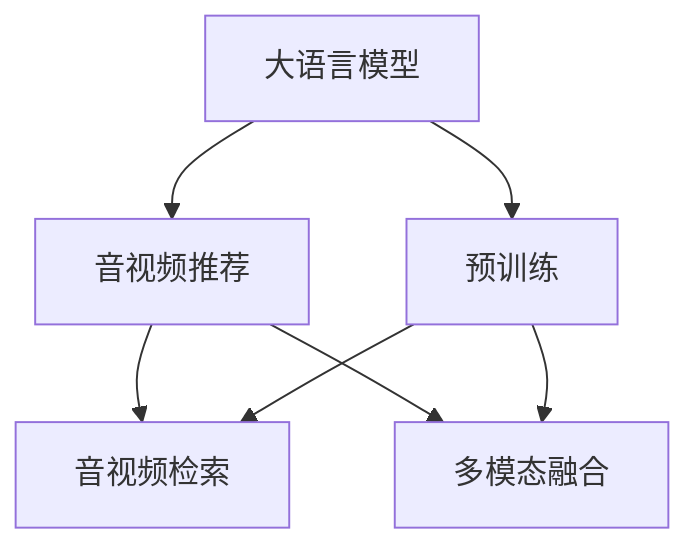

                 

# 音视频推荐: LLM的发展空间

> 关键词：大语言模型,音视频推荐,音视频检索,预训练模型,自监督学习,提示学习

## 1. 背景介绍

在数字化娱乐时代，音视频内容以其多样化和互动性日益成为大众文化消费的主流。从音乐、电影到短视频、直播，音视频内容的数量和类型急剧增长。然而，面对海量的音视频数据，如何高效、精准地推荐符合用户兴趣和需求的内容，成为音视频平台的关键挑战。传统的基于规则和统计的推荐系统逐渐被大语言模型(Large Language Model, LLM)所取代，展现出广阔的发展空间。

### 1.1 问题由来

音视频推荐系统的主要目标是基于用户的历史行为和当前输入，推荐相关内容。传统的推荐系统主要采用基于协同过滤、内容推荐等方法，但这些方法往往依赖于用户行为数据和标签信息，难以处理多模态数据和冷启动问题。而大语言模型，通过大规模无标签文本数据的预训练，已经具备了强大的语义理解和生成能力，可以显著提升音视频推荐系统的精准度和覆盖面。

### 1.2 问题核心关键点

大语言模型在音视频推荐中的应用，核心在于如何利用其语言理解能力，与音视频数据进行深度融合。具体来说，需要解决以下几个关键问题：
1. 如何高效提取音视频内容的关键信息，并转化为语言描述。
2. 如何将用户的历史行为和兴趣转化为自然语言形式，并引入模型训练。
3. 如何设计合适的任务适配层，使模型能够精准匹配音视频内容和用户需求。

## 2. 核心概念与联系

### 2.1 核心概念概述

为更好地理解大语言模型在音视频推荐中的应用，本节将介绍几个关键概念：

- 大语言模型：如GPT、BERT等，通过大规模无标签文本数据预训练，学习到通用语言表示。
- 预训练模型：在无监督自监督任务上训练，学习语言知识，作为音视频推荐的基础。
- 音视频推荐：基于用户历史行为和当前输入，推荐相关音视频内容。
- 音视频检索：在大规模音视频库中，快速匹配与用户兴趣相似的内容。
- 多模态融合：将文本、图像、音频等多种模态数据进行深度融合，提升推荐精度。

这些概念之间的逻辑关系可以通过以下Mermaid流程图来展示：



这个流程图展示了各概念之间的关联：

1. 大语言模型通过预训练学习语言知识。
2. 音视频推荐基于用户兴趣进行内容匹配。
3. 音视频检索从大规模库中快速匹配内容。
4. 多模态融合将多种信息综合应用。

## 3. 核心算法原理 & 具体操作步骤
### 3.1 算法原理概述

基于大语言模型的音视频推荐系统，核心思想是将预训练的通用语言模型与音视频内容进行深度融合，通过自然语言描述的方式对音视频进行理解和推荐。其核心算法流程包括预训练、微调和推理三个阶段：

1. 预训练：在大规模无标签文本数据上，训练通用语言模型。
2. 微调：将音视频内容描述和用户兴趣转化成语言形式，引入到预训练模型中进行微调，优化匹配精度。
3. 推理：使用微调后的模型，根据用户输入的自然语言描述，快速推荐相关音视频内容。

### 3.2 算法步骤详解

基于大语言模型的音视频推荐系统，一般包括以下几个关键步骤：

**Step 1: 准备预训练模型和数据集**
- 选择合适的预训练语言模型，如GPT、BERT等。
- 收集用户历史行为数据和音视频内容，形成训练集、验证集和测试集。

**Step 2: 添加任务适配层**
- 设计适合音视频推荐任务的任务适配层，如分类、回归、生成等。
- 确定模型输出格式，如输出文本描述、标签等。

**Step 3: 设置微调超参数**
- 选择合适的优化算法及其参数，如Adam、SGD等，设置学习率、批大小、迭代轮数等。
- 设置正则化技术及强度，包括权重衰减、Dropout、Early Stopping等。
- 确定冻结预训练参数的策略，如仅微调顶层，或全部参数都参与微调。

**Step 4: 执行梯度训练**
- 将训练集数据分批次输入模型，前向传播计算损失函数。
- 反向传播计算参数梯度，根据设定的优化算法和学习率更新模型参数。
- 周期性在验证集上评估模型性能，根据性能指标决定是否触发 Early Stopping。
- 重复上述步骤直到满足预设的迭代轮数或 Early Stopping 条件。

**Step 5: 测试和部署**
- 在测试集上评估微调后模型，对比微调前后的精度提升。
- 使用微调后的模型对新用户输入进行推理预测，集成到实际的应用系统中。
- 持续收集新的数据，定期重新微调模型，以适应数据分布的变化。

以上是基于大语言模型的音视频推荐系统的一般流程。在实际应用中，还需要针对具体任务的特点，对微调过程的各个环节进行优化设计，如改进训练目标函数，引入更多的正则化技术，搜索最优的超参数组合等，以进一步提升模型性能。

### 3.3 算法优缺点

基于大语言模型的音视频推荐方法具有以下优点：
1. 语义理解能力强：大语言模型能够处理自然语言，理解用户需求和兴趣。
2. 多模态融合好：能够融合音视频内容的多维度信息，提升推荐精度。
3. 覆盖面广：处理海量音视频数据，覆盖更多内容，提升推荐效果。
4. 适应性强：能够快速适应用户行为和兴趣的变化，保持推荐准确性。

同时，该方法也存在一定的局限性：
1. 数据依赖强：推荐效果很大程度上取决于训练数据的质量和数量。
2. 模型复杂：大语言模型参数量巨大，计算资源需求高。
3. 冷启动问题：新用户历史行为数据不足，推荐精度下降。
4. 隐私风险：用户行为数据的隐私保护和合法性问题亟待解决。

尽管存在这些局限性，但就目前而言，基于大语言模型的推荐方法仍是大规模音视频推荐系统的热门选择。未来相关研究的重点在于如何进一步降低数据依赖，提高模型的适应性和鲁棒性，同时兼顾隐私保护和合法性。

### 3.4 算法应用领域

基于大语言模型的音视频推荐方法，在实际应用中已经展现出了巨大的潜力，覆盖了多个领域：

- 音乐推荐：根据用户的听歌历史和音乐描述，推荐相关音乐作品。
- 电影推荐：分析用户的观影记录和电影评价，推荐相关电影。
- 视频推荐：根据用户的观看记录和视频描述，推荐相关视频内容。
- 直播推荐：通过用户的历史互动数据和实时评论，推荐直播节目。
- 游戏推荐：基于用户的游戏行为数据，推荐适合的游戏内容。
- 教育推荐：根据学生的学习记录和兴趣描述，推荐相关教育资源。

除了这些常见的应用领域，大语言模型在音视频推荐中的创新应用也在不断涌现，如跨领域推荐、情感驱动推荐等，为音视频推荐系统带来了新的思路。

## 4. 数学模型和公式 & 详细讲解 & 举例说明

### 4.1 数学模型构建

本节将使用数学语言对基于大语言模型的音视频推荐过程进行更加严格的刻画。

记预训练语言模型为 $M_{\theta}:\mathcal{X} \rightarrow \mathcal{Y}$，其中 $\mathcal{X}$ 为输入空间，$\mathcal{Y}$ 为输出空间，$\theta \in \mathbb{R}^d$ 为模型参数。假设音视频推荐任务的训练集为 $D=\{(x_i,y_i)\}_{i=1}^N, x_i \in \mathcal{X}, y_i \in \mathcal{Y}$。

定义模型 $M_{\theta}$ 在数据样本 $(x,y)$ 上的损失函数为 $\ell(M_{\theta}(x),y)$，则在数据集 $D$ 上的经验风险为：

$$
\mathcal{L}(\theta) = \frac{1}{N} \sum_{i=1}^N \ell(M_{\theta}(x_i),y_i)
$$

微调的优化目标是最小化经验风险，即找到最优参数：

$$
\theta^* = \mathop{\arg\min}_{\theta} \mathcal{L}(\theta)
$$

在实践中，我们通常使用基于梯度的优化算法（如SGD、Adam等）来近似求解上述最优化问题。设 $\eta$ 为学习率，$\lambda$ 为正则化系数，则参数的更新公式为：

$$
\theta \leftarrow \theta - \eta \nabla_{\theta}\mathcal{L}(\theta) - \eta\lambda\theta
$$

其中 $\nabla_{\theta}\mathcal{L}(\theta)$ 为损失函数对参数 $\theta$ 的梯度，可通过反向传播算法高效计算。

### 4.2 公式推导过程

以下我们以音视频分类推荐为例，推导交叉熵损失函数及其梯度的计算公式。

假设模型 $M_{\theta}$ 在输入 $x$ 上的输出为 $\hat{y}=M_{\theta}(x) \in [0,1]$，表示样本属于类别 $y$ 的概率。真实标签 $y \in \{1,0\}$。则二分类交叉熵损失函数定义为：

$$
\ell(M_{\theta}(x),y) = -[y\log \hat{y} + (1-y)\log (1-\hat{y})]
$$

将其代入经验风险公式，得：

$$
\mathcal{L}(\theta) = -\frac{1}{N}\sum_{i=1}^N [y_i\log M_{\theta}(x_i)+(1-y_i)\log(1-M_{\theta}(x_i))]
$$

根据链式法则，损失函数对参数 $\theta_k$ 的梯度为：

$$
\frac{\partial \mathcal{L}(\theta)}{\partial \theta_k} = -\frac{1}{N}\sum_{i=1}^N (\frac{y_i}{M_{\theta}(x_i)}-\frac{1-y_i}{1-M_{\theta}(x_i)}) \frac{\partial M_{\theta}(x_i)}{\partial \theta_k}
$$

其中 $\frac{\partial M_{\theta}(x_i)}{\partial \theta_k}$ 可进一步递归展开，利用自动微分技术完成计算。

在得到损失函数的梯度后，即可带入参数更新公式，完成模型的迭代优化。重复上述过程直至收敛，最终得到适应音视频分类任务的最优模型参数 $\theta^*$。

### 4.3 案例分析与讲解

以下我们通过一个具体的案例来详细讲解基于大语言模型的音视频推荐系统的实现过程：

**案例背景**：
假设某音视频平台想要利用大语言模型进行音乐推荐。用户 A 的历史听歌记录为《周杰伦》《林俊杰》《张学友》，最近输入的搜索词为“流行音乐”。

**步骤1: 准备数据集**
- 收集用户 A 的历史听歌记录，并将其转化为文本格式。
- 收集音乐库中的音乐信息，如歌手、风格、歌词等，并生成对应的文本描述。

**步骤2: 任务适配层设计**
- 设计一个简单的分类任务，将推荐结果转化为“推荐”和“不推荐”两个类别。
- 设计输出层，使用线性分类器，损失函数为二分类交叉熵。

**步骤3: 设置超参数**
- 选择 AdamW 优化器，设置学习率为 2e-5。
- 设置批大小为 32，迭代轮数为 10。
- 使用正则化技术，包括权重衰减和 Dropout。

**步骤4: 微调模型**
- 将用户 A 的历史听歌记录和最近输入的搜索词拼接成一句话，输入模型进行推理。
- 在音乐库中，选择与该描述相似的音乐，进行分类评分。
- 对每个音乐进行前向传播，计算损失函数，反向传播更新模型参数。
- 每迭代一轮，在验证集上评估模型性能，选择最优参数。

**步骤5: 测试和部署**
- 在测试集上评估微调后的模型，对比推荐效果。
- 使用微调后的模型对新输入的搜索词进行推理预测，推荐相关音乐。

以上就是基于大语言模型的音视频推荐系统的完整实现流程。可以看到，在实际应用中，通过精心设计任务适配层和优化超参数，可以显著提升推荐模型的性能。

## 5. 项目实践：代码实例和详细解释说明

### 5.1 开发环境搭建

在进行音视频推荐系统开发前，我们需要准备好开发环境。以下是使用Python进行PyTorch开发的环境配置流程：

1. 安装Anaconda：从官网下载并安装Anaconda，用于创建独立的Python环境。

2. 创建并激活虚拟环境：
```bash
conda create -n pytorch-env python=3.8 
conda activate pytorch-env
```

3. 安装PyTorch：根据CUDA版本，从官网获取对应的安装命令。例如：
```bash
conda install pytorch torchvision torchaudio cudatoolkit=11.1 -c pytorch -c conda-forge
```

4. 安装Transformers库：
```bash
pip install transformers
```

5. 安装各类工具包：
```bash
pip install numpy pandas scikit-learn matplotlib tqdm jupyter notebook ipython
```

完成上述步骤后，即可在`pytorch-env`环境中开始推荐系统开发。

### 5.2 源代码详细实现

下面我们以音乐推荐为例，给出使用Transformers库对BERT模型进行微调的PyTorch代码实现。

首先，定义音乐推荐任务的数据处理函数：

```python
from transformers import BertTokenizer
from torch.utils.data import Dataset
import torch

class MusicDataset(Dataset):
    def __init__(self, songs, labels, tokenizer, max_len=128):
        self.songs = songs
        self.labels = labels
        self.tokenizer = tokenizer
        self.max_len = max_len
        
    def __len__(self):
        return len(self.songs)
    
    def __getitem__(self, item):
        song = self.songs[item]
        label = self.labels[item]
        
        encoding = self.tokenizer(song, return_tensors='pt', max_length=self.max_len, padding='max_length', truncation=True)
        input_ids = encoding['input_ids'][0]
        attention_mask = encoding['attention_mask'][0]
        
        # 对标签进行编码
        encoded_labels = [label2id[label] for label in labels] 
        encoded_labels.extend([label2id['NOT推荐的']]*(self.max_len - len(encoded_labels)))
        labels = torch.tensor(encoded_labels, dtype=torch.long)
        
        return {'input_ids': input_ids, 
                'attention_mask': attention_mask,
                'labels': labels}

# 标签与id的映射
label2id = {'推荐的': 1, '不推荐的': 0}
id2label = {v: k for k, v in label2id.items()}
```

然后，定义模型和优化器：

```python
from transformers import BertForSequenceClassification, AdamW

model = BertForSequenceClassification.from_pretrained('bert-base-cased', num_labels=len(label2id))

optimizer = AdamW(model.parameters(), lr=2e-5)
```

接着，定义训练和评估函数：

```python
from torch.utils.data import DataLoader
from tqdm import tqdm
from sklearn.metrics import classification_report

device = torch.device('cuda') if torch.cuda.is_available() else torch.device('cpu')
model.to(device)

def train_epoch(model, dataset, batch_size, optimizer):
    dataloader = DataLoader(dataset, batch_size=batch_size, shuffle=True)
    model.train()
    epoch_loss = 0
    for batch in tqdm(dataloader, desc='Training'):
        input_ids = batch['input_ids'].to(device)
        attention_mask = batch['attention_mask'].to(device)
        labels = batch['labels'].to(device)
        model.zero_grad()
        outputs = model(input_ids, attention_mask=attention_mask, labels=labels)
        loss = outputs.loss
        epoch_loss += loss.item()
        loss.backward()
        optimizer.step()
    return epoch_loss / len(dataloader)

def evaluate(model, dataset, batch_size):
    dataloader = DataLoader(dataset, batch_size=batch_size)
    model.eval()
    preds, labels = [], []
    with torch.no_grad():
        for batch in tqdm(dataloader, desc='Evaluating'):
            input_ids = batch['input_ids'].to(device)
            attention_mask = batch['attention_mask'].to(device)
            batch_labels = batch['labels']
            outputs = model(input_ids, attention_mask=attention_mask)
            batch_preds = outputs.logits.argmax(dim=2).to('cpu').tolist()
            batch_labels = batch_labels.to('cpu').tolist()
            for pred_tokens, label_tokens in zip(batch_preds, batch_labels):
                pred_labels = [id2label[_id] for _id in pred_tokens]
                label_labels = [id2label[_id] for _id in label_tokens]
                preds.append(pred_labels[:len(label_labels)])
                labels.append(label_labels)
                
    print(classification_report(labels, preds))
```

最后，启动训练流程并在测试集上评估：

```python
epochs = 5
batch_size = 16

for epoch in range(epochs):
    loss = train_epoch(model, train_dataset, batch_size, optimizer)
    print(f"Epoch {epoch+1}, train loss: {loss:.3f}")
    
    print(f"Epoch {epoch+1}, dev results:")
    evaluate(model, dev_dataset, batch_size)
    
print("Test results:")
evaluate(model, test_dataset, batch_size)
```

以上就是使用PyTorch对BERT进行音乐推荐任务微调的完整代码实现。可以看到，得益于Transformers库的强大封装，我们可以用相对简洁的代码完成BERT模型的加载和微调。

### 5.3 代码解读与分析

让我们再详细解读一下关键代码的实现细节：

**MusicDataset类**：
- `__init__`方法：初始化音乐、标签、分词器等关键组件。
- `__len__`方法：返回数据集的样本数量。
- `__getitem__`方法：对单个样本进行处理，将音乐输入编码为token ids，将标签编码为数字，并对其进行定长padding，最终返回模型所需的输入。

**label2id和id2label字典**：
- 定义了标签与数字id之间的映射关系，用于将预测结果解码为真实的标签。

**训练和评估函数**：
- 使用PyTorch的DataLoader对数据集进行批次化加载，供模型训练和推理使用。
- 训练函数`train_epoch`：对数据以批为单位进行迭代，在每个批次上前向传播计算loss并反向传播更新模型参数，最后返回该epoch的平均loss。
- 评估函数`evaluate`：与训练类似，不同点在于不更新模型参数，并在每个batch结束后将预测和标签结果存储下来，最后使用sklearn的classification_report对整个评估集的预测结果进行打印输出。

**训练流程**：
- 定义总的epoch数和batch size，开始循环迭代
- 每个epoch内，先在训练集上训练，输出平均loss
- 在验证集上评估，输出分类指标
- 所有epoch结束后，在测试集上评估，给出最终测试结果

可以看到，PyTorch配合Transformers库使得BERT微调的代码实现变得简洁高效。开发者可以将更多精力放在数据处理、模型改进等高层逻辑上，而不必过多关注底层的实现细节。

当然，工业级的系统实现还需考虑更多因素，如模型的保存和部署、超参数的自动搜索、更灵活的任务适配层等。但核心的微调范式基本与此类似。

## 6. 实际应用场景
### 6.1 智能推荐平台

音视频推荐系统作为智能推荐平台的核心组件，通过学习用户的历史行为和兴趣，能够实现精准推荐。智能推荐平台涵盖多个行业，如电商、音乐、视频、教育等，是音视频推荐系统的重要应用场景。

**电商推荐**：通过分析用户浏览、购买记录，推荐相关商品。

**音乐推荐**：根据用户的听歌历史和音乐描述，推荐相关音乐作品。

**视频推荐**：分析用户的观影记录和视频评价，推荐相关视频内容。

**教育推荐**：根据学生的学习记录和兴趣描述，推荐相关教育资源。

### 6.2 个性化视频直播

在音视频推荐中，个性化视频直播推荐也得到了广泛应用。通过分析用户的互动行为，推荐用户可能感兴趣的主播和内容。个性化视频直播推荐能够提高用户的观看时长和互动率，提升直播平台的活跃度。

### 6.3 跨领域推荐

跨领域推荐是大语言模型在音视频推荐中的重要应用方向之一。跨领域推荐能够实现不同领域之间的知识迁移，提升推荐的覆盖面和多样性。例如，将音乐推荐与电影推荐相结合，根据用户的听歌历史推荐相关电影，或根据观影记录推荐相关音乐。

### 6.4 未来应用展望

随着大语言模型和音视频推荐技术的不断发展，未来的应用场景将会更加广泛，包括但不限于以下几个方向：

- **沉浸式音视频推荐**：通过虚拟现实(VR)、增强现实(AR)等技术，提供沉浸式的音视频体验，增强推荐效果。
- **个性化娱乐内容创作**：利用音视频推荐，生成个性化音乐、电影、视频等内容，满足用户的多样化需求。
- **跨模态推荐**：融合文本、图像、音频等多种模态信息，提供更加全面、精准的推荐结果。
- **多平台协同推荐**：在不同平台间进行推荐协同，提高推荐的一致性和可信度。

此外，大语言模型在音视频推荐中的创新应用还在不断涌现，如情感驱动推荐、互动推荐等，为音视频推荐系统带来了新的思路。相信随着技术的日益成熟，音视频推荐系统必将在更多领域大放异彩，为音视频内容产业带来新的革命性变化。

## 7. 工具和资源推荐
### 7.1 学习资源推荐

为了帮助开发者系统掌握大语言模型在音视频推荐中的应用，这里推荐一些优质的学习资源：

1. 《Transformer from NLP to CV》系列博文：由大模型技术专家撰写，介绍了Transformer在大规模音视频推荐中的应用，涵盖了推荐模型设计、优化策略等内容。

2. CS224L《Deep Learning for Natural Language Processing》课程：斯坦福大学开设的推荐系统课程，详细讲解了推荐模型的构建和优化方法，适合深入理解推荐技术。

3. 《Reinforcement Learning for Recommender Systems》书籍：介绍了基于强化学习的方法在推荐系统中的应用，提供了丰富的理论和方法支持。

4. HuggingFace官方文档：Transformers库的官方文档，提供了海量预训练模型和推荐系统的样例代码，是上手实践的必备资料。

5. RecSys开源项目：推荐系统数据集和基线模型，提供了丰富的实验数据和代码，帮助开发者快速迭代实验。

通过对这些资源的学习实践，相信你一定能够快速掌握大语言模型在音视频推荐中的应用，并用于解决实际的推荐问题。
### 7.2 开发工具推荐

高效的开发离不开优秀的工具支持。以下是几款用于大语言模型音视频推荐开发的常用工具：

1. PyTorch：基于Python的开源深度学习框架，灵活动态的计算图，适合快速迭代研究。大部分预训练语言模型都有PyTorch版本的实现。

2. TensorFlow：由Google主导开发的开源深度学习框架，生产部署方便，适合大规模工程应用。同样有丰富的预训练语言模型资源。

3. Transformers库：HuggingFace开发的NLP工具库，集成了众多SOTA语言模型，支持PyTorch和TensorFlow，是进行音视频推荐开发的利器。

4. Weights & Biases：模型训练的实验跟踪工具，可以记录和可视化模型训练过程中的各项指标，方便对比和调优。与主流深度学习框架无缝集成。

5. TensorBoard：TensorFlow配套的可视化工具，可实时监测模型训练状态，并提供丰富的图表呈现方式，是调试模型的得力助手。

6. Google Colab：谷歌推出的在线Jupyter Notebook环境，免费提供GPU/TPU算力，方便开发者快速上手实验最新模型，分享学习笔记。

合理利用这些工具，可以显著提升大语言模型在音视频推荐中的开发效率，加快创新迭代的步伐。

### 7.3 相关论文推荐

大语言模型和音视频推荐技术的发展源于学界的持续研究。以下是几篇奠基性的相关论文，推荐阅读：

1. Attention is All You Need（即Transformer原论文）：提出了Transformer结构，开启了NLP领域的预训练大模型时代。

2. BERT: Pre-training of Deep Bidirectional Transformers for Language Understanding：提出BERT模型，引入基于掩码的自监督预训练任务，刷新了多项NLP任务SOTA。

3. Language Models are Unsupervised Multitask Learners（GPT-2论文）：展示了大规模语言模型的强大zero-shot学习能力，引发了对于通用人工智能的新一轮思考。

4. Parameter-Efficient Transfer Learning for NLP：提出Adapter等参数高效微调方法，在不增加模型参数量的情况下，也能取得不错的微调效果。

5. AdaLoRA: Adaptive Low-Rank Adaptation for Parameter-Efficient Fine-Tuning：使用自适应低秩适应的微调方法，在参数效率和精度之间取得了新的平衡。

这些论文代表了大语言模型音视频推荐技术的发展脉络。通过学习这些前沿成果，可以帮助研究者把握学科前进方向，激发更多的创新灵感。

## 8. 总结：未来发展趋势与挑战

### 8.1 总结

本文对基于大语言模型的音视频推荐方法进行了全面系统的介绍。首先阐述了大语言模型和音视频推荐系统的研究背景和意义，明确了音视频推荐系统在大数据时代的重要性。其次，从原理到实践，详细讲解了音视频推荐系统的数学模型和关键步骤，给出了音视频推荐系统的完整代码实例。同时，本文还广泛探讨了音视频推荐系统在智能推荐平台、个性化视频直播、跨领域推荐等多个领域的应用前景，展示了音视频推荐系统的广阔应用空间。此外，本文精选了音视频推荐系统的各类学习资源，力求为读者提供全方位的技术指引。

通过本文的系统梳理，可以看到，基于大语言模型的音视频推荐方法正在成为音视频内容推荐的重要范式，极大地拓展了音视频推荐系统的应用边界，提升了推荐的精准度和用户体验。未来，伴随预训练语言模型和推荐方法的持续演进，相信音视频推荐系统必将在更多领域大放异彩，为音视频内容产业带来新的变革性影响。

### 8.2 未来发展趋势

展望未来，音视频推荐系统将呈现以下几个发展趋势：

1. **推荐模型规模增大**：随着算力成本的下降和数据规模的扩张，音视频推荐模型的参数量还将持续增长。超大规模语言模型蕴含的丰富语言知识，有望支撑更加复杂多变的音视频推荐。

2. **多模态融合技术发展**：音视频推荐系统能够融合文本、图像、音频等多种模态信息，提升推荐精度。未来将有更多创新方法，实现跨模态深度融合，提供更加全面、精准的推荐结果。

3. **推荐模型的可解释性增强**：音视频推荐系统需要增强模型的可解释性，使用户能够理解和信任推荐结果。基于因果分析和博弈论等工具，对推荐模型的决策过程进行剖析，提升系统的透明度和可信度。

4. **推荐模型的泛化性和鲁棒性提高**：音视频推荐系统需要具备更强的泛化性和鲁棒性，能够处理不同用户、不同内容、不同场景下的推荐需求。通过引入对抗训练、持续学习等方法，提升系统的稳定性和适应性。

5. **推荐系统的智能化水平提升**：音视频推荐系统需要具备智能化的推荐策略，根据用户的多样化需求和实时变化的市场趋势，进行动态调整和优化。引入强化学习、深度强化学习等方法，提升系统的智能化水平。

6. **推荐系统的可持续性保障**：音视频推荐系统需要具备可持续性保障，能够持续学习新知识，适应数据分布的变化。通过设计可持续的推荐模型架构，实现模型的增量更新和自适应优化。

以上趋势凸显了音视频推荐系统的广阔前景。这些方向的探索发展，必将进一步提升音视频推荐系统的性能和应用范围，为音视频内容产业带来新的机遇和挑战。

### 8.3 面临的挑战

尽管基于大语言模型的音视频推荐技术已经取得了瞩目成就，但在迈向更加智能化、普适化应用的过程中，它仍面临诸多挑战：

1. **数据依赖强**：推荐效果很大程度上取决于训练数据的质量和数量。获取高质量、多样化的音视频数据和用户行为数据，需要耗费大量人力和时间，成为制约推荐系统发展的瓶颈。如何通过无监督和半监督学习，有效利用有限标注数据，降低数据依赖，是未来的重要研究方向。

2. **模型复杂度高**：大规模音视频推荐模型具有海量参数，计算资源需求高。如何在保证推荐效果的前提下，降低模型复杂度，优化资源利用，成为需要解决的技术难题。

3. **冷启动问题**：对于新用户和新内容，推荐系统面临冷启动问题，推荐效果下降。如何利用用户输入和行为数据，快速建立用户画像和内容特征，提升冷启动推荐效果，是推荐系统的关键挑战。

4. **隐私保护和合法性**：音视频推荐系统需要处理大量的用户数据，隐私保护和合法性问题亟待解决。如何在数据使用和模型训练中，确保用户隐私不被泄露，保障数据合法性，是推荐系统的底线要求。

5. **公平性和公正性**：音视频推荐系统需要具备公平性和公正性，避免推荐偏见和歧视。如何构建公平性约束，避免数据和算法偏见，确保推荐系统的公平性和公正性，是推荐系统的伦理要求。

6. **推荐系统的多样性和个性化**：音视频推荐系统需要满足用户的多样化需求，提供个性化的推荐结果。如何在推荐模型中引入多样性和个性化，提升推荐结果的多样性和个性化水平，是推荐系统的创新方向。

这些挑战将是大语言模型音视频推荐系统走向成熟的重要障碍。未来相关研究需要在数据获取、模型优化、隐私保护、公平性等方面持续发力，才能真正实现音视频推荐系统的落地应用和广泛推广。

### 8.4 研究展望

面对音视频推荐系统面临的种种挑战，未来的研究需要在以下几个方面寻求新的突破：

1. **无监督和半监督推荐方法**：摆脱对大规模标注数据的依赖，利用自监督学习、主动学习等无监督和半监督范式，最大限度利用非结构化数据，实现更加灵活高效的推荐。

2. **推荐模型的参数高效和计算高效**：开发更加参数高效的推荐模型，在固定大部分预训练参数的同时，只更新极少量的任务相关参数。同时优化推荐模型的计算图，减少前向传播和反向传播的资源消耗，实现更加轻量级、实时性的部署。

3. **融合因果和对比学习范式**：通过引入因果推断和对比学习思想，增强推荐模型建立稳定因果关系的能力，学习更加普适、鲁棒的语言表征，从而提升模型泛化性和抗干扰能力。

4. **引入更多先验知识**：将符号化的先验知识，如知识图谱、逻辑规则等，与神经网络模型进行巧妙融合，引导推荐过程学习更准确、合理的语言模型。同时加强不同模态数据的整合，实现视觉、语音等多模态信息与文本信息的协同建模。

5. **结合因果分析和博弈论工具**：将因果分析方法引入推荐模型，识别出模型决策的关键特征，增强推荐结果的因果性和逻辑性。借助博弈论工具刻画人机交互过程，主动探索并规避推荐模型的脆弱点，提高系统稳定性。

6. **纳入伦理道德约束**：在推荐模型训练目标中引入伦理导向的评估指标，过滤和惩罚有偏见、有害的推荐结果。同时加强人工干预和审核，建立推荐行为的监管机制，确保推荐系统的公平性和公正性。

这些研究方向的研究方向将引领音视频推荐系统走向更高的台阶，为音视频内容推荐带来新的突破，推动音视频产业的数字化转型和智能化升级。面向未来，音视频推荐系统需要与其他人工智能技术进行更深入的融合，如知识表示、因果推理、强化学习等，多路径协同发力，共同推动音视频推荐系统的进步。只有勇于创新、敢于突破，才能不断拓展音视频推荐系统的边界，让智能技术更好地服务于用户和内容产业。

## 9. 附录：常见问题与解答

**Q1：音视频推荐系统如何处理冷启动问题？**

A: 冷启动问题是音视频推荐系统面临的重要挑战之一。为了处理冷启动问题，可以采用以下几种方法：
1. 基于协同过滤的推荐方法：利用用户已有行为和相似用户的推荐，为用户推荐相关内容。
2. 基于内容推荐的推荐方法：利用物品的特征和用户历史行为，推荐相关内容。
3. 基于标签推荐的推荐方法：利用物品的标签和用户兴趣，推荐相关内容。
4. 基于用户输入和行为数据的推荐方法：利用用户输入和行为数据，快速建立用户画像和内容特征，提升冷启动推荐效果。

这些方法可以单独或结合使用，提升音视频推荐系统的冷启动效果。

**Q2：音视频推荐系统如何平衡个性化推荐和多样性推荐？**

A: 音视频推荐系统需要同时考虑个性化推荐和多样性推荐，避免推荐结果过于单一或过于泛泛。为了平衡个性化推荐和多样性推荐，可以采用以下几种方法：
1. 引入多样性约束：在推荐算法中加入多样性约束，确保推荐结果的多样性。
2. 引入多样性目标函数：设计多样性目标函数，优化推荐结果的多样性。
3. 引入多样性权重：对不同维度的推荐结果赋予不同的权重，提升推荐结果的多样性。
4. 引入多角度推荐：从不同角度进行推荐，综合多角度结果，提升推荐结果的多样性。

这些方法可以结合使用，平衡个性化推荐和多样性推荐，提升推荐系统的效果和用户体验。

**Q3：音视频推荐系统如何提高推荐模型的泛化性和鲁棒性？**

A: 提高推荐模型的泛化性和鲁棒性，是音视频推荐系统的重要研究课题。为了提升推荐模型的泛化性和鲁棒性，可以采用以下几种方法：
1. 引入对抗训练：在训练过程中加入对抗样本，提升模型的鲁棒性。
2. 引入持续学习：定期重新训练模型，保持模型的时效性和适应性。
3. 引入多模态融合：融合文本、图像、音频等多种模态信息，提升推荐模型的泛化性。
4. 引入因果分析：通过因果分析方法，提升推荐模型的泛化性。
5. 引入强化学习：引入强化学习方法，提升推荐模型的鲁棒性。

这些方法可以结合使用，提升推荐模型的泛化性和鲁棒性，提高推荐系统的性能和用户体验。

**Q4：音视频推荐系统如何保证推荐结果的公平性和公正性？**

A: 保证推荐结果的公平性和公正性，是音视频推荐系统的伦理要求。为了保证推荐结果的公平性和公正性，可以采用以下几种方法：
1. 引入公平性约束：在推荐算法中加入公平性约束，确保推荐结果的公平性。
2. 引入公平性目标函数：设计公平性目标函数，优化推荐结果的公平性。
3. 引入公平性权重：对不同用户的推荐结果赋予不同的权重，提升推荐结果的公平性。
4. 引入公平性评估：定期评估推荐结果的公平性，调整推荐算法和策略。

这些方法可以结合使用，保证推荐结果的公平性和公正性，提升推荐系统的可信度和用户体验。

**Q5：音视频推荐系统如何提升推荐模型的可解释性？**

A: 提升推荐模型的可解释性，是音视频推荐系统的重要目标。为了提升推荐模型的可解释性，可以采用以下几种方法：
1. 引入可解释性约束：在推荐算法中加入可解释性约束，确保推荐结果的可解释性。
2. 引入可解释性目标函数：设计可解释性目标函数，优化推荐结果的可解释性。
3. 引入可解释性权重：对不同维度的推荐结果赋予不同的权重，提升推荐结果的可解释性。
4. 引入可解释性评估：定期评估推荐结果的可解释性，调整推荐算法和策略。

这些方法可以结合使用，提升推荐模型的可解释性，提高推荐系统的透明度和可信度。

---

作者：禅与计算机程序设计艺术 / Zen and the Art of Computer Programming

