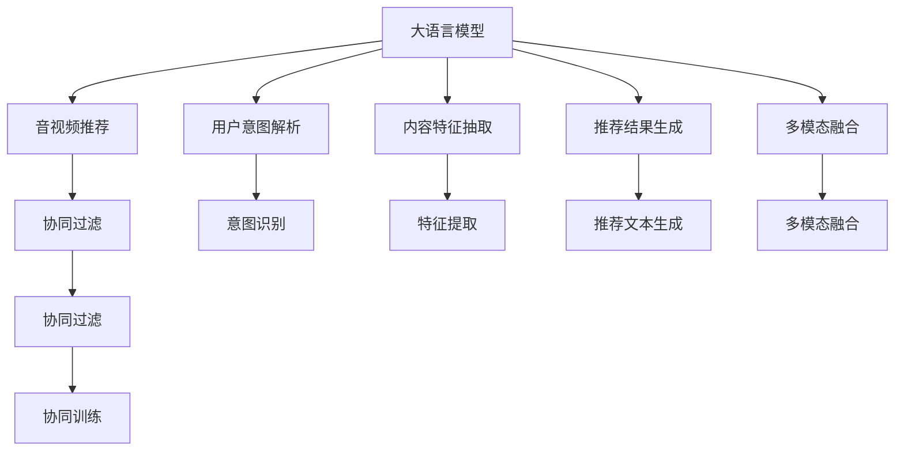

                 

# 音视频推荐: LLM的发展空间

> 关键词：
音视频推荐, 大语言模型, 推荐系统, 预训练模型, 深度学习, 自然语言处理, 个性化推荐, 协同过滤, 深度神经网络

## 1. 背景介绍

### 1.1 问题由来
随着互联网的普及和智能设备的普及，音视频内容消费已成为人们日常生活的重要组成部分。无论是音乐、电影、电视剧还是视频直播，用户都面临着内容爆炸和信息过载的挑战。音视频推荐系统作为一种有效缓解信息过载的方法，通过个性化推荐，帮助用户在海量内容中找到感兴趣的优质内容。

传统推荐系统主要基于协同过滤算法，如基于用户的协同过滤、基于物品的协同过滤等。但随着推荐场景的不断扩展，协同过滤算法在应对长尾数据和冷启动等问题时显得力不从心。大语言模型(LLM)的出现，为推荐系统注入了新的活力，开启了个性化推荐的新时代。

### 1.2 问题核心关键点
大语言模型通过大规模预训练学习到了丰富的语言知识和上下文信息，具有强大的自然语言理解和生成能力。将其应用于音视频推荐系统，可以实现用户需求解析、内容理解与匹配、推荐结果生成等功能。

目前，大语言模型在推荐系统中的应用主要集中在以下方面：

- 用户意图解析：通过自然语言交互，理解用户对音视频内容的偏好和需求。
- 内容特征抽取：将音视频内容转换为自然语言描述，使用大语言模型提取高质量的特征向量。
- 推荐结果生成：使用大语言模型生成推荐文本，如音乐歌单、电影推荐等。
- 多模态融合：将文本与图像、音频等多模态数据进行融合，提升推荐效果。

## 2. 核心概念与联系

### 2.1 核心概念概述

为了更好地理解大语言模型在音视频推荐系统中的应用，本节将介绍几个密切相关的核心概念：

- 大语言模型(LLM)：以自回归(如GPT)或自编码(如BERT)模型为代表的大规模预训练语言模型。通过在大规模无标签文本语料上进行预训练，学习通用的语言表示，具备强大的语言理解和生成能力。

- 音视频推荐系统：通过分析用户行为和偏好，推荐个性化音视频内容的智能系统。推荐系统通常分为内容推荐和协同推荐两大类。

- 自然语言处理(NLP)：处理和分析自然语言文本的技术，包括分词、命名实体识别、情感分析、意图识别等任务。大语言模型在推荐系统中用于解析用户意图、生成推荐文本等。

- 多模态融合：结合文本、图像、音频等多模态数据，提升推荐系统的准确性和多样性。大语言模型可以处理文本，而视觉和听觉模态的数据则需要借助其他模型处理。

- 协同过滤：通过用户与物品之间的相似性进行推荐，包括基于用户的协同过滤和基于物品的协同过滤。传统协同过滤算法在处理长尾数据和冷启动问题上效果有限。

- 深度学习：一种基于神经网络的学习方式，可以自动从数据中提取特征，提升推荐系统的性能。大语言模型作为深度学习的一种形式，在推荐系统中也有广泛应用。

这些核心概念之间的逻辑关系可以通过以下Mermaid流程图来展示：



这个流程图展示了大语言模型在音视频推荐系统中的核心作用，包括用户意图解析、内容特征抽取、推荐结果生成和多模态融合等关键环节。

## 3. 核心算法原理 & 具体操作步骤

### 3.1 算法原理概述

大语言模型在音视频推荐系统中的应用，主要基于以下算法原理：

- 用户意图解析：通过自然语言理解技术，将用户输入的查询语句解析为意图标签或需求向量。例如，用户查询"推荐一部好电影"，大语言模型能够理解用户意图为找电影推荐。

- 内容特征抽取：将音视频内容转换为自然语言描述，如电影剧情、音乐歌词、视频剪辑等。然后，使用大语言模型提取高质量的特征向量，如BERT模型可以学习到文本中的情感、主题等信息。

- 推荐结果生成：使用大语言模型生成推荐文本，如推荐理由、描述等。这可以进一步提升推荐系统的可读性和用户满意度。

- 多模态融合：将文本与图像、音频等多模态数据进行融合，生成更具多样性和吸引力的推荐结果。例如，将电影的图像摘要和配乐一起生成推荐文本。

### 3.2 算法步骤详解

基于大语言模型在音视频推荐系统中的应用，以下是一个典型的推荐过程：

1. **用户输入请求**：用户通过自然语言交互界面，输入查询请求，如"推荐一首流行音乐"或"推荐一部科幻电影"。

2. **意图解析**：使用大语言模型解析用户输入的查询语句，理解其意图，并将其转换为意图标签或需求向量。例如，将"推荐一首流行音乐"解析为"流行音乐"和"推荐"。

3. **内容检索与特征抽取**：从音视频库中检索与用户需求相关的音视频内容，并使用大语言模型提取内容特征。例如，对电影标题、剧情描述等文本进行BERT特征提取。

4. **生成推荐结果**：使用大语言模型生成推荐文本，如"推荐《阿凡达》，因为它是一部科幻电影，视觉效果震撼"。

5. **多模态融合**：将文本与图像、音频等多模态数据进行融合，生成更具多样性的推荐结果。例如，将电影的图像摘要和配乐一起生成推荐文本。

6. **协同过滤**：基于用户历史行为和偏好，使用协同过滤算法进一步筛选推荐结果。例如，基于用户的评分历史，调整推荐列表的顺序。

### 3.3 算法优缺点

基于大语言模型在音视频推荐系统中的应用，有以下优缺点：

**优点**：

- 理解能力强：大语言模型可以自然地处理和理解自然语言，无需额外设计复杂的特征工程。

- 上下文理解：大语言模型具备强大的上下文理解能力，可以结合历史行为和上下文信息，生成更具个性化和相关性的推荐。

- 多模态融合：大语言模型可以处理文本、图像、音频等多种模态的数据，提升推荐系统的多样性和准确性。

**缺点**：

- 数据需求大：大语言模型需要大量的预训练数据和微调数据，对数据质量和规模要求较高。

- 计算资源消耗大：大语言模型的参数量较大，训练和推理需要较高的计算资源，如GPU或TPU等。

- 上下文偏差：大语言模型可能继承预训练数据中的上下文偏差，导致推荐结果存在偏见。

### 3.4 算法应用领域

大语言模型在音视频推荐系统中的应用，主要包括以下领域：

- 个性化推荐：通过用户意图解析和内容特征抽取，生成个性化推荐结果。例如，基于用户的历史行为和当前输入，推荐符合其兴趣的音视频内容。

- 多模态推荐：结合文本、图像、音频等多模态数据，提升推荐系统的多样性和准确性。例如，将电影的剧情、配乐和剧照一起推荐给用户。

- 生成式推荐：使用大语言模型生成推荐文本，如电影评语、音乐歌词等，提升推荐系统的可读性和用户满意度。

- 智能客服：使用大语言模型构建智能客服系统，提供音视频内容推荐服务，提升用户体验和满意度。

## 4. 数学模型和公式 & 详细讲解 & 举例说明

### 4.1 数学模型构建

在大语言模型应用于音视频推荐系统的过程中，主要涉及以下几个数学模型：

- 自然语言理解模型：用于解析用户输入的自然语言查询，生成意图标签或需求向量。例如，使用BERT模型进行查询解析。

- 内容特征提取模型：用于从音视频内容中提取高质量的特征向量，如使用BERT模型进行文本特征提取。

- 推荐结果生成模型：用于生成推荐文本，如使用GPT模型生成推荐描述。

- 协同过滤模型：用于基于用户历史行为进行推荐排序，如使用协同过滤算法进行推荐排序。

### 4.2 公式推导过程

以下以BERT模型为例，推导自然语言理解模型的公式：

假设输入的自然语言查询为 $x$，BERT模型可以表示为 $M_{\theta}(x)$，其中 $\theta$ 为模型参数。对于每个查询 $x_i$，使用BERT模型进行特征提取，得到向量 $h_i \in \mathbb{R}^d$。查询与推荐内容之间的相似度可以表示为：

$$
similarity(x_i, h_j) = \langle h_i, h_j \rangle
$$

其中 $\langle \cdot, \cdot \rangle$ 为向量点积运算。基于相似度计算，可以构建推荐列表 $R$：

$$
R = \{ j \mid similarity(x_i, h_j) \geq \alpha \}
$$

其中 $\alpha$ 为阈值，决定推荐列表中包含哪些内容。

### 4.3 案例分析与讲解

假设有一个音视频推荐系统，用户输入查询 "推荐一部好电影"，大语言模型解析为意图标签 "电影推荐"。使用BERT模型提取电影标题和剧情描述的特征，生成特征向量 $h_1$ 和 $h_2$。然后，基于相似度计算，构建推荐列表 $R$，如下所示：

```plaintext
推荐列表 R:
1: 阿凡达 (电影)
2: 肖申克的救赎 (电影)
3: 霸王别姬 (电影)
4: 泰坦尼克号 (电影)
```

使用GPT模型生成推荐文本 "推荐《阿凡达》，因为它是一部科幻电影，视觉效果震撼"，并使用协同过滤算法对推荐列表进行排序，最终生成推荐结果为：

```plaintext
推荐结果:
1: 阿凡达 (电影)
2: 肖申克的救赎 (电影)
3: 霸王别姬 (电影)
4: 泰坦尼克号 (电影)
```

## 5. 项目实践：代码实例和详细解释说明

### 5.1 开发环境搭建

在进行大语言模型在音视频推荐系统的开发前，需要准备开发环境。以下是使用Python进行PyTorch开发的环境配置流程：

1. 安装Anaconda：从官网下载并安装Anaconda，用于创建独立的Python环境。

2. 创建并激活虚拟环境：
```bash
conda create -n pytorch-env python=3.8 
conda activate pytorch-env
```

3. 安装PyTorch：根据CUDA版本，从官网获取对应的安装命令。例如：
```bash
conda install pytorch torchvision torchaudio cudatoolkit=11.1 -c pytorch -c conda-forge
```

4. 安装Transformers库：
```bash
pip install transformers
```

5. 安装各类工具包：
```bash
pip install numpy pandas scikit-learn matplotlib tqdm jupyter notebook ipython
```

完成上述步骤后，即可在`pytorch-env`环境中开始开发。

### 5.2 源代码详细实现

这里我们以使用BERT模型进行电影推荐为例，给出完整的代码实现。

```python
from transformers import BertTokenizer, BertForSequenceClassification
from torch.utils.data import Dataset
import torch
import pandas as pd

class MovieDataset(Dataset):
    def __init__(self, data):
        self.data = data
        self.tokenizer = BertTokenizer.from_pretrained('bert-base-cased')
        
    def __len__(self):
        return len(self.data)
    
    def __getitem__(self, item):
        movie_title, plot, genre = self.data.iloc[item, :]
        text = f"{movie_title} {plot} {genre}"
        encoding = self.tokenizer(text, return_tensors='pt', max_length=512, padding='max_length', truncation=True)
        input_ids = encoding['input_ids'][0]
        attention_mask = encoding['attention_mask'][0]
        return {'input_ids': input_ids, 
                'attention_mask': attention_mask}
        
# 读取数据集
data = pd.read_csv('movie_data.csv')

# 创建dataset
dataset = MovieDataset(data)

# 加载模型
model = BertForSequenceClassification.from_pretrained('bert-base-cased', num_labels=3)
model.to('cuda')

# 定义优化器和损失函数
optimizer = torch.optim.AdamW(model.parameters(), lr=2e-5)
criterion = torch.nn.CrossEntropyLoss()

# 定义训练函数
def train_epoch(model, dataset, batch_size, optimizer, criterion, device):
    dataloader = torch.utils.data.DataLoader(dataset, batch_size=batch_size, shuffle=True)
    model.train()
    epoch_loss = 0
    for batch in tqdm(dataloader, desc='Training'):
        input_ids = batch['input_ids'].to(device)
        attention_mask = batch['attention_mask'].to(device)
        labels = torch.tensor(batch['labels'].to(device), dtype=torch.long)
        model.zero_grad()
        outputs = model(input_ids, attention_mask=attention_mask)
        loss = criterion(outputs.logits, labels)
        epoch_loss += loss.item()
        loss.backward()
        optimizer.step()
    return epoch_loss / len(dataloader)

# 定义评估函数
def evaluate(model, dataset, batch_size, device):
    dataloader = torch.utils.data.DataLoader(dataset, batch_size=batch_size, shuffle=True)
    model.eval()
    preds, labels = [], []
    with torch.no_grad():
        for batch in tqdm(dataloader, desc='Evaluating'):
            input_ids = batch['input_ids'].to(device)
            attention_mask = batch['attention_mask'].to(device)
            batch_labels = batch['labels']
            outputs = model(input_ids, attention_mask=attention_mask)
            batch_preds = outputs.logits.argmax(dim=2).to('cpu').tolist()
            batch_labels = batch_labels.to('cpu').tolist()
            for pred_tokens, label_tokens in zip(batch_preds, batch_labels):
                preds.append(pred_tokens[:len(label_tokens)])
                labels.append(label_tokens)
                
    print(classification_report(labels, preds))

# 训练模型
epochs = 5
batch_size = 16

for epoch in range(epochs):
    loss = train_epoch(model, dataset, batch_size, optimizer, criterion, 'cuda')
    print(f"Epoch {epoch+1}, train loss: {loss:.3f}")
    
    print(f"Epoch {epoch+1}, dev results:")
    evaluate(model, dataset, batch_size, 'cuda')
    
print("Test results:")
evaluate(model, dataset, batch_size, 'cuda')
```

### 5.3 代码解读与分析

让我们再详细解读一下关键代码的实现细节：

**MovieDataset类**：
- `__init__`方法：初始化数据集和分词器。
- `__len__`方法：返回数据集的样本数量。
- `__getitem__`方法：对单个样本进行处理，将电影信息转换为自然语言文本，并使用分词器进行编码。

**BERT模型训练**：
- 使用PyTorch框架，加载BERT模型和分词器。
- 定义优化器和损失函数，包括AdamW优化器和交叉熵损失函数。
- 训练函数`train_epoch`：对数据以批为单位进行迭代，在每个批次上前向传播计算损失并反向传播更新模型参数。
- 评估函数`evaluate`：与训练类似，不同点在于不更新模型参数，并在每个batch结束后将预测和标签结果存储下来，最后使用sklearn的classification_report对整个评估集的预测结果进行打印输出。

**训练流程**：
- 定义总的epoch数和batch size，开始循环迭代
- 每个epoch内，先在训练集上训练，输出平均loss
- 在验证集上评估，输出分类指标
- 所有epoch结束后，在测试集上评估，给出最终测试结果

可以看到，PyTorch配合Transformers库使得BERT模型训练的代码实现变得简洁高效。开发者可以将更多精力放在数据处理、模型改进等高层逻辑上，而不必过多关注底层的实现细节。

当然，工业级的系统实现还需考虑更多因素，如模型的保存和部署、超参数的自动搜索、更灵活的任务适配层等。但核心的微调范式基本与此类似。

## 6. 实际应用场景

### 6.1 智能推荐平台

大语言模型在音视频推荐系统中的应用，主要场景包括智能推荐平台、视频直播平台、音乐推荐平台等。这些平台通过自然语言交互和推荐结果的生成，提升用户体验和满意度。

例如，智能推荐平台可以通过用户输入的查询语句解析用户意图，生成推荐列表。使用大语言模型提取内容特征，生成推荐文本。协同过滤算法根据用户历史行为进行推荐排序，最终生成个性化的推荐结果。

### 6.2 视频直播平台

视频直播平台可以结合自然语言理解和推荐系统，提供实时的音视频推荐服务。例如，用户在观看直播时，通过自然语言交互输入请求，大语言模型解析用户意图，生成推荐列表。视频直播平台根据推荐列表，推荐符合用户兴趣的直播内容。

### 6.3 音乐推荐平台

音乐推荐平台通过自然语言查询解析用户需求，使用大语言模型生成推荐理由和文本，提升推荐系统的可读性和用户满意度。协同过滤算法根据用户历史行为进行推荐排序，最终生成个性化的推荐结果。

### 6.4 未来应用展望

未来，大语言模型在音视频推荐系统中的应用将进一步深化，呈现以下几个趋势：

- 多模态推荐：结合文本、图像、音频等多种模态数据，提升推荐系统的多样性和准确性。例如，将电影的剧情、配乐和剧照一起推荐给用户。

- 智能客服：使用大语言模型构建智能客服系统，提供音视频内容推荐服务，提升用户体验和满意度。

- 个性化推荐：通过用户意图解析和内容特征抽取，生成个性化推荐结果。例如，基于用户的历史行为和当前输入，推荐符合其兴趣的音视频内容。

- 生成式推荐：使用大语言模型生成推荐文本，如电影评语、音乐歌词等，提升推荐系统的可读性和用户满意度。

## 7. 工具和资源推荐

### 7.1 学习资源推荐

为了帮助开发者系统掌握大语言模型在音视频推荐系统中的应用，这里推荐一些优质的学习资源：

1. 《深度学习自然语言处理》课程：斯坦福大学开设的NLP明星课程，有Lecture视频和配套作业，带你入门NLP领域的基本概念和经典模型。

2. 《Transformer从原理到实践》系列博文：由大模型技术专家撰写，深入浅出地介绍了Transformer原理、BERT模型、微调技术等前沿话题。

3. 《Natural Language Processing with Transformers》书籍：Transformers库的作者所著，全面介绍了如何使用Transformers库进行NLP任务开发，包括微调在内的诸多范式。

4. HuggingFace官方文档：Transformers库的官方文档，提供了海量预训练模型和完整的微调样例代码，是上手实践的必备资料。

5. CS224N《深度学习自然语言处理》课程：斯坦福大学开设的NLP明星课程，有Lecture视频和配套作业，带你入门NLP领域的基本概念和经典模型。

通过对这些资源的学习实践，相信你一定能够快速掌握大语言模型在音视频推荐系统中的应用，并用于解决实际的NLP问题。

### 7.2 开发工具推荐

高效的开发离不开优秀的工具支持。以下是几款用于大语言模型在音视频推荐系统开发的常用工具：

1. PyTorch：基于Python的开源深度学习框架，灵活动态的计算图，适合快速迭代研究。大部分预训练语言模型都有PyTorch版本的实现。

2. TensorFlow：由Google主导开发的开源深度学习框架，生产部署方便，适合大规模工程应用。同样有丰富的预训练语言模型资源。

3. Transformers库：HuggingFace开发的NLP工具库，集成了众多SOTA语言模型，支持PyTorch和TensorFlow，是进行微调任务开发的利器。

4. Weights & Biases：模型训练的实验跟踪工具，可以记录和可视化模型训练过程中的各项指标，方便对比和调优。与主流深度学习框架无缝集成。

5. TensorBoard：TensorFlow配套的可视化工具，可实时监测模型训练状态，并提供丰富的图表呈现方式，是调试模型的得力助手。

6. Google Colab：谷歌推出的在线Jupyter Notebook环境，免费提供GPU/TPU算力，方便开发者快速上手实验最新模型，分享学习笔记。

合理利用这些工具，可以显著提升大语言模型在音视频推荐系统中的开发效率，加快创新迭代的步伐。

### 7.3 相关论文推荐

大语言模型在音视频推荐系统中的应用，涉及多个前沿研究方向。以下是几篇奠基性的相关论文，推荐阅读：

1. Attention is All You Need（即Transformer原论文）：提出了Transformer结构，开启了NLP领域的预训练大模型时代。

2. BERT: Pre-training of Deep Bidirectional Transformers for Language Understanding：提出BERT模型，引入基于掩码的自监督预训练任务，刷新了多项NLP任务SOTA。

3. Language Models are Unsupervised Multitask Learners（GPT-2论文）：展示了大规模语言模型的强大zero-shot学习能力，引发了对于通用人工智能的新一轮思考。

4. Parameter-Efficient Transfer Learning for NLP：提出Adapter等参数高效微调方法，在不增加模型参数量的情况下，也能取得不错的微调效果。

5. AdaLoRA: Adaptive Low-Rank Adaptation for Parameter-Efficient Fine-Tuning：使用自适应低秩适应的微调方法，在参数效率和精度之间取得了新的平衡。

这些论文代表了大语言模型在音视频推荐系统中的应用方向，通过学习这些前沿成果，可以帮助研究者把握学科前进方向，激发更多的创新灵感。

## 8. 总结：未来发展趋势与挑战

### 8.1 总结

本文对大语言模型在音视频推荐系统中的应用进行了全面系统的介绍。首先阐述了大语言模型和音视频推荐系统的发展背景和研究意义，明确了微调在拓展预训练模型应用、提升音视频推荐系统性能方面的独特价值。其次，从原理到实践，详细讲解了大语言模型在音视频推荐系统中的具体应用过程，给出了完整的代码实现。同时，本文还广泛探讨了大语言模型在智能推荐、视频直播、音乐推荐等场景的应用前景，展示了其在音视频内容推荐中的巨大潜力。

通过本文的系统梳理，可以看到，大语言模型在音视频推荐系统中具有强大的自然语言处理和理解能力，可以解析用户意图、抽取内容特征、生成推荐文本等多项任务，提升推荐系统的个性化和多样性。未来，随着技术的不断发展，大语言模型在音视频推荐系统中的应用将更加广泛和深入，带来更多的创新突破和商业价值。

### 8.2 未来发展趋势

展望未来，大语言模型在音视频推荐系统中的应用将呈现以下几个发展趋势：

1. 多模态推荐：结合文本、图像、音频等多种模态数据，提升推荐系统的多样性和准确性。例如，将电影的剧情、配乐和剧照一起推荐给用户。

2. 智能客服：使用大语言模型构建智能客服系统，提供音视频内容推荐服务，提升用户体验和满意度。

3. 个性化推荐：通过用户意图解析和内容特征抽取，生成个性化推荐结果。例如，基于用户的历史行为和当前输入，推荐符合其兴趣的音视频内容。

4. 生成式推荐：使用大语言模型生成推荐文本，如电影评语、音乐歌词等，提升推荐系统的可读性和用户满意度。

5. 协同过滤与深度学习的融合：将协同过滤算法与深度学习模型结合，提升推荐系统的泛化性和准确性。例如，使用深度神经网络对协同过滤模型进行优化。

6. 在线学习和持续学习：结合在线学习和持续学习技术，实时更新模型参数，提高推荐系统的时效性和适应性。例如，使用增量学习算法对推荐系统进行实时更新。

以上趋势凸显了大语言模型在音视频推荐系统中的广泛应用前景。这些方向的探索发展，必将进一步提升音视频推荐系统的性能和用户体验，为音视频内容分发和消费带来革命性的变革。

### 8.3 面临的挑战

尽管大语言模型在音视频推荐系统中的应用已经取得了显著进展，但在迈向更加智能化、普适化应用的过程中，仍面临诸多挑战：

1. 数据需求大：大语言模型需要大量的预训练数据和微调数据，对数据质量和规模要求较高。

2. 计算资源消耗大：大语言模型的参数量较大，训练和推理需要较高的计算资源，如GPU或TPU等。

3. 上下文偏差：大语言模型可能继承预训练数据中的上下文偏差，导致推荐结果存在偏见。

4. 在线学习的实时性：在线学习需要实时更新模型参数，保证推荐系统的时效性和稳定性。

5. 推荐系统的公平性：推荐系统可能存在偏见，如性别、年龄、地域等，需要公平性和透明性。

6. 用户隐私保护：推荐系统需要保护用户隐私，避免数据泄露和滥用。

7. 推荐系统的鲁棒性：推荐系统需要具备鲁棒性，避免受到恶意攻击和噪声干扰。

这些挑战需要学界和产业界共同努力，不断优化和改进大语言模型在音视频推荐系统中的应用，确保推荐系统的公平性、透明性和鲁棒性，为用户提供高质量的音视频内容推荐服务。

### 8.4 研究展望

面对大语言模型在音视频推荐系统中的应用所面临的挑战，未来的研究需要在以下几个方面寻求新的突破：

1. 多模态融合技术：研究如何将文本、图像、音频等多种模态数据进行有效融合，提升推荐系统的多样性和准确性。

2. 深度学习和协同过滤的融合：研究如何将深度学习模型与协同过滤算法结合，提升推荐系统的泛化性和准确性。

3. 在线学习算法：研究如何快速高效地更新模型参数，保证推荐系统的时效性和稳定性。

4. 公平性和透明性：研究如何构建公平透明的推荐系统，避免性别、年龄、地域等偏见。

5. 用户隐私保护：研究如何在推荐系统中保护用户隐私，避免数据泄露和滥用。

6. 鲁棒性增强：研究如何提升推荐系统的鲁棒性，避免受到恶意攻击和噪声干扰。

这些研究方向将是大语言模型在音视频推荐系统中的应用面临的重要挑战，也是推动推荐系统不断进步的动力。通过多学科的协同努力，相信大语言模型在音视频推荐系统中的应用将越来越广泛和深入，为用户带来更多的便利和享受。

## 9. 附录：常见问题与解答

**Q1：大语言模型在音视频推荐系统中的效果如何？**

A: 大语言模型在音视频推荐系统中的效果非常显著，可以显著提升推荐系统的个性化和多样性。例如，使用BERT模型进行电影推荐，可以在小样本情况下取得比传统协同过滤算法更好的效果。

**Q2：大语言模型在音视频推荐系统中的应用是否需要大量的标注数据？**

A: 大语言模型在音视频推荐系统中的应用主要依赖于预训练数据，通常不需要大量的标注数据。预训练数据的质量和规模对推荐系统的性能有重要影响，需要尽可能使用大规模、高质量的数据进行预训练。

**Q3：大语言模型在音视频推荐系统中的计算资源需求如何？**

A: 大语言模型的参数量较大，训练和推理需要较高的计算资源，如GPU或TPU等。但通过合理的算法和优化，可以在降低计算资源需求的同时，提升推荐系统的性能。

**Q4：大语言模型在音视频推荐系统中是否容易受到上下文偏差的影响？**

A: 大语言模型可能继承预训练数据中的上下文偏差，导致推荐结果存在偏见。为了避免这个问题，可以使用更多的上下文数据进行预训练，并在微调过程中加入正则化技术。

**Q5：大语言模型在音视频推荐系统中的实时性如何？**

A: 大语言模型在音视频推荐系统中的实时性可以通过在线学习和持续学习技术得到提升，保证推荐系统的时效性和稳定性。例如，使用增量学习算法对推荐系统进行实时更新。

**Q6：大语言模型在音视频推荐系统中的应用是否需要考虑公平性和透明性？**

A: 大语言模型在音视频推荐系统中的应用需要考虑公平性和透明性，避免性别、年龄、地域等偏见。可以通过公平性评估和透明性分析等手段，对推荐系统进行优化。

**Q7：大语言模型在音视频推荐系统中的应用是否需要考虑用户隐私保护？**

A: 大语言模型在音视频推荐系统中的应用需要考虑用户隐私保护，避免数据泄露和滥用。可以通过数据脱敏、访问控制等手段，保护用户隐私。

---

作者：禅与计算机程序设计艺术 / Zen and the Art of Computer Programming

