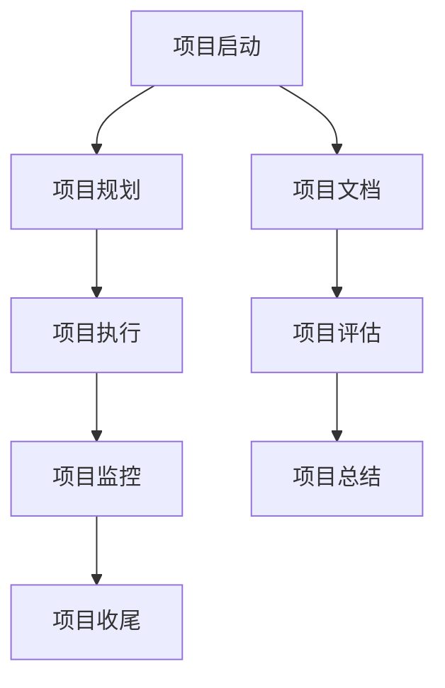

                 

# 项目管理：从启动到收尾的全流程指南

> 关键词：项目管理,敏捷开发,全生命周期,流程优化,成本控制,质量保证

## 1. 背景介绍

### 1.1 问题由来

项目管理在软件开发过程中起着至关重要的作用。无论是企业级应用还是创新型初创项目，成功的关键在于高效的项目管理。然而，传统的项目管理方式往往注重计划的制定和进度控制，而对实际开发过程的反馈和调整不够灵活。随着敏捷开发理念的普及，项目管理的重点开始转向敏捷化、迭代化和持续反馈，以应对市场变化和用户需求的不确定性。

### 1.2 问题核心关键点

项目管理的主要目的是在规定时间内，以最少的成本交付高质量的软件产品。项目管理贯穿整个项目的生命周期，包括项目启动、规划、执行、监控和收尾等多个阶段。一个好的项目管理系统能够平衡这些目标，确保项目高效、有序地推进。

项目管理的关键在于：

- **敏捷化**：通过快速迭代和持续交付，适应市场变化和用户需求。
- **迭代化**：将大项目分解为小迭代，逐步完成各个功能模块。
- **持续反馈**：通过定期的回顾和迭代，快速调整项目方向和开发策略。
- **成本控制**：合理分配项目资源，确保项目在预算内完成。
- **质量保证**：通过严格的测试和审查，保证软件质量和用户满意度。

### 1.3 问题研究意义

研究有效的项目管理方法，对于提高软件开发效率、缩短项目周期、降低成本、提升产品质量具有重要意义。高效的项目管理不仅能够确保项目按时完成，还能增强团队的协作效率和创新能力，为企业的持续发展和市场竞争力提供保障。

## 2. 核心概念与联系

### 2.1 核心概念概述

为更好地理解项目管理，本节将介绍几个密切相关的核心概念：

- **敏捷开发**：一种以人为核心，强调客户合作、迭代开发、持续反馈的软件开发方法。
- **全生命周期**：项目管理的过程包括项目启动、规划、执行、监控和收尾五个阶段，每个阶段都有其独特的目标和任务。
- **流程优化**：通过不断优化项目管理流程，提高项目效率和质量。
- **成本控制**：合理分配项目资源，确保项目在预算内完成。
- **质量保证**：通过严格的测试和审查，保证软件质量和用户满意度。

这些核心概念之间的逻辑关系可以通过以下Mermaid流程图来展示：



这个流程图展示项目管理的关键流程：

1. 项目启动：确定项目目标和范围，组建项目团队。
2. 项目规划：制定详细的项目计划和时间表。
3. 项目执行：按照计划实施开发任务，实现项目目标。
4. 项目监控：跟踪项目进度，及时发现和解决问题。
5. 项目收尾：完成项目交付，并进行总结和评估。

这些概念共同构成了项目管理的基础框架，帮助团队在项目过程中高效运作，实现项目目标。

## 3. 核心算法原理 & 具体操作步骤
### 3.1 算法原理概述

项目管理的基本原理是通过系统的规划和执行，确保项目按时、按质、按预算完成。其核心思想是：

- **项目计划**：明确项目目标和范围，制定详细的项目计划和时间表。
- **资源分配**：合理分配项目资源，包括人员、设备和资金。
- **进度跟踪**：通过定期的进度报告和回顾，及时调整项目方向。
- **风险管理**：识别和评估项目风险，制定应对措施。
- **质量控制**：通过严格的测试和审查，保证软件质量和用户满意度。

项目管理的目标是在限定的时间内，以最低的成本，交付高质量的软件产品。项目管理的核心算法包括：

- **甘特图**：用于直观展示项目进度和时间安排。
- **PERT图**：用于估算项目活动的时间和资源需求。
- **WBS**：将项目分解为可管理的子任务，确保每个任务都有明确的责任人。
- **Scrum**：一种敏捷开发框架，通过迭代和持续反馈，提高项目灵活性和响应速度。
- **Kanban**：一种流程管理方法，通过可视化任务板，优化项目流程。

### 3.2 算法步骤详解

项目管理的具体操作步骤包括：

**Step 1: 项目启动**
- 明确项目目标和范围。
- 组建项目团队，定义角色和职责。
- 制定初步的项目计划和时间表。
- 确定项目里程碑和关键任务。

**Step 2: 项目规划**
- 详细规划项目需求和目标。
- 分解项目为可管理的子任务。
- 估算每个任务的时间、资源和成本。
- 制定项目进度计划和风险管理策略。
- 编写项目文档，包括需求规格、技术文档等。

**Step 3: 项目执行**
- 按照项目计划，逐步实现项目目标。
- 分配项目资源，确保每个任务按时完成。
- 定期召开项目会议，跟踪进度和解决问题。
- 进行代码审查和测试，确保软件质量。
- 记录项目日志，记录项目进展和问题。

**Step 4: 项目监控**
- 定期评估项目进度和质量。
- 及时发现和解决项目问题。
- 调整项目计划和资源分配，确保项目顺利进行。
- 跟踪项目风险，制定应对措施。
- 进行阶段性评审，确保项目按计划推进。

**Step 5: 项目收尾**
- 完成项目交付和验收。
- 进行项目总结和评估。
- 编写项目报告和文档。
- 发布项目成果，并通知相关利益相关者。
- 解散项目团队，释放资源。

### 3.3 算法优缺点

项目管理具有以下优点：

- **系统性**：通过全面的规划和监控，确保项目高效有序地推进。
- **灵活性**：通过迭代和持续反馈，适应市场变化和用户需求。
- **透明性**：通过项目文档和进度报告，确保所有成员了解项目进展。
- **可控性**：通过合理分配资源和风险管理，确保项目在预算内完成。

同时，项目管理也存在一些局限性：

- **复杂性**：需要制定详细的项目计划和时间表，增加了项目管理的复杂度。
- **沟通成本**：需要频繁召开项目会议，进行进度汇报和问题协调。
- **依赖性**：项目进展依赖于团队成员的协作和执行，一旦某环节出现问题，可能影响整个项目进度。
- **适应性**：对于需求变化频繁的项目，传统的项目管理方法可能不够灵活。

尽管存在这些局限性，项目管理仍然是确保项目成功的重要手段。未来研究的方向在于如何进一步优化项目管理流程，提高项目效率和灵活性。

### 3.4 算法应用领域

项目管理在各个行业都有广泛的应用，以下是几个典型的应用领域：

- **软件开发**：通过敏捷开发和持续集成，确保软件按时交付。
- **产品开发**：通过精益开发和原型测试，加速产品上市。
- **市场营销**：通过项目管理，确保市场活动按时、按质完成。
- **项目管理咨询**：为企业提供项目管理和优化建议。
- **IT运维**：通过项目监控和故障管理，确保IT系统稳定运行。

## 4. 数学模型和公式 & 详细讲解 & 举例说明

### 4.1 数学模型构建

项目管理可以通过数学模型来描述和优化。常见的项目管理数学模型包括：

- **PERT图**：
  - **数学模型**：$T = \sum_{i=1}^n (a_i + b_i \times 0.5)$，其中 $T$ 为总工期，$a_i$ 为最早开始时间，$b_i$ 为工作时间。
  - **模型解释**：PERT图通过评估活动的时间、资源和依赖关系，计算总工期和关键路径。
- **甘特图**：
  - **数学模型**：$C_i = \max_{j=i-1}^{n} F_j + d_i$，其中 $C_i$ 为任务 $i$ 的完成时间，$F_j$ 为任务 $j$ 的完成时间，$d_i$ 为任务 $i$ 的持续时间。
  - **模型解释**：甘特图通过时间轴展示项目进度，帮助团队了解任务状态和完成情况。
- **WBS**：
  - **数学模型**：$W = \sum_{i=1}^n \max_{j=i-1}^{n} F_j + d_i$，其中 $W$ 为工作分解结构，$i$ 为任务编号，$F_j$ 为任务 $j$ 的完成时间，$d_i$ 为任务 $i$ 的持续时间。
  - **模型解释**：WBS将项目分解为可管理的子任务，确保每个任务都有明确的责任人。

### 4.2 公式推导过程

以PERT图为例，推导其数学模型的过程如下：

1. **最早开始时间**：每个任务的最早开始时间 $a_i$ 是其所有前驱任务的完成时间加上其持续时间。
2. **最晚开始时间**：每个任务的最晚开始时间 $l_i$ 是其所有后继任务的最早开始时间减去其持续时间。
3. **浮动时间**：每个任务的总浮动时间 $f_i = l_i - a_i$，表示任务可以在最晚开始时间与最早开始时间之间浮动。
4. **关键路径**：计算所有任务的浮动时间，将浮动时间为零的任务组成关键路径，即总工期 $T$。

### 4.3 案例分析与讲解

以软件开发项目为例，分析PERT图的计算过程：

假设一个软件开发项目包含四个任务，分别为编码、测试、集成和部署，每个任务的时间和依赖关系如下：

| 任务编号 | 持续时间 (天) | 前驱任务编号 |
| --- | --- | --- |
| 1 | 5 | 无 |
| 2 | 3 | 1 |
| 3 | 2 | 1 |
| 4 | 1 | 2, 3 |

使用PERT图计算项目总工期和关键路径：

1. **计算最早开始时间和最晚开始时间**：
   - 任务1的最早开始时间为0，最晚开始时间为5，总浮动时间为5。
   - 任务2的最早开始时间为5，最晚开始时间为8，总浮动时间为3。
   - 任务3的最早开始时间为8，最晚开始时间为9，总浮动时间为1。
   - 任务4的最早开始时间为9，最晚开始时间为10，总浮动时间为1。

2. **确定关键路径**：
   - 任务1的浮动时间为5，任务2的浮动时间为3，任务3的浮动时间为1，任务4的浮动时间为1。
   - 关键路径为1-2-3-4，总工期为10。

这意味着整个项目需要10天才能完成，其中任务1、2、3和4都是关键任务，必须按时完成。

## 5. 项目实践：代码实例和详细解释说明
### 5.1 开发环境搭建

在进行项目管理实践前，我们需要准备好开发环境。以下是使用Python进行项目管理的环境配置流程：

1. 安装Anaconda：从官网下载并安装Anaconda，用于创建独立的Python环境。

2. 创建并激活虚拟环境：
```bash
conda create -n project-env python=3.8 
conda activate project-env
```

3. 安装相关库：
```bash
conda install jupyter notebook matplotlib numpy pandas scikit-learn
```

完成上述步骤后，即可在`project-env`环境中开始项目管理实践。

### 5.2 源代码详细实现

这里我们以Scrum敏捷开发方法为例，使用Jupyter Notebook进行项目管理。

首先，定义Scrum任务列表：

```python
# 任务列表
tasks = {
    "Backlog": ["需求分析", "设计", "编码", "测试", "集成", "部署"],
    "Sprint1": ["任务1", "任务2"],
    "Sprint2": ["任务3", "任务4"],
    "Sprint3": ["任务5", "任务6"]
}
```

然后，定义任务进度和状态：

```python
# 任务进度
progress = {
    "任务1": {"开始": 1, "完成": 0},
    "任务2": {"开始": 0, "完成": 0},
    "任务3": {"开始": 0, "完成": 0},
    "任务4": {"开始": 0, "完成": 0},
    "任务5": {"开始": 0, "完成": 0},
    "任务6": {"开始": 0, "完成": 0}
}

# 任务状态
state = {
    "任务1": "待开始",
    "任务2": "待开始",
    "任务3": "待开始",
    "任务4": "待开始",
    "任务5": "待开始",
    "任务6": "待开始"
}
```

接着，定义Scrum冲刺计划：

```python
# Scrum冲刺计划
sprints = [
    {
        "冲刺号": 1,
        "任务列表": ["任务1", "任务2"],
        "目标完成时间": 5
    },
    {
        "冲刺号": 2,
        "任务列表": ["任务3", "任务4"],
        "目标完成时间": 5
    },
    {
        "冲刺号": 3,
        "任务列表": ["任务5", "任务6"],
        "目标完成时间": 5
    }
]
```

最后，定义Scrum项目管理函数：

```python
def scrum_project_management():
    # 开始Scrum
    print("开始Scrum")
    
    # 初始化任务进度和状态
    for task in tasks:
        progress[task] = {"开始": 0, "完成": 0}
        state[task] = "待开始"
    
    # 进行Scrum冲刺
    for sprint in sprints:
        print(f"冲刺 {sprint['冲刺号']}")
        for task in sprint["任务列表"]:
            if task in progress:
                print(f"任务 {task}: 进度 {progress[task]['开始']} / {progress[task]['完成']} = {progress[task]['开始'] / (progress[task]['开始'] + progress[task]['完成'])}")
                state[task] = "进行中"
        
        # 结束冲刺
        print("冲刺结束")
    
    # 项目结束
    print("项目结束")
```

启动Scrum项目管理函数：

```python
scrum_project_management()
```

以上代码实现了使用Jupyter Notebook进行Scrum敏捷开发的项目管理。可以看到，通过定义任务列表、进度和状态，并编写项目管理函数，可以轻松管理Scrum项目。

### 5.3 代码解读与分析

让我们再详细解读一下关键代码的实现细节：

**定义任务列表、进度和状态**：
- `tasks`：定义项目需求和任务。
- `progress`：记录每个任务的开始和完成进度。
- `state`：定义每个任务的状态。

**定义Scrum冲刺计划**：
- `sprints`：定义Scrum冲刺计划，包含冲刺号、任务列表和目标完成时间。

**Scrum项目管理函数**：
- 循环遍历每个冲刺，输出每个任务的状态和进度。
- 使用字典数据结构，方便管理和更新任务进度和状态。

**启动Scrum项目管理函数**：
- 直接调用`scrum_project_management()`函数，启动Scrum项目管理过程。

可以看到，通过使用Python和Jupyter Notebook，项目管理变得更加直观和易于操作。

## 6. 实际应用场景
### 6.1 智能客服系统

智能客服系统是一个典型的项目管理应用场景。传统的客服中心需要大量人力，高峰期响应缓慢，且无法24小时不间断服务。通过敏捷开发和项目管理，可以构建高效、灵活的智能客服系统，提高客户服务效率和质量。

具体而言，可以采用Scrum敏捷开发方法，将客户服务需求划分为多个小迭代，每个迭代完成特定功能模块。在每个迭代结束时，进行代码审查和测试，确保软件质量。同时，通过持续反馈和迭代优化，不断提升系统性能和用户体验。

### 6.2 金融舆情监测

金融舆情监测需要实时监测市场舆论动向，以便及时应对负面信息传播，规避金融风险。传统的舆情监测依赖人工手动，成本高、效率低。通过项目管理方法，可以构建高效、实时的舆情监测系统，提高金融风险管理能力。

具体而言，可以采用敏捷开发和迭代方法，根据市场变化和用户需求，快速开发和部署舆情监测系统。在每个迭代结束时，进行代码审查和测试，确保系统稳定运行。通过持续反馈和迭代优化，不断提升舆情监测的准确性和响应速度。

### 6.3 个性化推荐系统

个性化推荐系统需要高效、灵活的项目管理，以应对市场变化和用户需求。传统的推荐系统往往依赖数据驱动，难以灵活调整。通过敏捷开发和项目管理，可以构建高效、个性化的推荐系统，提升用户满意度和业务收益。

具体而言，可以采用敏捷开发和迭代方法，根据用户行为和反馈，快速开发和部署推荐系统。在每个迭代结束时，进行代码审查和测试，确保系统稳定运行。通过持续反馈和迭代优化，不断提升推荐系统的个性化程度和推荐效果。

### 6.4 未来应用展望

随着敏捷开发和项目管理方法的不断发展，其在各个行业的应用前景更加广阔。未来，项目管理将在更多领域发挥重要作用：

- **智慧医疗**：通过敏捷开发和项目管理，构建高效、可靠的智慧医疗系统，提升医疗服务的智能化水平。
- **智能教育**：通过项目管理，构建高效、灵活的智能教育系统，因材施教，促进教育公平。
- **智慧城市**：通过项目管理，构建高效、智能的城市管理系统，提升城市管理水平和市民满意度。

项目管理将在更多垂直领域发挥作用，帮助企业提升效率、降低成本、提高质量，为数字化转型提供有力支持。

## 7. 工具和资源推荐
### 7.1 学习资源推荐

为了帮助开发者系统掌握项目管理的方法，这里推荐一些优质的学习资源：

1. **敏捷开发基础**：《敏捷软件开发：原则、模式与实践》一书，由Robert C. Martin撰写，详细介绍了敏捷开发的核心思想和方法。

2. **项目管理基础**：Project Management Institute (PMI)提供的项目管理认证课程，涵盖项目管理的各个方面，适合初学者和进阶者。

3. **项目管理工具**：JIRA、Trello、Confluence等项目管理工具，提供强大的项目管理和协作功能，支持敏捷开发和迭代方法。

4. **项目管理框架**：Scrum、Kanban等项目管理框架，提供详细的项目管理流程和方法，帮助团队高效推进项目。

5. **项目管理最佳实践**：《Project Management Body of Knowledge (PMBOK)》，由PMI发布的项目管理标准，涵盖项目管理的各个方面，是项目管理从业者的必备指南。

通过对这些资源的学习，相信你一定能够系统掌握项目管理的方法，并应用于实际项目中。

### 7.2 开发工具推荐

高效的开发离不开优秀的工具支持。以下是几款用于项目管理的常用工具：

1. **JIRA**：一种功能强大的项目管理工具，支持敏捷开发和迭代方法，提供任务管理、问题追踪和报告生成等功能。

2. **Trello**：一种基于看板的项目管理工具，支持敏捷开发和迭代方法，提供任务管理、看板视图和实时协作功能。

3. **Confluence**：一种企业级项目管理工具，提供文档管理、知识共享和团队协作功能，支持敏捷开发和迭代方法。

4. **Asana**：一种任务管理工具，支持敏捷开发和迭代方法，提供任务管理、看板视图和实时协作功能。

5. **GitLab**：一种集成的开发工具，提供版本控制、代码审查和持续集成等功能，支持敏捷开发和迭代方法。

合理利用这些工具，可以显著提升项目管理的效率和质量，加快项目迭代的步伐。

### 7.3 相关论文推荐

项目管理的研究领域广阔，以下是几篇具有代表性的相关论文，推荐阅读：

1. **《敏捷软件开发：原则、模式与实践》**：Robert C. Martin著，详细介绍敏捷开发的核心思想和方法。

2. **《Scrum：敏捷项目管理》**：Ken Schwaber和Mike Beedle著，详细介绍Scrum敏捷项目管理方法。

3. **《Project Management Body of Knowledge (PMBOK)》**：由PMI发布的项目管理标准，涵盖项目管理的各个方面。

4. **《The Agile Samurai》**：Ken Schwaber著，详细介绍敏捷开发和项目管理的最佳实践。

5. **《Scrum@Scale》**：Jeff Sutherland和Scrum.org著，详细介绍Scrum大企业级应用和项目管理。

这些论文代表了项目管理的研究方向，可以帮助你深入理解项目管理的方法和实践。

## 8. 总结：未来发展趋势与挑战

### 8.1 总结

本文对项目管理的方法进行了全面系统的介绍。首先阐述了项目管理的背景和意义，明确了项目管理的核心思想和目标。其次，从原理到实践，详细讲解了项目管理的关键步骤和操作方法，给出了项目管理任务开发的完整代码实例。同时，本文还探讨了项目管理在智能客服、金融舆情、个性化推荐等诸多行业领域的应用前景，展示了项目管理的巨大潜力。最后，本文精选了项目管理的学习资源，力求为读者提供全方位的技术指引。

通过本文的系统梳理，可以看到，项目管理在软件开发过程中起着至关重要的作用。敏捷开发和迭代方法，通过快速迭代和持续反馈，适应市场变化和用户需求，已成为项目管理的主流趋势。高效的项目管理不仅能够确保项目按时完成，还能增强团队的协作效率和创新能力，为企业的持续发展和市场竞争力提供保障。

### 8.2 未来发展趋势

展望未来，项目管理将呈现以下几个发展趋势：

1. **敏捷化**：敏捷开发和迭代方法将成为项目管理的主流趋势，适应市场变化和用户需求。
2. **流程优化**：通过不断优化项目管理流程，提高项目效率和质量。
3. **数字化**：通过数字化工具和平台，提高项目管理效率和透明度。
4. **数据驱动**：利用数据分析和机器学习，优化项目管理决策。
5. **跨部门协作**：打破部门壁垒，促进跨部门协作，提升项目管理效率。

这些趋势凸显了项目管理技术的发展方向，将进一步提升项目管理的高效性和灵活性。

### 8.3 面临的挑战

尽管项目管理已经取得了显著成就，但在迈向更加智能化、普适化应用的过程中，它仍面临诸多挑战：

1. **项目复杂性**：随着项目规模的扩大，项目管理的复杂性增加，需要更多工具和资源支持。
2. **跨部门协作**：不同部门之间存在沟通障碍，协调难度大，需要更多协同工具和流程优化。
3. **资源管理**：资源分配和调度复杂，需要更多智能化的资源管理工具。
4. **风险管理**：项目风险多样，需要更多先进的技术手段进行风险评估和管理。
5. **绩效评估**：项目绩效评估方法需要更多科学、客观的指标和工具。

这些挑战需要持续优化和改进项目管理方法，以应对新的需求和变化。

### 8.4 研究展望

面对项目管理所面临的挑战，未来的研究需要在以下几个方面寻求新的突破：

1. **智能化项目管理**：通过引入智能算法和工具，提升项目管理决策的科学性和准确性。
2. **跨部门协作**：通过引入跨部门协作工具和流程，提升项目管理的协同效率。
3. **数据驱动项目管理**：利用数据分析和机器学习，优化项目管理决策和流程。
4. **项目管理自动化**：通过自动化工具和流程，提高项目管理的效率和质量。
5. **持续改进**：通过持续改进项目管理流程和方法，提升项目管理的高效性和灵活性。

这些研究方向将引领项目管理技术迈向更高的台阶，为构建高效、智能、灵活的项目管理体系提供有力支持。

## 9. 附录：常见问题与解答

**Q1：敏捷开发和传统开发有什么区别？**

A: 敏捷开发和传统开发的主要区别在于其开发过程的灵活性和迭代性。敏捷开发通过快速迭代和持续反馈，适应市场变化和用户需求；传统开发则采用线性开发方式，一次性完成所有开发任务。敏捷开发更注重团队协作和用户反馈，通过短周期迭代，逐步完善软件功能，提高软件质量和用户体验。

**Q2：敏捷开发中的Scrum和Kanban有何区别？**

A: Scrum和Kanban是敏捷开发中两种常用的项目管理框架，其区别在于任务管理和进度跟踪的方式。Scrum通过迭代和冲刺(Sprint)的方式，将大项目分解为小迭代，每个迭代完成后进行代码审查和测试，确保软件质量。Kanban则通过看板(Board)的方式，实时展示任务状态和进度，支持持续反馈和优化。

**Q3：如何提高项目管理效率？**

A: 提高项目管理效率需要从多个方面入手：

1. **优化项目管理流程**：通过标准化和流程化管理，提高项目管理效率。
2. **使用高效工具**：引入敏捷开发和迭代方法，使用高效的项目管理工具，如JIRA、Trello、Confluence等。
3. **持续反馈和迭代**：通过持续反馈和迭代优化，及时调整项目方向和开发策略。
4. **跨部门协作**：打破部门壁垒，促进跨部门协作，提升项目管理效率。
5. **数据驱动决策**：利用数据分析和机器学习，优化项目管理决策。

**Q4：项目管理中如何进行风险管理？**

A: 项目管理中的风险管理主要包括以下步骤：

1. **风险识别**：识别项目可能面临的各种风险，如技术风险、人员风险、时间风险等。
2. **风险评估**：评估风险的概率和影响程度，确定风险优先级。
3. **风险应对**：制定应对措施，如风险规避、风险转移、风险减轻等。
4. **风险监控**：跟踪风险状态，及时调整应对策略。

通过有效的风险管理，可以最大限度地降低项目风险，确保项目顺利推进。

**Q5：项目管理中如何进行成本控制？**

A: 项目管理中的成本控制主要包括以下步骤：

1. **预算规划**：制定详细的项目预算，明确各项成本。
2. **资源分配**：合理分配项目资源，如人员、设备和资金，确保项目在预算内完成。
3. **进度跟踪**：通过进度报告和回顾，及时调整项目方向和开发策略，避免资源浪费。
4. **风险管理**：通过风险评估和管理，减少项目风险，降低成本。
5. **持续优化**：通过持续改进项目管理流程和方法，提高项目管理效率和成本控制能力。

通过有效的成本控制，可以最大限度地降低项目成本，提高企业收益。

---

作者：禅与计算机程序设计艺术 / Zen and the Art of Computer Programming

