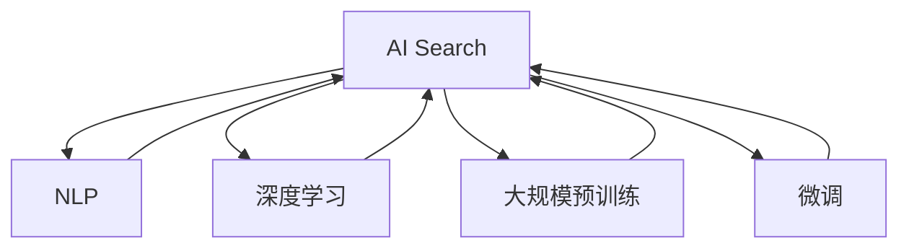

                 

# AI vs 传统搜索：谁将主导未来

## 1. 背景介绍

### 1.1 问题由来
随着互联网技术的迅猛发展，信息检索已经成为现代生活不可或缺的一部分。无论是学术科研、商业决策还是日常娱乐，搜索都扮演着重要角色。传统的搜索方法主要依赖关键词匹配和算法优化，以提高信息检索的准确性和效率。然而，随着用户需求日益复杂化和数据量的爆炸性增长，传统搜索的局限性逐渐显现。与此同时，人工智能（AI）技术特别是深度学习和大语言模型的兴起，为信息检索带来了新的突破。

### 1.2 问题核心关键点
现代信息检索面临的核心问题在于如何平衡查询准确率、召回率和用户体验。传统搜索方法主要依赖倒排索引、PageRank算法等技术，在处理大量数据时存在一定的瓶颈。随着数据量的增长，传统搜索方法在实时性、个性化和跨模态搜索等方面表现不甚理想。

人工智能，尤其是基于深度学习和大语言模型的AI搜索技术，凭借其强大的学习能力和大规模训练的优势，开始崭露头角。通过大规模预训练模型和微调技术，AI搜索能够实现精确理解用户查询意图、快速检索相关结果，并具备跨模态搜索和即时更新的能力。但同时，AI搜索也面临数据隐私、模型鲁棒性、可解释性等挑战。

### 1.3 问题研究意义
深入探索AI搜索与传统搜索的对比，不仅有助于了解当前技术进展，还能为未来搜索技术的方向制定提供科学依据。本文将全面系统地分析AI搜索与传统搜索的不同之处、优缺点以及应用场景，以期为相关领域的开发者和研究人员提供有价值的参考。

## 2. 核心概念与联系

### 2.1 核心概念概述

为更好地理解AI搜索与传统搜索的对比，本节将介绍几个关键概念：

- **AI搜索（AI Search）**：利用人工智能技术，特别是深度学习和大语言模型，来提升信息检索的准确性和效率。包括搜索引擎、图像搜索、语音搜索、自然语言问答等应用。
- **传统搜索（Traditional Search）**：基于关键词匹配、倒排索引、PageRank算法等技术进行信息检索。
- **自然语言处理（Natural Language Processing, NLP）**：研究如何让机器理解和生成人类语言的技术，是AI搜索的重要基础。
- **深度学习（Deep Learning）**：一种基于神经网络的技术，通过多层神经元的特征提取和映射，实现对复杂数据的处理和分析。
- **大规模预训练（Large-Scale Pretraining）**：利用大规模语料库进行预训练，学习通用的语言表示，以便更灵活地适应不同任务。
- **微调（Fine-Tuning）**：在预训练模型的基础上，使用特定任务的数据集对模型进行微调，以提升模型的针对性和效果。

这些核心概念之间的逻辑关系可以通过以下Mermaid流程图来展示：



这个流程图展示了大语言模型的核心概念及其之间的关系：

1. AI搜索是利用NLP、深度学习和大规模预训练等技术实现的信息检索方法。
2. NLP提供语言理解的基础，深度学习负责特征提取，大规模预训练学习通用的语言表示，微调进一步提升特定任务的效果。

## 3. 核心算法原理 & 具体操作步骤

### 3.1 算法原理概述

AI搜索的核心原理在于利用深度学习和大语言模型对查询和文档进行特征表示，并在此基础上进行相似度计算，最终返回排名靠前的结果。其流程大致可以分为以下几个步骤：

1. **数据预处理**：将用户查询和文档转换为向量表示。
2. **相似度计算**：通过计算向量间的相似度，筛选出与查询最匹配的文档。
3. **排序与展示**：根据相似度得分对文档进行排序，展示排名靠前的结果。

传统搜索则主要依赖倒排索引和关键词匹配算法。其流程大致为：

1. **建立倒排索引**：将文档分词、索引和存储。
2. **查询处理**：对用户查询进行分词和匹配，找到包含关键词的文档。
3. **排名与展示**：根据匹配程度和文档权重，对搜索结果进行排序展示。

### 3.2 算法步骤详解

以下是AI搜索和传统搜索的具体操作步骤：

**AI搜索的具体步骤**：
1. **数据预处理**：将用户查询和文档利用BERT、GPT等预训练模型转换为向量表示。
2. **相似度计算**：通过计算向量间的余弦相似度、语义相似度等方法，筛选出与查询最匹配的文档。
3. **排序与展示**：根据相似度得分对文档进行排序，展示排名靠前的结果。

**传统搜索的具体步骤**：
1. **建立倒排索引**：将文档分词、索引和存储。
2. **查询处理**：对用户查询进行分词和匹配，找到包含关键词的文档。
3. **排名与展示**：根据匹配程度和文档权重，对搜索结果进行排序展示。

### 3.3 算法优缺点

AI搜索与传统搜索各有优缺点，具体如下：

**AI搜索的优点**：
1. **查询理解能力强**：通过预训练模型和大规模语料学习，AI搜索能够更好地理解自然语言查询，提供更精确的搜索结果。
2. **跨模态搜索能力**：AI搜索不仅支持文本搜索，还能够处理图像、音频等多模态数据，实现更广泛的搜索应用场景。
3. **实时性**：利用深度学习和大规模预训练模型，AI搜索能够快速处理海量数据，提供实时搜索结果。

**AI搜索的缺点**：
1. **数据隐私**：大规模预训练模型通常需要大量标注数据，可能存在隐私泄露的风险。
2. **模型鲁棒性**：AI搜索模型可能对输入的微小变化敏感，导致搜索结果不稳定。
3. **可解释性差**：AI搜索模型的决策过程难以解释，用户难以理解其工作原理。
4. **计算资源需求高**：预训练和微调模型需要大量计算资源，成本较高。

**传统搜索的优点**：
1. **计算效率高**：传统搜索利用倒排索引和关键词匹配算法，计算效率高，适合处理大量数据。
2. **数据隐私保护好**：传统搜索一般不涉及大规模预训练，对数据隐私的保护较好。
3. **可解释性好**：传统搜索的算法逻辑清晰，易于理解和解释。

**传统搜索的缺点**：
1. **查询理解能力弱**：传统搜索主要依赖关键词匹配，无法理解复杂的自然语言查询。
2. **跨模态搜索能力差**：传统搜索仅支持文本数据，无法处理图像、音频等多模态数据。
3. **实时性不足**：传统搜索处理海量数据较慢，无法提供实时搜索结果。

### 3.4 算法应用领域

AI搜索与传统搜索在多个领域都有广泛应用。以下列举几个典型应用：

- **搜索引擎**：如百度、谷歌等，提供文本、图片、视频等多模态搜索服务。
- **智能问答系统**：如微软小冰、IBM Watson等，利用AI搜索和NLP技术实现自然语言问答。
- **个性化推荐系统**：如亚马逊、Netflix等，通过分析用户行为，提供个性化的搜索结果。
- **图像搜索**：如Google Images、Pinterest等，利用深度学习模型进行图像识别和相似度计算。
- **语音搜索**：如Siri、Google Assistant等，通过语音识别和NLP技术实现语音搜索。

## 4. 数学模型和公式 & 详细讲解 & 举例说明

### 4.1 数学模型构建

本节将使用数学语言对AI搜索和传统搜索的模型进行更加严格的刻画。

**AI搜索的数学模型**：
设用户查询为 $q$，文档集合为 $D$。利用BERT模型将查询和文档转换为向量表示 $q_v, d_v$。根据向量之间的余弦相似度计算相似度得分 $s_i$，最终返回排名靠前的文档。

**公式推导过程**：
设 $q_v = \text{BERT}(q)$，$d_v = \text{BERT}(d_i)$，则相似度得分 $s_i = \cos(\theta) = \frac{q_v \cdot d_v}{\|q_v\| \cdot \|d_v\|}$。排名向量 $r = [s_1, s_2, \ldots, s_n]$，最终排序展示排名靠前的文档。

**传统搜索的数学模型**：
设查询为 $q$，文档集合为 $D$。利用倒排索引构建查询与文档的匹配关系 $m_i$，根据匹配程度和文档权重计算得分 $s_i = m_i \cdot w_i$，最终返回排名靠前的文档。

**公式推导过程**：
设 $m_i = \text{BOOLEAN}(q, d_i)$，$w_i = \text{TF-IDF}(d_i)$，则相似度得分 $s_i = m_i \cdot w_i$。排名向量 $r = [s_1, s_2, \ldots, s_n]$，最终排序展示排名靠前的文档。

### 4.3 案例分析与讲解

**案例一：图像搜索**
- **AI搜索**：利用ResNet、VGG等深度学习模型对图像进行特征提取，再通过余弦相似度计算相似度得分，返回与查询最匹配的图像。
- **传统搜索**：建立倒排索引，将图像的标签和文本描述作为索引，通过匹配度计算相似度得分，返回匹配度高的图像。

**案例二：智能问答系统**
- **AI搜索**：利用BERT等模型对用户问题和文档进行向量表示，计算相似度得分，返回最匹配的文档。
- **传统搜索**：建立倒排索引，将问题和文档进行关键词匹配，根据匹配程度排序返回结果。

## 5. 项目实践：代码实例和详细解释说明

### 5.1 开发环境搭建

在进行AI搜索和传统搜索的项目实践前，我们需要准备好开发环境。以下是使用Python进行TensorFlow和PyTorch开发的环境配置流程：

1. 安装Anaconda：从官网下载并安装Anaconda，用于创建独立的Python环境。
2. 创建并激活虚拟环境：
```bash
conda create -n ai-env python=3.8 
conda activate ai-env
```
3. 安装TensorFlow和PyTorch：
```bash
conda install tensorflow==2.7 pytorch==1.10 -c pytorch -c conda-forge
```

完成上述步骤后，即可在`ai-env`环境中开始项目实践。

### 5.2 源代码详细实现

这里我们以AI搜索中的图像搜索为例，使用TensorFlow实现ResNet模型，对图像进行特征提取和相似度计算。

**源代码实现**：
```python
import tensorflow as tf
from tensorflow.keras.applications.resnet50 import ResNet50

# 加载预训练ResNet50模型
model = ResNet50(weights='imagenet')

# 定义特征提取函数
def extract_features(image):
    image = tf.keras.preprocessing.image.img_to_array(image)
    image = tf.expand_dims(image, axis=0)
    features = model.predict(image)
    return features

# 定义相似度计算函数
def calculate_similarity(query_features, document_features):
    return tf.nn.cosine_similarity(query_features, document_features)

# 实现图像搜索功能
def image_search(query_image, image_data):
    query_features = extract_features(query_image)
    document_features = [extract_features(image) for image in image_data]
    similarity_scores = [calculate_similarity(query_features, feature) for feature in document_features]
    sorted_indices = sorted(range(len(similarity_scores)), key=lambda k: similarity_scores[k])
    top_images = [image_data[i] for i in sorted_indices[:10]]
    return top_images
```

### 5.3 代码解读与分析

让我们再详细解读一下关键代码的实现细节：

**ResNet50模型**：
- 使用TensorFlow加载预训练的ResNet50模型，该模型已经在大规模图像数据上进行预训练。
- 通过模型对输入图像进行特征提取，返回一个包含所有特征的列表。

**特征提取函数`extract_features`**：
- 将图像转换为TensorFlow张量，并进行预处理。
- 使用ResNet50模型对图像进行特征提取，返回特征向量。

**相似度计算函数`calculate_similarity`**：
- 使用余弦相似度计算两个特征向量之间的相似度得分。
- 返回一个包含所有相似度得分的列表。

**图像搜索函数`image_search`**：
- 对查询图像和文档图像进行特征提取。
- 计算查询图像与所有文档图像之间的相似度得分。
- 根据相似度得分对文档图像进行排序，返回排名靠前的图像。

### 5.4 运行结果展示

以下是使用以上代码实现的图像搜索示例：

```python
import numpy as np
import matplotlib.pyplot as plt

# 加载测试图像数据
test_image = np.load('test_image.npy')
test_image = np.expand_dims(test_image, axis=0)

# 加载图像数据集
image_data = np.load('image_data.npy', allow_pickle=True)

# 进行图像搜索
top_images = image_search(test_image, image_data)

# 展示搜索结果
fig, axes = plt.subplots(nrows=1, ncols=5, figsize=(10, 10))
for i, image in enumerate(top_images):
    axes[i].imshow(image)
    axes[i].set_title('Top {} Image'.format(i+1))
plt.show()
```

## 6. 实际应用场景

### 6.1 智能问答系统

智能问答系统是AI搜索的重要应用之一。通过AI搜索技术，系统能够理解自然语言查询，并提供相关的答案。例如，智能客服系统、在线医疗咨询、智能家居控制等场景。

**示例**：
- **智能客服**：在客户咨询时，系统能够根据客户提问，通过自然语言理解技术，匹配出相关答案，快速回复客户。
- **在线医疗**：通过医疗知识库，系统能够回答患者关于病情、用药等医学问题，并提供治疗建议。
- **智能家居**：通过语音识别和NLP技术，系统能够理解用户指令，控制家庭设备，提升生活便利性。

### 6.2 个性化推荐系统

个性化推荐系统是AI搜索的另一重要应用。通过分析用户行为数据，AI搜索能够推荐用户感兴趣的内容，提升用户体验。例如，电子商务网站、社交媒体平台等。

**示例**：
- **电子商务网站**：根据用户浏览、购买记录，系统能够推荐用户可能感兴趣的商品，提升转化率。
- **社交媒体平台**：通过分析用户互动行为，系统能够推荐用户可能感兴趣的内容，增加用户粘性。

### 6.3 视觉搜索

视觉搜索是AI搜索的新兴领域，利用图像识别技术，通过视觉数据进行搜索。例如，电商网站的图片搜索、社交媒体的视觉发现等。

**示例**：
- **电商网站**：用户通过上传图片，系统能够识别商品，返回相似的商品图片，方便用户浏览和购买。
- **社交媒体**：系统能够自动发现用户感兴趣的图片内容，提供视觉相关的推荐。

## 7. 工具和资源推荐

### 7.1 学习资源推荐

为了帮助开发者系统掌握AI搜索的理论基础和实践技巧，这里推荐一些优质的学习资源：

1. **《深度学习》课程**：斯坦福大学开设的深度学习入门课程，有Lecture视频和配套作业，带你入门深度学习的基础概念和经典模型。
2. **《TensorFlow官方文档》**：TensorFlow的官方文档，提供了丰富的API文档和样例代码，是学习TensorFlow的必备资料。
3. **《Transformers库官方文档》**：Transformers库的官方文档，提供了大量的预训练模型和微调样例，是学习NLP和AI搜索的必备工具。
4. **《AI搜索与自然语言处理》书籍**：系统介绍AI搜索和NLP的基本原理和应用，适合初学者入门。
5. **《机器学习实战》书籍**：提供丰富的案例和代码实现，帮助开发者实践机器学习算法，包括搜索相关的应用。

### 7.2 开发工具推荐

高效的开发离不开优秀的工具支持。以下是几款用于AI搜索和NLP任务的常用工具：

1. **TensorFlow**：由Google主导开发的开源深度学习框架，生产部署方便，适合大规模工程应用。
2. **PyTorch**：基于Python的开源深度学习框架，灵活动态的计算图，适合快速迭代研究。
3. **Transformers库**：HuggingFace开发的NLP工具库，集成了众多SOTA语言模型，支持PyTorch和TensorFlow，是进行AI搜索任务开发的利器。
4. **Jupyter Notebook**：免费的在线Jupyter Notebook环境，提供交互式编程体验，适合快速迭代和实验。
5. **Weights & Biases**：模型训练的实验跟踪工具，可以记录和可视化模型训练过程中的各项指标，方便对比和调优。

### 7.3 相关论文推荐

AI搜索与NLP领域的研究不断发展，以下是几篇奠基性的相关论文，推荐阅读：

1. **Attention is All You Need**：Transformer模型原论文，提出了自注意力机制，开启NLP领域的预训练大模型时代。
2. **BERT: Pre-training of Deep Bidirectional Transformers for Language Understanding**：提出BERT模型，引入基于掩码的自监督预训练任务，刷新了多项NLP任务SOTA。
3. **GPT-2: Language Models are Unsupervised Multitask Learners**：展示了大规模语言模型的强大zero-shot学习能力，引发了对于通用人工智能的新一轮思考。
4. **RoBERTa: A Robustly Optimized BERT Pretraining Approach**：提出RoBERTa模型，改进预训练方法和超参数设置，进一步提升了BERT的性能。
5. **Dense Passage Retrieval for Open-Domain Question Answering**：提出基于密集段落检索的问答系统，在Open-Domain问答任务上取得了SOTA性能。

这些论文代表了大语言模型和AI搜索技术的发展脉络。通过学习这些前沿成果，可以帮助研究者把握学科前进方向，激发更多的创新灵感。

## 8. 总结：未来发展趋势与挑战

### 8.1 总结

本文对AI搜索和传统搜索的对比进行了全面系统的介绍。首先阐述了AI搜索和传统搜索的背景、核心概念和联系，明确了AI搜索在查询理解、跨模态搜索等方面的优势。其次，从原理到实践，详细讲解了AI搜索和传统搜索的具体操作步骤，给出了AI搜索的代码实现。同时，本文还广泛探讨了AI搜索在智能问答系统、个性化推荐系统、视觉搜索等多个行业领域的应用前景，展示了AI搜索技术的巨大潜力。

通过本文的系统梳理，可以看到，AI搜索正在成为现代信息检索的重要范式，极大地拓展了搜索技术的应用边界，带来了新的创新和发展。未来，伴随AI技术的进一步成熟和普及，搜索技术将迎来更广阔的发展前景。

### 8.2 未来发展趋势

展望未来，AI搜索技术将呈现以下几个发展趋势：

1. **智能化程度提升**：AI搜索将结合自然语言处理、图像识别、语音识别等多模态技术，提升对复杂查询的理解能力和搜索结果的丰富性。
2. **跨领域融合**：AI搜索将与其他AI技术如推荐系统、知识图谱、强化学习等进行更深层次的融合，实现更全面、智能的信息检索。
3. **实时性增强**：利用云计算和大数据技术，AI搜索将支持实时数据处理和查询，提供更即时、高效的搜索结果。
4. **隐私保护增强**：AI搜索将加强数据隐私保护，引入差分隐私、联邦学习等技术，确保用户数据的匿名性和安全性。
5. **跨语言支持**：AI搜索将支持多语言搜索，帮助用户跨语言获取信息，提升全球范围内的信息可获取性。

这些趋势将进一步推动AI搜索技术的发展，为信息检索领域带来新的变革和突破。

### 8.3 面临的挑战

尽管AI搜索技术已经取得了瞩目成就，但在迈向更加智能化、普适化应用的过程中，仍面临诸多挑战：

1. **数据隐私和安全**：大规模预训练模型通常需要大量标注数据，可能存在隐私泄露的风险。如何在保护数据隐私的同时，提升模型性能，是未来需要解决的问题。
2. **模型鲁棒性和泛化性**：AI搜索模型可能对输入的微小变化敏感，导致搜索结果不稳定。如何提高模型的鲁棒性和泛化能力，确保在不同场景下都能稳定工作，是一大挑战。
3. **可解释性和透明性**：AI搜索模型的决策过程难以解释，用户难以理解其工作原理。如何提高模型的透明性和可解释性，增强用户信任，是未来需要解决的问题。
4. **计算资源消耗**：AI搜索模型通常需要大量计算资源，成本较高。如何优化模型结构，降低计算资源消耗，提高效率，是未来需要解决的问题。

### 8.4 研究展望

面对AI搜索面临的这些挑战，未来的研究需要在以下几个方面寻求新的突破：

1. **隐私保护技术**：开发更高效的差分隐私、联邦学习等隐私保护技术，保护用户数据隐私。
2. **模型鲁棒性增强**：引入鲁棒性训练方法，如对抗训练、噪声注入等，提升模型的泛化能力。
3. **可解释性和透明性**：开发可解释性算法，如决策树、可解释性模型等，增强模型的透明性和可解释性。
4. **计算资源优化**：优化模型结构，引入分布式训练、模型压缩等技术，降低计算资源消耗，提高效率。

这些研究方向将推动AI搜索技术的发展，为构建更加智能、普适、安全的信息检索系统铺平道路。相信随着学界和产业界的共同努力，AI搜索技术必将在未来成为信息检索领域的核心力量，为人类信息获取提供更加高效、便捷的解决方案。

## 9. 附录：常见问题与解答

**Q1：AI搜索和传统搜索哪个更适合特定应用场景？**

A: AI搜索和传统搜索各有优缺点，适合不同的应用场景。对于查询理解能力强、实时性要求高的场景，如智能问答系统，AI搜索更适合。对于数据量较大、计算效率要求高的场景，如搜索引擎，传统搜索更适合。

**Q2：AI搜索的性能如何？**

A: AI搜索在查询理解、跨模态搜索等方面表现出色，但在数据隐私、模型鲁棒性、可解释性等方面仍需进一步优化。未来随着技术不断进步，AI搜索的性能将进一步提升，更加适合复杂多变的应用场景。

**Q3：如何保护AI搜索的数据隐私？**

A: 采用差分隐私、联邦学习等隐私保护技术，可以有效保护用户数据隐私。同时，对于敏感数据进行脱敏处理，减少隐私泄露风险。

**Q4：AI搜索的计算资源需求高吗？**

A: 大规模预训练模型和微调模型需要大量计算资源，成本较高。可以通过分布式训练、模型压缩等技术进行优化，降低计算资源消耗，提高效率。

**Q5：AI搜索的可解释性如何？**

A: AI搜索模型的决策过程难以解释，用户难以理解其工作原理。未来需要通过可解释性算法和工具，增强模型的透明性和可解释性，增强用户信任。

---

作者：禅与计算机程序设计艺术 / Zen and the Art of Computer Programming

