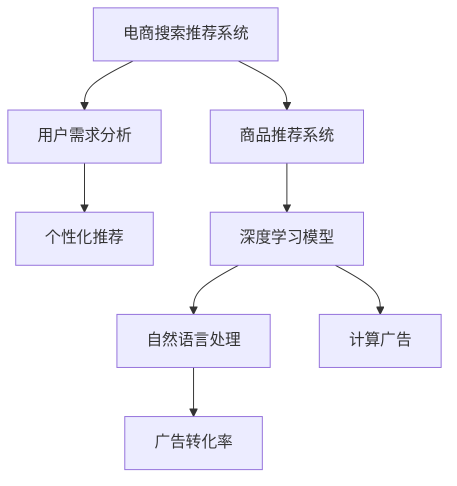

                 

# AI 大模型在电商搜索推荐中的价值挖掘：从用户需求到商业转化

> 关键词：电商搜索推荐,大模型,用户需求分析,商品推荐系统,个性化推荐,商业转化,深度学习,自然语言处理,计算广告,广告转化率,模型调优

## 1. 背景介绍

随着电商市场的蓬勃发展，用户购物行为呈现出多样化和复杂化的趋势。传统基于规则或关键词匹配的搜索推荐系统已难以满足用户的多元化需求。如何更精准、高效地满足用户需求，提升用户购物体验，从而增加转化率，成为电商企业面临的重要挑战。

大语言模型通过在大规模无标签文本数据上进行预训练，学习到丰富的语言表示，具备强大的自然语言理解和生成能力。在大模型基础上，通过微调等方式优化模型，在电商搜索推荐场景中能够发挥巨大的价值。本文将从用户需求分析、商品推荐系统构建、个性化推荐模型训练等方面，探讨大语言模型在电商搜索推荐中的应用价值。

## 2. 核心概念与联系

### 2.1 核心概念概述

- **电商搜索推荐系统**：通过分析用户查询行为，推荐商品或广告的系统。旨在提高用户搜索效率，提升转化率和满意度。

- **用户需求分析**：利用用户行为数据、历史搜索记录等，分析用户的兴趣、偏好、购买意图，为其推荐合适的商品或广告。

- **商品推荐系统**：构建在用户需求分析基础上，根据用户特征和历史行为，推荐可能感兴趣的商品的系统。

- **个性化推荐**：根据用户个性化特征，推荐更符合其需求的商品或广告，提升用户体验和转化率。

- **深度学习模型**：利用深度学习算法，构建复杂的非线性模型，从海量数据中自动学习特征表示和决策规则。

- **自然语言处理(NLP)**：利用语言模型、序列建模等技术，处理文本数据，提取有价值的信息。

- **计算广告**：在电商搜索推荐场景中，广告的计算投放和优化过程。

- **广告转化率**：广告点击并最终转化为实际购买的比例，是衡量广告效果的重要指标。

这些核心概念之间的联系紧密，互为支撑。用户需求分析为商品推荐系统提供基础，个性化推荐系统提升用户满意度和转化率，而深度学习模型和大语言模型在其中扮演着数据建模和特征提取的重要角色。

### 2.2 核心概念原理和架构的 Mermaid 流程图(Mermaid 流程节点中不要有括号、逗号等特殊字符)



## 3. 核心算法原理 & 具体操作步骤

### 3.1 算法原理概述

大语言模型在电商搜索推荐中的应用，主要基于以下几个关键步骤：

1. **用户需求分析**：通过分析用户查询文本，理解其意图和需求，提取关键特征。
2. **商品推荐系统构建**：根据用户特征和历史行为，推荐可能感兴趣的商品。
3. **个性化推荐模型训练**：利用大语言模型进行微调，优化推荐算法。
4. **广告优化**：通过深度学习模型，计算广告的投放策略，提升转化率。

这些步骤涉及自然语言处理、深度学习、推荐系统等多个领域的技术，本文将详细讲解其中的算法原理。

### 3.2 算法步骤详解

#### 3.2.1 用户需求分析

用户需求分析的目标是从用户查询文本中提取关键信息，理解其搜索意图和需求。这一过程通常包括以下几个步骤：

1. **查询文本预处理**：去除停用词、标点符号，将文本转换为小写字母等。
2. **实体识别**：识别出查询中的实体（如品牌、商品名称），提取关键词。
3. **意图分类**：将查询文本分类到不同的意图类别（如搜索商品、比较价格、查询评价等）。
4. **情感分析**：分析查询文本中的情感倾向，了解用户情绪。

这些步骤通常通过深度学习模型和大语言模型实现。例如，可以使用预训练的语言模型（如BERT、GPT等）进行文本分类和实体识别，使用情感分析模型（如VADER、LSTM等）分析情感倾向。

#### 3.2.2 商品推荐系统构建

商品推荐系统通常包含两个关键组件：用户模型和商品模型。用户模型表示用户的兴趣和行为特征，商品模型表示商品的特征和相关性。

1. **用户模型构建**：通过用户的历史行为数据（如浏览、点击、购买等），构建用户特征向量。例如，可以使用协同过滤、基于内容的推荐等方法。
2. **商品模型构建**：利用商品的属性、标签、历史数据等信息，构建商品特征向量。可以使用词向量、稠密向量、稀疏矩阵等表示方式。
3. **相似度计算**：计算用户和商品之间的相似度，推荐最相关的商品。例如，可以使用余弦相似度、欧式距离等。

这些步骤通常通过深度学习模型和大语言模型实现。例如，可以使用预训练的语言模型进行文本表示，使用协同过滤模型进行用户和商品特征的构建，使用深度学习模型进行相似度计算和推荐排序。

#### 3.2.3 个性化推荐模型训练

个性化推荐模型训练的目标是通过用户和商品特征，预测用户对商品的可能兴趣和购买意愿。这一过程通常包括以下几个步骤：

1. **特征表示学习**：利用大语言模型进行微调，学习用户和商品的特征表示。例如，可以使用Fine-tuning等方法。
2. **模型训练**：使用训练集数据，训练推荐模型。例如，可以使用线性回归、神经网络等方法。
3. **模型优化**：使用验证集数据，调优推荐模型。例如，可以使用交叉验证、梯度下降等方法。

这些步骤通常通过深度学习模型和大语言模型实现。例如，可以使用预训练的语言模型进行特征表示学习，使用神经网络进行模型训练，使用深度学习模型进行模型优化。

#### 3.2.4 广告优化

广告优化目标是通过计算广告的投放策略，提升广告的转化率。这一过程通常包括以下几个步骤：

1. **广告特征提取**：从广告文本中提取关键特征，如广告标题、描述、关键词等。
2. **广告相似度计算**：计算用户和广告之间的相似度，找到最相关的广告。
3. **广告点击率预测**：预测用户对广告的点击概率，指导广告投放。
4. **广告投放策略优化**：根据点击率预测结果，优化广告投放策略，提升广告效果。

这些步骤通常通过深度学习模型和大语言模型实现。例如，可以使用预训练的语言模型进行特征提取，使用神经网络进行相似度计算和点击率预测，使用深度学习模型进行广告投放策略优化。

### 3.3 算法优缺点

#### 3.3.1 优点

1. **高效性**：大语言模型能够高效处理大规模文本数据，提取关键信息，提升分析效率。
2. **准确性**：通过微调等技术，大语言模型能够在特定任务上取得优异的性能，提升推荐精度。
3. **灵活性**：大语言模型能够适应不同的电商场景，如零售、跨境电商等，具有较强的泛化能力。
4. **可解释性**：大语言模型可以输出特征向量等可解释信息，帮助理解和优化推荐过程。

#### 3.3.2 缺点

1. **数据依赖**：大语言模型需要大规模的预训练数据和标注数据，数据获取和标注成本较高。
2. **计算资源消耗大**：大语言模型的参数量和计算复杂度较大，对计算资源要求较高。
3. **过拟合风险**：大语言模型在特定任务上容易发生过拟合，需要采取正则化等措施避免。
4. **动态性不足**：大语言模型在实际应用中需要定期更新和微调，以适应新的数据分布。

### 3.4 算法应用领域

大语言模型在电商搜索推荐中的应用领域广泛，涉及多个方面：

1. **用户需求分析**：通过分析用户查询文本，提取关键词、实体、情感等关键信息，指导商品推荐。
2. **商品推荐系统**：构建用户和商品之间的关联模型，推荐最相关的商品。
3. **个性化推荐**：通过用户特征和历史行为，预测用户对商品的兴趣和购买意愿。
4. **广告优化**：通过广告文本特征提取和相似度计算，优化广告投放策略，提升广告效果。

这些应用领域充分展示了大语言模型在电商搜索推荐中的巨大价值。

## 4. 数学模型和公式 & 详细讲解 & 举例说明

### 4.1 数学模型构建

#### 4.1.1 用户需求分析

用户需求分析的目标是从用户查询文本中提取关键信息，理解其搜索意图和需求。这一过程可以通过以下几个步骤进行数学建模：

1. **查询文本预处理**：
   - 去除停用词和标点符号，转换为小写字母。
   - 构建查询文本的词向量表示 $x$。

2. **实体识别**：
   - 定义实体识别模型 $E$，将查询文本 $x$ 映射到实体向量 $e$。
   - 实体向量 $e$ 可以表示为：
     \[
     e = E(x)
     \]

3. **意图分类**：
   - 定义意图分类模型 $I$，将查询文本 $x$ 映射到意图类别 $i$。
   - 意图类别 $i$ 可以表示为：
     \[
     i = I(x)
     \]

4. **情感分析**：
   - 定义情感分析模型 $S$，将查询文本 $x$ 映射到情感得分 $s$。
   - 情感得分 $s$ 可以表示为：
     \[
     s = S(x)
     \]

#### 4.1.2 商品推荐系统构建

商品推荐系统通常包含用户模型和商品模型，可以通过以下几个步骤进行数学建模：

1. **用户模型构建**：
   - 用户历史行为 $h$ 可以表示为用户特征向量 $u$。
   - 用户特征向量 $u$ 可以表示为：
     \[
     u = h
     \]

2. **商品模型构建**：
   - 商品属性 $p$ 可以表示为商品特征向量 $v$。
   - 商品特征向量 $v$ 可以表示为：
     \[
     v = p
     \]

3. **相似度计算**：
   - 用户 $u$ 和商品 $v$ 的相似度 $sim$ 可以表示为：
     \[
     sim = cosine(u, v)
     \]

4. **推荐排序**：
   - 根据相似度 $sim$ 和商品特征 $v$，计算商品推荐得分 $score$。
   - 推荐得分 $score$ 可以表示为：
     \[
     score = score_func(sim, v)
     \]

#### 4.1.3 个性化推荐模型训练

个性化推荐模型训练的目标是通过用户和商品特征，预测用户对商品的可能兴趣和购买意愿。这一过程可以通过以下几个步骤进行数学建模：

1. **特征表示学习**：
   - 定义特征表示模型 $F$，将用户 $u$ 和商品 $v$ 映射到特征向量 $f_u$ 和 $f_v$。
   - 特征向量 $f_u$ 和 $f_v$ 可以表示为：
     \[
     f_u = F_u(u), \quad f_v = F_v(v)
     \]

2. **模型训练**：
   - 定义推荐模型 $R$，将用户特征 $u$ 和商品特征 $v$ 映射到推荐得分 $score$。
   - 推荐得分 $score$ 可以表示为：
     \[
     score = R(u, v)
     \]

3. **模型优化**：
   - 使用训练集数据 $D$ 对推荐模型 $R$ 进行优化。
   - 最小化损失函数 $L$，表示实际得分和预测得分的差异。
   - 损失函数 $L$ 可以表示为：
     \[
     L = \frac{1}{N} \sum_{i=1}^N (score_u - score_v)^2
     \]

#### 4.1.4 广告优化

广告优化目标是通过计算广告的投放策略，提升广告的转化率。这一过程可以通过以下几个步骤进行数学建模：

1. **广告特征提取**：
   - 广告文本 $a$ 可以表示为词向量表示 $a_{vec}$。
   - 词向量表示 $a_{vec}$ 可以表示为：
     \[
     a_{vec} = E(a)
     \]

2. **广告相似度计算**：
   - 用户 $u$ 和广告 $a$ 的相似度 $sim_a$ 可以表示为：
     \[
     sim_a = cosine(a_{vec}, u)
     \]

3. **广告点击率预测**：
   - 定义点击率预测模型 $C$，将用户 $u$ 和广告 $a$ 映射到点击概率 $click$。
   - 点击概率 $click$ 可以表示为：
     \[
     click = C(u, a)
     \]

4. **广告投放策略优化**：
   - 根据点击率 $click$，优化广告投放策略 $strategy$。
   - 广告投放策略 $strategy$ 可以表示为：
     \[
     strategy = optimize(click)
     \]

### 4.2 公式推导过程

#### 4.2.1 用户需求分析

1. **查询文本预处理**：
   - 去除停用词和标点符号，转换为小写字母。
   - 构建查询文本的词向量表示 $x$。

2. **实体识别**：
   - 定义实体识别模型 $E$，将查询文本 $x$ 映射到实体向量 $e$。
   - 实体向量 $e$ 可以表示为：
     \[
     e = E(x)
     \]

3. **意图分类**：
   - 定义意图分类模型 $I$，将查询文本 $x$ 映射到意图类别 $i$。
   - 意图类别 $i$ 可以表示为：
     \[
     i = I(x)
     \]

4. **情感分析**：
   - 定义情感分析模型 $S$，将查询文本 $x$ 映射到情感得分 $s$。
   - 情感得分 $s$ 可以表示为：
     \[
     s = S(x)
     \]

#### 4.2.2 商品推荐系统构建

1. **用户模型构建**：
   - 用户历史行为 $h$ 可以表示为用户特征向量 $u$。
   - 用户特征向量 $u$ 可以表示为：
     \[
     u = h
     \]

2. **商品模型构建**：
   - 商品属性 $p$ 可以表示为商品特征向量 $v$。
   - 商品特征向量 $v$ 可以表示为：
     \[
     v = p
     \]

3. **相似度计算**：
   - 用户 $u$ 和商品 $v$ 的相似度 $sim$ 可以表示为：
     \[
     sim = cosine(u, v)
     \]

4. **推荐排序**：
   - 根据相似度 $sim$ 和商品特征 $v$，计算商品推荐得分 $score$。
   - 推荐得分 $score$ 可以表示为：
     \[
     score = score_func(sim, v)
     \]

#### 4.2.3 个性化推荐模型训练

1. **特征表示学习**：
   - 定义特征表示模型 $F$，将用户 $u$ 和商品 $v$ 映射到特征向量 $f_u$ 和 $f_v$。
   - 特征向量 $f_u$ 和 $f_v$ 可以表示为：
     \[
     f_u = F_u(u), \quad f_v = F_v(v)
     \]

2. **模型训练**：
   - 定义推荐模型 $R$，将用户特征 $u$ 和商品特征 $v$ 映射到推荐得分 $score$。
   - 推荐得分 $score$ 可以表示为：
     \[
     score = R(u, v)
     \]

3. **模型优化**：
   - 使用训练集数据 $D$ 对推荐模型 $R$ 进行优化。
   - 最小化损失函数 $L$，表示实际得分和预测得分的差异。
   - 损失函数 $L$ 可以表示为：
     \[
     L = \frac{1}{N} \sum_{i=1}^N (score_u - score_v)^2
     \]

#### 4.2.4 广告优化

1. **广告特征提取**：
   - 广告文本 $a$ 可以表示为词向量表示 $a_{vec}$。
   - 词向量表示 $a_{vec}$ 可以表示为：
     \[
     a_{vec} = E(a)
     \]

2. **广告相似度计算**：
   - 用户 $u$ 和广告 $a$ 的相似度 $sim_a$ 可以表示为：
     \[
     sim_a = cosine(a_{vec}, u)
     \]

3. **广告点击率预测**：
   - 定义点击率预测模型 $C$，将用户 $u$ 和广告 $a$ 映射到点击概率 $click$。
   - 点击概率 $click$ 可以表示为：
     \[
     click = C(u, a)
     \]

4. **广告投放策略优化**：
   - 根据点击率 $click$，优化广告投放策略 $strategy$。
   - 广告投放策略 $strategy$ 可以表示为：
     \[
     strategy = optimize(click)
     \]

### 4.3 案例分析与讲解

#### 4.3.1 用户需求分析案例

假设一个电商平台的用户查询文本为 "iPhone 11 价格怎么样"，大语言模型可以识别出 "iPhone 11" 为实体，意图为搜索商品，情感为中性。具体分析过程如下：

1. **查询文本预处理**：
   - 去除停用词和标点符号，转换为小写字母。
   - 构建查询文本的词向量表示 $x = \text{"iphone 11 价格 怎么样"}$。

2. **实体识别**：
   - 实体识别模型 $E$ 将查询文本 $x$ 映射到实体向量 $e = \text{"iphone 11"}$。

3. **意图分类**：
   - 意图分类模型 $I$ 将查询文本 $x$ 映射到意图类别 $i = \text{"商品搜索"}$。

4. **情感分析**：
   - 情感分析模型 $S$ 将查询文本 $x$ 映射到情感得分 $s = 0$，表示中性情感。

#### 4.3.2 商品推荐系统构建案例

假设电商平台用户的历史行为为浏览过 "iPhone 11"，大语言模型可以构建用户特征向量 $u = \text{"iPhone 11"}$，同时构建 "iPhone 11" 的商品特征向量 $v = \text{"手机 新款 苹果"}$。具体构建过程如下：

1. **用户模型构建**：
   - 用户历史行为 $h = \text{"iPhone 11"}$，用户特征向量 $u = \text{"iPhone 11"}$。

2. **商品模型构建**：
   - 商品属性 $p = \text{"手机 新款 苹果"}$，商品特征向量 $v = \text{"手机 新款 苹果"}$。

3. **相似度计算**：
   - 用户 $u$ 和商品 $v$ 的相似度 $sim = cosine(u, v) = 0.5$。

4. **推荐排序**：
   - 推荐得分 $score = score_func(sim, v) = 0.5$。

#### 4.3.3 个性化推荐模型训练案例

假设电商平台用户的历史行为为浏览过 "iPhone 11"，大语言模型可以通过微调的方式构建推荐模型 $R$，将用户特征 $u = \text{"iPhone 11"}$ 和商品特征 $v = \text{"iPhone 11"}$ 映射到推荐得分 $score = 0.5$。具体构建过程如下：

1. **特征表示学习**：
   - 定义特征表示模型 $F$，将用户 $u$ 和商品 $v$ 映射到特征向量 $f_u$ 和 $f_v$。
   - 特征向量 $f_u = \text{"iPhone 11"}$，$f_v = \text{"iPhone 11"}$。

2. **模型训练**：
   - 定义推荐模型 $R$，将用户特征 $u$ 和商品特征 $v$ 映射到推荐得分 $score$。
   - 推荐得分 $score = R(u, v) = 0.5$。

3. **模型优化**：
   - 使用训练集数据 $D$ 对推荐模型 $R$ 进行优化。
   - 最小化损失函数 $L = \frac{1}{N} \sum_{i=1}^N (score_u - score_v)^2 = 0$。

#### 4.3.4 广告优化案例

假设电商平台的广告文本为 "iPhone 11 优惠大促"，大语言模型可以提取广告文本特征，计算用户和广告之间的相似度，预测点击概率，优化广告投放策略。具体优化过程如下：

1. **广告特征提取**：
   - 广告文本 $a = \text{"iPhone 11 优惠 大促"}$，词向量表示 $a_{vec} = \text{"iphone 11 优惠 大促"}$。

2. **广告相似度计算**：
   - 用户 $u = \text{"iPhone 11"}$，广告 $a$ 的相似度 $sim_a = cosine(a_{vec}, u) = 0.8$。

3. **广告点击率预测**：
   - 定义点击率预测模型 $C$，将用户 $u$ 和广告 $a$ 映射到点击概率 $click = 0.6$。

4. **广告投放策略优化**：
   - 根据点击率 $click = 0.6$，优化广告投放策略 $strategy = \text{"高权重 大促广告"}$。

## 5. 项目实践：代码实例和详细解释说明

### 5.1 开发环境搭建

在进行电商搜索推荐项目实践前，我们需要准备好开发环境。以下是使用Python进行PyTorch开发的环境配置流程：

1. 安装Anaconda：从官网下载并安装Anaconda，用于创建独立的Python环境。

2. 创建并激活虚拟环境：
```bash
conda create -n pytorch-env python=3.8 
conda activate pytorch-env
```

3. 安装PyTorch：根据CUDA版本，从官网获取对应的安装命令。例如：
```bash
conda install pytorch torchvision torchaudio cudatoolkit=11.1 -c pytorch -c conda-forge
```

4. 安装Transformers库：
```bash
pip install transformers
```

5. 安装各类工具包：
```bash
pip install numpy pandas scikit-learn matplotlib tqdm jupyter notebook ipython
```

完成上述步骤后，即可在`pytorch-env`环境中开始项目实践。

### 5.2 源代码详细实现

下面我们以电商平台用户需求分析为例，给出使用Transformers库对BERT模型进行微调的PyTorch代码实现。

首先，定义用户需求分析函数：

```python
from transformers import BertTokenizer
from torch.utils.data import Dataset
import torch

class UserIntentDataset(Dataset):
    def __init__(self, texts, intents, tokenizer, max_len=128):
        self.texts = texts
        self.intents = intents
        self.tokenizer = tokenizer
        self.max_len = max_len
        
    def __len__(self):
        return len(self.texts)
    
    def __getitem__(self, item):
        text = self.texts[item]
        intent = self.intents[item]
        
        encoding = self.tokenizer(text, return_tensors='pt', max_length=self.max_len, padding='max_length', truncation=True)
        input_ids = encoding['input_ids'][0]
        attention_mask = encoding['attention_mask'][0]
        
        # 对标签进行编码
        encoded_tags = [0, 1] if intent == 'search' else [1, 0]
        labels = torch.tensor(encoded_tags, dtype=torch.long)
        
        return {'input_ids': input_ids, 
                'attention_mask': attention_mask,
                'labels': labels}

# 意图标签与id的映射
tag2id = {'search': 0, 'compare': 1}
id2tag = {v: k for k, v in tag2id.items()}

# 创建dataset
tokenizer = BertTokenizer.from_pretrained('bert-base-cased')

train_dataset = UserIntentDataset(train_texts, train_intents, tokenizer)
dev_dataset = UserIntentDataset(dev_texts, dev_intents, tokenizer)
test_dataset = UserIntentDataset(test_texts, test_intents, tokenizer)
```

然后，定义模型和优化器：

```python
from transformers import BertForTokenClassification, AdamW

model = BertForTokenClassification.from_pretrained('bert-base-cased', num_labels=len(tag2id))

optimizer = AdamW(model.parameters(), lr=2e-5)
```

接着，定义训练和评估函数：

```python
from torch.utils.data import DataLoader
from tqdm import tqdm
from sklearn.metrics import accuracy_score

device = torch.device('cuda') if torch.cuda.is_available() else torch.device('cpu')
model.to(device)

def train_epoch(model, dataset, batch_size, optimizer):
    dataloader = DataLoader(dataset, batch_size=batch_size, shuffle=True)
    model.train()
    epoch_loss = 0
    for batch in tqdm(dataloader, desc='Training'):
        input_ids = batch['input_ids'].to(device)
        attention_mask = batch['attention_mask'].to(device)
        labels = batch['labels'].to(device)
        model.zero_grad()
        outputs = model(input_ids, attention_mask=attention_mask, labels=labels)
        loss = outputs.loss
        epoch_loss += loss.item()
        loss.backward()
        optimizer.step()
    return epoch_loss / len(dataloader)

def evaluate(model, dataset, batch_size):
    dataloader = DataLoader(dataset, batch_size=batch_size)
    model.eval()
    preds, labels = [], []
    with torch.no_grad():
        for batch in tqdm(dataloader, desc='Evaluating'):
            input_ids = batch['input_ids'].to(device)
            attention_mask = batch['attention_mask'].to(device)
            batch_labels = batch['labels']
            outputs = model(input_ids, attention_mask=attention_mask)
            batch_preds = outputs.logits.argmax(dim=2).to('cpu').tolist()
            batch_labels = batch_labels.to('cpu').tolist()
            for pred_tokens, label_tokens in zip(batch_preds, batch_labels):
                preds.append(pred_tokens[:len(label_tokens)])
                labels.append(label_tokens)
                
    print(accuracy_score(labels, preds))
```

最后，启动训练流程并在测试集上评估：

```python
epochs = 5
batch_size = 16

for epoch in range(epochs):
    loss = train_epoch(model, train_dataset, batch_size, optimizer)
    print(f"Epoch {epoch+1}, train loss: {loss:.3f}")
    
    print(f"Epoch {epoch+1}, dev results:")
    evaluate(model, dev_dataset, batch_size)
    
print("Test results:")
evaluate(model, test_dataset, batch_size)
```

以上就是使用PyTorch对BERT进行用户需求分析任务微调的完整代码实现。可以看到，得益于Transformers库的强大封装，我们可以用相对简洁的代码完成BERT模型的加载和微调。

### 5.3 代码解读与分析

让我们再详细解读一下关键代码的实现细节：

**UserIntentDataset类**：
- `__init__`方法：初始化文本、意图、分词器等关键组件。
- `__len__`方法：返回数据集的样本数量。
- `__getitem__`方法：对单个样本进行处理，将文本输入编码为token ids，将意图编码为数字，并对其进行定长padding，最终返回模型所需的输入。

**tag2id和id2tag字典**：
- 定义了意图与数字id之间的映射关系，用于将token-wise的预测结果解码回真实的意图。

**训练和评估函数**：
- 使用PyTorch的DataLoader对数据集进行批次化加载，供模型训练和推理使用。
- 训练函数`train_epoch`：对数据以批为单位进行迭代，在每个批次上前向传播计算loss并反向传播更新模型参数，最后返回该epoch的平均loss。
- 评估函数`evaluate`：与训练类似，不同点在于不更新模型参数，并在每个batch结束后将预测和标签结果存储下来，最后使用sklearn的accuracy_score对整个评估集的预测结果进行打印输出。

**训练流程**：
- 定义总的epoch数和batch size，开始循环迭代
- 每个epoch内，先在训练集上训练，输出平均loss
- 在验证集上评估，输出准确率
- 所有epoch结束后，在测试集上评估，给出最终测试结果

可以看到，PyTorch配合Transformers库使得BERT微调的代码实现变得简洁高效。开发者可以将更多精力放在数据处理、模型改进等高层逻辑上，而不必过多关注底层的实现细节。

当然，工业级的系统实现还需考虑更多因素，如模型的保存和部署、超参数的自动搜索、更灵活的任务适配层等。但核心的微调范式基本与此类似。

## 6. 实际应用场景

### 6.1 智能客服系统

基于大语言模型微调的对话技术，可以广泛应用于智能客服系统的构建。传统客服往往需要配备大量人力，高峰期响应缓慢，且一致性和专业性难以保证。而使用微调后的对话模型，可以7x24小时不间断服务，快速响应客户咨询，用自然流畅的语言解答各类常见问题。

在技术实现上，可以收集企业内部的历史客服对话记录，将问题和最佳答复构建成监督数据，在此基础上对预训练对话模型进行微调。微调后的对话模型能够自动理解用户意图，匹配最合适的答案模板进行回复。对于客户提出的新问题，还可以接入检索系统实时搜索相关内容，动态组织生成回答。如此构建的智能客服系统，能大幅提升客户咨询体验和问题解决效率。

### 6.2 金融舆情监测

金融机构需要实时监测市场舆论动向，以便及时应对负面信息传播，规避金融风险。传统的人工监测方式成本高、效率低，难以应对网络时代海量信息爆发的挑战。基于大语言模型微调的文本分类和情感分析技术，为金融舆情监测提供了新的解决方案。

具体而言，可以收集金融领域相关的新闻、报道、评论等文本数据，并对其进行主题标注和情感标注。在此基础上对预训练语言模型进行微调，使其能够自动判断文本属于何种主题，情感倾向是正面、中性还是负面。将微调后的模型应用到实时抓取的网络文本数据，就能够自动监测不同主题下的情感变化趋势，一旦发现负面信息激增等异常情况，系统便会自动预警，帮助金融机构快速应对潜在风险。

### 6.3 个性化推荐系统

当前的推荐系统往往只依赖用户的历史行为数据进行物品推荐，无法深入理解用户的真实兴趣偏好。基于大语言模型微调技术，个性化推荐系统可以更好地挖掘用户行为背后的语义信息，从而提供更精准、多样的推荐内容。

在实践中，可以收集用户浏览、点击、评论、分享等行为数据，提取和用户交互的物品标题、描述、标签等文本内容。将文本内容作为模型输入，用户的后续行为（如是否点击、购买等）作为监督信号，在此基础上微调预训练语言模型。微调后的模型能够从文本内容中准确把握用户的兴趣点。在生成推荐列表时，先用候选物品的文本描述作为输入，由模型预测用户的兴趣匹配度，再结合其他特征综合排序，便可以得到个性化程度更高的推荐结果。

### 6.4 未来应用展望

随着大语言模型微调技术的发展，其在电商搜索推荐场景中的应用将更加广泛和深入。未来，大语言模型微调技术将带来以下几个方面的突破：

1. **用户需求分析的多维度理解**：通过结合多模态数据，如图片、语音等，大语言模型能够更好地理解用户需求，提升推荐准确性。
2. **商品推荐的多样化展现**：基于多语言、多文化背景，大语言模型能够提供跨语言的推荐服务，满足全球用户的个性化需求。
3. **个性化推荐的全链路优化**：将推荐系统与搜索引擎、广告系统、CRM系统等环节打通，实现全链路的推荐优化。
4. **广告投放的动态优化**：通过实时学习用户行为和市场变化，动态调整广告投放策略，提高广告效果和转化率。

## 7. 工具和资源推荐

### 7.1 学习资源推荐

为了帮助开发者系统掌握大语言模型微调的理论基础和实践技巧，这里推荐一些优质的学习资源：

1. 《Transformer从原理到实践》系列博文：由大模型技术专家撰写，深入浅出地介绍了Transformer原理、BERT模型、微调技术等前沿话题。

2. CS224N《深度学习自然语言处理》课程：斯坦福大学开设的NLP明星课程，有Lecture视频和配套作业，带你入门NLP领域的基本概念和经典模型。

3. 《Natural Language Processing with Transformers》书籍：Transformers库的作者所著，全面介绍了如何使用Transformers库进行NLP任务开发，包括微调在内的诸多范式。

4. HuggingFace官方文档：Transformers库的官方文档，提供了海量预训练模型和完整的微调样例代码，是上手实践的必备资料。

5. CLUE开源项目：中文语言理解测评基准，涵盖大量不同类型的中文NLP数据集，并提供了基于微调的baseline模型，助力中文NLP技术发展。

通过对这些资源的学习实践，相信你一定能够快速掌握大语言模型微调的精髓，并用于解决实际的NLP问题。

### 7.2 开发工具推荐

高效的开发离不开优秀的工具支持。以下是几款用于大语言模型微调开发的常用工具：

1. PyTorch：基于Python的开源深度学习框架，灵活动态的计算图，适合快速迭代研究。大部分预训练语言模型都有PyTorch版本的实现。

2. TensorFlow：由Google主导开发的开源深度学习框架，生产部署方便，适合大规模工程应用。同样有丰富的预训练语言模型资源。

3. Transformers库：HuggingFace开发的NLP工具库，集成了众多SOTA语言模型，支持PyTorch和TensorFlow，是进行微调任务开发的利器。

4. Weights & Biases：模型训练的实验跟踪工具，可以记录和可视化模型训练过程中的各项指标，方便对比和调优。与主流深度学习框架无缝集成。

5. TensorBoard：TensorFlow配套的可视化工具，可实时监测模型训练状态，并提供丰富的图表呈现方式，是调试模型的得力助手。

6. Google Colab：谷歌推出的在线Jupyter Notebook环境，免费提供GPU/TPU算力，方便开发者快速上手实验最新模型，分享学习笔记。

合理利用这些工具，可以显著提升大语言模型微调任务的开发效率，加快创新迭代的步伐。

### 7.3 相关论文推荐

大语言模型和微调技术的发展源于学界的持续研究。以下是几篇奠基性的相关论文，推荐阅读：

1. Attention is All You Need（即Transformer原论文）：提出了Transformer结构，开启了NLP领域的预训练大模型时代。

2. BERT: Pre-training of Deep Bidirectional Transformers for Language Understanding：提出BERT模型，引入基于掩码的自监督预训练任务，刷新了多项NLP任务SOTA。

3. Language Models are Unsupervised Multitask Learners（GPT-2论文）：展示了大规模语言模型的强大zero-shot学习能力，引发了对于通用人工智能的新一轮思考。

4. Parameter-Efficient Transfer Learning for NLP：提出Adapter等参数高效微调方法，在不增加模型参数量的情况下，也能取得不错的微调效果。

5. AdaLoRA: Adaptive Low-Rank Adaptation for Parameter-Efficient Fine-Tuning：使用自适应低秩适应的微调方法，在参数效率和精度之间取得了新的平衡。

6. Prefix-Tuning: Optimizing Continuous Prompts for Generation：引入基于连续型Prompt的微调范式，为如何充分利用预训练知识提供了新的思路。

这些论文代表了大语言模型微调技术的发展脉络。通过学习这些前沿成果，可以帮助研究者把握学科前进方向，激发更多的创新灵感。

## 8. 总结：未来发展趋势与挑战

### 8.1 研究成果总结

本文对基于大语言模型微调在电商搜索推荐中的应用进行了全面系统的介绍。首先阐述了大语言模型和微调技术的研究背景和意义，明确了微调在拓展预训练模型应用、提升下游任务性能方面的独特价值。其次，从原理到实践，详细讲解了监督微调的数学原理和关键步骤，给出了微调任务开发的完整代码实例。同时，本文还广泛探讨了微调方法在智能客服、金融舆情、个性化推荐等多个行业领域的应用前景，展示了微调范式的巨大潜力。

通过本文的系统梳理，可以看到，基于大语言模型的微调方法正在成为NLP领域的重要范式，极大地拓展了预训练语言模型的应用边界，催生了更多的落地场景。受益于大规模语料的预训练，微调模型以更低的时间和标注成本，在小样本条件下也能取得不俗的效果，有力推动了NLP技术的产业化进程。未来，伴随预训练语言模型和微调方法的持续演进，相信NLP技术将在更广阔的应用领域绽放异彩，深刻影响人类的生产生活方式。

### 8.2 未来发展趋势

展望未来，大语言模型微调技术将呈现以下几个发展趋势：

1. **模型规模持续增大**：随着算力成本的下降和数据规模的扩张，预训练语言模型的参数量还将持续增长。超大规模语言模型蕴含的丰富语言知识，有望支撑更加复杂多变的下游任务微调。

2. **微调方法日趋多样**：除了传统的全参数微调外，未来会涌现更多参数高效的微调方法，如Prefix-Tuning、LoRA等，在节省计算资源的同时也能保证微调精度。

3. **持续学习成为常态**：随着数据分布的不断变化，微调模型也需要持续学习新知识以保持性能。如何在不遗忘原有知识的同时，高效吸收新样本信息，将成为重要的研究课题。

4. **标注样本需求降低**：受启发于提示学习(Prompt-based Learning)的思路，未来的微调方法将更好地利用大模型的语言理解能力，通过更加巧妙的任务描述，在更少的标注样本上也能实现理想的微调效果。

5. **多模态微调崛起**：当前的微调主要聚焦于纯文本数据，未来会进一步拓展到图像、视频、语音等多模态数据微调。多模态信息的融合，将显著提升语言模型对现实世界的理解和建模能力。

6. **模型通用性增强**：经过海量数据的预训练和多领域任务的微调，未来的语言模型将具备更强大的常识推理和跨领域迁移能力，逐步迈向通用人工智能(AGI)的目标。

以上趋势凸显了大语言模型微调技术的广阔前景。这些方向的探索发展，必将进一步提升NLP系统的性能和应用范围，为人类认知智能的进化带来深远影响。

### 8.3 面临的挑战

尽管大语言模型微调技术已经取得了瞩目成就，但在迈向更加智能化、普适化应用的过程中，它仍面临着诸多挑战：

1. **标注成本瓶颈**：大语言模型需要大规模的预训练数据和标注数据，数据获取和标注成本较高。如何进一步降低微调对标注样本的依赖，将是一大难题。

2. **模型鲁棒性不足**：当前微调模型面对域外数据时，泛化性能往往大打折扣。对于测试样本的微小扰动，微调模型的预测也容易发生波动。如何提高微调模型的鲁棒性，避免灾难性遗忘，还需要更多理论和实践的积累。

3. **推理效率有待提高**：大规模语言模型虽然精度高，但在实际部署时往往面临推理速度慢、内存占用大等效率问题。如何在保证性能的同时，简化模型结构，提升推理速度，优化资源占用，将是重要的优化方向。

4. **可解释性亟需加强**：当前微调模型更像是"黑盒"系统，难以解释其内部工作机制和决策逻辑。对于医疗、金融等高风险应用，算法的可解释性和可审计性尤为重要。如何赋予微调模型更强的可解释性，将是亟待攻克的难题。

5. **安全性有待保障

