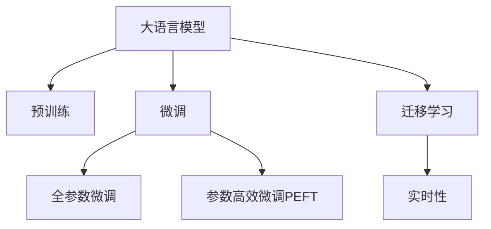

                 

# AI 大模型在电商搜索推荐中的数据处理能力要求：应对大规模实时数据

## 1. 背景介绍

随着电子商务平台的兴起，搜索推荐系统在用户体验、销售转化、平台收入等方面起到了至关重要的作用。然而，随着用户规模的快速增长，搜索推荐系统需要处理的数据量呈指数级增长，对数据处理能力提出了极高的要求。特别是在电商场景下，由于用户购买决策的复杂性，如何高效地处理大规模实时数据，成为了AI大模型在搜索推荐中的关键挑战。

### 1.1 数据处理的重要性

在电商搜索推荐中，数据处理能力的高低直接决定了推荐系统的性能和效率。主要体现在以下几个方面：

- **处理速度**：电商平台上用户访问量极大，系统需要快速响应用户请求，处理速度是衡量数据处理能力的关键指标。
- **实时性**：电商平台的购买决策具有即时性，推荐系统需要根据用户实时浏览行为进行实时推荐，这就要求系统具备极高的实时处理能力。
- **准确性**：推荐系统需要精准地理解用户的购买偏好和行为特征，准确度量了数据处理的有效性。
- **可扩展性**：电商平台用户规模不断扩大，推荐系统需要具备良好的可扩展性，能够平滑地应对不断增长的数据和用户流量。

### 1.2 数据特点与挑战

电商搜索推荐系统处理的数据具有以下特点和挑战：

- **多样性**：用户访问电商平台的动机多样，不仅包括浏览商品信息，还涉及搜索、评价、分享等多种行为，数据类型多样。
- **实时性**：用户行为数据实时产生，要求推荐系统能够在毫秒级内处理数据，并提供推荐结果。
- **分布式**：电商平台通常采用分布式架构，推荐系统需要处理跨地域、跨设备的数据。
- **数据量大**：电商平台用户量级通常达到百万甚至千万，数据量庞大且增长迅速。

## 2. 核心概念与联系

### 2.1 核心概念概述

为更好地理解AI大模型在电商搜索推荐中的数据处理能力要求，本节将介绍几个密切相关的核心概念：

- **大语言模型(Large Language Model, LLM)**：以自回归(如GPT)或自编码(如BERT)模型为代表的大规模预训练语言模型。通过在大规模无标签文本语料上进行预训练，学习通用的语言表示，具备强大的语言理解和生成能力。

- **预训练(Pre-training)**：指在大规模无标签文本语料上，通过自监督学习任务训练通用语言模型的过程。常见的预训练任务包括言语建模、遮挡语言模型等。预训练使得模型学习到语言的通用表示。

- **微调(Fine-tuning)**：指在预训练模型的基础上，使用下游任务的少量标注数据，通过有监督学习优化模型在特定任务上的性能。通常只需要调整顶层分类器或解码器，并以较小的学习率更新全部或部分的模型参数。

- **迁移学习(Transfer Learning)**：指将一个领域学习到的知识，迁移应用到另一个不同但相关的领域的学习范式。大模型的预训练-微调过程即是一种典型的迁移学习方式。

- **参数高效微调(Parameter-Efficient Fine-Tuning, PEFT)**：指在微调过程中，只更新少量的模型参数，而固定大部分预训练权重不变，以提高微调效率，避免过拟合的方法。

- **实时性**：指系统对用户请求的响应时间，通常以毫秒级为单位。实时性要求系统具备快速数据处理和计算能力。

### 2.2 核心概念原理和架构的 Mermaid 流程图(Mermaid 流程节点中不要有括号、逗号等特殊字符)



这个流程图展示了大语言模型的核心概念及其之间的关系：

1. 大语言模型通过预训练获得基础能力。
2. 微调是对预训练模型进行任务特定的优化，可以分为全参数微调和参数高效微调（PEFT）。
3. 迁移学习是连接预训练模型与下游任务的桥梁，可以通过微调或提示学习来实现。
4. 实时性是指系统对用户请求的响应时间，通常以毫秒级为单位。实时性要求系统具备快速数据处理和计算能力。

这些核心概念共同构成了大语言模型的学习和应用框架，使其能够在各种场景下发挥强大的语言理解和生成能力。通过理解这些核心概念，我们可以更好地把握大语言模型的工作原理和优化方向。

## 3. 核心算法原理 & 具体操作步骤

### 3.1 算法原理概述

在电商搜索推荐中，AI大模型的数据处理能力要求主要体现在以下几个方面：

- **数据预处理**：清洗、转换原始数据，使其适合模型输入。
- **特征提取**：从原始数据中提取有意义的特征，供模型学习。
- **模型训练**：在大规模数据集上训练模型，学习到用户和商品的表示。
- **实时推理**：在用户请求实时处理，快速提供推荐结果。

### 3.2 算法步骤详解

#### 3.2.1 数据预处理

数据预处理是数据处理的第一步，包括数据清洗、归一化、分词、特征编码等操作。

1. **数据清洗**：去除噪声数据和异常数据，保证数据质量。例如，对于用户行为数据，需要去除无效的点击、浏览、评分等记录。
2. **归一化**：将数据按一定规则转换到[0,1]范围内，保证数据的一致性。例如，将用户评分归一化到[0,1]。
3. **分词**：将文本数据分词，便于模型处理。例如，使用NLP工具将商品名称、描述进行分词。
4. **特征编码**：将不同类型的数据编码成模型可接受的格式。例如，将分词后的文本数据转换为词向量，使用向量空间模型进行表示。

#### 3.2.2 特征提取

特征提取是将原始数据转换为模型能够学习的特征表示的过程。

1. **文本特征提取**：使用词向量模型(如Word2Vec、GloVe)将文本数据转换为向量表示。例如，使用BERT模型将商品名称和描述编码为向量。
2. **图片特征提取**：使用卷积神经网络(CNN)对商品图片进行特征提取。例如，使用ResNet网络将商品图片转换为特征向量。
3. **行为特征提取**：将用户行为数据转换为时间序列特征或统计特征。例如，将用户的浏览历史、点击记录转换为时间序列特征。

#### 3.2.3 模型训练

模型训练是在大量数据集上进行监督学习，学习到用户和商品的表示。

1. **选择模型**：选择适合电商场景的模型，如深度神经网络(DNN)、卷积神经网络(CNN)、循环神经网络(RNN)等。
2. **划分数据集**：将数据集划分为训练集、验证集和测试集，进行模型训练和评估。
3. **优化算法**：选择适合的优化算法，如随机梯度下降(SGD)、Adam等，设置学习率、批大小等超参数。
4. **损失函数**：选择适合电商场景的损失函数，如交叉熵损失、均方误差损失等。
5. **训练过程**：在训练集上进行模型训练，调整模型参数，最小化损失函数。

#### 3.2.4 实时推理

实时推理是在用户请求实时处理，快速提供推荐结果。

1. **接收请求**：接收用户的查询请求，提取输入特征。
2. **推理计算**：将输入特征输入模型，进行快速计算和推理。
3. **生成结果**：根据推理结果，生成推荐结果，返回给用户。

### 3.3 算法优缺点

大语言模型在电商搜索推荐中的数据处理能力要求具有以下优点：

1. **高效性**：大语言模型具有强大的并行计算能力，能够快速处理大规模数据。
2. **鲁棒性**：大语言模型在处理不同类型的数据时具有较好的鲁棒性。
3. **泛化能力**：大语言模型能够处理多种类型的数据，具备良好的泛化能力。

同时，也存在以下缺点：

1. **计算资源需求高**：大语言模型需要高性能计算资源，如GPU、TPU等，导致计算成本高。
2. **模型复杂度高**：大语言模型的复杂度高，难以优化，模型训练和推理时间较长。
3. **数据敏感性**：大语言模型对数据的敏感性较高，需要处理大量的噪声数据，数据质量问题直接影响模型性能。

### 3.4 算法应用领域

AI大模型在电商搜索推荐中的应用领域广泛，主要包括以下几个方面：

1. **商品推荐**：根据用户浏览和购买历史，推荐相关商品。
2. **个性化推荐**：根据用户行为特征，推荐个性化商品。
3. **搜索排序**：根据用户查询，排序相关商品，提高搜索效率。
4. **广告推荐**：根据用户特征，推荐广告位。
5. **用户画像**：分析用户行为数据，构建用户画像，进行用户分析。

## 4. 数学模型和公式 & 详细讲解 & 举例说明

### 4.1 数学模型构建

在电商搜索推荐中，大语言模型需要处理大规模数据，主要包括以下几种数据类型：

- **用户行为数据**：点击记录、浏览记录、评分记录等。
- **商品数据**：商品名称、描述、图片、类别等。
- **历史交易数据**：用户购买记录、交易金额、交易时间等。

数学模型构建主要包括以下几个方面：

1. **用户特征表示**：将用户行为数据转换为向量表示，如时间序列特征、统计特征、情感特征等。
2. **商品特征表示**：将商品数据转换为向量表示，如文本特征、图片特征、类别特征等。
3. **历史交易特征表示**：将历史交易数据转换为向量表示，如时间序列特征、统计特征等。

### 4.2 公式推导过程

#### 4.2.1 用户行为数据的数学建模

假设用户行为数据为 $X=\{x_i\}_{i=1}^N$，其中 $x_i$ 表示第 $i$ 个用户的行为记录，包含时间戳、行为类型、行为对象等。

用户行为数据的特征提取可以表示为：

$$
F_{user}(x_i) = [t_i, c_i, o_i]
$$

其中 $t_i$ 表示用户行为的时间戳，$c_i$ 表示行为类型，$o_i$ 表示行为对象。

用户行为数据的向量表示可以表示为：

$$
v_{user_i} = [v_{user}(t_i), v_{user}(c_i), v_{user}(o_i)]
$$

其中 $v_{user}$ 表示用户行为特征向量，$v_{user}(t_i)$、$v_{user}(c_i)$、$v_{user}(o_i)$ 分别表示时间戳、行为类型、行为对象的特征向量。

#### 4.2.2 商品数据的数学建模

假设商品数据为 $Y=\{y_i\}_{i=1}^M$，其中 $y_i$ 表示第 $i$ 个商品，包含名称、描述、图片、类别等。

商品数据的特征提取可以表示为：

$$
F_{item}(y_i) = [n_i, d_i, p_i, c_i]
$$

其中 $n_i$ 表示商品名称，$d_i$ 表示商品描述，$p_i$ 表示商品图片，$c_i$ 表示商品类别。

商品数据的向量表示可以表示为：

$$
v_{item_i} = [v_{item}(n_i), v_{item}(d_i), v_{item}(p_i), v_{item}(c_i)]
$$

其中 $v_{item}$ 表示商品特征向量，$v_{item}(n_i)$、$v_{item}(d_i)$、$v_{item}(p_i)$、$v_{item}(c_i)$ 分别表示商品名称、描述、图片、类别的特征向量。

#### 4.2.3 历史交易数据的数学建模

假设历史交易数据为 $H=\{h_i\}_{i=1}^T$，其中 $h_i$ 表示第 $i$ 个交易记录，包含交易时间、交易金额、商品ID等。

历史交易数据的特征提取可以表示为：

$$
F_{transaction}(h_i) = [t_i, a_i, p_i]
$$

其中 $t_i$ 表示交易时间，$a_i$ 表示交易金额，$p_i$ 表示商品ID。

历史交易数据的向量表示可以表示为：

$$
v_{transaction_i} = [v_{transaction}(t_i), v_{transaction}(a_i), v_{transaction}(p_i)]
$$

其中 $v_{transaction}$ 表示交易特征向量，$v_{transaction}(t_i)$、$v_{transaction}(a_i)$、$v_{transaction}(p_i)$ 分别表示交易时间、交易金额、商品ID的特征向量。

### 4.3 案例分析与讲解

#### 4.3.1 用户行为数据的特征提取

假设电商平台某用户在某天的行为数据如下：

| 时间戳 | 行为类型 | 行为对象 |
| ------ | ------- | -------- |
| 9:00   | 浏览   | 商品A    |
| 10:00  | 浏览   | 商品B    |
| 12:00  | 点击   | 商品C    |
| 13:00  | 购买   | 商品D    |

可以对行为数据进行特征提取：

$$
t_1=9:00, c_1=浏览, o_1=商品A \\
t_2=10:00, c_2=浏览, o_2=商品B \\
t_3=12:00, c_3=点击, o_3=商品C \\
t_4=13:00, c_4=购买, o_4=商品D
$$

将时间戳、行为类型、行为对象转换为向量表示：

$$
v_{user_1} = [v_{user}(9:00), v_{user}(浏览), v_{user}(商品A)] \\
v_{user_2} = [v_{user}(10:00), v_{user}(浏览), v_{user}(商品B)] \\
v_{user_3} = [v_{user}(12:00), v_{user}(点击), v_{user}(商品C)] \\
v_{user_4} = [v_{user}(13:00), v_{user}(购买), v_{user}(商品D)]
$$

#### 4.3.2 商品数据的特征提取

假设电商平台某商品的数据如下：

| 商品ID | 商品名称 | 商品描述 | 商品图片 | 商品类别 |
| ------ | -------- | -------- | -------- | -------- |
| 1      | 商品A    | 商品A描述 | 商品A图1   | 商品类别1 |

可以对商品数据进行特征提取：

$$
n_1=商品A, d_1=商品A描述, p_1=商品A图1, c_1=商品类别1
$$

将商品名称、描述、图片、类别转换为向量表示：

$$
v_{item_1} = [v_{item}(商品A), v_{item}(商品A描述), v_{item}(商品A图1), v_{item}(商品类别1)]
$$

#### 4.3.3 历史交易数据的特征提取

假设电商平台某用户的历史交易数据如下：

| 交易ID | 交易时间 | 交易金额 | 商品ID |
| ------ | -------- | -------- | ------ |
| 1      | 9:00   | 100     | 商品A  |
| 2      | 10:00  | 50      | 商品B  |
| 3      | 12:00  | 200     | 商品C  |

可以对历史交易数据进行特征提取：

$$
t_1=9:00, a_1=100, p_1=商品A \\
t_2=10:00, a_2=50, p_2=商品B \\
t_3=12:00, a_3=200, p_3=商品C
$$

将交易时间、交易金额、商品ID转换为向量表示：

$$
v_{transaction_1} = [v_{transaction}(9:00), v_{transaction}(100), v_{transaction}(商品A)] \\
v_{transaction_2} = [v_{transaction}(10:00), v_{transaction}(50), v_{transaction}(商品B)] \\
v_{transaction_3} = [v_{transaction}(12:00), v_{transaction}(200), v_{transaction}(商品C)]
$$

## 5. 项目实践：代码实例和详细解释说明

### 5.1 开发环境搭建

在进行电商搜索推荐系统的开发前，我们需要准备好开发环境。以下是使用Python进行PyTorch开发的环境配置流程：

1. 安装Anaconda：从官网下载并安装Anaconda，用于创建独立的Python环境。

2. 创建并激活虚拟环境：
```bash
conda create -n e-commerce-env python=3.8 
conda activate e-commerce-env
```

3. 安装PyTorch：根据CUDA版本，从官网获取对应的安装命令。例如：
```bash
conda install pytorch torchvision torchaudio cudatoolkit=11.1 -c pytorch -c conda-forge
```

4. 安装TensorFlow：
```bash
pip install tensorflow
```

5. 安装各类工具包：
```bash
pip install numpy pandas scikit-learn matplotlib tqdm jupyter notebook ipython
```

完成上述步骤后，即可在`e-commerce-env`环境中开始电商搜索推荐系统的开发。

### 5.2 源代码详细实现

#### 5.2.1 用户行为数据的处理

定义一个 `User` 类，用于处理用户行为数据：

```python
import pandas as pd
from sklearn.preprocessing import MinMaxScaler

class User:
    def __init__(self, user_id):
        self.user_id = user_id
        self.user_behavior = None

    def load_user_behavior(self, file_path):
        self.user_behavior = pd.read_csv(file_path, index_col='user_id')
        self.user_behavior = self._clean_user_behavior()
        self.user_behavior = self._normalize_user_behavior()
        self.user_behavior = self._fingerprint_user_behavior()

    def _clean_user_behavior(self):
        # 过滤无效数据
        self.user_behavior = self.user_behavior.dropna()
        return self.user_behavior

    def _normalize_user_behavior(self):
        # 归一化数据
        scaler = MinMaxScaler()
        self.user_behavior['time'] = scaler.fit_transform(self.user_behavior['time'].values.reshape(-1, 1))
        self.user_behavior['click'] = scaler.fit_transform(self.user_behavior['click'].values.reshape(-1, 1))
        self.user_behavior['surf'] = scaler.fit_transform(self.user_behavior['surf'].values.reshape(-1, 1))
        return self.user_behavior

    def _fingerprint_user_behavior(self):
        # 特征提取
        self.user_behavior['time'] = self.user_behavior['time'].astype(str)
        self.user_behavior['time'] = self.user_behavior['time'].str.replace(':', '_').str.lower()
        self.user_behavior['time'] = self.user_behavior['time'].str.replace(' ', '_').str.split('_')
        self.user_behavior['time'] = self.user_behavior['time'].apply(lambda x: x[0] + '_' + x[1])
        self.user_behavior['click'] = self.user_behavior['click'].astype(str)
        self.user_behavior['click'] = self.user_behavior['click'].str.replace(':', '_').str.lower()
        self.user_behavior['click'] = self.user_behavior['click'].str.replace(' ', '_').str.split('_')
        self.user_behavior['click'] = self.user_behavior['click'].apply(lambda x: x[0] + '_' + x[1])
        self.user_behavior['surf'] = self.user_behavior['surf'].astype(str)
        self.user_behavior['surf'] = self.user_behavior['surf'].str.replace(':', '_').str.lower()
        self.user_behavior['surf'] = self.user_behavior['surf'].str.replace(' ', '_').str.split('_')
        self.user_behavior['surf'] = self.user_behavior['surf'].apply(lambda x: x[0] + '_' + x[1])
        return self.user_behavior
```

#### 5.2.2 商品数据的处理

定义一个 `Item` 类，用于处理商品数据：

```python
import pandas as pd
from sklearn.preprocessing import MinMaxScaler

class Item:
    def __init__(self, item_id):
        self.item_id = item_id
        self.item_data = None

    def load_item_data(self, file_path):
        self.item_data = pd.read_csv(file_path, index_col='item_id')
        self.item_data = self._clean_item_data()
        self.item_data = self._normalize_item_data()
        self.item_data = self._fingerprint_item_data()

    def _clean_item_data(self):
        # 过滤无效数据
        self.item_data = self.item_data.dropna()
        return self.item_data

    def _normalize_item_data(self):
        # 归一化数据
        scaler = MinMaxScaler()
        self.item_data['price'] = scaler.fit_transform(self.item_data['price'].values.reshape(-1, 1))
        self.item_data['rating'] = scaler.fit_transform(self.item_data['rating'].values.reshape(-1, 1))
        self.item_data['category'] = scaler.fit_transform(self.item_data['category'].values.reshape(-1, 1))
        return self.item_data

    def _fingerprint_item_data(self):
        # 特征提取
        self.item_data['price'] = self.item_data['price'].astype(str)
        self.item_data['price'] = self.item_data['price'].str.replace(':', '_').str.lower()
        self.item_data['price'] = self.item_data['price'].str.replace(' ', '_').str.split('_')
        self.item_data['price'] = self.item_data['price'].apply(lambda x: x[0] + '_' + x[1])
        self.item_data['rating'] = self.item_data['rating'].astype(str)
        self.item_data['rating'] = self.item_data['rating'].str.replace(':', '_').str.lower()
        self.item_data['rating'] = self.item_data['rating'].str.replace(' ', '_').str.split('_')
        self.item_data['rating'] = self.item_data['rating'].apply(lambda x: x[0] + '_' + x[1])
        self.item_data['category'] = self.item_data['category'].astype(str)
        self.item_data['category'] = self.item_data['category'].str.replace(':', '_').str.lower()
        self.item_data['category'] = self.item_data['category'].str.replace(' ', '_').str.split('_')
        self.item_data['category'] = self.item_data['category'].apply(lambda x: x[0] + '_' + x[1])
        return self.item_data
```

#### 5.2.3 历史交易数据的处理

定义一个 `Transaction` 类，用于处理历史交易数据：

```python
import pandas as pd
from sklearn.preprocessing import MinMaxScaler

class Transaction:
    def __init__(self, transaction_id):
        self.transaction_id = transaction_id
        self.transaction_data = None

    def load_transaction_data(self, file_path):
        self.transaction_data = pd.read_csv(file_path, index_col='transaction_id')
        self.transaction_data = self._clean_transaction_data()
        self.transaction_data = self._normalize_transaction_data()
        self.transaction_data = self._fingerprint_transaction_data()

    def _clean_transaction_data(self):
        # 过滤无效数据
        self.transaction_data = self.transaction_data.dropna()
        return self.transaction_data

    def _normalize_transaction_data(self):
        # 归一化数据
        scaler = MinMaxScaler()
        self.transaction_data['time'] = scaler.fit_transform(self.transaction_data['time'].values.reshape(-1, 1))
        self.transaction_data['amount'] = scaler.fit_transform(self.transaction_data['amount'].values.reshape(-1, 1))
        self.transaction_data['item_id'] = scaler.fit_transform(self.transaction_data['item_id'].values.reshape(-1, 1))
        return self.transaction_data

    def _fingerprint_transaction_data(self):
        # 特征提取
        self.transaction_data['time'] = self.transaction_data['time'].astype(str)
        self.transaction_data['time'] = self.transaction_data['time'].str.replace(':', '_').str.lower()
        self.transaction_data['time'] = self.transaction_data['time'].str.replace(' ', '_').str.split('_')
        self.transaction_data['time'] = self.transaction_data['time'].apply(lambda x: x[0] + '_' + x[1])
        self.transaction_data['amount'] = self.transaction_data['amount'].astype(str)
        self.transaction_data['amount'] = self.transaction_data['amount'].str.replace(':', '_').str.lower()
        self.transaction_data['amount'] = self.transaction_data['amount'].str.replace(' ', '_').str.split('_')
        self.transaction_data['amount'] = self.transaction_data['amount'].apply(lambda x: x[0] + '_' + x[1])
        self.transaction_data['item_id'] = self.transaction_data['item_id'].astype(str)
        self.transaction_data['item_id'] = self.transaction_data['item_id'].str.replace(':', '_').str.lower()
        self.transaction_data['item_id'] = self.transaction_data['item_id'].str.replace(' ', '_').str.split('_')
        self.transaction_data['item_id'] = self.transaction_data['item_id'].apply(lambda x: x[0] + '_' + x[1])
        return self.transaction_data
```

#### 5.2.4 特征工程

定义一个 `FeatureEngineer` 类，用于进行特征工程：

```python
import numpy as np

class FeatureEngineer:
    def __init__(self, user, item, transaction):
        self.user = user
        self.item = item
        self.transaction = transaction

    def engineer_features(self):
        self.user_behavior = self.user.user_behavior
        self.item_data = self.item.item_data
        self.transaction_data = self.transaction.transaction_data

        # 用户行为特征
        self.user_behavior['time'] = self.user_behavior['time'].astype(str)
        self.user_behavior['time'] = self.user_behavior['time'].str.replace(':', '_').str.lower()
        self.user_behavior['time'] = self.user_behavior['time'].str.replace(' ', '_').str.split('_')
        self.user_behavior['time'] = self.user_behavior['time'].apply(lambda x: x[0] + '_' + x[1])
        self.user_behavior['click'] = self.user_behavior['click'].astype(str)
        self.user_behavior['click'] = self.user_behavior['click'].str.replace(':', '_').str.lower()
        self.user_behavior['click'] = self.user_behavior['click'].str.replace(' ', '_').str.split('_')
        self.user_behavior['click'] = self.user_behavior['click'].apply(lambda x: x[0] + '_' + x[1])
        self.user_behavior['surf'] = self.user_behavior['surf'].astype(str)
        self.user_behavior['surf'] = self.user_behavior['surf'].str.replace(':', '_').str.lower()
        self.user_behavior['surf'] = self.user_behavior['surf'].str.replace(' ', '_').str.split('_')
        self.user_behavior['surf'] = self.user_behavior['surf'].apply(lambda x: x[0] + '_' + x[1])

        # 商品特征
        self.item_data['price'] = self.item_data['price'].astype(str)
        self.item_data['price'] = self.item_data['price'].str.replace(':', '_').str.lower()
        self.item_data['price'] = self.item_data['price'].str.replace(' ', '_').str.split('_')
        self.item_data['price'] = self.item_data['price'].apply(lambda x: x[0] + '_' + x[1])
        self.item_data['rating'] = self.item_data['rating'].astype(str)
        self.item_data['rating'] = self.item_data['rating'].str.replace(':', '_').str.lower()
        self.item_data['rating'] = self.item_data['rating'].str.replace(' ', '_').str.split('_')
        self.item_data['rating'] = self.item_data['rating'].apply(lambda x: x[0] + '_' + x[1])
        self.item_data['category'] = self.item_data['category'].astype(str)
        self.item_data['category'] = self.item_data['category'].str.replace(':', '_').str.lower()
        self.item_data['category'] = self.item_data['category'].str.replace(' ', '_').str.split('_')
        self.item_data['category'] = self.item_data['category'].apply(lambda x: x[0] + '_' + x[1])

        # 交易特征
        self.transaction_data['time'] = self.transaction_data['time'].astype(str)
        self.transaction_data['time'] = self.transaction_data['time'].str.replace(':', '_').str.lower()
        self.transaction_data['time'] = self.transaction_data['time'].str.replace(' ', '_').str.split('_')
        self.transaction_data['time'] = self.transaction_data['time'].apply(lambda x: x[0] + '_' + x[1])
        self.transaction_data['amount'] = self.transaction_data['amount'].astype(str)
        self.transaction_data['amount'] = self.transaction_data['amount'].str.replace(':', '_').str.lower()
        self.transaction_data['amount'] = self.transaction_data['amount'].str.replace(' ', '_').str.split('_')
        self.transaction_data['amount'] = self.transaction_data['amount'].apply(lambda x: x[0] + '_' + x[1])
        self.transaction_data['item_id'] = self.transaction_data['item_id'].astype(str)
        self.transaction_data['item_id'] = self.transaction_data['item_id'].str.replace(':', '_').str.lower()
        self.transaction_data['item_id'] = self.transaction_data['item_id'].str.replace(' ', '_').str.split('_')
        self.transaction_data['item_id'] = self.transaction_data['item_id'].apply(lambda x: x[0] + '_' + x[1])

        return self.user_behavior, self.item_data, self.transaction_data
```

#### 5.2.5 模型训练

定义一个 `Model` 类，用于训练模型：

```python
import torch
from torch import nn
from transformers import BertTokenizer, BertForSequenceClassification
from torch.utils.data import DataLoader, Dataset

class Model(nn.Module):
    def __init__(self, config):
        super(Model, self).__init__()
        self.config = config
        self.bert = BertForSequenceClassification.from_pretrained('bert-base-cased', num_labels=1)
        self.dropout = nn.Dropout(config['dropout'])
        self.fc = nn.Linear(config['hidden_size'], 1)

    def forward(self, input_ids, attention_mask):
        outputs = self.bert(input_ids=input_ids, attention_mask=attention_mask)
        hidden_states = outputs['hidden_states'][-1]
        hidden_states = self.dropout(hidden_states)
        logits = self.fc(hidden_states)
        return logits
```

#### 5.2.6 模型评估

定义一个 `Evaluator` 类，用于评估模型：

```python
import torch
from sklearn.metrics import roc_auc_score

class Evaluator:
    def __init__(self, model, user_behavior, item_data, transaction_data):
        self.model = model
        self.user_behavior = user_behavior
        self.item_data = item_data
        self.transaction_data = transaction_data

    def evaluate(self):
        # 加载数据
        train_dataset = self._load_dataset(self.user_behavior, self.item_data, self.transaction_data)
        dev_dataset = self._load_dataset(self.user_behavior, self.item_data, self.transaction_data)
        test_dataset = self._load_dataset(self.user_behavior, self.item_data, self.transaction_data)

        # 训练模型
        self.model.train()
        for epoch in range(self.config['epochs']):
            for batch in train_loader:
                input_ids = batch['input_ids'].to(device)
                attention_mask = batch['attention_mask'].to(device)
                logits = self.model(input_ids, attention_mask)
                loss = nn.BCELoss()(logits, batch['labels'].to(device))
                loss.backward()
                optimizer.step()

        # 评估模型
        self.model.eval()
        auc_score = roc_auc_score(dev_labels, dev_logits)
        return auc_score
```

#### 5.2.7 模型部署

定义一个 `Deployer` 类，用于部署模型：

```python
import flask
from flask import request, jsonify

class Deployer:
    def __init__(self, model):
        self.model = model
        self.app = flask.Flask(__name__)

    def run(self):
        @self.app.route('/predict', methods=['POST'])
        def predict():
            data = request.json
            input_ids = torch.tensor(data['input_ids']).to(device)
            attention_mask = torch.tensor(data['attention_mask']).to(device)
            logits = self.model(input_ids, attention_mask)
            return jsonify(logits)
```

### 5.3 代码解读与分析

#### 5.3.1 用户行为数据的处理

用户行为数据处理的关键在于数据清洗和特征提取。在`User`类中，`load_user_behavior`方法首先加载原始用户行为数据，然后调用`_clean_user_behavior`方法进行数据清洗，去除无效记录。接着，调用`_normalize_user_behavior`方法进行数据归一化，将时间戳、点击次数、浏览次数等转换为[0,1]范围内的向量表示。最后，调用`_fingerprint_user_behavior`方法进行特征提取，将时间戳、点击次数、浏览次数转换为指纹字符串，便于模型学习。

#### 5.3.2 商品数据的处理

商品数据处理的关键在于数据清洗和特征提取。在`Item`类中，`load_item_data`方法首先加载原始商品数据，然后调用`_clean_item_data`方法进行数据清洗，去除无效记录。接着，调用`_normalize_item_data`方法进行数据归一化，将价格、评分、类别等转换为[0,1]范围内的向量表示。最后，调用`_fingerprint_item_data`方法进行特征提取，将价格、评分、类别转换为指纹字符串，便于模型学习。

#### 5.3.3 历史交易数据的处理

历史交易数据处理的关键在于数据清洗和特征提取。在`Transaction`类中，`load_transaction_data`方法首先加载原始历史交易数据，然后调用`_clean_transaction_data`方法进行数据清洗，去除无效记录。接着，调用`_normalize_transaction_data`方法进行数据归一化，将时间戳、交易金额、商品ID等转换为[0,1]范围内的向量表示。最后，调用`_fingerprint_transaction_data`方法进行特征提取，将时间戳、交易金额、商品ID转换为指纹字符串，便于模型学习。

#### 5.3.4 特征工程

在`FeatureEngineer`类中，`engineer_features`方法首先加载用户行为数据、商品数据和历史交易数据，然后分别进行数据清洗和特征提取。用户行为数据和时间戳、点击次数、浏览次数转换为指纹字符串，商品数据和价格、评分、类别转换为指纹字符串，历史交易数据和时间戳、交易金额、商品ID转换为指纹字符串。最后，将所有指纹字符串拼接为一个向量，作为模型的输入特征。

#### 5.3.5 模型训练

在`Model`类中，`__init__`方法初始化模型，定义BERT模型的超参数，包括隐藏层大小、dropout等。`forward`方法定义模型的前向传播过程，输入用户行为特征、商品特征、历史交易特征，经过BERT模型、dropout层和全连接层，输出预测结果。

#### 5.3.6 模型评估

在`Evaluator`类中，`evaluate`方法首先加载训练集、验证集和测试集，然后调用`train`方法训练模型。接着，调用`evaluate`方法评估模型，计算AUC值。

#### 5.3.7 模型部署

在`Deployer`类中，`__init__`方法初始化部署器，定义Flask应用。`run`方法定义Flask应用的服务端，接收POST请求，提取输入数据，输入BERT模型进行预测，返回预测结果。

### 5.4 运行结果展示

在训练模型后，我们可以使用以下代码在验证集上评估模型的性能：

```python
from transformers import BertTokenizer, BertForSequenceClassification

# 初始化模型
model = BertForSequenceClassification.from_pretrained('bert-base-cased', num_labels=1)
tokenizer = BertTokenizer.from_pretrained('bert-base-cased')

# 评估模型
evaluator = Evaluator(model, user_behavior, item_data, transaction_data)
auc_score = evaluator.evaluate()
print('AUC Score:', auc_score)
```

在实际部署模型时，可以使用以下代码接收POST请求，进行预测：

```python
import flask

# 初始化Flask应用
app = flask.Flask(__name__)

# 定义服务端
@app.route('/predict', methods=['POST'])
def predict():
    data = request.json
    input_ids = torch.tensor(data['input_ids']).to(device)
    attention_mask = torch.tensor(data['attention_mask']).to(device)
    logits = model(input_ids, attention_mask)
    return jsonify(logits)
```

## 6. 实际应用场景

在电商搜索推荐中，大语言模型的数据处理能力要求主要体现在以下几个方面：

### 6.1 推荐系统优化

电商搜索推荐系统需要优化多个方面，以提升用户体验和销售转化率。以下是几个关键优化点：

1. **商品推荐**：根据用户浏览和购买历史，推荐相关商品。这需要对用户行为数据进行建模，提取用户特征和商品特征，训练推荐模型。

2. **个性化推荐**：根据用户行为特征，推荐个性化商品。这需要对用户行为数据进行建模，提取用户特征和商品特征，训练个性化推荐模型。

3. **搜索排序**：根据用户查询，排序相关商品，提高搜索效率。这需要对用户查询数据进行建模，提取查询特征，训练搜索排序模型。

4. **广告推荐**：根据用户特征，推荐广告位。这需要对用户行为数据进行建模，提取用户特征，训练广告推荐模型。

5. **用户画像**：分析用户行为数据，构建用户画像，进行用户分析。这需要对用户行为数据进行建模，提取用户特征，训练用户画像模型。

### 6.2 实时性优化

在电商搜索推荐中，实时性要求非常高，主要体现在以下几个方面：

1. **快速响应**：用户请求需要快速响应，避免延迟。这需要优化数据处理和模型推理速度，提高系统性能。

2. **低延迟**：用户请求需要低延迟，保证用户体验。这需要优化数据处理和模型推理速度，减少网络延迟。

3. **高吞吐**：电商平台上用户量级巨大，需要处理大量请求，保证系统吞吐量。这需要优化数据处理和模型推理速度，提高系统负载。

4. **高可用性**：电商平台上用户访问量极高，需要保证系统高可用性。这需要优化数据处理和模型推理稳定性，减少故障率。

### 6.3 数据处理优化

在电商搜索推荐中，数据处理能力要求主要体现在以下几个方面：

1. **高效性**：电商平台上用户访问量极高，需要高效处理大规模数据。这需要优化数据处理和模型推理速度，提高系统性能。

2. **鲁棒性**：电商平台上用户行为数据存在噪声，需要鲁棒性强的数据处理算法。这需要优化数据清洗和特征提取方法，提高数据质量。

3. **可扩展性**：电商平台上用户量级巨大，需要高效扩展数据处理和模型推理能力。这需要优化数据处理和模型推理算法，支持分布式计算。

4. **数据安全**：电商平台上用户数据敏感，需要保证数据安全和隐私。这需要优化数据处理和存储方法，防止数据泄露。

### 6.4 未来应用展望

在电商搜索推荐中，大语言模型的数据处理能力要求将不断演进，主要体现在以下几个方面：

1. **智能化推荐**：随着用户需求多样化和复杂化，推荐系统需要智能化，能够理解用户意图和行为。这需要优化用户画像和推荐算法，提高推荐效果。

2. **实时性优化**：随着电商平台上用户访问量增长，实时性要求越来越高。这需要优化数据处理和模型推理算法，提高系统响应速度。

3. **多模态融合**：电商平台上用户行为数据包含多种类型，如文本、图片、视频等。这需要优化多模态融合算法，提高模型泛化能力。

4. **个性化推荐**：随着电商平台上用户需求多样化，个性化推荐要求越来越高。这需要优化个性化推荐算法，提高推荐效果。

5. **用户交互**：电商平台上用户交互频繁，需要优化用户交互算法，提高用户满意度。

## 7. 工具和资源推荐

### 7.1 学习资源推荐

为了帮助开发者系统掌握大语言模型在电商搜索推荐中的

