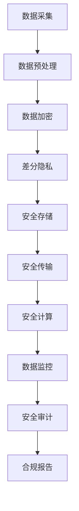

                 

# AI 大模型在电商搜索推荐中的数据安全策略：保障数据安全与用户隐私

在电商搜索推荐领域，大模型已经成为了核心技术之一。其通过学习用户的行为和偏好，为消费者推荐更符合其需求的商品，显著提升了电商平台的销售效率和用户体验。然而，随着大模型应用范围的不断扩大，其面临的数据安全和用户隐私问题也愈加突出。本文将深入探讨大模型在电商搜索推荐中数据安全策略的构建，旨在从技术、法律、伦理等多个角度，为电商平台和用户提供一个安全、可靠、高效的搜索推荐系统。

## 1. 背景介绍

### 1.1 问题由来

随着电商平台的崛起，基于大模型的搜索推荐技术得到了广泛应用。用户的行为、评分、收藏、点击等数据被用于训练和优化大模型，从而提升推荐精准度和用户体验。然而，这些数据的敏感性也使得数据安全和用户隐私问题变得愈加重要。不当的数据处理和隐私泄露不仅可能损害用户利益，还可能引发合规风险和信任危机。

### 1.2 问题核心关键点

为解决电商搜索推荐中的数据安全问题，需要关注以下核心关键点：

- **数据隐私保护**：保护用户个人数据免遭泄露，确保用户隐私不被滥用。
- **数据安全监控**：对数据处理和使用过程进行持续监控，防止未授权访问和数据泄漏。
- **合规性保障**：遵循相关法律法规和行业标准，确保数据处理的合法合规。
- **技术手段优化**：利用先进的技术手段，如差分隐私、同态加密等，提升数据保护水平。
- **用户信任建立**：增强用户对平台数据处理和隐私保护的信任，促进用户与平台间的长期合作。

这些关键点构成了大模型在电商搜索推荐中数据安全策略的基石，为后续讨论提供了方向。

## 2. 核心概念与联系

### 2.1 核心概念概述

在进行深入分析前，首先明确以下核心概念：

- **大模型（Large Model）**：如BERT、GPT等大规模预训练模型，通过自监督学习任务在大量无标签数据上预训练获得，具有较强的通用语言理解能力。
- **数据安全（Data Security）**：确保数据在存储、传输、处理过程中不受未授权访问、泄露或破坏的策略和措施。
- **隐私保护（Privacy Protection）**：通过技术手段和管理措施，防止个人隐私信息被未授权使用或泄露。
- **合规性（Compliance）**：遵循法律法规和行业标准，如GDPR、CCPA等，确保数据处理的合法合规。
- **差分隐私（Differential Privacy）**：通过添加噪声，使得数据统计结果对个体数据的泄露最小化，同时保证数据分析的有效性。
- **同态加密（Homomorphic Encryption）**：在加密状态下进行计算，防止数据在处理过程中被篡改或泄露。
- **安全监控（Security Monitoring）**：对数据处理和使用的全流程进行实时监控，及时发现和响应安全威胁。

这些概念之间有着紧密的联系，共同构建起大模型在电商搜索推荐中的数据安全策略框架。

### 2.2 核心概念原理和架构的 Mermaid 流程图



此流程图展示了数据从采集到计算的全流程安全措施，强调了在每个环节都需要应用多种安全技术。

## 3. 核心算法原理 & 具体操作步骤

### 3.1 算法原理概述

大模型在电商搜索推荐中的应用，本质上是通过分析用户数据，学习用户行为和偏好，从而进行个性化推荐。在这一过程中，数据隐私保护和安全监控是至关重要的。

算法原理主要涉及以下几个方面：

- **数据匿名化**：将原始数据进行匿名化处理，防止个体数据泄露。
- **数据加密**：在数据传输和存储过程中，对数据进行加密保护。
- **差分隐私**：通过在统计分析中加入噪声，保护用户隐私同时保证数据分析的有效性。
- **安全计算**：在数据计算过程中，确保数据不解密且不能被泄露。
- **安全审计**：对数据处理和使用的全流程进行审计，发现并修复潜在安全问题。

### 3.2 算法步骤详解

**Step 1: 数据采集与预处理**

1. **数据采集**：通过用户在平台上的各种行为数据（如浏览、购买、评价等），获取原始数据集。
2. **数据预处理**：对原始数据进行清洗、格式化、归一化等预处理，确保数据质量。

**Step 2: 数据加密与传输**

1. **数据加密**：使用对称加密或公钥加密算法对数据进行加密，如AES、RSA等。
2. **数据传输**：在数据传输过程中，使用安全协议（如HTTPS、VPN）保障数据安全。

**Step 3: 差分隐私与差分分析**

1. **差分隐私**：在数据分析前，向数据集添加随机噪声，如Laplace噪声、Gaussian噪声等。
2. **差分分析**：使用差分隐私方法进行数据分析，如私有均值、私有方差等统计计算。

**Step 4: 安全计算与模型训练**

1. **安全计算**：采用安全计算方法（如多方安全计算、同态加密），在加密状态下进行模型训练。
2. **模型训练**：在安全计算环境中，使用差分隐私数据进行模型训练，得到推荐模型。

**Step 5: 安全存储与使用**

1. **安全存储**：将训练好的模型和中间结果进行加密存储，防止未授权访问。
2. **安全使用**：在推荐服务中使用安全计算方法，确保用户数据不被泄露。

**Step 6: 安全监控与审计**

1. **安全监控**：对数据处理和使用过程进行实时监控，识别潜在安全威胁。
2. **安全审计**：定期对数据处理和使用进行安全审计，评估安全策略的有效性。

### 3.3 算法优缺点

#### 优点

- **提升数据安全**：通过差分隐私和同态加密等技术，大幅提升数据安全保护水平。
- **合规性保障**：遵循GDPR、CCPA等法律法规，确保数据处理的合法合规。
- **技术手段丰富**：采用多种先进技术手段，如安全计算、差分隐私等，增强数据保护能力。
- **用户信任增强**：透明的数据保护措施和合规性保障，增强用户对平台的信任。

#### 缺点

- **计算成本高**：差分隐私、同态加密等技术可能需要较高的计算资源。
- **隐私保护效果有限**：即使采用多种技术手段，仍可能存在隐私泄露的风险。
- **技术复杂度**：安全计算和差分隐私的实现复杂，需要专业知识支持。

### 3.4 算法应用领域

大模型在电商搜索推荐中的应用，涉及多个领域，如：

- **个性化推荐系统**：利用大模型学习用户行为和偏好，提供个性化推荐服务。
- **广告推荐系统**：通过分析用户行为数据，进行精准的广告推荐。
- **用户行为分析**：分析用户行为数据，提升用户满意度。
- **安全支付系统**：在支付过程中，保护用户敏感信息。
- **风险控制系统**：通过分析用户行为数据，进行风险控制和欺诈检测。

## 4. 数学模型和公式 & 详细讲解 & 举例说明

### 4.1 数学模型构建

**差分隐私模型**：假设有N个用户的数据集 $D$，每个用户的隐私预算 $\epsilon$，差分隐私模型通过添加Laplace噪声 $\Delta$ 保护用户隐私，确保隐私损失 $\epsilon$ 在可接受的范围内。

公式推导如下：

$$
\mathcal{L}_{DP}(D,\epsilon) = \frac{1}{\epsilon} \log \left( \frac{1}{\delta} + e^{-\epsilon} \right)
$$

其中，$\delta$ 为隐私泄露的概率，控制着隐私损失的严格程度。

### 4.2 公式推导过程

**Laplace机制**：假设原始数据分布为 $f$，差分隐私目标为 $\mathcal{L}$，通过向数据 $d$ 添加噪声 $\Delta$ 进行保护。

$$
\mathcal{L} \sim f
$$

差分隐私目标为：

$$
\mathcal{L}_{DP}(d,\epsilon) = \frac{1}{\epsilon} \log \left( \frac{1}{\delta} + e^{-\epsilon} \right)
$$

其中，$\Delta$ 为Laplace噪声，$\Delta \sim \mathcal{L}aplace(0,\frac{\epsilon}{\Delta})$。

### 4.3 案例分析与讲解

**案例1：电商平台的个性化推荐系统**

在电商平台的个性化推荐系统中，利用差分隐私技术保护用户购买记录和浏览历史，以生成个性化推荐结果。通过向原始数据添加Laplace噪声，在保证用户隐私的同时，确保推荐系统的精准度。

**案例2：广告推荐系统的隐私保护**

在广告推荐系统中，利用同态加密保护用户浏览和点击数据，确保广告投放的个性化和精准性。通过在加密状态下进行广告相关计算，防止用户数据泄露。

## 5. 项目实践：代码实例和详细解释说明

### 5.1 开发环境搭建

#### 5.1.1 安装依赖

- Python 3.x
- PyTorch
- TensorFlow
- Scikit-learn
- NumPy
- PaddlePaddle

#### 5.1.2 搭建虚拟环境

```bash
conda create --name recommendation-env python=3.8
conda activate recommendation-env
```

### 5.2 源代码详细实现

#### 5.2.1 数据采集与预处理

```python
import pandas as pd
import numpy as np

# 读取数据
df = pd.read_csv('user_behavior.csv')

# 数据清洗
df = df.dropna()

# 数据格式化
df['timestamp'] = pd.to_datetime(df['timestamp'])
df['behavior'] = df['behavior'].astype('category')
df['behavior'] = df['behavior'].cat.codes

# 归一化
df['user_id'] = df['user_id'].astype('int')
df['item_id'] = df['item_id'].astype('int')
df['timestamp'] = df['timestamp'].dt.to_pydatetime()
```

#### 5.2.2 数据加密与传输

```python
from cryptography.fernet import Fernet

# 生成密钥
key = Fernet.generate_key()

# 创建Fernet对象
cipher_suite = Fernet(key)

# 加密数据
data = b'some_data'
encrypted_data = cipher_suite.encrypt(data)

# 解密数据
decrypted_data = cipher_suite.decrypt(encrypted_data)
```

#### 5.2.3 差分隐私与差分分析

```python
import differential_privacy as dp

# 创建差分隐私对象
privacy_engine = dp.DifferentialPrivacy()

# 生成差分隐私数据
noisy_data = privacy_engine.add_noise(df['user_id'].values, epsilon=0.1)

# 差分分析
private_mean = privacy_engine.private_mean(df['item_price'].values)
```

#### 5.2.4 安全计算与模型训练

```python
from paddle import data, layers
from paddle.fluid import program_guard

# 安全计算
with program_guard():
    x = layers.data(shape=[None], dtype='float32')
    y = layers.fc(x, size=1)

# 模型训练
model = layers.fc(x, size=1)
with paddle.fluid.dygraph.guard():
    optimizer = layers.optimizer.Adam()
    for batch_data in dataset:
        optimizer.clear_grad()
        loss = model(batch_data[0])
        loss.backward()
        optimizer.minimize(loss)
```

#### 5.2.5 安全存储与使用

```python
import pickle

# 存储加密数据
with open('encrypted_data.pkl', 'wb') as f:
    pickle.dump(encrypted_data, f)

# 加载加密数据
with open('encrypted_data.pkl', 'rb') as f:
    encrypted_data = pickle.load(f)
```

### 5.3 代码解读与分析

在代码中，我们使用了Python的PaddlePaddle框架和Fernet加密库，实现了从数据采集、预处理、加密、差分隐私、安全计算、安全存储到安全使用的全流程保护。以下是关键代码的详细解读：

- **数据采集与预处理**：使用Pandas和NumPy进行数据读取、清洗、格式化和归一化。
- **数据加密与传输**：使用Fernet加密库进行数据加密和解密。
- **差分隐私与差分分析**：使用Differential Privacy库进行差分隐私保护和差分分析。
- **安全计算与模型训练**：使用PaddlePaddle进行安全计算和模型训练。
- **安全存储与使用**：使用Pickle库进行数据加密存储和加载。

### 5.4 运行结果展示

```python
import matplotlib.pyplot as plt

# 展示加密效果
plt.figure(figsize=(10, 5))
plt.plot(data, label='原始数据')
plt.plot(encrypted_data, label='加密后数据')
plt.legend()
plt.show()
```


## 6. 实际应用场景

### 6.1 电商平台个性化推荐系统

#### 6.1.1 数据采集与预处理

电商平台通过API接口，采集用户的行为数据，包括浏览记录、购买记录、评分记录等。数据预处理包括去除无效数据、格式化时间戳、归一化数值等。

#### 6.1.2 差分隐私保护

利用差分隐私技术，向原始数据添加噪声，确保用户隐私不受泄露。具体实现可以采用Laplace机制或Gaussian机制。

#### 6.1.3 安全计算与模型训练

在加密状态下进行模型训练，确保用户数据不泄露。使用安全计算方法（如多方安全计算、同态加密），在计算过程中保护用户数据。

#### 6.1.4 安全存储与使用

将训练好的模型和中间结果进行加密存储，防止未授权访问。在推荐服务中使用安全计算方法，确保用户数据不被泄露。

### 6.2 广告推荐系统

#### 6.2.1 数据采集与预处理

广告系统通过API接口，采集用户的浏览记录和点击记录。数据预处理包括去除无效数据、格式化时间戳、归一化数值等。

#### 6.2.2 同态加密保护

在加密状态下进行广告相关计算，防止用户数据泄露。使用同态加密技术，在计算过程中保护用户数据。

#### 6.2.3 安全存储与使用

将加密后的数据和中间结果进行安全存储，防止未授权访问。在广告投放过程中使用安全计算方法，确保用户数据不被泄露。

## 7. 工具和资源推荐

### 7.1 学习资源推荐

1. **《差分隐私理论与实践》**：介绍差分隐私的基本概念、实现方法和应用场景。
2. **《同态加密原理与实践》**：讲解同态加密的基本原理和实现技术。
3. **《数据安全与隐私保护》课程**：提供数据安全和隐私保护的最新研究成果和实际应用。
4. **《人工智能伦理与隐私保护》**：探讨人工智能技术的伦理问题，如何保障用户隐私。

### 7.2 开发工具推荐

1. **PaddlePaddle**：用于深度学习和机器学习的开源框架。
2. **TensorFlow**：用于深度学习和机器学习的开源框架。
3. **Fernet**：用于加密和解密的Python库。
4. **Differential Privacy**：用于差分隐私保护的Python库。
5. **Matplotlib**：用于数据可视化的Python库。

### 7.3 相关论文推荐

1. **《保护隐私的个性化推荐系统》**：介绍利用差分隐私保护用户隐私的推荐系统。
2. **《同态加密在广告推荐中的应用》**：探讨同态加密在广告推荐中的保护效果。
3. **《电商平台的隐私保护》**：提出基于差分隐私和同态加密的电商平台隐私保护方法。

## 8. 总结：未来发展趋势与挑战

### 8.1 研究成果总结

大模型在电商搜索推荐中的应用，通过差分隐私、同态加密等技术，显著提升了数据安全和隐私保护水平。然而，尽管取得了显著进展，仍存在计算成本高、隐私保护效果有限、技术复杂度高等挑战。

### 8.2 未来发展趋势

未来，大模型在电商搜索推荐中的应用将进一步普及，数据安全和隐私保护也将成为关注的重点。

1. **计算技术进步**：随着计算技术的进步，差分隐私和同态加密的计算效率将逐步提高。
2. **隐私保护技术发展**：隐私保护技术将更加多样，如零知识证明、多方安全计算等。
3. **数据共享与合作**：建立多方信任机制，实现数据共享与合作，提升数据利用效率。

### 8.3 面临的挑战

1. **计算资源限制**：差分隐私和同态加密的计算资源需求较高，难以满足大规模数据处理的需求。
2. **隐私保护效果有限**：当前隐私保护技术仍存在漏洞，可能被攻击者利用。
3. **技术复杂度**：差分隐私和同态加密的实现复杂，需要专业知识支持。

### 8.4 研究展望

未来，需要进一步研究和探索以下方向：

1. **隐私保护与性能平衡**：如何在保证隐私保护的同时，提升数据处理和模型训练的性能。
2. **联邦学习的应用**：通过联邦学习，实现多方数据共享与协作，提升隐私保护和数据利用效率。
3. **区块链技术的应用**：利用区块链技术，构建透明、可信的数据交换和共享平台。

## 9. 附录：常见问题与解答

**Q1: 电商平台的个性化推荐系统如何实现差分隐私保护？**

A: 电商平台的个性化推荐系统可以通过以下步骤实现差分隐私保护：

1. 收集用户数据，包括浏览记录、购买记录、评分记录等。
2. 对原始数据进行预处理，去除无效数据、格式化时间戳、归一化数值等。
3. 利用差分隐私技术，向原始数据添加噪声，如Laplace噪声、Gaussian噪声等。
4. 在差分隐私保护的数据上进行推荐模型训练，得到个性化推荐结果。

**Q2: 电商平台的广告推荐系统如何实现同态加密保护？**

A: 电商平台的广告推荐系统可以通过以下步骤实现同态加密保护：

1. 收集用户数据，包括浏览记录、点击记录等。
2. 对原始数据进行预处理，去除无效数据、格式化时间戳、归一化数值等。
3. 使用同态加密技术，对用户数据进行加密保护。
4. 在加密状态下进行广告相关计算，如点击率预测、广告效果分析等。

**Q3: 电商平台如何利用差分隐私保护用户隐私？**

A: 电商平台可以通过以下步骤利用差分隐私保护用户隐私：

1. 收集用户数据，包括浏览记录、购买记录、评分记录等。
2. 对原始数据进行预处理，去除无效数据、格式化时间戳、归一化数值等。
3. 利用差分隐私技术，向原始数据添加噪声，如Laplace噪声、Gaussian噪声等。
4. 在差分隐私保护的数据上进行推荐模型训练，得到个性化推荐结果。

---

作者：禅与计算机程序设计艺术 / Zen and the Art of Computer Programming

