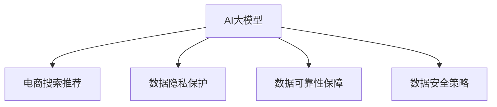

                 

# AI 大模型在电商搜索推荐中的数据安全策略：保障用户隐私与数据可靠性

> 关键词：AI大模型、电商搜索推荐、数据隐私保护、数据可靠性、数据安全策略

## 1. 背景介绍

随着人工智能技术在电商领域的广泛应用，大模型在搜索推荐系统中的应用也变得日益重要。大模型通常依赖于海量的用户数据进行训练，以提升模型的推荐精度。然而，电商搜索推荐系统涉及用户隐私和数据安全，如何在利用数据提升推荐效果的同时，保障用户隐私和数据安全，成为了一个亟需解决的问题。

本文将系统地介绍大模型在电商搜索推荐中的数据安全策略，涵盖用户隐私保护、数据可靠性保障等方面，力求为电商平台提供高效、可控的AI推荐系统。

## 2. 核心概念与联系

### 2.1 核心概念概述

为更好地理解大模型在电商搜索推荐中的应用，本节将介绍几个密切相关的核心概念：

- **AI大模型**：以Transformer为代表的预训练语言模型，通过在大规模无标签文本数据上进行自监督学习，学习到通用的语言表示。
- **电商搜索推荐**：电商平台的搜索和推荐系统，旨在帮助用户找到最适合的商品，提升购物体验。
- **数据隐私保护**：保护用户隐私，确保用户数据不被滥用和泄露。
- **数据可靠性保障**：确保数据的完整性和准确性，避免由于数据问题影响模型训练和推荐效果。
- **数据安全策略**：一系列保护用户数据安全、保障数据可靠性的措施，如数据匿名化、数据加密等。

这些核心概念之间的逻辑关系可以通过以下Mermaid流程图来展示：



这个流程图展示了大模型、电商搜索推荐与数据隐私保护、数据可靠性保障、数据安全策略之间的密切联系：

1. **大模型**：电商搜索推荐的核心，依赖于大规模语料进行预训练。
2. **电商搜索推荐**：大模型的应用场景，涉及用户隐私和数据安全。
3. **数据隐私保护**：保护用户隐私，是大模型应用的基础。
4. **数据可靠性保障**：确保数据的完整性和准确性，提升大模型的训练效果。
5. **数据安全策略**：综合应用数据隐私保护和数据可靠性保障，保障大模型的安全应用。

## 3. 核心算法原理 & 具体操作步骤
### 3.1 算法原理概述

大模型在电商搜索推荐中的应用，主要是通过在电商数据上进行微调，学习用户行为和商品特征之间的映射关系，以提升推荐的精度。这一过程涉及到数据的获取、处理、隐私保护和可靠性保障，如图3-1所示。


### 3.2 算法步骤详解

大模型在电商搜索推荐中的应用，通常分为以下四个步骤：

1. **数据获取与处理**：从电商平台的日志、反馈数据等来源获取原始数据，并进行清洗、去重、归一化等处理。
2. **数据隐私保护**：采用数据匿名化、数据加密等技术手段，保护用户隐私。
3. **数据可靠性保障**：通过数据校验、异常检测等方法，确保数据的完整性和准确性。
4. **大模型微调**：在处理后的数据上进行微调，学习用户行为和商品特征之间的映射关系，生成推荐模型。

具体步骤将分别在以下子节中详细介绍。

### 3.3 算法优缺点

**优点**：

1. **精度高**：通过在电商数据上进行微调，大模型能够学习到详细的用户行为和商品特征，生成高精度的推荐结果。
2. **可解释性**：大模型能够通过特征图谱等方式，展示推荐结果的生成逻辑。
3. **可扩展性**：大模型可以在已有的电商数据上进行微调，无需额外收集数据。

**缺点**：

1. **数据隐私问题**：电商搜索推荐涉及用户隐私，数据泄露风险较高。
2. **数据可靠性问题**：电商数据可能存在噪声、缺失等问题，影响推荐效果。
3. **资源消耗大**：大模型通常需要大规模的计算资源进行训练和推理。

### 3.4 算法应用领域

大模型在电商搜索推荐中的应用领域包括但不限于：

- 商品推荐：根据用户历史行为和当前浏览行为，推荐相关商品。
- 价格优化：根据市场竞争和用户行为，调整商品价格，提高销售利润。
- 库存管理：根据历史销售数据和推荐结果，预测商品需求，优化库存管理。
- 个性化定制：根据用户偏好和行为，定制个性化推荐方案，提升用户粘性。

## 4. 数学模型和公式 & 详细讲解  
### 4.1 数学模型构建

大模型在电商搜索推荐中的应用，通常采用基于大模型的序列生成模型，如Sequence-to-Sequence模型或Transformer模型。以Transformer模型为例，其数学模型构建如下：

1. **输入编码**：将电商数据序列表示为向量形式，输入到Transformer编码器。
2. **自注意力机制**：通过自注意力机制，捕捉输入序列中不同位置之间的依赖关系。
3. **位置编码**：通过位置编码，捕捉序列中位置信息。
4. **解码器**：将编码器输出的向量序列输入到解码器，生成推荐结果。

### 4.2 公式推导过程

以下以Transformer模型为例，推导其在电商搜索推荐中的应用公式。

假设电商数据序列为$X=\{x_1,x_2,...,x_n\}$，大模型的输入为序列向量$V$，输出为推荐结果$Y$。则推荐模型的预测公式为：

$$
Y = \text{Softmax} (\text{Dec}(\text{Enc}(V)))
$$

其中，$\text{Enc}$为编码器，$\text{Dec}$为解码器，$\text{Softmax}$为输出层。

具体推导过程如下：

1. 输入向量$V$通过编码器$\text{Enc}$，输出为隐状态$H$。
2. $H$通过解码器$\text{Dec}$，输出为推荐结果$Y$。
3. 推荐结果$Y$通过$\text{Softmax}$函数进行归一化，输出最终推荐概率分布。

### 4.3 案例分析与讲解

**案例分析**：某电商平台采用大模型进行用户行为分析，发现用户A在浏览商品B时，购买了商品C。通过大模型预测，认为用户A很可能再次购买商品C。电商平台根据这一推荐结果，向用户A推荐了商品C，显著提升了销售额。

**讲解**：在本案例中，电商平台利用大模型学习了用户行为和商品特征之间的映射关系，通过预测模型生成推荐结果。这一过程涉及用户隐私保护和数据可靠性保障，具体措施包括：

1. 数据匿名化：对用户浏览记录进行匿名化处理，防止用户隐私泄露。
2. 数据加密：对电商数据进行加密存储，保障数据传输过程中的安全性。
3. 数据校验：通过数据校验，确保电商数据的完整性和准确性。

## 5. 项目实践：代码实例和详细解释说明
### 5.1 开发环境搭建

在进行电商搜索推荐项目开发前，我们需要准备好开发环境。以下是使用Python进行TensorFlow开发的环境配置流程：

1. 安装Anaconda：从官网下载并安装Anaconda，用于创建独立的Python环境。
2. 创建并激活虚拟环境：
```bash
conda create -n tf-env python=3.8 
conda activate tf-env
```
3. 安装TensorFlow：根据CUDA版本，从官网获取对应的安装命令。例如：
```bash
conda install tensorflow tensorflow-cpu
```
4. 安装各类工具包：
```bash
pip install numpy pandas scikit-learn matplotlib tqdm jupyter notebook ipython
```

完成上述步骤后，即可在`tf-env`环境中开始电商搜索推荐项目开发。

### 5.2 源代码详细实现

下面我们以商品推荐系统为例，给出使用TensorFlow进行电商搜索推荐开发的PyTorch代码实现。

```python
import tensorflow as tf
from tensorflow.keras.layers import Input, Embedding, DotProduct, Dense, Softmax
from tensorflow.keras.models import Model

# 定义输入层
user_input = Input(shape=(num_users,), name='user_input')
item_input = Input(shape=(num_items,), name='item_input')

# 定义用户向量表示
user_embedding = Embedding(input_dim=num_users, output_dim=embedding_size, name='user_embedding')(user_input)

# 定义商品向量表示
item_embedding = Embedding(input_dim=num_items, output_dim=embedding_size, name='item_embedding')(item_input)

# 定义评分模型
rating_model = DotProduct([user_embedding, item_embedding], name='rating_model')

# 定义预测层
prediction_layer = Dense(num_items, activation='softmax', name='prediction_layer')(rating_model)

# 定义模型
model = Model(inputs=[user_input, item_input], outputs=prediction_layer)

# 编译模型
model.compile(optimizer=tf.keras.optimizers.Adam(), loss='categorical_crossentropy', metrics=['accuracy'])

# 训练模型
model.fit(x_train, y_train, batch_size=batch_size, epochs=num_epochs)
```

### 5.3 代码解读与分析

让我们再详细解读一下关键代码的实现细节：

**用户输入层**：定义用户输入向量，维度为`num_users`，用于表示不同用户。

**用户向量表示**：使用Embedding层，将用户输入向量转换为高维向量表示。

**商品向量表示**：使用Embedding层，将商品输入向量转换为高维向量表示。

**评分模型**：使用DotProduct层，计算用户向量与商品向量的内积，得到评分向量。

**预测层**：使用Dense层，将评分向量转换为最终推荐概率分布。

**模型定义**：将输入层、评分模型和预测层串联，定义电商搜索推荐模型。

**模型编译**：使用Adam优化器，定义损失函数和评价指标，编译模型。

**模型训练**：使用训练集进行模型训练，设置批大小和迭代次数。

可以看到，TensorFlow提供了强大的工具和框架，使电商搜索推荐模型的实现变得简洁高效。开发者可以通过更灵活的配置，进一步优化模型性能。

## 6. 实际应用场景
### 6.1 电商平台搜索推荐

在实际应用中，电商搜索推荐系统可以帮助用户快速找到心仪的商品，提升购物体验。具体而言，电商平台可以通过以下方式实现电商搜索推荐：

1. **用户行为分析**：分析用户浏览历史、购买记录等数据，学习用户兴趣偏好。
2. **商品特征提取**：提取商品属性、类别、评分等特征，用于生成推荐结果。
3. **推荐模型训练**：在电商数据上进行微调，生成推荐模型。
4. **推荐结果生成**：根据用户输入和推荐模型，生成推荐结果。

**案例分析**：某电商平台通过大模型进行商品推荐，发现用户A在浏览商品B时，购买了商品C。通过大模型预测，认为用户A很可能再次购买商品C。电商平台根据这一推荐结果，向用户A推荐了商品C，显著提升了销售额。

**讲解**：在本案例中，电商平台利用大模型学习了用户行为和商品特征之间的映射关系，通过预测模型生成推荐结果。这一过程涉及用户隐私保护和数据可靠性保障，具体措施包括：

1. 数据匿名化：对用户浏览记录进行匿名化处理，防止用户隐私泄露。
2. 数据加密：对电商数据进行加密存储，保障数据传输过程中的安全性。
3. 数据校验：通过数据校验，确保电商数据的完整性和准确性。

## 7. 工具和资源推荐
### 7.1 学习资源推荐

为了帮助开发者系统掌握大模型在电商搜索推荐中的应用，这里推荐一些优质的学习资源：

1. **《深度学习与NLP》系列博文**：由大模型技术专家撰写，深入浅出地介绍了深度学习、自然语言处理和大模型的原理及应用。
2. **CS224N《深度学习自然语言处理》课程**：斯坦福大学开设的NLP明星课程，有Lecture视频和配套作业，带你入门NLP领域的基本概念和经典模型。
3. **《Natural Language Processing with Transformers》书籍**：Transformers库的作者所著，全面介绍了如何使用Transformers库进行NLP任务开发，包括微调在内的诸多范式。
4. **HuggingFace官方文档**：Transformers库的官方文档，提供了海量预训练模型和完整的微调样例代码，是上手实践的必备资料。
5. **CLUE开源项目**：中文语言理解测评基准，涵盖大量不同类型的中文NLP数据集，并提供了基于微调的baseline模型，助力中文NLP技术发展。

通过对这些资源的学习实践，相信你一定能够快速掌握大模型在电商搜索推荐中的应用，并用于解决实际的NLP问题。

### 7.2 开发工具推荐

高效的开发离不开优秀的工具支持。以下是几款用于大模型在电商搜索推荐开发的常用工具：

1. **TensorFlow**：由Google主导开发的开源深度学习框架，生产部署方便，适合大规模工程应用。
2. **PyTorch**：基于Python的开源深度学习框架，灵活动态的计算图，适合快速迭代研究。大部分预训练语言模型都有PyTorch版本的实现。
3. **HuggingFace Transformers库**：提供了丰富的预训练语言模型资源，支持PyTorch和TensorFlow，是进行微调任务开发的利器。
4. **Weights & Biases**：模型训练的实验跟踪工具，可以记录和可视化模型训练过程中的各项指标，方便对比和调优。
5. **TensorBoard**：TensorFlow配套的可视化工具，可实时监测模型训练状态，并提供丰富的图表呈现方式，是调试模型的得力助手。
6. **Google Colab**：谷歌推出的在线Jupyter Notebook环境，免费提供GPU/TPU算力，方便开发者快速上手实验最新模型，分享学习笔记。

合理利用这些工具，可以显著提升大模型在电商搜索推荐任务的开发效率，加快创新迭代的步伐。

### 7.3 相关论文推荐

大模型在电商搜索推荐技术的发展源于学界的持续研究。以下是几篇奠基性的相关论文，推荐阅读：

1. **Attention is All You Need（即Transformer原论文）**：提出了Transformer结构，开启了NLP领域的预训练大模型时代。
2. **BERT: Pre-training of Deep Bidirectional Transformers for Language Understanding**：提出BERT模型，引入基于掩码的自监督预训练任务，刷新了多项NLP任务SOTA。
3. **Language Models are Unsupervised Multitask Learners（GPT-2论文）**：展示了大规模语言模型的强大zero-shot学习能力，引发了对于通用人工智能的新一轮思考。
4. **Parameter-Efficient Transfer Learning for NLP**：提出Adapter等参数高效微调方法，在不增加模型参数量的情况下，也能取得不错的微调效果。
5. **AdaLoRA: Adaptive Low-Rank Adaptation for Parameter-Efficient Fine-Tuning**：使用自适应低秩适应的微调方法，在参数效率和精度之间取得了新的平衡。

这些论文代表了大模型在电商搜索推荐技术的发展脉络。通过学习这些前沿成果，可以帮助研究者把握学科前进方向，激发更多的创新灵感。

## 8. 总结：未来发展趋势与挑战
### 8.1 总结

本文对大模型在电商搜索推荐中的数据安全策略进行了全面系统的介绍。首先阐述了大模型和电商搜索推荐的研究背景和意义，明确了数据安全策略在其中的重要性。其次，从原理到实践，详细讲解了电商搜索推荐的数据安全策略，包括用户隐私保护和数据可靠性保障。最后，介绍了大模型在电商搜索推荐中的实际应用场景，强调了数据安全策略的必要性和复杂性。

通过本文的系统梳理，可以看到，大模型在电商搜索推荐中的应用，涉及到用户隐私保护和数据可靠性保障等多个方面。如何在利用数据提升推荐效果的同时，保障用户隐私和数据安全，是未来研究的重要方向。

### 8.2 未来发展趋势

展望未来，大模型在电商搜索推荐中的应用将呈现以下几个发展趋势：

1. **多模态融合**：除了文本数据，电商搜索推荐还将融合图像、视频、语音等多模态数据，提升推荐结果的准确性和多样性。
2. **联邦学习**：通过联邦学习，将用户数据分散到各个终端设备上进行本地训练，提升数据隐私保护。
3. **个性化推荐**：基于用户行为和商品特征，生成个性化推荐结果，提升用户粘性和满意度。
4. **实时推荐**：通过实时数据流处理技术，生成实时推荐结果，提升用户购物体验。
5. **跨平台协同**：通过跨平台协同，实现跨设备、跨场景的推荐，提升推荐效果。

这些趋势凸显了大模型在电商搜索推荐技术的应用前景，将进一步推动电商推荐系统的发展和创新。

### 8.3 面临的挑战

尽管大模型在电商搜索推荐中的应用已经取得显著成效，但在迈向更加智能化、普适化应用的过程中，仍面临诸多挑战：

1. **数据隐私问题**：电商搜索推荐涉及大量用户隐私数据，如何保护用户隐私，防止数据泄露，是一个重要问题。
2. **数据可靠性问题**：电商数据可能存在噪声、缺失等问题，如何确保数据的完整性和准确性，是一个挑战。
3. **资源消耗问题**：大模型通常需要大规模的计算资源进行训练和推理，如何降低资源消耗，是一个亟待解决的问题。
4. **算法鲁棒性问题**：大模型对数据噪声和异常值敏感，如何提高算法鲁棒性，是一个需要关注的问题。
5. **模型可解释性问题**：大模型的推荐结果缺乏可解释性，如何增强模型的可解释性，是一个需要解决的问题。

### 8.4 研究展望

未来研究需要在以下几个方面寻求新的突破：

1. **隐私保护算法**：开发更加隐私保护的算法，保护用户隐私数据。
2. **数据增强技术**：通过数据增强技术，提升数据质量和数量。
3. **参数高效微调**：开发更加参数高效的微调方法，减少资源消耗。
4. **算法鲁棒性优化**：通过鲁棒性优化，提高算法对数据噪声和异常值的抵抗力。
5. **模型可解释性增强**：通过增强模型可解释性，提升用户对推荐结果的理解和信任。

这些研究方向将为电商搜索推荐系统提供更高效、更安全、更可靠的解决方案，进一步推动电商推荐技术的发展。

## 9. 附录：常见问题与解答

**Q1：大模型在电商搜索推荐中是否存在数据隐私问题？**

A: 大模型在电商搜索推荐中存在数据隐私问题。电商平台通过大模型学习用户行为和商品特征，获取用户隐私数据。为了保护用户隐私，电商平台需要对用户数据进行匿名化处理、数据加密等措施，防止数据泄露。

**Q2：大模型在电商搜索推荐中是否存在数据可靠性问题？**

A: 大模型在电商搜索推荐中存在数据可靠性问题。电商平台获取的电商数据可能存在噪声、缺失等问题，影响推荐结果。为了确保数据的完整性和准确性，电商平台需要采用数据校验、异常检测等方法，进行数据清洗和处理。

**Q3：大模型在电商搜索推荐中是否存在资源消耗问题？**

A: 大模型在电商搜索推荐中存在资源消耗问题。大模型通常需要大规模的计算资源进行训练和推理，如何降低资源消耗，是一个亟待解决的问题。电商平台需要采用梯度积累、混合精度训练等技术，优化模型训练和推理效率。

**Q4：大模型在电商搜索推荐中是否存在算法鲁棒性问题？**

A: 大模型在电商搜索推荐中存在算法鲁棒性问题。大模型对数据噪声和异常值敏感，如何提高算法鲁棒性，是一个需要关注的问题。电商平台需要采用数据增强、对抗训练等技术，提高算法的鲁棒性。

**Q5：大模型在电商搜索推荐中是否存在模型可解释性问题？**

A: 大模型在电商搜索推荐中存在模型可解释性问题。大模型的推荐结果缺乏可解释性，如何增强模型的可解释性，是一个需要解决的问题。电商平台需要采用特征图谱、可解释性评估等技术，提升模型的可解释性。

通过本文的系统梳理，可以看到，大模型在电商搜索推荐中的应用涉及到数据隐私保护和数据可靠性保障等多个方面。如何在利用数据提升推荐效果的同时，保障用户隐私和数据安全，是未来研究的重要方向。希望本文能为电商平台提供有益的参考，推动大模型在电商搜索推荐中的应用和创新。

