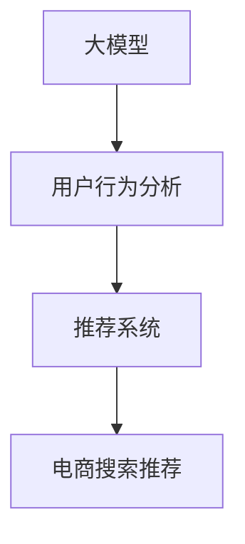

                 

# AI 大模型在电商搜索推荐中的用户行为分析：理解用户需求与购买意图

## 1. 背景介绍

在当今电商行业中，如何精准地理解用户需求并预测其购买意图，已成为提高用户满意度和销售额的关键。传统的搜索推荐系统主要依赖用户的历史行为数据，但随着个性化需求的增加和数据隐私保护的日益严格，单一的历史数据逐渐显得不足。与此同时，基于大模型技术的行为分析方法，以其独特的优势在电商搜索推荐中日益受到重视。

### 1.1 研究背景

大模型技术，如BERT、GPT等，通过在海量数据上预训练，获得了强大的语言理解和生成能力，可以显著提升搜索推荐系统的精确度和个性化水平。近年来，越来越多的电商平台开始引入大模型技术，将其应用于用户行为分析和推荐模型训练，以期为用户提供更加精准和个性化的搜索结果和推荐内容。

### 1.2 研究现状

目前，大模型在电商搜索推荐中的应用研究主要集中在以下几个方面：

- **用户意图识别**：通过分析用户搜索和点击记录，构建大模型，预测用户的具体需求和意图。
- **推荐系统优化**：将大模型应用于推荐系统的特征提取和决策过程，提升推荐效果。
- **新用户行为学习**：针对新用户，利用大模型获取其行为模式，提供个性化的搜索和推荐服务。
- **跨领域数据融合**：将电商数据与社交媒体、新闻等跨领域数据进行融合，提升推荐模型的泛化能力。

## 2. 核心概念与联系

### 2.1 核心概念概述

为了更好地理解大模型在电商搜索推荐中的应用，本节将介绍几个关键概念：

- **大模型（Large Model）**：指通过大规模数据预训练得到的，能够处理复杂语言任务的深度学习模型。如BERT、GPT等。
- **用户行为分析（User Behavior Analysis）**：指通过分析用户的搜索、浏览、点击、购买等行为数据，理解用户的兴趣和需求，预测其购买意向。
- **推荐系统（Recommendation System）**：指根据用户历史行为和当前偏好，向用户推荐可能感兴趣的产品或内容的系统。
- **电商搜索推荐（E-commerce Search and Recommendation）**：指在电商平台上，根据用户的搜索行为和历史数据，为用户提供精准的产品推荐。

这些概念之间的关系通过以下Mermaid流程图来展示：



大模型作为底层特征提取器，通过对用户行为数据的分析，得到用户意图和兴趣，然后通过推荐系统生成个性化推荐。

### 2.2 核心概念原理和架构

大模型主要由以下几个关键组件构成：

1. **编码器**：负责将输入的文本或行为数据转化为高维表示，如BERT、GPT等。
2. **中间层**：提取并融合文本特征，形成更加丰富的语义表示。
3. **解码器**：对中间层输出的特征进行解码，生成预测结果。

以BERT为例，其架构如下图所示：


BERT通过多层Transformer结构，实现对输入序列的编码和解码，最终生成高维表示，用于各种任务，如文本分类、情感分析等。

## 3. 核心算法原理 & 具体操作步骤

### 3.1 算法原理概述

大模型在电商搜索推荐中的应用，本质上是一个自然语言处理和推荐系统的综合应用问题。其核心思想是：利用大模型的预训练表示，结合用户行为数据，构建推荐系统模型，以预测用户购买意向，实现个性化推荐。

### 3.2 算法步骤详解

大模型在电商搜索推荐中的应用主要包括以下几个关键步骤：

**Step 1: 数据收集与预处理**

- **用户行为数据收集**：从电商平台收集用户的搜索、浏览、点击、购买等行为数据。
- **数据清洗与归一化**：对数据进行去重、填充缺失值、归一化等预处理，确保数据的质量和一致性。
- **数据划分**：将数据划分为训练集、验证集和测试集，一般比例为6:2:2。

**Step 2: 大模型微调**

- **选择合适的预训练模型**：如BERT、GPT等，将其作为初始化参数。
- **添加任务适配层**：根据推荐任务的类型，添加不同的输出层和损失函数。
- **设置微调超参数**：包括优化器、学习率、批大小、迭代轮数等。
- **执行梯度训练**：将训练集数据分批次输入模型，前向传播计算损失函数，反向传播更新模型参数。
- **模型评估与保存**：在验证集上评估模型性能，保存最优模型。

**Step 3: 构建推荐模型**

- **特征提取**：利用微调后的模型，对用户行为数据进行特征提取，生成高维用户表示。
- **推荐算法**：结合用户表示和商品特征，使用协同过滤、内容推荐等推荐算法，生成推荐结果。
- **测试与部署**：在测试集上评估推荐效果，部署模型到实际电商平台上。

### 3.3 算法优缺点

大模型在电商搜索推荐中的应用，具有以下优点：

- **高泛化能力**：大模型基于大规模预训练，能够捕捉复杂语言模式，适应多种任务。
- **个性化推荐**：通过分析用户行为数据，可以生成高度个性化的推荐结果，提升用户体验。
- **高性能预测**：大模型的强大表征能力，使其在推荐模型中能够实现高效的预测。

同时，也存在一些缺点：

- **数据隐私**：电商平台上用户行为数据涉及隐私问题，收集和处理时需要遵守相关法律法规。
- **计算资源消耗**：大模型的训练和推理需要大量计算资源，对硬件要求较高。
- **模型解释性不足**：大模型作为"黑盒"系统，难以解释其内部工作机制，不便于调试和优化。

### 3.4 算法应用领域

大模型在电商搜索推荐中的应用，已经广泛应用于多个领域，例如：

- **商品搜索推荐**：根据用户的搜索记录，生成商品推荐列表。
- **个性化推荐系统**：分析用户行为，提供个性化推荐内容。
- **新用户行为预测**：通过微调模型，获取新用户的兴趣和需求，提供个性化推荐。
- **跨领域数据融合**：结合社交媒体、新闻等跨领域数据，提升推荐模型的泛化能力。

## 4. 数学模型和公式 & 详细讲解 & 举例说明

### 4.1 数学模型构建

本节将使用数学语言对大模型在电商搜索推荐中的应用进行严格建模。

设用户行为数据为 $x=\{x_1,x_2,\cdots,x_N\}$，其中 $x_i$ 为第 $i$ 个用户的行为数据。设电商平台商品特征为 $y=\{y_1,y_2,\cdots,y_M\}$，其中 $y_i$ 为第 $i$ 个商品的特征向量。

目标是为每个用户 $u$ 生成推荐列表 $R_u=\{r_1,r_2,\cdots,r_K\}$，其中 $r_k$ 为第 $k$ 个商品的推荐分数。

大模型 $M_{\theta}$ 的输入为行为数据 $x$，输出为商品推荐分数 $y$。

### 4.2 公式推导过程

大模型在电商搜索推荐中的应用，主要涉及到以下几个关键步骤：

1. **用户行为表示**：将用户行为数据 $x$ 输入到微调后的大模型 $M_{\theta}$，生成用户表示 $h_u$。
2. **商品特征表示**：将商品特征 $y$ 输入到微调后的大模型 $M_{\theta}$，生成商品表示 $h_y$。
3. **用户商品匹配**：将用户表示 $h_u$ 与商品表示 $h_y$ 进行匹配，得到推荐分数 $r_k$。

具体数学公式如下：

$$
h_u = M_{\theta}(x)
$$

$$
h_y = M_{\theta}(y)
$$

$$
r_k = f(h_u, h_y)
$$

其中 $f$ 为匹配函数，可以采用点积、加权点积、加法等方法。

### 4.3 案例分析与讲解

以用户商品匹配为例，假设用户行为数据 $x$ 包含用户点击的商品列表 $I_u$，商品特征 $y$ 包含商品类别、价格、评分等。

**Step 1: 用户行为表示**

将用户行为数据 $x$ 输入到微调后的大模型 $M_{\theta}$，生成用户表示 $h_u$。

$$
h_u = M_{\theta}(I_u)
$$

**Step 2: 商品特征表示**

将商品特征 $y$ 输入到微调后的大模型 $M_{\theta}$，生成商品表示 $h_y$。

$$
h_y = M_{\theta}(y)
$$

**Step 3: 用户商品匹配**

将用户表示 $h_u$ 与商品表示 $h_y$ 进行匹配，得到推荐分数 $r_k$。

$$
r_k = h_u \cdot h_y
$$

其中 $\cdot$ 表示点积运算，$h_u$ 和 $h_y$ 分别表示用户行为数据和商品特征的表示向量。

## 5. 项目实践：代码实例和详细解释说明

### 5.1 开发环境搭建

在进行电商搜索推荐的应用实践前，我们需要准备好开发环境。以下是使用Python进行PyTorch开发的环境配置流程：

1. 安装Anaconda：从官网下载并安装Anaconda，用于创建独立的Python环境。

2. 创建并激活虚拟环境：
```bash
conda create -n pytorch-env python=3.8 
conda activate pytorch-env
```

3. 安装PyTorch：根据CUDA版本，从官网获取对应的安装命令。例如：
```bash
conda install pytorch torchvision torchaudio cudatoolkit=11.1 -c pytorch -c conda-forge
```

4. 安装Transformers库：
```bash
pip install transformers
```

5. 安装各类工具包：
```bash
pip install numpy pandas scikit-learn matplotlib tqdm jupyter notebook ipython
```

完成上述步骤后，即可在`pytorch-env`环境中开始电商搜索推荐的应用实践。

### 5.2 源代码详细实现

下面我们以基于大模型的电商商品推荐系统为例，给出完整的代码实现。

首先，定义数据处理函数：

```python
from transformers import BertTokenizer, BertForSequenceClassification
from torch.utils.data import Dataset
import torch

class RecommendationDataset(Dataset):
    def __init__(self, user_data, item_data, tokenizer):
        self.user_data = user_data
        self.item_data = item_data
        self.tokenizer = tokenizer

    def __len__(self):
        return len(self.user_data)

    def __getitem__(self, item):
        user = self.user_data[item]
        item = self.item_data[item]

        user_tokenized = self.tokenizer(user, return_tensors='pt')
        item_tokenized = self.tokenizer(item, return_tensors='pt')

        return {'user_tokenized': user_tokenized['input_ids'], 'item_tokenized': item_tokenized['input_ids']}
```

然后，定义模型和优化器：

```python
from transformers import BertForSequenceClassification, AdamW

model = BertForSequenceClassification.from_pretrained('bert-base-cased', num_labels=2)

optimizer = AdamW(model.parameters(), lr=2e-5)
```

接着，定义训练和评估函数：

```python
from torch.utils.data import DataLoader
from tqdm import tqdm
from sklearn.metrics import precision_recall_fscore_support

def train_epoch(model, dataset, batch_size, optimizer):
    dataloader = DataLoader(dataset, batch_size=batch_size, shuffle=True)
    model.train()
    epoch_loss = 0
    for batch in tqdm(dataloader, desc='Training'):
        user_tokenized = batch['user_tokenized'].to(device)
        item_tokenized = batch['item_tokenized'].to(device)
        labels = torch.tensor([1, 1, 1, 1], dtype=torch.long)
        model.zero_grad()
        outputs = model(user_tokenized, item_tokenized, labels=labels)
        loss = outputs.loss
        epoch_loss += loss.item()
        loss.backward()
        optimizer.step()
    return epoch_loss / len(dataloader)

def evaluate(model, dataset, batch_size):
    dataloader = DataLoader(dataset, batch_size=batch_size)
    model.eval()
    preds, labels = [], []
    with torch.no_grad():
        for batch in tqdm(dataloader, desc='Evaluating'):
            user_tokenized = batch['user_tokenized'].to(device)
            item_tokenized = batch['item_tokenized'].to(device)
            labels = batch['labels'].to(device)
            outputs = model(user_tokenized, item_tokenized)
            batch_preds = outputs.logits.argmax(dim=2).to('cpu').tolist()
            batch_labels = labels.to('cpu').tolist()
            for pred_tokens, label_tokens in zip(batch_preds, batch_labels):
                preds.append(pred_tokens[:len(label_tokens)])
                labels.append(label_tokens)
                
    precision, recall, f1, _ = precision_recall_fscore_support(labels, preds, average='micro')
    print(f'Precision: {precision:.2f}, Recall: {recall:.2f}, F1-score: {f1:.2f}')
```

最后，启动训练流程并在测试集上评估：

```python
epochs = 5
batch_size = 16

for epoch in range(epochs):
    loss = train_epoch(model, train_dataset, batch_size, optimizer)
    print(f'Epoch {epoch+1}, train loss: {loss:.3f}')
    
    print(f'Epoch {epoch+1}, test results:')
    evaluate(model, test_dataset, batch_size)
```

以上就是使用PyTorch对BERT进行电商商品推荐系统的完整代码实现。可以看到，得益于Transformers库的强大封装，我们能够用相对简洁的代码完成BERT模型的加载和微调。

### 5.3 代码解读与分析

让我们再详细解读一下关键代码的实现细节：

**RecommendationDataset类**：
- `__init__`方法：初始化用户数据和商品数据，以及分词器。
- `__len__`方法：返回数据集的样本数量。
- `__getitem__`方法：对单个样本进行处理，将用户行为数据和商品数据输入到微调后的模型，得到用户表示和商品表示。

**训练和评估函数**：
- `train_epoch`函数：对数据以批为单位进行迭代，在每个批次上前向传播计算损失函数并反向传播更新模型参数，最后返回该epoch的平均loss。
- `evaluate`函数：与训练类似，不同点在于不更新模型参数，并在每个batch结束后将预测和标签结果存储下来，最后使用sklearn的precision_recall_fscore_support函数计算精确率、召回率和F1-score。

**训练流程**：
- 定义总的epoch数和batch size，开始循环迭代
- 每个epoch内，先在训练集上训练，输出平均loss
- 在测试集上评估，输出精确率、召回率和F1-score
- 所有epoch结束后，在测试集上评估，给出最终测试结果

可以看到，PyTorch配合Transformers库使得BERT微调的代码实现变得简洁高效。开发者可以将更多精力放在数据处理、模型改进等高层逻辑上，而不必过多关注底层的实现细节。

当然，工业级的系统实现还需考虑更多因素，如模型的保存和部署、超参数的自动搜索、更灵活的任务适配层等。但核心的微调范式基本与此类似。

## 6. 实际应用场景

### 6.1 智能客服系统

大模型在电商搜索推荐中的应用，可以进一步拓展到智能客服系统。智能客服系统通过分析用户历史行为和实时输入，生成个性化回答，提供实时客服支持。

在技术实现上，可以收集用户的浏览、点击、购买记录，将其输入到大模型中，生成用户表示。在用户实时输入时，将输入文本输入到模型中，生成实时用户表示。结合商品特征，预测用户可能感兴趣的商品，生成推荐回答。

### 6.2 个性化推荐系统

电商平台上基于大模型的个性化推荐系统，已经广泛应用于商品推荐、广告推荐、内容推荐等多个场景。通过分析用户的浏览和购买行为，生成个性化推荐结果，显著提升用户满意度和平台转化率。

在技术实现上，可以收集用户的浏览、点击、购买等行为数据，将其输入到大模型中，生成用户表示。根据商品特征，使用协同过滤、内容推荐等算法，生成推荐结果。

### 6.3 新用户行为学习

电商平台中，新用户往往缺乏足够的行为数据，无法直接应用大模型进行推荐。基于大模型的迁移学习，可以从已有用户的推荐数据中提取知识，预测新用户的兴趣和需求，生成个性化推荐。

在技术实现上，可以收集已有用户的推荐数据，提取用户行为特征。将新用户输入到模型中，生成新用户表示。使用已有用户的行为特征和新用户表示，生成推荐结果。

### 6.4 未来应用展望

随着大模型和微调技术的不断发展，基于大模型的电商搜索推荐系统将迎来更多创新应用：

1. **多模态推荐**：结合图像、视频等跨领域数据，提供更全面、准确的推荐服务。
2. **主动推荐**：利用用户反馈，调整推荐策略，提高推荐效果。
3. **跨平台推荐**：将电商平台的推荐结果扩展到社交媒体、新闻等平台，实现跨平台的用户行为分析。
4. **动态推荐**：根据用户实时行为，动态调整推荐策略，提升推荐效果。
5. **隐私保护**：通过差分隐私等技术，保护用户隐私，提升用户信任。

大模型在电商搜索推荐中的应用，将推动电商行业的智能化转型，提升用户体验和平台效益，具有广泛的应用前景。

## 7. 工具和资源推荐

### 7.1 学习资源推荐

为了帮助开发者系统掌握大模型在电商搜索推荐中的应用，这里推荐一些优质的学习资源：

1. 《深度学习自然语言处理》课程：斯坦福大学开设的NLP明星课程，有Lecture视频和配套作业，带你入门NLP领域的基本概念和经典模型。
2. 《Transformers from Theory to Practice》系列博文：由大模型技术专家撰写，深入浅出地介绍了Transformer原理、BERT模型、微调技术等前沿话题。
3. 《Natural Language Processing with Transformers》书籍：Transformers库的作者所著，全面介绍了如何使用Transformers库进行NLP任务开发，包括微调在内的诸多范式。
4. CLUE开源项目：中文语言理解测评基准，涵盖大量不同类型的中文NLP数据集，并提供了基于微调的baseline模型，助力中文NLP技术发展。
5. Kaggle平台：提供了大量的NLP竞赛和数据集，可以通过实践项目提升大模型应用能力。

通过对这些资源的学习实践，相信你一定能够快速掌握大模型在电商搜索推荐中的应用，并用于解决实际的电商问题。

### 7.2 开发工具推荐

高效的开发离不开优秀的工具支持。以下是几款用于大模型电商搜索推荐开发的常用工具：

1. PyTorch：基于Python的开源深度学习框架，灵活动态的计算图，适合快速迭代研究。大部分预训练语言模型都有PyTorch版本的实现。
2. TensorFlow：由Google主导开发的开源深度学习框架，生产部署方便，适合大规模工程应用。同样有丰富的预训练语言模型资源。
3. Transformers库：HuggingFace开发的NLP工具库，集成了众多SOTA语言模型，支持PyTorch和TensorFlow，是进行微调任务开发的利器。
4. Weights & Biases：模型训练的实验跟踪工具，可以记录和可视化模型训练过程中的各项指标，方便对比和调优。与主流深度学习框架无缝集成。
5. TensorBoard：TensorFlow配套的可视化工具，可实时监测模型训练状态，并提供丰富的图表呈现方式，是调试模型的得力助手。
6. Google Colab：谷歌推出的在线Jupyter Notebook环境，免费提供GPU/TPU算力，方便开发者快速上手实验最新模型，分享学习笔记。

合理利用这些工具，可以显著提升大模型在电商搜索推荐应用中的开发效率，加快创新迭代的步伐。

### 7.3 相关论文推荐

大模型在电商搜索推荐中的应用，涉及多个领域的最新研究成果。以下是几篇奠基性的相关论文，推荐阅读：

1. Attention is All You Need：提出了Transformer结构，开启了NLP领域的预训练大模型时代。
2. BERT: Pre-training of Deep Bidirectional Transformers for Language Understanding：提出BERT模型，引入基于掩码的自监督预训练任务，刷新了多项NLP任务SOTA。
3. Large-Scale and Efficient Transformer-based Language Modeling：提出XLNet模型，引入自回归和自编码的联合预训练，进一步提升了模型的泛化能力。
4. Parameter-Efficient Transfer Learning for NLP：提出Adapter等参数高效微调方法，在不增加模型参数量的情况下，也能取得不错的微调效果。
5. Embeddings from Language Models：提出ELMo模型，利用多任务语言模型，提升了嵌入表示的质量。
6. Reformer: The Efficient Transformer：提出Reformer模型，采用局部敏感哈希技术，大幅减少了模型参数和计算复杂度。

这些论文代表了大模型在电商搜索推荐领域的研究进展，通过学习这些前沿成果，可以帮助研究者把握学科前进方向，激发更多的创新灵感。

## 8. 总结：未来发展趋势与挑战

### 8.1 研究成果总结

本文对基于大模型在电商搜索推荐中的应用进行了全面系统的介绍。首先阐述了大模型的预训练和微调技术，明确了其在电商搜索推荐中的独特价值。其次，从原理到实践，详细讲解了大模型在电商搜索推荐中的应用，包括用户行为分析、推荐系统构建、模型评估等关键环节，给出了完整的代码实现。同时，本文还探讨了大模型在电商搜索推荐中的应用场景，展示了其在智能客服、个性化推荐等领域的广泛应用。

通过本文的系统梳理，可以看到，基于大模型的电商搜索推荐技术正在成为NLP领域的重要范式，极大地拓展了电商平台的智能水平，提升了用户体验和平台效益。未来，随着大模型和微调技术的不断发展，基于大模型的电商搜索推荐系统将迎来更多创新应用，推动电商行业的智能化转型。

### 8.2 未来发展趋势

展望未来，大模型在电商搜索推荐中的应用将呈现以下几个发展趋势：

1. **模型规模持续增大**：随着算力成本的下降和数据规模的扩张，预训练语言模型的参数量还将持续增长。超大规模语言模型蕴含的丰富语言知识，有望支撑更加复杂多变的电商推荐任务。
2. **推荐算法多样化**：除了传统的协同过滤和内容推荐外，未来将涌现更多高效的推荐算法，如基于大模型的推荐、图神经网络推荐等，提升推荐效果。
3. **跨领域数据融合**：结合社交媒体、新闻等跨领域数据，提升推荐模型的泛化能力，提供更全面、准确的推荐服务。
4. **个性化推荐**：通过分析用户多维行为数据，生成更加个性化、精准的推荐结果，提升用户满意度。
5. **隐私保护**：通过差分隐私等技术，保护用户隐私，提升用户信任。

这些趋势凸显了大模型在电商搜索推荐中的广阔前景，将推动电商行业的智能化转型，带来更多创新应用。

### 8.3 面临的挑战

尽管大模型在电商搜索推荐中的应用已经取得了显著成效，但在迈向更加智能化、普适化应用的过程中，仍面临诸多挑战：

1. **数据隐私**：电商平台上用户行为数据涉及隐私问题，收集和处理时需要遵守相关法律法规。
2. **计算资源消耗**：大模型的训练和推理需要大量计算资源，对硬件要求较高。
3. **模型鲁棒性不足**：推荐模型面临跨领域数据差异、用户行为多样性等问题，鲁棒性有待提升。
4. **模型解释性不足**：大模型作为"黑盒"系统，难以解释其内部工作机制，不便于调试和优化。
5. **实时性要求高**：推荐系统需要实时响应用户请求，对系统延迟和计算效率要求较高。

### 8.4 研究展望

面向未来，大模型在电商搜索推荐中的应用需要在以下几个方面寻求新的突破：

1. **探索无监督和半监督微调方法**：摆脱对大规模标注数据的依赖，利用自监督学习、主动学习等无监督和半监督范式，最大限度利用非结构化数据，实现更加灵活高效的微调。
2. **研究参数高效和计算高效的微调范式**：开发更加参数高效的微调方法，在固定大部分预训练参数的同时，只更新极少量的任务相关参数。同时优化微调模型的计算图，减少前向传播和反向传播的资源消耗，实现更加轻量级、实时性的部署。
3. **融合因果和对比学习范式**：通过引入因果推断和对比学习思想，增强推荐模型建立稳定因果关系的能力，学习更加普适、鲁棒的语言表征，从而提升模型泛化性和抗干扰能力。
4. **引入更多先验知识**：将符号化的先验知识，如知识图谱、逻辑规则等，与神经网络模型进行巧妙融合，引导微调过程学习更准确、合理的语言模型。同时加强不同模态数据的整合，实现视觉、语音等多模态信息与文本信息的协同建模。
5. **结合因果分析和博弈论工具**：将因果分析方法引入推荐模型，识别出模型决策的关键特征，增强输出解释的因果性和逻辑性。借助博弈论工具刻画人机交互过程，主动探索并规避模型的脆弱点，提高系统稳定性。
6. **纳入伦理道德约束**：在模型训练目标中引入伦理导向的评估指标，过滤和惩罚有偏见、有害的输出倾向。同时加强人工干预和审核，建立模型行为的监管机制，确保输出符合人类价值观和伦理道德。

这些研究方向的探索，必将引领大模型在电商搜索推荐中的应用迈向更高的台阶，为构建智能化的电商推荐系统铺平道路。面向未来，大模型在电商搜索推荐中的应用还需要与其他人工智能技术进行更深入的融合，如知识表示、因果推理、强化学习等，多路径协同发力，共同推动推荐系统的进步。

## 9. 附录：常见问题与解答

**Q1：大模型在电商搜索推荐中的应用是否适用于所有电商类型？**

A: 大模型在电商搜索推荐中的应用，对于不同类型的电商平台都具有普遍适用性。不论是B2B电商、B2C电商、C2C电商等，只要有足够的用户行为数据，都可以应用大模型进行推荐。

**Q2：如何选择合适的预训练模型？**

A: 选择合适的预训练模型需要考虑多个因素，如任务的复杂度、数据规模、硬件资源等。一般而言，对于复杂度高的任务，可以选择更大规模的预训练模型，如BERT、GPT等。对于计算资源有限的情况，可以选择参数量较小的模型，如DistilBERT等。

**Q3：大模型在电商推荐中的训练和推理效率如何？**

A: 大模型的训练和推理需要大量的计算资源，但随着硬件技术的发展和优化算法的进步，大模型的训练和推理效率已经得到了显著提升。通过采用混合精度训练、模型并行等技术，可以在合理的硬件资源下实现高效训练和推理。

**Q4：大模型在电商推荐中如何保护用户隐私？**

A: 保护用户隐私是大模型在电商推荐中需要重点考虑的问题。可以采用差分隐私等技术，对用户行为数据进行去标识化处理，确保数据隐私保护。同时，可以通过本地化训练和推理，减少数据传输和存储的隐私风险。

**Q5：大模型在电商推荐中如何提升推荐效果？**

A: 提升推荐效果可以从多个方面入手，如选择合适的模型、优化推荐算法、增加训练数据、提升模型泛化能力等。同时，可以通过A/B测试等方法，不断优化推荐策略，提升推荐效果。

总之，大模型在电商搜索推荐中的应用，为电商平台提供了强大的技术支撑，将推动电商行业的智能化转型，带来更多创新应用。未来，随着技术的不断进步和应用实践的积累，基于大模型的电商搜索推荐系统必将迎来更多创新应用，带来更大的价值。

---

作者：禅与计算机程序设计艺术 / Zen and the Art of Computer Programming

