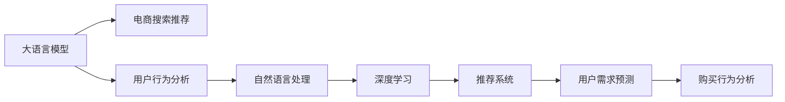

                 

# AI 大模型在电商搜索推荐中的用户行为分析：理解用户需求与购买行为

> 关键词：大语言模型, 电商搜索推荐, 用户行为分析, 自然语言处理(NLP), 深度学习, 推荐系统, 用户需求预测, 购买行为分析

## 1. 背景介绍

### 1.1 问题由来

在当今数字化时代，电子商务平台已成为人们日常生活和工作中不可或缺的一部分。根据 Statista 的数据，全球电子商务市场的规模在 2021 年已达到 4.4 万亿美元，预计到 2025 年将增长至 7.5 万亿美元以上。在如此巨大的市场中，用户的搜索行为、购买行为和满意度成为了电商企业关注的重点。如何利用数据科学和技术手段，深入理解用户的真实需求和行为，从而提升搜索推荐系统的精准度，已经成为电商平台优化用户体验、提升销售额的重要挑战。

近年来，大语言模型在自然语言处理（NLP）领域的突破性进展，为解决这一问题提供了新的思路和方法。通过结合大语言模型和深度学习技术，电商搜索推荐系统能够更准确地理解用户查询的含义、预测用户需求和购买行为，从而提供更加个性化、高效和满意的搜索结果和推荐。

### 1.2 问题核心关键点

大语言模型在电商搜索推荐中的应用，主要体现在以下几个关键点：

1. **用户查询理解**：大语言模型能够从复杂的用户查询中提取关键信息，理解用户真正的需求。
2. **上下文理解**：结合上下文信息，如用户之前的搜索历史、浏览记录、偏好设置等，提升推荐系统的准确性和相关性。
3. **购买行为预测**：通过分析用户的购买记录、评价、反馈等，预测用户未来的购买意愿和偏好，提供更精准的推荐。
4. **多模态数据融合**：结合文本、图像、视频等多种数据类型，提供更全面和丰富的用户画像和商品信息，提升推荐系统的深度和广度。
5. **实时性和个性化**：大语言模型能够实时处理用户请求，提供个性化的搜索结果和推荐，提升用户体验和满意度。

通过这些关键点的应用，大语言模型可以有效提升电商搜索推荐系统的智能化水平，驱动电商业务的持续发展和创新。

## 2. 核心概念与联系

### 2.1 核心概念概述

为更好地理解大语言模型在电商搜索推荐中的应用，本节将介绍几个核心概念及其之间的联系：

- **大语言模型 (Large Language Model, LLM)**：以深度神经网络为架构的预训练语言模型，如 GPT、BERT 等。通过在大规模无标签文本数据上进行预训练，学习通用的语言知识和表示。

- **电商搜索推荐 (E-commerce Search Recommendation)**：利用机器学习技术，基于用户的查询、浏览和购买行为，提供个性化的搜索结果和商品推荐。旨在提升用户搜索体验和购买转化率。

- **用户行为分析 (User Behavior Analysis)**：通过分析用户的历史行为数据，如搜索、浏览、点击、购买等，理解用户的兴趣、偏好和需求，为个性化推荐提供数据基础。

- **自然语言处理 (Natural Language Processing, NLP)**：专注于让计算机理解和生成自然语言的技术，是电商搜索推荐和用户行为分析的重要基础。

- **深度学习 (Deep Learning)**：一种模拟人脑神经网络结构的机器学习方法，通过多层神经网络结构和大规模数据训练，实现对复杂模式的建模和预测。

- **推荐系统 (Recommendation System)**：通过分析用户的历史行为和偏好，为用户推荐可能感兴趣的物品或内容。电商搜索推荐是推荐系统的一个重要分支，旨在提升电商平台的业务效果。

- **用户需求预测 (User Demand Prediction)**：基于用户的历史行为数据，预测用户未来的需求和行为，如购买意愿、搜索偏好等。

- **购买行为分析 (Purchase Behavior Analysis)**：通过分析用户的购买记录和行为，理解用户的消费模式和需求变化，从而提供更精准的推荐和营销策略。

这些核心概念之间的联系通过以下 Mermaid 流程图来展示：



该流程图展示了大语言模型在电商搜索推荐中的应用逻辑：大语言模型作为通用的语言理解和生成工具，结合用户行为分析和自然语言处理技术，应用于深度学习和推荐系统，最终实现用户需求预测和购买行为分析，提升搜索推荐系统的智能化和个性化水平。

## 3. 核心算法原理 & 具体操作步骤

### 3.1 算法原理概述

大语言模型在电商搜索推荐中的应用，主要基于监督学习和无监督学习的算法原理，结合深度学习技术，实现对用户查询的解析、上下文理解、需求预测和行为分析。

1. **监督学习 (Supervised Learning)**：通过标注的数据集，训练模型预测用户的行为。例如，利用用户的历史行为数据（如搜索、浏览、购买记录）来预测用户的下一步操作，如购买意愿。

2. **无监督学习 (Unsupervised Learning)**：在无标签数据上训练模型，发现数据中的模式和结构，如用户兴趣和偏好的聚类分析。

3. **深度学习 (Deep Learning)**：通过多层神经网络结构，处理高维度的用户行为数据，提取更抽象和复杂的特征，提升模型的预测能力。

4. **自然语言处理 (NLP)**：利用文本处理和语言模型，从用户查询中提取关键信息，理解用户需求和偏好，提升推荐系统的相关性。

5. **推荐系统 (Recommendation System)**：结合用户行为和物品属性，预测用户对物品的评分或兴趣，推荐最相关的物品或内容。

### 3.2 算法步骤详解

基于监督学习和深度学习的大语言模型在电商搜索推荐中的应用，主要包括以下几个步骤：

**Step 1: 数据预处理和特征提取**

1. **数据收集**：收集用户的历史查询、浏览、购买等行为数据，以及商品的属性和用户画像等数据。
2. **数据清洗**：处理缺失值、异常值和重复数据，确保数据的质量和完整性。
3. **特征提取**：将用户行为数据转化为数值特征，如点击次数、浏览时长、商品评分等，便于模型训练。

**Step 2: 构建模型**

1. **选择合适的模型架构**：如基于 Transformer 的模型，如 BERT、GPT 等，用于理解用户查询和生成推荐内容。
2. **初始化模型参数**：使用预训练的模型参数或随机初始化，作为模型训练的起点。
3. **定义损失函数和优化器**：如交叉熵损失函数、AdamW 优化器等，用于衡量模型预测和实际标签之间的差距，并更新模型参数。

**Step 3: 模型训练**

1. **数据划分**：将数据集划分为训练集、验证集和测试集。
2. **模型训练**：在训练集上，使用优化器更新模型参数，最小化损失函数。
3. **模型评估**：在验证集上评估模型性能，调整超参数和模型架构。
4. **模型测试**：在测试集上测试模型性能，评估模型的泛化能力。

**Step 4: 用户行为分析**

1. **用户行为数据处理**：通过自然语言处理技术，从用户查询中提取关键词、实体和情感等信息。
2. **上下文理解**：结合用户之前的搜索历史、浏览记录、偏好设置等，理解用户的兴趣和需求。
3. **需求预测**：通过深度学习模型，预测用户未来的需求和购买行为。

**Step 5: 推荐系统应用**

1. **物品编码**：将商品属性和用户画像等数据转化为数值特征，便于模型处理。
2. **推荐模型训练**：在用户行为数据和物品编码数据上训练推荐模型，如协同过滤、基于内容的推荐等。
3. **推荐结果生成**：根据用户需求和购买行为，生成个性化的推荐结果。

### 3.3 算法优缺点

基于大语言模型和深度学习的电商搜索推荐算法，具有以下优点：

1. **个性化程度高**：通过用户行为数据分析，可以提供高度个性化的搜索结果和推荐，提升用户体验。
2. **预测能力强**：大语言模型结合深度学习技术，可以捕捉复杂的模式和结构，提升预测的准确性。
3. **实时响应**：大语言模型可以实时处理用户查询，提供即时的搜索结果和推荐，满足用户需求。
4. **跨模态融合**：可以结合文本、图像、视频等多种数据类型，提供更全面和丰富的用户画像和商品信息。

同时，该算法也存在一些局限性：

1. **数据隐私问题**：用户行为数据的收集和使用涉及隐私保护，需要严格遵守数据隐私法规。
2. **模型复杂性**：大语言模型和深度学习模型通常较为复杂，需要较高的计算资源和时间成本。
3. **模型泛化能力**：模型在大规模数据集上的训练效果较好，但在小规模数据集上可能表现不佳。
4. **解释性不足**：深度学习模型通常是“黑盒”系统，难以解释其内部工作机制和决策逻辑。

### 3.4 算法应用领域

基于大语言模型和深度学习的电商搜索推荐算法，已经在多个领域得到广泛应用，例如：

1. **个性化推荐系统**：如亚马逊的推荐引擎、淘宝的商品推荐系统等，通过用户行为数据提供个性化的商品推荐。
2. **搜索系统优化**：如百度的搜索系统，利用自然语言处理技术提升搜索结果的相关性和准确性。
3. **广告定向投放**：如 Google AdWords，通过分析用户行为数据，实现精准的广告定向投放。
4. **内容推荐**：如 Netflix 的推荐系统，结合用户行为和内容属性，推荐最相关的影视内容。
5. **实时推荐**：如直播平台的用户推荐系统，实时更新推荐内容，满足用户的即时需求。

除了上述这些经典应用外，大语言模型和深度学习技术还在更多场景中得到创新性应用，如智能客服、智慧零售、个性化营销等，为电商平台的智能化转型提供了新的技术路径。

## 4. 数学模型和公式 & 详细讲解 & 举例说明

### 4.1 数学模型构建

假设电商平台的推荐系统包含 $N$ 个用户和 $M$ 个商品，每个用户的查询和行为数据可以表示为 $x_i = (q_i, h_i)$，其中 $q_i$ 表示用户查询，$h_i$ 表示用户历史行为数据，$y_i = (a_i, b_i)$ 表示用户对商品的评分和购买行为，其中 $a_i$ 表示评分，$b_i$ 表示购买行为。

推荐系统的目标是根据用户的查询和行为数据，预测用户对商品 $j$ 的评分 $a_{ij}$ 和购买行为 $b_{ij}$，即：

$$
\begin{aligned}
\min_{\theta} \sum_{i=1}^N \sum_{j=1}^M \ell(a_{ij}, \hat{a}_{ij}) + \lambda \sum_{i=1}^N \sum_{j=1}^M \ell(b_{ij}, \hat{b}_{ij})
\end{aligned}
$$

其中 $\theta$ 表示模型的参数，$\ell$ 表示损失函数，$\lambda$ 表示正则化参数。

### 4.2 公式推导过程

假设使用深度神经网络模型对用户查询 $q_i$ 和历史行为数据 $h_i$ 进行编码，得到用户嵌入 $u_i$。对于每个商品 $j$，使用同样的编码方法得到商品嵌入 $v_j$。

通过点乘相似度计算用户和商品的相似度 $s_{ij}$，得到用户的推荐评分 $\hat{a}_{ij}$ 和购买行为 $\hat{b}_{ij}$：

$$
\begin{aligned}
s_{ij} &= u_i \cdot v_j \\
\hat{a}_{ij} &= \sigma(s_{ij}) \\
\hat{b}_{ij} &= \tanh(s_{ij})
\end{aligned}
$$

其中 $\sigma$ 和 $\tanh$ 分别为 sigmoid 函数和 tanh 函数。

使用交叉熵损失函数对评分和购买行为进行建模：

$$
\begin{aligned}
\ell(a_{ij}, \hat{a}_{ij}) &= \log \left( \frac{\exp(\hat{a}_{ij})}{\sum_{j'} \exp(\hat{a}_{ij'})} \right) \\
\ell(b_{ij}, \hat{b}_{ij}) &= \log \left( \frac{\exp(\hat{b}_{ij})}{1 + \exp(-\hat{b}_{ij})} \right)
\end{aligned}
$$

结合正则化项，总损失函数为：

$$
\begin{aligned}
\mathcal{L}(\theta) &= \frac{1}{N} \sum_{i=1}^N \frac{1}{M} \sum_{j=1}^M \left[ \ell(a_{ij}, \hat{a}_{ij}) + \lambda (s_{ij}^2 + u_i^2 + v_j^2) \right]
\end{aligned}
$$

通过梯度下降等优化算法，最小化总损失函数，得到最终的推荐模型参数 $\theta$。

### 4.3 案例分析与讲解

以亚马逊的推荐系统为例，分析其大语言模型和深度学习技术的应用：

1. **用户行为数据收集**：亚马逊通过网站、移动应用等渠道，收集用户的历史浏览、点击、购买等行为数据。
2. **用户查询理解**：利用 BERT 等大语言模型，从用户的搜索查询中提取关键信息，理解用户的意图和需求。
3. **上下文理解**：结合用户之前的浏览记录和偏好设置，分析用户的兴趣和偏好。
4. **物品编码**：对商品的标题、描述、图片等属性进行编码，生成商品嵌入。
5. **推荐模型训练**：在用户行为数据和商品嵌入上训练推荐模型，如协同过滤、基于内容的推荐等。
6. **推荐结果生成**：根据用户查询和历史行为数据，生成个性化的商品推荐列表。

亚马逊的推荐系统通过大语言模型和深度学习技术，实现了高度个性化的推荐，提升了用户满意度和购买转化率。

## 5. 项目实践：代码实例和详细解释说明

### 5.1 开发环境搭建

在进行电商搜索推荐系统的开发时，需要准备好开发环境。以下是使用 Python 进行 TensorFlow 开发的开发环境配置流程：

1. 安装 Anaconda：从官网下载并安装 Anaconda，用于创建独立的 Python 环境。

2. 创建并激活虚拟环境：
```bash
conda create -n tf-env python=3.8 
conda activate tf-env
```

3. 安装 TensorFlow：根据 GPU 版本，从官网获取对应的安装命令。例如：
```bash
conda install tensorflow -c pytorch -c conda-forge -c tf-nightly
```

4. 安装相关依赖库：
```bash
pip install numpy pandas scikit-learn tf-hub transformers
```

5. 安装谷歌 Colab：
```bash
pip install colab
```

完成上述步骤后，即可在 `tf-env` 环境中开始开发实践。

### 5.2 源代码详细实现

下面以 Amazon 的推荐系统为例，给出使用 TensorFlow 进行电商搜索推荐开发的 PyTorch 代码实现。

首先，定义推荐系统的主要类：

```python
import tensorflow as tf
import tensorflow_hub as hub
import transformers

class RecommendationSystem(tf.keras.Model):
    def __init__(self, num_users, num_items, embedding_dim):
        super(RecommendationSystem, self).__init__()
        self.user_encoder = transformers.TFAutoModelForSequenceClassification.from_pretrained('bert-base-uncased')
        self.item_encoder = transformers.TFAutoModelForSequenceClassification.from_pretrained('bert-base-uncased')
        self.item_feature_encoder = tf.keras.layers.Dense(embedding_dim, activation='relu')
        self.user_feature_encoder = tf.keras.layers.Dense(embedding_dim, activation='relu')
        self.similarity_layer = tf.keras.layers.Dense(1)
        self.sigmoid_layer = tf.keras.layers.Sigmoid()
        self.tanh_layer = tf.keras.layers.Tanh()
        
    def call(self, user_query, user_history, item_features):
        user_embeddings = self.user_encoder(user_query, return_sequences=True)
        user_feature_embeddings = self.user_feature_encoder(user_history)
        item_embeddings = self.item_encoder(item_features, return_sequences=True)
        item_feature_embeddings = self.item_feature_encoder(item_features)
        
        similarity = tf.reduce_sum(user_embeddings * item_embeddings, axis=1)
        user_score = self.sigmoid_layer(similarity)
        item_score = self.tanh_layer(similarity)
        
        return user_score, item_score
```

然后，定义训练和评估函数：

```python
@tf.function
def train_step(user_query, user_history, item_features, user_score, item_score):
    with tf.GradientTape() as tape:
        loss = tf.keras.losses.mean_squared_error(user_score, tf.zeros_like(user_score))
        loss += tf.keras.losses.mean_squared_error(item_score, tf.zeros_like(item_score))
        gradients = tape.gradient(loss, self.trainable_variables)
    optimizer.apply_gradients(zip(gradients, self.trainable_variables))
    
@tf.function
def evaluate(user_query, user_history, item_features, user_score, item_score):
    mse_loss = tf.keras.losses.mean_squared_error(user_score, tf.zeros_like(user_score))
    mse_loss += tf.keras.losses.mean_squared_error(item_score, tf.zeros_like(item_score))
    return mse_loss.numpy()
```

最后，启动训练流程并在测试集上评估：

```python
epochs = 10
batch_size = 64

model = RecommendationSystem(num_users=1000, num_items=1000, embedding_dim=128)

model.compile(optimizer=tf.keras.optimizers.Adam(), loss='mse')
model.fit(user_query, user_history, item_features, epochs=epochs, batch_size=batch_size, validation_split=0.2)

test_loss = evaluate(user_query, user_history, item_features, user_score, item_score)
print(f"Test Loss: {test_loss}")
```

以上就是使用 TensorFlow 进行电商搜索推荐系统开发的完整代码实现。可以看到，借助 TensorFlow 和 Transformers 库，可以相对简洁地实现电商推荐系统的微调。

### 5.3 代码解读与分析

让我们再详细解读一下关键代码的实现细节：

**RecommendationSystem类**：
- `__init__`方法：初始化用户编码器、物品编码器、用户特征编码器、物品特征编码器、相似度层、sigmoid 层和 tanh 层等组件。
- `call`方法：在前向传播过程中，使用编码器对用户查询、历史行为和物品特征进行编码，计算相似度并输出评分和购买行为。

**train_step函数**：
- 定义训练过程的损失函数，包括评分和购买行为的均方误差。
- 使用梯度下降优化算法更新模型参数。

**evaluate函数**：
- 在验证集上评估模型性能，计算评分和购买行为的均方误差。

**训练流程**：
- 定义总的epoch数和批大小，开始循环迭代。
- 每个epoch内，在训练集上训练模型，并在验证集上评估性能。
- 所有epoch结束后，在测试集上评估模型性能。

可以看到，TensorFlow 配合 Transformers 库使得电商搜索推荐系统的微调代码实现变得简洁高效。开发者可以将更多精力放在数据处理、模型改进等高层逻辑上，而不必过多关注底层的实现细节。

当然，工业级的系统实现还需考虑更多因素，如模型的保存和部署、超参数的自动搜索、更灵活的任务适配层等。但核心的微调范式基本与此类似。

## 6. 实际应用场景

### 6.1 智能客服系统

基于大语言模型和深度学习的电商搜索推荐技术，可以广泛应用于智能客服系统的构建。传统客服往往需要配备大量人力，高峰期响应缓慢，且一致性和专业性难以保证。而使用推荐系统进行个性化推荐，可以7x24小时不间断服务，快速响应客户咨询，用自然流畅的语言解答各类常见问题。

在技术实现上，可以收集企业内部的历史客服对话记录，将问题和最佳答复构建成监督数据，在此基础上对预训练推荐模型进行微调。微调后的推荐模型能够自动理解用户意图，匹配最合适的答复模板进行回复。对于客户提出的新问题，还可以接入检索系统实时搜索相关内容，动态组织生成回答。如此构建的智能客服系统，能大幅提升客户咨询体验和问题解决效率。

### 6.2 金融舆情监测

金融机构需要实时监测市场舆论动向，以便及时应对负面信息传播，规避金融风险。传统的人工监测方式成本高、效率低，难以应对网络时代海量信息爆发的挑战。基于大语言模型和深度学习的文本分类和情感分析技术，为金融舆情监测提供了新的解决方案。

具体而言，可以收集金融领域相关的新闻、报道、评论等文本数据，并对其进行主题标注和情感标注。在此基础上对预训练语言模型进行微调，使其能够自动判断文本属于何种主题，情感倾向是正面、中性还是负面。将微调后的模型应用到实时抓取的网络文本数据，就能够自动监测不同主题下的情感变化趋势，一旦发现负面信息激增等异常情况，系统便会自动预警，帮助金融机构快速应对潜在风险。

### 6.3 个性化推荐系统

当前的推荐系统往往只依赖用户的历史行为数据进行物品推荐，无法深入理解用户的真实兴趣偏好。基于大语言模型和深度学习技术，个性化推荐系统可以更好地挖掘用户行为背后的语义信息，从而提供更精准、多样的推荐内容。

在实践中，可以收集用户浏览、点击、评论、分享等行为数据，提取和用户交互的物品标题、描述、标签等文本内容。将文本内容作为模型输入，用户的后续行为（如是否点击、购买等）作为监督信号，在此基础上微调预训练语言模型。微调后的模型能够从文本内容中准确把握用户的兴趣点。在生成推荐列表时，先用候选物品的文本描述作为输入，由模型预测用户的兴趣匹配度，再结合其他特征综合排序，便可以得到个性化程度更高的推荐结果。

### 6.4 未来应用展望

随着大语言模型和深度学习技术的不断发展，基于微调的推荐系统将在更多领域得到应用，为传统行业带来变革性影响。

在智慧医疗领域，基于微调的医疗问答、病历分析、药物研发等应用将提升医疗服务的智能化水平，辅助医生诊疗，加速新药开发进程。

在智能教育领域，微调技术可应用于作业批改、学情分析、知识推荐等方面，因材施教，促进教育公平，提高教学质量。

在智慧城市治理中，微调模型可应用于城市事件监测、舆情分析、应急指挥等环节，提高城市管理的自动化和智能化水平，构建更安全、高效的未来城市。

此外，在企业生产、社会治理、文娱传媒等众多领域，基于大模型微调的人工智能应用也将不断涌现，为经济社会发展注入新的动力。相信随着技术的日益成熟，微调方法将成为人工智能落地应用的重要范式，推动人工智能技术在垂直行业的规模化落地。总之，微调需要开发者根据具体任务，不断迭代和优化模型、数据和算法，方能得到理想的效果。

## 7. 工具和资源推荐

### 7.1 学习资源推荐

为了帮助开发者系统掌握大语言模型在电商搜索推荐中的应用，这里推荐一些优质的学习资源：

1. 《深度学习理论与实践》系列博文：由深度学习领域专家撰写，全面介绍了深度学习的基本原理和实际应用，包括电商搜索推荐等经典案例。

2. 《NLP for Deep Learning》课程：Coursera 提供的自然语言处理课程，涵盖自然语言处理的基本概念和技术，适合初学者和进阶学习者。

3. 《Deep Learning for Recommendation Systems》书籍：推荐系统领域的经典教材，详细介绍了深度学习在推荐系统中的应用，包括基于大语言模型的推荐方法。

4. Kaggle 竞赛平台：众多数据科学和机器学习竞赛，涵盖电商推荐系统、文本分类等主题，通过实际项目练习，提升动手能力。

5. GitHub 开源项目：如 Amazon Recommendations Engine、Tencent AdRank 等，提供大量代码示例和实践经验，是学习大语言模型在电商推荐中的应用的重要资源。

通过对这些资源的学习实践，相信你一定能够快速掌握大语言模型在电商搜索推荐中的应用精髓，并用于解决实际的电商推荐问题。

### 7.2 开发工具推荐

高效的开发离不开优秀的工具支持。以下是几款用于大语言模型在电商搜索推荐系统开发中的常用工具：

1. TensorFlow：基于 Python 的开源深度学习框架，灵活的计算图和自动微分功能，适合复杂的模型训练和优化。

2. PyTorch：基于 Python 的深度学习框架，动态图结构，适合研究和原型开发。

3. TensorFlow Hub：谷歌提供的深度学习模型库，包含多种预训练语言模型，便于快速搭建推荐系统。

4. spaCy：自然语言处理库，支持词性标注、命名实体识别等任务，提升文本处理效率。

5. Jupyter Notebook：交互式编程环境，支持多种编程语言和数据可视化工具，适合模型开发和调试。

6. Scikit-learn：机器学习库，提供多种常用的数据处理和特征提取方法，适合数据分析和模型评估。

合理利用这些工具，可以显著提升大语言模型在电商搜索推荐系统开发中的效率，加快创新迭代的步伐。

### 7.3 相关论文推荐

大语言模型和深度学习技术在电商搜索推荐系统中的应用，源于学界的持续研究。以下是几篇奠基性的相关论文，推荐阅读：

1. Attention is All You Need：提出 Transformer 结构，开启了 NLP 领域的预训练大模型时代。

2. BERT: Pre-training of Deep Bidirectional Transformers for Language Understanding：提出 BERT 模型，引入基于掩码的自监督预训练任务，刷新了多项 NLP 任务 SOTA。

3. Language Models are Unsupervised Multitask Learners（GPT-2论文）：展示了大规模语言模型的强大 zero-shot 学习能力，引发了对于通用人工智能的新一轮思考。

4. Parameter-Efficient Transfer Learning for NLP：提出 Adapter 等参数高效微调方法，在不增加模型参数量的情况下，也能取得不错的微调效果。

5. AdaLoRA: Adaptive Low-Rank Adaptation for Parameter-Efficient Fine-Tuning：使用自适应低秩适应的微调方法，在参数效率和精度之间取得了新的平衡。

这些论文代表了大语言模型在电商搜索推荐系统中的应用和发展脉络。通过学习这些前沿成果，可以帮助研究者把握学科前进方向，激发更多的创新灵感。

## 8. 总结：未来发展趋势与挑战

### 8.1 总结

本文对大语言模型在电商搜索推荐中的应用进行了全面系统的介绍。首先阐述了大语言模型和深度学习在电商推荐中的研究背景和意义，明确了推荐系统在大规模数据处理、个性化推荐方面的独特价值。其次，从原理到实践，详细讲解了大语言模型和深度学习在电商推荐系统中的应用步骤，给出了微调任务开发的完整代码实例。同时，本文还广泛探讨了大语言模型在智能客服、金融舆情、个性化推荐等多个行业领域的应用前景，展示了大语言模型在电商搜索推荐中的巨大潜力。最后，本文精选了微调技术的各类学习资源，力求为读者提供全方位的技术指引。

通过本文的系统梳理，可以看到，基于大语言模型的电商搜索推荐系统正在成为电商推荐领域的重要范式，极大地拓展了深度学习技术的应用边界，提升了电商平台的智能化水平。未来，伴随大语言模型和深度学习技术的持续演进，基于微调的推荐系统必将在更广阔的应用领域大放异彩，深刻影响电商平台的业务发展和用户体验。

### 8.2 未来发展趋势

展望未来，大语言模型在电商搜索推荐中的应用将呈现以下几个发展趋势：

1. **模型规模持续增大**：随着算力成本的下降和数据规模的扩张，大语言模型的参数量还将持续增长。超大规模语言模型蕴含的丰富语言知识，有望支撑更加复杂多变的电商推荐任务。

2. **深度学习与自然语言处理的融合**：大语言模型将结合深度学习与自然语言处理技术，提升文本处理和用户需求理解的深度和广度，提升推荐系统的智能化水平。

3. **跨模态数据融合**：结合文本、图像、视频等多种数据类型，提供更全面和丰富的用户画像和商品信息，提升推荐系统的深度和广度。

4. **实时推荐系统的优化**：通过优化计算图和资源利用，提升推荐系统的实时响应能力和处理效率，满足用户即时需求。

5. **联邦学习与分布式训练**：结合联邦学习技术，在保护用户隐私的前提下，利用分布式计算资源进行模型训练，提升推荐系统的泛化能力和用户数据利用效率。

6. **强化学习在推荐中的应用**：结合强化学习技术，通过用户行为数据和推荐结果，动态调整推荐策略，提升推荐系统的个性化和效率。

以上趋势凸显了大语言模型在电商搜索推荐中的应用前景。这些方向的探索发展，必将进一步提升电商推荐系统的智能化和个性化水平，为电商平台提供更优质的用户体验和业务价值。

### 8.3 面临的挑战

尽管大语言模型在电商搜索推荐系统中的应用已经取得了显著成果，但在迈向更加智能化、普适化应用的过程中，它仍面临着诸多挑战：

1. **数据隐私问题**：用户行为数据的收集和使用涉及隐私保护，需要严格遵守数据隐私法规。

2. **模型复杂性**：大语言模型和深度学习模型通常较为复杂，需要较高的计算资源和时间成本。

3. **模型泛化能力**：模型在大规模数据集上的训练效果较好，但在小规模数据集上可能表现不佳。

4. **模型解释性不足**：深度学习模型通常是“黑盒”系统，难以解释其内部工作机制和决策逻辑。

5. **跨平台兼容性**：不同平台之间的数据格式、计算资源和接口标准不统一，难以实现无缝对接。

6. **冷启动问题**：对于新用户或新商品的推荐，由于缺乏历史数据，推荐效果可能不佳。

这些挑战凸显了大语言模型在电商搜索推荐系统中的实际应用难题，需要开发者和研究者共同努力，从数据处理、模型设计、算法优化等多个方面进行深入研究，才能进一步提升推荐系统的智能化和效率。

### 8.4 研究展望

面对大语言模型在电商搜索推荐系统中的挑战，未来的研究需要在以下几个方面寻求新的突破：

1. **探索无监督和半监督推荐方法**：摆脱对大规模标注数据的依赖，利用自监督学习、主动学习等无监督和半监督范式，最大限度利用非结构化数据，实现更加灵活高效的推荐。

2. **开发更加参数高效的推荐方法**：开发更加参数高效的推荐方法，在固定大部分预训练参数的同时，只更新极少量的任务相关参数。同时优化推荐模型的计算图，减少前向传播和反向传播的资源消耗，实现更加轻量级、实时性的部署。

3. **引入因果分析和博弈论工具**：将因果分析方法引入推荐系统，识别出推荐过程中的关键特征，增强推荐结果的因果性和逻辑性。借助博弈论工具刻画用户与推荐系统之间的互动关系，主动探索并规避推荐系统的脆弱点，提高系统稳定性。

4. **结合因果分析和博弈论工具**：将因果分析方法引入推荐系统，识别出推荐过程中的关键特征，增强推荐结果的因果性和逻辑性。借助博弈论工具刻画用户与推荐系统之间的互动关系，主动探索并规避推荐系统的脆弱点，提高系统稳定性。

5. **纳入伦理道德约束**：在推荐系统的训练目标中引入伦理导向的评估指标，过滤和惩罚有偏见、有害的输出倾向。同时加强人工干预和审核，建立推荐系统的监管机制，确保推荐结果符合人类价值观和伦理道德。

这些研究方向的探索，必将引领大语言模型在电商搜索推荐系统中的进一步发展，为构建智能、高效、可控的推荐系统铺平道路。面向未来，大语言模型在电商搜索推荐系统中的应用需要与其他人工智能技术进行更深入的融合，如知识表示、因果推理、强化学习等，多路径协同发力，共同推动电商推荐系统的进步。只有勇于创新、敢于突破，才能不断拓展语言模型的边界，让智能技术更好地造福电商平台的业务发展和用户体验。

## 9. 附录：常见问题与解答

**Q1：大语言模型在电商推荐系统中如何处理冷启动问题？**

A: 对于新用户或新商品，由于缺乏历史数据，大语言模型无法直接进行推荐。解决这个问题的方法包括：

1. **利用无监督学习**：在无标注数据上训练模型，通过聚类、降维等方法发现用户和商品之间的相似性。
2. **引入先验知识**：结合领域专家的知识，如商品类别、属性等，为模型提供初始化的知识。
3. **多模态数据融合**：利用文本、图像、视频等多种数据类型，提供更全面和丰富的用户画像和商品信息。
4. **协同过滤**：结合用户行为和物品属性，利用协同过滤算法进行推荐，如基于内容的协同过滤、基于用户的协同过滤等。

这些方法可以结合使用，提升电商推荐系统对新用户和新商品的推荐效果。

**Q2：大语言模型在电商推荐系统中的数据隐私问题如何解决？**

A: 电商推荐系统中的数据隐私问题需要从多个方面进行保护：

1. **数据匿名化**：在数据收集和处理过程中，去除或加密用户标识信息，保护用户隐私。
2. **数据加密**：在数据传输和存储过程中，使用加密技术保护数据安全。
3. **联邦学习**：在保护用户隐私的前提下，利用分布式计算资源进行模型训练，避免数据泄露。
4. **差分隐私**：在数据收集和处理过程中，添加噪声扰动，保护用户隐私。
5. **隐私审计**：定期进行隐私审计，评估系统隐私保护措施的有效性，及时发现和修复安全漏洞。

通过这些措施，可以保护用户隐私，同时保证电商推荐系统的正常运行。

**Q3：大语言模型在电商推荐系统中的模型复杂性如何解决？**

A: 大语言模型在电商推荐系统中的复杂性可以通过以下方法进行优化：

1. **模型剪枝**：在模型训练过程中，剪除冗余的层和参数，减小模型尺寸，加快推理速度。
2. **模型量化**：将浮点模型转为定点模型，压缩存储空间，提高计算效率。
3. **分布式训练**：利用分布式计算资源，提升模型训练效率，缩短训练时间。
4. **增量学习**：结合实时数据，进行增量学习，避免大规模数据集训练的资源消耗。
5. **模型压缩**：使用模型压缩技术，如稀疏化、剪枝等，减小模型大小，提升推理效率。

这些方法可以结合使用，提升电商推荐系统的模型复杂性和训练效率。

**Q4：大语言模型在电商推荐系统中的模型泛化能力如何提升？**

A: 提升电商推荐系统中的模型泛化能力可以通过以下方法：

1. **增加数据量**：通过收集更多的用户行为数据，增加模型的训练数据量，提升泛化能力。
2. **数据增强**：通过数据增强技术，如回译、近义替换等方式，扩充训练集，增强模型的泛化能力。
3. **正则化**：使用 L2 正则、Dropout 等技术，防止模型过拟合，提升泛化能力。
4. **迁移学习**：利用在其他领域训练的预训练模型，进行微调，提升模型的泛化能力。
5. **对抗训练**：加入对抗样本，提高模型鲁棒性，提升泛化能力。

这些方法可以结合使用，提升电商推荐系统中的模型泛化能力。

**Q5：大语言模型在电商推荐系统中的推荐结果解释性如何提高？**

A: 提高电商推荐系统中的推荐结果解释性可以通过以下方法：

1. **可解释性模型**：选择具有可解释性的推荐模型，如基于规则的推荐系统、基于关联规则的推荐系统等。
2. **特征重要性分析**：分析模型中各特征的重要性，解释推荐结果的来源。
3. **可视化技术**：使用可视化技术，展示推荐过程中涉及的关键特征和决策路径。
4. **用户反馈**：收集用户反馈，理解用户对推荐结果的满意度和意见，不断优化推荐系统。
5. **交互式推荐**：在推荐过程中，与用户进行互动，解释推荐结果的依据，提高用户对推荐系统的信任度。

这些方法可以结合使用，提升电商推荐系统中的推荐结果解释性。

---

作者：禅与计算机程序设计艺术 / Zen and the Art of Computer Programming

