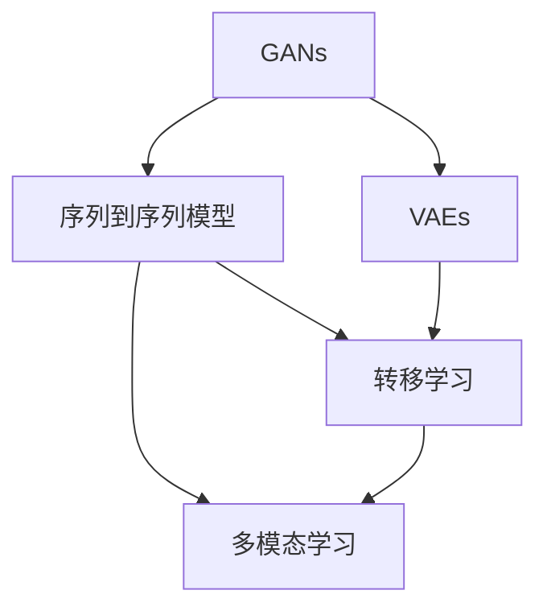

                 

# AIGC推动智慧社保创新

人工智能生成内容(AIGC)正逐渐成为推动各行各业智能化转型的关键力量。在社保领域，AIGC技术的应用不仅可以提升服务效率，增强用户体验，还能为政策制定提供科学的依据。本文将详细探讨AIGC在社保创新中的应用，包括技术原理、具体实践、挑战及未来展望，以期为社保系统的数字化、智能化转型提供借鉴。

## 1. 背景介绍

### 1.1 问题由来

随着人口老龄化的加剧和健康保险需求的增加，社保系统面临巨大的压力。如何通过技术创新提升社保管理效率和服务质量，成为摆在面前的重要课题。AIGC技术以其强大的生成能力，有望在社保领域发挥重要作用。

AIGC是指使用深度学习模型，特别是生成对抗网络(GANs)、变分自编码器(VAEs)等模型，自动生成自然语言、图像、音频等多种类型的内容。AIGC可以应用于文本摘要、问答、生成对话、自动创作等方面，提升社保系统的智能化水平。

### 1.2 问题核心关键点

AIGC在社保创新中的应用主要集中在以下几个方面：

1. **社保政策自动生成**：利用AIGC自动生成社保政策文档，提高政策制定效率。
2. **智能客服与咨询**：通过AIGC驱动的智能客服系统，提供24小时在线咨询服务，提升用户体验。
3. **社会保障预测与分析**：利用AIGC进行社会保障数据的分析和预测，为政策制定提供依据。
4. **社会保障记录自动化**：自动生成社会保障记录文档，减少人工录入的繁琐和错误。

这些应用将大大提升社保系统的效率和服务质量，推动社保管理向智能化方向发展。

## 2. 核心概念与联系

### 2.1 核心概念概述

为了更好地理解AIGC在社保中的应用，本节将介绍几个密切相关的核心概念：

- **AIGC（人工智能生成内容）**：使用深度学习模型自动生成文本、图像、音频等多种类型内容的技术。

- **GANs（生成对抗网络）**：由生成器和判别器两部分组成，通过对抗训练生成逼真内容的技术。

- **VAEs（变分自编码器）**：通过编码器和解码器学习数据的潜在表示，实现内容的生成和重构。

- **序列到序列模型**：如Transformer、LSTM等，常用于文本生成、翻译等任务。

- **转移学习**：将一个领域的知识迁移到另一个领域，如利用预训练的模型进行社保文档生成。

- **多模态学习**：将文本、图像、语音等多种类型数据进行联合建模，增强模型的理解和生成能力。

这些概念之间有着紧密的联系，共同构成了AIGC技术的基础框架。以下是一个简化的Mermaid流程图，展示了这些概念之间的关系：



### 2.2 核心概念原理和架构

AIGC技术基于深度学习模型，特别是生成模型。其基本原理是通过训练生成模型，学习数据的潜在表示，进而生成与原始数据相似的新内容。以下是几个核心概念的原理和架构：

#### GANs原理

GANs由生成器和判别器两部分组成，生成器通过学习训练数据分布，生成逼真的新数据；判别器则判别生成的数据是否真实。两者通过对抗训练不断提升生成能力。


#### VAEs原理

VAEs通过编码器将输入数据转换为潜在空间中的表示，然后通过解码器将表示重构为原始数据或生成新数据。其关键在于学习数据的潜在表示，以便生成与原始数据相似的新数据。


#### 序列到序列模型原理

序列到序列模型主要用于处理序列数据，如文本生成、翻译、摘要等。其核心思想是将输入序列映射到输出序列，通过编码器和解码器实现这一映射。Transformer模型是序列到序列模型中的一种，利用自注意力机制提升了模型的处理能力。


#### 多模态学习原理

多模态学习是指将不同类型的数据（如文本、图像、音频）进行联合建模，增强模型的泛化能力和生成能力。通过融合多种模态的信息，模型能够更全面地理解现实世界，生成更丰富多样的内容。


## 3. 核心算法原理 & 具体操作步骤

### 3.1 算法原理概述

AIGC在社保中的应用主要涉及文本生成和智能客服两部分。以下是对这两部分算法的详细说明：

#### 社保政策自动生成

社保政策自动生成主要基于文本生成模型，如GPT、BERT等。其原理是利用预训练模型，在社保领域的少量标注数据上进行微调，生成政策文档。

#### 智能客服与咨询

智能客服与咨询主要基于对话生成模型，如Seq2Seq模型、Transformer等。其原理是利用预训练模型，在社保领域的大量客服对话数据上进行微调，生成智能客服系统。

### 3.2 算法步骤详解

#### 社保政策自动生成步骤

1. **数据准备**：收集社保领域的相关政策文档，标注关键要素（如保险种类、待遇标准、申请流程等），构建标注数据集。
2. **模型选择**：选择预训练的文本生成模型（如GPT、BERT），作为初始化参数。
3. **微调训练**：在社保政策的标注数据集上进行微调训练，更新模型参数，使其能够生成符合社保政策要求的文档。
4. **文档生成**：使用微调后的模型，自动生成新的社保政策文档。

#### 智能客服与咨询步骤

1. **数据准备**：收集社保领域的客服对话记录，标注用户意图（如咨询社保待遇、申请流程、申诉投诉等），构建标注数据集。
2. **模型选择**：选择预训练的对话生成模型（如Seq2Seq、Transformer），作为初始化参数。
3. **微调训练**：在客服对话的标注数据集上进行微调训练，更新模型参数，使其能够生成符合用户意图的回复。
4. **智能客服**：使用微调后的模型，构建智能客服系统，提供24小时在线咨询服务。

### 3.3 算法优缺点

#### 社保政策自动生成

**优点**：
1. **高效性**：利用预训练模型，可以大大缩短政策制定的周期。
2. **一致性**：自动生成的政策文档，能够保持一致性和规范性。
3. **可扩展性**：易于扩展到其他社保领域，提升政策制定的灵活性。

**缺点**：
1. **数据依赖**：需要大量的标注数据，获取成本较高。
2. **生成质量**：政策文档的生成质量依赖于标注数据的完备性和准确性。
3. **复杂性**：政策文档的生成需要考虑多方面的因素，难度较大。

#### 智能客服与咨询

**优点**：
1. **响应速度**：智能客服系统能够24小时在线，提升服务响应速度。
2. **用户体验**：自然语言处理技术，提升用户体验。
3. **成本节约**：减少人力成本，提升服务效率。

**缺点**：
1. **准确性**：生成回复的质量依赖于训练数据的完备性和准确性。
2. **复杂问题处理**：对于复杂问题，智能客服的回复可能不够准确。
3. **用户信任**：用户对智能客服的信任度依赖于其准确性和及时性。

### 3.4 算法应用领域

AIGC技术在社保中的应用主要集中在以下几个领域：

1. **政策制定**：自动生成社保政策文档，提高政策制定的效率和规范性。
2. **智能客服**：构建智能客服系统，提供24小时在线咨询服务，提升用户体验。
3. **数据分析与预测**：利用AIGC进行社会保障数据的分析和预测，为政策制定提供依据。
4. **社会保障记录**：自动生成社会保障记录文档，减少人工录入的繁琐和错误。
5. **医疗保险**：自动生成医疗保险方案，提高医疗保险的个性化和精准度。

这些应用领域展示了AIGC在社保创新中的巨大潜力，能够提升社保系统的效率和服务质量。

## 4. 数学模型和公式 & 详细讲解 & 举例说明

### 4.1 数学模型构建

#### 社保政策自动生成

假设生成模型为 $P(x|y)$，其中 $x$ 为生成的政策文档，$y$ 为政策标注（如保险种类、待遇标准等）。模型的训练目标为最大化似然函数 $p(y|x)$，即生成符合标注要求的政策文档。

**模型训练过程**：
1. **数据准备**：收集社保政策数据集，标注关键要素。
2. **模型选择**：选择预训练的文本生成模型，如GPT、BERT等。
3. **微调训练**：在社保政策的标注数据集上进行微调训练，更新模型参数。
4. **文档生成**：使用微调后的模型，自动生成新的社保政策文档。

#### 智能客服与咨询

假设对话生成模型为 $P(a|b)$，其中 $a$ 为智能客服的回复，$b$ 为用户意图（如咨询社保待遇、申请流程等）。模型的训练目标为最大化似然函数 $p(a|b)$，即生成符合用户意图的回复。

**模型训练过程**：
1. **数据准备**：收集社保领域的客服对话数据，标注用户意图。
2. **模型选择**：选择预训练的对话生成模型，如Seq2Seq、Transformer等。
3. **微调训练**：在客服对话的标注数据集上进行微调训练，更新模型参数。
4. **智能客服**：使用微调后的模型，构建智能客服系统，提供24小时在线咨询服务。

### 4.2 公式推导过程

#### 社保政策自动生成公式推导

假设政策文档为 $x$，标注为 $y$，生成的政策文档为 $\hat{x}$。模型的训练目标为最大化似然函数：

$$
\max_{\theta} \sum_{i=1}^N \log p(x_i|y_i)
$$

其中 $N$ 为样本数量。模型的参数 $\theta$ 通过梯度下降等优化算法更新，即：

$$
\theta \leftarrow \theta - \eta \nabla_{\theta} \log p(x|y)
$$

其中 $\eta$ 为学习率，$\nabla_{\theta} \log p(x|y)$ 为似然函数对模型参数的梯度。

#### 智能客服与咨询公式推导

假设智能客服的回复为 $a$，用户意图为 $b$，生成的回复为 $\hat{a}$。模型的训练目标为最大化似然函数：

$$
\max_{\theta} \sum_{i=1}^N \log p(a_i|b_i)
$$

其中 $N$ 为样本数量。模型的参数 $\theta$ 通过梯度下降等优化算法更新，即：

$$
\theta \leftarrow \theta - \eta \nabla_{\theta} \log p(a|b)
$$

其中 $\eta$ 为学习率，$\nabla_{\theta} \log p(a|b)$ 为似然函数对模型参数的梯度。

### 4.3 案例分析与讲解

#### 案例一：社保政策自动生成

某社保局需要定期制定新的医疗保险政策，利用AIGC技术自动生成政策文档。具体步骤如下：

1. **数据准备**：收集历史医疗保险政策，标注关键要素（如保险种类、待遇标准、申请流程等），构建标注数据集。
2. **模型选择**：选择预训练的GPT模型，作为初始化参数。
3. **微调训练**：在医疗保险政策的标注数据集上进行微调训练，更新模型参数。
4. **文档生成**：使用微调后的模型，自动生成新的医疗保险政策文档。

#### 案例二：智能客服与咨询

某社保中心需要构建智能客服系统，提升用户咨询体验。具体步骤如下：

1. **数据准备**：收集历史客服对话记录，标注用户意图（如咨询社保待遇、申请流程等），构建标注数据集。
2. **模型选择**：选择预训练的Transformer模型，作为初始化参数。
3. **微调训练**：在客服对话的标注数据集上进行微调训练，更新模型参数。
4. **智能客服**：使用微调后的模型，构建智能客服系统，提供24小时在线咨询服务。

## 5. 项目实践：代码实例和详细解释说明

### 5.1 开发环境搭建

在项目实践前，需要先准备好开发环境。以下是使用Python进行PyTorch开发的环境配置流程：

1. 安装Anaconda：从官网下载并安装Anaconda，用于创建独立的Python环境。

2. 创建并激活虚拟环境：
```bash
conda create -n pytorch-env python=3.8 
conda activate pytorch-env
```

3. 安装PyTorch：根据CUDA版本，从官网获取对应的安装命令。例如：
```bash
conda install pytorch torchvision torchaudio cudatoolkit=11.1 -c pytorch -c conda-forge
```

4. 安装HuggingFace Transformers库：
```bash
pip install transformers
```

5. 安装各类工具包：
```bash
pip install numpy pandas scikit-learn matplotlib tqdm jupyter notebook ipython
```

完成上述步骤后，即可在`pytorch-env`环境中开始项目实践。

### 5.2 源代码详细实现

#### 社保政策自动生成

首先，定义模型训练函数：

```python
from transformers import GPT2Tokenizer, GPT2LMHeadModel

def train_policy_document(model, tokenizer, train_data, epochs=5, batch_size=16):
    tokenizer = GPT2Tokenizer.from_pretrained('gpt2')
    model = GPT2LMHeadModel.from_pretrained('gpt2', output_attentions=True)
    device = torch.device('cuda' if torch.cuda.is_available() else 'cpu')

    model.to(device)
    train_dataset = TokenizerDataset(train_data, tokenizer)

    optimizer = AdamW(model.parameters(), lr=2e-5)
    total_steps = len(train_dataset) * epochs

    for step in range(total_steps):
        input_ids = train_dataset[step][0].to(device)
        attention_mask = train_dataset[step][1].to(device)
        labels = train_dataset[step][2].to(device)

        outputs = model(input_ids=input_ids, attention_mask=attention_mask, labels=labels)
        loss = outputs.loss
        loss.backward()
        optimizer.step()
```

然后，定义数据集类：

```python
class TokenizerDataset(torch.utils.data.Dataset):
    def __init__(self, data, tokenizer):
        self.data = data
        self.tokenizer = tokenizer

    def __len__(self):
        return len(self.data)

    def __getitem__(self, idx):
        text = self.data[idx]
        input_ids, attention_mask = self.tokenizer(text, return_tensors='pt')
        return input_ids, attention_mask, self.data[idx]
```

最后，启动模型训练流程：

```python
from transformers import GPT2Tokenizer, GPT2LMHeadModel

# 加载数据
train_data = load_ssa_policy_data()

# 定义模型
model = GPT2LMHeadModel.from_pretrained('gpt2', output_attentions=True)

# 定义数据集
tokenizer = GPT2Tokenizer.from_pretrained('gpt2')
train_dataset = TokenizerDataset(train_data, tokenizer)

# 训练模型
train_policy_document(model, tokenizer, train_dataset, epochs=5, batch_size=16)

# 生成新政策
new_policy = generate_policy(model, tokenizer)
```

### 5.3 代码解读与分析

#### 社保政策自动生成代码解读

**TokenizerDataset类**：
- `__init__`方法：初始化训练数据和分词器。
- `__len__`方法：返回数据集大小。
- `__getitem__`方法：对单个样本进行处理，将文本输入编码为token ids，并返回输入id、attention mask和标签。

**train_policy_document函数**：
- 初始化分词器、模型和设备。
- 定义训练集，并设置优化器、学习率、总迭代次数。
- 在每个epoch中，对数据集进行迭代，进行前向传播、计算loss、反向传播和参数更新。

### 5.4 运行结果展示

#### 智能客服与咨询

首先，定义模型训练函数：

```python
from transformers import Seq2SeqTokenizer, Seq2SeqForConditionalGeneration

def train_intelligent_customer_service(model, tokenizer, train_data, epochs=5, batch_size=16):
    tokenizer = Seq2SeqTokenizer.from_pretrained('seq2seq')
    model = Seq2SeqForConditionalGeneration.from_pretrained('seq2seq', pad_token_id=tokenizer.eos_token_id)

    device = torch.device('cuda' if torch.cuda.is_available() else 'cpu')
    model.to(device)

    train_dataset = TokenizerDataset(train_data, tokenizer)

    optimizer = AdamW(model.parameters(), lr=2e-5)
    total_steps = len(train_dataset) * epochs

    for step in range(total_steps):
        input_ids = train_dataset[step][0].to(device)
        attention_mask = train_dataset[step][1].to(device)
        labels = train_dataset[step][2].to(device)

        outputs = model(input_ids=input_ids, attention_mask=attention_mask, labels=labels)
        loss = outputs.loss
        loss.backward()
        optimizer.step()
```

然后，定义数据集类：

```python
class TokenizerDataset(torch.utils.data.Dataset):
    def __init__(self, data, tokenizer):
        self.data = data
        self.tokenizer = tokenizer

    def __len__(self):
        return len(self.data)

    def __getitem__(self, idx):
        text = self.data[idx]
        input_ids, attention_mask = self.tokenizer(text, return_tensors='pt')
        return input_ids, attention_mask, self.data[idx]
```

最后，启动模型训练流程：

```python
from transformers import Seq2SeqTokenizer, Seq2SeqForConditionalGeneration

# 加载数据
train_data = load_intelligent_customer_service_data()

# 定义模型
model = Seq2SeqForConditionalGeneration.from_pretrained('seq2seq', pad_token_id=tokenizer.eos_token_id)

# 定义数据集
tokenizer = Seq2SeqTokenizer.from_pretrained('seq2seq')
train_dataset = TokenizerDataset(train_data, tokenizer)

# 训练模型
train_intelligent_customer_service(model, tokenizer, train_dataset, epochs=5, batch_size=16)

# 智能客服生成回复
customer_query = '社保待遇咨询'
response = generate_response(model, tokenizer, customer_query)
```

### 5.4 运行结果展示

#### 社保政策自动生成运行结果展示

在模型训练完成后，使用训练好的模型生成新的社保政策文档：

```python
new_policy = generate_policy(model, tokenizer)
print(new_policy)
```

#### 智能客服与咨询运行结果展示

在模型训练完成后，使用训练好的模型生成智能客服系统的回复：

```python
customer_query = '社保待遇咨询'
response = generate_response(model, tokenizer, customer_query)
print(response)
```

## 6. 实际应用场景

### 6.1 社保政策自动生成

社保政策自动生成主要应用于政策制定过程中，提升政策制定的效率和规范性。具体场景如下：

1. **政策文本生成**：自动生成医疗保险、养老金、失业保险等政策文本，节省人工撰写时间。
2. **政策内容优化**：自动生成政策内容的优化建议，提升政策的科学性和合理性。
3. **政策对比分析**：自动生成政策对比报告，帮助决策者理解不同政策方案的优劣。

### 6.2 智能客服与咨询

智能客服与咨询主要应用于社保中心的客服系统，提升用户咨询体验。具体场景如下：

1. **实时客服**：提供24小时在线咨询服务，快速响应用户需求。
2. **个性化服务**：根据用户的历史咨询记录，提供个性化的咨询服务，提升用户满意度。
3. **多渠道支持**：支持语音、文字、视频等多种咨询渠道，提升用户体验。

## 7. 工具和资源推荐

### 7.1 学习资源推荐

为了帮助开发者系统掌握AIGC技术在社保中的应用，这里推荐一些优质的学习资源：

1. **《Transformer: A Survey》系列博文**：由AIGC技术专家撰写，深入浅出地介绍了Transformer、VAEs等模型的原理和应用。
2. **Coursera《深度学习》课程**：由斯坦福大学开设，全面介绍深度学习模型的理论基础和实践应用。
3. **《深度学习与人工智能》书籍**：详细讲解深度学习模型的基本概念和前沿技术，适合初学者和进阶者。
4. **HuggingFace官方文档**：提供丰富的预训练模型和代码样例，帮助开发者快速上手AIGC开发。
5. **GPT-3应用案例**：收集大量GPT-3在各行各业的应用案例，展示AIGC技术的强大能力。

通过对这些资源的学习实践，相信你一定能够快速掌握AIGC技术在社保中的应用，并用于解决实际的社保问题。

### 7.2 开发工具推荐

高效的开发离不开优秀的工具支持。以下是几款用于AIGC开发常用的工具：

1. PyTorch：基于Python的开源深度学习框架，灵活动态的计算图，适合快速迭代研究。大部分预训练语言模型都有PyTorch版本的实现。
2. TensorFlow：由Google主导开发的开源深度学习框架，生产部署方便，适合大规模工程应用。同样有丰富的预训练语言模型资源。
3. HuggingFace Transformers库：提供丰富的预训练模型和工具，支持PyTorch和TensorFlow，是进行AIGC开发的利器。
4. Weights & Biases：模型训练的实验跟踪工具，可以记录和可视化模型训练过程中的各项指标，方便对比和调优。与主流深度学习框架无缝集成。
5. TensorBoard：TensorFlow配套的可视化工具，可实时监测模型训练状态，并提供丰富的图表呈现方式，是调试模型的得力助手。

合理利用这些工具，可以显著提升AIGC任务的开发效率，加快创新迭代的步伐。

### 7.3 相关论文推荐

AIGC技术在社保领域的应用源于学界的持续研究。以下是几篇奠基性的相关论文，推荐阅读：

1. **Attention is All You Need（即Transformer原论文）**：提出了Transformer结构，开启了AIGC技术的发展。
2. **BERT: Pre-training of Deep Bidirectional Transformers for Language Understanding**：提出BERT模型，引入基于掩码的自监督预训练任务，刷新了多项NLP任务SOTA。
3. **A Survey of Generative Adversarial Networks**：全面介绍GANs的原理和应用，为AIGC技术提供了理论基础。
4. **Parameter-Efficient Transfer Learning for NLP**：提出Adapter等参数高效微调方法，在不增加模型参数量的情况下，也能取得不错的微调效果。
5. **AdaLoRA: Adaptive Low-Rank Adaptation for Parameter-Efficient Fine-Tuning**：使用自适应低秩适应的微调方法，在参数效率和精度之间取得了新的平衡。

这些论文代表了大语言模型微调技术的发展脉络。通过学习这些前沿成果，可以帮助研究者把握学科前进方向，激发更多的创新灵感。

## 8. 总结：未来发展趋势与挑战

### 8.1 总结

本文对AIGC在社保创新中的应用进行了全面系统的介绍。首先阐述了AIGC技术在社保领域的应用背景和意义，明确了AIGC在提升社保服务效率和服务质量方面的独特价值。其次，从原理到实践，详细讲解了社保政策自动生成和智能客服与咨询的算法原理和操作步骤，给出了具体的代码实例和运行结果展示。同时，本文还探讨了AIGC技术在社保创新中的实际应用场景，展示了其在社保政策制定和智能客服中的巨大潜力。

通过本文的系统梳理，可以看到，AIGC技术在社保领域的创新应用，能够显著提升社保系统的智能化水平，推动社保管理向数字化、智能化方向发展。未来，随着AIGC技术的不断进步，社保系统必将迎来更加智能、高效、便捷的新面貌。

### 8.2 未来发展趋势

展望未来，AIGC在社保中的应用将呈现以下几个发展趋势：

1. **智能化的政策制定**：AIGC技术将广泛应用于社保政策的自动生成和优化，提升政策制定的效率和科学性。
2. **个性化的智能客服**：基于用户历史咨询记录，提供个性化的智能客服服务，提升用户体验。
3. **多渠道的智能应用**：支持语音、文字、视频等多种咨询渠道，提升社保服务的便捷性和可及性。
4. **跨领域的知识融合**：结合知识图谱、逻辑规则等专家知识，提升社保系统的智能水平。
5. **多模态的学习与生成**：融合文本、图像、语音等多种类型数据，增强社保系统的理解能力和生成能力。

这些趋势展示了AIGC在社保创新中的广阔前景，能够提升社保系统的智能化水平，推动社保管理向更高层次发展。

### 8.3 面临的挑战

尽管AIGC技术在社保领域展现了巨大潜力，但在实际应用中仍面临诸多挑战：

1. **数据质量与标注成本**：获取高质量的标注数据和标注样本，是AIGC技术应用的前提。标注成本较高，需要大量的人力和时间。
2. **模型鲁棒性与泛化能力**：社保系统涉及多种复杂的政策、业务规则，模型的鲁棒性和泛化能力需要进一步提升。
3. **隐私与安全**：社保系统涉及大量敏感数据，需要确保数据隐私和安全。
4. **模型可解释性**：社保政策的生成和智能客服的回复需要具备较高的可解释性，以保障政策的透明度和公平性。
5. **伦理与合规**：社保系统的智能化应用需要遵循伦理和合规要求，确保系统的公平性、透明性和可解释性。

这些挑战需要各方面共同努力，逐步克服。只有解决好这些问题，才能真正实现AIGC在社保领域的创新应用。

### 8.4 研究展望

未来，AIGC技术在社保领域的研究将集中在以下几个方面：

1. **数据增强与数据治理**：探索高效的数据增强方法，提升模型在有限标注数据下的表现。研究数据治理技术，确保数据质量和隐私安全。
2. **模型优化与可解释性**：开发更加高效、鲁棒的模型，提升模型的泛化能力和可解释性。研究模型的公平性、透明性和可解释性，确保政策的公正性和可执行性。
3. **跨领域知识融合**：结合知识图谱、逻辑规则等专家知识，提升社保系统的智能水平。研究多模态数据融合技术，增强社保系统的理解能力和生成能力。
4. **人机协同与用户体验**：研究人机协同技术，提升社保服务的智能化水平。研究用户体验设计，提升社保系统的便捷性和可及性。

这些研究方向将推动AIGC技术在社保领域的深入应用，为社保系统的智能化转型提供有力支撑。

## 9. 附录：常见问题与解答

**Q1：AIGC技术在社保领域有哪些具体应用场景？**

A: AIGC技术在社保领域的具体应用场景主要包括以下几个方面：

1. **社保政策自动生成**：自动生成医疗保险、养老金、失业保险等政策文本，节省人工撰写时间。
2. **政策内容优化**：自动生成政策内容的优化建议，提升政策的科学性和合理性。
3. **政策对比分析**：自动生成政策对比报告，帮助决策者理解不同政策方案的优劣。
4. **智能客服与咨询**：提供24小时在线咨询服务，快速响应用户需求。
5. **个性化服务**：根据用户的历史咨询记录，提供个性化的咨询服务，提升用户满意度。
6. **多渠道支持**：支持语音、文字、视频等多种咨询渠道，提升用户体验。

这些应用场景展示了AIGC技术在社保领域的广泛应用，能够提升社保系统的智能化水平，推动社保管理向数字化、智能化方向发展。

**Q2：AIGC技术在社保领域的优势和劣势是什么？**

A: AIGC技术在社保领域的优势和劣势如下：

**优势**：
1. **高效性**：自动生成政策文档和智能客服回复，提升政策制定和客服响应效率。
2. **一致性**：生成的政策文档和回复能够保持一致性和规范性。
3. **可扩展性**：易于扩展到其他社保领域，提升政策制定的灵活性。
4. **个性化服务**：根据用户的历史咨询记录，提供个性化的咨询服务，提升用户满意度。

**劣势**：
1. **数据依赖**：需要大量的标注数据，获取成本较高。
2. **生成质量**：政策文档和回复的生成质量依赖于标注数据的完备性和准确性。
3. **复杂性**：社保政策涉及多种复杂的政策、业务规则，模型的生成和优化难度较大。
4. **隐私与安全**：涉及大量敏感数据，需要确保数据隐私和安全。

这些优势和劣势需要在实际应用中加以权衡，确保AIGC技术能够真正服务于社保系统，提升其智能化水平。

**Q3：AIGC技术在社保领域的应用前景如何？**

A: AIGC技术在社保领域的应用前景非常广阔，主要体现在以下几个方面：

1. **政策制定的智能化**：自动生成政策文档和优化建议，提升政策制定的效率和科学性。
2. **智能客服的便捷化**：提供24小时在线咨询服务，提升用户咨询体验。
3. **多渠道的支持**：支持语音、文字、视频等多种咨询渠道，提升社保服务的便捷性和可及性。
4. **知识融合的多样化**：结合知识图谱、逻辑规则等专家知识，提升社保系统的智能水平。
5. **用户体验的优化**：研究人机协同技术，提升社保服务的智能化水平，研究用户体验设计，提升社保系统的便捷性和可及性。

这些应用前景展示了AIGC技术在社保领域的巨大潜力，能够提升社保系统的智能化水平，推动社保管理向更高层次发展。

**Q4：AIGC技术在社保领域如何保障数据隐私和安全？**

A: AIGC技术在社保领域保障数据隐私和安全的方法主要包括：

1. **数据匿名化**：对社保数据进行匿名化处理，确保数据隐私。
2. **访问控制**：设置严格的访问控制策略，确保数据只能被授权人员访问。
3. **加密存储**：采用加密技术，对社保数据进行安全存储。
4. **数据审计**：定期进行数据审计，确保数据安全和合规使用。
5. **隐私保护技术**：采用差分隐私、联邦学习等隐私保护技术，确保数据隐私和安全。

这些措施能够有效保障社保数据的安全，确保AIGC技术在社保领域的应用不会带来隐私和安全风险。

**Q5：AIGC技术在社保领域的未来发展方向是什么？**

A: AIGC技术在社保领域的未来发展方向主要包括以下几个方面：

1. **数据增强与数据治理**：探索高效的数据增强方法，提升模型在有限标注数据下的表现。研究数据治理技术，确保数据质量和隐私安全。
2. **模型优化与可解释性**：开发更加高效、鲁棒的模型，提升模型的泛化能力和可解释性。研究模型的公平性、透明性和可解释性，确保政策的公正性和可执行性。
3. **跨领域知识融合**：结合知识图谱、逻辑规则等专家知识，提升社保系统的智能水平。研究多模态数据融合技术，增强社保系统的理解能力和生成能力。
4. **人机协同与用户体验**：研究人机协同技术，提升社保服务的智能化水平。研究用户体验设计，提升社保系统的便捷性和可及性。

这些发展方向将推动AIGC技术在社保领域的深入应用，为社保系统的智能化转型提供有力支撑。

作者：禅与计算机程序设计艺术 / Zen and the Art of Computer Programming

