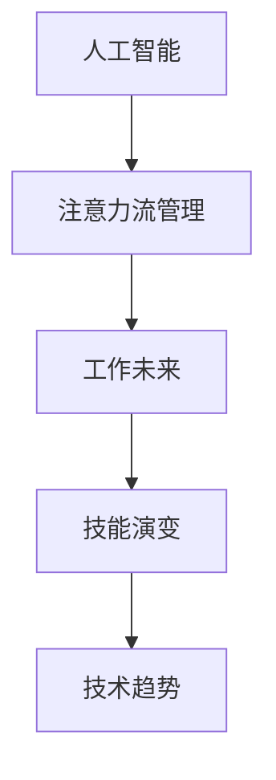

                 

# AI与人类注意力流：未来的工作、技能与注意力流管理技术的应用前景趋势预测

> 关键词：人工智能,注意力流管理,工作未来,技能演变,技术趋势

## 1. 背景介绍

### 1.1 问题由来
随着人工智能(AI)技术的飞速发展，AI与人类之间的互动愈发密切，深刻地影响着人类的工作模式、技能需求和注意力分配。AI的自动化和智能辅助能力改变了人们完成任务的方式，进而对人类工作技能和职业未来提出了新的挑战和机遇。

在数字化、智能化背景下，AI技术的广泛应用引发了对人类注意力流管理（Attention Flow Management, AFM）技术的关注。AFM技术旨在优化和控制人类和AI系统之间的注意力交互，以实现更高效率和效果的任务完成。

### 1.2 问题核心关键点
当前，AI与人类注意力流的交互已经成为各类应用的核心问题。其核心关键点包括：
- 如何通过AI技术优化人类注意力分配，提高工作效率？
- 如何在快速变化的AI技术环境中，保持人类技能的相关性和适应性？
- 如何在AI的辅助下，实现更好的人类决策支持？

本文将围绕这些核心问题，深入探讨AI与人类注意力流在未来工作、技能和注意力流管理技术中的应用前景与趋势。

## 2. 核心概念与联系

### 2.1 核心概念概述

为更好地理解AI与人类注意力流管理技术，首先需要介绍几个密切相关的核心概念：

- **人工智能(AI)**：指通过机器学习、深度学习等技术，让计算机模拟人类智能行为的能力。
- **注意力流管理(AFM)**：指通过技术和策略，优化人类注意力在任务中的分配，以提高任务完成效率和质量。
- **工作未来(Work of the Future, WoF)**：描述未来工作环境中的新趋势，包括自动化、智能化、协同化等特征。
- **技能演变**：指在AI与技术进步的背景下，人类所需技能的转变，如数据分析、编程、跨学科整合等。
- **技术趋势**：指AI与AFM技术的发展方向，包括新兴的算法、工具和平台等。

这些核心概念之间的逻辑关系可以通过以下Mermaid流程图来展示：



这个流程图展示了大语言模型的核心概念及其之间的关系：

1. 人工智能通过技术手段模拟人类智能行为，是注意力流管理和工作未来的基础。
2. 注意力流管理通过优化注意力分配，提升任务完成效率，直接影响工作未来的形态。
3. 技能演变反映AI与技术进步对人类技能需求的变化。
4. 技术趋势展示AI与AFM技术的最新发展方向。

## 3. 核心算法原理 & 具体操作步骤
### 3.1 算法原理概述

AI与人类注意力流管理技术的核心算法原理，主要围绕以下几个方面展开：

- **AI驱动的注意力优化**：通过AI技术预测和分析人类注意力流的潜在路径，优化注意力分配，提高任务完成效率。
- **技能需求预测**：基于历史数据和AI模型的预测，识别未来技能需求的变化趋势，指导人类技能提升。
- **注意力流管理策略**：结合AI与人类认知的特点，设计有效的注意力流管理策略，如任务分解、优先级排序等。
- **人机协同决策**：将AI技术与人类决策结合，提供辅助决策建议，提升决策质量和速度。

### 3.2 算法步骤详解

基于AI与人类注意力流管理技术的算法步骤，通常包括以下几个关键环节：

**Step 1: 数据准备**
- 收集和处理AI与人类互动的数据，包括注意力流数据、任务完成数据、技能水平数据等。
- 确保数据集的质量，进行清洗和标注，构建可用于模型训练的样本。

**Step 2: 模型训练**
- 选择合适的AI模型（如RNN、CNN、Transformer等），针对注意力优化、技能预测和决策支持等任务进行训练。
- 在训练过程中，使用交叉验证和调参技术，优化模型参数，提高模型的泛化能力。

**Step 3: 注意力优化**
- 通过AI模型对注意力流的潜在路径进行预测和优化，设计注意力流管理策略。
- 将优化后的注意力流应用于实际任务，通过用户反馈进行模型迭代。

**Step 4: 技能预测与提升**
- 基于AI模型对未来技能需求进行预测，识别技能差距。
- 设计个性化的培训计划，结合AI辅助学习和实践，帮助用户提升所需技能。

**Step 5: 人机协同决策**
- 在关键决策环节，将AI与人类决策结合，提供辅助决策建议。
- 通过不断的反馈和迭代，提升AI决策的准确性和可信度。

### 3.3 算法优缺点

AI与人类注意力流管理技术的优点包括：
1. **高效完成任务**：通过AI优化注意力分配，能够快速完成任务，提高工作效率。
2. **动态适应变化**：AI模型能够实时调整注意力流策略，应对任务变化和用户需求的变化。
3. **增强决策质量**：AI提供的决策建议能够增强人类决策的科学性和系统性。

同时，该技术也存在一定的局限性：
1. **依赖数据质量**：模型预测和优化依赖于高质量的数据，数据质量不佳会影响模型效果。
2. **算法复杂度**：优化算法和预测模型的设计复杂，需要丰富的领域知识和计算资源。
3. **模型偏见**：AI模型可能继承数据中的偏见，导致决策和建议的偏差。
4. **用户接受度**：用户对AI辅助的接受程度不同，可能影响技术应用的普及和效果。

尽管存在这些局限性，但AI与人类注意力流管理技术已经展现出显著的应用潜力，成为未来工作、技能和注意力流管理的重要方向。

### 3.4 算法应用领域

AI与人类注意力流管理技术已经在多个领域取得了应用：

- **智能办公**：通过AI优化注意力流，提高工作效率，减少手工操作。
- **智能制造**：将AI用于生产线优化，提升生产效率和质量。
- **智慧医疗**：在诊断和决策中引入AI辅助，提升医疗服务的精准度和效率。
- **教育培训**：通过AI识别学习者注意力流，个性化定制学习方案。
- **智能客服**：使用AI分析用户注意力，提升客户服务的质量和效率。

## 4. 数学模型和公式 & 详细讲解 & 举例说明

### 4.1 数学模型构建

本节将使用数学语言对AI与人类注意力流管理技术进行更加严格的刻画。

假设AI模型为$f(x)$，其中$x$为输入数据（如注意力流特征），$f(x)$为模型输出（如注意力优化策略）。假设数据集为$D=\{(x_i, y_i)\}_{i=1}^N$，其中$x_i$为第$i$个样本的输入，$y_i$为对应的优化策略。

定义模型的损失函数为$\ell(f(x),y_i)$，则经验风险为：

$$
\mathcal{L}(f) = \frac{1}{N}\sum_{i=1}^N \ell(f(x_i),y_i)
$$

优化目标是找到最小化经验风险的模型参数$\theta$：

$$
\theta^* = \mathop{\arg\min}_{\theta} \mathcal{L}(f_\theta)
$$

其中$f_\theta(x) = f(x; \theta)$为参数化的AI模型。

### 4.2 公式推导过程

以下是注意力流管理中的两个重要公式的推导过程：

**公式1：注意力优化预测**
$$
\hat{f}(x) = \text{softmax}(W_{att} x + b_{att})
$$

其中$W_{att}$和$b_{att}$为注意力预测模型的参数，softmax函数用于对注意力流进行归一化处理。

**公式2：技能需求预测**
$$
\hat{y} = f(x; \theta) = \text{softmax}(W_{skl} x + b_{skl})
$$

其中$W_{skl}$和$b_{skl}$为技能预测模型的参数，用于对未来技能需求进行预测。

### 4.3 案例分析与讲解

以智能办公场景为例，分析AI与人类注意力流管理的具体应用：

**问题背景**：某公司希望通过AI优化员工的注意力流，提高工作效率。

**解决方案**：
1. **数据收集与处理**：收集员工的任务分配、注意力集中度等数据，进行预处理和标注。
2. **模型训练**：使用AI模型（如Transformer）对注意力流进行预测和优化，生成注意力分配策略。
3. **策略实施**：将优化后的注意力分配策略应用于员工的任务安排中，观察工作效率的提升情况。
4. **效果评估**：通过员工反馈和任务完成数据，评估AI策略的有效性，进行模型迭代优化。

## 5. 项目实践：代码实例和详细解释说明

### 5.1 开发环境搭建

在进行AI与人类注意力流管理技术实践前，我们需要准备好开发环境。以下是使用Python进行TensorFlow开发的环境配置流程：

1. 安装Anaconda：从官网下载并安装Anaconda，用于创建独立的Python环境。

2. 创建并激活虚拟环境：
```bash
conda create -n tensorflow-env python=3.8 
conda activate tensorflow-env
```

3. 安装TensorFlow：根据CUDA版本，从官网获取对应的安装命令。例如：
```bash
conda install tensorflow tensorflow-gpu=2.7 -c conda-forge
```

4. 安装必要的库：
```bash
pip install pandas numpy matplotlib sklearn 
```

完成上述步骤后，即可在`tensorflow-env`环境中开始AI与人类注意力流管理技术的开发。

### 5.2 源代码详细实现

下面我们以智能办公场景为例，给出使用TensorFlow对AI模型进行注意力流管理优化训练的代码实现。

首先，定义注意力优化模型：

```python
import tensorflow as tf
from tensorflow.keras.layers import Input, Dense, Softmax

# 定义模型输入
input_layer = Input(shape=(n_features,))

# 定义模型结构
hidden_layer1 = Dense(128, activation='relu')(input_layer)
hidden_layer2 = Dense(64, activation='relu')(hidden_layer1)
attention_layer = Dense(n_classes, activation='softmax')(hidden_layer2)

# 定义模型
model = tf.keras.Model(inputs=input_layer, outputs=attention_layer)

# 编译模型
model.compile(optimizer=tf.keras.optimizers.Adam(learning_rate=0.001), loss='categorical_crossentropy', metrics=['accuracy'])
```

然后，定义技能需求预测模型：

```python
import tensorflow as tf
from tensorflow.keras.layers import Input, Dense, Softmax

# 定义模型输入
input_layer = Input(shape=(n_features,))

# 定义模型结构
hidden_layer1 = Dense(128, activation='relu')(input_layer)
hidden_layer2 = Dense(64, activation='relu')(hidden_layer1)
skill_layer = Dense(n_classes, activation='softmax')(hidden_layer2)

# 定义模型
model = tf.keras.Model(inputs=input_layer, outputs=skill_layer)

# 编译模型
model.compile(optimizer=tf.keras.optimizers.Adam(learning_rate=0.001), loss='categorical_crossentropy', metrics=['accuracy'])
```

接着，训练模型并评估：

```python
# 训练模型
model.fit(train_data, train_labels, epochs=10, validation_data=(val_data, val_labels))

# 评估模型
test_loss, test_acc = model.evaluate(test_data, test_labels)
print(f"Test accuracy: {test_acc:.4f}")
```

最后，使用模型进行注意力优化和技能预测：

```python
# 使用模型进行注意力优化
attention_predictions = model.predict(attention_data)

# 使用模型进行技能预测
skill_predictions = model.predict(skill_data)

# 输出预测结果
print(f"Attention predictions: {attention_predictions}")
print(f"Skill predictions: {skill_predictions}")
```

以上就是使用TensorFlow对AI模型进行注意力流管理优化的完整代码实现。可以看到，TensorFlow提供了丰富的API和工具，使得AI与人类注意力流管理技术的开发变得高效便捷。

### 5.3 代码解读与分析

让我们再详细解读一下关键代码的实现细节：

**定义模型**：
- `Input`层用于定义模型输入，`Dense`层用于构建神经网络结构，`Softmax`层用于归一化输出。
- 通过设置不同的神经网络层数和激活函数，实现不同的注意力流优化和技能预测模型。

**模型编译**：
- `compile`方法用于配置模型的优化器、损失函数和评价指标，准备模型的训练和评估。

**模型训练**：
- `fit`方法用于模型训练，通过定义训练数据和标签，进行模型参数的更新。
- 在训练过程中，`validation_data`参数用于实时评估模型性能，避免过拟合。

**模型评估**：
- `evaluate`方法用于模型在测试集上的性能评估，输出模型的准确率等指标。

**模型预测**：
- `predict`方法用于对新的数据进行预测，生成注意力优化策略和技能预测结果。

可以看到，TensorFlow提供的模型构建、训练和评估工具，使得AI与人类注意力流管理技术的开发过程变得简洁高效。开发者只需关注模型设计和算法实现，而不必过多关注底层细节。

当然，工业级的系统实现还需考虑更多因素，如模型的保存和部署、超参数的自动搜索、更灵活的任务适配层等。但核心的AI与人类注意力流管理技术基本与此类似。

## 6. 实际应用场景

### 6.1 智能办公

在智能办公场景中，AI与人类注意力流管理技术可以显著提升工作效率。例如，通过对员工的任务分配和注意力流进行分析，AI可以优化任务安排，减少手工操作，提高任务完成效率。具体实现上，可以使用注意力流优化模型对员工的注意力分配进行预测和调整，从而实现任务的自动排程和优化。

### 6.2 智能制造

在智能制造中，AI与人类注意力流管理技术可以提升生产效率和质量。通过分析工人在生产线上的注意力流，AI可以识别潜在的瓶颈和优化点，调整任务分配，减少人工干预，提高生产线的自动化水平。例如，可以结合视觉识别技术，实时监测工人的注意力流，自动调整任务优先级，提升生产效率。

### 6.3 智慧医疗

在智慧医疗领域，AI与人类注意力流管理技术可以提升诊断和决策的准确性。通过分析患者的注意力流，AI可以辅助医生进行诊断，提供决策建议，提升诊断的精准度和效率。例如，在患者就诊过程中，AI可以实时监测其注意力流，识别潜在的健康问题，及时进行干预，提高诊疗效果。

### 6.4 教育培训

在教育培训中，AI与人类注意力流管理技术可以个性化定制学习方案。通过分析学生的注意力流，AI可以识别学习者的好奇心和兴趣点，推荐相关的学习资源，提升学习效果。例如，在课堂教学中，AI可以实时监测学生的注意力流，识别注意力不集中的学生，提供针对性的互动和反馈，提升学习体验。

### 6.5 智能客服

在智能客服中，AI与人类注意力流管理技术可以提升客户服务的质量和效率。通过分析客户在对话中的注意力流，AI可以识别潜在的需求和问题，提供个性化的服务，提升客户满意度。例如，在客户咨询过程中，AI可以实时监测客户的注意力流，识别关注点，及时提供相关的解决方案，提升服务质量。

## 7. 工具和资源推荐

### 7.1 学习资源推荐

为了帮助开发者系统掌握AI与人类注意力流管理技术的基础知识和应用实践，这里推荐一些优质的学习资源：

1. **《深度学习》课程**：斯坦福大学的CS231n深度学习课程，详细讲解深度学习的基本概念和算法，适合初学者入门。
2. **TensorFlow官方文档**：TensorFlow的官方文档，提供了丰富的API和教程，帮助开发者快速上手TensorFlow。
3. **Google AI Education**：Google提供的AI教育平台，包含大量免费课程和实践项目，适合学习者系统掌握AI技术。
4. **Coursera**：在线教育平台，提供大量AI相关的课程，覆盖从入门到进阶的全方位知识体系。
5. **《人工智能导论》书籍**：经典教材，全面介绍了AI的基本概念、算法和应用，适合深入学习。

通过这些资源的学习实践，相信你一定能够快速掌握AI与人类注意力流管理技术的关键技能，并应用于实际项目中。

### 7.2 开发工具推荐

高效的开发离不开优秀的工具支持。以下是几款用于AI与人类注意力流管理技术开发的常用工具：

1. **PyTorch**：基于Python的开源深度学习框架，支持动态图和静态图，适合快速迭代研究。
2. **TensorFlow**：由Google主导开发的开源深度学习框架，生产部署方便，适合大规模工程应用。
3. **TensorBoard**：TensorFlow配套的可视化工具，可以实时监测模型训练状态，并提供丰富的图表呈现方式。
4. **Weights & Biases**：模型训练的实验跟踪工具，可以记录和可视化模型训练过程中的各项指标。
5. **Jupyter Notebook**：支持Python和TensorFlow等工具，适合快速开发和分享AI项目。
6. **Hugging Face Transformers库**：提供了大量的预训练模型和API，方便开发者进行微调和训练。

合理利用这些工具，可以显著提升AI与人类注意力流管理技术的开发效率，加快创新迭代的步伐。

### 7.3 相关论文推荐

AI与人类注意力流管理技术的发展源于学界的持续研究。以下是几篇奠基性的相关论文，推荐阅读：

1. **Attention Is All You Need**：提出Transformer结构，开启了NLP领域的预训练大模型时代。
2. **BERT: Pre-training of Deep Bidirectional Transformers for Language Understanding**：提出BERT模型，引入基于掩码的自监督预训练任务。
3. **Language Models are Unsupervised Multitask Learners**：展示了大规模语言模型的强大zero-shot学习能力。
4. **Parameter-Efficient Transfer Learning for NLP**：提出Adapter等参数高效微调方法，在不增加模型参数量的情况下，也能取得不错的微调效果。
5. **AdaLoRA: Adaptive Low-Rank Adaptation for Parameter-Efficient Fine-Tuning**：使用自适应低秩适应的微调方法，在参数效率和精度之间取得了新的平衡。
6. **AdaLoRA**：提出AdaLoRA方法，结合AdaGrad和LoRA技术，优化了微调模型的性能和效率。

这些论文代表了大语言模型微调技术的发展脉络。通过学习这些前沿成果，可以帮助研究者把握学科前进方向，激发更多的创新灵感。

## 8. 总结：未来发展趋势与挑战

### 8.1 总结

本文对AI与人类注意力流管理技术进行了全面系统的介绍。首先阐述了AI技术的发展对人类工作技能和注意力分配的深刻影响，明确了注意力流管理在提升任务效率和效果方面的独特价值。其次，从原理到实践，详细讲解了注意力流管理的数学原理和关键步骤，给出了技术实现的完整代码实例。同时，本文还广泛探讨了注意力流管理技术在智能办公、智能制造、智慧医疗等多个行业领域的应用前景，展示了技术应用的广阔空间。最后，本文精选了注意力流管理技术的各类学习资源，力求为读者提供全方位的技术指引。

通过本文的系统梳理，可以看到，AI与人类注意力流管理技术正在成为智能应用的重要基础，极大地提升了任务完成效率和工作质量。未来，伴随AI与注意力流管理技术的持续演进，相信智能系统的性能和应用范围将进一步拓展，为人类生活和工作带来更深远的影响。

### 8.2 未来发展趋势

展望未来，AI与人类注意力流管理技术将呈现以下几个发展趋势：

1. **高度自动化**：随着技术的进步，AI将能够更加高效地控制人类注意力流，实现更高程度的自动化和智能化。
2. **深度个性化**：基于用户历史数据和行为，AI将能够提供更加个性化的注意力流管理方案，提升用户体验和满意度。
3. **跨领域应用**：AI与注意力流管理技术将广泛应用于医疗、教育、制造等多个领域，推动各行业的智能化转型。
4. **多模态融合**：结合视觉、听觉、触觉等多模态数据，AI将能够更全面地理解人类注意力流，提升任务完成效果。
5. **实时优化**：基于实时数据分析和反馈，AI将能够不断调整注意力流管理策略，实现动态优化和自适应。

这些趋势凸显了AI与人类注意力流管理技术的广阔前景。这些方向的探索发展，必将进一步提升智能系统的性能和应用范围，为人类生活和工作带来深远影响。

### 8.3 面临的挑战

尽管AI与人类注意力流管理技术已经展现出显著的应用潜力，但在迈向更加智能化、普适化应用的过程中，它仍面临着诸多挑战：

1. **数据隐私问题**：大量用户数据的使用可能引发隐私和安全问题，如何保护用户数据成为关键。
2. **算法透明性**：AI模型的决策过程往往缺乏透明性，难以解释其内部工作机制和决策逻辑。
3. **技术公平性**：AI模型可能存在偏见和歧视，如何确保技术应用的公平性成为重要课题。
4. **用户接受度**：用户对AI辅助的接受程度不同，可能影响技术应用的普及和效果。
5. **资源消耗**：AI与注意力流管理技术需要大量的计算资源，如何提高算力效率成为挑战。

尽管存在这些挑战，但AI与人类注意力流管理技术的快速发展，为我们解决这些问题提供了新的思路和方法。相信随着学界和产业界的共同努力，这些挑战终将一一被克服，AI与注意力流管理技术必将在构建智能社会中扮演越来越重要的角色。

### 8.4 研究展望

面对AI与人类注意力流管理技术所面临的挑战，未来的研究需要在以下几个方面寻求新的突破：

1. **数据隐私保护**：开发基于隐私保护的数据处理和分析技术，确保用户数据的隐私和安全。
2. **算法透明性**：探索可解释的AI模型设计和评估方法，增强模型的透明性和可信度。
3. **技术公平性**：通过数据清洗和算法优化，减少模型的偏见和歧视，确保技术应用的公平性。
4. **用户接受度提升**：结合用户行为分析和心理模型，设计更加人性化的用户界面和交互方式。
5. **资源高效利用**：优化算法和模型结构，提高计算效率和资源利用率，降低技术应用的成本。

这些研究方向将推动AI与注意力流管理技术的进一步发展，为构建智能社会提供强有力的技术支持。面向未来，我们期待在数据隐私、算法透明性、技术公平性等方面取得突破，让AI与注意力流管理技术更好地服务于人类。

## 9. 附录：常见问题与解答

**Q1：AI与人类注意力流管理技术如何实现个性化定制？**

A: AI与人类注意力流管理技术可以通过分析用户的历史数据和行为，识别其兴趣点和需求，提供个性化的注意力流管理方案。具体实现上，可以使用注意力优化模型预测用户注意力流，结合用户偏好和环境变化，生成个性化的任务安排和提醒策略。例如，在智能办公中，根据员工的历史工作习惯和当前工作环境，自动调整任务优先级和注意力分配，提升工作效率。

**Q2：如何评估AI与注意力流管理技术的性能？**

A: AI与注意力流管理技术的性能评估可以从多个维度进行，包括任务完成效率、用户体验满意度、算法公平性和资源利用率等。具体评估方法包括：
1. **任务完成效率**：通过分析任务完成时间和质量，评估AI与注意力流管理技术对任务完成的提升效果。
2. **用户体验满意度**：通过问卷调查、用户反馈等方式，评估用户对AI与注意力流管理技术的接受度和满意度。
3. **算法公平性**：通过测试不同用户群体在AI系统中的表现差异，评估系统的公平性和无偏见性。
4. **资源利用率**：通过评估计算资源和存储资源的使用情况，优化系统资源利用率。

通过综合评估这些指标，可以全面了解AI与注意力流管理技术的实际效果，进行模型迭代和优化。

**Q3：AI与注意力流管理技术在哪些行业有应用前景？**

A: AI与注意力流管理技术在多个行业中都有广阔的应用前景，包括但不限于：
1. **智能制造**：通过优化生产线上的注意力流，提高生产效率和质量。
2. **智慧医疗**：在诊断和决策中引入AI辅助，提升诊断的精准度和效率。
3. **智能客服**：通过分析客户注意力流，提供个性化的服务，提升客户满意度。
4. **教育培训**：通过分析学生的注意力流，个性化定制学习方案，提升学习效果。
5. **智能办公**：优化员工的任务分配和注意力流，提高工作效率。
6. **金融服务**：通过分析客户的注意力流，提供个性化的金融服务，提升客户体验。
7. **零售电商**：通过分析用户的注意力流，优化商品推荐和营销策略，提升销售额。

这些行业的应用将为AI与注意力流管理技术带来新的突破和发展机会。

**Q4：AI与注意力流管理技术面临的挑战有哪些？**

A: AI与注意力流管理技术面临的挑战包括：
1. **数据隐私问题**：大量用户数据的使用可能引发隐私和安全问题，如何保护用户数据成为关键。
2. **算法透明性**：AI模型的决策过程往往缺乏透明性，难以解释其内部工作机制和决策逻辑。
3. **技术公平性**：AI模型可能存在偏见和歧视，如何确保技术应用的公平性成为重要课题。
4. **用户接受度**：用户对AI辅助的接受程度不同，可能影响技术应用的普及和效果。
5. **资源消耗**：AI与注意力流管理技术需要大量的计算资源，如何提高算力效率成为挑战。
6. **跨领域适应性**：不同行业和应用场景下的注意力流管理需求不同，如何设计通用的AI模型成为难题。

这些挑战需要通过技术创新和政策支持来解决，以推动AI与注意力流管理技术更好地服务于人类。

通过本文的系统梳理，可以看到，AI与人类注意力流管理技术正在成为智能应用的重要基础，极大地提升了任务完成效率和工作质量。未来，伴随AI与注意力流管理技术的持续演进，相信智能系统的性能和应用范围将进一步拓展，为人类生活和工作带来深远影响。总之，AI与注意力流管理技术的应用前景广阔，前景无限。面对未来的挑战，我们期待在技术创新和政策支持的双重推动下，实现人类与AI的深度融合，共创智能社会的美好未来。

---

作者：禅与计算机程序设计艺术 / Zen and the Art of Computer Programming

