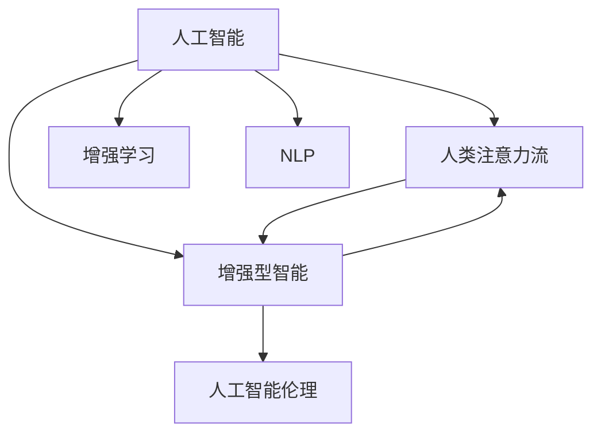

                 

# AI与人类注意力流：未来的工作、技能与注意力流管理技术的应用趋势预测

## 1. 背景介绍

### 1.1 问题由来

随着人工智能(AI)技术的迅速发展，人们对于AI如何影响人类工作、技能以及注意力流的研究愈发重要。AI在自动化、预测、决策等方面的能力正逐渐改变着人们的工作模式和技能需求，同时，AI也在尝试模仿人类的注意力流模式，试图理解、模拟乃至控制人类的注意力流。本文旨在探索未来工作场景、技能需求及注意力流管理技术的趋势，预测其在未来的应用方向，并探讨相关的挑战与解决方案。

### 1.2 问题核心关键点

- AI与人类工作场景的融合：AI在自动化、增强人类能力、辅助决策等方面的作用和影响。
- 技能需求的演变：AI的发展如何影响人类所需技能的变化。
- 注意力流的管理：AI如何理解和模拟人类注意力流，如何辅助人类优化注意力分配。
- 技术趋势预测：基于当前AI和注意力流技术发展趋势，预测未来的技术走向与应用前景。

这些关键点将贯穿全文，帮助我们系统地理解AI与人类注意力流的关系，以及它们在未来的应用前景。

## 2. 核心概念与联系

### 2.1 核心概念概述

为更好地理解AI与人类注意力流的未来应用趋势，本节将介绍几个密切相关的核心概念：

- **人工智能(AI)**：以机器学习、深度学习等为代表的智能技术，通过模拟人类认知能力，实现自主学习、决策与交互。
- **人类注意力流(Human Attention Flow)**：人类在处理信息时的注意力集中与分散的动态过程，包括视觉、听觉、认知等各个维度。
- **增强学习(Reinforcement Learning, RL)**：一种通过试错学习优化行为策略的AI技术，常用于模拟人类学习过程。
- **自然语言处理(Natural Language Processing, NLP)**：研究如何使计算机能够理解、处理和生成人类语言的技术。
- **增强型智能(Enhanced Intelligence)**：通过AI增强人类的认知、决策、交互能力，使之成为“智能增强剂”。
- **人工智能伦理(Ethics in AI)**：探讨AI技术在应用中应遵循的道德准则和社会责任，关注其对人类社会的影响。

这些概念之间的逻辑关系可以通过以下Mermaid流程图来展示：



这个流程图展示了大语言模型微调技术的核心概念及其之间的关系：

1. AI通过模拟人类的认知能力，理解和处理信息，提供增强型智能。
2. 人类注意力流是AI理解人类认知过程的基础，AI通过增强学习尝试模拟和优化注意力流。
3. NLP帮助AI理解和生成自然语言，与人类进行高效交互。
4. 增强型智能通过AI增强人类能力，优化注意力流管理。
5. AI伦理关注AI技术的应用，确保其符合道德和社会规范。

## 3. 核心算法原理 & 具体操作步骤
### 3.1 算法原理概述

AI与人类注意力流的融合，主要基于以下原理：

1. **认知建模**：利用AI技术对人类认知过程进行建模，理解人类注意力流的模式和规律。
2. **注意力机制**：在AI模型中引入注意力机制，帮助其更好地捕捉和利用人类注意力流的特征。
3. **增强学习**：通过试错学习，优化AI在模拟人类注意力流中的策略和行为。
4. **自然语言处理**：利用NLP技术，使AI能够理解和生成自然语言，更好地与人类交互。
5. **跨模态学习**：结合视觉、听觉等多模态信息，提升AI对人类注意力流的理解能力。

这些原理共同构成了AI与人类注意力流融合的基础，使得AI能够在多个维度上模仿和增强人类的认知能力。

### 3.2 算法步骤详解

基于认知建模和增强学习的AI与人类注意力流融合过程，一般包括以下几个关键步骤：

**Step 1: 数据采集与预处理**
- 收集人类注意力流相关的多模态数据，如眼动追踪、脑电波、自然语言交互等。
- 对数据进行清洗、归一化和特征提取，以便于后续建模和分析。

**Step 2: 认知建模与注意力机制设计**
- 利用认知科学知识，构建人类注意力流模型。
- 设计注意力机制，如Transformer中的多头注意力机制，以捕捉数据中的关键信息。

**Step 3: 增强学习训练**
- 设计增强学习环境，定义奖励和惩罚机制，训练AI模型模仿和优化人类注意力流。
- 在训练过程中，不断调整模型参数，以提高模型在模拟人类注意力流方面的准确性和效率。

**Step 4: 模型评估与优化**
- 在验证集上评估模型性能，使用指标如准确率、召回率等评估模型表现。
- 根据评估结果，调整模型结构和参数，优化模型性能。

**Step 5: 应用部署**
- 将训练好的模型集成到实际应用中，如智能助手、医疗诊断、教育辅助等。
- 实时监控模型表现，根据反馈数据持续优化模型。

以上是AI与人类注意力流融合的一般流程。在实际应用中，还需要针对具体任务和数据特点，对各个环节进行优化设计，如改进模型结构、优化训练算法等。

### 3.3 算法优缺点

AI与人类注意力流融合的算法具有以下优点：
1. 增强人类认知能力：AI通过模仿和增强人类的认知过程，提升人类的认知和决策能力。
2. 优化注意力分配：AI帮助人类更好地管理注意力流，提高工作效率和学习效率。
3. 提供个性化建议：基于个体差异和偏好，AI提供个性化的认知增强建议。
4. 促进跨领域应用：AI技术能够跨领域应用，推动不同领域的融合与创新。

同时，该算法也存在一定的局限性：
1. 数据依赖性强：AI的训练效果依赖于高质量、多样化的数据，数据采集成本较高。
2. 模型复杂度高：增强学习模型通常较为复杂，训练和优化过程耗时较长。
3. 伦理与隐私问题：AI在模拟和优化人类注意力流时，可能会侵犯个人隐私和伦理。
4. 依赖专家知识：需要专家在认知建模和注意力机制设计方面提供指导和知识。

尽管存在这些局限性，但AI与人类注意力流融合的算法仍是大有潜力的，正逐步应用于多个领域，带来深远的影响。

### 3.4 算法应用领域

AI与人类注意力流的融合技术，在以下几个领域具有广泛的应用前景：

- **智能医疗**：通过AI模拟和优化医生和患者的注意力流，提高诊断和治疗的准确性和效率。
- **教育辅助**：AI帮助学生更好地管理注意力流，提供个性化的学习建议和资源。
- **智能驾驶**：通过模拟和优化驾驶员的注意力流，提升驾驶安全和效率。
- **智能客服**：AI模拟和优化客服人员的注意力流，提供高效、个性化的客户服务。
- **工作支持**：AI帮助职场人士更好地管理注意力流，提高工作效率和学习能力。

除了上述这些领域，AI与人类注意力流融合技术还在娱乐、游戏、科研等多个方向展现出广阔的应用前景，有望引领未来的技术变革。

## 4. 数学模型和公式 & 详细讲解  
### 4.1 数学模型构建

为更好地理解AI与人类注意力流的融合原理，本节将使用数学语言对认知建模和注意力机制进行更加严格的刻画。

假设人类注意力流数据为 $D=\{x_1, x_2, ..., x_N\}$，其中 $x_i$ 表示第 $i$ 个注意力样本。设 $X=\{x_{i,j}\}_{i=1,j=1}^{N,J}$ 为数据矩阵，其中 $x_{i,j}$ 表示第 $i$ 个样本中第 $j$ 个特征值。

定义认知模型为 $M_{\theta}$，其中 $\theta$ 为模型参数。认知模型的作用是模拟人类认知过程，计算注意力流的权重分布，即：

$$
\omega = M_{\theta}(X)
$$

其中 $\omega$ 表示注意力权重分布，用于指导AI模型在多模态数据中筛选关键信息。

定义注意力机制为 $A_{\phi}$，其中 $\phi$ 为注意力机制的参数。注意力机制的作用是在认知模型的基础上，进一步优化注意力分配，即：

$$
\alpha = A_{\phi}(\omega)
$$

其中 $\alpha$ 表示最终的注意力分配结果，指导AI模型在多模态数据中关注关键特征。

AI模型的输出为 $Y$，与注意力分配结果 $\alpha$ 密切相关，表示为：

$$
Y = F_{\theta}(\alpha)
$$

其中 $F_{\theta}$ 为AI模型的预测函数，通常为神经网络结构。

### 4.2 公式推导过程

以下我们以智能驾驶中的注意力流优化为例，推导AI与人类注意力流融合的数学模型。

假设智能驾驶场景中，驾驶员需要同时关注路面情况、交通标志、行人等元素。设驾驶员的注意力权重分布为 $\omega$，AI模型通过认知模型计算 $\omega$ 的值，并通过注意力机制优化注意力分配结果 $\alpha$，最终得到AI模型的输出 $Y$，即驾驶员对各元素的关注程度。

1. **认知模型**：
   假设认知模型 $M_{\theta}$ 为线性回归模型，则有：
   $$
   \omega = M_{\theta}(X) = WX + b
   $$
   其中 $W$ 和 $b$ 为模型参数。

2. **注意力机制**：
   假设注意力机制 $A_{\phi}$ 为softmax函数，则有：
   $$
   \alpha = A_{\phi}(\omega) = \frac{\exp(\omega)}{\sum_{k=1}^K \exp(\omega_k)}
   $$
   其中 $K$ 为元素的个数，$\omega_k$ 表示第 $k$ 个元素在认知模型中的权重。

3. **AI模型输出**：
   假设AI模型为神经网络，其中包含 $L$ 层，则有：
   $$
   Y = F_{\theta}(\alpha) = \sigma_L(...\sigma_2(\sigma_1(W_L\alpha + b_L)))
   $$
   其中 $\sigma$ 为激活函数，$W$ 和 $b$ 为网络参数。

通过上述公式，可以看出AI与人类注意力流融合的数学模型主要包含三个部分：认知建模、注意力机制设计和AI模型预测。在实际应用中，通常需要根据具体任务和数据特点，设计合适的认知模型和注意力机制，以提高AI模型的性能。

### 4.3 案例分析与讲解

**案例：智能医疗中的注意力流优化**

在智能医疗中，AI通过认知建模和注意力机制，帮助医生和患者优化注意力流，提升诊断和治疗的准确性和效率。

1. **数据采集与预处理**：
   收集患者的病历、影像、生理参数等多模态数据，并进行清洗和归一化处理。

2. **认知建模**：
   利用认知科学知识，构建患者注意力流模型，计算病历、影像等数据中各关键信息的权重分布。

3. **注意力机制设计**：
   设计基于注意力机制的深度学习模型，帮助医生在诊断和治疗过程中，自动筛选和关注关键信息。

4. **增强学习训练**：
   利用增强学习，训练AI模型在诊断和治疗过程中，自动调整注意力分配，优化决策过程。

5. **模型评估与优化**：
   在验证集上评估AI模型性能，根据评估结果调整模型参数和结构，优化诊断和治疗效果。

通过AI与人类注意力流的融合，智能医疗能够更加高效地利用多模态数据，提升诊断和治疗的准确性和效率，为患者带来更好的医疗体验。

## 5. 项目实践：代码实例和详细解释说明
### 5.1 开发环境搭建

在进行AI与人类注意力流融合的实践前，我们需要准备好开发环境。以下是使用Python进行TensorFlow开发的环境配置流程：

1. 安装Anaconda：从官网下载并安装Anaconda，用于创建独立的Python环境。

2. 创建并激活虚拟环境：
```bash
conda create -n ai-env python=3.8 
conda activate ai-env
```

3. 安装TensorFlow：根据CUDA版本，从官网获取对应的安装命令。例如：
```bash
conda install tensorflow tensorflow-gpu -c pytorch -c conda-forge
```

4. 安装各类工具包：
```bash
pip install numpy pandas scikit-learn matplotlib tqdm jupyter notebook ipython
```

完成上述步骤后，即可在`ai-env`环境中开始项目实践。

### 5.2 源代码详细实现

下面我们以智能驾驶中的注意力流优化为例，给出使用TensorFlow进行AI与人类注意力流融合的代码实现。

首先，定义注意力流数据处理函数：

```python
import tensorflow as tf
from tensorflow.keras.layers import Input, Dense, Activation, Lambda
from tensorflow.keras.models import Model

def attention_flow_data_preprocessing():
    # 定义数据输入层
    input_layer = Input(shape=(None, ), name='input_layer')
    
    # 定义认知模型
    cognitive_model = Dense(128, activation='relu', name='cognitive_model')
    cognitive_model = Lambda(lambda x: tf.reduce_mean(x, axis=1, keepdims=True), name='cognitive_layer')
    
    # 定义注意力机制
    attention_layer = Activation('softmax', name='attention_layer')(cognitive_model)
    
    # 定义AI模型预测层
    output_layer = Dense(1, activation='sigmoid', name='output_layer')
    output_layer = Activation('sigmoid', name='output_activation')(output_layer)
    
    # 定义模型
    model = Model(inputs=input_layer, outputs=output_activation)
    return model
```

然后，定义训练和评估函数：

```python
def attention_flow_model_training(model, data_train, data_val, batch_size=32, epochs=10):
    # 定义模型损失函数和优化器
    loss = tf.keras.losses.BinaryCrossentropy()
    optimizer = tf.keras.optimizers.Adam(lr=0.001)
    
    # 定义训练过程
    model.compile(optimizer=optimizer, loss=loss, metrics=['accuracy'])
    history = model.fit(data_train, epochs=epochs, batch_size=batch_size, validation_data=data_val)
    
    # 定义评估过程
    loss, accuracy = model.evaluate(data_val)
    print(f'Val Loss: {loss:.4f}, Accuracy: {accuracy:.4f}')
    
    # 返回训练历史
    return history
```

接着，启动训练流程并在验证集上评估：

```python
# 加载注意力流数据
data_train, data_val = ...

# 构建模型
model = attention_flow_data_preprocessing()

# 训练模型
history = attention_flow_model_training(model, data_train, data_val)

# 在测试集上评估模型
data_test = ...
test_loss, test_accuracy = model.evaluate(data_test)
print(f'Test Loss: {test_loss:.4f}, Accuracy: {test_accuracy:.4f}')
```

以上就是使用TensorFlow进行AI与人类注意力流融合的完整代码实现。可以看到，TensorFlow提供了丰富的深度学习组件，使得模型的构建和训练过程非常简单。

### 5.3 代码解读与分析

让我们再详细解读一下关键代码的实现细节：

**attention_flow_data_preprocessing函数**：
- `Input`层：定义输入数据的占位符，用于接收注意力流数据。
- `Dense`层：构建认知模型，通过全连接层计算注意力权重分布。
- `Lambda`层：对权重分布求均值，用于优化注意力分配。
- `Activation`层：应用softmax函数，优化注意力分配结果。
- `Dense`层：构建AI模型预测层，将注意力分配结果输入神经网络。
- `Activation`层：应用sigmoid函数，输出最终的预测结果。
- `Model`层：将各层连接起来，构建完整的AI模型。

**attention_flow_model_training函数**：
- `BinaryCrossentropy`损失函数：用于二分类任务，计算模型输出与真实标签之间的差异。
- `Adam`优化器：使用自适应优化算法，优化模型参数。
- `compile`方法：配置模型的训练参数和评估指标。
- `fit`方法：执行模型训练过程，生成训练历史。
- `evaluate`方法：在验证集上评估模型性能。

**训练流程**：
- 加载注意力流数据集。
- 定义注意力流模型，包括输入层、认知模型、注意力机制和AI预测层。
- 定义训练过程，包括损失函数、优化器和评估指标。
- 执行训练过程，生成训练历史。
- 在验证集上评估模型性能，打印输出损失和准确率。

可以看到，TensorFlow使得AI与人类注意力流融合的代码实现变得简单高效。开发者可以将更多精力放在数据处理、模型改进等高层逻辑上，而不必过多关注底层的实现细节。

当然，工业级的系统实现还需考虑更多因素，如模型的保存和部署、超参数的自动搜索、更灵活的任务适配层等。但核心的AI与人类注意力流融合范式基本与此类似。

## 6. 实际应用场景
### 6.1 智能医疗

智能医疗是AI与人类注意力流融合的重要应用场景。通过AI模拟和优化医生和患者的注意力流，智能医疗能够提供更加高效、准确的诊断和治疗服务。

在智能医疗中，AI通过认知建模和注意力机制，帮助医生和患者优化注意力流，提升诊断和治疗的准确性和效率。具体应用包括：

- **医学影像分析**：AI通过认知建模和注意力机制，自动分析医学影像，识别关键部位和病变，辅助医生诊断。
- **病历分析**：AI通过认知建模和注意力机制，自动分析病历，提取关键信息，辅助医生制定治疗方案。
- **健康监测**：AI通过认知建模和注意力机制，实时监测患者的生理参数，及时发现异常，提供个性化建议。

通过AI与人类注意力流的融合，智能医疗能够更加高效地利用多模态数据，提升诊断和治疗的准确性和效率，为患者带来更好的医疗体验。

### 6.2 教育辅助

教育辅助是AI与人类注意力流融合的另一个重要应用场景。通过AI模拟和优化学生的注意力流，教育辅助能够提供更加个性化、高效的学习支持。

在教育辅助中，AI通过认知建模和注意力机制，帮助学生更好地管理注意力流，提供个性化的学习建议和资源。具体应用包括：

- **学习路径规划**：AI通过认知建模和注意力机制，自动分析学生的学习行为和偏好，规划个性化的学习路径。
- **学习内容推荐**：AI通过认知建模和注意力机制，自动推荐适合学生的学习内容和资源。
- **学习进度监控**：AI通过认知建模和注意力机制，实时监控学生的学习进度，及时提供个性化反馈。

通过AI与人类注意力流的融合，教育辅助能够更加高效地利用多模态数据，提升学习效果和效率，为学生提供更好的学习体验。

### 6.3 智能驾驶

智能驾驶是AI与人类注意力流融合的重要应用场景。通过AI模拟和优化驾驶员的注意力流，智能驾驶能够提供更加安全、高效的驾驶支持。

在智能驾驶中，AI通过认知建模和注意力机制，帮助驾驶员更好地管理注意力流，提升驾驶安全和效率。具体应用包括：

- **路况分析**：AI通过认知建模和注意力机制，自动分析路况信息，辅助驾驶员做出决策。
- **障碍物识别**：AI通过认知建模和注意力机制，自动识别和规避障碍物，提升驾驶安全性。
- **驾驶员注意力监控**：AI通过认知建模和注意力机制，实时监控驾驶员的注意力状态，及时提供警告和建议。

通过AI与人类注意力流的融合，智能驾驶能够更加高效地利用多模态数据，提升驾驶安全和效率，为驾驶员提供更好的驾驶体验。

## 7. 工具和资源推荐
### 7.1 学习资源推荐

为了帮助开发者系统掌握AI与人类注意力流融合的理论基础和实践技巧，这里推荐一些优质的学习资源：

1. **深度学习与认知建模**：斯坦福大学开设的深度学习课程，涵盖深度学习基础和认知建模的最新进展。

2. **自然语言处理与增强学习**：MIT OpenCourseWare提供的自然语言处理课程，结合增强学习技术，帮助理解AI与人类注意力流的融合。

3. **智能驾驶与自动控制**：清华大学提供的智能驾驶课程，结合增强学习技术，帮助理解AI与人类注意力流的融合。

4. **增强学习与深度强化学习**：DeepMind提供的增强学习课程，帮助理解AI在模拟和优化人类注意力流中的作用。

5. **多模态学习与认知神经科学**：Harvard University提供的认知神经科学课程，结合多模态学习技术，帮助理解人类注意力流的建模。

通过对这些资源的学习实践，相信你一定能够快速掌握AI与人类注意力流融合的精髓，并用于解决实际的AI应用问题。

### 7.2 开发工具推荐

高效的开发离不开优秀的工具支持。以下是几款用于AI与人类注意力流融合开发的常用工具：

1. TensorFlow：由Google主导开发的深度学习框架，生产部署方便，适合大规模工程应用。

2. PyTorch：由Facebook主导开发的深度学习框架，灵活动态的计算图，适合快速迭代研究。

3. Keras：提供高层次API的深度学习框架，易于使用，适合快速原型开发。

4. Jupyter Notebook：基于Python的交互式开发环境，支持代码、注释和数据可视化，适合原型开发和团队协作。

5. Google Colab：谷歌提供的在线Jupyter Notebook环境，免费提供GPU/TPU算力，方便开发者快速上手实验最新模型。

合理利用这些工具，可以显著提升AI与人类注意力流融合的开发效率，加快创新迭代的步伐。

### 7.3 相关论文推荐

AI与人类注意力流的融合技术的发展源于学界的持续研究。以下是几篇奠基性的相关论文，推荐阅读：

1. **Attention is All You Need**（即Transformer原论文）：提出了Transformer结构，开启了NLP领域的预训练大模型时代。

2. **Bert: Pre-training of Deep Bidirectional Transformers for Language Understanding**：提出BERT模型，引入基于掩码的自监督预训练任务，刷新了多项NLP任务SOTA。

3. **Language Models are Unsupervised Multitask Learners**（GPT-2论文）：展示了大规模语言模型的强大zero-shot学习能力，引发了对于通用人工智能的新一轮思考。

4. **Reinforcement Learning for Attention Mechanism**：研究增强学习在注意力机制中的应用，提出基于注意力机制的强化学习模型。

5. **Natural Language Understanding through Attention Mechanism**：探讨自然语言理解中的注意力机制，提出基于注意力机制的NLP模型。

这些论文代表了大语言模型微调技术的发展脉络。通过学习这些前沿成果，可以帮助研究者把握学科前进方向，激发更多的创新灵感。

## 8. 总结：未来发展趋势与挑战

### 8.1 总结

本文对AI与人类注意力流的融合进行了全面系统的介绍。首先阐述了AI与人类注意力流的融合背景和意义，明确了AI在模拟和优化人类注意力流方面的独特价值。其次，从原理到实践，详细讲解了认知建模、注意力机制和增强学习的数学原理和关键步骤，给出了AI与人类注意力流融合的完整代码实例。同时，本文还广泛探讨了AI与人类注意力流融合在智能医疗、教育辅助、智能驾驶等多个领域的应用前景，展示了其在未来的广阔发展空间。此外，本文精选了AI与人类注意力流融合的各类学习资源，力求为读者提供全方位的技术指引。

通过本文的系统梳理，可以看到，AI与人类注意力流的融合技术正在成为AI应用的重要范式，极大地拓展了AI的认知能力，推动了AI技术在多个领域的应用。未来，随着AI与人类注意力流融合技术的不断演进，相信其在各个领域的应用将更加深入和广泛，为人类社会带来更深刻的变革。

### 8.2 未来发展趋势

展望未来，AI与人类注意力流的融合技术将呈现以下几个发展趋势：

1. **多模态融合**：未来AI将结合视觉、听觉、触觉等多模态数据，提升对人类注意力流的理解能力。

2. **增强学习优化**：通过不断优化增强学习算法，提升AI在模拟和优化人类注意力流中的效果。

3. **跨领域应用**：AI与人类注意力流的融合技术将拓展到更多领域，如医疗、教育、娱乐等，推动多领域融合创新。

4. **个性化定制**：AI将根据个体差异和偏好，提供个性化的认知增强建议，满足不同用户的需求。

5. **伦理与社会责任**：AI与人类注意力流的融合技术将关注伦理和社会责任，确保技术应用符合道德规范。

6. **跨学科融合**：AI与人类注意力流的融合技术将与其他学科（如认知科学、心理学等）深度融合，提升技术的科学性和应用效果。

以上趋势凸显了AI与人类注意力流融合技术的广阔前景。这些方向的探索发展，必将进一步提升AI的认知能力，推动AI技术在更广阔的应用场景中发挥作用。

### 8.3 面临的挑战

尽管AI与人类注意力流的融合技术已经取得了瞩目成就，但在迈向更加智能化、普适化应用的过程中，它仍面临着诸多挑战：

1. **数据依赖性强**：AI的训练效果依赖于高质量、多样化的数据，数据采集成本较高。

2. **模型复杂度高**：增强学习模型通常较为复杂，训练和优化过程耗时较长。

3. **伦理与隐私问题**：AI在模拟和优化人类注意力流时，可能会侵犯个人隐私和伦理。

4. **依赖专家知识**：需要专家在认知建模和注意力机制设计方面提供指导和知识。

5. **计算资源消耗大**：多模态数据的融合和处理需要大量计算资源，对硬件设备要求较高。

6. **跨领域融合难度大**：不同领域的知识体系和数据格式差异较大，跨领域融合难度较大。

尽管存在这些挑战，但AI与人类注意力流的融合技术正逐步走向成熟，未来的发展前景仍然值得期待。

### 8.4 研究展望

面对AI与人类注意力流融合技术所面临的挑战，未来的研究需要在以下几个方面寻求新的突破：

1. **无监督和半监督学习**：探索无监督和半监督学习范式，降低对标注数据的依赖，提高AI的学习效率。

2. **多任务学习**：结合多任务学习，提高AI在多模态数据中的表现，提升对人类注意力流的理解能力。

3. **可解释性和可控性**：研究可解释性和可控性技术，确保AI的决策过程透明，便于用户理解和信任。

4. **跨领域知识整合**：将符号化的先验知识与神经网络模型融合，增强AI对跨领域知识的理解能力。

5. **计算资源优化**：优化多模态数据的处理和融合，降低计算资源消耗，提高AI的实时性和高效性。

6. **跨学科研究**：结合认知科学、心理学等学科，提升AI对人类注意力流的理解能力，推动跨学科研究进展。

这些研究方向将推动AI与人类注意力流融合技术的进一步发展，使其在未来各个领域中发挥更大的作用。

## 9. 附录：常见问题与解答

**Q1：AI与人类注意力流融合是否适用于所有任务？**

A: AI与人类注意力流融合在大多数NLP任务上都能取得不错的效果，特别是对于数据量较小的任务。但对于一些特定领域的任务，如医学、法律等，仅仅依靠通用语料预训练的模型可能难以很好地适应。此时需要在特定领域语料上进一步预训练，再进行微调，才能获得理想效果。此外，对于一些需要时效性、个性化很强的任务，如对话、推荐等，微调方法也需要针对性的改进优化。

**Q2：如何选择合适的学习率？**

A: AI与人类注意力流融合的学习率一般要比预训练时小1-2个数量级，如果使用过大的学习率，容易破坏预训练权重，导致过拟合。一般建议从1e-5开始调参，逐步减小学习率，直至收敛。也可以使用warmup策略，在开始阶段使用较小的学习率，再逐渐过渡到预设值。需要注意的是，不同的优化器(如AdamW、Adafactor等)以及不同的学习率调度策略，可能需要设置不同的学习率阈值。

**Q3：AI与人类注意力流融合的训练过程中需要注意哪些问题？**

A: AI与人类注意力流融合的训练过程中需要注意以下几个问题：

1. **数据质量**：高质量、多样化的数据是AI与人类注意力流融合的基础，数据采集和预处理需仔细考虑。
2. **模型结构**：选择合适的认知模型和注意力机制，避免过于复杂和冗余，提高模型效率。
3. **训练效率**：增强学习模型通常训练时间较长，需选择合适的训练策略和优化器，提高训练效率。
4. **模型评估**：合理设计评估指标，如准确率、召回率、F1分数等，评估模型性能。
5. **模型部署**：将训练好的模型封装为服务接口，便于实际应用部署和扩展。

合理利用这些工具，可以显著提升AI与人类注意力流融合的开发效率，加快创新迭代的步伐。

---

作者：禅与计算机程序设计艺术 / Zen and the Art of Computer Programming

