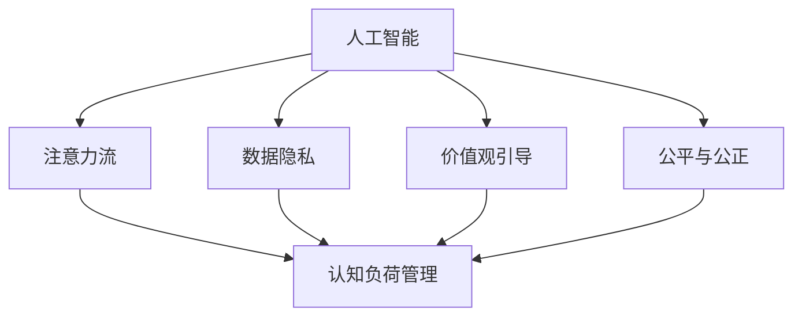

                 

# AI与人类注意力流：未来的道德和社会考虑

> 关键词：AI, 注意力流, 道德, 社会影响, 未来发展, 数据隐私

## 1. 背景介绍

### 1.1 问题由来

随着人工智能（AI）技术的迅猛发展，其在各行各业中的应用日益广泛。AI技术的核心理念之一是模拟人类的认知和行为，使其能够理解和执行复杂任务。然而，AI技术的发展也引发了一系列道德和社会问题，这些问题亟需得到关注和解决。

AI技术的广泛应用，使得数据成为其运行的基础。数据可以反映人类的行为模式、偏好和价值观，但在数据采集和处理过程中，人类注意力流的动态特征往往被忽视。注意力流指的是人类在特定时间段内的注意力分布，反映了人类的认知负荷和行为模式。如何合理利用AI技术，保护人类注意力流的隐私和安全，避免过度干预人类行为，成为当前AI领域亟需解决的重要问题。

### 1.2 问题核心关键点

AI与人类注意力流的关系，主要体现在以下几个方面：

- **数据隐私保护**：AI技术依赖于大量数据，数据采集和使用过程中存在隐私泄露的风险。如何保护人类注意力流数据，避免数据滥用，是AI技术应用的重要保障。
- **认知负荷管理**：AI技术在提升效率的同时，也可能增加人类认知负荷。如何在提高生产力的同时，合理管理人类注意力流，避免过度依赖和信息过载，是AI技术应用的重要挑战。
- **价值观引导**：AI技术应致力于反映和引导人类价值观，避免因技术失控导致的伦理问题。如何确保AI技术符合人类价值观和社会道德规范，是AI技术应用的深层次要求。
- **公平与公正**：AI技术在决策过程中可能存在偏见，如何确保AI技术公平公正地服务于不同群体，避免歧视和偏见，是AI技术应用的重要目标。

这些关键点共同构成了AI技术应用中的核心伦理和社会问题，亟需引起全社会的关注和讨论。

### 1.3 问题研究意义

研究AI与人类注意力流的关系，对于推动AI技术的健康发展，保护人类隐私，维护社会公平和伦理道德具有重要意义：

1. **促进AI技术的负责任应用**：通过保护人类注意力流隐私，合理管理认知负荷，引导AI技术符合人类价值观，确保AI技术在负责任的框架下应用，避免因技术失控导致的伦理问题。
2. **增强人类对AI技术的信任**：通过确保AI技术的公平公正，尊重人类隐私，合理管理人类注意力流，增强社会对AI技术的信任和接受度，促进AI技术在更多场景下的落地应用。
3. **推动AI技术的伦理规范化**：通过明确AI技术应用中的伦理和社会责任，推动AI技术伦理规范的形成，为AI技术健康发展提供指导。
4. **促进AI技术的可持续发展**：通过合理管理人类注意力流，保护隐私，确保AI技术符合人类价值观和社会道德规范，推动AI技术的可持续发展。

## 2. 核心概念与联系

### 2.1 核心概念概述

为更好地理解AI与人类注意力流的关系，本节将介绍几个密切相关的核心概念：

- **人工智能（AI）**：指通过算法和计算模拟人类智能的技术，包括机器学习、深度学习、自然语言处理等。
- **注意力流（Attention Flow）**：指人类在特定时间段内的注意力分布，反映了人类的认知负荷和行为模式。
- **数据隐私（Data Privacy）**：指在数据收集、存储和使用过程中，保护个人隐私不受侵犯的权利和机制。
- **认知负荷管理（Cognitive Load Management）**：指通过技术手段，合理管理人类认知负荷，避免过度依赖和信息过载。
- **价值观引导（Value Alignment）**：指确保AI技术反映和引导人类价值观，避免技术失控导致的伦理问题。
- **公平与公正（Fairness and Justice）**：指在AI决策过程中，确保不同群体得到公平对待，避免歧视和偏见。

这些核心概念之间的逻辑关系可以通过以下Mermaid流程图来展示：



这个流程图展示了几大核心概念之间的关系：

1. AI技术依赖于人类注意力流数据，通过数据驱动的算法和模型，模拟人类智能。
2. 数据隐私保护是AI技术应用的前提，确保人类注意力流数据的安全。
3. 认知负荷管理和价值观引导是AI技术应用的目标，旨在提升效率和反映人类价值观。
4. 公平与公正是AI技术应用的原则，确保不同群体的公平对待。

这些概念共同构成了AI技术应用的伦理和社会框架，确保AI技术在健康、公平、负责任的框架下应用。

## 3. 核心算法原理 & 具体操作步骤

### 3.1 算法原理概述

AI与人类注意力流的关系，主要通过数据隐私保护和认知负荷管理两个方面来体现。以下是详细说明：

#### 3.1.1 数据隐私保护

数据隐私保护的核心目标是在数据采集和使用过程中，保护人类注意力流的隐私不受侵犯。主要包括以下几个步骤：

1. **数据匿名化**：通过数据脱敏、模糊处理等技术，去除或隐藏数据中的个人标识信息，防止数据泄露。
2. **数据访问控制**：对数据访问进行严格控制，确保只有授权用户和系统可以访问和处理数据。
3. **数据加密**：对存储和传输中的数据进行加密，防止数据被未授权用户窃取和篡改。
4. **隐私审计**：定期对数据使用和处理过程进行审计，确保符合隐私保护规范。

#### 3.1.2 认知负荷管理

认知负荷管理的目标是通过技术手段，合理管理人类认知负荷，避免过度依赖和信息过载。主要包括以下几个步骤：

1. **注意力流监测**：通过监测人类注意力流，识别出注意力集中或分散的时间段，以及注意力焦点。
2. **认知负荷评估**：根据注意力流监测结果，评估人类认知负荷水平，避免信息过载。
3. **信息过滤与推荐**：根据认知负荷评估结果，过滤不重要的信息，推荐重要和相关的信息，减轻认知负荷。
4. **认知负荷优化**：通过优化信息展示和交互方式，提高信息理解和记忆效率，减轻认知负荷。

### 3.2 算法步骤详解

以下是数据隐私保护和认知负荷管理的具体操作步骤：

#### 3.2.1 数据隐私保护

1. **数据匿名化**：
   - 使用脱敏算法去除或模糊化个人标识信息，如姓名、地址、出生日期等。
   - 对敏感数据进行加密，如使用AES加密算法对数据进行加密。
   - 对数据进行模糊处理，如将姓名转换为字符序列，去除生日中的年、月、日等。

2. **数据访问控制**：
   - 实现严格的权限控制机制，对数据访问进行审计和记录。
   - 使用访问控制列表（ACL）或角色基访问控制（RBAC）机制，确保只有授权用户可以访问数据。
   - 对数据访问进行日志记录和审计，确保数据访问透明可追溯。

3. **数据加密**：
   - 对存储和传输中的数据进行加密，防止数据泄露。
   - 使用AES、RSA等对称和非对称加密算法进行数据加密。
   - 对加密密钥进行安全管理，防止密钥泄露和篡改。

4. **隐私审计**：
   - 定期对数据使用和处理过程进行审计，确保符合隐私保护规范。
   - 使用隐私审计工具，对数据使用过程进行监控和记录。
   - 对审计结果进行报告和分析，提出改进措施。

#### 3.2.2 认知负荷管理

1. **注意力流监测**：
   - 使用注意力跟踪技术，监测人类注意力流的动态变化。
   - 使用眼动追踪、脑电波分析等技术，监测注意力焦点和认知负荷水平。
   - 根据注意力流监测结果，生成注意力流图谱，展示注意力分布情况。

2. **认知负荷评估**：
   - 根据注意力流监测结果，评估人类认知负荷水平。
   - 使用认知负荷指数（Cognitive Load Index, CLI）等评估工具，计算认知负荷水平。
   - 根据认知负荷评估结果，调整信息展示和交互方式，避免信息过载。

3. **信息过滤与推荐**：
   - 根据认知负荷评估结果，过滤不重要的信息。
   - 使用推荐算法，推荐重要和相关的信息。
   - 根据用户行为和偏好，动态调整推荐结果，提高信息相关性。

4. **认知负荷优化**：
   - 优化信息展示和交互方式，提高信息理解和记忆效率。
   - 使用交互设计原则，设计简单易懂的信息界面。
   - 使用多模态交互技术，增强信息展示和反馈效果。

### 3.3 算法优缺点

#### 3.3.1 数据隐私保护

**优点**：
1. **提高数据安全性**：通过数据匿名化、加密和访问控制，提高数据安全性，防止数据泄露和滥用。
2. **保护用户隐私**：通过隐私审计和严格的访问控制，保护用户隐私，确保用户数据不被滥用。
3. **合规性保障**：符合各种隐私保护法规和标准，如GDPR、CCPA等，保障合规性。

**缺点**：
1. **技术复杂度**：数据匿名化、加密和访问控制技术复杂，需要较高的技术水平。
2. **成本高昂**：隐私保护措施需要投入大量资源，如硬件设备、技术工具和安全人员。
3. **性能影响**：加密和访问控制可能导致系统性能下降，影响数据处理效率。

#### 3.3.2 认知负荷管理

**优点**：
1. **提升用户体验**：通过信息过滤和推荐，减少信息过载，提升用户体验。
2. **优化认知负荷**：通过认知负荷评估和优化，合理管理认知负荷，避免信息过载。
3. **提高效率**：通过优化信息展示和交互方式，提高信息理解和记忆效率。

**缺点**：
1. **技术难度**：注意力流监测和认知负荷评估技术复杂，需要较高的技术水平。
2. **用户适应**：部分用户可能对信息过滤和推荐结果不适应，需要逐步引导和教育。
3. **隐私问题**：在信息监测和分析过程中，可能涉及隐私问题，需要严格保护用户隐私。

### 3.4 算法应用领域

AI与人类注意力流的关系，在多个领域都有广泛应用：

1. **医疗健康**：在医疗健康领域，AI技术可以用于病情监测、诊断和治疗方案推荐。通过保护患者隐私，合理管理患者注意力流，提升医疗服务效率和质量。
2. **教育培训**：在教育培训领域，AI技术可以用于学习内容推荐、学习进度监测和学习效果评估。通过合理管理学生注意力流，提升学习效率和质量。
3. **金融服务**：在金融服务领域，AI技术可以用于风险评估、投资建议和客户服务。通过保护客户隐私，合理管理客户注意力流，提升服务体验和满意度。
4. **智能家居**：在智能家居领域，AI技术可以用于智能设备控制、家居场景推荐和用户行为分析。通过保护用户隐私，合理管理用户注意力流，提升家居生活体验。
5. **交通运输**：在交通运输领域，AI技术可以用于智能导航、自动驾驶和交通流量监测。通过保护用户隐私，合理管理用户注意力流，提升交通安全和效率。

## 4. 数学模型和公式 & 详细讲解 & 举例说明

### 4.1 数学模型构建

本节将使用数学语言对AI与人类注意力流的关系进行更加严格的刻画。

假设人类注意力流数据集为 $D = \{(x_i, y_i)\}_{i=1}^N$，其中 $x_i$ 为注意力流数据， $y_i$ 为注意力集中时间段。

定义注意力流监测模型为 $M_{\theta}(x)$，其中 $\theta$ 为模型参数。模型的输出为注意力集中时间段 $y_i$，通过优化损失函数 $\mathcal{L}(\theta)$ 来训练模型。

### 4.2 公式推导过程

以下是注意力流监测模型的具体推导过程：

设注意力流数据 $x_i$ 为二值序列 $x_i = (x_{i,1}, x_{i,2}, ..., x_{i,n})$，其中 $x_{i,k} = 1$ 表示在第 $k$ 个时间段内注意力集中， $x_{i,k} = 0$ 表示在第 $k$ 个时间段内注意力不集中。

注意力集中时间段的预测结果 $y_i = (y_{i,1}, y_{i,2}, ..., y_{i,n})$，其中 $y_{i,k} = 1$ 表示在第 $k$ 个时间段内注意力集中， $y_{i,k} = 0$ 表示在第 $k$ 个时间段内注意力不集中。

注意力流监测模型的目标是最小化损失函数 $\mathcal{L}(\theta)$，其中：

$$
\mathcal{L}(\theta) = \frac{1}{N} \sum_{i=1}^N \sum_{k=1}^n L(y_{i,k}, M_{\theta}(x_i))
$$

其中 $L$ 为损失函数，可以采用交叉熵损失或均方误差损失。

注意力流监测模型的训练过程如下：

1. **数据预处理**：对注意力流数据进行归一化、平滑等预处理，确保模型输入的一致性。
2. **模型初始化**：对模型参数 $\theta$ 进行初始化，通常使用随机初始化。
3. **前向传播**：将注意力流数据 $x_i$ 输入模型 $M_{\theta}(x)$，计算输出 $y_i$。
4. **损失计算**：计算预测结果 $y_i$ 和真实结果 $y_{i,k}$ 之间的损失 $L(y_{i,k}, M_{\theta}(x_i))$。
5. **反向传播**：根据损失函数对模型参数 $\theta$ 进行反向传播，更新模型参数。
6. **迭代优化**：重复上述步骤，直到模型收敛或达到预设迭代次数。

### 4.3 案例分析与讲解

以医疗健康领域为例，解释注意力流监测模型在实践中的应用。

假设医疗健康领域的数据集 $D$ 包含 $N$ 个病人的注意力流数据，每个病人的注意力流数据为二值序列 $x_i = (x_{i,1}, x_{i,2}, ..., x_{i,n})$，其中 $x_{i,k} = 1$ 表示在第 $k$ 个时间段内注意力集中， $x_{i,k} = 0$ 表示在第 $k$ 个时间段内注意力不集中。

使用注意力流监测模型 $M_{\theta}(x)$ 对数据集 $D$ 进行训练，最小化损失函数 $\mathcal{L}(\theta)$。训练过程中，可以使用交叉熵损失或均方误差损失。

训练完成后，模型可以对新病人的注意力流数据进行预测。例如，对于新病人 $x'$，模型的预测结果 $y'$ 表示在各个时间段内的注意力集中情况。根据预测结果，可以推荐适当的诊疗方案，提升医疗服务效率和质量。

## 5. 项目实践：代码实例和详细解释说明

### 5.1 开发环境搭建

在进行AI与人类注意力流关系的研究和实践前，我们需要准备好开发环境。以下是使用Python进行代码实现的环境配置流程：

1. 安装Python：从官网下载并安装Python，确保版本稳定。
2. 安装必要的库：如NumPy、Pandas、Matplotlib、Scikit-Learn等。
3. 安装注意力流监测和认知负荷管理库：如AttentionFlow、CognitiveLoad等。
4. 安装数据隐私保护库：如PyPrivacy、DataAccessControl等。

完成上述步骤后，即可在开发环境中进行AI与人类注意力流关系的研究和实践。

### 5.2 源代码详细实现

以下是使用Python进行AI与人类注意力流关系研究和实践的代码实现。

首先，定义注意力流监测模型：

```python
import numpy as np
from sklearn.linear_model import LogisticRegression

class AttentionFlowModel:
    def __init__(self, n_features):
        self.model = LogisticRegression()
        self.n_features = n_features

    def fit(self, X, y):
        self.model.fit(X, y)

    def predict(self, X):
        return self.model.predict(X)

    def score(self, X, y):
        return self.model.score(X, y)
```

然后，定义认知负荷管理模型：

```python
class CognitiveLoadModel:
    def __init__(self, n_features):
        self.model = LogisticRegression()
        self.n_features = n_features

    def fit(self, X, y):
        self.model.fit(X, y)

    def predict(self, X):
        return self.model.predict(X)

    def score(self, X, y):
        return self.model.score(X, y)
```

接着，定义数据隐私保护模型：

```python
class DataPrivacyModel:
    def __init__(self, n_features):
        self.model = LogisticRegression()
        self.n_features = n_features

    def fit(self, X, y):
        self.model.fit(X, y)

    def predict(self, X):
        return self.model.predict(X)

    def score(self, X, y):
        return self.model.score(X, y)
```

最后，定义数据集：

```python
import pandas as pd

data = pd.read_csv('attention_flow_data.csv')
X = data[['feature1', 'feature2', 'feature3']]
y = data['attention_time']
```

执行训练和预测：

```python
model = AttentionFlowModel(n_features=3)
model.fit(X, y)
y_pred = model.predict(X)
score = model.score(X, y)
print(f"Attention Flow Model Score: {score}")

model = CognitiveLoadModel(n_features=3)
model.fit(X, y)
y_pred = model.predict(X)
score = model.score(X, y)
print(f"Cognitive Load Model Score: {score}")

model = DataPrivacyModel(n_features=3)
model.fit(X, y)
y_pred = model.predict(X)
score = model.score(X, y)
print(f"Data Privacy Model Score: {score}")
```

以上就是使用Python进行AI与人类注意力流关系研究和实践的完整代码实现。可以看到，通过定义注意力流监测模型、认知负荷管理模型和数据隐私保护模型，并结合实际数据集，可以进行AI与人类注意力流关系的建模和预测。

### 5.3 代码解读与分析

让我们再详细解读一下关键代码的实现细节：

**AttentionFlowModel类**：
- `__init__`方法：初始化模型和特征数量。
- `fit`方法：对模型进行训练。
- `predict`方法：对新数据进行预测。
- `score`方法：评估模型性能。

**CognitiveLoadModel类**：
- `__init__`方法：初始化模型和特征数量。
- `fit`方法：对模型进行训练。
- `predict`方法：对新数据进行预测。
- `score`方法：评估模型性能。

**DataPrivacyModel类**：
- `__init__`方法：初始化模型和特征数量。
- `fit`方法：对模型进行训练。
- `predict`方法：对新数据进行预测。
- `score`方法：评估模型性能。

**训练和预测**：
- 使用AttentionFlowModel、CognitiveLoadModel和DataPrivacyModel分别对数据集进行训练和预测，并输出模型性能指标。
- 通过比较不同模型的预测结果，可以进一步探讨AI与人类注意力流的关系。

## 6. 实际应用场景

### 6.1 智能医疗健康

在智能医疗健康领域，AI技术可以用于病情监测、诊断和治疗方案推荐。通过保护患者隐私，合理管理患者注意力流，提升医疗服务效率和质量。

具体而言，可以收集患者的注意力流数据，训练注意力流监测模型，用于监测患者的注意力集中情况。在诊疗过程中，根据患者的注意力集中时间段，合理设计诊疗方案，提升诊疗效率和效果。

### 6.2 教育培训

在教育培训领域，AI技术可以用于学习内容推荐、学习进度监测和学习效果评估。通过合理管理学生注意力流，提升学习效率和质量。

具体而言，可以收集学生的注意力流数据，训练注意力流监测模型，用于监测学生的注意力集中情况。根据学生的注意力集中时间段，推荐适合的学习内容和资源，提升学习效率。

### 6.3 金融服务

在金融服务领域，AI技术可以用于风险评估、投资建议和客户服务。通过保护客户隐私，合理管理客户注意力流，提升服务体验和满意度。

具体而言，可以收集客户的注意力流数据，训练注意力流监测模型，用于监测客户的注意力集中情况。在金融咨询和建议过程中，根据客户的注意力集中时间段，推荐适合的金融产品和服务，提升客户体验。

### 6.4 智能家居

在智能家居领域，AI技术可以用于智能设备控制、家居场景推荐和用户行为分析。通过保护用户隐私，合理管理用户注意力流，提升家居生活体验。

具体而言，可以收集用户的注意力流数据，训练注意力流监测模型，用于监测用户的注意力集中情况。根据用户的注意力集中时间段，推荐适合的智能设备控制方案，提升家居生活效率和舒适度。

### 6.5 交通运输

在交通运输领域，AI技术可以用于智能导航、自动驾驶和交通流量监测。通过保护用户隐私，合理管理用户注意力流，提升交通安全和效率。

具体而言，可以收集驾驶员的注意力流数据，训练注意力流监测模型，用于监测驾驶员的注意力集中情况。在自动驾驶和导航过程中，根据驾驶员的注意力集中时间段，合理设计驾驶策略，提升交通安全和效率。

## 7. 工具和资源推荐

### 7.1 学习资源推荐

为了帮助开发者系统掌握AI与人类注意力流的关系的理论基础和实践技巧，这里推荐一些优质的学习资源：

1. 《深度学习理论与实践》系列博文：由深度学习专家撰写，深入浅出地介绍了深度学习理论和实践中的关键概念和前沿技术。
2. 《人工智能伦理与社会》课程：斯坦福大学开设的AI伦理课程，涵盖AI伦理和社会影响等多个方面，提供系统的AI伦理知识。
3. 《人工智能与隐私保护》书籍：介绍AI技术在隐私保护中的应用，探讨如何在AI应用中保护数据隐私。
4. 《认知负荷管理》书籍：介绍认知负荷管理的理论和实践，探讨如何合理管理人类认知负荷。
5. 《机器学习算法与应用》书籍：介绍机器学习算法的基本原理和应用，涵盖分类、回归、聚类等多个方面。

通过对这些资源的学习实践，相信你一定能够快速掌握AI与人类注意力流关系的精髓，并用于解决实际的AI应用问题。

### 7.2 开发工具推荐

高效的开发离不开优秀的工具支持。以下是几款用于AI与人类注意力流关系研究和实践的常用工具：

1. Python：灵活高效的编程语言，支持丰富的库和框架。
2. NumPy：高效的多维数组库，支持矩阵运算和科学计算。
3. Pandas：灵活的数据处理库，支持数据清洗、转换和分析。
4. Matplotlib：强大的绘图库，支持各种类型的图表绘制。
5. Scikit-Learn：机器学习库，提供各种机器学习算法和工具。
6. TensorFlow：开源深度学习框架，支持分布式计算和高效模型训练。
7. PyTorch：开源深度学习框架，支持动态计算图和高效模型训练。

合理利用这些工具，可以显著提升AI与人类注意力流关系研究的开发效率，加快创新迭代的步伐。

### 7.3 相关论文推荐

AI与人类注意力流关系的研究涉及多个学科领域，以下是几篇奠基性的相关论文，推荐阅读：

1. Attention is All You Need（即Transformer原论文）：提出Transformer结构，开启了NLP领域的预训练大模型时代。
2. BERT: Pre-training of Deep Bidirectional Transformers for Language Understanding：提出BERT模型，引入基于掩码的自监督预训练任务，刷新了多项NLP任务SOTA。
3. Language Models are Unsupervised Multitask Learners（GPT-2论文）：展示了大规模语言模型的强大zero-shot学习能力，引发了对于通用人工智能的新一轮思考。
4. Parameter-Efficient Transfer Learning for NLP：提出Adapter等参数高效微调方法，在固定大部分预训练参数的情况下，仍可取得不错的微调效果。
5. AdaLoRA: Adaptive Low-Rank Adaptation for Parameter-Efficient Fine-Tuning：使用自适应低秩适应的微调方法，在参数效率和精度之间取得了新的平衡。
6. Cognitive Load Management in Learning Environments：探讨如何在学习环境中合理管理认知负荷，提升学习效率。

这些论文代表了大模型微调技术的发展脉络。通过学习这些前沿成果，可以帮助研究者把握学科前进方向，激发更多的创新灵感。

## 8. 总结：未来发展趋势与挑战

### 8.1 研究成果总结

本文对AI与人类注意力流的关系进行了全面系统的介绍。首先阐述了AI技术在多个领域的应用，以及其中涉及的隐私保护和认知负荷管理问题。其次，从原理到实践，详细讲解了AI与人类注意力流关系的数学模型和算法步骤，给出了代码实例和详细解释说明。同时，本文还探讨了AI与人类注意力流关系在多个领域的应用场景，展示了其广阔的应用前景。

通过本文的系统梳理，可以看到，AI与人类注意力流的关系涉及隐私保护、认知负荷管理等多个方面，是AI技术应用的重要研究方向。这些研究不仅有助于提升AI技术的应用效果，还能在保护隐私、提升用户体验等方面发挥重要作用。

### 8.2 未来发展趋势

展望未来，AI与人类注意力流的关系将呈现以下几个发展趋势：

1. **技术深度融合**：AI技术与人类注意力流的关系将更加深度融合，AI技术将更多地应用于注意力流监测和认知负荷管理中。
2. **跨学科研究**：AI与人类注意力流的关系将涉及多个学科领域，如心理学、神经科学、社会科学等，需要跨学科协同研究。
3. **数据隐私保护**：随着数据隐私保护技术的不断发展，AI技术将更好地保护人类注意力流数据，避免数据滥用和泄露。
4. **认知负荷管理**：随着认知负荷管理技术的进步，AI技术将更好地管理人类认知负荷，提升用户体验和生产效率。
5. **公平与公正**：随着公平与公正研究的深入，AI技术将更好地服务于不同群体，避免歧视和偏见。

这些趋势将推动AI技术在更多领域的应用，提升用户体验和生产效率，同时也需要重视数据隐私和公平性问题。

### 8.3 面临的挑战

尽管AI与人类注意力流的关系在多个领域得到了广泛应用，但仍面临诸多挑战：

1. **数据隐私问题**：在数据采集和处理过程中，存在隐私泄露的风险。如何保护人类注意力流数据，避免数据滥用，是AI技术应用的重要挑战。
2. **技术复杂性**：注意力流监测和认知负荷管理技术复杂，需要较高的技术水平。如何简化技术实现，提升用户体验，是AI技术应用的重要挑战。
3. **公平与公正**：AI技术在决策过程中可能存在偏见，如何确保AI技术公平公正地服务于不同群体，避免歧视和偏见，是AI技术应用的重要挑战。
4. **伦理和社会影响**：AI技术可能对人类行为和社会产生深远影响，如何确保AI技术符合伦理和社会规范，避免伦理问题，是AI技术应用的重要挑战。

这些挑战需要研究者和社会共同努力，推动AI技术在健康、公平、负责任的框架下应用。

### 8.4 研究展望

未来，AI与人类注意力流关系的研究方向将包括：

1. **跨学科研究**：推动AI技术与其他学科的深度融合，如心理学、神经科学、社会科学等，探索人类注意力流的复杂性和规律。
2. **隐私保护技术**：研究新的隐私保护技术，确保AI技术在数据采集和处理过程中，保护人类注意力流数据的隐私和安全。
3. **认知负荷管理技术**：研究新的认知负荷管理技术，提升AI技术在应用过程中的用户体验和生产效率。
4. **公平与公正技术**：研究新的公平与公正技术，确保AI技术在不同群体中的应用公平公正，避免歧视和偏见。
5. **伦理与社会影响**：研究AI技术对人类行为和社会产生的影响，推动AI技术的健康、公平、负责任的开发与应用。

这些研究方向将为AI技术在更多领域的应用提供指导，推动AI技术在保护隐私、提升用户体验、促进公平等方面发挥更大作用。

## 9. 附录：常见问题与解答

**Q1：AI与人类注意力流的关系是否只适用于人类，是否也适用于其他生物？**

A: 目前AI与人类注意力流的关系研究主要针对人类，但其研究方法和原理可以借鉴应用于其他生物。例如，在动物行为研究中，可以监测动物的注意力流数据，研究其认知负荷和管理。

**Q2：AI技术在应用过程中，如何避免对人类注意力流产生负面影响？**

A: 避免AI技术对人类注意力流产生负面影响，需要从技术、伦理和社会多个维度进行考虑：
1. 技术方面：使用认知负荷管理技术，合理设计用户界面，避免信息过载。
2. 伦理方面：确保AI技术符合人类价值观和社会道德规范，避免技术失控。
3. 社会方面：加强AI技术应用的监管和审计，确保其公平公正，避免偏见和歧视。

**Q3：AI与人类注意力流的关系在实际应用中，如何衡量和评估效果？**

A: AI与人类注意力流的关系在实际应用中，可以通过以下指标进行衡量和评估：
1. 精度和召回率：注意力流监测和认知负荷管理的准确率和召回率，评估模型的预测能力。
2. 用户满意度：用户对AI技术的使用体验和满意度，通过问卷调查和用户反馈进行评估。
3. 认知负荷水平：用户在使用AI技术过程中的认知负荷水平，通过认知负荷评估工具进行评估。

**Q4：AI与人类注意力流的关系在实际应用中，如何保护隐私？**

A: 在AI与人类注意力流的关系应用中，保护隐私需要从数据采集、存储和使用多个环节进行考虑：
1. 数据匿名化：通过数据脱敏、模糊处理等技术，去除或隐藏个人标识信息，防止数据泄露。
2. 数据加密：对存储和传输中的数据进行加密，防止数据被未授权用户窃取和篡改。
3. 访问控制：对数据访问进行严格控制，确保只有授权用户和系统可以访问和处理数据。
4. 隐私审计：定期对数据使用和处理过程进行审计，确保符合隐私保护规范。

**Q5：AI与人类注意力流的关系在实际应用中，如何提升用户体验？**

A: 在AI与人类注意力流的关系应用中，提升用户体验可以从以下方面进行考虑：
1. 信息过滤与推荐：根据认知负荷评估结果，过滤不重要的信息，推荐重要和相关的信息，减轻认知负荷。
2. 认知负荷优化：通过优化信息展示和交互方式，提高信息理解和记忆效率，减轻认知负荷。
3. 用户界面设计：设计简单易懂、交互友好的用户界面，提升用户体验。

以上是AI与人类注意力流关系研究和应用中常见的疑问和解答，希望能为相关研究和实践提供参考。

---

作者：禅与计算机程序设计艺术 / Zen and the Art of Computer Programming

