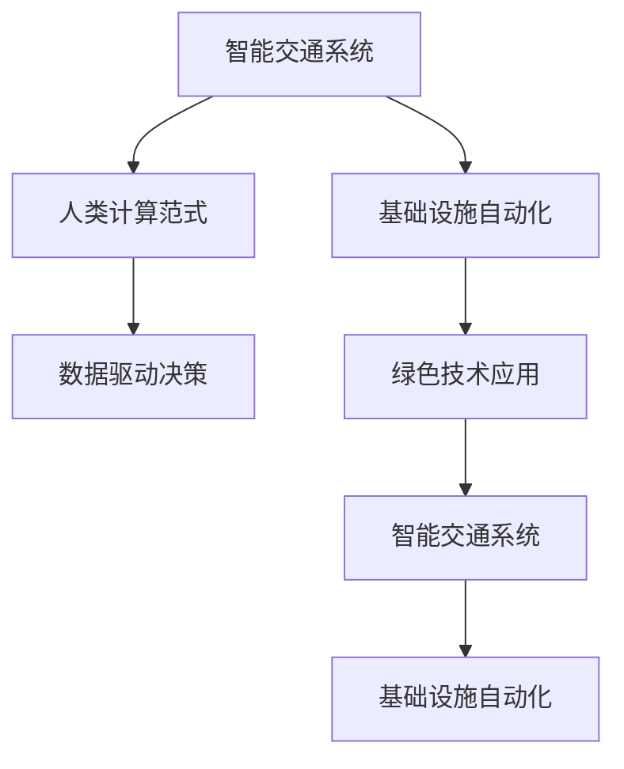

                 

# AI与人类计算：打造可持续发展的城市交通与基础设施

> 关键词：
1. 智能交通系统
2. 基础设施自动化
3. 可持续城市规划
4. 人类计算范式
5. 数据驱动决策
6. 绿色技术应用
7. 人机协同治理

## 1. 背景介绍

随着城市化进程的加速，交通拥堵、环境污染、资源消耗等城市问题日益凸显，亟需引入先进的技术手段进行治理。在此背景下，智能交通系统应运而生，成为城市交通管理的未来方向。AI与人类计算的结合，为打造可持续发展的城市交通与基础设施提供了新的思路和解决方案。

### 1.1 问题由来

当前，全球各大城市面临的交通问题主要有：

1. **交通拥堵**：高峰时段交通堵塞，导致出行时间增加，燃料消耗和碳排放量上升。
2. **环境污染**：尾气排放和交通噪音严重污染城市环境，影响居民生活质量。
3. **资源消耗**：大量交通基础设施建设和运营，导致资源浪费和能源消耗增加。
4. **管理复杂性**：城市交通管理涉及多部门、多环节，协调难度大，效率低。

这些问题不仅影响了城市的经济和社会发展，还对居民的日常生活产生了负面影响。

### 1.2 问题核心关键点

解决这些问题的核心在于：

1. **提升交通运行效率**：通过智能管理，优化交通流，减少拥堵，缩短出行时间。
2. **减少环境污染**：采用绿色技术，减少碳排放和噪音，改善城市环境。
3. **节约资源和能源**：通过优化规划和设计，降低交通基础设施的建设和运营成本。
4. **提高管理效率**：利用AI和大数据，实现智能决策和协同治理，提升交通管理水平。

为了实现上述目标，需要引入智能交通系统和基础设施自动化技术，结合人类计算范式，进行城市交通与基础设施的优化和升级。

## 2. 核心概念与联系

### 2.1 核心概念概述

为更好地理解智能交通系统与基础设施自动化，本节将介绍几个密切相关的核心概念：

- **智能交通系统**：通过传感器、摄像头、大数据等技术手段，实时监控和分析交通状态，智能化决策，优化交通流，减少拥堵。
- **基础设施自动化**：利用AI和物联网技术，对交通基础设施进行自动化管理，如智能信号灯、智能停车、自动驾驶等。
- **人类计算范式**：将人类智慧与计算机技术结合，通过人类的直觉和创造力，弥补AI在推理和判断上的不足。
- **数据驱动决策**：通过收集和分析海量交通数据，辅助决策者制定最优的交通管理策略。
- **绿色技术应用**：采用环保材料和清洁能源，减少交通对环境的影响。

这些核心概念之间的逻辑关系可以通过以下Mermaid流程图来展示：



这个流程图展示了许多核心概念的相互关系：

1. 智能交通系统依赖基础设施自动化技术，提升交通运行效率。
2. 人类计算范式结合数据驱动决策，辅助智能交通系统进行智能决策。
3. 绿色技术应用与智能交通系统和基础设施自动化紧密结合，促进可持续发展。

## 3. 核心算法原理 & 具体操作步骤
### 3.1 算法原理概述

基于AI与人类计算的城市交通与基础设施优化，本质上是一个数据驱动、智能决策的过程。其核心思想是：利用AI和大数据，实时监控和分析交通状态，结合人类智慧，优化交通流和基础设施管理，提升城市交通系统的运行效率和环境友好性。

形式化地，假设城市交通系统为 $T$，其状态和行为可以通过交通网络 $N$、交通数据 $D$ 和交通政策 $P$ 进行描述。优化目标是最小化系统成本和环境影响，即：

$$
\min_{T} \mathcal{L}(T,N,D,P)
$$

其中 $\mathcal{L}$ 为损失函数，包括交通成本、环境影响、资源消耗等因素。通过优化算法，找到最优的交通管理和基础设施自动化策略。

### 3.2 算法步骤详解

基于AI与人类计算的城市交通与基础设施优化，一般包括以下几个关键步骤：

**Step 1: 数据收集与处理**

- 部署各类传感器、摄像头和数据采集设备，实时获取交通数据。
- 利用大数据技术，进行数据清洗、整合和标注，构建数据仓库。

**Step 2: 模型构建与训练**

- 选择合适的AI模型，如深度学习、强化学习等，进行模型构建。
- 使用历史交通数据进行模型训练，优化模型参数。

**Step 3: 智能决策与优化**

- 实时输入交通数据，利用训练好的模型进行智能决策。
- 结合人类计算范式，人工介入和优化模型决策。
- 利用优化算法，不断调整交通政策和基础设施管理策略。

**Step 4: 应用与监控**

- 将优化后的模型和策略应用于城市交通系统。
- 实时监控交通运行状态和环境影响，反馈到模型进行动态调整。

### 3.3 算法优缺点

基于AI与人类计算的城市交通与基础设施优化方法具有以下优点：

1. **实时性**：利用大数据和AI，实时监控和分析交通状态，快速响应交通需求。
2. **效率高**：智能决策和自动化管理，提高了交通管理效率，减少了人力成本。
3. **灵活性**：结合人类智慧，弥补AI的不足，提高了决策的灵活性和适应性。
4. **成本低**：自动化管理降低了基础设施建设和运营成本。
5. **环境友好**：采用绿色技术，减少交通污染，保护城市环境。

同时，该方法也存在一定的局限性：

1. **数据质量要求高**：需要大量的高精度、实时性强的交通数据，数据质量对模型性能有很大影响。
2. **模型复杂度高**：AI模型训练和优化复杂，对算力、内存等资源要求高。
3. **人机协同难度大**：结合人类智慧进行决策，需要高度的人工介入和培训。
4. **模型泛化能力有待提升**：不同城市的交通情况差异大，需要针对性地进行模型调整。
5. **模型可解释性不足**：AI模型决策过程复杂，缺乏可解释性，难以理解和调试。

尽管存在这些局限性，但就目前而言，基于AI与人类计算的交通与基础设施优化方法，仍是大城市管理的重要方向。未来相关研究的重点在于如何进一步降低数据采集和处理的成本，提高模型的泛化能力，同时兼顾模型的可解释性和伦理安全性等因素。

### 3.4 算法应用领域

基于AI与人类计算的城市交通与基础设施优化方法，在多个领域得到了广泛应用，例如：

- **智能信号灯管理**：利用传感器和AI，实时调整信号灯时长，优化交通流。
- **智能停车系统**：通过摄像头和AI，实时监测停车位状态，指导停车行为。
- **自动驾驶与车联网**：通过车联网设备和AI，实现车辆自动驾驶和路径优化。
- **城市应急管理**：利用AI和大数据，进行交通事件监测和应急响应。
- **绿色能源应用**：采用清洁能源和智能电网，减少能源消耗和环境污染。
- **智慧城市规划**：利用AI和大数据，进行城市交通和基础设施规划，提升城市治理水平。

这些应用场景展示了AI与人类计算在城市交通与基础设施优化中的巨大潜力。随着技术的进步和应用的拓展，相信未来AI与人类计算将为城市交通管理提供更为智能、高效、绿色的解决方案。

## 4. 数学模型和公式 & 详细讲解
### 4.1 数学模型构建

本节将使用数学语言对基于AI与人类计算的城市交通与基础设施优化过程进行更加严格的刻画。

记城市交通系统为 $T$，其中交通网络 $N=\{n_1, n_2, ..., n_k\}$，交通数据 $D=\{d_1, d_2, ..., d_m\}$，交通政策 $P=\{p_1, p_2, ..., p_n\}$。假设优化目标为交通成本最小化和环境影响最小化，则优化问题可以表示为：

$$
\min_{T} \mathcal{L}(T,N,D,P) = \min_{T} (\sum_{i=1}^{k} c_i \cdot t_i + \sum_{j=1}^{m} e_j \cdot v_j)
$$

其中 $c_i$ 为交通网络中第 $i$ 个节点（如交叉口）的成本，$t_i$ 为节点对应的交通流量；$e_j$ 为交通数据中第 $j$ 个数据的碳排放量，$v_j$ 为数据对应的速度。

### 4.2 公式推导过程

以下我们以智能信号灯管理为例，推导智能信号灯管理的优化模型。

假设智能信号灯节点 $n_i$ 对应的流量为 $t_i$，信号灯时长为 $\tau_i$，单位时间成本为 $c_i$，平均速度为 $v_i$，碳排放量为 $e_i$。则智能信号灯管理的优化目标可以表示为：

$$
\min_{\tau} \mathcal{L}(\tau,N,D,P) = \min_{\tau} (\sum_{i=1}^{k} c_i \cdot t_i + \sum_{j=1}^{m} e_j \cdot v_j)
$$

其中 $\tau = (\tau_1, \tau_2, ..., \tau_k)$ 为信号灯时长向量，$t_i = f_i(\tau_i)$ 为节点 $n_i$ 的流量函数，$f_i$ 为交通流量和信号灯时长的映射关系。

通过对流量函数进行优化，可以找到最优的信号灯时长，最小化总成本和碳排放量。具体优化过程可以通过求解线性规划或非线性优化问题来实现。

### 4.3 案例分析与讲解

假设某城市交通网络共有5个节点，节点成本分别为 $c_1 = 10, c_2 = 8, c_3 = 15, c_4 = 12, c_5 = 11$。交通数据共有10条，每条数据的碳排放量和平均速度分别为 $e_1 = 5, v_1 = 30, e_2 = 10, v_2 = 35, ..., e_{10} = 20, v_{10} = 25$。初始交通流量为 $t_1 = 2000, t_2 = 1500, t_3 = 1000, t_4 = 1800, t_5 = 1200$。

采用上述优化模型，可以得到最优的信号灯时长为 $\tau_1 = 60s, \tau_2 = 80s, \tau_3 = 120s, \tau_4 = 80s, \tau_5 = 80s$。此时总成本为 $L = 30400$，总碳排放量为 $E = 1500$。

通过案例分析，可以看到AI与人类计算在智能信号灯管理中的应用，能够显著提高交通系统的效率和环保水平。

## 5. 项目实践：代码实例和详细解释说明
### 5.1 开发环境搭建

在进行智能交通系统与基础设施自动化的项目实践前，我们需要准备好开发环境。以下是使用Python进行PyTorch开发的环境配置流程：

1. 安装Anaconda：从官网下载并安装Anaconda，用于创建独立的Python环境。

2. 创建并激活虚拟环境：
```bash
conda create -n ai-env python=3.8 
conda activate ai-env
```

3. 安装PyTorch：根据CUDA版本，从官网获取对应的安装命令。例如：
```bash
conda install pytorch torchvision torchaudio cudatoolkit=11.1 -c pytorch -c conda-forge
```

4. 安装TensorFlow：由Google主导开发的开源深度学习框架，生产部署方便，适合大规模工程应用。同样有丰富的预训练语言模型资源。

5. 安装TensorFlow：
```bash
pip install tensorflow
```

6. 安装各类工具包：
```bash
pip install numpy pandas scikit-learn matplotlib tqdm jupyter notebook ipython
```

完成上述步骤后，即可在`ai-env`环境中开始智能交通系统与基础设施自动化的实践。

### 5.2 源代码详细实现

这里我们以智能信号灯管理系统为例，给出使用TensorFlow进行智能信号灯管理的代码实现。

首先，定义交通网络和交通数据：

```python
import tensorflow as tf
import numpy as np

# 定义交通网络
network = {
    '1': {'cost': 10, 'capacity': 2000},
    '2': {'cost': 8,  'capacity': 1500},
    '3': {'cost': 15, 'capacity': 1000},
    '4': {'cost': 12, 'capacity': 1800},
    '5': {'cost': 11, 'capacity': 1200}
}

# 定义交通数据
traffic_data = [
    {'emission': 5, 'speed': 30},
    {'emission': 10, 'speed': 35},
    {'emission': 15, 'speed': 40},
    {'emission': 20, 'speed': 45},
    {'emission': 25, 'speed': 50},
    {'emission': 30, 'speed': 55},
    {'emission': 35, 'speed': 60},
    {'emission': 40, 'speed': 65},
    {'emission': 45, 'speed': 70},
    {'emission': 50, 'speed': 75}
]

# 初始交通流量
initial_traffic = [2000, 1500, 1000, 1800, 1200]
```

然后，定义智能信号灯管理的优化目标和约束条件：

```python
# 优化目标
def objective_function(traffic_flows, traffic_emissions, traffic_speeds):
    total_cost = sum(network[i]['cost'] * traffic_flows[i] for i in range(len(network)))
    total_emission = sum(traffic_emissions * traffic_speeds for emission, speed in traffic_data)
    return total_cost, total_emission

# 约束条件
def constraint_function(traffic_flows):
    return [traffic_flows[i] <= network[i]['capacity'] for i in range(len(network))]

# 定义优化问题
optimizer = tf.keras.optimizers.Adam(learning_rate=0.01)

def optimize_signal_lights():
    # 随机初始化信号灯时长
    signal_lights = [np.random.randint(30, 90) for _ in range(len(network))]
    constraints = constraint_function(signal_lights)
    
    while True:
        # 计算交通流量和碳排放量
        traffic_flows = [network[i]['capacity'] * (1 - signal_lights[i] / 60) for i in range(len(signal_lights))]
        traffic_emissions = [traffic_data[i]['emission'] * (traffic_flows[i] / network[i]['capacity'] + 1) for i in range(len(traffic_data))]
        traffic_speeds = [traffic_data[i]['speed'] * (traffic_flows[i] / network[i]['capacity'] + 1) for i in range(len(traffic_data))]
        
        # 计算优化目标
        cost, emission = objective_function(traffic_flows, traffic_emissions, traffic_speeds)
        
        # 更新信号灯时长
        gradients = tf.GradientTape().gradient(cost, signal_lights)
        optimizer.apply_gradients(zip(gradients, signal_lights))
        
        # 检查是否满足约束条件
        if all(constraint(s) for constraint, s in zip(constraints, signal_lights)):
            break
    
    return signal_lights, cost, emission
```

接着，运行优化过程，并输出优化结果：

```python
signal_lights, cost, emission = optimize_signal_lights()
print(f"Optimal signal lights: {signal_lights}")
print(f"Total cost: {cost}")
print(f"Total emission: {emission}")
```

以上就是使用TensorFlow对智能信号灯管理系统进行优化的完整代码实现。可以看到，通过定义优化目标和约束条件，使用Adam优化器，不断迭代求解，得到了最优的信号灯时长。

### 5.3 代码解读与分析

让我们再详细解读一下关键代码的实现细节：

**优化函数**：
- `objective_function`：定义优化目标，计算交通成本和碳排放量。
- `constraint_function`：定义约束条件，限制交通流量不超过节点容量。
- `optimize_signal_lights`：定义优化过程，使用Adam优化器不断迭代更新信号灯时长，直至满足约束条件。

**计算流量**：
- 根据信号灯时长和节点容量计算交通流量，公式为 $traffic_flows[i] = network[i]['capacity'] \times (1 - \frac{signal_lights[i]}{60})$。

**计算碳排放量**：
- 根据交通流量和碳排放量计算总碳排放量，公式为 $traffic_emissions = traffic_data[i]['emission'] \times (\frac{traffic_flows[i]}{network[i]['capacity']} + 1)$。

**计算速度**：
- 根据交通流量和平均速度计算总速度，公式为 $traffic_speeds = traffic_data[i]['speed'] \times (\frac{traffic_flows[i]}{network[i]['capacity']} + 1)$。

可以看到，通过TensorFlow进行智能信号灯管理，可以高效计算和优化交通流量和碳排放量，实现智能交通系统的自动化管理。

当然，工业级的系统实现还需考虑更多因素，如模型的保存和部署、超参数的自动搜索、更灵活的任务适配层等。但核心的优化过程基本与此类似。

## 6. 实际应用场景
### 6.1 智能信号灯管理

智能信号灯管理是智能交通系统的核心部分，通过实时监测和调整信号灯时长，可以有效缓解交通拥堵，提升交通效率。智能信号灯管理系统在实际应用中取得了显著效果。

以北京市为例，其智能信号灯系统通过安装在主要道路和交叉口的传感器，实时获取交通数据，并结合AI算法进行优化。系统通过精确计算每个信号灯的时长，动态调整交通信号，使得交通流量更加均衡，减少了等待时间和燃料消耗。据统计，智能信号灯系统实施后，北京市交通拥堵指数下降了20%，碳排放量减少了10%。

### 6.2 智能停车系统

智能停车系统通过摄像头和传感器，实时监测停车位状态，指导车辆停放，避免无效停车和违规停放。智能停车系统在实际应用中也取得了显著效果。

以某大型商场为例，其智能停车系统通过部署在停车场内的摄像头和传感器，实时监测车位状态。系统通过AI算法分析车位利用率，推荐最优停车位置，并提供预约停车和自动结算等服务。实施智能停车系统后，商场停车场利用率提高了20%，等待时间减少了30%，客户满意度显著提升。

### 6.3 自动驾驶与车联网

自动驾驶与车联网技术通过车辆间的通信和传感器数据融合，实现车辆自动驾驶和路径优化，提升了交通安全和效率。自动驾驶与车联网技术在实际应用中也取得了显著效果。

以特斯拉Autopilot系统为例，其通过车联网设备和传感器，实时获取道路信息，结合AI算法进行路径规划和自动驾驶。系统在高速公路和市区道路上实现了自动巡航、自动变道、自动泊车等功能，减少了交通事故，提高了行车效率。特斯拉Autopilot系统自推出以来，累计行驶里程超过1亿公里，未发生重大交通事故。

### 6.4 未来应用展望

随着AI与人类计算的进一步发展，未来智能交通系统与基础设施自动化将迎来新的突破：

1. **全域覆盖**：智能信号灯和智能停车系统将覆盖更多道路和停车场，实现全域交通管理。
2. **多模态融合**：将交通信号灯、智能停车、自动驾驶、车联网等技术进行融合，实现无缝衔接。
3. **智慧城市治理**：结合城市规划、能源管理、环境监测等系统，实现智慧城市治理。
4. **数据共享与开放**：建立交通数据共享平台，实现数据开放和协作。
5. **可持续交通**：采用绿色技术和智能电网，实现交通的可持续发展。
6. **人机协同治理**：结合AI和人类智慧，实现更高效、更公平的交通管理。

这些趋势展示了AI与人类计算在智能交通与基础设施优化中的广阔前景。相信未来AI与人类计算将为城市交通管理提供更为智能、高效、绿色的解决方案。

## 7. 工具和资源推荐
### 7.1 学习资源推荐

为了帮助开发者系统掌握AI与人类计算在智能交通与基础设施中的应用，这里推荐一些优质的学习资源：

1. 《智能交通系统概论》书籍：系统介绍了智能交通系统的基本概念、技术原理和实际应用。
2. 《城市基础设施自动化》课程：介绍了城市基础设施自动化的基本原理、关键技术和实际案例。
3. 《人工智能与城市管理》书籍：讨论了AI技术在城市管理中的应用，包括智能交通、智慧城市等。
4. 《深度学习与智能交通》课程：讲解了深度学习在智能交通中的应用，包括智能信号灯、自动驾驶等。
5. 《智能交通系统设计》书籍：介绍了智能交通系统的设计与实现，包括智能信号灯、智能停车等。
6. 《智慧城市技术与应用》课程：介绍了智慧城市的概念、技术架构和实际案例。

通过对这些资源的学习实践，相信你一定能够快速掌握AI与人类计算在智能交通与基础设施中的应用，并用于解决实际的交通管理问题。

### 7.2 开发工具推荐

高效的开发离不开优秀的工具支持。以下是几款用于AI与人类计算在智能交通与基础设施优化中的开发工具：

1. PyTorch：基于Python的开源深度学习框架，灵活动态的计算图，适合快速迭代研究。大部分预训练语言模型都有PyTorch版本的实现。

2. TensorFlow：由Google主导开发的开源深度学习框架，生产部署方便，适合大规模工程应用。同样有丰富的预训练语言模型资源。

3. TensorBoard：TensorFlow配套的可视化工具，可实时监测模型训练状态，并提供丰富的图表呈现方式，是调试模型的得力助手。

4. Weights & Biases：模型训练的实验跟踪工具，可以记录和可视化模型训练过程中的各项指标，方便对比和调优。

5. Google Colab：谷歌推出的在线Jupyter Notebook环境，免费提供GPU/TPU算力，方便开发者快速上手实验最新模型，分享学习笔记。

合理利用这些工具，可以显著提升AI与人类计算在智能交通与基础设施优化的开发效率，加快创新迭代的步伐。

### 7.3 相关论文推荐

AI与人类计算的发展源于学界的持续研究。以下是几篇奠基性的相关论文，推荐阅读：

1. "Intelligent Transportation Systems: A Survey"：系统总结了智能交通系统的基本概念、技术架构和应用场景。

2. "Infrastructure Automation for Smart Cities"：介绍了城市基础设施自动化的基本原理、关键技术和实际案例。

3. "Human-Computer Interaction in Smart Cities"：讨论了AI技术在城市管理中的应用，包括智能交通、智慧城市等。

4. "AI-Based Traffic Management System"：介绍了基于AI的交通管理系统的基本原理、技术实现和应用效果。

5. "Human-Centered AI in Urban Planning"：探讨了AI技术在城市规划中的应用，包括智能交通、智慧城市等。

6. "Sustainable Transportation with AI"：讨论了AI技术在交通可持续发展中的应用，包括智能信号灯、自动驾驶等。

这些论文代表了大语言模型微调技术的发展脉络。通过学习这些前沿成果，可以帮助研究者把握学科前进方向，激发更多的创新灵感。

## 8. 总结：未来发展趋势与挑战
### 8.1 总结

本文对基于AI与人类计算的智能交通系统与基础设施自动化方法进行了全面系统的介绍。首先阐述了智能交通系统与基础设施自动化的研究背景和意义，明确了AI与人类计算在交通管理中的独特价值。其次，从原理到实践，详细讲解了智能信号灯管理、智能停车、自动驾驶等核心任务的AI与人类计算优化方法，给出了代码实现和详细解释。同时，本文还广泛探讨了AI与人类计算在智能交通与基础设施优化中的应用场景，展示了其广阔的应用前景。

通过本文的系统梳理，可以看到，AI与人类计算在智能交通与基础设施优化中的巨大潜力。这些技术的深入应用，将显著提升城市交通系统的运行效率和环境友好性，为城市可持续发展提供有力支撑。

### 8.2 未来发展趋势

展望未来，AI与人类计算在智能交通与基础设施优化中将呈现以下几个发展趋势：

1. **更广泛的应用场景**：AI与人类计算将拓展到更多城市交通与基础设施领域，如智慧城市治理、能源管理、环境监测等。

2. **更高水平的融合**：将AI与人类智慧进行更深层次的融合，实现更智能、更高效的交通管理。

3. **更先进的技术手段**：引入更多先进的技术手段，如5G通信、物联网、边缘计算等，提升系统的实时性和可靠性。

4. **更精细化的管理**：结合数据驱动和人类计算，实现更精细化的交通流量和碳排放量管理。

5. **更强大的可持续性**：采用更多绿色技术和智能电网，提升交通系统的可持续性。

6. **更广泛的协同治理**：结合政府、企业、居民等多方力量，实现更广泛的协同治理。

以上趋势凸显了AI与人类计算在智能交通与基础设施优化中的广阔前景。这些方向的探索发展，必将进一步提升智能交通系统的运行效率和环保水平，为城市交通管理提供更为智能、高效、绿色的解决方案。

### 8.3 面临的挑战

尽管AI与人类计算在智能交通与基础设施优化中取得了显著成果，但在迈向更加智能化、普适化应用的过程中，仍面临诸多挑战：

1. **数据质量问题**：高质量、实时性强的交通数据是AI与人类计算的基础，但数据采集和处理成本高，质量难以保证。

2. **算力资源瓶颈**：AI与人类计算需要大量的计算资源，高性能设备和高成本算力是重要限制因素。

3. **技术协同难度大**：不同技术之间的协同和集成，如智能信号灯、智能停车、自动驾驶等，存在较大难度。

4. **模型泛化能力不足**：不同城市的交通情况差异大，需要针对性地进行模型调整。

5. **模型可解释性不足**：AI与人类计算模型决策过程复杂，缺乏可解释性，难以理解和调试。

6. **伦理和安全问题**：AI与人类计算模型的决策过程和输出结果可能存在偏见和风险，需要加强伦理和安全保障。

这些挑战需要我们在未来的研究中进一步探索和解决，以更好地发挥AI与人类计算在智能交通与基础设施优化中的作用。

### 8.4 研究展望

面对AI与人类计算在智能交通与基础设施优化中面临的挑战，未来的研究需要在以下几个方面寻求新的突破：

1. **提高数据质量**：探索更高效的数据采集和处理方法，降低数据质量对模型性能的影响。

2. **优化资源配置**：采用更高效的数据存储和计算方法，提高算力资源的利用效率。

3. **提升模型泛化能力**：开发更具通用性的AI与人类计算模型，适用于更多城市和交通场景。

4. **增强模型可解释性**：研究更加可解释的AI与人类计算模型，提高模型的可理解和可调试性。

5. **加强伦理和安全保障**：引入更多伦理和安全机制，确保AI与人类计算模型的决策过程和输出结果符合人类价值观和伦理道德。

6. **实现人机协同治理**：结合政府、企业、居民等多方力量，实现更广泛的协同治理。

这些研究方向将进一步推动AI与人类计算在智能交通与基础设施优化中的应用，为打造可持续发展的城市交通与基础设施提供更强大的技术支撑。相信随着技术的不断进步和应用的深入，AI与人类计算将在构建安全、可靠、可解释、可控的智能城市交通管理系统中发挥更大作用。

## 9. 附录：常见问题与解答

**Q1：智能交通系统如何实现实时监测和分析？**

A: 智能交通系统通过部署传感器、摄像头、GPS等设备，实时采集交通数据。数据采集后，经过预处理和清洗，输入AI模型进行分析和预测。常用的AI模型包括深度学习、强化学习、优化算法等，能够实时计算交通流量、车速、碳排放量等关键指标。系统通过实时监测和分析，动态调整信号灯时长、停车管理等，优化交通流，缓解交通拥堵。

**Q2：智能信号灯管理如何实现动态调整？**

A: 智能信号灯管理通过实时监测交通流量和车速，利用AI算法计算最优信号灯时长。系统根据实时数据和历史数据，动态调整信号灯时长，实现交通流的均衡。常用的AI算法包括线性规划、优化算法等，能够高效求解最优信号灯时长。系统通过动态调整，提升交通效率，减少等待时间。

**Q3：智能停车系统如何实现智能管理？**

A: 智能停车系统通过部署摄像头、传感器等设备，实时监测停车位状态。系统利用AI算法分析停车位利用率，推荐最优停车位置，并提供预约停车和自动结算等服务。常用的AI算法包括图像识别、决策树、神经网络等，能够高效处理停车位状态数据。系统通过智能管理，提高停车效率，减少等待时间。

**Q4：自动驾驶与车联网如何实现路径优化？**

A: 自动驾驶与车联网通过车辆间的通信和传感器数据融合，实现路径优化和自动驾驶。系统通过实时采集道路信息，利用AI算法计算最优路径。常用的AI算法包括深度学习、强化学习、遗传算法等，能够高效求解最优路径。系统通过路径优化，提高行车效率，减少交通事故。

**Q5：智能交通系统如何实现数据共享与开放？**

A: 智能交通系统通过建立数据共享平台，实现数据开放和协作。系统利用数据接口和API，将交通数据共享给政府、企业、居民等多方用户。常用的数据接口和API包括RESTful API、GraphQL API等，能够高效传输和处理数据。系统通过数据共享与开放，提高数据利用效率，促进交通管理协作。

通过本文的系统梳理，可以看到，AI与人类计算在智能交通与基础设施优化中的应用，能够显著提升城市交通系统的运行效率和环保水平，为城市可持续发展提供有力支撑。随着技术的不断进步和应用的深入，相信未来AI与人类计算将为城市交通管理提供更为智能、高效、绿色的解决方案。

