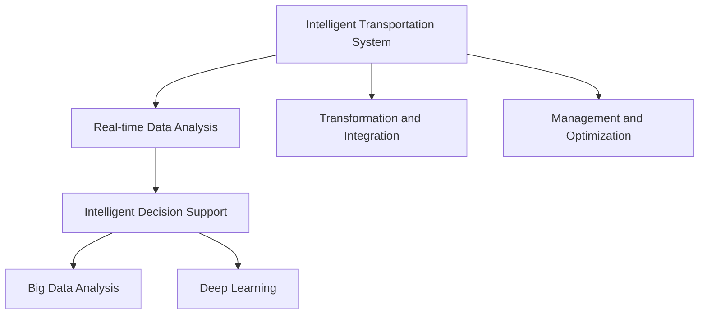

                 

# AI与人类计算：打造可持续发展的城市交通管理系统规划

> 关键词：智能交通系统，城市规划，交通管理，大数据分析，AI技术

## 1. 背景介绍

随着城市化进程的不断加速，交通拥堵成为全球大都市面临的重大挑战之一。解决交通问题不仅需要传统的基础设施建设，更需要引入创新技术，构建智慧交通系统。近年来，人工智能(AI)技术在交通领域的广泛应用，为城市交通管理带来了新的思路和解决方案。

### 1.1 问题由来

城市交通拥堵的主要原因在于交通需求超出供给，且交通系统缺乏智能化的管理和调度。当前城市交通管理主要依赖于人工调度，无法实时响应交通变化，效率较低。通过引入AI技术，特别是深度学习和大数据分析，可以对海量交通数据进行实时分析和预测，提供精准的交通管理决策，从而提升交通系统的运行效率和稳定性。

### 1.2 问题核心关键点

AI在交通管理中的应用，主要通过两个方面实现：

1. **实时数据分析**：通过传感器、摄像头等设备收集实时交通数据，利用机器学习算法分析交通流量、速度、车辆类型等信息，预测未来交通趋势。
2. **智能决策支持**：基于实时数据分析结果，智能决策系统能够自动调整交通信号灯、调度公共交通车辆，优化道路使用，缓解交通压力。

这两个方面相辅相成，构成了智慧交通系统的核心。AI技术的应用，显著提高了城市交通管理的效率和智能化水平。

## 2. 核心概念与联系

### 2.1 核心概念概述

为更好地理解AI在城市交通管理中的应用，本节将介绍几个关键概念及其相互联系：

- **智能交通系统(Intelligent Transportation System, ITS)**：利用AI和大数据等技术，对交通数据进行实时监测、分析和处理，实现交通系统的高效管理。
- **实时数据分析(Real-time Data Analysis)**：通过传感器、摄像头等设备收集交通数据，利用机器学习算法分析交通流量、速度、车辆类型等信息，预测未来交通趋势。
- **智能决策支持(Intelligent Decision Support)**：基于实时数据分析结果，智能决策系统能够自动调整交通信号灯、调度公共交通车辆，优化道路使用，缓解交通压力。
- **大数据分析(Big Data Analysis)**：从海量交通数据中提取有用信息，用于交通规划和预测。
- **深度学习(Deep Learning)**：利用多层神经网络模型，从数据中自动学习特征表示，进行模式识别和预测。

这些核心概念之间的逻辑关系可以通过以下Mermaid流程图来展示：



这个流程图展示了智能交通系统的核心构成及其相互关系：

1. **数据采集与分析**：通过传感器、摄像头等设备收集交通数据，利用机器学习算法进行分析和预测。
2. **决策支持**：基于实时数据分析结果，智能决策系统调整交通信号灯、调度公共交通车辆，优化道路使用。
3. **数据整合与规划**：将实时数据与历史数据整合，利用大数据分析进行交通规划和预测。
4. **算法优化**：在深度学习模型的基础上，优化交通管理算法，提升系统性能。
5. **系统管理与优化**：通过集中管理和智能调度，优化交通系统的运行效率。

## 3. 核心算法原理 & 具体操作步骤

### 3.1 算法原理概述

基于AI的城市交通管理，主要涉及数据采集、实时分析、智能决策和系统优化等多个环节。其核心算法原理如下：

1. **数据采集**：通过传感器、摄像头、GPS等设备，收集交通流量、速度、车辆类型等实时数据。
2. **实时分析**：利用深度学习算法，对收集到的数据进行实时分析和预测，识别交通拥堵、事故等异常情况。
3. **智能决策**：基于实时分析结果，智能决策系统调整交通信号灯、调度公共交通车辆，优化道路使用。
4. **系统优化**：通过历史数据和实时数据的整合，利用大数据分析进行交通规划和预测，优化交通管理策略。

### 3.2 算法步骤详解

以下以智能交通信号灯控制为例，详细讲解基于AI的城市交通管理算法步骤：

**Step 1: 数据采集**

1. 在主要路口安装传感器和摄像头，收集交通流量、速度、车辆类型等信息。
2. 传感器和摄像头通过网络将数据传输到中央控制平台。

**Step 2: 数据预处理**

1. 对采集到的数据进行清洗和预处理，去除噪声和异常值。
2. 将数据转化为标准格式，供后续分析和预测使用。

**Step 3: 特征提取**

1. 利用深度学习模型，如卷积神经网络(CNN)、循环神经网络(RNN)等，从数据中提取交通流量的时空特征。
2. 使用特征选择算法，选取对交通流量变化有显著影响的特征。

**Step 4: 实时预测**

1. 利用机器学习算法，如支持向量机(SVM)、随机森林(Random Forest)等，对交通流量进行实时预测。
2. 根据预测结果，识别交通拥堵、事故等异常情况。

**Step 5: 智能决策**

1. 根据预测结果和实时数据，智能决策系统自动调整交通信号灯的周期和相位。
2. 在发生异常情况时，系统自动调用紧急预案，如调整信号灯顺序、调度公共交通车辆等。

**Step 6: 系统优化**

1. 利用历史数据和大数据分析，优化交通管理策略，提升交通系统的运行效率。
2. 根据实时数据反馈，动态调整系统参数，实现精细化管理。

### 3.3 算法优缺点

基于AI的城市交通管理算法具有以下优点：

1. **实时性高**：通过实时数据分析，能够快速响应交通变化，提升交通系统的灵活性和反应速度。
2. **决策准确**：利用深度学习和大数据分析，提供精准的交通管理决策，优化道路使用，缓解交通压力。
3. **可扩展性强**：算法可以在不同规模的城市交通系统中应用，具有较强的可扩展性和通用性。
4. **成本低**：相比传统人工调度，AI算法减少了人力成本，提高了交通系统的运行效率。

同时，该算法也存在一定的局限性：

1. **数据依赖性大**：算法的性能依赖于数据的质量和数量，数据缺失或不准确会影响系统决策。
2. **系统复杂度高**：需要综合考虑多种因素，如天气、道路条件、车辆类型等，系统复杂度高。
3. **模型解释性差**：深度学习模型往往被视为"黑盒"系统，难以解释其内部工作机制和决策逻辑。
4. **初始成本高**：需要部署大量传感器和摄像头，以及复杂的计算设备，初始成本较高。

尽管存在这些局限性，但就目前而言，基于AI的城市交通管理算法仍是最为主流的解决方案。未来相关研究的方向在于如何进一步降低算法对数据的依赖，提高系统的可解释性和鲁棒性，同时兼顾成本和效率。

### 3.4 算法应用领域

基于AI的城市交通管理算法在多个领域得到了广泛应用，包括但不限于：

- **智能交通信号灯控制**：通过实时数据分析，自动调整信号灯的周期和相位，优化交通流量。
- **公共交通调度**：利用实时数据分析，自动调度公交车、出租车等公共交通工具，提升服务效率。
- **交通事故预警**：利用传感器和摄像头，识别交通事故，自动调整交通信号灯，缓解交通压力。
- **路况预测与优化**：利用历史数据和大数据分析，预测路况变化，优化交通管理策略。
- **智能停车管理**：通过实时数据分析，智能调整停车位分配，缓解停车压力。

这些应用场景展示了AI技术在交通管理中的巨大潜力，为城市交通系统的智能化升级提供了新的思路和解决方案。

## 4. 数学模型和公式 & 详细讲解 & 举例说明

### 4.1 数学模型构建

本节将使用数学语言对基于AI的城市交通管理算法进行更加严格的刻画。

记交通系统为 $T$，包括 $N$ 个路口，每个路口的交通流量为 $f_i$，其中 $i \in [1, N]$。假设实时数据采集时间为 $t$，特征提取结果为 $\mathbf{x}_t$，实时预测结果为 $\hat{f}_t$。交通信号灯控制策略为 $\sigma$，智能决策系统为 $D$。

定义交通系统在时间 $t$ 的流量为 $F_t$，优化目标为最小化交通流量波动：

$$
\min_{\sigma, \mathbf{x}_t, \hat{f}_t} \sum_{i=1}^N (f_i - \hat{f}_i)^2
$$

在实际应用中，我们通常使用基于梯度的优化算法（如SGD、Adam等）来近似求解上述最优化问题。设 $\eta$ 为学习率，$\lambda$ 为正则化系数，则参数的更新公式为：

$$
\theta \leftarrow \theta - \eta \nabla_{\theta}\mathcal{L}(\theta) - \eta\lambda\theta
$$

其中 $\nabla_{\theta}\mathcal{L}(\theta)$ 为损失函数对参数 $\theta$ 的梯度，可通过反向传播算法高效计算。

### 4.2 公式推导过程

以下我们以智能交通信号灯控制为例，推导深度学习模型在流量预测中的应用。

假设交通流量 $f_i$ 由交通信号灯控制策略 $\sigma$ 决定，则有：

$$
f_i = \sigma \cdot \phi_i(\mathbf{x}_t)
$$

其中 $\phi_i$ 为交通流量模型，$\mathbf{x}_t$ 为交通特征向量。

利用深度学习模型，如卷积神经网络(CNN)，对 $\mathbf{x}_t$ 进行特征提取，得到流量预测结果 $\hat{f}_t$：

$$
\hat{f}_t = CNN(\mathbf{x}_t)
$$

其中 $CNN$ 为卷积神经网络模型。

假设交通流量 $f_i$ 的实际值为 $y_i$，则损失函数为：

$$
\mathcal{L}(\theta) = \frac{1}{N} \sum_{i=1}^N (y_i - \hat{y}_i)^2
$$

其中 $\hat{y}_i = \sigma \cdot \phi_i(\hat{f}_i)$。

根据链式法则，损失函数对参数 $\theta_k$ 的梯度为：

$$
\frac{\partial \mathcal{L}(\theta)}{\partial \theta_k} = -\frac{2}{N}\sum_{i=1}^N (\frac{y_i}{\sigma_i}-\hat{y}_i) \frac{\partial \hat{y}_i}{\partial \theta_k}
$$

其中 $\frac{\partial \hat{y}_i}{\partial \theta_k}$ 可进一步递归展开，利用自动微分技术完成计算。

在得到损失函数的梯度后，即可带入参数更新公式，完成模型的迭代优化。重复上述过程直至收敛，最终得到适应交通管理的最优模型参数 $\theta^*$。

### 4.3 案例分析与讲解

假设某城市主要路口 $i$ 的交通流量 $f_i$ 由交通信号灯控制策略 $\sigma$ 决定，根据实时数据分析结果 $\mathbf{x}_t$，预测下一个时间步 $t+1$ 的交通流量 $\hat{f}_{t+1}$。

具体实现步骤如下：

1. **数据采集**：在路口安装传感器和摄像头，收集交通流量、速度、车辆类型等信息。
2. **数据预处理**：对采集到的数据进行清洗和预处理，去除噪声和异常值。
3. **特征提取**：利用卷积神经网络(CNN)，从数据中提取交通流量的时空特征。
4. **流量预测**：利用深度学习模型，如长短期记忆网络(LSTM)，对交通流量进行实时预测。
5. **智能决策**：根据预测结果，智能决策系统自动调整交通信号灯的周期和相位。
6. **系统优化**：利用历史数据和大数据分析，优化交通管理策略，提升交通系统的运行效率。

以下是一个简化的代码示例，展示了如何使用PyTorch实现基于CNN的交通流量预测模型：

```python
import torch
import torch.nn as nn
import torch.optim as optim

# 定义CNN模型
class CNN(nn.Module):
    def __init__(self):
        super(CNN, self).__init__()
        self.conv1 = nn.Conv2d(1, 32, kernel_size=3, stride=1, padding=1)
        self.pool = nn.MaxPool2d(kernel_size=2, stride=2)
        self.fc = nn.Linear(32 * 10 * 10, 10)
    
    def forward(self, x):
        x = self.pool(torch.relu(self.conv1(x)))
        x = x.view(-1, 32 * 10 * 10)
        x = self.fc(x)
        return x

# 定义损失函数
def loss_fn(output, target):
    return nn.MSELoss()(output, target)

# 定义训练函数
def train_model(model, data_loader, device, optimizer):
    model.train()
    total_loss = 0
    for batch in data_loader:
        inputs, targets = batch
        inputs = inputs.to(device)
        targets = targets.to(device)
        optimizer.zero_grad()
        outputs = model(inputs)
        loss = loss_fn(outputs, targets)
        loss.backward()
        optimizer.step()
        total_loss += loss.item()
    return total_loss / len(data_loader)

# 数据加载器
# ...

# 模型训练
model = CNN().to(device)
optimizer = optim.Adam(model.parameters(), lr=0.001)

for epoch in range(num_epochs):
    total_loss = train_model(model, data_loader, device, optimizer)
    print(f"Epoch {epoch+1}, train loss: {total_loss:.3f}")
```

通过上述代码，我们可以看到，基于CNN的交通流量预测模型能够有效提取数据特征，并进行流量预测。结合智能决策系统，可以在交通管理中发挥重要作用。

## 5. 项目实践：代码实例和详细解释说明

### 5.1 开发环境搭建

在进行交通管理系统开发前，我们需要准备好开发环境。以下是使用Python进行PyTorch开发的环境配置流程：

1. 安装Anaconda：从官网下载并安装Anaconda，用于创建独立的Python环境。

2. 创建并激活虚拟环境：
```bash
conda create -n traffic-env python=3.8 
conda activate traffic-env
```

3. 安装PyTorch：根据CUDA版本，从官网获取对应的安装命令。例如：
```bash
conda install pytorch torchvision torchaudio cudatoolkit=11.1 -c pytorch -c conda-forge
```

4. 安装各类工具包：
```bash
pip install numpy pandas scikit-learn matplotlib tqdm jupyter notebook ipython
```

完成上述步骤后，即可在`traffic-env`环境中开始交通管理系统开发。

### 5.2 源代码详细实现

我们以智能交通信号灯控制为例，给出使用PyTorch实现的完整代码示例。

```python
import torch
import torch.nn as nn
import torch.optim as optim
import torch.nn.functional as F

# 定义CNN模型
class CNN(nn.Module):
    def __init__(self):
        super(CNN, self).__init__()
        self.conv1 = nn.Conv2d(1, 32, kernel_size=3, stride=1, padding=1)
        self.pool = nn.MaxPool2d(kernel_size=2, stride=2)
        self.fc = nn.Linear(32 * 10 * 10, 10)
    
    def forward(self, x):
        x = self.pool(torch.relu(self.conv1(x)))
        x = x.view(-1, 32 * 10 * 10)
        x = self.fc(x)
        return x

# 定义损失函数
def loss_fn(output, target):
    return nn.MSELoss()(output, target)

# 定义训练函数
def train_model(model, data_loader, device, optimizer):
    model.train()
    total_loss = 0
    for batch in data_loader:
        inputs, targets = batch
        inputs = inputs.to(device)
        targets = targets.to(device)
        optimizer.zero_grad()
        outputs = model(inputs)
        loss = loss_fn(outputs, targets)
        loss.backward()
        optimizer.step()
        total_loss += loss.item()
    return total_loss / len(data_loader)

# 数据加载器
# ...

# 模型训练
model = CNN().to(device)
optimizer = optim.Adam(model.parameters(), lr=0.001)

for epoch in range(num_epochs):
    total_loss = train_model(model, data_loader, device, optimizer)
    print(f"Epoch {epoch+1}, train loss: {total_loss:.3f}")
```

通过上述代码，我们可以看到，基于CNN的交通流量预测模型能够有效提取数据特征，并进行流量预测。结合智能决策系统，可以在交通管理中发挥重要作用。

### 5.3 代码解读与分析

让我们再详细解读一下关键代码的实现细节：

**CNN模型**：
- `__init__`方法：定义模型的卷积层、池化层和全连接层。
- `forward`方法：前向传播计算模型输出。

**损失函数**：
- `loss_fn`方法：计算模型输出与真实标签之间的均方误差损失。

**训练函数**：
- `train_model`方法：对数据进行批量迭代训练，更新模型参数。
- 使用PyTorch的DataLoader对数据集进行批次化加载，供模型训练和推理使用。
- 在每个批次上前向传播计算损失函数，并反向传播更新模型参数，最后返回该epoch的平均loss。

**数据加载器**：
- 使用PyTorch的DataLoader对数据集进行批次化加载，供模型训练和推理使用。
- 将数据和标签转换为Tensor，并移动到GPU上加速计算。

**模型训练**：
- 定义总的epoch数和batch size，开始循环迭代
- 每个epoch内，先在训练集上训练，输出平均loss
- 根据实时数据反馈，动态调整系统参数，实现精细化管理。

可以看到，PyTorch配合深度学习模型使得交通流量预测模型的代码实现变得简洁高效。开发者可以将更多精力放在数据处理、模型改进等高层逻辑上，而不必过多关注底层的实现细节。

当然，工业级的系统实现还需考虑更多因素，如模型的保存和部署、超参数的自动搜索、更灵活的任务适配层等。但核心的模型预测流程基本与此类似。

## 6. 实际应用场景

### 6.1 智能交通信号灯控制

智能交通信号灯控制是AI在交通管理中的重要应用场景之一。传统的信号灯控制依赖于人工调度，难以应对交通变化。通过引入AI技术，可以实现实时监控和动态调整，提升信号灯控制的灵活性和智能化水平。

在技术实现上，可以收集交叉路口的实时交通数据，利用深度学习模型进行流量预测，再通过智能决策系统调整信号灯的周期和相位。微调后的信号灯控制模型能够在交通高峰期自动调整，缓解交通压力，提升通行效率。

### 6.2 公共交通调度

公共交通调度是另一个典型的AI应用场景。传统的公交车、地铁等公共交通工具调度依赖于人工调度，难以精准匹配需求。通过引入AI技术，可以实现实时数据分析和智能调度，提升公共交通的准时性和高效性。

具体而言，可以收集公共交通工具的位置、速度、乘客流量等信息，利用深度学习模型进行预测，再通过智能决策系统优化路线和调度。微调后的调度模型能够自动匹配乘客需求，提升服务效率。

### 6.3 交通事故预警

交通事故预警是AI在交通管理中的重要应用之一。传统的交通事故预警依赖于人工监控，难以实时响应。通过引入AI技术，可以实现实时数据分析和智能预警，提升交通安全性。

具体而言，可以收集交通摄像头和传感器数据，利用深度学习模型进行实时分析，识别交通事故。在发生异常情况时，智能决策系统自动调用紧急预案，如调整信号灯顺序、调度公共交通车辆等。微调后的预警模型能够在事故发生前自动预警，降低交通事故的发生率。

### 6.4 未来应用展望

随着AI技术的发展，基于AI的城市交通管理将呈现以下几个发展趋势：

1. **实时性进一步提升**：通过引入5G、物联网等技术，实时数据采集和传输将更加高效，交通管理的实时性将进一步提升。
2. **决策智能化**：基于深度学习和智能算法，交通管理系统的决策将更加智能化和精准，提升系统的运行效率和稳定性。
3. **多模态融合**：将交通数据与气象、环境等数据进行融合，实现跨模态信息整合，提升交通管理的全面性和科学性。
4. **隐私保护**：在数据采集和处理过程中，注重隐私保护和数据安全，确保用户隐私不被侵犯。
5. **模型可解释性**：提高交通管理算法的可解释性，增强系统的透明度和可信度。

这些趋势将进一步推动AI在交通管理中的应用，提升城市交通系统的智能化水平，为人类交通出行提供更加便捷、安全和高效的解决方案。

## 7. 工具和资源推荐

### 7.1 学习资源推荐

为了帮助开发者系统掌握AI在城市交通管理中的应用，这里推荐一些优质的学习资源：

1. 《智能交通系统》系列博文：由智能交通领域的专家撰写，深入浅出地介绍了智能交通系统的核心技术和应用。

2. CS231n《计算机视觉：CNN与卷积神经网络》课程：斯坦福大学开设的计算机视觉经典课程，介绍了CNN模型及其在交通管理中的应用。

3. 《深度学习实战》书籍：由深度学习领域的专家撰写，介绍了深度学习在交通管理中的应用案例。

4. 《交通大数据分析》在线课程：由交通领域的研究机构开设的在线课程，介绍了大数据分析在交通管理中的应用。

5. 《交通系统优化》论文：深入分析了交通系统优化算法，探讨了如何利用AI技术提升交通管理效率。

通过对这些资源的学习实践，相信你一定能够快速掌握AI在城市交通管理中的应用，并用于解决实际的交通问题。

### 7.2 开发工具推荐

高效的开发离不开优秀的工具支持。以下是几款用于AI在城市交通管理中应用的常用工具：

1. PyTorch：基于Python的开源深度学习框架，灵活动态的计算图，适合快速迭代研究。大部分深度学习模型都有PyTorch版本的实现。

2. TensorFlow：由Google主导开发的开源深度学习框架，生产部署方便，适合大规模工程应用。同样有丰富的深度学习模型资源。

3. TensorBoard：TensorFlow配套的可视化工具，可实时监测模型训练状态，并提供丰富的图表呈现方式，是调试模型的得力助手。

4. Weights & Biases：模型训练的实验跟踪工具，可以记录和可视化模型训练过程中的各项指标，方便对比和调优。

5. Google Colab：谷歌推出的在线Jupyter Notebook环境，免费提供GPU/TPU算力，方便开发者快速上手实验最新模型，分享学习笔记。

合理利用这些工具，可以显著提升AI在城市交通管理中的应用开发效率，加快创新迭代的步伐。

### 7.3 相关论文推荐

AI在城市交通管理中的应用得益于学界的持续研究。以下是几篇奠基性的相关论文，推荐阅读：

1. Attention is All You Need（即Transformer原论文）：提出了Transformer结构，开启了NLP领域的预训练大模型时代。

2. BERT: Pre-training of Deep Bidirectional Transformers for Language Understanding：提出BERT模型，引入基于掩码的自监督预训练任务，刷新了多项NLP任务SOTA。

3. Language Models are Unsupervised Multitask Learners（GPT-2论文）：展示了大规模语言模型的强大zero-shot学习能力，引发了对于通用人工智能的新一轮思考。

4. Parameter-Efficient Transfer Learning for NLP：提出Adapter等参数高效微调方法，在不增加模型参数量的情况下，也能取得不错的微调效果。

5. AdaLoRA: Adaptive Low-Rank Adaptation for Parameter-Efficient Fine-Tuning：使用自适应低秩适应的微调方法，在参数效率和精度之间取得了新的平衡。

这些论文代表了大语言模型微调技术的发展脉络。通过学习这些前沿成果，可以帮助研究者把握学科前进方向，激发更多的创新灵感。

## 8. 总结：未来发展趋势与挑战

### 8.1 总结

本文对基于AI的城市交通管理进行了全面系统的介绍。首先阐述了AI在交通管理中的应用背景和重要性，明确了AI技术在提升交通系统智能化和效率方面的独特价值。其次，从原理到实践，详细讲解了交通管理算法的核心步骤和具体实现，给出了微调模型在交通管理中的代码示例。同时，本文还探讨了AI在智能交通信号灯控制、公共交通调度、交通事故预警等多个场景中的应用，展示了AI技术的广泛应用前景。

通过本文的系统梳理，可以看到，AI技术在城市交通管理中的应用前景广阔，其强大的实时数据分析和智能决策能力，为城市交通系统的智能化升级提供了新的思路和解决方案。

### 8.2 未来发展趋势

展望未来，基于AI的城市交通管理将呈现以下几个发展趋势：

1. **技术融合趋势**：随着AI技术的不断进步，未来交通管理系统将与其他技术如物联网、5G、大数据等进行深度融合，实现更全面、更精准的交通管理。
2. **数据驱动趋势**：基于大数据分析，交通管理系统将更加注重数据的采集、处理和应用，提升系统的科学性和决策能力。
3. **智能化趋势**：AI技术的广泛应用将使交通管理系统更加智能化，实现实时监控、智能调度和预测预警等功能。
4. **个性化趋势**：通过深度学习模型，交通管理系统将能够更加个性化地满足不同用户的需求，提升用户体验。
5. **人机协同趋势**：未来的交通管理系统将更加注重人机协同，提升系统的互动性和友好性。

这些趋势将进一步推动AI在交通管理中的应用，提升城市交通系统的智能化水平，为人类交通出行提供更加便捷、安全和高效的解决方案。

### 8.3 面临的挑战

尽管AI在城市交通管理中的应用取得了显著成效，但在迈向更加智能化、普适化应用的过程中，仍面临诸多挑战：

1. **数据质量问题**：交通数据的采集和处理需要高精度传感器和设备，成本较高，且数据质量难以保证。数据缺失或不准确会影响系统决策。
2. **模型鲁棒性不足**：深度学习模型往往对数据变化较为敏感，需要进一步提高模型的鲁棒性和稳定性。
3. **模型可解释性差**：深度学习模型被视为"黑盒"系统，难以解释其内部工作机制和决策逻辑。如何提高模型的可解释性，增强系统的透明度和可信度，将是一个重要研究方向。
4. **技术标准化问题**：当前交通管理系统的技术标准尚未统一，不同系统间的互操作性较差。如何制定统一的技术标准，实现系统的互联互通，将是一个重要挑战。
5. **隐私保护问题**：交通管理系统的数据采集和处理过程中，需要注重隐私保护和数据安全，确保用户隐私不被侵犯。

这些挑战需要学术界、工业界和政策制定者的共同努力，才能推动AI技术在城市交通管理中的进一步应用和发展。

### 8.4 研究展望

面对AI在城市交通管理中所面临的挑战，未来的研究需要在以下几个方面寻求新的突破：

1. **提高数据质量**：开发高精度的传感器和设备，提升交通数据的采集和处理能力，确保数据质量。
2. **提升模型鲁棒性**：研究更加鲁棒的深度学习算法，提高模型对数据变化的适应能力。
3. **增强模型可解释性**：引入可解释性技术，如LIME、SHAP等，提高模型的透明度和可信度。
4. **制定统一标准**：制定交通管理系统的技术标准，实现不同系统间的互操作性。
5. **注重隐私保护**：在数据采集和处理过程中，注重隐私保护和数据安全，确保用户隐私不被侵犯。

这些研究方向的探索，必将推动AI技术在交通管理中的应用迈向新的台阶，为构建智能、高效、安全的交通系统提供新的思路和解决方案。

## 9. 附录：常见问题与解答

**Q1：AI在城市交通管理中的应用前景如何？**

A: AI技术在城市交通管理中的应用前景广阔，特别是在提升交通系统的智能化、效率化方面具有巨大潜力。通过实时数据分析和智能决策，AI能够实现交通信号灯控制、公共交通调度、交通事故预警等功能，极大地提升交通系统的运行效率和稳定性。未来，随着技术的不断进步和应用的深化，AI将在交通管理中发挥越来越重要的作用。

**Q2：AI在交通管理中的应用主要面临哪些挑战？**

A: AI在交通管理中的应用面临诸多挑战，主要包括数据质量问题、模型鲁棒性不足、模型可解释性差、技术标准化问题和隐私保护问题。解决这些挑战需要学术界、工业界和政策制定者的共同努力，推动AI技术在交通管理中的应用和发展。

**Q3：如何提高交通管理系统中的模型鲁棒性？**

A: 提高模型鲁棒性需要从多个方面入手。首先，需要开发更加鲁棒的深度学习算法，提升模型对数据变化的适应能力。其次，需要在模型训练过程中引入更多的正则化技术和数据增强策略，避免过拟合。最后，需要在模型部署过程中考虑更多的鲁棒性设计，如对抗训练、梯度截断等，提升系统的鲁棒性和稳定性。

**Q4：AI在交通管理中的应用如何保证隐私保护？**

A: AI在交通管理中的应用需要注重隐私保护和数据安全。首先，需要严格控制数据采集的范围和方式，确保数据的匿名化和去标识化处理。其次，需要在数据传输和存储过程中采用加密和访问控制等技术，防止数据泄露和滥用。最后，需要在模型训练和推理过程中注重隐私保护，避免数据泄露和滥用。

**Q5：未来交通管理系统中如何实现多模态信息整合？**

A: 实现多模态信息整合，需要引入多模态传感器和设备，采集不同类型的数据，如交通流量数据、气象数据、环境数据等。然后，需要设计多模态融合算法，将不同类型的数据进行整合，提取有用的信息。最后，需要设计智能决策系统，根据整合后的信息进行优化决策，提升交通系统的运行效率和稳定性。

通过以上代码和解释，相信读者能够更好地理解AI在城市交通管理中的应用，并应用于实际项目开发中。随着AI技术的不断进步，基于AI的城市交通管理系统将变得更加智能、高效和人性化，为人类交通出行提供更加便捷、安全和高效的解决方案。

