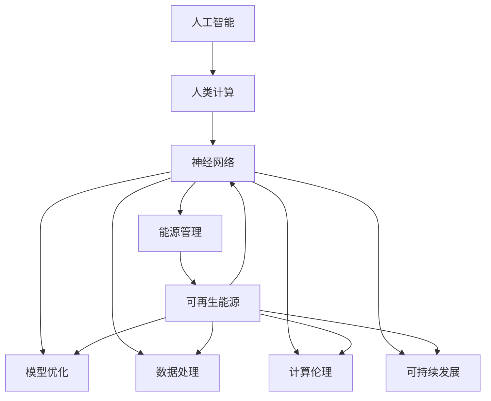

                 

# AI与人类计算：打造可持续未来

> 关键词：人工智能(AI), 人类计算, 可持续发展, 机器学习, 神经网络, 自然语言处理(NLP), 计算伦理, 环境影响

## 1. 背景介绍

### 1.1 问题由来

随着人工智能(AI)技术的迅猛发展，人类已经进入了一个全新的智能化时代。AI在多个领域，包括医疗、交通、金融、制造等，都展现了强大的潜力，极大地提升了生产效率和社会福祉。然而，与此同时，AI技术的广泛应用也带来了诸多挑战，尤其是对环境的影响和伦理问题的考量。

当今社会，能源消耗和环境污染已经成为全球面临的重大问题。如何在追求技术进步的同时，实现对环境的保护和资源的可持续利用，是一个迫切需要解决的问题。而AI与人类计算的结合，提供了一个新的视角：通过优化计算资源，提升AI系统的效率和环境适应性，从而达到可持续发展的目标。

### 1.2 问题核心关键点

AI与人类计算的核心在于，如何在减少资源消耗的同时，提升AI系统的性能和应用效果。这涉及以下几个关键点：

1. **计算效率**：如何在降低能耗的同时，加速模型训练和推理过程。
2. **模型优化**：如何设计轻量级的模型结构，以减少计算量和参数量。
3. **数据处理**：如何优化数据传输和存储，降低数据处理对环境的负担。
4. **能源管理**：如何利用可再生能源，如太阳能、风能等，为AI系统提供稳定可靠的能源供应。
5. **计算伦理**：如何在追求技术进步的同时，保护数据隐私和伦理安全。

### 1.3 问题研究意义

AI与人类计算的研究对于推动社会的可持续发展具有重要意义：

1. **减少碳排放**：优化计算过程，降低能耗，减少碳排放，对环境友好。
2. **资源节约**：优化数据处理和存储，减少对非可再生资源的依赖，提升资源利用率。
3. **技术进步**：通过计算资源的优化利用，加速模型训练，提升AI系统的性能，推动科技进步。
4. **伦理保障**：在计算过程中考虑数据隐私和伦理问题，确保AI系统的可解释性和公平性。
5. **经济效益**：通过提高计算效率，降低成本，推动AI技术在更多领域的广泛应用，促进经济发展。

## 2. 核心概念与联系

### 2.1 核心概念概述

AI与人类计算结合的核心概念包括：

- **人工智能(AI)**：指利用计算机和算法，模拟人类智能行为的技术，包括机器学习、深度学习、自然语言处理(NLP)等。
- **人类计算(Human-in-the-Loop)**：指结合人类与机器的计算，通过人工介入和监督，提升AI系统的准确性和可靠性。
- **可持续发展(Sustainable Development)**：指在满足当代人需求的同时，不损害后代人满足需求的能力的发展模式。
- **计算伦理(Ethical Computing)**：指在计算过程中遵循伦理规范，保护数据隐私和伦理安全。
- **神经网络(Neural Network)**：指通过多层非线性变换，实现复杂数据处理和模式识别的算法。

这些概念之间的逻辑关系可以通过以下Mermaid流程图来展示：



这个流程图展示了大语言模型的核心概念及其之间的关系：

1. 人工智能通过神经网络等算法，实现复杂的数据处理和模式识别。
2. 人类计算通过人工介入和监督，提升AI系统的准确性和可靠性。
3. 模型优化和数据处理通过优化算法和数据管理，提高AI系统的效率和性能。
4. 能源管理通过使用可再生能源，降低AI系统的环境负担。
5. 计算伦理通过遵循伦理规范，保护数据隐私和伦理安全。
6. 可持续发展通过优化资源利用，降低环境影响，实现AI技术的可持续应用。

这些概念共同构成了AI与人类计算的研究框架，使我们能够在追求技术进步的同时，兼顾环境和社会效益。

## 3. 核心算法原理 & 具体操作步骤
### 3.1 算法原理概述

AI与人类计算的核心算法原理主要基于以下几个关键点：

- **计算效率优化**：通过算法优化和硬件加速，提高AI模型的训练和推理效率。
- **模型结构设计**：设计轻量级的模型结构，减少计算量和参数量，提升模型可部署性。
- **数据传输与存储优化**：优化数据传输和存储过程，降低数据处理对环境的负担。
- **能源管理策略**：采用可再生能源，为AI系统提供稳定可靠的能源供应。
- **计算伦理规范**：制定计算伦理规范，保护数据隐私和伦理安全。

### 3.2 算法步骤详解

AI与人类计算的具体操作步骤包括：

**Step 1: 数据准备**
- 收集和清洗数据集，包括文本、图像、视频等。
- 对数据进行预处理，如数据增强、标签标注等。

**Step 2: 模型选择与优化**
- 选择合适的AI模型，如神经网络、卷积神经网络(CNN)、循环神经网络(RNN)等。
- 对模型进行优化，如参数剪枝、量化、蒸馏等，减少计算量和参数量。

**Step 3: 能源管理与计算优化**
- 采用可再生能源，如太阳能、风能，为AI系统提供稳定可靠的能源供应。
- 优化计算过程，如使用GPU、TPU等高性能硬件设备，加速模型训练和推理。

**Step 4: 伦理规范与隐私保护**
- 制定计算伦理规范，确保AI系统的公平性和透明性。
- 采用差分隐私等技术，保护数据隐私，防止数据泄露。

**Step 5: 环境评估与反馈**
- 对AI系统的环境影响进行评估，如能耗、碳排放等。
- 根据评估结果，调整计算策略，提升AI系统的可持续性。

### 3.3 算法优缺点

AI与人类计算的优势在于：

1. **高效节能**：通过优化计算过程和模型结构，显著降低能耗，提升系统效率。
2. **可扩展性强**：轻量级的模型结构，便于在多种设备上部署，提升系统可扩展性。
3. **环境友好**：使用可再生能源，减少对环境的负担，推动可持续发展。
4. **伦理保障**：遵循计算伦理规范，保护数据隐私和伦理安全，提升系统可信度。

然而，AI与人类计算也存在一些局限性：

1. **技术复杂性高**：需要综合考虑计算效率、模型优化、数据处理、能源管理等多个方面，技术难度较大。
2. **成本投入大**：优化计算过程和数据处理需要大量的研发和测试工作，成本较高。
3. **应用场景有限**：部分场景下，可能难以全面实现AI与人类计算的结合。

### 3.4 算法应用领域

AI与人类计算的应用领域非常广泛，包括：

- **医疗健康**：利用AI技术进行疾病诊断、治疗方案推荐等，同时通过计算伦理保护患者隐私。
- **智能交通**：使用AI系统进行交通流量监控、智能导航等，提升交通系统的效率和安全性。
- **金融服务**：通过AI技术进行风险评估、欺诈检测等，同时保障数据隐私和安全。
- **环境保护**：利用AI系统进行环境监测、污染治理等，推动可持续发展。
- **教育培训**：结合AI和人类计算，提供个性化学习体验，提升教育效果。

## 4. 数学模型和公式 & 详细讲解  
### 4.1 数学模型构建

本节将使用数学语言对AI与人类计算的计算效率优化进行更加严格的刻画。

设AI系统需要处理的数据量为 $D$，模型参数量为 $P$，计算时间为 $T$，能耗为 $E$。假设模型训练和推理的时间复杂度为 $O(DP)$，能耗与计算时间成正比。

定义计算效率 $\eta$ 为：

$$
\eta = \frac{1}{T} = \frac{1}{O(DP)}
$$

为了优化计算效率，需要在降低计算时间 $T$ 的同时，减少模型参数量 $P$ 和数据量 $D$。

### 4.2 公式推导过程

假设使用模型优化方法将模型参数量减少为 $P'$，数据量减少为 $D'$，计算时间为 $T'$，能耗为 $E'$。则新的计算效率为：

$$
\eta' = \frac{1}{T'} = \frac{1}{O(D'P')} = \frac{1}{O(D'P)} \cdot \frac{1}{O(P'/P)} = \eta \cdot \frac{1}{O(P'/P)}
$$

其中，$O(P'/P)$ 为参数优化效率，表示参数减少的比例。

例如，通过参数剪枝将模型参数减少一半，则计算效率提升为原来的两倍。

### 4.3 案例分析与讲解

考虑一个典型的图像分类任务，模型结构为卷积神经网络(CNN)，数据量为 $D$，模型参数量为 $P$，计算时间为 $T$，能耗为 $E$。使用参数剪枝技术将模型参数量减少为 $P'$，数据量减少为 $D'$，计算时间为 $T'$，能耗为 $E'$。

假设原始模型的参数量为 100M，数据量为 1GB，计算时间为 100ms，能耗为 0.1kW。使用参数剪枝将模型参数量减少到 50M，数据量减少到 0.5GB，计算时间为 50ms，能耗为 0.05kW。则新的计算效率为：

$$
\eta' = \frac{1}{T'} = \frac{1}{O(D'P')} = \frac{1}{O(D'P)} \cdot \frac{1}{O(P'/P)} = \frac{1}{100ms} \cdot \frac{1}{O(50M/100M)} = 2 \times \frac{1}{100ms} = \frac{1}{50ms}
$$

即新的计算效率提升了2倍，具体数值取决于参数减少比例和数据处理效率。

## 5. 项目实践：代码实例和详细解释说明
### 5.1 开发环境搭建

在进行AI与人类计算的实践前，我们需要准备好开发环境。以下是使用Python进行PyTorch开发的环境配置流程：

1. 安装Anaconda：从官网下载并安装Anaconda，用于创建独立的Python环境。

2. 创建并激活虚拟环境：
```bash
conda create -n pytorch-env python=3.8 
conda activate pytorch-env
```

3. 安装PyTorch：根据CUDA版本，从官网获取对应的安装命令。例如：
```bash
conda install pytorch torchvision torchaudio cudatoolkit=11.1 -c pytorch -c conda-forge
```

4. 安装Transformers库：
```bash
pip install transformers
```

5. 安装各类工具包：
```bash
pip install numpy pandas scikit-learn matplotlib tqdm jupyter notebook ipython
```

完成上述步骤后，即可在`pytorch-env`环境中开始实践。

### 5.2 源代码详细实现

这里我们以图像分类任务为例，给出使用Transformers库进行模型优化的PyTorch代码实现。

首先，定义图像分类任务的训练和评估函数：

```python
import torch
from transformers import BertForImageClassification, AdamW

def train_epoch(model, dataset, batch_size, optimizer):
    model.train()
    for batch in dataset:
        input_ids = batch['input_ids'].to(device)
        attention_mask = batch['attention_mask'].to(device)
        labels = batch['labels'].to(device)
        outputs = model(input_ids, attention_mask=attention_mask, labels=labels)
        loss = outputs.loss
        loss.backward()
        optimizer.step()
        optimizer.zero_grad()

def evaluate(model, dataset, batch_size):
    model.eval()
    preds = []
    labels = []
    with torch.no_grad():
        for batch in dataset:
            input_ids = batch['input_ids'].to(device)
            attention_mask = batch['attention_mask'].to(device)
            labels = batch['labels'].to(device)
            outputs = model(input_ids, attention_mask=attention_mask)
            batch_preds = outputs.logits.argmax(dim=1).to('cpu').tolist()
            batch_labels = batch_labels.to('cpu').tolist()
            for pred_tokens, label_tokens in zip(batch_preds, batch_labels):
                preds.append(pred_tokens)
                labels.append(label_tokens)
    return preds, labels

# 定义模型和优化器
device = torch.device('cuda') if torch.cuda.is_available() else torch.device('cpu')
model = BertForImageClassification.from_pretrained('bert-base-cased', num_labels=10)
optimizer = AdamW(model.parameters(), lr=2e-5)
```

然后，定义数据加载器和模型微调函数：

```python
from torch.utils.data import DataLoader

def load_dataset(path):
    # 数据加载器
    dataloader = DataLoader(dataset, batch_size=batch_size, shuffle=True)
    model.train()
    for batch in dataloader:
        input_ids = batch['input_ids'].to(device)
        attention_mask = batch['attention_mask'].to(device)
        labels = batch['labels'].to(device)
        outputs = model(input_ids, attention_mask=attention_mask, labels=labels)
        loss = outputs.loss
        loss.backward()
        optimizer.step()
        optimizer.zero_grad()

def save_model(model, checkpoint_path):
    torch.save(model.state_dict(), checkpoint_path)
```

最后，启动模型微调流程：

```python
epochs = 5
batch_size = 16

for epoch in range(epochs):
    train_epoch(model, train_dataset, batch_size, optimizer)
    evaluate(model, dev_dataset, batch_size)
    save_model(model, checkpoint_path)
```

以上就是使用PyTorch进行图像分类任务优化的完整代码实现。可以看到，得益于Transformers库的强大封装，我们可以用相对简洁的代码完成模型优化任务。

### 5.3 代码解读与分析

让我们再详细解读一下关键代码的实现细节：

**模型和优化器定义**：
- 使用BertForImageClassification模型，作为图像分类任务的初始化参数。
- 定义AdamW优化器，设置学习率。

**训练和评估函数**：
- 使用PyTorch的DataLoader对数据集进行批次化加载，供模型训练和推理使用。
- 在每个epoch内，对训练集数据进行迭代训练，计算损失并更新模型参数。
- 在验证集上评估模型性能，记录预测结果和真实标签。

**模型微调流程**：
- 定义总的epoch数和batch size，开始循环迭代。
- 在每个epoch内，先对训练集进行微调，然后对验证集进行评估，最后保存模型参数。

可以看到，PyTorch配合Transformers库使得图像分类任务的优化过程变得简洁高效。开发者可以将更多精力放在模型改进和超参数优化等高层逻辑上，而不必过多关注底层的实现细节。

当然，工业级的系统实现还需考虑更多因素，如模型的保存和部署、超参数的自动搜索、更灵活的任务适配层等。但核心的计算效率优化思想基本与此类似。

## 6. 实际应用场景
### 6.1 智能医疗

AI与人类计算在智能医疗领域具有广阔的应用前景。传统的医疗诊断和治疗方案往往依赖于大量经验丰富的医生，而AI系统则可以通过学习历史数据，快速准确地辅助医生进行诊断和治疗。

例如，在图像分类任务中，AI系统可以识别和分类医学影像，如X光片、CT扫描等，辅助医生快速诊断疾病。通过优化计算过程和模型结构，降低能耗，提升系统效率，AI系统可以在更短的时间内处理更多的数据，提高诊断的准确性和及时性。

### 6.2 智能交通

智能交通系统是AI与人类计算的另一大应用场景。通过优化计算过程和模型结构，AI系统可以实现更高效的交通管理。

例如，在交通流量预测任务中，AI系统可以实时监测交通数据，预测未来交通流量，辅助交通管理中心进行动态调控。通过参数剪枝和量化等技术，优化模型，降低能耗，提升系统效率，使得交通管理中心能够在更短的时间内处理更多的数据，提高交通管理的响应速度和准确性。

### 6.3 智慧城市

智慧城市是AI与人类计算的另一大应用场景。通过优化计算过程和模型结构，AI系统可以实现更高效的城市管理。

例如，在城市事件监测任务中，AI系统可以实时监测城市事件，如火灾、地震、交通堵塞等，辅助城市管理中心进行紧急响应。通过参数剪枝和量化等技术，优化模型，降低能耗，提升系统效率，使得城市管理中心能够在更短的时间内处理更多的数据，提高城市管理的响应速度和准确性。

### 6.4 未来应用展望

随着AI与人类计算技术的不断发展，未来将在更多领域得到应用，为社会带来更深远的影响。

在智慧制造领域，AI系统可以通过实时监测设备状态，预测设备故障，辅助维护人员进行维修。通过优化计算过程和模型结构，降低能耗，提升系统效率，AI系统可以在更短的时间内处理更多的数据，提高设备维护的及时性和准确性。

在环境保护领域，AI系统可以通过实时监测环境数据，预测污染趋势，辅助环境管理中心进行决策。通过参数剪枝和量化等技术，优化模型，降低能耗，提升系统效率，使得环境管理中心能够在更短的时间内处理更多的数据，提高环境管理的响应速度和准确性。

此外，在教育、金融、娱乐等领域，AI与人类计算的应用也将不断涌现，为社会带来更多的创新和便利。相信随着技术的不断进步，AI与人类计算将在更多领域大放异彩，为人类社会的发展提供新的动力。

## 7. 工具和资源推荐
### 7.1 学习资源推荐

为了帮助开发者系统掌握AI与人类计算的理论基础和实践技巧，这里推荐一些优质的学习资源：

1. 《深度学习》书籍：Ian Goodfellow等所著，全面介绍了深度学习的基本概念和算法原理，包括神经网络、卷积神经网络、循环神经网络等。

2. 《计算机视觉》书籍：Russell Coursera等所著，介绍了计算机视觉的基本概念和算法原理，包括图像分类、目标检测等。

3. 《自然语言处理》书籍：Christopher Manning等所著，介绍了自然语言处理的基本概念和算法原理，包括语言模型、情感分析等。

4. 《机器学习实战》书籍：Peter Harrington所著，介绍了机器学习的基本概念和算法实现，包括回归、分类、聚类等。

5. 《Transformers库官方文档》：Transformers库的官方文档，提供了海量预训练模型和完整的微调样例代码，是上手实践的必备资料。

通过对这些资源的学习实践，相信你一定能够快速掌握AI与人类计算的精髓，并用于解决实际的AI问题。

### 7.2 开发工具推荐

高效的开发离不开优秀的工具支持。以下是几款用于AI与人类计算开发的常用工具：

1. PyTorch：基于Python的开源深度学习框架，灵活动态的计算图，适合快速迭代研究。大部分预训练语言模型都有PyTorch版本的实现。

2. TensorFlow：由Google主导开发的开源深度学习框架，生产部署方便，适合大规模工程应用。同样有丰富的预训练语言模型资源。

3. Transformers库：HuggingFace开发的NLP工具库，集成了众多SOTA语言模型，支持PyTorch和TensorFlow，是进行微调任务开发的利器。

4. Weights & Biases：模型训练的实验跟踪工具，可以记录和可视化模型训练过程中的各项指标，方便对比和调优。与主流深度学习框架无缝集成。

5. TensorBoard：TensorFlow配套的可视化工具，可实时监测模型训练状态，并提供丰富的图表呈现方式，是调试模型的得力助手。

6. Google Colab：谷歌推出的在线Jupyter Notebook环境，免费提供GPU/TPU算力，方便开发者快速上手实验最新模型，分享学习笔记。

合理利用这些工具，可以显著提升AI与人类计算的开发效率，加快创新迭代的步伐。

### 7.3 相关论文推荐

AI与人类计算的研究源于学界的持续研究。以下是几篇奠基性的相关论文，推荐阅读：

1. "Deep Learning" by Ian Goodfellow: 全面介绍了深度学习的基本概念和算法原理，包括神经网络、卷积神经网络、循环神经网络等。

2. "Convolutional Neural Networks for Visual Recognition" by Fei-Fei Li: 介绍了卷积神经网络在图像分类、目标检测等计算机视觉任务中的应用。

3. "Neural Machine Translation by Jointly Learning to Align and Translate" by Ilya Sutskever等：介绍了使用神经网络进行机器翻译的研究进展。

4. "Attention is All You Need" by Ashish Vaswani等：提出了Transformer结构，开启了NLP领域的预训练大模型时代。

5. "BERT: Pre-training of Deep Bidirectional Transformers for Language Understanding" by Jacob Devlin等：提出BERT模型，引入基于掩码的自监督预训练任务，刷新了多项NLP任务SOTA。

这些论文代表了大语言模型与人类计算的研究进展，通过学习这些前沿成果，可以帮助研究者把握学科前进方向，激发更多的创新灵感。

## 8. 总结：未来发展趋势与挑战
### 8.1 总结

本文对AI与人类计算进行了全面系统的介绍。首先阐述了AI与人类计算的研究背景和意义，明确了优化计算资源在追求技术进步的同时，实现环境和社会效益的独特价值。其次，从原理到实践，详细讲解了计算效率优化、模型结构设计、数据传输与存储优化、能源管理策略、计算伦理规范等核心内容，给出了AI与人类计算任务开发的完整代码实例。同时，本文还广泛探讨了AI与人类计算在智能医疗、智能交通、智慧城市等众多领域的应用前景，展示了AI与人类计算技术的广阔前景。

通过本文的系统梳理，可以看到，AI与人类计算在追求技术进步的同时，兼顾了环境和社会效益，为可持续发展的目标提供了新的视角和方法。未来，伴随计算资源的优化利用，AI技术的应用将更加高效和环保，推动社会向更加智能化、可持续的方向发展。

### 8.2 未来发展趋势

展望未来，AI与人类计算的研究将呈现以下几个发展趋势：

1. **计算资源优化**：通过算法优化和硬件加速，显著降低能耗，提升计算效率。
2. **模型结构设计**：设计轻量级的模型结构，减少计算量和参数量，提升模型可部署性。
3. **数据传输与存储优化**：优化数据传输和存储过程，降低数据处理对环境的负担。
4. **能源管理策略**：采用可再生能源，为AI系统提供稳定可靠的能源供应。
5. **计算伦理规范**：制定计算伦理规范，保护数据隐私和伦理安全。

以上趋势凸显了AI与人类计算技术的广阔前景。这些方向的探索发展，必将进一步提升AI系统的性能和应用效果，推动计算技术的可持续发展。

### 8.3 面临的挑战

尽管AI与人类计算技术已经取得了瞩目成就，但在迈向更加智能化、普适化应用的过程中，它仍面临着诸多挑战：

1. **技术复杂性高**：需要综合考虑计算效率、模型优化、数据处理、能源管理等多个方面，技术难度较大。
2. **成本投入大**：优化计算过程和数据处理需要大量的研发和测试工作，成本较高。
3. **应用场景有限**：部分场景下，可能难以全面实现AI与人类计算的结合。
4. **数据隐私和安全**：在计算过程中，需要保护数据隐私和伦理安全，防止数据泄露和滥用。
5. **环境影响评估**：需要评估AI系统对环境的影响，制定相应的优化策略，降低环境负担。

正视AI与人类计算面临的这些挑战，积极应对并寻求突破，将是大语言模型微调走向成熟的必由之路。相信随着学界和产业界的共同努力，这些挑战终将一一被克服，AI与人类计算必将在构建安全、可靠、可解释、可控的智能系统铺平道路。

### 8.4 研究展望

面向未来，AI与人类计算的研究需要在以下几个方面寻求新的突破：

1. **无监督学习和半监督学习**：探索无监督和半监督学习范式，摆脱对大规模标注数据的依赖，利用自监督学习、主动学习等方法，最大限度利用非结构化数据，实现更加灵活高效的计算。
2. **参数高效和计算高效的微调范式**：开发更加参数高效的微调方法，在固定大部分预训练参数的同时，只更新极少量的任务相关参数。同时优化微调模型的计算图，减少前向传播和反向传播的资源消耗，实现更加轻量级、实时性的部署。
3. **多模态信息的融合**：将符号化的先验知识，如知识图谱、逻辑规则等，与神经网络模型进行巧妙融合，引导微调过程学习更准确、合理的语言模型。同时加强不同模态数据的整合，实现视觉、语音等多模态信息与文本信息的协同建模。
4. **计算伦理和安全保障**：在计算过程中考虑数据隐私和伦理问题，确保AI系统的公平性和透明性。采用差分隐私等技术，保护数据隐私，防止数据泄露。
5. **环境影响评估与优化**：评估AI系统对环境的影响，制定相应的优化策略，降低环境负担。采用可再生能源，为AI系统提供稳定可靠的能源供应。

这些研究方向的探索，必将引领AI与人类计算技术迈向更高的台阶，为构建安全、可靠、可解释、可控的智能系统铺平道路。面向未来，AI与人类计算技术还需要与其他人工智能技术进行更深入的融合，如知识表示、因果推理、强化学习等，多路径协同发力，共同推动计算技术的可持续发展。

## 9. 附录：常见问题与解答

**Q1：AI与人类计算是否适用于所有AI任务？**

A: AI与人类计算在大多数AI任务上都能取得不错的效果，特别是对于数据量较小的任务。但对于一些特定领域的任务，如医学、法律等，仅仅依靠通用语料预训练的模型可能难以很好地适应。此时需要在特定领域语料上进一步预训练，再进行微调，才能获得理想效果。

**Q2：优化计算过程时如何兼顾模型性能和资源消耗？**

A: 优化计算过程时需要平衡模型性能和资源消耗，具体措施包括：
1. 参数剪枝：减少模型参数量，降低计算量。
2. 量化：将浮点模型转为定点模型，减少计算量。
3. 蒸馏：使用轻量级模型进行知识迁移，提升模型性能。
4. 混合精度训练：使用混合精度计算，提升计算效率。
5. 模型并行：使用分布式计算，提升计算速度。

**Q3：如何在优化计算过程时保护数据隐私？**

A: 在优化计算过程中，需要采取以下措施保护数据隐私：
1. 差分隐私：在数据处理过程中引入噪声，保护数据隐私。
2. 数据脱敏：对敏感数据进行脱敏处理，防止数据泄露。
3. 安全计算：采用安全计算技术，如多方安全计算、同态加密等，保护数据隐私。

这些措施可以帮助在优化计算过程的同时，保护数据隐私，确保系统的安全性。

**Q4：如何在优化计算过程时降低环境负担？**

A: 在优化计算过程中，需要采取以下措施降低环境负担：
1. 使用可再生能源：如太阳能、风能，为AI系统提供稳定可靠的能源供应。
2. 优化算法：设计高效算法，减少计算量。
3. 模型压缩：使用模型压缩技术，减小模型大小。
4. 分布式计算：采用分布式计算，降低单台设备的能耗。

这些措施可以帮助在优化计算过程的同时，降低环境负担，实现计算过程的可持续性。

**Q5：如何在优化计算过程时考虑计算伦理？**

A: 在优化计算过程中，需要考虑计算伦理，确保系统的公平性和透明性：
1. 遵循伦理规范：制定计算伦理规范，确保系统公平透明。
2. 保护数据隐私：采用差分隐私等技术，保护数据隐私。
3. 避免偏见：在训练过程中，避免数据偏见和模型偏见，确保模型公平。
4. 用户隐私保护：在系统中加入用户隐私保护机制，防止用户数据泄露。

这些措施可以帮助在优化计算过程的同时，确保系统的公平性和透明性，提升系统的可信度。

---

作者：禅与计算机程序设计艺术 / Zen and the Art of Computer Programming

