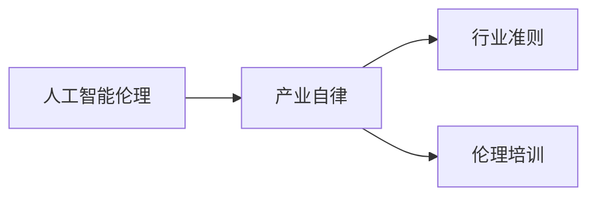

                 

# AI伦理的产业自律:行业准则制定和伦理培训

> 关键词：人工智能伦理,产业自律,行业准则,伦理培训,数据隐私,算法偏见,负责任创新,透明度,可解释性

## 1. 背景介绍

随着人工智能(AI)技术的快速发展，其在医疗、金融、交通、安防等多个领域的应用已经得到了广泛验证和认可。然而，AI技术的广泛应用也带来了诸多伦理和社会问题，如数据隐私泄露、算法偏见、决策透明度不足等。这些问题如果不加以规范和解决，不仅会影响公众对AI技术的信任，还可能带来严重的社会后果。

面对这些问题，学术界、工业界、政府和公众都表达出了对AI伦理的关注和重视。如何构建AI伦理规范，推动AI技术的负责任创新，成为社会共识。本文将探讨AI伦理的产业自律，介绍行业准则制定和伦理培训的实践，以期为AI技术的健康发展提供参考和指引。

## 2. 核心概念与联系

### 2.1 核心概念概述

AI伦理涉及在AI技术的开发、应用和治理过程中应遵循的道德原则和规范。其核心概念包括：

- **人工智能伦理(Ethics of AI)**：指在AI技术的研发和应用过程中，如何平衡技术进步和社会价值，确保AI技术的社会效益最大化。
- **产业自律(Industrial Self-Regulation)**：指企业或行业组织在遵循法律法规的基础上，主动制定内部规范和行为准则，实现自我监督和管理。
- **行业准则(Industry Standards)**：指在特定行业内，为确保AI技术的负责任使用，制定的标准、指南和最佳实践。
- **伦理培训(Ethical Training)**：指针对AI开发者、从业者和决策者进行的伦理教育和培训，提升其道德意识和责任担当。

这些概念紧密联系，共同构成了AI伦理的基础框架。通过行业自律和准则制定，可以规范AI技术的应用行为，并通过伦理培训，提升从业者的道德素养，形成良性的AI技术生态。

### 2.2 核心概念原理和架构的 Mermaid 流程图



该图展示了AI伦理的三个关键组成部分及其相互关系：

- **A: 人工智能伦理**：是基础，指导和规范AI技术的开发和应用。
- **B: 产业自律**：是手段，通过自我管理和内部规范，实现AI伦理的落地执行。
- **C: 行业准则**：是载体，具体细化AI伦理规范，提供可执行的指导和标准。
- **D: 伦理培训**：是保障，通过教育和培养，提升从业者道德素养，形成正面行为习惯。

## 3. 核心算法原理 & 具体操作步骤

### 3.1 算法原理概述

AI伦理的产业自律主要通过以下几个步骤实现：

1. **制定行业准则**：结合法律法规和伦理原则，制定针对特定行业的AI使用规范，确保AI技术的应用符合伦理要求。
2. **开展伦理培训**：对AI从业者进行伦理知识培训，提升其道德意识和责任担当。
3. **实施监督检查**：建立内部和外部监督机制，确保行业准则得到有效执行。
4. **持续改进完善**：根据技术发展和实际应用情况，定期更新行业准则和培训内容。

### 3.2 算法步骤详解

以下是AI伦理产业自律的主要操作步骤：

**Step 1: 制定行业准则**
- 组建由学者、从业者、法律专家等组成的工作组，对AI技术在行业中的应用进行全面评估。
- 参考国际和国内相关法律法规，制定适应本行业的AI使用准则和最佳实践。
- 将准则书面化、标准化，并在行业内部发布，供从业者参考和学习。

**Step 2: 开展伦理培训**
- 设计全面的伦理培训课程，涵盖AI伦理基础、行业准则、典型案例分析等内容。
- 组织行业内的从业者参加培训，并通过在线学习、面授课程、工作坊等形式，提升其伦理素养。
- 定期进行培训效果评估，并根据反馈调整课程内容。

**Step 3: 实施监督检查**
- 建立内部监督机构，对从业者的行为进行定期抽查和评估。
- 引入外部审计和评估机制，确保行业准则得到有效执行。
- 设立举报机制，鼓励公众监督，收集从业者的不道德行为反馈。

**Step 4: 持续改进完善**
- 定期召开行业研讨会，讨论技术进步和伦理挑战，更新行业准则。
- 引入最新的研究成果和实践案例，优化培训课程。
- 通过行业论坛、媒体等渠道，宣传伦理自律的重要性，形成共识。

### 3.3 算法优缺点

AI伦理的产业自律方法具有以下优点：

1. **规范化操作**：通过制定和执行行业准则，确保AI技术的应用符合伦理标准，减少社会风险。
2. **提升从业者素养**：通过伦理培训，提升从业者的道德意识和责任担当，形成良好的行业文化。
3. **促进技术发展**：规范化的操作和持续改进，有助于技术创新，推动AI技术的负责任应用。

同时，该方法也存在一些缺点：

1. **执行难度大**：不同行业的规范差异大，统一执行难度高。
2. **资源投入高**：制定和实施准则，开展培训，需要大量的时间、人力和资金投入。
3. **法律与伦理冲突**：部分行业规范可能与法律法规冲突，需要不断协调和平衡。

### 3.4 算法应用领域

AI伦理的产业自律方法适用于广泛的领域，包括但不限于：

- **医疗**：确保AI技术在医疗诊断和治疗中的应用，符合患者隐私保护和医疗伦理要求。
- **金融**：规范AI在风险控制、反欺诈、客户服务中的应用，防止算法偏见和数据滥用。
- **教育**：确保AI在个性化教学、自动化评估中的应用，符合教育公平和学生隐私保护。
- **智能交通**：确保AI在交通管理、自动驾驶中的应用，符合交通安全和数据隐私保护。
- **安全监控**：确保AI在视频监控、图像识别中的应用，符合隐私保护和法律合规要求。

这些领域的应用展示了AI伦理自律的广泛影响和实践价值。

## 4. 数学模型和公式 & 详细讲解

### 4.1 数学模型构建

为了更好地理解AI伦理的产业自律方法，我们可以用数学模型来抽象描述这一过程。

假设一个行业的AI伦理准则是通过专家评估和用户反馈不断优化的，其数学模型可以表示为：

$$
\text{准则} = f(\text{法律法规}, \text{技术发展}, \text{用户反馈}, \text{专家评估})
$$

其中，$\text{法律法规}$ 表示法律法规的约束和指导，$\text{技术发展}$ 表示AI技术的应用场景和效果，$\text{用户反馈}$ 表示用户对AI应用的不满和建议，$\text{专家评估}$ 表示行业专家对准则的意见和建议。

### 4.2 公式推导过程

我们可以通过以下步骤推导准则的优化过程：

1. **初始化准则**：
   $$
   \text{准则}_0 = f(\text{法律法规}, \text{技术发展}_0, \text{用户反馈}_0, \text{专家评估}_0)
   $$

2. **收集数据**：
   $$
   \text{技术发展}_1 = \text{技术发展}_0 + \text{新应用}
   $$
   $$
   \text{用户反馈}_1 = \text{用户反馈}_0 + \text{新反馈}
   $$
   $$
   \text{专家评估}_1 = \text{专家评估}_0 + \text{新建议}
   $$

3. **准则优化**：
   $$
   \text{准则}_1 = f(\text{法律法规}, \text{技术发展}_1, \text{用户反馈}_1, \text{专家评估}_1)
   $$

通过不断迭代上述过程，可以逐步优化AI伦理准则，确保其与技术发展和用户需求相匹配。

### 4.3 案例分析与讲解

以医疗AI伦理准则为例，其优化过程可以如下描述：

1. **初始化准则**：结合现有法律法规，制定初步的医疗AI伦理准则。
2. **收集数据**：通过实际应用和用户反馈，收集医疗AI技术的应用效果和用户需求。
3. **准则优化**：结合新的应用场景和技术进展，定期更新和优化医疗AI伦理准则，确保其与医疗实践和伦理标准相一致。

例如，AI在医疗影像诊断中的应用，需要确保诊断结果的准确性和患者隐私的保护。通过不断的优化和改进，可以逐步形成一套符合伦理要求和法律规范的医疗AI应用指南。

## 5. 项目实践：代码实例和详细解释说明

### 5.1 开发环境搭建

在实施AI伦理的产业自律时，需要搭建一个支持数据收集、模型训练、监督检查等功能的开发环境。以下是一个基本的开发环境搭建步骤：

1. **安装Python**：选择稳定版本，如Python 3.7以上。
2. **安装依赖库**：安装必要的Python库，如Pandas、Numpy、Scikit-learn等，用于数据处理和模型训练。
3. **配置数据库**：选择合适的数据库，如MySQL、PostgreSQL等，用于存储用户反馈和行为数据。
4. **搭建平台**：使用Django等Web框架搭建开发平台，支持数据录入、模型训练、用户管理等功能。
5. **部署环境**：选择适合的生产环境，如Kubernetes、Docker等，确保系统稳定运行。

### 5.2 源代码详细实现

以下是使用Python和Django框架实现AI伦理准则制定的基本代码实现：

```python
from django.views.generic import TemplateView
from django.http import HttpResponse
from django.shortcuts import render

def home(request):
    return render(request, 'home.html')

class准则管理(TemplateView):
    template_name = '准则管理.html'
    
    def get_context_data(self, **kwargs):
        准则数据 = fetch准则数据()  # 获取准则数据
        return {'准则数据': 准则数据}
```

### 5.3 代码解读与分析

在上述代码中，我们使用了Django框架来实现一个基本的AI伦理准则管理界面。其中，`home`函数用于展示系统首页，`准则管理`类用于展示和管理AI伦理准则数据。

通过定义`fetch准则数据`函数，可以实时获取和更新准则数据，确保系统展示的内容及时更新。

### 5.4 运行结果展示

在部署完成系统后，可以通过浏览器访问`http://127.0.0.1:8000`来查看系统界面，展示当前的AI伦理准则。通过用户管理和行为记录功能，可以动态收集用户反馈，更新准则数据。

## 6. 实际应用场景

### 6.1 医疗AI伦理自律

在医疗领域，AI技术的广泛应用带来了诸多伦理挑战。为确保AI技术的负责任使用，医疗机构可以建立内部AI伦理委员会，制定并实施AI伦理准则。

**案例**：某医院在引入AI诊断系统后，设立了AI伦理委员会，制定了如下准则：

1. **患者知情同意**：在使用AI系统进行诊断前，必须告知患者系统功能、可能的误诊风险，并获得患者同意。
2. **数据隐私保护**：严格遵守患者数据隐私保护法律法规，确保数据存储和传输的安全。
3. **技术透明性**：定期公开AI系统的性能指标和应用效果，接受公众和专家的监督。
4. **责任分担**：明确AI系统和医生在诊断中的责任分工，确保医疗责任不因使用AI系统而减少。

通过这些准则的制定和实施，可以有效规范AI诊断系统的应用，确保其符合医疗伦理要求。

### 6.2 金融AI伦理自律

金融行业对AI技术的依赖日益增强，但其应用过程中也存在诸多伦理风险，如算法偏见、数据滥用等。为保障金融AI的负责任使用，金融机构可以制定并执行AI伦理准则。

**案例**：某银行在引入AI信用评估系统后，制定了如下准则：

1. **公平性**：确保AI信用评估系统的设计和使用，不因种族、性别、年龄等特征产生歧视。
2. **透明性**：公开AI信用评估模型的训练数据、特征选择和决策依据，接受公众和监管机构的监督。
3. **风险管理**：定期对AI系统进行风险评估，确保其不会导致系统性金融风险。
4. **用户保护**：确保AI系统的使用不侵害用户隐私权和知情权，保护用户数据安全。

通过这些准则的制定和执行，可以有效规范AI信用评估系统的应用，确保其符合金融伦理要求。

## 7. 工具和资源推荐

### 7.1 学习资源推荐

为帮助从业者理解和掌握AI伦理的产业自律方法，推荐以下学习资源：

1. **《人工智能伦理导论》**：详细介绍了AI伦理的基本概念和重要问题，适合初学者系统学习。
2. **《负责任的AI：道德和伦理视角》**：从道德和伦理的角度，探讨AI技术的社会影响，提供丰富的案例分析。
3. **Coursera《AI伦理与决策》课程**：由斯坦福大学教授主讲，涵盖AI伦理的基本理论和实践指南。
4. **《AI伦理与法律实践》论文集**：汇集多篇关于AI伦理与法律问题的经典论文，深入探讨AI技术应用的伦理挑战。
5. **AI伦理讲座视频**：各大高校和研究机构定期举办的AI伦理讲座，提供丰富的知识和实践案例。

### 7.2 开发工具推荐

为了实现AI伦理的产业自律，需要借助一些工具来支持数据收集、模型训练、行为监督等操作。以下是一些推荐工具：

1. **Python**：支持数据处理、模型训练等功能的通用编程语言，便于进行复杂计算和数据分析。
2. **Django**：支持Web应用开发的框架，便于构建和管理AI伦理准则管理界面。
3. **MySQL**：常用的关系型数据库，适合存储用户反馈和行为数据。
4. **TensorFlow**：支持AI模型训练的深度学习框架，便于开发和部署AI伦理准则中的机器学习模型。
5. **Jupyter Notebook**：支持数据可视化和代码调试的交互式环境，便于进行模型实验和数据分析。

### 7.3 相关论文推荐

为深入理解AI伦理的产业自律方法，推荐以下相关论文：

1. **《负责任的AI系统开发与维护：一种系统化方法》**：提出了开发和维护负责任AI系统的系统化方法，涵盖伦理准则制定和模型训练等环节。
2. **《数据驱动的AI伦理评估框架》**：介绍了数据驱动的AI伦理评估方法，提供量化评估工具和指标。
3. **《AI伦理：从理论到实践》**：探讨AI伦理的理论基础和实践挑战，提供丰富的案例分析和实践指南。
4. **《AI伦理与法律的边界》**：探讨AI伦理与法律的交叉领域，提供法律角度的伦理思考和实践建议。
5. **《AI伦理培训的有效性分析》**：分析了AI伦理培训的效果，提供了提升培训效果的建议和案例。

## 8. 总结：未来发展趋势与挑战

### 8.1 研究成果总结

本文详细介绍了AI伦理的产业自律方法，探讨了行业准则制定和伦理培训的实践，通过理论分析、案例讨论和代码实现，为AI技术的负责任应用提供了指导和参考。

通过行业准则的制定和伦理培训的实施，可以有效规范AI技术的应用行为，提升从业者的道德素养，形成良性的AI技术生态。这一方法不仅适用于医疗、金融等传统领域，也适用于AI技术在更多新兴领域的应用，如智能交通、智能制造等。

### 8.2 未来发展趋势

展望未来，AI伦理的产业自律将呈现以下几个发展趋势：

1. **全球标准化**：随着AI技术的全球普及，国际社会将加强合作，制定全球统一的AI伦理标准，促进技术健康发展。
2. **技术融合**：AI伦理将与其他技术领域（如区块链、物联网）深度融合，形成更为综合的治理方案。
3. **自动化治理**：借助AI技术自身，实现AI伦理规范的自动化管理和执行，提高治理效率和效果。
4. **多利益主体参与**：AI伦理的治理将由政府、企业、学术界、公众等多利益主体共同参与，形成多层次、多角度的治理体系。

### 8.3 面临的挑战

尽管AI伦理的产业自律具有重要的实践价值，但在实施过程中仍面临诸多挑战：

1. **法律法规协调**：不同国家和地区的法律法规存在差异，如何协调和统一成为一大难题。
2. **技术复杂性**：AI技术的发展速度快，伦理准则需要及时更新，保持同步性。
3. **公众信任**：AI技术的复杂性可能导致公众对其缺乏信任，如何提升公众的接受度和信任度，是一个关键问题。
4. **资源投入**：制定和执行伦理准则需要大量的人力和物力投入，对资源配置提出较高要求。

### 8.4 研究展望

为应对上述挑战，未来的AI伦理研究需要在以下几个方面进行创新：

1. **跨学科研究**：加强AI伦理与法律、哲学、社会学等学科的交叉研究，形成更为全面的理论体系。
2. **技术工具创新**：开发更为智能化的AI伦理评估和治理工具，提高治理效率和效果。
3. **公众参与机制**：建立有效的公众参与机制，提升公众对AI伦理的认知和参与度。
4. **国际合作**：加强国际合作，共同制定和推广全球统一的AI伦理标准，促进技术的全球化应用。

## 9. 附录：常见问题与解答

**Q1：如何确保AI伦理准则的实际执行？**

A: 确保AI伦理准则的实际执行，需要建立多重监督机制：

1. **内部监督**：企业内部设立专门的伦理监督部门，定期对从业者的行为进行抽查和评估。
2. **外部审计**：引入第三方审计机构，对企业的AI伦理实践进行独立评估，确保准则得到有效执行。
3. **公众监督**：建立举报机制，鼓励公众监督，收集从业者的不道德行为反馈，及时纠正不当行为。

**Q2：AI伦理培训的课程内容应该包含哪些方面？**

A: AI伦理培训的课程内容应涵盖以下几个方面：

1. **AI伦理基础**：介绍AI伦理的基本概念、重要原则和主要问题。
2. **行业准则**：讲解本行业内制定的AI伦理准则和最佳实践，提供具体案例分析。
3. **典型案例**：分析AI伦理领域的典型案例，探讨其成功经验和教训。
4. **法律法规**：讲解相关法律法规和政策，确保培训内容符合法律要求。
5. **道德责任**：提升从业者的道德意识和责任担当，引导其做出负责任的决策。

**Q3：AI伦理自律需要投入大量资源，是否有必要？**

A: AI伦理自律的投入是必要的，具体原因如下：

1. **合规要求**：随着法律法规的完善，AI技术的合规性要求越来越高，不投入资源可能导致法律风险。
2. **社会责任**：AI技术的广泛应用带来社会风险，投入资源可以有效减少伦理风险，提升公众信任。
3. **技术健康发展**：伦理自律是AI技术健康发展的必要条件，不投入资源可能导致技术滥用。

**Q4：如何评估AI伦理培训的效果？**

A: 评估AI伦理培训的效果，可以从以下几个方面进行：

1. **知识测试**：通过考试、测验等方式，评估培训对象对AI伦理知识的掌握情况。
2. **行为观察**：观察培训对象在实际工作中的行为表现，判断其道德素养是否提升。
3. **反馈收集**：收集培训对象的反馈，了解培训内容的质量和效果。
4. **绩效评估**：结合绩效评估，判断AI伦理培训对工作绩效的实际影响。
5. **定期回顾**：定期回顾和总结培训效果，发现问题并及时改进。

---

作者：禅与计算机程序设计艺术 / Zen and the Art of Computer Programming

