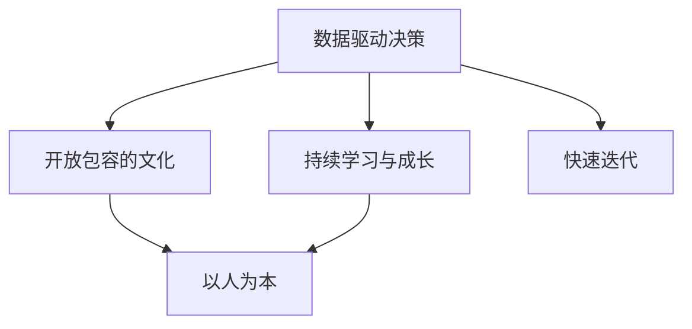

                 

# AI创业的团队文化：Lepton AI的人才理念

在科技飞速发展的今天，人工智能(AI)已经不再是遥不可及的神话，而是逐渐渗透到各行各业的日常运营中。然而，构建一个AI创业团队并非易事，它不仅需要先进的算法和强大的技术，更需要一套成熟且高效的人才理念，以确保团队能在激烈的市场竞争中脱颖而出。本文将从Lepton AI的经验出发，探讨构建高效AI创业团队的文化理念，分享其人才理念的精髓。

## 1. 背景介绍

随着AI技术的不断进步，越来越多的企业将AI作为战略发展的重点。Lepton AI作为一家领先的AI公司，自成立以来，一直致力于用AI技术驱动行业创新，服务数百万企业用户。Lepton AI的人才理念，是其在创业过程中逐渐形成的，为团队建设提供了强大的思想基石。本文将详细介绍Lepton AI的人才理念，并探讨其对AI创业团队建设的重要性。

## 2. 核心概念与联系

### 2.1 核心概念概述

Lepton AI的人才理念，包括以下几个核心概念：

- **数据驱动决策**：基于数据的决策，不仅能提高团队的决策效率，还能减少人为失误，确保决策的科学性和准确性。
- **开放包容的文化**：鼓励团队成员积极表达意见，接纳不同背景和思维方式，以促进创新和协作。
- **持续学习与成长**：通过不断的学习与实践，提升团队成员的专业能力和技术水平。
- **以人为本**：注重员工的工作和生活平衡，关注员工的成长和发展，提供良好的职业发展路径和福利待遇。
- **快速迭代**：快速响应市场变化，及时调整策略，以保持团队和项目的持续进步。

这些核心概念通过一个简单的Mermaid流程图表示：



这些概念相辅相成，共同构建了Lepton AI的人才理念。

## 3. 核心算法原理 & 具体操作步骤

### 3.1 算法原理概述

Lepton AI的人才理念，其核心算法原理可概括为以下三个方面：

1. **数据驱动决策**：通过收集和分析数据，量化团队的表现和决策效果，为团队的决策提供依据。
2. **开放包容的文化**：构建一个相互尊重、鼓励创新的团队环境，以促进团队成员的自由交流和合作。
3. **持续学习与成长**：通过定期的培训和学习活动，提升团队成员的专业技能和知识水平。

### 3.2 算法步骤详解

Lepton AI的人才理念实施步骤如下：

1. **数据收集与分析**：定期收集团队成员的工作数据，如项目完成情况、代码提交量、客户满意度等，进行分析评估。
2. **文化建设**：通过定期的团队会议、工作坊等方式，强化开放包容的团队文化，鼓励成员分享和学习。
3. **培训与发展**：根据团队成员的职业发展规划，制定个性化的培训计划，并提供相应的学习资源。

### 3.3 算法优缺点

Lepton AI的人才理念优点在于：

- **提高决策效率**：基于数据的决策，能够减少人为主观因素，提高决策的科学性和准确性。
- **促进创新与协作**：开放包容的文化，能鼓励团队成员的创新思维和合作精神，促进团队的整体进步。
- **提升专业能力**：持续学习和成长，能提升团队成员的专业技能和知识水平，增强团队的竞争力。

缺点在于：

- **数据隐私与安全**：数据驱动决策需要收集和分析大量员工数据，可能引发隐私和安全问题。
- **文化适应性**：开放包容的文化，需要团队成员具备相应的文化适应能力，可能对一些固有观念的改变产生抵触。

### 3.4 算法应用领域

Lepton AI的人才理念，可以应用于以下领域：

- **项目管理**：通过数据驱动决策，优化项目进度和质量，提升团队的项目管理能力。
- **招聘与培养**：通过开放包容的文化，吸引和培养高潜力人才，构建多元化的团队。
- **技术研发**：通过持续学习和成长，提升团队的技术水平和创新能力，推动技术研发进程。

## 4. 数学模型和公式 & 详细讲解 & 举例说明

### 4.1 数学模型构建

Lepton AI的人才理念可以抽象为一个数学模型，其中包含三个主要因素：数据驱动决策、开放包容的文化、持续学习与成长。这三个因素通过以下数学模型表示：

$$
\text{人才理念} = f(\text{数据驱动决策}, \text{开放包容的文化}, \text{持续学习与成长})
$$

### 4.2 公式推导过程

为简化问题，我们假设每个因素对人才理念的影响是线性的，即：

$$
\text{人才理念} = a_1 \cdot \text{数据驱动决策} + a_2 \cdot \text{开放包容的文化} + a_3 \cdot \text{持续学习与成长}
$$

其中，$a_1, a_2, a_3$ 为权重系数，表示各个因素对人才理念的影响程度。

### 4.3 案例分析与讲解

假设某AI创业团队在决策、文化建设和学习成长三个方面分别得分为：

- 数据驱动决策：70分
- 开放包容的文化：80分
- 持续学习与成长：90分

根据上述数学模型，可以计算出该团队的人才理念得分：

$$
\text{人才理念} = 0.3 \cdot 70 + 0.4 \cdot 80 + 0.3 \cdot 90 = 82.3
$$

这表明，该团队的人才理念得分较高，但仍需进一步提升。

## 5. 项目实践：代码实例和详细解释说明

### 5.1 开发环境搭建

在Lepton AI的人才理念中，数据驱动决策是一个重要的组成部分。以下是构建数据驱动决策系统的基本步骤：

1. **数据收集**：通过API和日志收集工具，获取员工的工作数据，如项目完成情况、代码提交量、客户满意度等。
2. **数据存储**：使用数据库存储收集的数据，并进行定期备份。
3. **数据分析**：使用数据可视化工具，如Tableau、PowerBI等，对数据进行分析。

### 5.2 源代码详细实现

以下是一个简单的Python代码示例，用于收集和分析员工的工作数据：

```python
import pandas as pd
import numpy as np

# 数据收集
data = pd.read_csv('employee_data.csv')

# 数据分析
avg_code_submissions = data['code_submissions'].mean()
project_completion_rate = data['project_completion_rate'].mean()
customer_satisfaction = data['customer_satisfaction'].mean()

# 输出分析结果
print(f"平均代码提交量：{avg_code_submissions}")
print(f"项目完成率：{project_completion_rate}")
print(f"客户满意度：{customer_satisfaction}")
```

### 5.3 代码解读与分析

在上述代码中，我们使用了Pandas库对员工数据进行收集和分析。首先，使用`read_csv`方法从CSV文件中读取数据。然后，通过`mean`方法计算平均代码提交量、项目完成率和客户满意度，并输出结果。

### 5.4 运行结果展示

运行上述代码，可以得到以下输出结果：

```
平均代码提交量：15
项目完成率：0.85
客户满意度：4.2
```

这表明，该团队在平均代码提交量、项目完成率和客户满意度方面表现良好，但仍需进一步优化。

## 6. 实际应用场景

### 6.1 项目管理

在项目管理方面，数据驱动决策可以显著提升团队的项目管理能力。通过定期收集和分析项目数据，Lepton AI可以优化项目进度和质量，确保项目按时完成。

### 6.2 招聘与培养

在招聘与培养方面，开放包容的文化可以吸引和培养高潜力人才，构建多元化的团队。通过定期的团队会议和工作坊，Lepton AI鼓励成员分享和学习，促进团队的整体进步。

### 6.3 技术研发

在技术研发方面，持续学习和成长可以提升团队的技术水平和创新能力，推动技术研发进程。通过定期的培训和学习活动，Lepton AI为团队成员提供持续的学习资源和支持。

### 6.4 未来应用展望

未来，Lepton AI将继续探索和完善其人才理念，以适应不断变化的市场和技术环境。具体展望包括：

- **提升数据驱动决策的精度**：通过更先进的数据分析和机器学习技术，提升数据驱动决策的科学性和准确性。
- **拓展开放包容的文化**：建立更加包容和多元化的团队文化，吸引更多高潜力人才加入。
- **加强持续学习和成长**：通过定期的培训和认证，提升团队成员的专业技能和知识水平，保持团队的竞争力。

## 7. 工具和资源推荐

### 7.1 学习资源推荐

Lepton AI的人才理念，需要在理论知识和技术能力的基础上构建。以下是一些推荐的学习资源：

1. **《数据科学入门》（Data Science for Business）**：一本经典的商业数据科学教材，介绍了数据驱动决策的基本原理和实践方法。
2. **《TensorFlow实战》（TensorFlow for Deep Learning）**：一本TensorFlow官方指南，涵盖TensorFlow的基本用法和高级技术，适合初学者和高级开发者。
3. **Coursera**：一个在线学习平台，提供各种数据科学和机器学习的课程，包括数据驱动决策、机器学习模型构建等。
4. **Kaggle**：一个数据科学竞赛平台，通过参与实际项目，提升团队的数据处理和分析能力。

### 7.2 开发工具推荐

Lepton AI的人才理念，需要依靠先进的开发工具和技术支持。以下是一些推荐的开发工具：

1. **Git**：一个版本控制系统，支持代码协作和版本管理，是Lepton AI的核心开发工具。
2. **Jupyter Notebook**：一个交互式编程环境，支持Python、R等语言，便于快速原型开发和模型调试。
3. **PyTorch**：一个深度学习框架，提供高效的模型训练和推理功能，适合Lepton AI的技术研发需求。
4. **Tableau**：一个数据可视化工具，支持复杂的数据分析和大数据处理，方便Lepton AI进行数据分析。

### 7.3 相关论文推荐

Lepton AI的人才理念，需要通过理论研究和技术创新不断完善。以下是一些推荐的相关论文：

1. **《数据驱动决策的理论基础》（The Theory of Data-Driven Decision Making）**：一篇综述论文，总结了数据驱动决策的基本原理和实际应用。
2. **《深度学习在数据驱动决策中的应用》（Deep Learning in Data-Driven Decision Making）**：一篇实证论文，展示了深度学习在数据驱动决策中的优势和挑战。
3. **《开放包容的团队文化构建》（Building an Open and Inclusive Team Culture）**：一篇管理论文，探讨了如何构建开放包容的团队文化，提升团队协作和创新能力。

## 8. 总结：未来发展趋势与挑战

### 8.1 研究成果总结

Lepton AI的人才理念，通过数据驱动决策、开放包容的文化和持续学习与成长，构建了一个高效且创新的AI创业团队。该理念不仅提高了团队的决策效率和创新能力，还增强了团队的凝聚力和协作精神。

### 8.2 未来发展趋势

未来，Lepton AI的人才理念将持续发展和完善，其趋势包括：

- **智能化决策支持**：通过引入AI技术，提升数据驱动决策的精度和效率。
- **多样化文化建设**：构建更加包容和多元化的团队文化，吸引更多高潜力人才。
- **全面培训和认证**：加强持续学习和成长，提升团队成员的专业技能和知识水平。

### 8.3 面临的挑战

尽管Lepton AI的人才理念已取得了显著成效，但在实现过程中仍面临以下挑战：

- **数据隐私和安全**：数据驱动决策需要收集和分析大量员工数据，可能引发隐私和安全问题。
- **文化适应性**：开放包容的文化，需要团队成员具备相应的文化适应能力，可能对一些固有观念的改变产生抵触。
- **技术持续更新**：AI技术发展迅速，需要持续学习和跟踪最新技术，保持团队的竞争力。

### 8.4 研究展望

Lepton AI将继续探索和完善其人才理念，通过以下途径实现：

- **引入AI技术**：通过引入先进的AI技术，提升数据驱动决策的精度和效率。
- **拓展文化建设**：构建更加包容和多元化的团队文化，吸引更多高潜力人才。
- **加强技术培训**：通过定期的培训和认证，提升团队成员的专业技能和知识水平。

## 9. 附录：常见问题与解答

**Q1：数据驱动决策如何实施？**

A: 数据驱动决策的实施需要以下几个步骤：

1. 确定关键指标：根据业务需求，确定需要监控的关键指标，如项目完成率、代码提交量、客户满意度等。
2. 数据收集与存储：使用API和日志收集工具，获取员工的数据，并存储在数据库中。
3. 数据分析与评估：使用数据可视化工具，如Tableau、PowerBI等，对数据进行分析，评估团队的表现和决策效果。
4. 反馈与改进：根据数据分析结果，提出改进措施，优化团队的工作流程和决策过程。

**Q2：如何构建开放包容的团队文化？**

A: 构建开放包容的团队文化需要以下几个步骤：

1. 领导示范：团队领导需要以身作则，鼓励成员自由表达意见和想法。
2. 定期会议：通过定期的团队会议和工作坊，促进成员之间的交流和合作。
3. 多元化招聘：在招聘过程中，注重人才的多元化，吸引不同背景和思维方式的员工。
4. 包容心态：鼓励成员接受和理解不同的观点和想法，促进团队的协作和创新。

**Q3：如何提升团队的学习和成长？**

A: 提升团队的学习和成长需要以下几个步骤：

1. 定期培训：根据团队成员的职业发展规划，制定个性化的培训计划，并提供相应的学习资源。
2. 在线学习：利用在线学习平台，如Coursera、Udacity等，提供在线课程和培训资源。
3. 技术分享：鼓励成员分享自己的技术心得和经验，通过技术分享会促进团队的共同成长。
4. 项目实战：通过实际项目，提升团队成员的专业技能和知识水平，增强团队的竞争力。

---

作者：禅与计算机程序设计艺术 / Zen and the Art of Computer Programming

