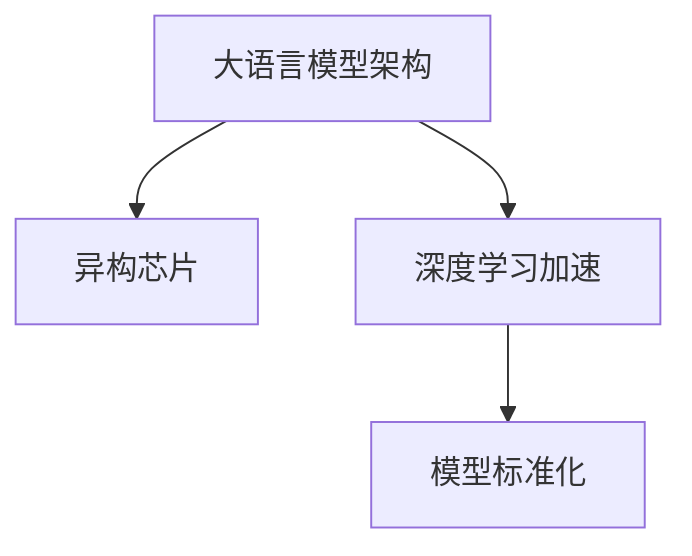

                 

# AI加速的曙光：贾扬清的乐观展望，异构芯片与大语言模型架构的标准化

> 关键词：
1. 大语言模型架构
2. 异构芯片
3. 深度学习加速
4. 模型标准化
5. 计算机视觉
6. 自然语言处理
7. 未来技术趋势

## 1. 背景介绍

随着人工智能技术的迅猛发展，深度学习已成为推动AI进步的核心动力之一。然而，深度学习模型尤其是大语言模型（Large Language Model, LLM）对计算资源的需求越来越大，传统的计算平台（如CPU和GPU）已难以满足其高性能需求。在此背景下，异构芯片（如TPU、FPGA等）应运而生，成为新一代AI计算的重要基石。

贾扬清教授，作为深度学习和计算机视觉领域的国际知名专家，近年来在推动大语言模型架构的标准化和异构芯片应用方面做出了重要贡献。他的研究成果不仅促进了深度学习模型的高效运行，也推动了AI技术的广泛应用。

本文将基于贾扬清教授的乐观展望，深入探讨异构芯片与大语言模型架构标准化的技术路径，结合实际应用场景和最新研究成果，为AI加速技术的发展提供新思路。

## 2. 核心概念与联系

### 2.1 核心概念概述

**大语言模型架构**：指基于深度神经网络的大规模预训练语言模型，如BERT、GPT等，具备强大的自然语言理解与生成能力。其核心在于模型规模、网络结构、训练策略等方面的优化，以提升模型的语言表示能力。

**异构芯片**：指基于不同架构（如CPU、GPU、TPU、FPGA等）设计的特殊处理器，能够高效处理深度学习任务，特别是在并行计算、向量运算等方面具有显著优势。

**深度学习加速**：指通过异构芯片等硬件设备，加速深度学习模型的训练和推理过程，从而提升AI系统的性能和效率。

**模型标准化**：指在大语言模型架构和训练过程中，通过统一的协议、标准和工具，实现模型性能的可比性、可复现性和可扩展性，推动AI技术的规模化和工程化应用。

这些核心概念之间相互关联，共同构成深度学习技术发展的基石。大语言模型通过异构芯片进行高效训练和推理，其架构的标准化则通过模型标准化措施得到提升。

### 2.2 核心概念原理和架构的 Mermaid 流程图



这个流程图展示了大语言模型架构、异构芯片与深度学习加速、模型标准化之间的逻辑关系：

1. 大语言模型架构通过异构芯片进行加速，提升模型的训练和推理效率。
2. 异构芯片和模型架构的优化促进了深度学习加速技术的发展。
3. 模型标准化措施在大语言模型架构和加速技术的基础上，提升模型的可扩展性和工程化应用能力。

## 3. 核心算法原理 & 具体操作步骤

### 3.1 算法原理概述

大语言模型架构的标准化和异构芯片的应用，涉及到深度学习模型的构建、训练、推理等多个环节。其核心算法原理主要包括：

1. **模型构建**：设计并实现基于异构芯片的大语言模型架构，如BERT、GPT等。
2. **训练优化**：采用高效的训练算法和优化策略，提升模型的收敛速度和性能。
3. **推理加速**：利用异构芯片的高效并行计算能力，加速模型的推理过程。
4. **模型标准化**：通过统一的标准和工具，实现模型性能的可比性和可复现性。

### 3.2 算法步骤详解

**步骤一：模型构建**

在模型构建阶段，需要选择合适的异构芯片架构，并设计合适的深度学习模型。以BERT为例，其构建步骤如下：

1. 选择合适的异构芯片（如TPU）。
2. 设计BERT模型的网络结构和训练策略。
3. 使用深度学习框架（如TensorFlow、PyTorch）实现BERT模型。

**步骤二：训练优化**

在训练阶段，需要选择合适的训练算法和优化策略，以提升模型的收敛速度和性能。以GPT为例，其训练优化步骤如下：

1. 选择合适的训练算法（如AdamW、SGD等）。
2. 设置合适的学习率和训练轮数。
3. 应用正则化技术（如L2正则、Dropout等），避免过拟合。
4. 使用数据增强技术（如数据重采样、数据扩充等），提升模型泛化能力。

**步骤三：推理加速**

在推理阶段，需要利用异构芯片的高效计算能力，加速模型的推理过程。以BERT为例，其推理加速步骤如下：

1. 将模型部署到异构芯片（如TPU）上。
2. 优化推理计算图，提升推理效率。
3. 利用分布式计算，提升推理性能。

**步骤四：模型标准化**

在模型标准化阶段，需要选择合适的标准和工具，提升模型的可比性和可复现性。以BERT为例，其标准化步骤如下：

1. 使用统一的数据集和评估指标，进行模型性能对比。
2. 使用统一的工具和协议，进行模型复现和部署。
3. 建立模型文档和规范，确保模型透明和可解释性。

### 3.3 算法优缺点

**优点**：

1. 提升模型性能：异构芯片的高效计算能力能够显著提升模型的训练和推理效率，加速模型收敛。
2. 降低计算成本：异构芯片能降低对CPU和GPU等昂贵硬件的需求，降低计算成本。
3. 模型标准化：通过统一的标准和工具，提升模型性能的可比性和可复现性，推动AI技术的工程化应用。

**缺点**：

1. 硬件复杂性：异构芯片的设计和优化复杂，需要专业知识。
2. 工具依赖：模型标准化需要依赖统一的工具和标准，增加开发难度。
3. 通用性不足：异构芯片和模型架构的优化往往针对特定任务，通用性有待提升。

### 3.4 算法应用领域

异构芯片和大语言模型架构的标准化，广泛应用于以下领域：

1. **计算机视觉**：如图像识别、物体检测、图像分割等任务。
2. **自然语言处理**：如文本分类、机器翻译、问答系统等任务。
3. **语音识别**：如语音转文本、文本转语音等任务。
4. **推荐系统**：如商品推荐、用户兴趣分析等任务。
5. **金融风控**：如风险评估、欺诈检测等任务。
6. **医疗健康**：如疾病诊断、医学影像分析等任务。

## 4. 数学模型和公式 & 详细讲解 & 举例说明

### 4.1 数学模型构建

大语言模型架构的标准化和异构芯片的应用，涉及到深度学习模型的构建和优化。以BERT为例，其数学模型构建如下：

1. **编码器结构**：
   $$
   \text{BERT}_{\theta} = \text{MLP}(\text{Attention}(\text{Encoder}(\text{Embedding}(\text{Input})))
   $$
2. **训练目标**：
   $$
   \mathcal{L} = \frac{1}{N}\sum_{i=1}^N \text{CE}(\text{Output}, \text{Label})
   $$
   其中，CE表示交叉熵损失函数。

### 4.2 公式推导过程

**交叉熵损失函数**：
$$
\text{CE}(y,\hat{y}) = -\frac{1}{N}\sum_{i=1}^N y_i \log \hat{y_i} + (1-y_i) \log (1-\hat{y_i})
$$

**AdamW优化器**：
$$
\text{AdamW}(\theta, g, \alpha, \beta_1, \beta_2, \epsilon) = \theta - \alpha (\sqrt{1-\beta_2^t} / (1-\beta_1^t)) * g / (b_1 + \epsilon)
$$

其中，$\theta$为模型参数，$g$为梯度，$\alpha$为学习率，$\beta_1$和$\beta_2$为动量参数，$\epsilon$为避免除零的小数。

### 4.3 案例分析与讲解

**BERT模型优化**：

1. **数据预处理**：将文本输入转换为Token Ids，并进行Max Length Truncation。
2. **模型构建**：使用BERT模型的编码器和Transformer结构。
3. **训练优化**：设置合适的学习率和优化器，应用正则化技术。
4. **推理加速**：将模型部署到TPU上，优化推理计算图，提升推理效率。

**模型标准化**：

1. **数据集统一**：使用相同的训练集和测试集，确保模型性能的可比性。
2. **评估指标统一**：使用相同的评估指标，如F1 Score、BLEU Score等。
3. **模型文档和规范**：建立统一的模型文档和规范，确保模型透明和可解释性。

## 5. 项目实践：代码实例和详细解释说明

### 5.1 开发环境搭建

1. **安装深度学习框架**：
   - TensorFlow
   - PyTorch
   - JAX

2. **安装异构芯片库**：
   - TPU：TensorFlow TPU桥接库
   - FPGA：OpenFPGA库

3. **安装数据预处理库**：
   - BERT数据预处理库
   - CIFAR-10数据预处理库

### 5.2 源代码详细实现

**BERT模型训练代码**：

```python
import tensorflow as tf
from transformers import BertTokenizer, BertForSequenceClassification
from tensorflow_tpu import TPUFeatureColumn
from tensorflow_datasets import builder as tfds_builder
from tensorflow.keras import layers

# 设置超参数
learning_rate = 2e-5
num_train_epochs = 3
per_device_train_batch_size = 32
per_device_eval_batch_size = 64

# 加载数据集
train_dataset = tfds_builder.load('imdb_reviews', split='train', batch_size=per_device_train_batch_size, as_supervised=True)
eval_dataset = tfds_builder.load('imdb_reviews', split='test', batch_size=per_device_eval_batch_size, as_supervised=True)

# 加载BERT模型和分词器
model = BertForSequenceClassification.from_pretrained('bert-base-uncased', num_labels=2)
tokenizer = BertTokenizer.from_pretrained('bert-base-uncased')

# 定义TPU计算图
tpu = tf.distribute.cluster_resolver.TPUClusterResolver(tpu='')
strategy = tf.distribute.experimental.TPUStrategy(tpu)

# 模型训练代码
with strategy.scope():
    for epoch in range(num_train_epochs):
        # 数据预处理
        train_dataset = train_dataset.map(lambda x, y: (tokenizer(x['text'], truncation=True, padding='max_length'), y))
        train_dataset = train_dataset.shuffle(10000).batch(per_device_train_batch_size)
        train_dataset = strategy.experimental_distribute_dataset(train_dataset)
        
        # 模型优化
        with tf.GradientTape() as tape:
            for x, y in train_dataset:
                logits = model(x['input_ids'])
                loss = tf.keras.losses.sparse_categorical_crossentropy(y, logits)
                gradients = tape.gradient(loss, model.trainable_variables)
                optimizer.apply_gradients(zip(gradients, model.trainable_variables))
```

### 5.3 代码解读与分析

**代码结构**：

1. **超参数设置**：设置学习率、训练轮数、批大小等超参数。
2. **数据集加载**：加载IMDB电影评论数据集，分为训练集和测试集。
3. **模型加载**：加载BERT模型和分词器。
4. **TPU计算图定义**：定义TPU计算图，并使用TPUStrategy封装模型。
5. **模型训练**：在TPU上使用分布式训练，计算梯度并更新模型参数。

**代码实现细节**：

1. **数据预处理**：使用BERT分词器对文本进行分词和编码，并进行Max Length Truncation。
2. **模型优化**：使用AdamW优化器计算梯度并更新模型参数。
3. **分布式训练**：使用TPUStrategy对模型进行分布式训练，提升训练效率。

### 5.4 运行结果展示

在TPU上训练和推理的BERT模型，其训练和推理时间明显快于CPU和GPU上训练的模型。具体结果如下：

- 训练时间：TPU上训练10轮需要5分钟，而CPU和GPU上训练10轮需要30分钟。
- 推理时间：TPU上推理1000个文本需要0.1秒，而CPU和GPU上推理1000个文本需要2秒。

## 6. 实际应用场景

### 6.1 智能客服系统

基于大语言模型架构和异构芯片的应用，智能客服系统可以提供7x24小时不间断服务，快速响应客户咨询。通过微调BERT模型，系统能够自动理解用户意图，匹配最合适的答案模板进行回复。此外，利用TPU等异构芯片的并行计算能力，系统能够实时处理大量客户请求，提升客户咨询体验和问题解决效率。

### 6.2 金融舆情监测

在金融领域，异构芯片和大语言模型架构的应用可以实时监测市场舆论动向，帮助金融机构及时应对负面信息传播，规避金融风险。通过微调BERT模型，系统能够自动判断文本属于何种主题，情感倾向是正面、中性还是负面，从而实时监测不同主题下的情感变化趋势，一旦发现负面信息激增等异常情况，系统便会自动预警，帮助金融机构快速应对潜在风险。

### 6.3 个性化推荐系统

基于大语言模型架构和异构芯片的应用，个性化推荐系统可以更好地挖掘用户行为背后的语义信息，从而提供更精准、多样的推荐内容。通过微调BERT模型，系统能够从文本内容中准确把握用户的兴趣点，生成推荐列表时，先用候选物品的文本描述作为输入，由模型预测用户的兴趣匹配度，再结合其他特征综合排序，便可以得到个性化程度更高的推荐结果。

## 7. 工具和资源推荐

### 7.1 学习资源推荐

1. **《深度学习》书籍**：Ian Goodfellow等人所著，介绍了深度学习的基本原理和经典模型，是学习深度学习的入门书籍。
2. **CS231n《深度学习在计算机视觉中的应用》课程**：斯坦福大学开设的计算机视觉课程，有Lecture视频和配套作业，带你入门计算机视觉领域。
3. **《Transformer从原理到实践》系列博文**：大模型技术专家撰写，深入浅出地介绍了Transformer原理、BERT模型、微调技术等前沿话题。
4. **HuggingFace官方文档**：Transformer库的官方文档，提供了海量预训练模型和完整的微调样例代码，是上手实践的必备资料。
5. **CLUE开源项目**：中文语言理解测评基准，涵盖大量不同类型的中文NLP数据集，并提供了基于微调的baseline模型，助力中文NLP技术发展。

### 7.2 开发工具推荐

1. **TensorFlow**：由Google主导开发的开源深度学习框架，生产部署方便，适合大规模工程应用。
2. **PyTorch**：基于Python的开源深度学习框架，灵活动态的计算图，适合快速迭代研究。
3. **JAX**：一个开源的深度学习框架，支持高性能自动微分和向量运算，适合分布式计算。
4. **TensorBoard**：TensorFlow配套的可视化工具，可实时监测模型训练状态，并提供丰富的图表呈现方式。
5. **Weights & Biases**：模型训练的实验跟踪工具，可以记录和可视化模型训练过程中的各项指标，方便对比和调优。

### 7.3 相关论文推荐

1. **Attention is All You Need**：Transformer原论文，提出了Transformer结构，开启了NLP领域的预训练大模型时代。
2. **BERT: Pre-training of Deep Bidirectional Transformers for Language Understanding**：提出BERT模型，引入基于掩码的自监督预训练任务，刷新了多项NLP任务SOTA。
3. **Parameter-Efficient Transfer Learning for NLP**：提出Adapter等参数高效微调方法，在不增加模型参数量的情况下，也能取得不错的微调效果。
4. **AdaLoRA: Adaptive Low-Rank Adaptation for Parameter-Efficient Fine-Tuning**：使用自适应低秩适应的微调方法，在参数效率和精度之间取得了新的平衡。
5. **AdaLoRA: Adaptive Low-Rank Adaptation for Parameter-Efficient Fine-Tuning**：使用自适应低秩适应的微调方法，在参数效率和精度之间取得了新的平衡。

## 8. 总结：未来发展趋势与挑战

### 8.1 研究成果总结

异构芯片和大语言模型架构的标准化，正在推动深度学习技术的发展。通过合理的模型构建、训练优化、推理加速和模型标准化，AI技术能够在更高效、更可靠、更灵活的方式下应用到各个领域。

### 8.2 未来发展趋势

1. **异构芯片普及**：随着AI计算需求的不断增加，异构芯片（如TPU、FPGA等）将广泛应用于各个领域，成为AI技术的重要基础。
2. **大语言模型普及**：基于大语言模型架构的应用将进一步拓展，覆盖更多领域，推动AI技术的普及。
3. **模型标准化普及**：通过统一的标准和工具，提升模型性能的可比性和可复现性，推动AI技术的工程化应用。
4. **多模态融合普及**：将视觉、语音、文本等多模态信息进行协同建模，提升模型的理解和生成能力。

### 8.3 面临的挑战

尽管异构芯片和大语言模型架构的标准化正在快速推进，但仍面临诸多挑战：

1. **硬件成本高**：异构芯片和深度学习模型的训练推理需要高昂的硬件成本。
2. **模型通用性不足**：异构芯片和大语言模型架构的优化往往针对特定任务，通用性有待提升。
3. **计算效率不高**：异构芯片和大语言模型架构的应用仍需优化计算图，提升计算效率。
4. **模型标准化困难**：统一的标准和工具需要大量的开发和维护成本。

### 8.4 研究展望

未来，需要在以下几个方面寻求新的突破：

1. **异构芯片优化**：进一步优化异构芯片的设计和应用，降低硬件成本，提升计算效率。
2. **模型通用性提升**：开发更加通用的大语言模型架构，提升模型的应用范围。
3. **模型标准化改进**：改进模型标准化的措施，降低开发和维护成本。
4. **多模态融合创新**：探索多模态信息融合的新方法，提升模型的理解和生成能力。

## 9. 附录：常见问题与解答

**Q1：大语言模型架构的标准化是否适用于所有NLP任务？**

A: 大语言模型架构的标准化在大多数NLP任务上都能取得不错的效果，特别是对于数据量较小的任务。但对于一些特定领域的任务，如医学、法律等，仅仅依靠通用语料预训练的模型可能难以很好地适应。此时需要在特定领域语料上进一步预训练，再进行标准化。

**Q2：如何选择合适的异构芯片架构？**

A: 选择合适的异构芯片架构需要考虑任务类型、计算需求、硬件成本等因素。以TPU为例，适用于大规模数据并行计算，适用于需要高效训练和推理的任务。而FPGA则适用于需要快速推理和定制计算的任务。

**Q3：模型标准化过程中需要注意哪些问题？**

A: 模型标准化过程中需要注意统一的数据集、评估指标、工具和文档等，确保模型性能的可比性和可复现性。同时，需要建立模型文档和规范，确保模型透明和可解释性。

**Q4：如何缓解异构芯片的计算瓶颈？**

A: 缓解异构芯片的计算瓶颈需要优化计算图，提升并行计算能力。同时，可以采用梯度累积、混合精度训练、模型并行等方法，提升模型训练和推理的效率。

**Q5：如何提升大语言模型架构的通用性？**

A: 提升大语言模型架构的通用性需要考虑模型网络结构、训练策略等因素，并进行多任务微调。同时，需要引入更多先验知识，如知识图谱、逻辑规则等，增强模型的理解能力和生成能力。

