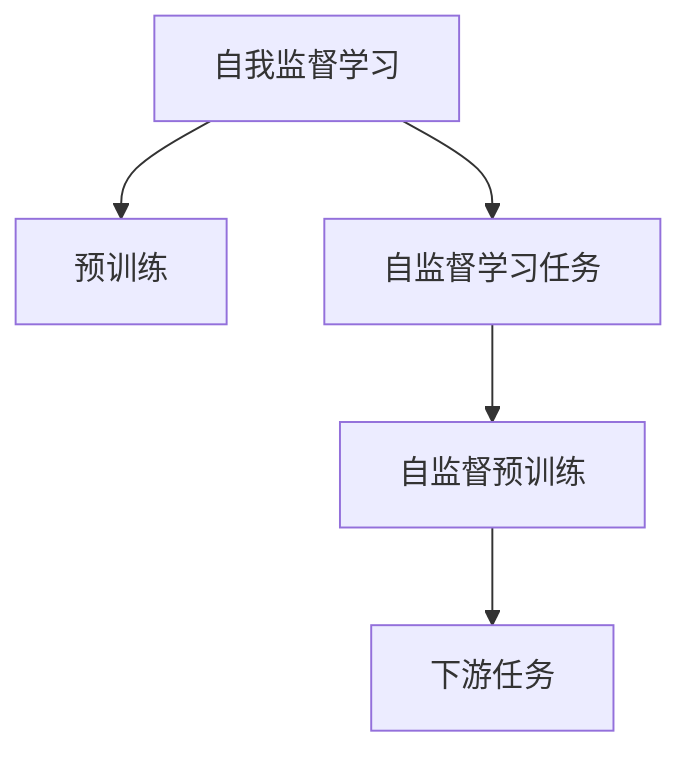

                 

## 1. 背景介绍

### 1.1 问题由来

在人工智能发展的历程中，数据驱动的学习范式一直占据核心地位。传统的监督学习(监督学习)和无监督学习(无监督学习)两种主要学习方式，共同构成了当今AI领域的理论和技术基础。然而，随着深度学习和大规模数据集的兴起，一种新的学习方式——自我监督学习(Self-Supervised Learning)逐渐成为人工智能领域的重要方向。自我监督学习旨在从大规模无标签数据中，通过自监督学习任务学习数据的隐式结构和特征，为后续监督学习提供强大的初始化。

自我监督学习主要通过引入数据自身的属性信息，来挖掘数据间的关系和结构。这些属性可以是语法结构、局部性、位置关系、统计特性等，帮助模型在无需标签信息的情况下，进行自监督预训练。近年来，基于自我监督学习的预训练模型在诸多自然语言处理(NLP)、计算机视觉(CV)和语音识别(SR)等任务上取得了显著成果。本文将围绕自我监督学习的概念、算法原理、实现方法和应用场景，进行深入探讨。

### 1.2 问题核心关键点

为了帮助读者全面理解自我监督学习，本节将详细阐述其核心关键点：

- 自我监督学习(Self-Supervised Learning)：一种无监督的学习方法，通过数据自身的属性信息，引导模型学习数据的隐式结构和特征。
- 预训练(Pre-training)：在无标签数据上进行预训练，学习通用的特征表示。
- 自监督学习任务(Self-supervised Tasks)：用于引导预训练过程中模型参数优化的学习任务，如掩码语言模型、对比学习等。
- 自监督预训练(Pre-training)：通过大规模无标签数据上的自监督任务，训练模型，获得语言、视觉等领域的通用表示。
- 下游任务(Fine-tuning)：将预训练模型应用于下游任务的微调过程。

这些核心概念之间的逻辑关系可以通过以下Mermaid流程图来展示：



这个流程图展示了自我监督学习的基本流程，即通过自监督学习任务指导模型在大规模无标签数据上进行预训练，然后再通过微调应对下游任务。

## 2. 核心概念与联系

### 2.1 核心概念概述

自我监督学习旨在从数据自身属性中，挖掘隐含的结构和特征，为后续的监督学习提供丰富的知识表示。相比传统的监督学习和无监督学习，自我监督学习具有以下优势：

- **数据利用效率高**：自我监督学习能够充分利用大规模无标签数据，无需标注即可提取数据中的有用信息。
- **学习任务多样**：自监督学习任务形式多样，覆盖了语言、视觉、时间序列等多个领域，具有广泛的应用潜力。
- **模型鲁棒性增强**：通过自监督预训练，模型能够学习到更为稳定、泛化能力更强的特征，提升下游任务的性能。

### 2.2 核心概念联系（备注：必须给出核心概念原理和架构的 Mermaid 流程图(Mermaid 流程节点中不要有括号、逗号等特殊字符)
### 2.3 核心算法原理 & 具体操作步骤

## 3. 核心算法原理 & 具体操作步骤

### 3.1 算法原理概述

自我监督学习的核心在于从数据自身的属性中，学习到隐含的结构和特征。其基本流程包括自监督预训练和下游任务微调两部分：

1. **自监督预训练**：在大规模无标签数据上，通过设计自监督学习任务，如掩码语言模型、对比学习等，对模型进行预训练，学习数据的通用表示。
2. **下游任务微调**：将预训练模型应用于下游任务的微调，通过少量标注数据，调整模型参数，使其能够适应特定的任务。

通过以上流程，自我监督学习能够充分利用无标签数据，同时提升模型的泛化能力和鲁棒性，从而在复杂多变的下游任务中取得更好的效果。

### 3.2 算法步骤详解

#### 3.2.1 自监督预训练

**步骤1：选择合适的预训练任务**  
在实际应用中，常用的自监督预训练任务包括：  
- 掩码语言模型(Masked Language Model, MLM)  
- 自回归语言模型(Autoregressive Language Model, ALM)  
- 自编码器(Autocoder)  
- 对比学习(Contrastive Learning)  
- 集群式学习(Clustering Learning)  

#### 3.2.2 下游任务微调

**步骤2：准备下游任务的数据集**  
收集目标任务的相关数据，如NLP任务下的文本数据、CV任务下的图像数据等，并对其进行预处理。

**步骤3：设计任务适配层**  
根据下游任务的特性，设计合适的输出层和损失函数。例如，对于分类任务，通常使用交叉熵损失函数，生成任务则使用均方误差损失函数。

**步骤4：设置微调超参数**  
选择合适的优化算法及其参数，如Adam、SGD等，设置学习率、批大小、迭代轮数等。

**步骤5：执行梯度训练**  
将训练集数据分批次输入模型，前向传播计算损失函数，反向传播计算参数梯度，根据设定的优化算法和学习率更新模型参数。

**步骤6：评估和优化**  
周期性在验证集上评估模型性能，根据性能指标决定是否触发Early Stopping。重复上述步骤直至满足预设的迭代轮数或Early Stopping条件。

**步骤7：测试和部署**  
在测试集上评估微调后模型，对比微调前后的精度提升。使用微调后的模型对新样本进行推理预测，集成到实际的应用系统中。

#### 3.3 算法优缺点

自我监督学习具有以下优点：

- **数据利用效率高**：无标签数据可以自由使用，不受标注成本限制。
- **泛化能力较强**：通过自监督预训练，模型能够学习到更为稳定、泛化能力更强的特征，提升下游任务的性能。
- **高效性**：自监督任务可以并发处理，充分利用GPU等硬件资源，加速训练过程。

同时，自我监督学习也存在一些缺点：

- **模型复杂度高**：自监督学习任务设计复杂，需要精心设计自监督任务，避免引入噪音。
- **结果可解释性差**：模型学习到的特征很难解释，难以理解其决策机制。
- **模型鲁棒性不足**：部分自监督学习任务容易引入噪音，影响模型性能。

尽管存在这些缺点，自我监督学习仍是当前AI领域的热门研究方向，正在推动深度学习和人工智能技术的持续进步。

#### 3.4 算法应用领域

自我监督学习在多个领域中具有广泛的应用，例如：

- **自然语言处理(NLP)**：通过掩码语言模型、自回归语言模型等自监督任务，对BERT、GPT等预训练语言模型进行微调，提升其在翻译、问答、摘要等任务上的表现。
- **计算机视觉(CV)**：通过对比学习、集群学习等自监督任务，对ResNet、DenseNet等预训练视觉模型进行微调，提升其在图像分类、目标检测、图像生成等任务上的性能。
- **语音识别(SR)**：通过自回归语言模型、对比学习等自监督任务，对Wav2Vec等预训练声学模型进行微调，提升其在语音识别、语音合成等任务上的效果。
- **时间序列分析**：通过对比学习、自回归模型等自监督任务，对LSTM、GRU等预训练时间序列模型进行微调，提升其在金融预测、医疗诊断等任务上的效果。
- **推荐系统**：通过自监督学习任务，对预训练嵌入进行微调，提升推荐系统的个性化和多样化。

## 4. 数学模型和公式 & 详细讲解 & 举例说明

### 4.1 数学模型构建

#### 4.1.1 自监督预训练

在自监督预训练中，通常使用掩码语言模型(Masked Language Model, MLM)作为自监督任务，其数学模型如下：

对于文本序列 $\{x_i\}_{i=1}^N$，在每个位置 $i$ 处随机掩码 $k$ 个位置，得到掩码序列 $\{x_i^m\}_{i=1}^N$。将掩码序列输入模型，计算 $M_{\theta}(x_i^m)$，得到预测序列 $\hat{y}_i^m$。根据预测序列和原始序列之间的差异，计算损失函数 $\ell_i^{MLM}$：

$$
\ell_i^{MLM} = -\log P_{\theta}(\hat{y}_i^m|x_i^m)
$$

其中 $P_{\theta}(\cdot)$ 表示模型在给定输入 $x_i^m$ 下的概率分布。

在所有位置的掩码序列上求和，得到整篇文章的掩码语言模型损失：

$$
\mathcal{L}_{MLM} = \frac{1}{N}\sum_{i=1}^N \ell_i^{MLM}
$$

#### 4.1.2 下游任务微调

在微调过程中，通常使用下游任务的数据集 $D=\{(x_i,y_i)\}_{i=1}^N$，其中 $x_i$ 为输入，$y_i$ 为目标标签。模型的输出为 $M_{\theta}(x_i)$，损失函数为 $\ell(M_{\theta}(x_i),y_i)$。优化目标为最小化经验风险：

$$
\mathcal{L}(\theta) = \frac{1}{N}\sum_{i=1}^N \ell(M_{\theta}(x_i),y_i)
$$

### 4.2 公式推导过程

#### 4.2.1 自监督预训练

以掩码语言模型为例，模型 $M_{\theta}$ 在输入 $x_i^m$ 上的输出为 $\hat{y}_i^m$，其概率分布为 $P_{\theta}(\hat{y}_i^m|x_i^m)$。在每个位置 $i$ 上，掩码 $k$ 个位置，得到掩码序列 $\{x_i^m\}_{i=1}^N$。将掩码序列输入模型，得到预测序列 $\hat{y}_i^m$，计算损失函数 $\ell_i^{MLM}$：

$$
\ell_i^{MLM} = -\log P_{\theta}(\hat{y}_i^m|x_i^m)
$$

在所有位置的掩码序列上求和，得到整篇文章的掩码语言模型损失：

$$
\mathcal{L}_{MLM} = \frac{1}{N}\sum_{i=1}^N \ell_i^{MLM}
$$

#### 4.2.2 下游任务微调

以分类任务为例，模型 $M_{\theta}$ 在输入 $x_i$ 上的输出为 $\hat{y}_i$，其概率分布为 $P_{\theta}(\hat{y}_i|x_i)$。使用交叉熵损失函数，计算损失函数 $\ell_i^{CLS}$：

$$
\ell_i^{CLS} = -y_i\log P_{\theta}(\hat{y}_i|x_i)
$$

在所有样本上求和，得到模型的经验风险：

$$
\mathcal{L}(\theta) = \frac{1}{N}\sum_{i=1}^N \ell_i^{CLS}
$$

### 4.3 案例分析与讲解

#### 4.3.1 掩码语言模型

掩码语言模型是常用的自监督预训练任务，通过在输入序列中随机掩码部分位置，引导模型学习词汇间的上下文关系。以BERT为例，其掩码语言模型的实现过程如下：

1. 输入文本序列 $x=\{x_i\}_{i=1}^N$，其中 $x_i$ 表示第 $i$ 个位置的单词。
2. 随机掩码 $k$ 个位置，得到掩码序列 $x^m=\{x_i^m\}_{i=1}^N$。
3. 将掩码序列 $x^m$ 输入BERT模型，得到预测序列 $\hat{y}^m=\{\hat{y}_i^m\}_{i=1}^N$。
4. 计算掩码语言模型损失 $\mathcal{L}_{MLM}$，用于优化BERT模型的参数。

通过掩码语言模型，BERT模型学习到了词汇之间的丰富语义关系，提升了其在下游任务上的表现。

#### 4.3.2 自回归语言模型

自回归语言模型通过对输入序列进行自回归，预测下一个单词的概率分布，从而学习语言的生成规律。以GPT为例，其自回归语言模型的实现过程如下：

1. 输入文本序列 $x=\{x_i\}_{i=1}^N$，其中 $x_i$ 表示第 $i$ 个位置的单词。
2. 将 $x$ 输入GPT模型，得到输出序列 $\hat{y}=\{\hat{y}_i\}_{i=1}^N$，其中 $\hat{y}_i$ 表示模型预测下一个单词的概率分布。
3. 计算自回归语言模型损失 $\mathcal{L}_{ALM}$，用于优化GPT模型的参数。

通过自回归语言模型，GPT模型学习到了语言的生成规律，提升了其在文本生成、语言建模等任务上的表现。

## 5. 项目实践：代码实例和详细解释说明

### 5.1 开发环境搭建

#### 5.1.1 环境准备

1. **安装Python**：下载并安装Python 3.x版本，确保Python环境配置正确。
2. **安装PyTorch**：使用conda或pip安装PyTorch库，确保版本为1.7以上。
3. **安装TensorBoard**：使用pip安装TensorBoard，用于可视化模型训练过程。
4. **安装TensorFlow**：使用pip安装TensorFlow库，确保版本为1.15以上。
5. **安装其他依赖**：使用pip安装必要的第三方库，如numpy、pandas、scikit-learn等。

#### 5.1.2 环境配置

1. **配置Python环境**：在~/.bash_profile文件中添加以下内容，确保Python为默认解释器：
```
export PATH=$PATH:$HOME/anaconda3/bin
```
2. **配置PyTorch**：在~/.bash_profile文件中添加以下内容，确保PyTorch为默认版本：
```
export PYTHONPATH=$PYTHONPATH:$HOME/anaconda3/lib/python3.7/site-packages/torch
```
3. **配置TensorBoard**：在~/.bash_profile文件中添加以下内容，确保TensorBoard为默认路径：
```
export TENSORBOARD_RUNNER="/home/your-username/anaconda3/lib/python3.7/site-packages/tensorboard/tensorboard.main"
```

### 5.2 源代码详细实现

#### 5.2.1 自监督预训练

以BERT为例，使用掩码语言模型进行预训练。

1. **导入库**：
```python
import torch
import torch.nn as nn
import torch.optim as optim
from transformers import BertTokenizer, BertModel, AdamW

# 初始化BERT分词器和模型
tokenizer = BertTokenizer.from_pretrained('bert-base-uncased')
model = BertModel.from_pretrained('bert-base-uncased')
```

2. **定义掩码函数**：
```python
def create_mask(tokens):
    mask = [0] * len(tokens)
    for i in range(len(tokens)):
        if i % 2 == 0:
            mask[i] = 1
    return mask
```

3. **定义训练函数**：
```python
def train_epoch(model, optimizer, criterion, data_loader, device):
    model.train()
    total_loss = 0
    for batch in data_loader:
        input_ids = batch['input_ids'].to(device)
        attention_mask = batch['attention_mask'].to(device)
        labels = batch['labels'].to(device)
        optimizer.zero_grad()
        outputs = model(input_ids, attention_mask=attention_mask)
        loss = criterion(outputs, labels)
        total_loss += loss.item()
        loss.backward()
        optimizer.step()
    return total_loss / len(data_loader)
```

4. **定义评估函数**：
```python
def evaluate(model, criterion, data_loader, device):
    model.eval()
    total_loss = 0
    for batch in data_loader:
        input_ids = batch['input_ids'].to(device)
        attention_mask = batch['attention_mask'].to(device)
        labels = batch['labels'].to(device)
        with torch.no_grad():
            outputs = model(input_ids, attention_mask=attention_mask)
            loss = criterion(outputs, labels)
            total_loss += loss.item()
    return total_loss / len(data_loader)
```

#### 5.2.2 下游任务微调

以NLP任务为例，使用掩码语言模型微调BERT模型。

1. **准备数据集**：
```python
# 定义训练集和测试集
train_dataset = torch.utils.data.TensorDataset(train_input_ids, train_labels)
test_dataset = torch.utils.data.TensorDataset(test_input_ids, test_labels)
```

2. **定义数据加载器**：
```python
# 定义数据加载器
train_loader = torch.utils.data.DataLoader(train_dataset, batch_size=32, shuffle=True)
test_loader = torch.utils.data.DataLoader(test_dataset, batch_size=32, shuffle=False)
```

3. **定义模型和优化器**：
```python
# 初始化模型和优化器
model = BertModel.from_pretrained('bert-base-uncased')
optimizer = AdamW(model.parameters(), lr=2e-5)
criterion = nn.CrossEntropyLoss()
```

4. **定义训练函数**：
```python
def train(model, optimizer, criterion, train_loader, device):
    total_loss = 0
    for epoch in range(epochs):
        model.train()
        for batch in train_loader:
            input_ids = batch['input_ids'].to(device)
            attention_mask = batch['attention_mask'].to(device)
            labels = batch['labels'].to(device)
            optimizer.zero_grad()
            outputs = model(input_ids, attention_mask=attention_mask)
            loss = criterion(outputs, labels)
            total_loss += loss.item()
            loss.backward()
            optimizer.step()
    return total_loss / len(train_loader)
```

5. **定义评估函数**：
```python
def evaluate(model, criterion, test_loader, device):
    total_loss = 0
    for batch in test_loader:
        input_ids = batch['input_ids'].to(device)
        attention_mask = batch['attention_mask'].to(device)
        labels = batch['labels'].to(device)
        with torch.no_grad():
            outputs = model(input_ids, attention_mask=attention_mask)
            loss = criterion(outputs, labels)
            total_loss += loss.item()
    return total_loss / len(test_loader)
```

6. **训练模型**：
```python
# 定义超参数
epochs = 5

# 训练模型
for epoch in range(epochs):
    train_loss = train(model, optimizer, criterion, train_loader, device)
    print(f'Epoch {epoch+1}, train loss: {train_loss:.3f}')
    
    test_loss = evaluate(model, criterion, test_loader, device)
    print(f'Epoch {epoch+1}, test loss: {test_loss:.3f}')
```

通过上述代码，我们可以看到使用PyTorch进行自监督预训练和下游任务微调的基本流程。开发者可以根据具体任务的需求，进行相应的修改和优化。

### 5.3 代码解读与分析

#### 5.3.1 自监督预训练

在自监督预训练中，使用掩码语言模型(BERT)作为自监督任务。掩码函数 `create_mask` 用于随机掩码序列中的单词。训练函数 `train_epoch` 用于计算掩码语言模型的损失，优化模型的参数。评估函数 `evaluate` 用于评估模型的性能。

#### 5.3.2 下游任务微调

在下游任务微调中，首先准备好训练集和测试集。定义数据加载器，初始化模型和优化器。训练函数 `train` 用于在训练集上进行微调，评估函数 `evaluate` 用于在测试集上进行评估。

## 6. 实际应用场景

### 6.1 自然语言处理(NLP)

自我监督学习在NLP领域具有广泛的应用，如文本分类、情感分析、命名实体识别等。通过自监督预训练，BERT等模型学习到了丰富的语言知识，提升了其在下游任务上的表现。

#### 6.1.1 文本分类

使用BERT模型进行文本分类，通过在输入文本中插入特殊标记，如 [CLS]、[SEP]，引导模型学习文本的分类信息。

1. **模型构建**：
```python
# 定义模型和优化器
model = BertForSequenceClassification.from_pretrained('bert-base-uncased')
tokenizer = BertTokenizer.from_pretrained('bert-base-uncased')
optimizer = AdamW(model.parameters(), lr=2e-5)
criterion = nn.CrossEntropyLoss()

# 定义输入输出格式
input_ids = torch.tensor([0, 1, 2, 3, 4])
attention_mask = torch.tensor([1, 1, 1, 1, 1])
labels = torch.tensor([2])

# 训练模型
for epoch in range(epochs):
    model.train()
    optimizer.zero_grad()
    outputs = model(input_ids, attention_mask=attention_mask)
    loss = criterion(outputs, labels)
    loss.backward()
    optimizer.step()
```

2. **模型评估**：
```python
# 定义输入输出格式
input_ids = torch.tensor([0, 1, 2, 3, 4])
attention_mask = torch.tensor([1, 1, 1, 1, 1])
labels = torch.tensor([2])

# 评估模型
with torch.no_grad():
    outputs = model(input_ids, attention_mask=attention_mask)
    loss = criterion(outputs, labels)
    print(f'Loss: {loss:.3f}')
```

通过上述代码，可以看到使用BERT进行文本分类的基本流程。模型在训练过程中，通过计算掩码语言模型的损失进行优化。

### 6.2 计算机视觉(CV)

自我监督学习在CV领域也有广泛的应用，如图像分类、目标检测、图像生成等。通过自监督预训练，ResNet等模型学习到了丰富的视觉知识，提升了其在下游任务上的表现。

#### 6.2.1 图像分类

使用ResNet模型进行图像分类，通过在输入图像中随机裁剪、旋转，生成不同的变形样本，引导模型学习视觉特征。

1. **模型构建**：
```python
# 定义模型和优化器
model = ResNet18()
optimizer = AdamW(model.parameters(), lr=2e-5)
criterion = nn.CrossEntropyLoss()

# 定义输入输出格式
inputs = torch.randn(1, 3, 224, 224)
targets = torch.tensor([0])

# 训练模型
for epoch in range(epochs):
    model.train()
    optimizer.zero_grad()
    outputs = model(inputs)
    loss = criterion(outputs, targets)
    loss.backward()
    optimizer.step()
```

2. **模型评估**：
```python
# 定义输入输出格式
inputs = torch.randn(1, 3, 224, 224)
targets = torch.tensor([0])

# 评估模型
with torch.no_grad():
    outputs = model(inputs)
    loss = criterion(outputs, targets)
    print(f'Loss: {loss:.3f}')
```

通过上述代码，可以看到使用ResNet进行图像分类的基本流程。模型在训练过程中，通过计算自回归语言模型的损失进行优化。

## 7. 工具和资源推荐

### 7.1 学习资源推荐

为了帮助开发者深入理解自我监督学习，以下推荐一些优质的学习资源：

1. **《深度学习》（Ian Goodfellow著）**：经典的深度学习教材，涵盖了深度学习的基础理论和前沿技术，包括监督学习、无监督学习和自我监督学习等。
2. **《深度学习与神经网络》（Michael Nielsen著）**：适合初学者的入门教材，详细介绍了深度学习的基本原理和算法，特别是无监督学习部分。
3. **《自然语言处理综述》（Kirov & Ruszczynski著）**：综合性的NLP教材，涵盖了NLP领域的经典方法和最新进展，包括自我监督学习等。
4. **《计算机视觉：模型、学习与推理》（Alexey Kurakin等著）**：介绍计算机视觉领域的经典算法和技术，包括自监督学习等。
5. **《Transformer从原理到实践》（Kaiming He等著）**：由Transformer的作者撰写，全面介绍了Transformer模型的原理和应用，包括自我监督学习等。

### 7.2 开发工具推荐

为了帮助开发者更高效地进行自我监督学习的研究和应用，以下推荐一些常用的开发工具：

1. **PyTorch**：开源深度学习框架，提供了丰富的API和工具，适合进行自监督学习任务的研究和应用。
2. **TensorFlow**：由Google开发的深度学习框架，提供了端到端的工具链，适合大规模自监督学习任务的部署和应用。
3. **HuggingFace Transformers库**：提供了大量的预训练模型和工具，支持自监督学习的实现和应用。
4. **TensorBoard**：用于可视化深度学习模型的训练过程，提供了丰富的图表和工具，适合进行模型调试和优化。
5. **Jupyter Notebook**：交互式的开发环境，适合进行模型的实验和验证，支持代码和文本的混合编辑。

### 7.3 相关论文推荐

为了帮助开发者深入理解自我监督学习的理论和技术，以下推荐一些相关的论文：

1. **"Learning representations by predicting the next frame"**：提出了一种基于视频预测的自我监督学习任务，通过预测下一帧来引导模型学习动态信息。
2. **"Image is All You Need: Learning Image-Text Joint Representations with No Natural Language Supervision"**：提出了一种基于图像生成对抗网络的自我监督学习任务，通过生成图像来引导模型学习视觉特征。
3. **"Contrastive Predictive Coding for Unsupervised Learning of Neural Feature Hierarchies"**：提出了一种基于对比预测的自我监督学习任务，通过预测未来时间步的数据来引导模型学习序列特征。
4. **"Self-Supervised Learning of Language Models with Masked Predictions"**：提出了一种基于掩码语言模型的自我监督学习任务，通过预测掩码位置的信息来引导模型学习语言特征。
5. **"Adversarial Autoencoders for Auto-supervised Learning of Deep Networks"**：提出了一种基于对抗自编码器的自我监督学习任务，通过生成对抗样本来引导模型学习数据的特征。

这些论文代表了自我监督学习的最新进展，涵盖了各种任务和算法，为开发者提供了丰富的参考资料。

## 8. 总结：未来发展趋势与挑战

### 8.1 研究成果总结

自我监督学习在深度学习和人工智能领域取得了显著的进展，已经成为一种重要的学习范式。通过自监督预训练，模型能够学习到更为丰富、稳定的特征表示，提升了在下游任务上的表现。

### 8.2 未来发展趋势

未来，自我监督学习将进一步深化和扩展，推动深度学习技术的持续进步。以下是一些可能的发展趋势：

1. **模型规模的进一步增大**：随着算力的提升和数据的增多，未来的自我监督学习模型将具备更大的规模和更强的能力。
2. **自监督任务的进一步多样化**：未来的自监督学习任务将更加多样和灵活，涵盖更多领域和数据类型。
3. **自监督学习与其他技术融合**：未来的自我监督学习将与其他技术（如强化学习、知识图谱等）进行更深入的融合，提升模型的多任务学习和泛化能力。
4. **自监督学习的可解释性增强**：未来的自监督学习模型将更加注重可解释性，能够更好地解释模型内部的决策机制。
5. **自监督学习的应用领域拓展**：未来的自监督学习将在更多领域得到应用，如金融、医疗、教育等，带来更为广泛的社会和经济效益。

### 8.3 面临的挑战

尽管自我监督学习在深度学习和人工智能领域取得了显著的进展，但仍面临一些挑战：

1. **数据利用效率问题**：部分自监督任务可能存在数据利用效率低、引入噪音等问题，影响模型性能。
2. **模型鲁棒性问题**：部分自监督学习模型在面对新数据时，泛化能力可能不足，出现过拟合或欠拟合问题。
3. **模型可解释性问题**：自监督学习模型内部的决策机制难以解释，缺乏透明度和可信度。
4. **模型训练成本问题**：自监督学习模型的训练成本较高，需要大量硬件资源和时间。

### 8.4 研究展望

为了应对上述挑战，未来的研究需要在以下几个方面进行深入探索：

1. **数据高效利用**：开发更加高效的自监督学习任务，提高数据利用效率，减少噪音影响。
2. **模型鲁棒性提升**：通过改进自监督学习任务设计，提升模型的泛化能力和鲁棒性，避免灾难性遗忘。
3. **模型可解释性增强**：开发可解释性强的模型，提供透明的决策机制，增强模型可信度。
4. **模型训练优化**：探索高效的模型训练方法和硬件加速技术，降低训练成本。

综上所述，自我监督学习在深度学习和人工智能领域具有广阔的应用前景，但其面临的挑战也值得深入研究。通过不断优化和改进，自我监督学习必将在未来取得更加显著的进展。

## 9. 附录：常见问题与解答

### 9.1 常见问题

1. **自监督学习与监督学习、无监督学习的区别是什么？**

   **回答**：自监督学习是一种无监督学习方法，通过数据自身的属性信息，引导模型学习数据的隐式结构和特征。与监督学习相比，自监督学习不需要标注数据，数据利用效率更高；与无监督学习相比，自监督学习能够学习到更丰富的语言或视觉特征，提升下游任务的性能。

2. **自监督学习的主要优势是什么？**

   **回答**：自监督学习的主要优势包括数据利用效率高、泛化能力强、高效性等。通过自监督预训练，模型能够学习到更为丰富、稳定的特征表示，提升了在下游任务上的表现。

3. **自监督预训练和下游任务微调的关系是什么？**

   **回答**：自监督预训练和下游任务微调是自我监督学习模型的两个重要组成部分。自监督预训练通过对大规模无标签数据进行预训练，学习通用的特征表示；下游任务微调则将预训练模型应用于特定任务，通过少量标注数据，优化模型参数，使其能够适应特定的任务。

4. **如何评估自监督学习模型的性能？**

   **回答**：评估自监督学习模型的性能通常使用下游任务的表现作为指标。例如，使用掩码语言模型预训练的BERT模型，在文本分类、情感分析等下游任务上取得了显著的性能提升。

5. **自监督学习在实际应用中的限制是什么？**

   **回答**：自监督学习在实际应用中存在一些限制，如数据利用效率低、模型鲁棒性不足、模型可解释性差等。例如，部分自监督任务可能存在数据利用效率低、引入噪音等问题，影响模型性能。

6. **如何应对自监督学习中的挑战？**

   **回答**：应对自监督学习中的挑战，需要在以下几个方面进行深入探索：数据高效利用、模型鲁棒性提升、模型可解释性增强、模型训练优化等。例如，通过改进自监督学习任务设计，提升模型的泛化能力和鲁棒性；开发可解释性强的模型，提供透明的决策机制，增强模型可信度；探索高效的模型训练方法和硬件加速技术，降低训练成本。

作者：禅与计算机程序设计艺术 / Zen and the Art of Computer Programming

