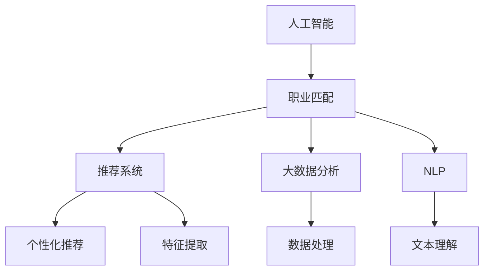

                 

# AI在个性化职业规划中的应用：匹配最佳职业

> 关键词：人工智能,职业规划,职业匹配,大数据,推荐系统,自然语言处理,NLP,机器学习,深度学习,职业发展,个性化

## 1. 背景介绍

### 1.1 问题由来
随着科技的不断进步，职业市场也正发生着快速变化。职场竞争愈发激烈，选择适合自己的职业成为了许多人关注的焦点。职业规划不仅关系到个人的职业发展和生活质量，更是关乎其幸福感和满意度。然而，面对浩如烟海的职业选择，如何从中筛选出最适合自己的职业成为了一个难题。

### 1.2 问题核心关键点
职业匹配本质上是一个信息检索和推荐的过程。传统的职业推荐系统通常基于简单的关键词匹配，缺乏对职业要求的理解和对用户个人特性的考虑，难以提供精准的推荐。人工智能（AI）技术，特别是深度学习、自然语言处理（NLP）和推荐系统，为职业匹配提供了全新的解决方案。

### 1.3 问题研究意义
AI在职业匹配中的应用，通过更准确地理解职业要求和用户特性，为求职者提供个性化的职业推荐，提升其职业满意度和生活质量。同时，它还能帮助企业更高效地招聘到符合其需求的员工，实现人职匹配，提高生产力和企业效益。

## 2. 核心概念与联系

### 2.1 核心概念概述

为更好地理解AI在职业匹配中的应用，本节将介绍几个密切相关的核心概念：

- 人工智能(AI)：指使用计算机算法和数学模型模拟人类智能的技术。
- 职业匹配：指根据求职者背景和职业要求，将其匹配到最合适的职业位置。
- 推荐系统：通过分析和推荐相关性，为用户提供个性化推荐的技术。
- 大数据分析：通过对大规模数据进行分析，提取有用信息和知识。
- 自然语言处理(NLP)：使计算机能够理解和处理人类语言的技术。
- 机器学习(ML)：利用数据和算法，让计算机系统通过经验自动改进性能的技术。
- 深度学习(Deep Learning)：一种特殊类型的机器学习，使用多层神经网络进行学习和决策。

这些核心概念之间的逻辑关系可以通过以下Mermaid流程图来展示：



这个流程图展示了大语言模型的核心概念及其之间的关系：

1. 人工智能通过职业匹配、推荐系统和机器学习等技术，提供个性化推荐。
2. 大数据分析为推荐系统提供数据支持，增强其推荐效果。
3. 自然语言处理使计算机能够处理和理解人类语言，为大数据分析和个性化推荐提供语义信息。

## 3. 核心算法原理 & 具体操作步骤
### 3.1 算法原理概述

AI在职业匹配中的应用，核心是利用机器学习和自然语言处理技术，对求职者和职位进行建模，并建立推荐模型，以精准匹配两者之间的需求。

形式化地，假设求职者集合为 $U$，职位集合为 $J$，用户特征集合为 $\mathbf{F}_U$，职位特征集合为 $\mathbf{F}_J$。模型 $M$ 通过输入用户特征和职位特征，输出匹配得分 $S_{UJ}$，衡量求职者和职位之间的匹配程度。

微调模型 $M$ 的目标是最小化经验风险，即找到最优参数：

$$
\theta^* = \mathop{\arg\min}_{\theta} \mathcal{L}(M_{\theta},D)
$$

其中 $\mathcal{L}$ 为损失函数，$D$ 为训练数据集。在实际应用中，通常使用交叉熵损失、均方误差损失等。

### 3.2 算法步骤详解

AI在职业匹配中的应用，一般包括以下几个关键步骤：

**Step 1: 数据收集与处理**
- 收集大规模的求职者和职位数据，包括个人简历、职业描述、技能要求、工作环境等。
- 对数据进行清洗和标准化，去除无用信息，确保数据质量。

**Step 2: 特征提取与表示**
- 对求职者和职位数据进行特征提取，如技能、经验、教育背景等。
- 使用NLP技术对文本信息进行分词、实体识别、情感分析等，提取语义特征。
- 使用TF-IDF、词向量等方法，将文本信息转化为向量表示。

**Step 3: 模型选择与训练**
- 选择合适的推荐模型，如基于协同过滤的模型、基于内容的模型或深度学习模型等。
- 使用标记好的数据集训练推荐模型，优化参数。
- 应用正则化技术、早停策略等防止过拟合。

**Step 4: 模型评估与优化**
- 在测试集上评估模型性能，如准确率、召回率、F1分数等。
- 根据评估结果调整模型参数，优化模型性能。

**Step 5: 应用部署**
- 将训练好的模型集成到实际的应用系统中。
- 持续收集用户反馈，定期重新训练模型以适应数据分布的变化。

### 3.3 算法优缺点

AI在职业匹配中的应用，具有以下优点：
1. 数据驱动：通过大规模数据驱动，能够提供更精准的个性化推荐。
2. 动态更新：能够实时处理用户数据，适应最新的职业需求。
3. 多维度评估：通过综合考虑多方面因素，提供全面的职业匹配。
4. 可扩展性：能够处理大规模数据，适应不同规模的企业需求。

同时，该方法也存在一些局限性：
1. 数据隐私：求职者和职位数据的隐私保护成为一大挑战。
2. 数据偏差：模型可能反映出数据集中的偏差，影响推荐结果的公平性。
3. 解释性不足：推荐模型的决策过程通常缺乏可解释性，难以对其逻辑进行分析和调试。
4. 高复杂度：在大规模数据上训练深度学习模型，需要高性能计算资源，成本较高。

尽管存在这些局限性，AI在职业匹配中的应用仍显示出巨大的潜力，有望在未来的职业发展中发挥越来越重要的作用。

### 3.4 算法应用领域

AI在职业匹配中的应用，已经覆盖了多个行业，具体包括：

- 人才招聘：通过AI推荐系统，企业能够高效地招聘到符合其需求的人才。
- 职业指导：AI系统能够根据求职者的背景和兴趣，提供个性化的职业规划建议。
- 教育培训：AI推荐系统可以根据学生的学习情况，推荐适合的课程和培训项目。
- 创业指导：AI系统能够根据创业者背景，推荐适合的创业方向和投资机会。
- 职业健康：AI系统能够根据员工的健康数据，推荐适合的健康计划和工作环境。

除了这些，AI在职业匹配中的应用还在不断扩展，未来将有望深入到更多垂直领域，提供更精准、高效的职业规划服务。

## 4. 数学模型和公式 & 详细讲解  
### 4.1 数学模型构建

本节将使用数学语言对AI在职业匹配中的应用进行更加严格的刻画。

记求职者特征向量为 $\mathbf{u} \in \mathbb{R}^{d_u}$，职位特征向量为 $\mathbf{v} \in \mathbb{R}^{d_v}$，其中 $d_u$ 和 $d_v$ 分别为用户和职位的特征维度。假设模型 $M$ 为线性回归模型：

$$
S_{UJ} = \mathbf{u}^T\mathbf{W}\mathbf{v} + b
$$

其中 $\mathbf{W} \in \mathbb{R}^{d_u \times d_v}$ 为特征权重矩阵，$b$ 为偏置项。模型 $M$ 的目标是最小化以下损失函数：

$$
\mathcal{L}(M) = \frac{1}{N} \sum_{i=1}^N [l(S_{uj}, y_j)] 
$$

其中 $l$ 为损失函数，$y_j$ 为职位匹配标签，取值范围为 $\{0, 1\}$，$N$ 为训练样本数量。

### 4.2 公式推导过程

以下我们以二分类任务为例，推导损失函数及其梯度的计算公式。

假设模型 $M$ 在输入 $\mathbf{u}$ 和 $\mathbf{v}$ 上的输出为 $S_{uj}$，真实标签 $y_j \in \{0,1\}$。二分类交叉熵损失函数定义为：

$$
l(S_{uj}, y_j) = -[y_j\log \hat{y_j} + (1-y_j)\log(1-\hat{y_j})]
$$

将其代入经验风险公式，得：

$$
\mathcal{L}(M) = -\frac{1}{N} \sum_{i=1}^N [y_i\log \hat{y_i} + (1-y_i)\log(1-\hat{y_i})]
$$

根据链式法则，损失函数对特征权重 $\mathbf{W}$ 的梯度为：

$$
\frac{\partial \mathcal{L}(M)}{\partial \mathbf{W}} = -\frac{1}{N} \sum_{i=1}^N (\frac{y_i}{\hat{y_i}}-\frac{1-y_i}{1-\hat{y_i}}) \mathbf{u} \mathbf{v}^T
$$

其中 $\frac{\partial \hat{y_j}}{\partial \mathbf{W}} = \frac{\partial S_{uj}}{\partial \mathbf{W}} \frac{\partial S_{uj}}{\partial \mathbf{v}}$ 可通过链式法则进一步展开，利用自动微分技术完成计算。

在得到损失函数的梯度后，即可带入优化算法，如梯度下降法，更新模型参数。重复上述过程直至收敛，最终得到适应求职者-职位匹配的最优模型参数 $\mathbf{W}^*$。

## 5. 项目实践：代码实例和详细解释说明
### 5.1 开发环境搭建

在进行职业匹配项目实践前，我们需要准备好开发环境。以下是使用Python进行PyTorch开发的环境配置流程：

1. 安装Anaconda：从官网下载并安装Anaconda，用于创建独立的Python环境。

2. 创建并激活虚拟环境：
```bash
conda create -n pytorch-env python=3.8 
conda activate pytorch-env
```

3. 安装PyTorch：根据CUDA版本，从官网获取对应的安装命令。例如：
```bash
conda install pytorch torchvision torchaudio cudatoolkit=11.1 -c pytorch -c conda-forge
```

4. 安装TensorFlow：
```bash
conda install tensorflow
```

5. 安装各类工具包：
```bash
pip install numpy pandas scikit-learn matplotlib tqdm jupyter notebook ipython
```

完成上述步骤后，即可在`pytorch-env`环境中开始职业匹配项目的开发。

### 5.2 源代码详细实现

下面以基于协同过滤的职业匹配为例，给出使用TensorFlow和Keras库进行实现的具体代码。

```python
import tensorflow as tf
from tensorflow.keras.layers import Input, Dense, Embedding, dot, add
from tensorflow.keras.models import Model

# 定义求职者和职位特征向量
u_input = Input(shape=(d_u,), name='u_input')
v_input = Input(shape=(d_v,), name='v_input')

# 定义特征权重矩阵
W = tf.Variable(tf.random.normal([d_u, d_v]), name='W')
b = tf.Variable(tf.random.normal([1]), name='b')

# 定义模型
S = dot([u_input, W], [v_input, W])
output = add(S, b)

# 定义损失函数
y = tf.keras.utils.to_categorical(y_j, num_classes=2)
loss_fn = tf.keras.losses.BinaryCrossentropy()

# 定义模型训练函数
def train_model(model, train_data, val_data, epochs=10, batch_size=32):
    model.compile(optimizer='adam', loss=loss_fn, metrics=['accuracy'])
    model.fit(train_data, epochs=epochs, batch_size=batch_size, validation_data=val_data)

# 假设train_data和val_data是已经标记好的求职者和职位数据，其中y_j为职位匹配标签
train_model(model, train_data, val_data)
```

这段代码展示了如何构建基于协同过滤的职业匹配模型，并使用TensorFlow进行训练。具体的实现细节包括：

1. 定义求职者和职位特征向量的输入层，形状分别为 $(d_u,)$ 和 $(d_v,)$。
2. 定义特征权重矩阵 $W$ 和偏置项 $b$，并初始化为随机值。
3. 使用点积操作 $dot$ 计算求职者和职位特征向量的内积，得到匹配得分 $S$。
4. 将匹配得分 $S$ 和偏置项 $b$ 相加，得到最终的输出。
5. 定义二分类交叉熵损失函数 $BinaryCrossentropy$，并将输出与标签进行计算。
6. 使用Adam优化器进行模型训练，设定训练轮数和批大小。

通过上述代码，可以构建并训练一个基本的基于协同过滤的职业匹配模型。

### 5.3 代码解读与分析

让我们再详细解读一下关键代码的实现细节：

**Input层定义**：
- `u_input` 和 `v_input` 分别定义了求职者和职位特征向量的输入层，形状分别为 $(d_u,)$ 和 $(d_v,)$。

**特征权重矩阵**：
- `W` 定义了特征权重矩阵，形状为 $(d_u, d_v)$，用于计算求职者和职位特征向量的内积。

**点积操作**：
- 使用 `dot` 函数计算求职者和职位特征向量的内积，得到匹配得分 $S$。

**输出计算**：
- 将匹配得分 $S$ 和偏置项 $b$ 相加，得到最终的输出，用于衡量求职者和职位之间的匹配程度。

**损失函数定义**：
- `loss_fn` 定义了二分类交叉熵损失函数，用于衡量模型输出与真实标签的差异。

**模型训练函数**：
- `train_model` 函数使用Adam优化器进行模型训练，设定训练轮数和批大小，并在验证集上进行验证。

通过上述代码，可以看出TensorFlow和Keras在职业匹配中的应用非常直观和高效。开发者可以基于此模板，快速实现不同特征提取和表示方法的组合，构建更加复杂的职业匹配模型。

## 6. 实际应用场景
### 6.1 智能招聘平台

基于AI的职业匹配技术，可以广泛应用于智能招聘平台。传统的招聘平台往往需要耗费大量人力资源进行简历筛选和面试安排，效率较低且准确性不高。智能招聘平台通过AI技术，可以自动筛选简历，将合适的候选人推送给招聘人员，并进行智能匹配。

在技术实现上，可以收集大量求职者和职位数据，对求职者和职位进行特征提取，构建职业匹配模型。求职者通过填写个人简历，系统会自动评估其与各职位的匹配程度，推送最适合的职位给求职者。同时，平台也可以通过实时监控求职者的行为数据，不断优化模型，提高匹配准确性。

### 6.2 教育培训平台

在教育培训领域，AI职业匹配技术可以帮助学生更好地规划学习路径，推荐适合的课程和培训项目，提高学习效果。学生可以根据自己的兴趣和职业目标，填写个人信息和学习偏好，AI系统会根据学生的背景和兴趣，推荐合适的课程和学习资源。

在技术实现上，可以收集学生的学习数据和反馈，对学生进行特征提取，构建职业匹配模型。平台根据学生的学习数据和反馈，动态调整推荐策略，提升推荐效果。同时，平台还可以通过学生的学习情况，预测其未来职业发展路径，提供个性化的职业指导。

### 6.3 职业规划咨询服务

AI职业匹配技术可以为职业规划咨询服务提供强有力的支持，帮助客户进行职业规划，推荐合适的职业方向和机会。咨询师可以根据客户的背景和需求，利用AI系统进行职业匹配，提供专业的职业规划建议。

在技术实现上，可以构建一个大规模的职业匹配模型，收集客户的背景和需求信息，进行特征提取，并匹配适合的职业机会。平台可以根据客户的反馈，不断优化模型，提供更加精准的职业匹配服务。

### 6.4 未来应用展望

随着AI技术的发展，职业匹配将变得更加智能和个性化。未来，AI在职业匹配中的应用将不断拓展，涵盖更多领域和应用场景。

在智慧城市建设中，AI系统可以根据居民的背景和需求，推荐适合的职业机会，帮助居民更好地融入城市生活。在医疗领域，AI系统可以根据患者的健康数据和职业背景，推荐适合的职业方向，帮助患者更好地恢复工作和生活。

此外，AI在职业匹配中的应用还将推动职业教育和终身学习的发展。通过智能推荐系统，学生可以更好地选择适合自己的课程和培训项目，实现职业发展。

## 7. 工具和资源推荐
### 7.1 学习资源推荐

为了帮助开发者系统掌握AI在职业匹配中的应用，这里推荐一些优质的学习资源：

1. 《深度学习入门》系列博文：由大模型技术专家撰写，深入浅出地介绍了深度学习的基本概念和应用实例，适合初学者入门。

2. 《TensorFlow实战》书籍：由TensorFlow官方团队编写，全面介绍了TensorFlow的使用方法和实践案例，是深度学习开发的必备工具书。

3. 《推荐系统实战》书籍：由推荐系统专家编写，详细讲解了推荐系统的理论和实现，适合AI职业匹配的开发者学习。

4. 《自然语言处理入门》书籍：介绍了自然语言处理的基本概念和算法，适合AI职业匹配的开发者学习。

5. 《Python数据科学手册》书籍：介绍了Python在数据科学和机器学习中的应用，适合AI职业匹配的开发者学习。

通过对这些资源的学习实践，相信你一定能够快速掌握AI在职业匹配中的应用技巧，并用于解决实际的职业匹配问题。

### 7.2 开发工具推荐

高效的开发离不开优秀的工具支持。以下是几款用于AI职业匹配开发的常用工具：

1. PyTorch：基于Python的开源深度学习框架，灵活动态的计算图，适合快速迭代研究。

2. TensorFlow：由Google主导开发的开源深度学习框架，生产部署方便，适合大规模工程应用。

3. Keras：基于TensorFlow的高级神经网络API，使用简单高效，适合初学者快速上手。

4. Weights & Biases：模型训练的实验跟踪工具，可以记录和可视化模型训练过程中的各项指标，方便对比和调优。

5. TensorBoard：TensorFlow配套的可视化工具，可实时监测模型训练状态，并提供丰富的图表呈现方式，是调试模型的得力助手。

6. Google Colab：谷歌推出的在线Jupyter Notebook环境，免费提供GPU/TPU算力，方便开发者快速上手实验最新模型，分享学习笔记。

合理利用这些工具，可以显著提升AI职业匹配任务的开发效率，加快创新迭代的步伐。

### 7.3 相关论文推荐

AI在职业匹配中的应用源于学界的持续研究。以下是几篇奠基性的相关论文，推荐阅读：

1. "Collaborative Filtering for Implicit Feedback Datasets"：提出协同过滤算法，广泛应用于推荐系统和职业匹配中。

2. "A Survey of Collaborative Filtering Technique"：详细综述了协同过滤算法的理论基础和实现方法。

3. "The PageRank Algorithm"：介绍PageRank算法，用于评估网页的权威度和重要性，可应用于职业匹配中的网络推荐。

4. "Deep Recommendation Systems: A Comprehensive Review and Comparative Analysis of Deep Learning Approaches"：综述了深度学习在推荐系统中的应用，包括基于协同过滤、基于内容的推荐等。

5. "TextRank: Bringing Order into Texts"：介绍TextRank算法，用于文本相似度计算和推荐系统中的文本处理。

这些论文代表了大语言模型微调技术的发展脉络。通过学习这些前沿成果，可以帮助研究者把握学科前进方向，激发更多的创新灵感。

## 8. 总结：未来发展趋势与挑战
### 8.1 总结

本文对AI在职业匹配中的应用进行了全面系统的介绍。首先阐述了AI在职业匹配的应用背景和意义，明确了AI在职业匹配中的独特价值。其次，从原理到实践，详细讲解了AI在职业匹配的数学模型和具体实现步骤，给出了职业匹配任务开发的完整代码实例。同时，本文还广泛探讨了AI在招聘、教育、咨询等多个行业领域的应用前景，展示了AI技术在职业匹配中的巨大潜力。

通过本文的系统梳理，可以看到，AI在职业匹配中的应用已经深入到多个行业，为职业规划和发展带来了新的可能性。受益于大数据、深度学习、自然语言处理等技术的发展，AI系统能够更加精准地理解职业要求和用户特性，提供个性化的职业推荐。未来，随着AI技术的不断演进，AI在职业匹配中的应用将进一步深化和扩展，为职场人士提供更全面、高效、个性化的职业规划服务。

### 8.2 未来发展趋势

展望未来，AI在职业匹配中的应用将呈现以下几个发展趋势：

1. 更加智能化：随着深度学习和大数据技术的不断发展，AI系统能够更加精准地理解用户需求和职业要求，提供更加个性化的职业匹配。

2. 多维度评估：AI系统将能够综合考虑多个维度的信息，如技能、经验、兴趣等，提供更全面的职业匹配建议。

3. 实时更新：AI系统能够实时更新和优化，适应最新的职业需求和市场变化，提供更加精准的推荐。

4. 跨平台应用：AI系统将能够在多个平台上运行，如智能招聘平台、教育培训平台、职业规划咨询服务等，提供更广泛的应用场景。

5. 多模态融合：AI系统将能够融合文本、图像、视频等多模态信息，提供更丰富的职业匹配方式。

6. 数据隐私保护：AI系统将更加注重数据隐私保护，采用匿名化、差分隐私等技术，确保用户数据安全。

以上趋势凸显了AI在职业匹配技术的广阔前景。这些方向的探索发展，必将进一步提升AI系统在职业匹配中的应用效果，为职业人士提供更全面、高效、个性化的职业规划服务。

### 8.3 面临的挑战

尽管AI在职业匹配中的应用已经取得了一定的成果，但在迈向更加智能化、普适化应用的过程中，它仍面临着诸多挑战：

1. 数据隐私：求职者和职位数据的隐私保护成为一大挑战。如何在保护用户隐私的前提下，提供精准的职业匹配，是一大难题。

2. 数据偏差：模型可能反映出数据集中的偏差，影响推荐结果的公平性。如何在模型中引入公平性约束，消除数据偏差，还需要更多的研究。

3. 解释性不足：AI系统通常缺乏可解释性，难以对其决策逻辑进行解释。如何在模型中引入可解释性技术，增强系统透明度，仍需进一步研究。

4. 高复杂度：在大规模数据上训练深度学习模型，需要高性能计算资源，成本较高。如何降低模型复杂度，优化训练过程，仍需进一步研究。

5. 持续更新：AI系统需要不断更新和优化，才能适应市场和用户需求的变化。如何在模型中引入持续学习机制，优化模型性能，是一大挑战。

6. 技术普及：AI技术在职业匹配中的应用仍需普及，许多人对其缺乏了解和信任。如何在实际应用中推广AI技术，提升用户体验，仍需进一步研究。

正视AI在职业匹配中面临的这些挑战，积极应对并寻求突破，将是大语言模型微调技术迈向成熟的必由之路。相信随着学界和产业界的共同努力，这些挑战终将一一被克服，AI在职业匹配中的应用必将在未来的职业发展中发挥越来越重要的作用。

### 8.4 研究展望

面对AI在职业匹配中面临的挑战，未来的研究需要在以下几个方面寻求新的突破：

1. 探索无监督和半监督学习：摆脱对大规模标注数据的依赖，利用自监督学习、主动学习等无监督和半监督范式，最大限度利用非结构化数据，实现更加灵活高效的职业匹配。

2. 研究参数高效和计算高效的微调范式：开发更加参数高效的微调方法，在固定大部分预训练参数的同时，只更新极少量的任务相关参数。同时优化微调模型的计算图，减少前向传播和反向传播的资源消耗，实现更加轻量级、实时性的部署。

3. 融合因果和对比学习范式：通过引入因果推断和对比学习思想，增强AI系统建立稳定因果关系的能力，学习更加普适、鲁棒的语言表征，从而提升模型泛化性和抗干扰能力。

4. 引入更多先验知识：将符号化的先验知识，如知识图谱、逻辑规则等，与神经网络模型进行巧妙融合，引导AI系统学习更准确、合理的语言模型。同时加强不同模态数据的整合，实现视觉、语音等多模态信息与文本信息的协同建模。

5. 结合因果分析和博弈论工具：将因果分析方法引入AI系统，识别出系统决策的关键特征，增强输出解释的因果性和逻辑性。借助博弈论工具刻画人机交互过程，主动探索并规避系统的脆弱点，提高系统稳定性。

6. 纳入伦理道德约束：在AI系统训练目标中引入伦理导向的评估指标，过滤和惩罚有偏见、有害的输出倾向。同时加强人工干预和审核，建立系统行为的监管机制，确保输出符合人类价值观和伦理道德。

这些研究方向的探索，必将引领AI在职业匹配技术迈向更高的台阶，为构建安全、可靠、可解释、可控的智能系统铺平道路。面向未来，AI在职业匹配技术还需要与其他人工智能技术进行更深入的融合，如知识表示、因果推理、强化学习等，多路径协同发力，共同推动自然语言理解和智能交互系统的进步。只有勇于创新、敢于突破，才能不断拓展AI系统的边界，让智能技术更好地造福人类社会。

## 9. 附录：常见问题与解答

**Q1：AI在职业匹配中的主要优点和局限性有哪些？**

A: AI在职业匹配中的主要优点包括：
1. 数据驱动：通过大规模数据驱动，能够提供更精准的个性化推荐。
2. 动态更新：能够实时处理用户数据，适应最新的职业需求。
3. 多维度评估：能够综合考虑多方面因素，提供全面的职业匹配。
4. 可扩展性：能够处理大规模数据，适应不同规模的企业需求。

AI在职业匹配中的主要局限性包括：
1. 数据隐私：求职者和职位数据的隐私保护成为一大挑战。
2. 数据偏差：模型可能反映出数据集中的偏差，影响推荐结果的公平性。
3. 解释性不足：推荐模型的决策过程通常缺乏可解释性，难以对其逻辑进行分析和调试。
4. 高复杂度：在大规模数据上训练深度学习模型，需要高性能计算资源，成本较高。

尽管存在这些局限性，AI在职业匹配中的应用仍显示出巨大的潜力，有望在未来的职业发展中发挥越来越重要的作用。

**Q2：如何构建一个基于协同过滤的职业匹配模型？**

A: 构建基于协同过滤的职业匹配模型，需要以下步骤：

1. 收集大规模的求职者和职位数据，包括个人简历、职业描述、技能要求、工作环境等。
2. 对数据进行清洗和标准化，去除无用信息，确保数据质量。
3. 对求职者和职位数据进行特征提取，如技能、经验、教育背景等。
4. 使用自然语言处理技术，对文本信息进行分词、实体识别、情感分析等，提取语义特征。
5. 使用TF-IDF、词向量等方法，将文本信息转化为向量表示。
6. 定义求职者和职位特征向量，输入层为特征向量，输出层为匹配得分。
7. 定义特征权重矩阵和偏置项，并初始化为随机值。
8. 使用点积操作计算求职者和职位特征向量的内积，得到匹配得分。
9. 将匹配得分和偏置项相加，得到最终的输出。
10. 定义二分类交叉熵损失函数，并将输出与标签进行计算。
11. 使用优化算法，如Adam，更新模型参数，最小化损失函数。
12. 在验证集上评估模型性能，调整模型参数，优化模型性能。
13. 应用到实际的职业匹配场景中，根据用户输入简历，计算匹配得分，推荐适合的职位。

通过上述步骤，可以构建一个基于协同过滤的职业匹配模型，并使用TensorFlow进行训练和评估。

**Q3：AI在职业匹配中的应用，如何处理数据隐私问题？**

A: 数据隐私是AI在职业匹配中面临的主要挑战之一。以下是一些常用的数据隐私保护技术：

1. 差分隐私：通过在数据中引入噪声，确保查询结果的隐私性。
2. 数据匿名化：对数据进行脱敏处理，保护用户身份信息。
3. 联邦学习：在分布式环境中训练模型，确保数据不出本地，保护数据隐私。
4. 同态加密：对数据进行加密处理，确保数据在计算过程中不会被泄露。
5. 对抗样本：通过引入对抗样本，保护模型免受攻击，确保数据安全。

这些技术可以应用于AI系统的各个环节，确保数据隐私的保护。

**Q4：AI在职业匹配中的应用，如何提高模型的可解释性？**

A: 提高AI系统的可解释性是AI在职业匹配中需要重点关注的问题。以下是一些常用的方法：

1. 特征可视化：通过可视化技术，展示模型的决策过程和关键特征。
2. 解释模型：使用可解释模型，如线性回归、决策树等，提供更清晰的决策逻辑。
3. 模型开源：将模型代码公开，便于其他人进行分析和验证。
4. 用户反馈：通过用户反馈，优化模型，提升系统的透明度和可解释性。
5. 自动解释：使用自动解释技术，如LIME、SHAP等，提供更详细的解释信息。

这些方法可以帮助提高AI系统的可解释性，增强用户对系统的信任和理解。

**Q5：AI在职业匹配中的应用，如何处理数据偏差问题？**

A: 数据偏差是AI系统在职业匹配中常见的挑战之一。以下是一些常用的数据偏差处理技术：

1. 数据清洗：对数据进行清洗和标准化，去除无用信息和噪声。
2. 数据增强：通过数据增强技术，增加数据多样性，减少偏差。
3. 公平性约束：在模型训练目标中引入公平性约束，消除数据偏差。
4. 对抗训练：使用对抗样本训练模型，提高模型的鲁棒性和公平性。
5. 多模态融合：融合多模态数据，提高模型的鲁棒性和公平性。

这些技术可以帮助AI系统更好地处理数据偏差问题，提升系统的公平性和稳定性。

通过本文的系统梳理，可以看到，AI在职业匹配中的应用已经深入到多个行业，为职业规划和发展带来了新的可能性。受益于大数据、深度学习、自然语言处理等技术的发展，AI系统能够更加精准地理解职业要求和用户特性，提供个性化的职业推荐。未来，随着AI技术的不断演进，AI在职业匹配中的应用将进一步深化和扩展，为职业人士提供更全面、高效、个性化的职业规划服务。

---
作者：禅与计算机程序设计艺术 / Zen and the Art of Computer Programming

