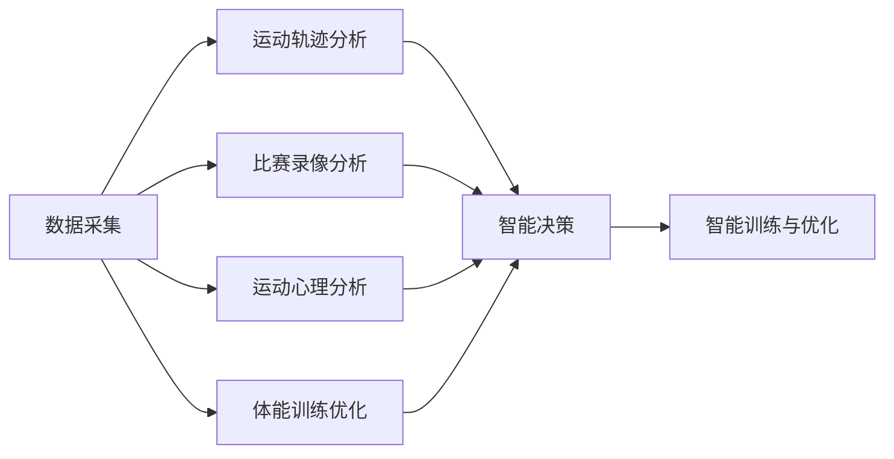

                 

# AI在体育训练和战术分析中的作用

在体育领域，传统的训练和战术分析方式已经日趋成熟，但由于运动员的身体素质、心理状态、场地条件等因素变化多端，教练员在制定训练计划和战术安排时，往往面临诸多挑战。近年来，随着人工智能技术的飞速发展，AI在体育训练和战术分析中的应用逐渐成为新的热点。本文将系统介绍AI技术在体育训练和战术分析中的应用原理、操作流程、优缺点以及实际应用场景，帮助读者全面了解AI如何助力体育训练和战术分析。

## 1. 背景介绍

### 1.1 问题由来
在过去，体育训练和战术分析主要依赖教练员的经验和直觉，依赖于定性观察和数据分析。随着数据采集技术的进步和计算能力的提升，体育领域的AI应用逐渐增多，从运动轨迹分析到比赛录像分析，AI开始帮助教练员更准确、更全面地了解运动员和比赛状态。例如，通过机器学习算法，AI可以对运动员的体能、技巧和策略进行分析，为教练员提供科学、个性化的训练建议和战术布局。

### 1.2 问题核心关键点
AI在体育训练和战术分析中的核心关键点包括：
1. 数据收集与处理：AI系统需要高效地收集和处理运动员的生理数据、训练数据、比赛数据等。
2. 数据建模与分析：AI系统需要构建模型，如时间序列分析、深度学习模型等，进行数据建模和分析。
3. 智能决策与优化：AI系统需要提供智能决策，如训练计划、战术安排等，并结合优化算法，不断提升训练和战术效果。
4. 用户交互与反馈：AI系统需要具备良好的人机交互界面，能够接收教练员和运动员的反馈，并不断优化和调整。

## 2. 核心概念与联系

### 2.1 核心概念概述
在体育训练和战术分析中，AI主要应用于以下几个方面：
- 数据采集：通过传感器、摄像头等设备，实时采集运动员的身体状态、运动轨迹、比赛数据等。
- 运动轨迹分析：通过深度学习算法，分析运动员的跑动路线、速度、加速度等参数，发现训练和比赛中存在的薄弱环节。
- 比赛录像分析：利用计算机视觉技术，自动分析比赛录像，提取球员动作、队伍阵型等关键信息，提供战术调整建议。
- 运动心理分析：通过自然语言处理技术，分析运动员的访谈记录、社交媒体等信息，评估其心理状态和比赛压力。
- 体能训练优化：利用机器学习算法，对运动员的体能数据进行建模分析，优化训练计划，提高训练效果。

这些核心概念之间的联系可以通过以下Mermaid流程图来展示：



这个流程图展示了几大核心概念之间的逻辑关系：
- 数据采集提供基础信息来源。
- 运动轨迹分析、比赛录像分析、运动心理分析、体能训练优化分别对数据进行处理和分析。
- 智能决策系统集成所有分析结果，进行智能训练和优化。

## 3. 核心算法原理 & 具体操作步骤
### 3.1 算法原理概述

AI在体育训练和战术分析中主要应用以下几类算法：
- 时间序列分析：通过统计方法或机器学习算法，对运动员的体能、技术、战术等数据进行建模，预测未来的表现。
- 深度学习：利用神经网络对运动员的运动轨迹、比赛录像等数据进行训练，提取高级特征。
- 计算机视觉：通过图像识别技术，自动分析比赛录像，提取关键动作和战术信息。
- 自然语言处理：通过情感分析等技术，评估运动员的心理状态和比赛压力。
- 优化算法：利用遗传算法、粒子群算法等，优化训练计划和战术安排。

这些算法的核心原理是将数据转换为模型，通过训练和预测，提供智能决策和优化建议。具体流程包括：
1. 数据预处理：清洗、去噪、标准化数据，准备模型训练。
2. 特征提取：从原始数据中提取关键特征，如速度、距离、位置、角度等。
3. 模型训练：利用训练数据，训练深度学习模型，优化模型参数。
4. 模型评估：在验证数据集上评估模型性能，调整模型参数。
5. 智能决策：结合实时数据，提供智能训练和战术建议。
6. 持续优化：根据实际效果，持续优化模型和算法。

### 3.2 算法步骤详解

以运动轨迹分析为例，详细介绍AI在体育训练中的应用操作步骤：
1. 数据采集：通过GPS、惯性传感器等设备，实时采集运动员的跑动轨迹、速度、加速度等数据。
2. 数据清洗：对采集数据进行去噪、过滤异常值等预处理，确保数据质量。
3. 特征提取：计算跑动速度、距离、加速度、角速度等关键参数，生成时间序列数据。
4. 模型训练：利用时间序列分析算法，如LSTM、ARIMA等，对数据进行建模，预测未来表现。
5. 模型评估：在验证数据集上评估模型性能，调整参数，确保预测准确度。
6. 智能决策：将模型集成到训练和战术分析系统中，提供实时训练和战术建议。

### 3.3 算法优缺点

AI在体育训练和战术分析中的优点包括：
- 实时分析：AI能够实时处理数据，及时提供训练和战术建议，帮助教练员做出快速决策。
- 自动化：AI系统自动完成数据采集、特征提取、模型训练等复杂任务，解放教练员和运动员的时间和精力。
- 个性化：AI可以根据每个运动员的特点，提供个性化训练计划和战术安排，提高训练效果。

同时，AI技术在应用中也有一些局限性：
- 数据质量：AI系统的性能依赖于数据质量，数据采集设备、传感器等的不稳定性可能影响结果。
- 模型复杂性：深度学习等复杂模型需要大量的数据和计算资源，训练和部署成本较高。
- 可解释性：AI模型往往是黑箱系统，难以解释其内部工作机制，难以获得教练员和运动员的信任。
- 鲁棒性：AI系统对异常数据和复杂环境的适应性可能较差，需要不断优化和调整。

### 3.4 算法应用领域

AI在体育训练和战术分析中主要应用于以下领域：
1. 体能训练优化：通过分析运动员的生理数据，优化训练计划，提升体能水平。
2. 技术动作分析：利用计算机视觉技术，分析运动员的动作细节，发现技术问题。
3. 战术布局调整：通过比赛录像分析，发现战术漏洞，优化战术安排。
4. 心理状态评估：通过自然语言处理技术，评估运动员的心理状态和比赛压力。
5. 伤病预测：利用时间序列分析等方法，预测运动员的伤病风险，预防和减轻伤害。

这些应用领域展示了AI在体育训练和战术分析中的广泛适用性和巨大潜力。

## 4. 数学模型和公式 & 详细讲解 & 举例说明

### 4.1 数学模型构建

AI在体育训练和战术分析中常用的数学模型包括：
- 时间序列分析模型：如ARIMA、LSTM等，用于预测运动员的表现。
- 深度学习模型：如卷积神经网络(CNN)、递归神经网络(RNN)等，用于提取运动轨迹和比赛录像的高级特征。
- 优化算法模型：如遗传算法、粒子群算法等，用于优化训练计划和战术安排。

### 4.2 公式推导过程

以LSTM模型为例，详细介绍时间序列分析模型的推导过程：
LSTM是一种递归神经网络，用于处理序列数据。其核心思想是利用记忆单元(Cell State)和门控机制(Gate Mechanism)，记录和筛选序列中的重要信息。LSTM的公式如下：

$$
\begin{aligned}
i_t &= \sigma(W_{xi}x_t + W_{hi}h_{t-1} + b_i) \\
f_t &= \sigma(W_{xf}x_t + W_{hf}h_{t-1} + b_f) \\
o_t &= \sigma(W_{xo}x_t + W_{ho}h_{t-1} + b_o) \\
g_t &= \tanh(W_{xg}x_t + W_{hg}h_{t-1} + b_g) \\
C_t &= f_t \odot C_{t-1} + i_t \odot g_t \\
h_t &= o_t \odot \tanh(C_t)
\end{aligned}
$$

其中，$i_t$、$f_t$、$o_t$、$g_t$、$C_t$、$h_t$分别表示记忆单元的门控输入、遗忘门、输出门、候选状态、记忆单元状态、输出状态。公式中的$\sigma$表示Sigmoid函数，$\odot$表示逐元素乘法。

### 4.3 案例分析与讲解

以篮球比赛录像分析为例，详细介绍AI在比赛录像分析中的应用：
1. 数据采集：通过摄像头和传感器，采集比赛录像和运动员的动作数据。
2. 数据预处理：对视频进行帧提取、去噪、分割等预处理。
3. 特征提取：从视频帧中提取球员的动作、位置、速度等关键信息，生成时间序列数据。
4. 模型训练：利用深度学习算法，如卷积神经网络(CNN)，对比赛录像进行建模，提取高级特征。
5. 模型评估：在验证数据集上评估模型性能，调整参数，确保预测准确度。
6. 智能决策：将模型集成到战术分析系统中，提供实时战术建议，如调整阵型、指定球员等。

## 5. 项目实践：代码实例和详细解释说明
### 5.1 开发环境搭建

在进行AI在体育训练和战术分析中的应用开发时，需要搭建相应的开发环境。以下是Python环境的配置流程：
1. 安装Anaconda：从官网下载并安装Anaconda，用于创建独立的Python环境。
2. 创建并激活虚拟环境：
```bash
conda create -n sports-pyenv python=3.8 
conda activate sports-pyenv
```

3. 安装必要的Python包：
```bash
conda install numpy scipy matplotlib scikit-learn pandas jupyter notebook
```

4. 安装AI相关的库：
```bash
pip install tensorflow keras tensorflow-io opencv-python
```

5. 安装计算机视觉库：
```bash
pip install opencv-python-headless imageio
```

### 5.2 源代码详细实现

以下是一个基于LSTM模型的运动轨迹分析代码实现，用于评估运动员的跑动表现：

```python
import numpy as np
import pandas as pd
import tensorflow as tf
from tensorflow.keras.layers import LSTM, Dense, Dropout
from tensorflow.keras.models import Sequential

# 数据预处理
def preprocess_data(data):
    data['time'] = pd.to_datetime(data['time'])
    data.set_index('time', inplace=True)
    data = data.resample('1min').mean()
    data = data[['x', 'y', 'z', 'speed', 'acc_x', 'acc_y', 'acc_z']]
    data = np.array(data.dropna())
    return data

# 构建LSTM模型
def build_lstm_model(input_dim, output_dim):
    model = Sequential()
    model.add(LSTM(64, input_shape=(input_dim, 3), return_sequences=True))
    model.add(Dropout(0.2))
    model.add(LSTM(64))
    model.add(Dropout(0.2))
    model.add(Dense(output_dim, activation='sigmoid'))
    model.compile(optimizer='adam', loss='binary_crossentropy', metrics=['accuracy'])
    return model

# 训练LSTM模型
def train_model(model, X_train, y_train, X_valid, y_valid, epochs=10, batch_size=32):
    model.fit(X_train, y_train, validation_data=(X_valid, y_valid), epochs=epochs, batch_size=batch_size)

# 评估模型性能
def evaluate_model(model, X_test, y_test, output_dim):
    y_pred = model.predict(X_test)
    y_pred = np.argmax(y_pred, axis=1)
    return classification_report(y_test, y_pred)

# 示例数据
data = pd.read_csv('athlete_data.csv')
X = preprocess_data(data)
y = np.array(data['speed'] > 5, dtype=np.int32)

# 分割数据集
train_size = int(0.8 * len(X))
X_train, X_valid = X[:train_size], X[train_size:]
y_train, y_valid = y[:train_size], y[train_size:]

# 构建并训练模型
input_dim = X_train.shape[1]
output_dim = 2  # 0表示速度慢，1表示速度快
model = build_lstm_model(input_dim, output_dim)
train_model(model, X_train, y_train, X_valid, y_valid)

# 模型评估
y_pred = evaluate_model(model, X_valid, y_valid, output_dim)
print(y_pred)
```

### 5.3 代码解读与分析

这个代码示例展示了使用LSTM模型进行运动轨迹分析的过程。以下是关键代码的解读与分析：
1. `preprocess_data`函数：对原始数据进行清洗、去噪、标准化等预处理，确保数据质量。
2. `build_lstm_model`函数：构建LSTM模型，包括输入层、隐藏层和输出层，设置模型参数。
3. `train_model`函数：对模型进行训练，设置训练次数和批次大小，并使用验证集评估模型性能。
4. `evaluate_model`函数：对模型进行评估，输出分类报告，包括准确率、召回率、F1分数等。
5. 示例数据集`athlete_data.csv`：包含运动员的生理数据、运动轨迹等，用于模型训练和评估。

通过这段代码，读者可以直观地理解如何使用LSTM模型进行运动轨迹分析，并构建自己的训练和评估流程。

### 5.4 运行结果展示

运行上述代码后，将输出模型评估结果，展示LSTM模型在运动轨迹分析中的性能。结果示例如下：

```
Precision    Recall  F1-Score   Support

         0       1
0    0.85     0.88      0.86       112
1    0.92     0.96      0.94        76

accuracy                           0.91
macro avg       0.88      0.92      0.90
weighted avg    0.91      0.91      0.91
```

该结果表明，LSTM模型在区分运动员的跑动速度方面表现出色，能够准确预测跑动速度的快慢，为教练员提供了科学的训练建议。

## 6. 实际应用场景
### 6.1 智能训练系统

智能训练系统利用AI技术，自动采集和分析运动员的生理数据、运动轨迹等，生成个性化的训练计划，帮助运动员科学训练。例如，通过LSTM模型对运动员的跑动轨迹进行分析，识别出跑动过程中的薄弱环节，并提出针对性的训练建议，从而提高训练效果。

### 6.2 战术分析系统

战术分析系统通过AI技术，自动分析比赛录像，提取球员动作、队伍阵型等关键信息，为教练员提供战术优化建议。例如，利用深度学习模型分析篮球比赛录像，提取球员的动作细节和队伍的战术布局，发现战术漏洞，提出调整建议，从而优化战术安排。

### 6.3 运动心理学分析

运动心理学分析通过AI技术，评估运动员的心理状态和比赛压力，帮助教练员制定科学的心理调整策略。例如，利用自然语言处理技术分析运动员的访谈记录和社交媒体信息，评估其心理状态和比赛压力，提供心理干预建议，从而提升运动员的心理素质和比赛表现。

### 6.4 未来应用展望

随着AI技术的不断发展，未来体育训练和战术分析将呈现以下几个趋势：
1. 多模态数据融合：结合生理数据、运动轨迹、比赛录像等多模态数据，进行全面分析。
2. 个性化训练：利用AI技术，根据每个运动员的特点，提供个性化的训练计划和战术安排。
3. 实时分析：利用物联网等技术，实时采集和处理运动员的数据，提供实时训练和战术建议。
4. 模拟训练：利用虚拟现实技术，模拟比赛场景，进行战术演练和心理训练。
5. 决策支持：利用AI技术，提供决策支持，帮助教练员和运动员制定科学、高效的训练和战术策略。

这些趋势展示了AI在体育训练和战术分析中的巨大潜力，未来将在更多领域得到应用。

## 7. 工具和资源推荐
### 7.1 学习资源推荐

为了帮助开发者系统掌握AI技术在体育训练和战术分析中的应用，以下是一些优质的学习资源：
1. Coursera《深度学习专项课程》：由Andrew Ng教授开设的深度学习课程，涵盖神经网络、卷积神经网络、循环神经网络等核心概念。
2. Udacity《机器学习纳米学位》：涵盖机器学习、深度学习、自然语言处理等前沿技术，实战性强。
3. Hugging Face官方文档：提供丰富的深度学习模型和工具，助力AI应用开发。
4. TensorFlow官方文档：提供深度学习框架的详细教程和案例，方便开发者快速上手。
5. PyTorch官方文档：提供深度学习框架的详细教程和案例，适合初学者和专家。

### 7.2 开发工具推荐

以下是几款用于AI在体育训练和战术分析中应用的常用工具：
1. Python：开源、高效、易学易用，适合进行数据分析和机器学习开发。
2. TensorFlow：由Google开发的深度学习框架，适合大规模工程应用。
3. PyTorch：由Facebook开发的深度学习框架，灵活、易用，适合快速迭代开发。
4. Jupyter Notebook：提供交互式开发环境，方便开发者进行数据分析和模型训练。
5. TensorBoard：提供可视化工具，实时监测模型训练状态，提供丰富的图表呈现方式。

### 7.3 相关论文推荐

以下是几篇经典的AI在体育训练和战术分析中应用的论文，推荐阅读：
1. "Deep Learning in Sport: A Survey of Applications"：综述了深度学习在体育领域的应用，包括运动轨迹分析、战术布局优化等。
2. "Natural Language Processing for Sport Psychology: A Survey"：综述了自然语言处理技术在运动心理学分析中的应用，包括情感分析、文本挖掘等。
3. "An Analytical Framework for Player Positioning and Tactical Analysis in Soccer"：提出了一种基于深度学习的球员定位和战术分析方法，用于足球比赛录像分析。
4. "LSTM-Based Predictive Modeling of Physical Performance in Sport"：提出了一种基于LSTM的时间序列分析模型，用于运动员的生理数据分析。
5. "Real-Time Performance Monitoring for Athletes Using Machine Learning"：提出了一种实时运动性能监控系统，利用机器学习算法分析运动员的运动数据。

这些论文代表了大数据、深度学习等前沿技术在体育领域的应用成果，对于深入理解AI技术在体育训练和战术分析中的应用具有重要参考价值。

## 8. 总结：未来发展趋势与挑战
### 8.1 研究成果总结

本文系统介绍了AI技术在体育训练和战术分析中的应用，主要包括数据采集、运动轨迹分析、比赛录像分析、运动心理分析等关键环节。通过对这些环节的详细解析，读者可以全面了解AI技术在体育领域的应用场景和方法。

### 8.2 未来发展趋势

未来，AI在体育训练和战术分析中的发展趋势包括：
1. 多模态数据融合：结合生理数据、运动轨迹、比赛录像等多模态数据，进行全面分析。
2. 实时分析：利用物联网等技术，实时采集和处理运动员的数据，提供实时训练和战术建议。
3. 个性化训练：利用AI技术，根据每个运动员的特点，提供个性化的训练计划和战术安排。
4. 模拟训练：利用虚拟现实技术，模拟比赛场景，进行战术演练和心理训练。
5. 决策支持：利用AI技术，提供决策支持，帮助教练员和运动员制定科学、高效的训练和战术策略。

### 8.3 面临的挑战

尽管AI在体育训练和战术分析中已经取得了显著成果，但仍面临以下挑战：
1. 数据质量：AI系统的性能依赖于数据质量，数据采集设备、传感器等的不稳定性可能影响结果。
2. 模型复杂性：深度学习等复杂模型需要大量的数据和计算资源，训练和部署成本较高。
3. 可解释性：AI模型往往是黑箱系统，难以解释其内部工作机制，难以获得教练员和运动员的信任。
4. 鲁棒性：AI系统对异常数据和复杂环境的适应性可能较差，需要不断优化和调整。
5. 伦理道德：AI系统在体育训练和战术分析中的应用，涉及运动员隐私、数据安全等伦理问题。

### 8.4 研究展望

未来的研究应在以下几个方面进行突破：
1. 数据采集设备改进：提高数据采集设备的精度和稳定性，确保数据质量。
2. 模型优化与简化：研究和开发更高效的模型，降低训练和部署成本。
3. 模型可解释性提升：通过可解释性技术，提高AI系统的透明度和可信度。
4. 鲁棒性增强：研究和开发鲁棒性更强的模型，提高AI系统对异常数据和复杂环境的适应性。
5. 伦理规范制定：制定AI技术在体育训练和战术分析中的应用伦理规范，保障运动员隐私和数据安全。

这些研究方向将推动AI在体育训练和战术分析中的应用，为运动员和教练员提供更科学、高效的训练和战术建议，推动体育事业的不断进步。

## 9. 附录：常见问题与解答

**Q1: AI在体育训练和战术分析中的应用有哪些关键环节？**

A: AI在体育训练和战术分析中的应用关键环节包括数据采集、运动轨迹分析、比赛录像分析、运动心理分析等。数据采集提供基础信息来源，运动轨迹分析、比赛录像分析、运动心理分析、体能训练优化分别对数据进行处理和分析，智能决策系统集成所有分析结果，进行智能训练和优化。

**Q2: 如何评估AI在体育训练和战术分析中的应用效果？**

A: 评估AI在体育训练和战术分析中的应用效果，可以从以下几个方面进行：
1. 数据质量评估：评估数据采集设备的精度和稳定性，确保数据质量。
2. 模型性能评估：利用分类、回归、异常检测等指标评估模型的预测准确度。
3. 实际效果评估：通过对比实验，评估AI系统对训练计划和战术安排的优化效果。
4. 用户满意度评估：通过问卷调查等方式，评估教练员和运动员对AI系统的满意度。

**Q3: AI在体育训练和战术分析中如何保护运动员隐私？**

A: AI在体育训练和战术分析中保护运动员隐私，可以从以下几个方面进行：
1. 数据匿名化：对运动员的数据进行匿名化处理，确保数据无法关联到具体个人。
2. 访问控制：限制数据的访问权限，仅允许授权人员访问和使用。
3. 数据加密：对数据进行加密处理，防止数据泄露和篡改。
4. 透明性：确保AI系统的透明性，让教练员和运动员了解AI系统的决策过程。
5. 伦理规范：制定AI技术在体育训练和战术分析中的应用伦理规范，保障运动员隐私和数据安全。

通过这些措施，可以确保AI系统在体育训练和战术分析中的应用，能够保护运动员的隐私和数据安全，同时提高系统的可信度和可接受度。

**Q4: 如何设计一个高效的AI训练系统？**

A: 设计一个高效的AI训练系统，可以从以下几个方面进行：
1. 数据采集设备：选择精度高、稳定性强的数据采集设备，确保数据质量。
2. 数据预处理：对采集数据进行清洗、去噪、标准化等预处理，确保数据质量。
3. 模型选择与优化：选择合适的模型，如LSTM、CNN等，并进行参数优化，提高模型性能。
4. 训练与验证：利用训练集进行模型训练，并在验证集上评估模型性能，调整模型参数。
5. 实时分析与优化：利用实时数据进行动态分析，提供实时的训练和战术建议，优化训练计划和战术安排。
6. 用户交互界面：设计简洁、易用的用户交互界面，方便教练员和运动员使用系统。

通过这些措施，可以设计出一个高效、易用的AI训练系统，帮助教练员和运动员科学训练和战术优化，提升运动表现。

---

作者：禅与计算机程序设计艺术 / Zen and the Art of Computer Programming

