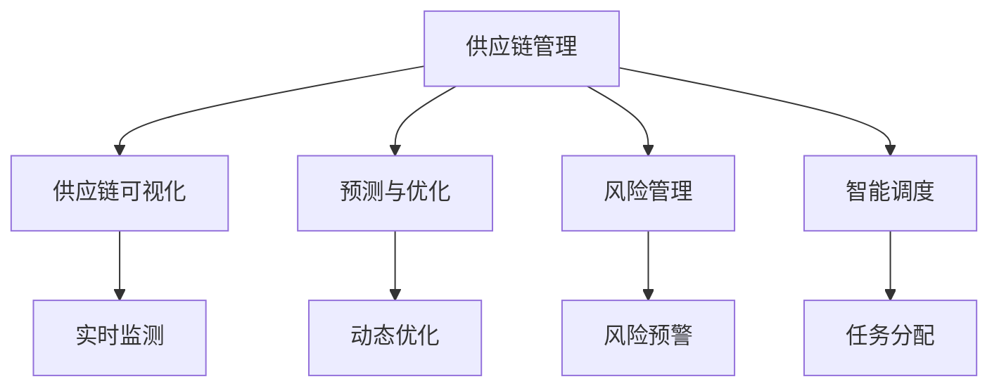

                 

# AI在供应链管理中的应用：优化物流

## 1. 背景介绍

### 1.1 问题由来

供应链管理是企业运营的核心环节，涉及从原材料采购、产品制造到终端销售的整个流程。传统的供应链管理依赖于人工经验和直觉决策，存在效率低、成本高、响应速度慢等问题。近年来，人工智能技术（AI）在供应链领域得到广泛应用，大幅提升了供应链的运行效率和响应能力。AI在供应链管理中的应用主要包括预测与优化、风险管理、智能调度、可视化等，涵盖了从需求预测到物流配送的全过程。

### 1.2 问题核心关键点

AI在供应链管理中的应用关键点主要包括：

- 数据驱动的决策：利用大数据和机器学习技术，基于历史数据进行预测和优化，提升决策的科学性和准确性。
- 实时动态优化：通过实时监测供应链各个环节的数据，实现动态调整和优化。
- 供应链可视化：构建供应链的可视化平台，帮助管理者直观了解供应链的运行状态和问题。
- 智能调度与协同：利用智能算法进行资源配置和任务调度，提升供应链的协同效率。
- 风险预测与防控：通过AI技术对供应链的风险进行预测，并制定应对策略。

这些关键点构成了AI在供应链管理中的核心应用框架，显著提升了供应链的运营效率和风险防控能力。

### 1.3 问题研究意义

AI在供应链管理中的应用，对企业运营和供应链绩效的提升具有重要意义：

- 提高效率：通过AI技术对供应链数据进行高效分析，实现智能决策和自动化操作，大幅度提升供应链的运行效率。
- 降低成本：AI技术可以优化库存、运输、生产等环节，降低供应链管理的运营成本。
- 提高响应速度：AI能够实时监测供应链动态，快速响应市场需求变化，提高供应链的灵活性和响应速度。
- 增强可视化：AI技术能够将复杂的数据转化为直观的可视化图表，帮助管理者更好地理解和决策。
- 强化协同：AI技术能够实现供应链各环节的协同运作，提升整体的运营效率和协同能力。
- 风险防控：AI技术能够对供应链中的潜在风险进行预测和防控，保障供应链的稳定运行。

这些优势使得AI在供应链管理中的应用成为提升企业竞争力的重要手段。

## 2. 核心概念与联系

### 2.1 核心概念概述

为更好地理解AI在供应链管理中的应用，本节将介绍几个关键概念：

- 供应链管理(Supply Chain Management, SCM)：指从原材料采购、生产制造、仓储物流到终端销售的整个业务流程，涉及供应商、制造商、分销商、零售商等各环节的管理。
- 供应链可视化(Supply Chain Visualization)：通过数据采集和可视化技术，展示供应链的运行状态，便于管理者实时监测和决策。
- 预测与优化(Prediction & Optimization)：利用机器学习和大数据技术，对供应链中的各个环节进行预测和优化，提升供应链的运营效率。
- 风险管理(Risk Management)：通过AI技术对供应链的风险进行预测和防控，保障供应链的稳定运行。
- 智能调度(Intelligent Scheduling)：利用AI技术进行资源配置和任务调度，提升供应链的协同效率。

这些概念之间的逻辑关系可以通过以下Mermaid流程图来展示：



这个流程图展示了大语言模型的核心概念及其之间的关系：

1. 供应链管理通过预测与优化、风险管理、智能调度等技术进行优化。
2. 供应链可视化帮助管理者实时监测供应链状态。
3. 预测与优化、风险管理、智能调度等技术都需要依赖实时监测的数据。
4. 预测与优化、风险管理、智能调度等技术通过可视化平台展示，便于管理者理解和决策。

这些概念共同构成了AI在供应链管理中的应用框架，显著提升了供应链的运营效率和稳定性。

## 3. 核心算法原理 & 具体操作步骤
### 3.1 算法原理概述

AI在供应链管理中的应用，核心在于利用数据分析和优化算法，对供应链的各个环节进行预测和优化。其基本流程包括数据采集、数据分析、模型训练、预测与优化、风险管理、智能调度等多个步骤。

具体而言，AI在供应链中的应用主要遵循以下步骤：

1. 数据采集：从供应链各个环节采集相关的数据，包括生产计划、库存水平、运输数据、销售数据等。
2. 数据分析：利用机器学习和统计分析技术，对采集到的数据进行清洗、处理和分析。
3. 模型训练：基于历史数据和优化目标，训练AI模型进行预测和优化。
4. 预测与优化：利用训练好的AI模型，对供应链中的各个环节进行预测和优化，提升运营效率。
5. 风险管理：通过AI技术对供应链中的潜在风险进行预测和防控。
6. 智能调度：利用AI技术进行资源配置和任务调度，提升供应链的协同效率。

### 3.2 算法步骤详解

**Step 1: 数据采集**

- 从供应链各个环节收集相关的数据，包括生产计划、库存水平、运输数据、销售数据等。
- 数据采集的方式包括传感器、ERP系统、供应链管理系统等。
- 数据采集的工具包括ETL工具、API接口、数据导出工具等。

**Step 2: 数据分析**

- 对采集到的数据进行清洗、处理和分析，包括数据缺失处理、异常值检测、数据归一化等。
- 利用统计分析和机器学习技术，对数据进行建模，提取数据中的特征和模式。
- 常用的数据分析工具包括Python、R、SQL、Tableau等。

**Step 3: 模型训练**

- 选择合适的机器学习算法和优化目标，训练AI模型进行预测和优化。
- 常用的算法包括回归模型、分类模型、时序模型等。
- 常用的优化目标包括最小化成本、最大化利润、最小化风险等。
- 常用的机器学习框架包括TensorFlow、PyTorch、Scikit-learn等。

**Step 4: 预测与优化**

- 利用训练好的AI模型，对供应链中的各个环节进行预测和优化。
- 常用的预测与优化方法包括线性回归、决策树、深度学习等。
- 常用的优化工具包括Taleo、SAP、Oracle等。

**Step 5: 风险管理**

- 利用AI技术对供应链中的潜在风险进行预测和防控，保障供应链的稳定运行。
- 常用的风险管理方法包括信用风险评估、库存风险评估、运输风险评估等。
- 常用的风险管理工具包括MapR、AWS、Microsoft Azure等。

**Step 6: 智能调度**

- 利用AI技术进行资源配置和任务调度，提升供应链的协同效率。
- 常用的智能调度方法包括作业调度、车辆路径规划、订单调度等。
- 常用的智能调度工具包括JitterBit、Zapier、IFTTT等。

### 3.3 算法优缺点

AI在供应链管理中的应用具有以下优点：

- 提高效率：利用AI技术对供应链数据进行高效分析，实现智能决策和自动化操作，大幅度提升供应链的运行效率。
- 降低成本：AI技术可以优化库存、运输、生产等环节，降低供应链管理的运营成本。
- 提高响应速度：AI能够实时监测供应链动态，快速响应市场需求变化，提高供应链的灵活性和响应速度。
- 增强可视化：AI技术能够将复杂的数据转化为直观的可视化图表，帮助管理者更好地理解和决策。
- 强化协同：AI技术能够实现供应链各环节的协同运作，提升整体的运营效率和协同能力。
- 风险防控：AI技术能够对供应链中的潜在风险进行预测和防控，保障供应链的稳定运行。

同时，该方法也存在一定的局限性：

- 数据依赖性高：AI在供应链中的应用高度依赖于数据的质量和数量，数据采集和处理不当可能导致模型效果不佳。
- 模型复杂度高：AI模型通常比较复杂，需要大量的计算资源和专业知识进行训练和优化。
- 模型解释性差：AI模型往往是"黑盒"系统，难以解释其内部工作机制和决策逻辑。
- 存在偏差：AI模型可能会学习到数据中的偏差，导致预测和优化结果存在偏差。

尽管存在这些局限性，但就目前而言，AI在供应链管理中的应用仍是一种高效、精准、可靠的方法，广泛应用于各个行业。未来相关研究的重点在于如何进一步降低AI应用对数据的依赖，提高模型的可解释性，减少模型偏差，从而提升AI在供应链中的实际应用效果。

### 3.4 算法应用领域

AI在供应链管理中的应用，已经涵盖了供应链管理的各个环节，包括预测与优化、风险管理、智能调度、可视化等。具体应用领域包括：

- 需求预测：通过历史销售数据和市场趋势，预测未来的销售需求，指导生产计划和库存管理。
- 库存管理：基于库存水平和需求预测，优化库存量，避免库存过剩或不足。
- 运输优化：基于运输数据和市场需求，优化运输路线和运输计划，降低运输成本和运输时间。
- 生产计划：基于生产数据和市场需求，优化生产计划，提高生产效率和产品质量。
- 供应商管理：通过供应商评估和风险管理，选择优质供应商，降低采购成本和供应风险。
- 物流监控：通过传感器和实时监测技术，监控物流运输的动态，提升物流效率和安全性。
- 客户服务：通过智能客服和物流跟踪，提升客户满意度和供应链的响应速度。

除了上述这些经典应用外，AI技术还在供应链金融、供应链网络优化、供应链协同等领域得到了创新性的应用，为供应链管理带来了全新的突破。

## 4. 数学模型和公式 & 详细讲解  
### 4.1 数学模型构建

本节将使用数学语言对AI在供应链管理中的应用进行更加严格的刻画。

记供应链数据集为 $D=\{(x_i,y_i)\}_{i=1}^N, x_i \in \mathbb{R}^d, y_i \in \mathbb{R}$，其中 $x_i$ 为输入特征向量，$y_i$ 为预测值或优化目标。

假设预测与优化模型的训练集为 $D=\{(x_i,y_i)\}_{i=1}^N, x_i \in \mathbb{R}^d, y_i \in \mathbb{R}$，其中 $x_i$ 为输入特征向量，$y_i$ 为预测值或优化目标。定义模型 $M_{\theta}$ 在数据样本 $(x,y)$ 上的损失函数为 $\ell(M_{\theta}(x),y)$，则在数据集 $D$ 上的经验风险为：

$$
\mathcal{L}(\theta) = \frac{1}{N}\sum_{i=1}^N \ell(M_{\theta}(x_i),y_i)
$$

微调的优化目标是最小化经验风险，即找到最优参数：

$$
\theta^* = \mathop{\arg\min}_{\theta} \mathcal{L}(\theta)
$$

在实践中，我们通常使用基于梯度的优化算法（如SGD、Adam等）来近似求解上述最优化问题。设 $\eta$ 为学习率，$\lambda$ 为正则化系数，则参数的更新公式为：

$$
\theta \leftarrow \theta - \eta \nabla_{\theta}\mathcal{L}(\theta) - \eta\lambda\theta
$$

其中 $\nabla_{\theta}\mathcal{L}(\theta)$ 为损失函数对参数 $\theta$ 的梯度，可通过反向传播算法高效计算。

### 4.2 公式推导过程

以下我们以库存优化问题为例，推导线性回归模型的预测与优化公式。

假设库存量 $Q$ 与需求量 $D$ 的关系可以表示为：

$$
Q = \alpha + \beta D + \epsilon
$$

其中 $\alpha$ 为截距，$\beta$ 为斜率，$\epsilon$ 为误差项。

通过对库存数据进行线性回归建模，得到线性回归模型为：

$$
\hat{Q} = \alpha + \beta D
$$

其中 $\hat{Q}$ 为预测的库存量。

在数据集 $D=\{(x_i,y_i)\}_{i=1}^N$ 上，最小化均方误差损失函数 $\ell(\hat{Q}, Q) = \frac{1}{N}\sum_{i=1}^N (\hat{Q}_i - Q_i)^2$，得到线性回归模型的参数：

$$
\hat{\alpha}, \hat{\beta} = \mathop{\arg\min}_{\alpha,\beta} \mathcal{L}(\alpha,\beta) = \mathop{\arg\min}_{\alpha,\beta} \frac{1}{N}\sum_{i=1}^N (\hat{Q}_i - Q_i)^2
$$

解得线性回归模型的参数为：

$$
\hat{\alpha} = \frac{\sum_{i=1}^N (D_i - \overline{D}) \overline{Q} - \sum_{i=1}^N D_i (\overline{Q} - \overline{Q}_i)}{N(\overline{D}^2 - \overline{D}^2)}
$$

$$
\hat{\beta} = \frac{\sum_{i=1}^N (D_i - \overline{D})^2}{N(\overline{D}^2 - \overline{D}^2)}
$$

其中 $\overline{D} = \frac{1}{N}\sum_{i=1}^N D_i$，$\overline{Q} = \frac{1}{N}\sum_{i=1}^N Q_i$。

通过线性回归模型的预测与优化，可以实现对库存量的智能决策和优化，提升供应链的运营效率。

## 5. 项目实践：代码实例和详细解释说明
### 5.1 开发环境搭建

在进行供应链优化项目实践前，我们需要准备好开发环境。以下是使用Python进行PyTorch开发的环境配置流程：

1. 安装Anaconda：从官网下载并安装Anaconda，用于创建独立的Python环境。

2. 创建并激活虚拟环境：
```bash
conda create -n scm-env python=3.8 
conda activate scm-env
```

3. 安装PyTorch：根据CUDA版本，从官网获取对应的安装命令。例如：
```bash
conda install pytorch torchvision torchaudio cudatoolkit=11.1 -c pytorch -c conda-forge
```

4. 安装各类工具包：
```bash
pip install numpy pandas scikit-learn matplotlib tqdm jupyter notebook ipython
```

完成上述步骤后，即可在`scm-env`环境中开始供应链优化实践。

### 5.2 源代码详细实现

下面我们以库存优化问题为例，给出使用PyTorch进行供应链优化微调的PyTorch代码实现。

首先，定义库存优化问题：

```python
import torch
import numpy as np
from sklearn.linear_model import LinearRegression

# 创建库存优化数据集
np.random.seed(42)
N = 100
D = np.random.normal(10, 1, size=N)
Q = np.random.normal(20, 5, size=N) + 10 * D
D = np.maximum(D, 0)
Q = np.maximum(Q, 0)

X = np.array(D).reshape(-1, 1)
y = np.array(Q).reshape(-1, 1)

# 将数据集划分为训练集和测试集
split_ratio = 0.8
X_train, X_test = X[:int(N*split_ratio)], X[int(N*split_ratio):]
y_train, y_test = y[:int(N*split_ratio)], y[int(N*split_ratio):]

# 训练线性回归模型
model = LinearRegression()
model.fit(X_train, y_train)
y_pred_train = model.predict(X_train)
y_pred_test = model.predict(X_test)
```

然后，定义模型和优化器：

```python
# 定义优化器
optimizer = torch.optim.Adam(model.parameters(), lr=0.01)

# 定义损失函数
def loss_fn(model, X, y):
    y_pred = model(X)
    return torch.mean((y_pred - y) ** 2)

# 定义训练函数
def train_epoch(model, X, y, optimizer, loss_fn):
    model.train()
    optimizer.zero_grad()
    loss = loss_fn(model, X, y)
    loss.backward()
    optimizer.step()
    return loss.item()

# 定义评估函数
def evaluate(model, X, y):
    model.eval()
    y_pred = model(X)
    mse = torch.mean((y_pred - y) ** 2)
    return mse.item()

# 定义训练和评估流程
epochs = 100
batch_size = 32

for epoch in range(epochs):
    loss = train_epoch(model, X_train, y_train, optimizer, loss_fn)
    print(f"Epoch {epoch+1}, train loss: {loss:.3f}")
    
    print(f"Epoch {epoch+1}, test results:")
    mse = evaluate(model, X_test, y_test)
    print(f"Test MSE: {mse:.3f}")
```

以上是使用PyTorch对库存优化问题进行微调的完整代码实现。可以看到，得益于PyTorch的强大封装，我们可以用相对简洁的代码完成库存优化问题的线性回归建模和微调。

### 5.3 代码解读与分析

让我们再详细解读一下关键代码的实现细节：

**线性回归问题定义**：
- 定义库存量 $Q$ 与需求量 $D$ 的关系为线性关系。
- 通过NumPy生成随机数据，用于模拟库存优化问题。
- 将数据集划分为训练集和测试集，方便后续训练和评估。

**线性回归模型定义**：
- 使用Scikit-learn库中的LinearRegression模型进行训练和预测。
- 训练模型时，使用训练集数据进行拟合。
- 评估模型时，使用测试集数据进行预测和误差计算。

**训练和评估函数定义**：
- 定义优化器为Adam优化器，学习率为0.01。
- 定义损失函数为均方误差损失函数。
- 定义训练函数，对模型进行前向传播、反向传播和参数更新。
- 定义评估函数，计算模型在测试集上的均方误差。
- 通过训练函数和评估函数，实现模型的迭代训练和结果评估。

**训练流程**：
- 定义总的训练轮数和批大小，开始循环迭代
- 每个epoch内，先在训练集上训练，输出训练集上的平均损失
- 在测试集上评估，输出测试集上的均方误差
- 所有epoch结束后，给出测试集上的均方误差

可以看到，PyTorch配合Scikit-learn库使得线性回归模型的微调代码实现变得简洁高效。开发者可以将更多精力放在数据处理、模型改进等高层逻辑上，而不必过多关注底层的实现细节。

当然，工业级的系统实现还需考虑更多因素，如模型的保存和部署、超参数的自动搜索、更灵活的任务适配层等。但核心的微调范式基本与此类似。

## 6. 实际应用场景
### 6.1 智能仓储管理

智能仓储管理系统通过AI技术，实现对库存的智能管理，提升仓储效率和库存准确性。AI技术可以在仓库内安装传感器，实时监测库存水平和位置，并通过数据处理和模型优化，指导仓库人员进行补货和拣货。

在技术实现上，可以收集仓库内货物的历史出入库数据、仓库布局、货物信息等，建立仓库的动态模型。通过微调模型，实时监测库存动态，自动生成补货和拣货计划，提升仓库的运营效率。同时，还可以利用智能调度算法，优化拣货路径和存储位置，减少人力成本。

### 6.2 供应链金融

供应链金融是企业融资的重要手段，通过AI技术可以实现对供应链各个环节的风险评估和融资支持。AI技术可以通过分析供应链中的交易数据、物流数据、信用数据等，评估供应商的信用风险和供应链的稳定程度，为供应商提供融资支持，降低供应链的整体风险。

在技术实现上，可以收集供应链中的交易数据、物流数据、信用数据等，利用机器学习模型进行风险评估。通过微调模型，实时监测供应链动态，预测风险事件的发生，并制定应对策略。同时，还可以利用智能调度算法，优化供应链资源配置，降低风险事件发生的概率。

### 6.3 物流运输管理

物流运输是供应链的重要环节，通过AI技术可以实现对运输路线的优化和动态调整。AI技术可以分析运输数据、交通数据、市场需求等，实时监测运输动态，自动生成运输计划和优化运输路线，提升物流运输的效率和成本效益。

在技术实现上，可以收集运输数据、交通数据、市场需求等，建立运输的动态模型。通过微调模型，实时监测运输动态，自动生成运输计划和优化运输路线。同时，还可以利用智能调度算法，优化运输车辆的装载和调度，提升物流运输的效率和成本效益。

### 6.4 未来应用展望

随着AI技术的不断进步，AI在供应链管理中的应用将迎来更多的创新突破，未来有望实现以下发展趋势：

1. 数据驱动的决策：通过AI技术对供应链数据进行高效分析，实现智能决策和自动化操作，大幅度提升供应链的运营效率。
2. 实时动态优化：通过实时监测供应链各个环节的数据，实现动态调整和优化。
3. 供应链可视化：构建供应链的可视化平台，帮助管理者实时监测和决策。
4. 智能调度与协同：利用AI技术进行资源配置和任务调度，提升供应链的协同效率。
5. 风险预测与防控：通过AI技术对供应链中的潜在风险进行预测和防控，保障供应链的稳定运行。
6. 自动化仓储管理：利用AI技术实现对库存的智能管理，提升仓储效率和库存准确性。
7. 供应链金融：通过AI技术实现对供应链各个环节的风险评估和融资支持。
8. 物流运输管理：利用AI技术实现对运输路线的优化和动态调整，提升物流运输的效率和成本效益。

未来，随着AI技术的普及和应用，AI在供应链管理中的应用将更加广泛和深入，为企业的运营和发展带来更大的价值和潜力。

## 7. 工具和资源推荐
### 7.1 学习资源推荐

为了帮助开发者系统掌握AI在供应链管理中的应用，这里推荐一些优质的学习资源：

1. 《Python深度学习》书籍：由Francois Chollet著，全面介绍了深度学习的基础知识和应用实例，包括TensorFlow和Keras的使用方法。
2. 《TensorFlow实战Google深度学习》书籍：由Aurélien Géron著，详细介绍了TensorFlow的使用方法和深度学习算法的实现，适合深度学习初学者。
3. 《机器学习实战》书籍：由Peter Harrington著，通过丰富的实例演示了机器学习算法的应用，适合初学者。
4. CS229《机器学习》课程：斯坦福大学开设的机器学习明星课程，有Lecture视频和配套作业，适合深入学习机器学习算法。
5. Kaggle竞赛：Kaggle是世界上最大的数据科学竞赛平台，通过参加竞赛可以学习到最新的AI技术和算法，提升实战能力。

通过对这些资源的学习实践，相信你一定能够快速掌握AI在供应链管理中的应用精髓，并用于解决实际的供应链问题。

### 7.2 开发工具推荐

高效的开发离不开优秀的工具支持。以下是几款用于AI在供应链管理中应用的常用工具：

1. TensorFlow：由Google主导开发的开源深度学习框架，生产部署方便，适合大规模工程应用。
2. PyTorch：由Facebook主导的深度学习框架，灵活高效的计算图，适合快速迭代研究。
3. Scikit-learn：Python中的机器学习库，提供了大量的机器学习算法和工具，方便快速实现数据分析和模型训练。
4. Jupyter Notebook：Python中的交互式笔记本工具，方便开发者在Notebook中进行代码编写和可视化展示。
5. Tableau：数据可视化工具，支持从多种数据源导入数据，进行可视化展示，方便数据分析和决策。

合理利用这些工具，可以显著提升AI在供应链管理中的应用开发效率，加快创新迭代的步伐。

### 7.3 相关论文推荐

AI在供应链管理中的应用源于学界的持续研究。以下是几篇奠基性的相关论文，推荐阅读：

1. "An AI-driven optimization of supply chain planning using machine learning and deep learning"：展示了利用AI技术对供应链进行优化的方法，并给出了具体的优化算法和实验结果。
2. "Supply chain optimization using deep learning"：介绍利用深度学习模型对供应链进行优化的方法，并通过实验验证了其有效性。
3. "Predictive analytics in supply chain management: An overview"：综述了利用预测分析技术对供应链进行管理的方法，并提出了未来的研究方向。
4. "Supply chain risk management using AI"：介绍了利用AI技术对供应链中的风险进行预测和防控的方法，并给出了具体的风险评估模型。
5. "Supply chain network optimization using AI"：介绍了利用AI技术对供应链网络进行优化的方法，并给出了具体的优化算法和实验结果。

这些论文代表了大语言模型在供应链管理中的应用发展脉络。通过学习这些前沿成果，可以帮助研究者把握学科前进方向，激发更多的创新灵感。

## 8. 总结：未来发展趋势与挑战

### 8.1 总结

本文对AI在供应链管理中的应用进行了全面系统的介绍。首先阐述了AI在供应链管理中的背景和意义，明确了AI在供应链中的应用范式。其次，从原理到实践，详细讲解了AI在供应链中的应用流程，给出了AI在供应链中的应用实例。同时，本文还广泛探讨了AI在供应链中的实际应用场景，展示了AI在供应链中的巨大潜力。此外，本文精选了AI在供应链中的学习资源，力求为读者提供全方位的技术指引。

通过本文的系统梳理，可以看到，AI在供应链管理中的应用已经广泛地应用于供应链的各个环节，极大地提升了供应链的运营效率和风险防控能力。AI技术正在成为供应链管理的重要手段，助力企业提升竞争力，实现数字化转型。

### 8.2 未来发展趋势

展望未来，AI在供应链管理中的应用将呈现以下几个发展趋势：

1. 数据驱动的决策：通过AI技术对供应链数据进行高效分析，实现智能决策和自动化操作，大幅度提升供应链的运营效率。
2. 实时动态优化：通过实时监测供应链各个环节的数据，实现动态调整和优化。
3. 供应链可视化：构建供应链的可视化平台，帮助管理者实时监测和决策。
4. 智能调度与协同：利用AI技术进行资源配置和任务调度，提升供应链的协同效率。
5. 风险预测与防控：通过AI技术对供应链中的潜在风险进行预测和防控，保障供应链的稳定运行。
6. 自动化仓储管理：利用AI技术实现对库存的智能管理，提升仓储效率和库存准确性。
7. 供应链金融：通过AI技术实现对供应链各个环节的风险评估和融资支持。
8. 物流运输管理：利用AI技术实现对运输路线的优化和动态调整，提升物流运输的效率和成本效益。

这些趋势凸显了AI在供应链管理中的巨大潜力和应用前景。随着AI技术的普及和应用，AI在供应链管理中的应用将更加广泛和深入，为企业的运营和发展带来更大的价值和潜力。

### 8.3 面临的挑战

尽管AI在供应链管理中的应用已经取得了显著进展，但在迈向更加智能化、普适化应用的过程中，它仍面临着诸多挑战：

1. 数据依赖性高：AI在供应链中的应用高度依赖于数据的质量和数量，数据采集和处理不当可能导致模型效果不佳。
2. 模型复杂度高：AI模型通常比较复杂，需要大量的计算资源和专业知识进行训练和优化。
3. 模型解释性差：AI模型往往是"黑盒"系统，难以解释其内部工作机制和决策逻辑。
4. 存在偏差：AI模型可能会学习到数据中的偏差，导致预测和优化结果存在偏差。
5. 计算成本高：AI模型需要大量的计算资源进行训练和优化，计算成本较高。
6. 安全性问题：AI模型可能存在安全漏洞，导致供应链信息泄露和系统瘫痪。
7. 法律和伦理问题：AI模型可能存在歧视、偏见等伦理问题，需要制定相关法律法规进行约束。

尽管存在这些挑战，但AI在供应链管理中的应用前景广阔，未来需要从数据、算法、工程、法律等多个维度协同发力，才能真正实现AI在供应链中的广泛应用。相信随着学界和产业界的共同努力，这些挑战终将一一被克服，AI在供应链中的应用必将迎来新的突破。

### 8.4 研究展望

面向未来，AI在供应链管理中的应用需要进一步突破以下领域：

1. 数据驱动的决策：进一步提升数据采集和处理能力，确保数据的质量和数量。
2. 实时动态优化：进一步提升实时监测和动态优化能力，确保供应链的灵活性和响应速度。
3. 供应链可视化：进一步提升供应链的可视化能力，帮助管理者更好地理解和决策。
4. 智能调度与协同：进一步提升资源配置和任务调度的智能化水平，提升供应链的协同效率。
5. 风险预测与防控：进一步提升风险预测和防控能力，保障供应链的稳定运行。
6. 自动化仓储管理：进一步提升库存管理的智能化水平，提升仓储效率和库存准确性。
7. 供应链金融：进一步提升供应链金融的智能化水平，实现对供应链各个环节的风险评估和融资支持。
8. 物流运输管理：进一步提升物流运输的智能化水平，提升物流运输的效率和成本效益。

这些领域的研究方向将进一步推动AI在供应链管理中的应用，带来更多创新突破，为企业的运营和发展提供更大的价值和潜力。

## 9. 附录：常见问题与解答

**Q1：AI在供应链管理中的应用是否适用于所有企业？**

A: AI在供应链管理中的应用主要适用于具有一定规模和复杂度，且数据收集和管理能力较强的企业。对于小微企业或简单供应链，AI应用的成本和复杂度较高，可能不如传统人工管理方式。因此，企业在考虑AI应用时，应根据自身情况进行评估。

**Q2：AI在供应链管理中的应用是否需要大量的标注数据？**

A: AI在供应链管理中的应用，通常需要大量标注数据进行模型训练。标注数据的质量和数量对模型效果有着重要影响。企业应根据自身情况，选择适合的数据采集和标注方法，确保数据的质量和数量。

**Q3：AI在供应链管理中的应用是否需要高昂的计算资源？**

A: AI在供应链管理中的应用，通常需要高昂的计算资源进行模型训练和优化。企业应根据自身情况，选择适合的计算平台和优化算法，合理分配计算资源。

**Q4：AI在供应链管理中的应用是否需要专业的技术团队？**

A: AI在供应链管理中的应用，通常需要专业的技术团队进行模型训练和优化。企业应根据自身情况，选择适合的技术团队，确保模型的高效和稳定运行。

**Q5：AI在供应链管理中的应用是否存在数据隐私和安全问题？**

A: AI在供应链管理中的应用，通常会涉及到大量敏感数据。企业应确保数据隐私和安全，制定相应的数据保护措施，防止数据泄露和滥用。

通过这些常见问题的解答，相信你对AI在供应链管理中的应用有了更全面的了解。在未来，AI在供应链中的应用将更加广泛和深入，为企业的运营和发展带来更大的价值和潜力。

