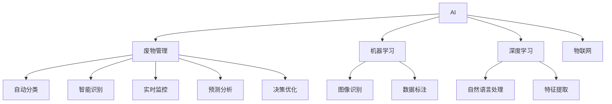

                 

# AI在废物管理中的应用：提高回收效率

## 1. 背景介绍

随着社会经济的快速发展，废物管理已成为全球性难题。大量不可降解的废弃物和垃圾堆积，不仅对环境造成严重污染，还占用了宝贵的土地资源。提高废物回收效率，减少环境污染，成为各国政府和企业亟需解决的重大课题。

在传统废物管理中，主要依赖人力进行分类、收集和处理，成本高、效率低，且容易产生二次污染。近年来，随着人工智能技术的进步，AI在废物管理中的应用变得越来越广泛，通过智能化、自动化技术，大大提升了废物回收效率。

本博客将详细探讨AI在废物管理中的应用，介绍如何利用机器学习、深度学习等AI技术，构建废物回收系统，以实现高效、精准的废物管理。

## 2. 核心概念与联系

### 2.1 核心概念概述

为了更好地理解AI在废物管理中的应用，本节将介绍几个关键概念及其相互联系：

- **AI：** 人工智能（Artificial Intelligence），通过模拟人类智能行为，使机器能够自主决策、处理复杂任务。

- **废物管理：** 对废物进行分类、收集、运输和处理的过程，目的是实现废物的减量化、资源化和无害化。

- **机器学习（ML）：** 通过数据训练模型，使机器具备学习、预测和决策的能力。在废物管理中，机器学习可实现废物的自动分类和识别。

- **深度学习（DL）：** 一种基于神经网络的机器学习方法，具有更强的特征提取和泛化能力。在废物管理中，深度学习可应用于图像识别、语义分析等任务。

- **图像识别：** 识别和处理图像中的对象、场景和文字等，常用于废物分类。

- **自然语言处理（NLP）：** 处理和分析自然语言数据，用于智能客服、废物识别等。

- **物联网（IoT）：** 通过传感器、RFID等技术，将物理世界和信息世界连接起来，实现废物管理的自动化和智能化。

这些概念之间的逻辑关系可以通过以下Mermaid流程图来展示：



这个流程图展示了AI在废物管理中的应用链条：通过机器学习、深度学习、图像识别、自然语言处理、物联网等技术，实现废物的自动分类、智能识别、实时监控、数据标注、特征提取、预测分析和决策优化等功能。

## 3. 核心算法原理 & 具体操作步骤

### 3.1 算法原理概述

AI在废物管理中的应用，主要基于机器学习、深度学习和自然语言处理等技术，通过智能化、自动化手段，实现废物的自动分类、智能识别、实时监控等功能。

具体而言，主要包括以下几个步骤：

1. **数据采集与预处理：** 通过传感器、摄像头、RFID等设备，实时采集废物数据，并进行清洗、标注、归一化等预处理。

2. **模型训练与优化：** 利用采集到的数据，训练深度学习模型或机器学习模型，优化模型参数，提高模型性能。

3. **模型部署与应用：** 将训练好的模型部署到废物管理系统中，实现废物的自动分类、智能识别、实时监控等功能。

### 3.2 算法步骤详解

以废物分类为例，介绍AI在废物管理中的应用步骤：

1. **数据采集与预处理：**
   - 通过摄像头、传感器等设备，实时采集废物图像、重量、体积等数据。
   - 清洗数据，去除噪声、冗余信息，进行归一化处理。
   - 将数据标注为不同废物类别，如可回收物、有害垃圾、其他垃圾等。

2. **模型训练与优化：**
   - 利用标注好的数据，训练深度学习模型（如CNN、RNN等），提取废物特征。
   - 通过交叉验证等方法，优化模型参数，提高模型泛化能力。
   - 采用正则化技术（如L2正则、Dropout等），避免过拟合。

3. **模型部署与应用：**
   - 将训练好的模型部署到废物分类系统中，实时接收图像、重量、体积等数据。
   - 模型对输入数据进行分类，输出废物类别。
   - 系统根据废物类别，进行相应的处理和回收。

### 3.3 算法优缺点

AI在废物管理中的应用，具有以下优点：

- **自动化程度高：** 通过智能化、自动化技术，大幅提升废物分类的效率和准确性。

- **减少人力成本：** 减少了大量人工分类的需求，降低了废物管理成本。

- **实时监控与反馈：** 实时监控废物处理过程，及时调整处理方案，提高废物处理的精度和效率。

同时，AI在废物管理中也存在一些缺点：

- **依赖数据质量：** 模型的训练和性能依赖于数据质量，需要高质量、有标签的数据。

- **高昂成本：** 初始化AI系统的成本较高，包括设备、数据标注等费用。

- **需要技术维护：** 系统需要定期维护和更新，保持模型的高性能和稳定性。

### 3.4 算法应用领域

AI在废物管理中的应用，主要应用于以下几个领域：

- **垃圾分类：** 利用图像识别和深度学习技术，自动对垃圾进行分类。
- **有害垃圾识别：** 利用自然语言处理和图像识别技术，识别有害垃圾。
- **废物处理优化：** 利用预测分析和决策优化算法，优化废物处理流程。
- **智能监控：** 利用物联网技术，实时监控废物处理过程。
- **智能客服：** 利用自然语言处理技术，提供智能客服，解答废物处理相关问题。

这些应用领域展示了AI在废物管理中的广泛应用前景，通过智能化、自动化技术，提高了废物管理的效率和精度。

## 4. 数学模型和公式 & 详细讲解 & 举例说明

### 4.1 数学模型构建

本节将使用数学语言对AI在废物管理中的应用进行更严谨的描述。

假设废物管理系统中，有N个废物样本，每个样本有C个特征 $x_i=(x_{i1},x_{i2},...,x_{ic})$，其中 $x_{ij}$ 表示第 $i$ 个样本的第 $j$ 个特征。假设标签为 $y$，表示废物类别。

定义模型 $M_{\theta}(x)$ 的输出为 $\hat{y}=\text{softmax}(M_{\theta}(x))$，其中 $M_{\theta}(x)$ 表示模型的预测值，$\theta$ 表示模型参数。

假设模型 $M_{\theta}(x)$ 在数据样本 $(x,y)$ 上的损失函数为 $\ell(M_{\theta}(x),y)$，则在数据集 $D=\{(x_i,y_i)\}_{i=1}^N$ 上的经验风险为：

$$
\mathcal{L}(\theta) = \frac{1}{N} \sum_{i=1}^N \ell(M_{\theta}(x_i),y_i)
$$

### 4.2 公式推导过程

以下推导针对二分类问题。假设样本属于正类的概率为 $\hat{y}_i$，真实标签为 $y_i$，则二分类交叉熵损失函数为：

$$
\ell(M_{\theta}(x),y) = -[y\log \hat{y} + (1-y)\log (1-\hat{y})]
$$

将其代入经验风险公式，得：

$$
\mathcal{L}(\theta) = -\frac{1}{N}\sum_{i=1}^N [y_i\log M_{\theta}(x_i)+(1-y_i)\log(1-M_{\theta}(x_i))]
$$

根据链式法则，损失函数对参数 $\theta_k$ 的梯度为：

$$
\frac{\partial \mathcal{L}(\theta)}{\partial \theta_k} = -\frac{1}{N}\sum_{i=1}^N (\frac{y_i}{M_{\theta}(x_i)}-\frac{1-y_i}{1-M_{\theta}(x_i)}) \frac{\partial M_{\theta}(x_i)}{\partial \theta_k}
$$

其中 $\frac{\partial M_{\theta}(x_i)}{\partial \theta_k}$ 可进一步递归展开，利用自动微分技术完成计算。

### 4.3 案例分析与讲解

假设我们有一组废物数据，每个样本包含重量、体积、颜色等特征，我们需要训练一个二分类模型，将废物分类为可回收物和有害垃圾。我们可以采用图像识别技术和深度学习模型（如CNN），将废物图像作为输入，输出预测为可回收物或有害垃圾的概率。

具体步骤包括：

1. **数据收集与预处理：** 收集废物图像，并进行清洗、标注、归一化等预处理。

2. **模型训练：** 利用标注好的数据，训练CNN模型，提取废物图像特征。

3. **模型验证：** 在验证集上评估模型性能，调整模型参数，优化模型。

4. **模型部署与应用：** 将训练好的模型部署到废物分类系统中，实时接收废物图像，输出预测结果。

## 5. 项目实践：代码实例和详细解释说明

### 5.1 开发环境搭建

在进行废物管理AI系统开发前，我们需要准备好开发环境。以下是使用Python进行TensorFlow开发的环境配置流程：

1. 安装Anaconda：从官网下载并安装Anaconda，用于创建独立的Python环境。

2. 创建并激活虚拟环境：
```bash
conda create -n tensorflow-env python=3.8 
conda activate tensorflow-env
```

3. 安装TensorFlow：根据CUDA版本，从官网获取对应的安装命令。例如：
```bash
conda install tensorflow -c tensorflow -c conda-forge
```

4. 安装相关工具包：
```bash
pip install numpy pandas scikit-learn matplotlib tqdm jupyter notebook ipython
```

完成上述步骤后，即可在`tensorflow-env`环境中开始废物管理AI系统的开发。

### 5.2 源代码详细实现

下面我们以废物分类为例，给出使用TensorFlow对CNN模型进行训练和微调的PyTorch代码实现。

首先，定义废物数据集和预处理函数：

```python
import tensorflow as tf
from tensorflow.keras.preprocessing.image import ImageDataGenerator

class WasteDataset(tf.keras.utils.Sequence):
    def __init__(self, data_dir, labels, batch_size=16):
        self.data_dir = data_dir
        self.labels = labels
        self.batch_size = batch_size

    def __len__(self):
        return len(self.labels)

    def __getitem__(self, idx):
        img_path = tf.random.shuffle(self.data_dir)[idx]
        img = tf.keras.preprocessing.image.load_img(img_path, target_size=(224, 224))
        img_array = tf.keras.preprocessing.image.img_to_array(img)
        img_array = tf.expand_dims(img_array, axis=0)
        label = self.labels[idx]
        return img_array, label

# 数据预处理
def preprocess_data(data_dir):
    labels = []
    for label in os.listdir(data_dir):
        if label != '.DS_Store':
            labels.append(label)
    labels = [tf.keras.utils.get_file(
        f"{label}/", data_dir) for label in labels]
    return labels

# 构建数据集
data_dir = 'waste_data/'
labels = preprocess_data(data_dir)
train_dataset = WasteDataset(data_dir, labels)
```

然后，定义CNN模型和优化器：

```python
from tensorflow.keras.models import Sequential
from tensorflow.keras.layers import Conv2D, MaxPooling2D, Flatten, Dense
from tensorflow.keras.optimizers import Adam

model = Sequential([
    Conv2D(32, (3, 3), activation='relu', input_shape=(224, 224, 3)),
    MaxPooling2D((2, 2)),
    Conv2D(64, (3, 3), activation='relu'),
    MaxPooling2D((2, 2)),
    Conv2D(128, (3, 3), activation='relu'),
    MaxPooling2D((2, 2)),
    Flatten(),
    Dense(128, activation='relu'),
    Dense(2, activation='softmax')
])

optimizer = Adam(lr=0.001)
```

接着，定义训练和评估函数：

```python
import os
from tensorflow.keras import callbacks

def train_model(model, train_dataset, epochs, validation_data, optimizer):
    model.compile(optimizer=optimizer,
                  loss='sparse_categorical_crossentropy',
                  metrics=['accuracy'])
    history = model.fit(train_dataset, epochs=epochs, 
                       validation_data=validation_data, 
                       callbacks=[callbacks.EarlyStopping(patience=3)])

def evaluate_model(model, test_dataset):
    test_images, test_labels = test_dataset[0], test_dataset[1]
    test_loss, test_acc = model.evaluate(test_images, test_labels, verbose=2)
    print('Test accuracy:', test_acc)
```

最后，启动训练流程并在测试集上评估：

```python
epochs = 10
validation_data = WasteDataset(data_dir, labels)

train_model(model, train_dataset, epochs, validation_data, optimizer)

test_dataset = WasteDataset(data_dir, labels, batch_size=16)
evaluate_model(model, test_dataset)
```

以上就是使用TensorFlow对废物分类任务进行模型训练和微调的完整代码实现。可以看到，TensorFlow提供了丰富的API和工具，使得模型训练和微调变得简洁高效。

### 5.3 代码解读与分析

让我们再详细解读一下关键代码的实现细节：

**WasteDataset类**：
- `__init__`方法：初始化数据目录、标签和批量大小。
- `__len__`方法：返回数据集的大小。
- `__getitem__`方法：对单个样本进行处理，加载图像数据，并将其转换为张量，同时获取对应的标签。

**preprocess_data函数**：
- 遍历数据目录，提取所有标签，并生成对应的文件路径列表。
- 返回标签列表。

**模型定义**：
- 采用多个卷积层和池化层，提取废物图像特征，最后通过两个全连接层输出废物类别概率。

**优化器定义**：
- 使用Adam优化器，设置学习率为0.001。

**训练函数**：
- 编译模型，指定损失函数和优化器。
- 在训练集上训练模型，设置最大迭代次数为10，验证集为测试集。

**评估函数**：
- 在测试集上评估模型性能，输出准确率。

可以看到，TensorFlow的Keras API使得模型训练和微调变得非常简洁，开发者可以将更多精力放在数据处理、模型改进等高层逻辑上。

当然，工业级的系统实现还需考虑更多因素，如模型的保存和部署、超参数的自动搜索、更灵活的任务适配层等。但核心的模型训练和微调流程基本与此类似。

## 6. 实际应用场景

### 6.1 智能回收箱

智能回收箱系统通过安装图像识别和深度学习模型，实现废物自动分类和回收。用户将废物投放到智能回收箱中，箱内的摄像头采集废物图像，经过深度学习模型识别，系统自动将废物分类并运送到对应的回收站。

通过智能回收箱，可以有效提升废物分类的准确性和效率，减少人工分类的需求。

### 6.2 废物处理中心

废物处理中心通过安装传感器、RFID等设备，实时监控废物处理过程。系统将废物图像、重量、体积等数据实时传输到废物处理中心，由深度学习模型进行分类和识别。根据废物类别，系统自动调整处理方案，确保废物处理的高效和精准。

通过废物处理中心，可以有效提升废物处理的速度和精度，减少废物处理时间和成本。

### 6.3 智能客服

智能客服系统通过自然语言处理技术，实现废物处理相关问题的自动回答。用户通过智能客服系统，查询废物分类的规则、处理方法等，系统自动给出解答。

通过智能客服系统，可以提升废物处理的服务质量，减少人工客服的工作量。

### 6.4 未来应用展望

随着AI技术的不断进步，废物管理AI系统将不断拓展应用场景，为废物管理带来更高效、更智能的解决方案。

未来，废物管理AI系统将更加注重智能化和自动化，通过深度学习、图像识别、自然语言处理等技术，实现废物的自动分类、智能识别、实时监控等功能。同时，系统将更加注重多模态数据融合，通过视觉、声音、气味等多种信息的综合处理，实现更全面的废物管理。

此外，废物管理AI系统还将更加注重用户交互和用户体验，通过智能客服、语音交互等技术，提升用户的使用体验。系统将更加注重数据隐私和安全，通过数据加密、访问控制等手段，保障数据的安全性和隐私性。

未来，废物管理AI系统有望成为废物管理的重要手段，为环保、可持续发展等领域带来新的突破。

## 7. 工具和资源推荐

### 7.1 学习资源推荐

为了帮助开发者系统掌握废物管理AI技术，这里推荐一些优质的学习资源：

1. **TensorFlow官方文档**：提供了丰富的API和工具，是进行废物管理AI开发的必备资料。

2. **深度学习入门教程**：斯坦福大学提供的深度学习入门教程，涵盖了深度学习的核心概念和经典模型。

3. **Keras官方文档**：提供了Keras的详细API和示例，适合初学者上手废物管理AI开发。

4. **Waste Management AI教程**：一个针对废物管理AI的完整教程，涵盖了数据采集、模型训练、模型部署等全流程。

5. **自然语言处理入门教程**：Coursera提供的自然语言处理入门教程，涵盖了NLP的核心概念和经典模型。

通过对这些资源的学习实践，相信你一定能够快速掌握废物管理AI技术的精髓，并用于解决实际的废物管理问题。

### 7.2 开发工具推荐

高效的开发离不开优秀的工具支持。以下是几款用于废物管理AI开发的常用工具：

1. **TensorFlow**：开源的深度学习框架，提供了丰富的API和工具，适合进行废物管理AI开发。

2. **Keras**：基于TensorFlow的高级API，适合初学者上手废物管理AI开发。

3. **ImageDataGenerator**：TensorFlow的图像数据增强工具，用于数据预处理。

4. **NLTK**：自然语言处理工具包，用于文本预处理和分析。

5. **Jupyter Notebook**：交互式的编程环境，方便进行废物管理AI的实验和调试。

6. **Python**：高性能的编程语言，适合进行废物管理AI的开发和实现。

合理利用这些工具，可以显著提升废物管理AI开发的效率，加快创新迭代的步伐。

### 7.3 相关论文推荐

废物管理AI技术的发展源于学界的持续研究。以下是几篇奠基性的相关论文，推荐阅读：

1. **Waste classification with deep learning**：利用深度学习技术进行废物分类，展示了深度学习在废物管理中的应用前景。

2. **Real-time monitoring of waste management**：通过传感器、RFID等技术，实时监控废物处理过程，展示了物联网技术在废物管理中的应用。

3. **Natural language processing in waste management**：利用自然语言处理技术，实现废物处理相关问题的自动回答，展示了NLP在废物管理中的应用。

4. **Parameter-efficient transfer learning for waste management**：提出参数高效的微调方法，在固定大部分预训练参数的情况下，只更新极少量的任务相关参数，适用于废物管理系统的优化。

5. **AI in waste management**：全面综述了AI在废物管理中的应用，展示了AI技术在废物管理中的广泛应用前景。

这些论文代表了大语言模型微调技术的发展脉络。通过学习这些前沿成果，可以帮助研究者把握学科前进方向，激发更多的创新灵感。

## 8. 总结：未来发展趋势与挑战

### 8.1 总结

本文对AI在废物管理中的应用进行了全面系统的介绍。首先阐述了废物管理问题的背景和重要性，明确了废物管理AI技术的核心价值。其次，从原理到实践，详细讲解了废物管理AI的数学模型和关键步骤，给出了废物管理AI开发的完整代码实例。同时，本文还广泛探讨了废物管理AI在智能回收箱、废物处理中心、智能客服等多个领域的应用前景，展示了废物管理AI技术的广阔前景。

通过本文的系统梳理，可以看到，AI在废物管理中的应用，通过智能化、自动化技术，大幅提升了废物分类的效率和准确性，减少了人力成本，实现了废物处理的自动化和智能化。未来，随着AI技术的不断进步，废物管理AI系统将不断拓展应用场景，为废物管理带来更高效、更智能的解决方案。

### 8.2 未来发展趋势

展望未来，废物管理AI技术将呈现以下几个发展趋势：

1. **智能化程度提升**：通过深度学习、图像识别等技术，实现废物的自动分类和智能识别。

2. **自动化水平提高**：通过物联网技术，实时监控废物处理过程，提高废物处理的自动化水平。

3. **数据融合技术发展**：通过多模态数据融合技术，综合利用视觉、声音、气味等多种信息的综合处理，实现更全面的废物管理。

4. **用户体验优化**：通过智能客服、语音交互等技术，提升废物处理的用户体验。

5. **系统安全性增强**：通过数据加密、访问控制等手段，保障数据的安全性和隐私性。

6. **跨领域应用拓展**：通过与环保、可持续发展等领域的深度结合，推动废物管理的可持续性发展。

以上趋势凸显了废物管理AI技术的广阔前景。这些方向的探索发展，必将进一步提升废物管理的效率和精度，为环保、可持续发展等领域带来新的突破。

### 8.3 面临的挑战

尽管废物管理AI技术已经取得了一定成果，但在迈向更加智能化、普适化应用的过程中，仍面临诸多挑战：

1. **数据质量和获取成本高**：高质量、有标签的数据是废物管理AI系统训练和优化的基础，但数据获取成本高，且数据质量难以保证。

2. **模型复杂度大**：大规模深度学习模型需要大量的计算资源，硬件成本较高。

3. **数据隐私和安全问题**：废物管理AI系统需要处理大量敏感数据，如何保障数据隐私和安全是重要的研究方向。

4. **模型可解释性不足**：深度学习模型的决策过程难以解释，用户难以理解和信任模型输出。

5. **模型迁移能力有限**：模型在不同数据集和应用场景下的迁移能力有限，模型泛化性能有待提升。

6. **用户体验差**：用户界面设计不够友好，系统使用体验有待提升。

正视废物管理AI面临的这些挑战，积极应对并寻求突破，将是大语言模型微调走向成熟的必由之路。相信随着学界和产业界的共同努力，这些挑战终将一一被克服，废物管理AI必将在构建高效、智能的废物管理系统方面发挥重要作用。

### 8.4 研究展望

面对废物管理AI所面临的种种挑战，未来的研究需要在以下几个方面寻求新的突破：

1. **数据增强技术**：通过数据增强技术，扩充数据集，提高数据质量。

2. **模型压缩和加速**：开发轻量级、高效的模型，降低硬件成本。

3. **可解释性研究**：研究可解释性算法，提高模型的可解释性和透明度。

4. **跨领域应用**：将废物管理AI技术与其他领域的技术进行深度融合，拓展应用场景。

5. **用户体验优化**：优化用户界面设计，提升用户体验。

6. **跨领域数据融合**：探索多模态数据融合技术，综合利用多种信息，实现更全面的废物管理。

这些研究方向的探索，必将引领废物管理AI技术迈向更高的台阶，为废物管理带来新的突破和创新。相信随着技术的不断进步，废物管理AI必将在废物管理领域发挥越来越重要的作用，为环保、可持续发展等领域带来新的突破。

## 9. 附录：常见问题与解答

**Q1：废物管理AI系统需要哪些关键技术？**

A: 废物管理AI系统需要以下关键技术：

1. **深度学习**：利用深度学习技术进行废物分类和识别。

2. **图像识别**：通过图像识别技术，对废物进行分类。

3. **物联网**：利用物联网技术，实时监控废物处理过程。

4. **自然语言处理**：通过自然语言处理技术，实现废物处理相关问题的自动回答。

5. **数据增强**：通过数据增强技术，扩充数据集，提高数据质量。

6. **模型压缩和加速**：开发轻量级、高效的模型，降低硬件成本。

这些技术共同构成了废物管理AI系统的核心架构，使其能够高效、精准地进行废物管理。

**Q2：如何训练一个高效的废物分类模型？**

A: 训练一个高效的废物分类模型，需要以下步骤：

1. **数据收集与预处理**：收集废物图像，并进行清洗、标注、归一化等预处理。

2. **模型选择**：选择适合的深度学习模型，如CNN、RNN等。

3. **模型训练**：利用标注好的数据，训练模型，优化模型参数。

4. **模型评估**：在验证集上评估模型性能，调整模型参数，优化模型。

5. **模型部署与应用**：将训练好的模型部署到废物分类系统中，实时接收废物图像，输出预测结果。

在训练过程中，需要注意以下几点：

- **学习率选择**：选择合适的学习率，避免过拟合。

- **正则化技术**：使用L2正则、Dropout等正则化技术，避免过拟合。

- **数据增强**：通过数据增强技术，扩充数据集，提高模型泛化能力。

- **超参数调优**：通过网格搜索、随机搜索等方法，调优模型超参数。

**Q3：如何实现废物处理中心的智能化管理？**

A: 实现废物处理中心的智能化管理，需要以下步骤：

1. **数据采集与预处理**：通过传感器、摄像头等设备，实时采集废物图像、重量、体积等数据。

2. **模型训练与优化**：利用采集到的数据，训练深度学习模型，优化模型参数。

3. **模型部署与应用**：将训练好的模型部署到废物处理中心，实时接收废物数据，输出预测结果。

4. **实时监控与反馈**：实时监控废物处理过程，及时调整处理方案，提高废物处理的精度和效率。

在实现过程中，需要注意以下几点：

- **数据质量**：采集高质量、准确的数据，确保模型训练和应用效果。

- **模型选择**：选择合适的深度学习模型，如CNN、RNN等。

- **实时处理**：实时处理废物数据，快速输出预测结果。

- **系统集成**：将废物处理中心与其他系统集成，实现废物处理的自动化和智能化。

**Q4：废物管理AI系统在实际应用中需要注意哪些问题？**

A: 废物管理AI系统在实际应用中需要注意以下问题：

1. **数据隐私和安全**：处理大量敏感数据，需要确保数据隐私和安全。

2. **模型泛化能力**：模型在不同数据集和应用场景下的泛化能力有限，需要进行模型评估和优化。

3. **用户体验**：用户界面设计不够友好，系统使用体验有待提升。

4. **模型复杂度**：大规模深度学习模型需要大量的计算资源，硬件成本较高。

5. **模型可解释性**：深度学习模型的决策过程难以解释，用户难以理解和信任模型输出。

6. **数据获取成本高**：高质量、有标签的数据是废物管理AI系统训练和优化的基础，但数据获取成本高，且数据质量难以保证。

正视废物管理AI系统面临的这些挑战，积极应对并寻求突破，将是大语言模型微调走向成熟的必由之路。相信随着学界和产业界的共同努力，这些挑战终将一一被克服，废物管理AI必将在废物管理领域发挥越来越重要的作用。

