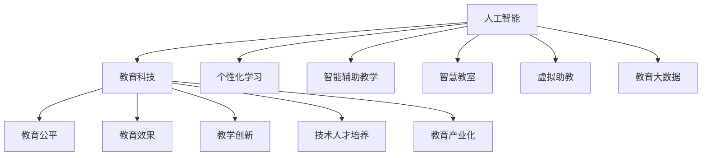

                 

# AI在教育领域的应用前景

> 关键词：人工智能,教育科技,个性化学习,智能辅助,智慧教室,虚拟助教,教育大数据,机器学习,深度学习

## 1. 背景介绍

### 1.1 问题由来
随着人工智能技术的快速发展，教育领域迎来了新的变革机遇。传统教育模式以教师为中心，难以满足学生的个性化需求，且效率低下。如何利用AI技术优化教育资源配置，提升教学效果，成为了教育领域的热点研究方向。

### 1.2 问题核心关键点
AI在教育领域的应用主要集中在以下几个方面：

1. **个性化学习**：利用AI算法分析学生学习行为和表现，提供个性化的学习路径和资源推荐。
2. **智能辅助教学**：通过AI工具自动化处理教学任务，如批改作业、自动生成练习题等，减轻教师负担。
3. **智慧教室建设**：引入AI技术提升教室的智能化水平，实现环境监测、学生互动等应用。
4. **虚拟助教**：开发虚拟助教机器人，提供24小时不间断的学习辅导和答疑服务。
5. **教育大数据分析**：收集和分析学生学习数据，评估教学效果，指导教学策略优化。
6. **机器学习与深度学习**：基于大规模数据集，训练预测模型，提升教学管理的决策能力。

AI技术的引入，有望大幅提升教育质量和效率，构建更加公平、高效的教育体系。然而，在实际应用中，AI技术的适应性和泛化能力仍需进一步提升，以满足教育场景的复杂需求。

### 1.3 问题研究意义
AI在教育领域的应用研究具有以下重要意义：

1. **提升教育公平性**：AI技术能够打破地域、资源限制，使优质教育资源覆盖更多学生，缩小城乡、校际教育差距。
2. **优化教学过程**：通过数据分析和智能化教学辅助，提升教学效果，减少教师工作量，使教育更加高效、有趣。
3. **促进教育创新**：AI技术的应用将推动教育模式创新，促进个性化、互动式、游戏化等新教学方式的发展。
4. **培养技术人才**：AI教育的普及将激发更多学生对科技的兴趣，推动STEM教育的发展，为社会培养更多技术人才。
5. **推动教育产业化**：AI技术能够支持在线教育、虚拟课堂等新形态教育的发展，为教育产业带来新的商业机会。

## 2. 核心概念与联系

### 2.1 核心概念概述

为更好地理解AI在教育领域的应用，本节将介绍几个密切相关的核心概念：

- **人工智能(AI)**：指通过计算机模拟人类智能行为的科学技术，包括机器学习、深度学习、自然语言处理、计算机视觉等。
- **教育科技(EdTech)**：利用信息技术优化教育过程，提高教育质量和效率，实现教育现代化。
- **个性化学习(Personalized Learning)**：根据学生的学习特点和需求，提供量身定制的学习计划和资源，实现因材施教。
- **智能辅助教学(AI-Assisted Teaching)**：使用AI技术辅助教师进行教学管理，包括自动批改作业、智能生成课程内容等。
- **智慧教室(Smart Classroom)**：利用传感器、数据分析等技术，提升教室的智能化水平，实现环境控制、学习评估等功能。
- **虚拟助教(Virtual Tutor)**：基于AI技术的智能助教，可以提供24小时在线学习辅导、答疑等服务。
- **教育大数据(Education Big Data)**：通过收集和分析大规模教育数据，揭示教育现象，指导教育决策和优化。

这些核心概念之间的逻辑关系可以通过以下Mermaid流程图来展示：



这个流程图展示了这个领域的核心概念及其之间的关系：

1. AI技术是教育科技的核心驱动，为个性化学习、智能辅助教学、智慧教室等应用提供技术支撑。
2. 个性化学习强调根据学生需求提供定制化教学，智能辅助教学通过自动化减轻教师负担，智慧教室实现环境智能化，虚拟助教提供全天候学习辅导，教育大数据用于指导教育决策。
3. 这些应用共同提升了教育质量和效率，促进教育公平，推动教育创新和产业化发展。

## 3. 核心算法原理 & 具体操作步骤
### 3.1 算法原理概述

AI在教育领域的应用主要基于机器学习和深度学习算法。这些算法通过分析教育数据，构建模型预测学生表现，优化教学策略，实现智能辅助和个性化学习。

**3.1.1 数据收集与预处理**

首先，需要从教育系统中收集大量的数据，包括学生的学习行为数据、成绩数据、课堂互动数据、作业数据等。这些数据需要经过清洗和预处理，去除噪声和异常值，转换为算法能够处理的格式。

**3.1.2 特征工程与模型构建**

特征工程是模型构建的关键步骤，需要将原始数据转化为模型能够理解的特征向量。常见的特征包括学生的学习时长、正确率、问题难度、课堂互动等。

基于特征向量，选择适当的机器学习或深度学习模型进行训练。常用的模型包括决策树、随机森林、支持向量机、神经网络、卷积神经网络等。

**3.1.3 模型训练与评估**

利用收集的数据对模型进行训练，并通过交叉验证、留一法等技术进行模型评估，选择最优模型。模型训练过程中，需要对模型参数进行调整，以提高模型的预测准确率和泛化能力。

**3.1.4 模型应用与优化**

将训练好的模型应用于实际教学场景中，如推荐个性化学习资源、预测学生表现、生成智能练习题等。同时，根据实际应用效果进行模型优化，不断提高模型的性能和效果。

### 3.2 算法步骤详解

下面详细讲解AI在教育领域应用的主要算法步骤：

**Step 1: 数据收集与预处理**

1. **数据来源**：收集学生成绩、作业、课堂互动、学习行为等数据，涵盖不同年级、不同科目。
2. **数据清洗**：去除缺失值、异常值、重复数据等，确保数据质量。
3. **数据转换**：将非数值型数据转化为数值型特征，如将课堂互动转化为文本向量表示。

**Step 2: 特征工程与模型构建**

1. **特征提取**：选择对学习效果有影响的特征，如学习时长、正确率、问题难度等。
2. **特征处理**：对特征进行标准化、归一化处理，减少特征之间的差异。
3. **模型选择**：根据问题类型选择合适的算法，如决策树、随机森林、神经网络等。
4. **模型训练**：利用训练集数据训练模型，调整模型参数，提高模型泛化能力。

**Step 3: 模型训练与评估**

1. **模型评估**：利用验证集数据对模型进行评估，选择最优模型。
2. **模型优化**：通过超参数调整、正则化技术等方法提高模型性能。
3. **模型验证**：利用测试集数据验证模型效果，确保模型在新数据上的表现。

**Step 4: 模型应用与优化**

1. **应用场景**：将模型应用于推荐个性化学习资源、预测学生表现、生成智能练习题等场景。
2. **效果评估**：根据实际应用效果进行模型优化，提高模型性能。
3. **持续优化**：根据反馈数据，不断迭代模型，提升模型效果。

### 3.3 算法优缺点

AI在教育领域的应用具有以下优点：

1. **个性化学习**：根据学生个性化需求，提供定制化学习资源和路径，提升学习效果。
2. **智能辅助教学**：减轻教师负担，提高教学效率，促进教学创新。
3. **教育公平**：打破地域、资源限制，使优质教育资源覆盖更多学生。
4. **决策支持**：通过数据分析和模型预测，优化教学策略，提升教育管理水平。

同时，这些应用也存在一些缺点：

1. **数据隐私**：大规模数据收集和分析涉及学生隐私问题，需要严格遵守数据保护法规。
2. **算法公平性**：模型可能存在偏见，需要特别关注算法的公平性和透明性。
3. **技术门槛**：AI技术的应用需要较高的技术门槛，需要专业团队进行开发和维护。
4. **资源需求**：AI应用需要高性能计算资源，对硬件要求较高。

### 3.4 算法应用领域

AI在教育领域的应用范围广泛，涵盖以下主要领域：

1. **个性化学习系统**：根据学生学习数据，推荐个性化学习资源和路径。
2. **智能辅助教学平台**：自动化处理作业批改、智能生成练习题等教学任务。
3. **智慧教室系统**：利用传感器和数据分析技术，提升教室智能化水平，如环境监测、学生互动等。
4. **虚拟助教服务**：开发智能助教机器人，提供24小时在线学习辅导和答疑服务。
5. **教育大数据平台**：收集和分析学生学习数据，指导教学策略优化。
6. **个性化推荐系统**：基于学习数据，推荐课程和资源，提升学习效果。
7. **学习行为分析**：利用数据分析技术，预测学生表现，提供干预措施。
8. **学习管理系统(LMS)**：构建在线学习平台，提供课程管理、资源共享、互动交流等功能。

这些应用场景通过AI技术的应用，显著提升了教育质量和效率，满足了不同学生的个性化需求，促进了教育公平。

## 4. 数学模型和公式 & 详细讲解  
### 4.1 数学模型构建

**4.1.1 学习目标函数**

假设学生学习数据为 $(x_1, y_1), (x_2, y_2), ..., (x_n, y_n)$，其中 $x_i$ 表示学生学习行为特征，$y_i$ 表示学生成绩。目标函数为最小化预测误差 $L$：

$$
L = \frac{1}{N}\sum_{i=1}^N(y_i - f(x_i))^2
$$

其中 $f(x_i)$ 表示模型预测的 $y_i$ 值。

**4.1.2 损失函数**

常用的损失函数包括均方误差、交叉熵等。以均方误差为例：

$$
L = \frac{1}{N}\sum_{i=1}^N(y_i - \hat{y}_i)^2
$$

其中 $\hat{y}_i$ 为模型预测的学习成绩。

**4.1.3 优化算法**

常用的优化算法包括梯度下降法、随机梯度下降法、Adam优化器等。以梯度下降法为例：

$$
\theta = \theta - \eta \nabla_{\theta}L(\theta)
$$

其中 $\theta$ 为模型参数，$\eta$ 为学习率，$\nabla_{\theta}L(\theta)$ 为损失函数对参数 $\theta$ 的梯度。

### 4.2 公式推导过程

以下以决策树算法为例，推导其核心公式。

**4.2.1 决策树构建**

假设训练集为 $D=\{(x_i, y_i)\}_{i=1}^N$，其中 $x_i$ 为特征向量，$y_i$ 为分类标签。

设当前节点为 $t$，特征为 $x_j$，分裂阈值为 $c_j$。在节点 $t$ 上，对于每个样本 $x_i$，计算其属于该节点的概率 $P_t(x_i)$：

$$
P_t(x_i) = \frac{\sum_{k=1}^{n_t} 1(x_k \in x_i)}{n_t}
$$

其中 $n_t$ 为节点 $t$ 包含的样本数。

假设当前节点的训练误差为 $L_t$，则节点 $t$ 的分类误差 $E(t)$ 为：

$$
E(t) = \frac{1}{n_t} \sum_{i=1}^{n_t} \sum_{k=1}^{m_t} l(y_k, \hat{y}_k) + L_t
$$

其中 $l(y_k, \hat{y}_k)$ 为样本 $k$ 的损失函数，$m_t$ 为节点 $t$ 包含的样本数。

**4.2.2 分裂策略**

根据信息增益、基尼系数等策略，选择最优特征和分裂阈值，构建决策树。假设特征 $x_j$ 的取值为 $c_j$，则信息增益 $IG$ 为：

$$
IG = \sum_{k=1}^{m_t} (n_k/N) \log\frac{n_k}{n_k/N}
$$

其中 $n_k$ 为特征 $x_j$ 取值为 $c_j$ 的样本数。

**4.2.3 模型预测**

对于新样本 $x$，利用决策树进行预测，计算其在每个节点的概率 $P_t(x)$，最终预测标签 $\hat{y}$：

$$
\hat{y} = \arg\max_{y \in Y} P_t(y|x)
$$

其中 $Y$ 为分类标签集合。

### 4.3 案例分析与讲解

**案例1: 个性化学习推荐**

假设某学生在数学科目上的学习数据为 $(x_1, y_1), (x_2, y_2), ..., (x_n, y_n)$，其中 $x_i$ 为学习行为特征，$y_i$ 为数学成绩。目标是最小化预测误差：

$$
L = \frac{1}{N}\sum_{i=1}^N(y_i - \hat{y}_i)^2
$$

其中 $\hat{y}_i$ 为模型预测的数学成绩。

利用决策树算法，根据学生学习数据构建决策树模型。对于新学生，输入其学习行为特征 $x$，利用决策树进行预测，得到推荐的学习路径和资源。

**案例2: 学生成绩预测**

假设某学生的学习数据为 $(x_1, y_1), (x_2, y_2), ..., (x_n, y_n)$，其中 $x_i$ 为学习行为特征，$y_i$ 为数学成绩。目标是最小化预测误差：

$$
L = \frac{1}{N}\sum_{i=1}^N(y_i - \hat{y}_i)^2
$$

其中 $\hat{y}_i$ 为模型预测的数学成绩。

利用随机森林算法，根据学生学习数据构建随机森林模型。对于新学生，输入其学习行为特征 $x$，利用随机森林进行预测，得到其在数学科目的成绩预测。

## 5. 项目实践：代码实例和详细解释说明
### 5.1 开发环境搭建

在进行AI教育应用开发前，需要先准备好开发环境。以下是使用Python进行Scikit-Learn开发的Scikit-Learn环境配置流程：

1. 安装Anaconda：从官网下载并安装Anaconda，用于创建独立的Python环境。

2. 创建并激活虚拟环境：
```bash
conda create -n sklearn-env python=3.8 
conda activate sklearn-env
```

3. 安装Scikit-Learn：从官网获取安装命令，例如：
```bash
conda install scikit-learn
```

4. 安装相关工具包：
```bash
pip install numpy pandas scikit-learn matplotlib scikit-learn tqdm jupyter notebook ipython
```

完成上述步骤后，即可在`sklearn-env`环境中开始AI教育应用开发。

### 5.2 源代码详细实现

下面我们以推荐个性化学习资源为例，给出使用Scikit-Learn库进行决策树模型训练的Python代码实现。

首先，定义数据处理函数：

```python
import pandas as pd
from sklearn.model_selection import train_test_split
from sklearn.tree import DecisionTreeClassifier
from sklearn.metrics import accuracy_score

def load_data(file_path):
    data = pd.read_csv(file_path)
    X = data.drop('label', axis=1)
    y = data['label']
    return X, y

def train_test_split_data(X, y, test_size=0.2, random_state=42):
    X_train, X_test, y_train, y_test = train_test_split(X, y, test_size=test_size, random_state=random_state)
    return X_train, X_test, y_train, y_test

def train_model(X_train, y_train, model):
    model.fit(X_train, y_train)
    y_pred = model.predict(X_train)
    accuracy = accuracy_score(y_train, y_pred)
    return accuracy

def evaluate_model(X_test, y_test, model):
    y_pred = model.predict(X_test)
    accuracy = accuracy_score(y_test, y_pred)
    return accuracy
```

然后，定义决策树模型：

```python
from sklearn.tree import DecisionTreeClassifier

def build_model(X_train, y_train, max_depth=None, min_samples_split=2, min_samples_leaf=1):
    model = DecisionTreeClassifier(max_depth=max_depth, min_samples_split=min_samples_split, min_samples_leaf=min_samples_leaf)
    return model
```

接着，定义训练和评估函数：

```python
from sklearn.metrics import accuracy_score

def train_model(model, X_train, y_train):
    model.fit(X_train, y_train)
    y_pred = model.predict(X_train)
    accuracy = accuracy_score(y_train, y_pred)
    return accuracy

def evaluate_model(model, X_test, y_test):
    y_pred = model.predict(X_test)
    accuracy = accuracy_score(y_test, y_pred)
    return accuracy
```

最后，启动训练流程并在测试集上评估：

```python
import numpy as np

# 加载数据
X, y = load_data('data.csv')

# 划分训练集和测试集
X_train, X_test, y_train, y_test = train_test_split_data(X, y)

# 构建模型
model = build_model(X_train, y_train)

# 训练模型
train_accuracy = train_model(model, X_train, y_train)

# 评估模型
test_accuracy = evaluate_model(model, X_test, y_test)

print(f'训练集准确率：{train_accuracy:.2f}')
print(f'测试集准确率：{test_accuracy:.2f}')
```

以上就是使用Scikit-Learn库对决策树模型进行个性化学习资源推荐开发的完整代码实现。可以看到，Scikit-Learn库提供了丰富、易用的机器学习工具，可以快速进行模型构建和评估。

### 5.3 代码解读与分析

让我们再详细解读一下关键代码的实现细节：

**load_data函数**：
- 用于加载训练数据和标签，并返回特征和标签。

**train_test_split_data函数**：
- 对数据进行划分，返回训练集和测试集。

**train_model函数**：
- 在训练集上训练模型，并返回模型在训练集上的准确率。

**evaluate_model函数**：
- 在测试集上评估模型，并返回模型在测试集上的准确率。

**build_model函数**：
- 构建决策树模型，并返回模型对象。

**train_model函数**：
- 训练模型，并返回模型在训练集上的准确率。

**evaluate_model函数**：
- 评估模型，并返回模型在测试集上的准确率。

**训练流程**：
- 加载训练数据
- 划分训练集和测试集
- 构建决策树模型
- 在训练集上训练模型
- 在测试集上评估模型
- 输出训练集和测试集的准确率

可以看到，Scikit-Learn库使得机器学习模型的开发和评估变得简洁高效。开发者可以将更多精力放在数据处理、模型改进等高层逻辑上，而不必过多关注底层的实现细节。

当然，工业级的系统实现还需考虑更多因素，如模型的保存和部署、超参数的自动搜索、更灵活的任务适配层等。但核心的算法步骤基本与此类似。

## 6. 实际应用场景
### 6.1 智能辅助教学

智能辅助教学系统通过AI技术优化教学过程，减轻教师负担，提升教学效果。具体应用包括：

**智能作业批改**：利用自然语言处理技术，自动识别和批改作业，减少教师的工作量。

**智能问题生成**：根据学生的学习情况，生成个性化的练习题，提升学习效果。

**学习数据分析**：通过收集和分析学生的学习数据，提供学习行为分析报告，指导教师教学策略。

**学习资源推荐**：根据学生的学习兴趣和需求，推荐合适的学习资源和课程。

**在线辅导和答疑**：开发智能助教机器人，提供24小时在线学习辅导和答疑服务，解决学生学习难题。

### 6.2 个性化学习平台

个性化学习平台通过AI技术，提供量身定制的学习路径和资源，满足学生的个性化需求。具体应用包括：

**个性化学习计划**：根据学生的学习数据，推荐个性化的学习路径和资源，提升学习效果。

**学习效果评估**：利用数据分析技术，评估学生的学习效果，提供改进建议。

**学习进度跟踪**：通过学习数据分析，实时跟踪学生的学习进度，及时调整学习策略。

**学习反馈系统**：收集学生的学习反馈，优化个性化学习算法，提升学习效果。

### 6.3 智慧教室系统

智慧教室系统通过AI技术，提升教室的智能化水平，提供更加高效、互动的学习环境。具体应用包括：

**环境监测**：利用传感器技术，监测教室环境，如温度、湿度、光照等，确保学习环境舒适。

**学习互动**：通过智能屏幕和投影技术，实现课堂互动，如即时问答、投票等。

**资源共享**：将学习资源数字化，实现远程访问和共享，提升资源的利用效率。

**学生管理**：利用数据分析技术，实时监控学生行为和学习效果，提供个性化辅导和支持。

### 6.4 未来应用展望

未来，AI在教育领域的应用将进一步深化和扩展，带来更多创新和突破。

**智能辅助教学系统**：利用AI技术，提供更加智能化、个性化的教学辅助，如自动生成教学计划、智能推荐学习资源等。

**虚拟助教服务**：开发更智能、更人性化的虚拟助教，提供更精准、更全面的学习辅导和答疑服务。

**智慧教室系统**：进一步提升教室智能化水平，实现更加互动、高效的学习环境。

**在线教育平台**：构建更加丰富、多样、个性化的在线教育平台，满足不同学生的需求。

**教育大数据平台**：建立更加全面、深度、实时的教育大数据平台，提供科学的教学决策支持。

这些应用场景通过AI技术的应用，将大幅提升教育质量和效率，推动教育公平和创新，为社会的全面发展提供坚实的基础。

## 7. 工具和资源推荐
### 7.1 学习资源推荐

为了帮助开发者系统掌握AI在教育领域的应用理论基础和实践技巧，这里推荐一些优质的学习资源：

1. **《Python机器学习》**：由Scikit-Learn核心开发者编写的经典书籍，全面介绍了机器学习算法和Scikit-Learn库的使用。

2. **CS229《机器学习》课程**：斯坦福大学开设的机器学习课程，有Lecture视频和配套作业，深入浅出地讲解了机器学习理论。

3. **《深度学习》**：由Ian Goodfellow、Yoshua Bengio和Aaron Courville合著的深度学习教材，系统介绍了深度学习理论和实践。

4. **Coursera机器学习专业课程**：Coursera提供的机器学习专业课程，由Andrew Ng讲授，覆盖了机器学习、深度学习等多个方面的内容。

5. **Kaggle竞赛**：Kaggle平台上的机器学习竞赛，通过实际问题训练算法，提升实践能力。

通过对这些资源的学习实践，相信你一定能够快速掌握AI在教育领域的应用精髓，并用于解决实际的NLP问题。

### 7.2 开发工具推荐

高效的开发离不开优秀的工具支持。以下是几款用于AI教育应用开发的常用工具：

1. **Jupyter Notebook**：交互式编程环境，支持Python、R等多种语言，方便开发和调试。

2. **TensorFlow**：由Google主导开发的深度学习框架，支持分布式计算，适合大规模工程应用。

3. **PyTorch**：由Facebook开发的高效深度学习框架，灵活易用，适合快速迭代研究。

4. **Scikit-Learn**：基于Python的机器学习库，提供了丰富的算法实现和工具支持。

5. **Jupyter Lab**：基于Jupyter Notebook的Web开发环境，支持更丰富的功能，如自动补全、代码高亮等。

6. **Kaggle平台**：提供数据分析、机器学习竞赛等资源，助力开发者提升实战能力。

合理利用这些工具，可以显著提升AI教育应用的开发效率，加快创新迭代的步伐。

### 7.3 相关论文推荐

AI在教育领域的应用研究源于学界的持续研究。以下是几篇奠基性的相关论文，推荐阅读：

1. **《教育数据分析中的机器学习技术》**：文章介绍了机器学习在教育数据分析中的应用，如学生成绩预测、学习行为分析等。

2. **《深度学习在教育中的应用》**：文章总结了深度学习在个性化学习、智能辅导等方面的应用，提出了一些未来研究方向。

3. **《基于深度学习的在线教育平台》**：文章介绍了深度学习在在线教育平台中的应用，如个性化推荐、智能助教等。

4. **《机器学习在教育中的公平性问题》**：文章讨论了机器学习在教育中的公平性问题，提出了一些解决策略和建议。

5. **《教育大数据的挖掘与分析》**：文章介绍了教育大数据的挖掘与分析技术，如数据清洗、特征提取、模型训练等。

这些论文代表了大数据在教育领域的应用进展，为未来研究提供了重要参考。

## 8. 总结：未来发展趋势与挑战
### 8.1 总结

本文对AI在教育领域的应用进行了全面系统的介绍。首先阐述了AI技术在教育领域的应用背景和意义，明确了AI技术在提升教育质量和效率方面的独特价值。其次，从原理到实践，详细讲解了AI在教育领域应用的主要算法步骤和具体实现，给出了AI教育应用开发的完整代码实例。同时，本文还广泛探讨了AI在智能辅助教学、个性化学习、智慧教室等实际应用场景中的应用前景，展示了AI技术在教育领域的广阔应用前景。

通过本文的系统梳理，可以看到，AI在教育领域的应用研究正在蓬勃发展，为教育模式创新和教育公平提供了强有力的技术支撑。未来，伴随技术的不断进步，AI在教育领域的应用将更加深入和广泛，为教育事业带来革命性的变革。

### 8.2 未来发展趋势

展望未来，AI在教育领域的应用将呈现以下几个发展趋势：

1. **智能化教学辅助**：利用AI技术，提供更加智能化、个性化的教学辅助，如自动生成教学计划、智能推荐学习资源等。
2. **虚拟助教服务**：开发更智能、更人性化的虚拟助教，提供更精准、更全面的学习辅导和答疑服务。
3. **智慧教室系统**：进一步提升教室智能化水平，实现更加互动、高效的学习环境。
4. **在线教育平台**：构建更加丰富、多样、个性化的在线教育平台，满足不同学生的需求。
5. **教育大数据平台**：建立更加全面、深度、实时的教育大数据平台，提供科学的教学决策支持。
6. **教育公平性**：通过AI技术，打破地域、资源限制，使优质教育资源覆盖更多学生。
7. **个性化学习**：根据学生的个性化需求，提供量身定制的学习路径和资源，提升学习效果。

这些趋势凸显了AI在教育领域的巨大潜力，将推动教育模式创新和教育公平，为社会的全面发展提供坚实的基础。

### 8.3 面临的挑战

尽管AI在教育领域的应用前景广阔，但在实际应用中，仍面临以下挑战：

1. **数据隐私**：大规模数据收集和分析涉及学生隐私问题，需要严格遵守数据保护法规。
2. **算法公平性**：模型可能存在偏见，需要特别关注算法的公平性和透明性。
3. **技术门槛**：AI技术的应用需要较高的技术门槛，需要专业团队进行开发和维护。
4. **资源需求**：AI应用需要高性能计算资源，对硬件要求较高。
5. **社会接受度**：AI技术在教育中的应用需要社会各界的广泛接受和支持。
6. **教育伦理**：AI技术的应用可能引发教育伦理问题，需要制定相应的规范和标准。

这些挑战需要在技术、政策、伦理等多个层面共同努力，才能推动AI在教育领域的健康发展。

### 8.4 研究展望

未来，AI在教育领域的研究需要在以下几个方面寻求新的突破：

1. **数据隐私保护**：开发更加安全、隐私友好的数据收集和处理技术，保护学生隐私。
2. **算法公平性**：研究和应用公平、透明、可解释的AI算法，减少偏见，提高模型公平性。
3. **技术创新**：不断探索新的AI技术，如生成对抗网络、知识图谱等，提升AI应用的性能和效果。
4. **跨学科融合**：将AI技术与心理学、教育学、社会学等学科融合，提升AI教育的可解释性和适应性。
5. **教育伦理规范**：制定和完善AI在教育中的应用伦理规范，确保教育公平和伦理安全。

这些研究方向将推动AI在教育领域的全面应用，促进教育模式的创新和教育公平，为社会的全面发展提供坚实的基础。

## 9. 附录：常见问题与解答
**Q1：AI在教育领域有哪些具体应用？**

A: AI在教育领域的应用广泛，涵盖以下几个方面：

1. **智能辅助教学**：利用AI技术，自动化处理教学任务，如作业批改、智能生成练习题等。
2. **个性化学习**：根据学生的学习特点和需求，提供个性化的学习路径和资源。
3. **智慧教室**：利用传感器和数据分析技术，提升教室智能化水平，实现环境监测、学生互动等应用。
4. **虚拟助教**：开发智能助教机器人，提供24小时在线学习辅导和答疑服务。
5. **教育大数据**：收集和分析学生学习数据，指导教学策略优化。

这些应用场景通过AI技术的应用，显著提升了教育质量和效率，满足了不同学生的个性化需求，促进了教育公平。

**Q2：AI在教育领域的应用有哪些挑战？**

A: AI在教育领域的应用也面临一些挑战，主要包括：

1. **数据隐私**：大规模数据收集和分析涉及学生隐私问题，需要严格遵守数据保护法规。
2. **算法公平性**：模型可能存在偏见，需要特别关注算法的公平性和透明性。
3. **技术门槛**：AI技术的应用需要较高的技术门槛，需要专业团队进行开发和维护。
4. **资源需求**：AI应用需要高性能计算资源，对硬件要求较高。
5. **社会接受度**：AI技术在教育中的应用需要社会各界的广泛接受和支持。
6. **教育伦理**：AI技术的应用可能引发教育伦理问题，需要制定相应的规范和标准。

这些挑战需要在技术、政策、伦理等多个层面共同努力，才能推动AI在教育领域的健康发展。

**Q3：AI在教育领域的应用未来有哪些发展趋势？**

A: 未来，AI在教育领域的应用将呈现以下几个发展趋势：

1. **智能化教学辅助**：利用AI技术，提供更加智能化、个性化的教学辅助，如自动生成教学计划、智能推荐学习资源等。
2. **虚拟助教服务**：开发更智能、更人性化的虚拟助教，提供更精准、更全面的学习辅导和答疑服务。
3. **智慧教室系统**：进一步提升教室智能化水平，实现更加互动、高效的学习环境。
4. **在线教育平台**：构建更加丰富、多样、个性化的在线教育平台，满足不同学生的需求。
5. **教育大数据平台**：建立更加全面、深度、实时的教育大数据平台，提供科学的教学决策支持。
6. **教育公平性**：通过AI技术，打破地域、资源限制，使优质教育资源覆盖更多学生。
7. **个性化学习**：根据学生的个性化需求，提供量身定制的学习路径和资源，提升学习效果。

这些趋势凸显了AI在教育领域的巨大潜力，将推动教育模式创新和教育公平，为社会的全面发展提供坚实的基础。

**Q4：AI在教育领域的应用有哪些优势？**

A: AI在教育领域的应用具有以下优势：

1. **个性化学习**：根据学生的个性化需求，提供量身定制的学习路径和资源，提升学习效果。
2. **智能辅助教学**：减轻教师负担，提升教学效果，促进教学创新。
3. **教育公平**：打破地域、资源限制，使优质教育资源覆盖更多学生。
4. **教育效果提升**：通过数据分析和模型预测，优化教学策略，提升教育管理水平。
5. **教育效率提升**：自动化处理教学任务，如作业批改、智能生成练习题等，提升教学效率。
6. **教育质量提升**：提供更加丰富、多样、个性化的学习资源，提升学习效果。

这些优势凸显了AI在教育领域的巨大潜力，将推动教育模式创新和教育公平，为社会的全面发展提供坚实的基础。

**Q5：AI在教育领域的应用有哪些具体案例？**

A: AI在教育领域的应用案例丰富，涵盖以下几个方面：

1. **个性化学习平台**：如Khan Academy、Coursera等，根据学生的学习数据，推荐个性化的学习路径和资源。
2. **智能辅助教学系统**：如Squirrel AI、ALEKS等，自动化处理教学任务，如作业批改、智能生成练习题等。
3. **智慧教室系统**：如Smart Classroom、Nexopia等，利用传感器和数据分析技术，提升教室智能化水平，实现环境监测、学生互动等应用。
4. **虚拟助教服务**：如Sophia、Woebot等，开发智能助教机器人，提供24小时在线学习辅导和答疑服务。
5. **教育大数据平台**：如IBM Watson Education、Clarabridge等，收集和分析学生学习数据，指导教学策略优化。

这些应用场景通过AI技术的应用，显著提升了教育质量和效率，满足了不同学生的个性化需求，促进了教育公平。

---

作者：禅与计算机程序设计艺术 / Zen and the Art of Computer Programming

