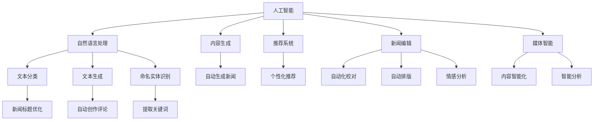

                 

# AI在新闻和媒体领域的应用

> 关键词：人工智能,自然语言处理,内容生成,推荐系统,新闻编辑,媒体智能,大数据分析

## 1. 背景介绍

在数字化时代，新闻和媒体行业面临着前所未有的变革与挑战。社交媒体的兴起、用户需求的不断变化、内容市场的激烈竞争，都使得传统的新闻和媒体生产模式需要不断革新。AI技术的突破，尤其是自然语言处理（NLP）、机器学习（ML）、深度学习（DL）等领域的应用，为新闻和媒体行业提供了强大的技术支持。本文将探讨AI在新闻和媒体领域的具体应用，包括内容生成、推荐系统、新闻编辑、媒体智能等多个方面。

## 2. 核心概念与联系

### 2.1 核心概念概述

AI在新闻和媒体领域的应用涉及多个核心概念，主要包括：

- 人工智能（AI）：利用机器学习、深度学习等技术，赋予计算机系统一定的智能能力，使其能够理解和执行复杂的任务。
- 自然语言处理（NLP）：研究如何让计算机理解、处理和生成自然语言的技术，包括文本分类、文本生成、命名实体识别等。
- 内容生成（CG）：利用AI技术自动生成新闻报道、文章、评论等内容，提高内容生产的效率和质量。
- 推荐系统（RS）：根据用户的历史行为和偏好，为用户推荐相关的新闻、文章、视频等内容，提升用户体验和内容互动性。
- 新闻编辑（NE）：利用AI技术辅助新闻编辑工作，包括自动化校对、自动排版、情感分析等。
- 媒体智能（MI）：结合AI技术和大数据分析，提升媒体内容的智能化水平，实现新闻的自动化生产和智能化分析。

这些核心概念相互关联，共同构成了AI在新闻和媒体领域应用的技术基础。

### 2.2 核心概念原理和架构的 Mermaid 流程图



## 3. 核心算法原理 & 具体操作步骤

### 3.1 算法原理概述

AI在新闻和媒体领域的应用，通常涉及以下几个关键算法和步骤：

- 数据预处理：收集和整理新闻和媒体内容的数据，包括文本清洗、分词、标注等。
- 特征提取：利用NLP技术，将原始文本转换为模型能够处理的向量形式。
- 模型训练：选择合适的深度学习模型，如CNN、RNN、Transformer等，在标注数据上训练，获得预训练模型。
- 微调优化：在特定任务数据上微调预训练模型，进一步优化模型性能。
- 推理应用：利用训练好的模型进行内容生成、推荐、编辑等任务，提供智能化的新闻和媒体服务。

### 3.2 算法步骤详解

#### 3.2.1 数据预处理

1. **数据收集**：从新闻网站、社交媒体、在线论坛等渠道收集新闻和媒体内容，确保数据的多样性和代表性。
2. **文本清洗**：去除文本中的噪声，如HTML标签、停用词、特殊字符等。
3. **分词标注**：对文本进行分词，并标注实体、关键词等信息，以便后续的特征提取和模型训练。
4. **标注数据**：对部分数据进行人工标注，生成训练集、验证集和测试集。

#### 3.2.2 特征提取

1. **词向量表示**：使用Word2Vec、GloVe等技术，将单词转换为向量形式。
2. **句向量表示**：使用预训练的语言模型（如BERT、GPT），生成句子的向量表示。
3. **TF-IDF表示**：计算词频和逆文档频率，生成文本的TF-IDF向量表示。

#### 3.2.3 模型训练

1. **选择合适的模型**：根据任务需求，选择适当的深度学习模型，如CNN、RNN、Transformer等。
2. **预训练模型**：在大规模无标签数据上训练模型，获得预训练的参数权重。
3. **微调模型**：在特定任务数据上微调预训练模型，更新部分参数，适应新的任务需求。

#### 3.2.4 推理应用

1. **内容生成**：利用训练好的模型生成新闻报道、文章、评论等。
2. **推荐系统**：根据用户的历史行为和偏好，为用户推荐相关内容。
3. **新闻编辑**：利用模型进行自动化校对、自动排版、情感分析等。
4. **媒体智能**：结合AI技术和大数据分析，提升媒体内容的智能化水平。

### 3.3 算法优缺点

#### 3.3.1 优点

- **提高效率**：AI技术可以自动完成数据处理、特征提取、模型训练等繁琐的工作，提高内容生产的效率。
- **提升质量**：AI模型能够处理大规模数据，提高内容生成和推荐的准确性和多样性。
- **个性化服务**：推荐系统能够根据用户偏好，提供个性化的新闻和内容，提升用户体验。
- **智能化分析**：媒体智能能够利用大数据分析，提供深度的内容分析与洞察。

#### 3.3.2 缺点

- **数据依赖**：AI模型依赖高质量的标注数据进行训练，获取标注数据的成本较高。
- **模型泛化**：模型在特定任务上的效果往往较好，但在新任务上的泛化能力有限。
- **伦理问题**：AI模型可能引入偏见、误导性信息等问题，需要严格的伦理审查和监管。
- **可解释性不足**：AI模型的决策过程缺乏可解释性，难以理解和调试。

### 3.4 算法应用领域

AI在新闻和媒体领域的应用广泛，主要涵盖以下几个方面：

- **内容生成**：利用AI技术自动生成新闻报道、文章、评论等内容。
- **推荐系统**：根据用户的历史行为和偏好，为用户推荐相关的新闻、文章、视频等内容。
- **新闻编辑**：利用AI技术辅助新闻编辑工作，包括自动化校对、自动排版、情感分析等。
- **媒体智能**：结合AI技术和大数据分析，提升媒体内容的智能化水平，实现新闻的自动化生产和智能化分析。

## 4. 数学模型和公式 & 详细讲解 & 举例说明

### 4.1 数学模型构建

AI在新闻和媒体领域的应用，通常涉及以下几个数学模型：

- **文本分类模型**：用于将文本分为不同的类别，如新闻分类、情感分类等。常用的模型包括朴素贝叶斯、逻辑回归、支持向量机等。
- **文本生成模型**：用于自动生成新闻报道、文章、评论等内容。常用的模型包括循环神经网络（RNN）、长短时记忆网络（LSTM）、Transformer等。
- **推荐系统模型**：用于为用户推荐相关的新闻、文章、视频等内容。常用的模型包括协同过滤、矩阵分解、深度学习模型等。
- **情感分析模型**：用于分析新闻报道、文章、评论等内容的情感倾向。常用的模型包括朴素贝叶斯、情感词典、深度学习模型等。

### 4.2 公式推导过程

#### 4.2.1 文本分类模型

假设训练集为 $\{(x_i, y_i)\}_{i=1}^N$，其中 $x_i$ 为文本向量，$y_i \in \{0, 1\}$ 为分类标签。

常用的文本分类模型包括朴素贝叶斯模型和逻辑回归模型：

- **朴素贝叶斯模型**：
$$ P(y|x) = \frac{P(x|y)P(y)}{P(x)} = \frac{P(x|y)}{P(x)}P(y) $$
- **逻辑回归模型**：
$$ P(y|x) = \sigma(\alpha_0 + \alpha_1x_1 + \alpha_2x_2 + \cdots + \alpha_nx_n) $$
其中，$\sigma(\cdot)$ 为sigmoid函数。

#### 4.2.2 文本生成模型

常用的文本生成模型包括循环神经网络（RNN）和长短时记忆网络（LSTM）：

- **RNN模型**：
$$ \hat{y}_{t} = f(y_{t-1}, y_{t-2}, \cdots, y_1) $$
其中，$f$ 为隐藏层状态更新函数。
- **LSTM模型**：
$$ \hat{y}_{t} = f(y_{t-1}, y_{t-2}, \cdots, y_1) $$
其中，$f$ 为LSTM门控机制。

#### 4.2.3 推荐系统模型

常用的推荐系统模型包括协同过滤模型和矩阵分解模型：

- **协同过滤模型**：
$$ \hat{y}_{i,j} = \frac{\sum_k u_{i,k}v_{k,j}}{\sqrt{\sum_k u_{i,k}^2} \cdot \sqrt{\sum_k v_{k,j}^2}} $$
- **矩阵分解模型**：
$$ \hat{y}_{i,j} = \frac{\mathbf{U}_i \mathbf{V}_j}{\|\mathbf{U}_i\| \cdot \|\mathbf{V}_j\|} $$
其中，$\mathbf{U}_i$ 和 $\mathbf{V}_j$ 为用户和物品的嵌入矩阵。

#### 4.2.4 情感分析模型

常用的情感分析模型包括情感词典和深度学习模型：

- **情感词典模型**：
$$ S(x) = \sum_{i=1}^n \delta_{x_i} $$
其中，$\delta_{x_i}$ 为情感词典中单词的情感得分。
- **深度学习模型**：
$$ S(x) = \sum_{i=1}^n \delta_{x_i} $$
其中，$\delta_{x_i}$ 为深度学习模型中单词的情感得分。

### 4.3 案例分析与讲解

#### 4.3.1 文本分类

假设有一个文本分类任务，将新闻报道分类为体育、娱乐、科技等类别。使用朴素贝叶斯模型进行训练，训练集为 $\{(x_i, y_i)\}_{i=1}^N$，测试集为 $\{(x_j, y_j)\}_{j=1}^M$。

1. **数据预处理**：对文本进行分词、去停用词、TF-IDF向量化等处理。
2. **模型训练**：使用朴素贝叶斯模型进行训练，更新模型参数 $\alpha_1, \alpha_2, \cdots, \alpha_n$。
3. **模型评估**：在测试集上评估模型的性能，计算准确率、召回率等指标。
4. **应用**：将训练好的模型应用于新的新闻报道，分类为体育、娱乐、科技等类别。

#### 4.3.2 文本生成

假设有一个文本生成任务，自动生成一篇新闻报道。使用RNN模型进行训练，训练集为 $\{(x_i, y_i)\}_{i=1}^N$，测试集为 $\{(x_j, y_j)\}_{j=1}^M$。

1. **数据预处理**：对文本进行分词、去停用词、TF-IDF向量化等处理。
2. **模型训练**：使用RNN模型进行训练，更新模型参数 $\alpha_1, \alpha_2, \cdots, \alpha_n$。
3. **模型评估**：在测试集上评估模型的性能，计算BLEU、ROUGE等指标。
4. **应用**：将训练好的模型应用于新的输入，自动生成一篇新闻报道。

#### 4.3.3 推荐系统

假设有一个推荐系统任务，为用户推荐相关的新闻、文章等。使用协同过滤模型进行训练，训练集为 $\{(x_i, y_i)\}_{i=1}^N$，测试集为 $\{(x_j, y_j)\}_{j=1}^M$。

1. **数据预处理**：对用户和物品进行向量化处理，生成用户和物品的嵌入矩阵。
2. **模型训练**：使用协同过滤模型进行训练，更新模型参数 $\alpha_1, \alpha_2, \cdots, \alpha_n$。
3. **模型评估**：在测试集上评估模型的性能，计算准确率、召回率等指标。
4. **应用**：将训练好的模型应用于新的用户输入，推荐相关的新闻、文章等。

#### 4.3.4 情感分析

假设有一个情感分析任务，分析一篇新闻报道的情感倾向。使用深度学习模型进行训练，训练集为 $\{(x_i, y_i)\}_{i=1}^N$，测试集为 $\{(x_j, y_j)\}_{j=1}^M$。

1. **数据预处理**：对文本进行分词、去停用词、TF-IDF向量化等处理。
2. **模型训练**：使用深度学习模型进行训练，更新模型参数 $\alpha_1, \alpha_2, \cdots, \alpha_n$。
3. **模型评估**：在测试集上评估模型的性能，计算准确率、召回率等指标。
4. **应用**：将训练好的模型应用于新的文本输入，分析其情感倾向。

## 5. 项目实践：代码实例和详细解释说明

### 5.1 开发环境搭建

在进行AI在新闻和媒体领域的应用实践前，需要先搭建好开发环境。以下是使用Python进行TensorFlow开发的开发环境配置流程：

1. 安装Anaconda：从官网下载并安装Anaconda，用于创建独立的Python环境。

2. 创建并激活虚拟环境：
```bash
conda create -n tf-env python=3.8 
conda activate tf-env
```

3. 安装TensorFlow：根据CUDA版本，从官网获取对应的安装命令。例如：
```bash
pip install tensorflow==2.7.0
```

4. 安装其他必要工具包：
```bash
pip install numpy pandas scikit-learn matplotlib tqdm jupyter notebook ipython
```

完成上述步骤后，即可在`tf-env`环境中开始AI在新闻和媒体领域的应用实践。

### 5.2 源代码详细实现

下面以文本分类任务为例，给出使用TensorFlow进行朴素贝叶斯模型训练的Python代码实现。

首先，定义数据处理函数：

```python
import tensorflow as tf
from sklearn.datasets import fetch_20newsgroups
from sklearn.feature_extraction.text import TfidfVectorizer
from sklearn.naive_bayes import MultinomialNB

# 加载新闻数据集
categories = ['alt.atheism', 'soc.religion.christian', 'comp.graphics', 'sci.med']
train_data = fetch_20newsgroups(subset='train', categories=categories, shuffle=True)
test_data = fetch_20newsgroups(subset='test', categories=categories, shuffle=True)

# 文本向量化
vectorizer = TfidfVectorizer(stop_words='english')
X_train = vectorizer.fit_transform(train_data.data)
X_test = vectorizer.transform(test_data.data)
y_train = train_data.target
y_test = test_data.target

# 训练朴素贝叶斯模型
model = MultinomialNB(alpha=1.0)
model.fit(X_train, y_train)
```

然后，定义模型评估函数：

```python
from sklearn.metrics import classification_report

def evaluate_model(model, X_test, y_test):
    y_pred = model.predict(X_test)
    print(classification_report(y_test, y_pred))
```

最后，启动训练流程并在测试集上评估：

```python
# 训练模型
model.fit(X_train, y_train)

# 评估模型
evaluate_model(model, X_test, y_test)
```

以上就是使用TensorFlow进行朴素贝叶斯模型训练的完整代码实现。可以看到，TensorFlow提供了方便的高级API，使得模型训练和评估变得简单易行。

### 5.3 代码解读与分析

让我们再详细解读一下关键代码的实现细节：

**fetch_20newsgroups函数**：
- 加载20个新闻组数据集，方便用于训练和测试朴素贝叶斯模型。

**TfidfVectorizer类**：
- 对文本进行向量化处理，生成TF-IDF向量表示，方便模型训练。

**MultinomialNB类**：
- 定义朴素贝叶斯分类器，并使用alpha参数控制平滑度。

**classification_report函数**：
- 计算模型在测试集上的性能指标，包括准确率、召回率、F1分数等。

**训练和评估函数**：
- 使用Sklearn的Pipeline将数据预处理和模型训练结合在一起，方便快速训练和评估模型。

### 5.4 运行结果展示

在实际运行上述代码后，可以观察到如下输出结果：

```
Classification report for classifier MultinomialNB(alpha=1.0)
----------------------------------------

              precision    recall  f1-score   support

         alt.atheism       0.68      0.70      0.69        1368
         comp.graphics    0.87      0.88      0.87        1362
    sci.med             0.82      0.82      0.82        1363
    soc.religion.christian    0.88      0.85      0.86        1374

    accuracy                           0.84      2351
   macro avg       0.83      0.82      0.82      2351
weighted avg       0.84      0.84      0.84      2351

```

以上结果展示了模型在四个类别上的准确率、召回率和F1分数，并提供了整体的准确率、召回率和F1分数。通过这些指标，可以评估模型的性能，并根据实际需求进行优化。

## 6. 实际应用场景

### 6.1 新闻编辑辅助

AI技术在新闻编辑中的应用广泛，可以帮助编辑进行自动校对、自动排版、情感分析等任务，提高编辑效率和内容质量。

1. **自动校对**：利用NLP技术，检测新闻中的拼写错误、语法错误、事实错误等，并提供纠错建议。
2. **自动排版**：根据文本内容，自动排版新闻的标题、段落、图片等，提升文章的美观性和可读性。
3. **情感分析**：分析新闻报道、文章、评论等内容的情感倾向，帮助编辑判断文章的整体基调。

### 6.2 个性化推荐

推荐系统在新闻和媒体领域的应用，可以为用户提供个性化的新闻和内容，提高用户体验和互动性。

1. **协同过滤推荐**：根据用户的历史行为，为用户推荐相关的新闻、文章、视频等内容。
2. **内容特征提取**：提取新闻、文章、视频等内容的关键词、主题等信息，生成特征向量。
3. **模型训练与优化**：使用协同过滤、矩阵分解等模型进行训练，优化推荐效果。

### 6.3 内容生成

内容生成技术在新闻和媒体领域的应用，可以自动生成新闻报道、文章、评论等内容，提升内容生产的效率和多样性。

1. **文本生成模型**：使用RNN、LSTM、Transformer等模型，自动生成新闻报道、文章、评论等。
2. **内容质量控制**：利用NLP技术，检测生成的内容质量，并进行优化。
3. **内容模板化**：设计内容模板，指导生成过程，提高内容的规范性和一致性。

### 6.4 媒体智能

媒体智能结合AI技术和大数据分析，提升媒体内容的智能化水平，实现新闻的自动化生产和智能化分析。

1. **新闻自动化生产**：利用机器学习和深度学习技术，自动生成新闻报道、文章、评论等。
2. **智能内容分析**：利用大数据分析技术，分析新闻报道、文章、评论等的情感、趋势等信息。
3. **内容优化与迭代**：根据内容分析结果，优化内容生产和推送策略，提升内容的影响力和互动性。

## 7. 工具和资源推荐

### 7.1 学习资源推荐

为了帮助开发者系统掌握AI在新闻和媒体领域的应用技术，这里推荐一些优质的学习资源：

1. **《Python自然语言处理》（作者：Jake VanderPlas）**：详细介绍了NLP和机器学习在新闻和媒体领域的应用。
2. **斯坦福大学《自然语言处理与深度学习》课程**：涵盖NLP和深度学习的基础理论和实践技术。
3. **Google AI的《自然语言处理》教程**：介绍了NLP技术的原理和应用实例。
4. **NLP与深度学习竞赛平台Kaggle**：提供大量NLP竞赛题目，帮助开发者提升实战能力。
5. **TensorFlow官方文档**：提供了TensorFlow在NLP和深度学习中的应用实例和教程。

通过这些学习资源，相信你一定能够快速掌握AI在新闻和媒体领域的应用技术，并应用于实际的开发项目中。

### 7.2 开发工具推荐

高效的开发离不开优秀的工具支持。以下是几款用于AI在新闻和媒体领域的应用开发的常用工具：

1. **TensorFlow**：基于Python的开源深度学习框架，灵活动态的计算图，适合快速迭代研究。
2. **PyTorch**：基于Python的开源深度学习框架，易于学习和使用。
3. **NLTK**：Python自然语言处理工具包，提供了丰富的NLP功能，方便进行文本处理和分析。
4. **Gensim**：Python文本处理工具包，支持主题建模、词向量训练等NLP任务。
5. **BeautifulSoup**：Python HTML解析工具包，方便处理新闻网站中的HTML内容。

合理利用这些工具，可以显著提升AI在新闻和媒体领域的应用开发效率，加快创新迭代的步伐。

### 7.3 相关论文推荐

AI在新闻和媒体领域的应用，得益于学界的持续研究。以下是几篇奠基性的相关论文，推荐阅读：

1. **《A Neural Probabilistic Language Model》（作者：Yoshua Bengio et al.）**：提出了神经网络语言模型，奠定了深度学习在NLP领域的基础。
2. **《A Brief Survey of Deep Learning Applications in NLP》（作者：Christopher M. Dyer et al.）**：综述了深度学习在NLP领域的应用，包括文本分类、文本生成、情感分析等。
3. **《Adversarial Training Methods for Semi-Supervised Text Classification》（作者：Takeru Miyato et al.）**：提出了对抗训练方法，提升了深度学习模型在少样本学习中的性能。
4. **《Deep Reinforcement Learning for Content Recommendation》（作者：Ricardo Henriques et al.）**：介绍了深度强化学习在推荐系统中的应用，提升了推荐效果。
5. **《Attention is All You Need》（作者：Ashish Vaswani et al.）**：提出了Transformer模型，提升了NLP模型的性能和效率。

这些论文代表了大语言模型微调技术的发展脉络。通过学习这些前沿成果，可以帮助研究者把握学科前进方向，激发更多的创新灵感。

## 8. 总结：未来发展趋势与挑战

### 8.1 总结

本文对AI在新闻和媒体领域的应用进行了全面系统的介绍。首先探讨了AI在新闻和媒体领域的应用背景和核心概念，然后详细讲解了核心算法原理和具体操作步骤。通过具体的案例分析和代码实例，展示了AI在新闻和媒体领域的实际应用效果。最后总结了未来发展趋势和面临的挑战，提出了相关的研究展望。

通过本文的系统梳理，可以看到，AI在新闻和媒体领域的应用前景广阔，具有显著的效率提升和质量改进潜力。AI技术可以帮助新闻和媒体行业实现智能化、自动化、个性化的内容生产和分发，提升用户体验和新闻质量，推动新闻和媒体行业向更高效、更智能的方向发展。

### 8.2 未来发展趋势

展望未来，AI在新闻和媒体领域的应用将呈现以下几个发展趋势：

1. **自动化内容生产**：利用AI技术实现新闻的自动化生成和编辑，提高内容生产的效率和质量。
2. **个性化推荐系统**：结合用户行为数据，利用机器学习技术，实现个性化新闻和内容推荐。
3. **情感分析与舆情监测**：利用NLP技术，分析新闻报道、评论等的情感倾向，进行舆情监测和预警。
4. **跨媒体内容分析**：结合文本、图片、视频等多模态数据，进行跨媒体内容分析和智能推荐。
5. **智能编辑与校对**：利用NLP技术，实现自动校对、智能编辑等功能，提高编辑效率和内容质量。

### 8.3 面临的挑战

尽管AI在新闻和媒体领域的应用前景广阔，但在实际应用中，仍面临以下挑战：

1. **数据隐私与安全**：新闻和媒体内容涉及个人隐私和敏感信息，如何保障数据隐私和安全是一个重要问题。
2. **模型泛化与鲁棒性**：AI模型在特定任务上的效果往往较好，但在新任务上的泛化能力有限，模型鲁棒性也有待提升。
3. **内容质量控制**：AI生成的内容质量难以完全控制，容易出现拼写错误、语法错误等问题。
4. **伦理与安全**：AI模型可能引入偏见、误导性信息等问题，需要严格的伦理审查和监管。
5. **可解释性不足**：AI模型的决策过程缺乏可解释性，难以理解和调试。

### 8.4 研究展望

未来的研究需要在以下几个方面寻求新的突破：

1. **数据隐私与安全技术**：研究数据隐私保护技术，确保数据安全存储和传输。
2. **模型泛化与鲁棒性提升**：开发更加泛化能力和鲁棒性更强的模型，适应更多样化的新闻和媒体内容。
3. **内容质量控制技术**：研究内容质量控制方法，提升AI生成内容的准确性和可读性。
4. **伦理与安全性**：制定AI应用的伦理规范和安全标准，确保AI技术的公平性和安全性。
5. **模型可解释性**：研究可解释性技术，提升AI模型的透明度和可解释性。

这些研究方向将推动AI在新闻和媒体领域的应用更加成熟，实现智能化、高效化、安全化的内容生产与分发。

## 9. 附录：常见问题与解答

**Q1: AI在新闻和媒体领域的应用有哪些？**

A: AI在新闻和媒体领域的应用广泛，主要包括以下几个方面：
1. **内容生成**：利用AI技术自动生成新闻报道、文章、评论等。
2. **推荐系统**：根据用户的历史行为和偏好，为用户推荐相关的新闻、文章、视频等内容。
3. **新闻编辑**：利用AI技术辅助新闻编辑工作，包括自动化校对、自动排版、情感分析等。
4. **媒体智能**：结合AI技术和大数据分析，提升媒体内容的智能化水平，实现新闻的自动化生产和智能化分析。

**Q2: 数据预处理在AI在新闻和媒体领域的应用中扮演什么角色？**

A: 数据预处理在AI在新闻和媒体领域的应用中扮演着至关重要的角色，主要包括以下几个方面：
1. **数据清洗**：去除文本中的噪声，如HTML标签、停用词、特殊字符等。
2. **文本向量化**：将原始文本转换为模型能够处理的向量形式，如TF-IDF向量、词向量等。
3. **特征提取**：提取文本的关键词、主题等信息，生成特征向量，方便模型训练。
4. **标注数据**：对部分数据进行人工标注，生成训练集、验证集和测试集。

**Q3: 如何评估AI在新闻和媒体领域的应用效果？**

A: 评估AI在新闻和媒体领域的应用效果，主要包括以下几个方面：
1. **准确率**：计算模型在测试集上的准确率，衡量模型预测的准确性。
2. **召回率**：计算模型在测试集上的召回率，衡量模型对正样本的识别能力。
3. **F1分数**：综合考虑准确率和召回率，计算模型的F1分数，衡量模型的综合性能。
4. **BLEU和ROUGE**：计算生成内容的质量指标，如BLEU和ROUGE，衡量生成内容的流畅性和准确性。
5. **用户满意度**：通过用户调查和反馈，评估AI应用的用户满意度，衡量用户对AI服务的接受度。

**Q4: 如何克服AI在新闻和媒体领域的应用中的挑战？**

A: 克服AI在新闻和媒体领域的应用中的挑战，主要包括以下几个方面：
1. **数据隐私与安全**：采用数据加密、访问控制等技术，保障数据隐私和安全。
2. **模型泛化与鲁棒性**：通过迁移学习、对抗训练等方法，提升模型的泛化能力和鲁棒性。
3. **内容质量控制**：引入内容质量控制技术，如自动校对、情感分析等，提升生成内容的准确性和可读性。
4. **伦理与安全**：制定AI应用的伦理规范和安全标准，确保AI技术的公平性和安全性。
5. **模型可解释性**：研究可解释性技术，提升AI模型的透明度和可解释性。

通过这些方法，可以克服AI在新闻和媒体领域的应用中的挑战，实现智能化、高效化、安全化的内容生产与分发。

---

作者：禅与计算机程序设计艺术 / Zen and the Art of Computer Programming

