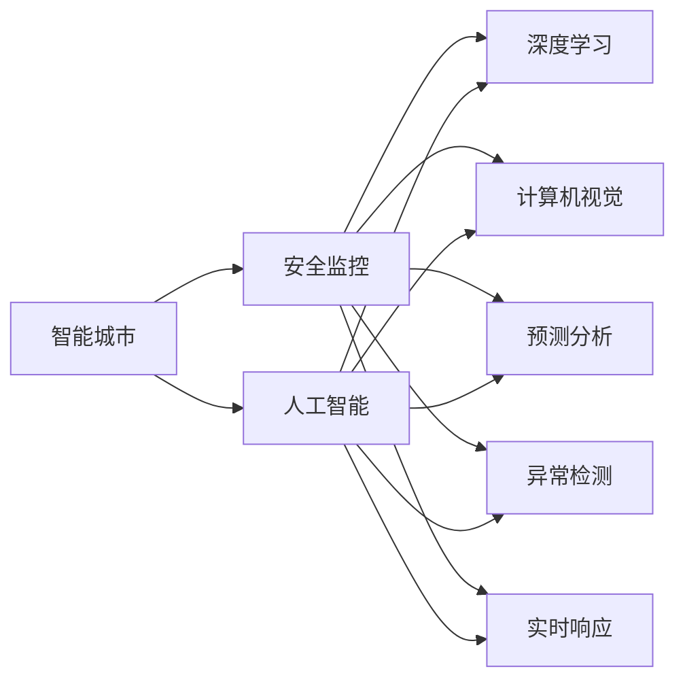

                 

# AI在智能城市安全监控中的应用：提高公共安全

> 关键词：智能城市,安全监控,人工智能,机器学习,深度学习,计算机视觉,预测分析,异常检测,实时响应

## 1. 背景介绍

### 1.1 问题由来
随着城市化进程的加速，人口密集、车辆繁多、设施复杂的城市环境对公共安全提出了更高的要求。传统的人工巡逻、人力监控等方式已难以应对日益复杂的安全挑战。如何通过智能化手段提升城市安全监控能力，保障公众的生命财产安全，成为当下社会的热点问题。

人工智能技术，特别是深度学习、计算机视觉等，为城市安全监控提供了全新的解决方案。通过部署智能监控系统，利用AI技术对视频数据进行实时分析，可以大幅提升监控效率和精确度，实现自动化、智能化、实时化的安全管理。

### 1.2 问题核心关键点
智能城市安全监控的核心在于利用AI技术对视频数据进行高效分析，及时识别潜在的安全威胁，并快速响应处置。关键点包括：

1. 数据采集：收集城市各区域的视频监控数据。
2. 模型训练：在大规模标注数据上训练AI模型，实现目标检测、行为分析等功能。
3. 实时分析：通过部署在云端或边缘设备的AI模型，对实时监控数据进行自动分析。
4. 异常检测：及时发现异常行为，触发警报和联动措施。
5. 响应处置：结合警力、消防、医疗等资源，快速处理安全事件。

### 1.3 问题研究意义
智能城市安全监控技术的研发和应用，对于提升城市公共安全水平，构建和谐社会，具有重要意义：

1. 提升效率：智能监控系统可以24小时不间断地工作，大幅度提升监控效率和响应速度。
2. 降低成本：相比传统的人工监控，AI监控系统可以大幅降低人力成本和运营成本。
3. 精确识别：AI模型可以精确识别目标，不受天气、光线等环境因素影响，提高监控准确性。
4. 多源融合：结合各类传感器数据，实现多维度、全视野的安全监控。
5. 预警预防：通过预测分析，及时发现并预警潜在的安全隐患，防患于未然。

## 2. 核心概念与联系

### 2.1 核心概念概述

为更好地理解智能城市安全监控的AI应用，本节将介绍几个关键概念及其联系：

- **智能城市(Smart City)**：利用信息技术和物联网技术，实现城市管理智能化、信息化、数字化，提升城市运行效率、管理水平和居民生活质量。
- **安全监控(Security Surveillance)**：通过视频监控、传感器等设备，实时采集和分析城市环境数据，及时发现和处理安全威胁。
- **人工智能(Artificial Intelligence, AI)**：通过模拟人类智能行为，实现自主学习、推理、决策等功能，提升监控效率和精确度。
- **深度学习(Deep Learning)**：一种基于多层神经网络的机器学习技术，能够自动提取数据中的复杂特征，广泛应用于目标检测、行为分析等任务。
- **计算机视觉(Computer Vision)**：研究如何让计算机通过视觉传感器获取和理解图像、视频等视觉信息，实现目标检测、跟踪、识别等功能。
- **预测分析(Predictive Analytics)**：利用历史数据和模型，预测未来事件的发展趋势，辅助决策和预警。
- **异常检测(Anomaly Detection)**：通过机器学习模型，自动识别数据中的异常行为或事件，及时触发警报和处理措施。
- **实时响应(Real-time Response)**：系统能够快速响应用户请求或异常事件，自动进行任务调度、资源调配等操作。

这些核心概念通过以下Mermaid流程图来展示它们之间的逻辑关系：



这个流程图展示了智能城市安全监控系统中的关键组件及其相互关系。通过AI技术，可以对各种数据进行处理，实现目标检测、行为分析、预测预警等功能。

## 3. 核心算法原理 & 具体操作步骤
### 3.1 算法原理概述

智能城市安全监控系统的核心算法原理基于深度学习和计算机视觉技术，具体包括以下几个步骤：

1. **数据采集**：通过城市各区域的监控摄像头，采集视频监控数据。
2. **数据标注**：将监控视频中出现的各种目标和行为进行标注，生成标注数据集。
3. **模型训练**：在大规模标注数据上训练深度学习模型，如卷积神经网络(CNN)、循环神经网络(RNN)、目标检测模型等。
4. **实时分析**：部署在云端或边缘设备的AI模型，对实时监控视频进行目标检测、行为分析等任务。
5. **异常检测**：利用训练好的模型，检测视频中的异常行为，如异常人员、车辆、火灾等。
6. **实时响应**：根据异常检测结果，自动触发警报，联动相关部门进行处理。

### 3.2 算法步骤详解

以下是智能城市安全监控系统的主要算法步骤：

1. **数据预处理**：对监控视频进行预处理，包括帧率调整、噪声滤除、图像增强等，确保数据质量。
2. **目标检测**：使用深度学习模型进行目标检测，识别出视频中的各种目标。
3. **行为分析**：对检测到的目标进行行为分析，如行进速度、方向、姿态等。
4. **异常识别**：利用异常检测算法，识别出异常行为，如逃跑、手持危险物品等。
5. **警报联动**：根据异常检测结果，触发警报，联动相关部门进行处理，如调派警力、通知消防、医疗等。
6. **数据分析**：对历史数据进行统计分析，发现异常模式，预测未来事件。

### 3.3 算法优缺点

智能城市安全监控系统的优点包括：

1. 实时性高：利用深度学习和计算机视觉技术，可以实现实时视频分析。
2. 精度高：深度学习模型可以自动提取图像特征，提高目标检测和行为分析的准确性。
3. 自动响应：系统能够自动触发警报和联动措施，减少人工干预。
4. 可扩展性强：可以通过增加摄像头和传感器，实现多源数据融合，提高监控效果。

缺点主要包括：

1. 初始投资高：需要购买和部署大量硬件设备，并进行大规模数据标注和模型训练。
2. 数据隐私问题：监控视频可能涉及个人隐私，需要严格保护和规范使用。
3. 对抗攻击风险：恶意攻击者可能通过假冒目标等方式欺骗系统，需要进行安全防护。

### 3.4 算法应用领域

智能城市安全监控系统的AI算法已在多个领域得到广泛应用，例如：

1. **公共场所监控**：对商场、机场、地铁等公共场所进行实时监控，及时发现和处理异常行为。
2. **社区安全管理**：对居民区进行视频监控，及时发现和防范盗窃、火灾等安全威胁。
3. **交通监控管理**：对道路、桥梁等交通设施进行实时监控，及时发现交通违规行为，保障交通安全。
4. **工业园区监控**：对工业园区进行视频监控，及时发现和防范工业事故，保护员工安全。
5. **校园安全管理**：对学校进行视频监控，及时发现和处理学生欺凌、突发事件等。

## 4. 数学模型和公式 & 详细讲解 & 举例说明

### 4.1 数学模型构建

智能城市安全监控系统中的核心模型通常基于深度学习框架，如TensorFlow、PyTorch等。以下以CNN模型为例，介绍其主要数学模型构建。

假设输入图像大小为$H\times W\times C$，CNN模型由多个卷积层、池化层和全连接层组成。模型输出为$K$个类别，每个类别的预测概率为$p_i$。

模型输出的计算公式为：

$$
p_i = \sigma(W_i^{(L)}[Z^{(L-1)}])
$$

其中，$\sigma$为激活函数，$W_i^{(L)}$为第$L$层第$i$个类别的权重矩阵，$Z^{(L-1)}$为前一层的输出特征图。

### 4.2 公式推导过程

CNN模型的核心推导过程如下：

1. **卷积层**：通过卷积核提取图像特征，公式为：

$$
F(x, \omega) = \sum_{i=1}^{n} \omega_i x_i
$$

其中，$x$为输入特征图，$\omega$为卷积核，$n$为卷积核数量。

2. **池化层**：通过池化操作减小特征图尺寸，公式为：

$$
P(X) = \max_i \{ X_i \}, \text{for all} \ X \in X
$$

其中，$X$为输入特征图，$P$为池化后的特征图。

3. **全连接层**：通过权重矩阵连接池化层的输出特征，公式为：

$$
Z^{(L)} = W^{(L)}[Z^{(L-1)}]
$$

其中，$Z^{(L-1)}$为前一层的输出特征，$W^{(L)}$为第$L$层权重矩阵，$Z^{(L)}$为第$L$层输出特征。

### 4.3 案例分析与讲解

以目标检测模型为例，介绍其在智能城市安全监控中的应用。

目标检测模型通常包括两个部分：区域候选框提取和候选框分类。

1. **区域候选框提取**：通过卷积层和池化层提取图像特征，利用滑动窗口或区域建议算法生成候选框，公式为：

$$
R_i = [t_i, b_i, l_i, r_i]
$$

其中，$t$为候选框顶部坐标，$b$为底部坐标，$l$为左侧坐标，$r$为右侧坐标。

2. **候选框分类**：利用分类器对候选框进行分类，公式为：

$$
p_i = \sigma(W_i^{(L)}[Z^{(L-1)}])
$$

其中，$p_i$为第$i$个类别的预测概率，$Z^{(L-1)}$为前一层的输出特征图，$W_i^{(L)}$为第$L$层第$i$个类别的权重矩阵。

通过目标检测模型，可以实现实时监控视频中的目标识别和定位。例如，当系统检测到异常人员时，可以触发警报，联动保安部门进行处理。

## 5. 项目实践：代码实例和详细解释说明

### 5.1 开发环境搭建

在进行智能城市安全监控系统开发前，我们需要准备好开发环境。以下是使用Python进行TensorFlow开发的环境配置流程：

1. 安装Anaconda：从官网下载并安装Anaconda，用于创建独立的Python环境。

2. 创建并激活虚拟环境：
```bash
conda create -n tf-env python=3.8 
conda activate tf-env
```

3. 安装TensorFlow：根据CUDA版本，从官网获取对应的安装命令。例如：
```bash
conda install tensorflow==2.7
```

4. 安装必要的Python库：
```bash
pip install numpy pandas scikit-image scikit-learn matplotlib
```

完成上述步骤后，即可在`tf-env`环境中开始开发。

### 5.2 源代码详细实现

以下是使用TensorFlow实现智能城市安全监控系统的示例代码：

```python
import tensorflow as tf
import numpy as np
import matplotlib.pyplot as plt
import cv2

# 定义模型
model = tf.keras.models.Sequential([
    tf.keras.layers.Conv2D(32, (3, 3), activation='relu', input_shape=(224, 224, 3)),
    tf.keras.layers.MaxPooling2D((2, 2)),
    tf.keras.layers.Conv2D(64, (3, 3), activation='relu'),
    tf.keras.layers.MaxPooling2D((2, 2)),
    tf.keras.layers.Flatten(),
    tf.keras.layers.Dense(128, activation='relu'),
    tf.keras.layers.Dense(2, activation='softmax')
])

# 加载数据
x_train = np.load('train_images.npy')
y_train = np.load('train_labels.npy')

# 训练模型
model.compile(optimizer='adam', loss='categorical_crossentropy', metrics=['accuracy'])
model.fit(x_train, y_train, epochs=10, validation_split=0.2)

# 测试模型
x_test = np.load('test_images.npy')
y_test = np.load('test_labels.npy')
model.evaluate(x_test, y_test)

# 实时监控
cap = cv2.VideoCapture(0)
while True:
    ret, frame = cap.read()
    if ret:
        frame = cv2.resize(frame, (224, 224))
        frame = np.expand_dims(frame, axis=0)
        prediction = model.predict(frame)
        class_id = np.argmax(prediction)
        if class_id == 1:
            print('Anomaly detected')
        cv2.imshow('frame', frame)
        if cv2.waitKey(1) & 0xFF == ord('q'):
            break
cap.release()
cv2.destroyAllWindows()
```

### 5.3 代码解读与分析

让我们再详细解读一下关键代码的实现细节：

**模型定义**：
- `tf.keras.models.Sequential`：定义顺序模型，包含卷积层、池化层、全连接层等。
- `tf.keras.layers.Conv2D`：定义卷积层，提取图像特征。
- `tf.keras.layers.MaxPooling2D`：定义池化层，减小特征图尺寸。
- `tf.keras.layers.Flatten`：将池化后的特征图展平，准备全连接层。
- `tf.keras.layers.Dense`：定义全连接层，进行分类。

**数据加载**：
- `np.load`：从磁盘加载训练数据和标签。
- `model.compile`：编译模型，指定优化器、损失函数和评估指标。
- `model.fit`：训练模型，指定训练数据、验证数据和训练轮数。
- `model.evaluate`：评估模型，指定测试数据和评估指标。

**实时监控**：
- `cv2.VideoCapture`：打开摄像头，获取实时视频流。
- `cv2.resize`：调整视频流尺寸，适应模型输入。
- `np.expand_dims`：扩展视频帧的维度，适配模型输入。
- `model.predict`：对视频帧进行预测，得到分类结果。
- `cv2.imshow`：显示实时监控视频。
- `cv2.waitKey`：等待按键输入，退出程序。

这段代码展示了使用TensorFlow进行目标检测和实时监控的完整流程。开发者可以根据具体需求，进一步优化和扩展代码，实现更复杂的功能。

## 6. 实际应用场景

### 6.1 智能社区安防

智能社区安防系统通过部署摄像头和传感器，实时监控社区内的各种行为和活动。利用AI技术，可以自动识别异常行为，如翻越围墙、破坏公共设施等，及时触发警报和联动措施，保障社区安全。

在技术实现上，可以通过对社区监控视频进行实时分析，检测异常行为并生成报警。系统可根据报警级别，联动保安、消防等资源进行快速响应和处理。

### 6.2 校园安全管理

校园安全管理系统通过对校园内监控视频的实时分析，检测学生欺凌、违规行为等，及时发现并处理安全隐患。通过AI技术，可以实现对异常行为的高效识别和快速响应。

在实践中，可以通过训练专门针对学生行为识别的模型，实现对校园监控视频的高效分析。系统可以根据异常行为的类型，自动触发报警和响应措施，确保校园安全。

### 6.3 机场安全检查

机场安全检查系统通过对旅客行为和物品的实时监控，自动识别异常人员和物品，及时触发报警和处理措施。利用AI技术，可以大幅提升安检效率和准确性。

在技术实现上，可以通过对旅客和行李的视频进行实时分析，识别出异常行为和物品。系统可以根据异常情况，自动触发报警和联动安全人员进行处理。

### 6.4 工业园区监控

工业园区监控系统通过对园区内的视频监控数据进行实时分析，检测工业事故和违规行为，及时触发报警和联动措施，保障园区安全。通过AI技术，可以实现对工业园区内复杂环境的精准监控。

在技术实现上，可以通过训练针对工业环境的模型，实现对监控视频的高效分析。系统可以根据异常情况，自动触发报警和联动消防、救援等资源进行处理。

## 7. 工具和资源推荐
### 7.1 学习资源推荐

为了帮助开发者系统掌握智能城市安全监控的AI技术，这里推荐一些优质的学习资源：

1. TensorFlow官方文档：提供了详细的API文档和教程，帮助开发者快速上手TensorFlow。
2. PyTorch官方文档：提供了丰富的深度学习框架教程，涵盖目标检测、分类、生成等任务。
3. 《深度学习》书籍：由Ian Goodfellow等人编写，全面介绍了深度学习的基本概念和经典模型。
4. 《计算机视觉：算法与应用》书籍：由Simon J.D. Prince等人编写，介绍了计算机视觉的基本原理和应用实例。
5. 《机器学习实战》书籍：由Peter Harrington编写，提供了实用的机器学习项目和代码实现。
6. Coursera《机器学习》课程：斯坦福大学Andrew Ng教授主讲，深入浅出地介绍了机器学习的基本原理和应用实例。

通过对这些资源的学习实践，相信你一定能够快速掌握智能城市安全监控系统的开发技术，并用于解决实际的安防问题。

### 7.2 开发工具推荐

高效的开发离不开优秀的工具支持。以下是几款用于智能城市安全监控系统开发的常用工具：

1. TensorFlow：由Google主导开发的深度学习框架，支持多种设备，适合大规模工程应用。
2. PyTorch：Facebook开发的深度学习框架，灵活易用，适合快速迭代研究。
3. OpenCV：开源计算机视觉库，提供了丰富的图像处理和分析工具，适合视频监控应用。
4. Matplotlib：Python数据可视化库，可以实时展示模型输出结果。
5. TensorBoard：TensorFlow配套的可视化工具，实时监测模型训练状态。

合理利用这些工具，可以显著提升智能城市安全监控系统的开发效率，加快创新迭代的步伐。

### 7.3 相关论文推荐

智能城市安全监控技术的发展源于学界的持续研究。以下是几篇奠基性的相关论文，推荐阅读：

1. R-CNN: Object Detection with Region Proposal Networks：提出区域候选框提取方法，用于目标检测。
2. Fast R-CNN: Towards Real-Time Object Detection with Region Proposal Networks：优化区域候选框提取，实现实时目标检测。
3. YOLO: Real-Time Object Detection：提出单阶段目标检测方法，实现快速实时目标检测。
4. SSD: Single Shot MultiBox Detector：提出单阶段目标检测方法，提高目标检测的准确性和效率。
5. Faster R-CNN: Towards Real-Time Object Detection with Region Proposal Networks：改进区域候选框提取算法，实现更高精度和速度的目标检测。

这些论文代表了大规模目标检测算法的发展脉络。通过学习这些前沿成果，可以帮助研究者把握学科前进方向，激发更多的创新灵感。

## 8. 总结：未来发展趋势与挑战

### 8.1 总结

本文对智能城市安全监控系统中的AI技术进行了全面系统的介绍。首先阐述了智能城市安全监控的背景和意义，明确了AI技术在提升公共安全方面的独特价值。其次，从原理到实践，详细讲解了AI技术在目标检测、行为分析、异常检测等任务中的实现方法和关键步骤，给出了开发应用的完整代码实例。同时，本文还广泛探讨了AI技术在智能社区、校园、机场、工业园区等实际场景中的应用，展示了AI技术的广泛适用性和巨大潜力。此外，本文精选了AI技术相关的学习资源，力求为读者提供全方位的技术指引。

通过本文的系统梳理，可以看到，AI技术在智能城市安全监控系统中具有重要意义。通过深度学习、计算机视觉等技术，可以实现对城市监控数据的自动分析和实时响应，大幅提升公共安全水平，保障社会稳定和人民安全。未来，伴随AI技术的持续演进，智能城市安全监控系统必将在更多领域得到应用，为构建和谐社会提供重要保障。

### 8.2 未来发展趋势

展望未来，智能城市安全监控系统中的AI技术将呈现以下几个发展趋势：

1. 实时性更高：通过优化算法和硬件设备，实现更高精度的实时视频分析。
2. 智能化更强：通过引入更多AI模型和算法，实现更智能的目标检测和行为分析。
3. 多源融合：结合各类传感器数据，实现多维度、全视野的安全监控。
4. 跨域协同：与物联网、云计算等技术结合，实现跨系统、跨地域的协同监控。
5. 可视化增强：通过增强可视化技术，实现对监控数据的全方位展示和分析。
6. 安全性提升：通过引入安全防护机制，保障数据和系统的安全。

以上趋势凸显了AI技术在智能城市安全监控中的广阔前景。这些方向的探索发展，必将进一步提升监控系统的性能和应用范围，为构建安全、可靠、高效的智能城市提供重要保障。

### 8.3 面临的挑战

尽管智能城市安全监控系统中的AI技术已经取得了显著进展，但在迈向更加智能化、普适化应用的过程中，它仍面临诸多挑战：

1. 数据获取瓶颈：大规模监控数据采集和标注成本高，难以覆盖所有城市区域。
2. 数据隐私问题：监控视频可能涉及个人隐私，需要严格保护和规范使用。
3. 对抗攻击风险：恶意攻击者可能通过假冒目标等方式欺骗系统，需要进行安全防护。
4. 模型鲁棒性不足：面对复杂的城市环境，模型泛化性能和鲁棒性有待提升。
5. 计算资源限制：大规模目标检测和行为分析需要高性能硬件和算法支持。
6. 模型更新困难：预训练模型难以快速适应新场景，需要持续更新和优化。

这些挑战亟需学界和产业界的共同努力，积极应对并寻求突破，方能实现智能城市安全监控系统的全面部署和应用。

### 8.4 研究展望

面对智能城市安全监控系统中的AI技术所面临的挑战，未来的研究需要在以下几个方面寻求新的突破：

1. 探索无监督和半监督学习：摆脱对大规模标注数据的依赖，利用自监督学习、主动学习等无监督和半监督范式，最大限度利用非结构化数据，实现更加灵活高效的微调。
2. 研究参数高效和计算高效的微调范式：开发更加参数高效的微调方法，在固定大部分预训练参数的同时，只更新极少量的任务相关参数。同时优化微调模型的计算图，减少前向传播和反向传播的资源消耗，实现更加轻量级、实时性的部署。
3. 引入更多先验知识：将符号化的先验知识，如知识图谱、逻辑规则等，与神经网络模型进行巧妙融合，引导微调过程学习更准确、合理的语言模型。同时加强不同模态数据的整合，实现视觉、语音等多模态信息与文本信息的协同建模。
4. 结合因果分析和博弈论工具：将因果分析方法引入微调模型，识别出模型决策的关键特征，增强输出解释的因果性和逻辑性。借助博弈论工具刻画人机交互过程，主动探索并规避模型的脆弱点，提高系统稳定性。
5. 纳入伦理道德约束：在模型训练目标中引入伦理导向的评估指标，过滤和惩罚有偏见、有害的输出倾向。同时加强人工干预和审核，建立模型行为的监管机制，确保输出符合人类价值观和伦理道德。

这些研究方向的探索，必将引领智能城市安全监控系统迈向更高的台阶，为构建安全、可靠、可解释、可控的智能城市提供重要保障。面向未来，智能城市安全监控系统还需要与其他AI技术进行更深入的融合，如知识表示、因果推理、强化学习等，多路径协同发力，共同推动安全监控系统的进步。只有勇于创新、敢于突破，才能不断拓展AI技术在智能城市安全监控中的边界，让智能技术更好地造福人类社会。

## 9. 附录：常见问题与解答

**Q1：智能城市安全监控系统是否需要依赖大数据？**

A: 智能城市安全监控系统确实需要大规模监控数据作为训练基础，以提高模型的泛化能力和准确性。然而，数据的质量和标注成本是关键因素。通过使用自动标注和半监督学习等技术，可以在一定程度上降低对标注数据的依赖。

**Q2：智能城市安全监控系统如何保障数据隐私？**

A: 智能城市安全监控系统需要严格遵守数据隐私保护法律法规，如《中华人民共和国个人信息保护法》等。具体措施包括：
- 数据匿名化：对监控视频进行匿名化处理，去除敏感信息。
- 访问控制：设置访问权限，只允许授权人员访问监控数据。
- 数据加密：对传输和存储的数据进行加密处理，防止数据泄露。
- 数据最小化：仅收集和存储必要的数据，减少隐私风险。

**Q3：智能城市安全监控系统如何应对对抗攻击？**

A: 对抗攻击是智能城市安全监控系统面临的重要挑战。为了应对对抗攻击，可以采取以下措施：
- 目标检测模型设计：选择鲁棒性强的目标检测模型，如YOLO、SSD等。
- 数据增强：使用数据增强技术，生成对抗样本，提高模型的鲁棒性。
- 模型验证：定期对模型进行测试和验证，确保其鲁棒性和准确性。
- 异常检测：结合多模态数据，利用异常检测技术，及时发现和处理异常行为。

这些措施可以在一定程度上提升智能城市安全监控系统的鲁棒性和安全性，防止对抗攻击对系统造成破坏。

**Q4：智能城市安全监控系统如何保证实时响应速度？**

A: 智能城市安全监控系统需要高效的实时响应速度，以确保及时处理安全事件。可以通过以下措施提升系统响应速度：
- 优化算法：选择高效的算法模型，减少计算复杂度。
- 硬件加速：利用GPU、TPU等高性能设备进行加速计算。
- 分布式部署：采用分布式计算架构，提高计算效率。
- 数据预处理：对视频数据进行预处理，减少数据规模，提高处理速度。

这些措施可以显著提升智能城市安全监控系统的实时响应速度，确保系统能够快速响应安全事件。

**Q5：智能城市安全监控系统如何实现跨系统、跨地域的协同监控？**

A: 实现跨系统、跨地域的协同监控，需要搭建统一的平台，实现系统间的数据共享和协同。具体措施包括：
- 统一数据标准：制定统一的数据标准和协议，实现数据互通。
- 数据同步机制：建立数据同步机制，实时更新监控数据。
- 协同决策模型：引入协同决策模型，实现多系统间的协同决策。
- 跨域通信协议：采用跨域通信协议，实现不同系统间的通信和数据交换。

通过搭建统一的协同监控平台，可以实现跨系统、跨地域的实时监控和协同决策，提升监控系统的覆盖范围和响应速度。

---

作者：禅与计算机程序设计艺术 / Zen and the Art of Computer Programming

