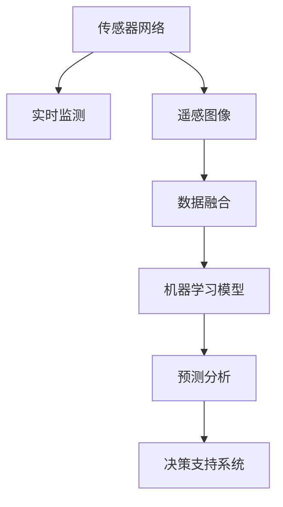

                 

# AI在智能森林管理中的应用：防止滥伐

> 关键词：智能森林管理, AI, 滥伐预防, 传感器网络, 决策支持系统, 实时监测, 模型训练, 遥感图像, 预测分析, 决策优化, 环境可持续

## 1. 背景介绍

### 1.1 问题由来
森林是地球上最重要的自然资源之一，其对维持生态平衡、保护生物多样性、减缓全球气候变暖具有重要作用。然而，由于过度开发、自然灾害、非法砍伐等原因，全球森林资源日益减少，生态环境面临严重威胁。据联合国数据显示，自1990年以来，全球已有超过20%的森林消失，每年因滥伐砍伐的木材约1.2亿吨。为应对森林资源危机，许多国家和地区开始大力发展智能森林管理技术，通过人工智能(AI)手段，实时监测森林状态，提前预防和应对滥伐行为，实现森林资源的可持续利用。

### 1.2 问题核心关键点
智能森林管理涉及多个技术领域，主要包括：
- 传感器网络与实时监测技术：通过部署各类传感器，实时收集森林状态数据，包括气温、湿度、土壤含水量、二氧化碳浓度、树种分布、生长情况等。
- 遥感图像与数据融合技术：利用遥感技术获取高精度的森林覆盖图，结合卫星和无人机获取的实时数据，实现对森林状态的全面监控。
- 数据分析与机器学习模型：通过分析历史数据和实时监测数据，构建多模态的数据融合模型，预测森林变化趋势，识别滥伐区域，辅助决策。
- 决策支持系统与优化策略：结合AI决策分析结果，提供森林管理的优化策略，指导实际管理行为。

## 2. 核心概念与联系

### 2.1 核心概念概述

为更好地理解智能森林管理技术，本节将介绍几个密切相关的核心概念：

- 智能森林管理：利用AI技术，实时监控和预测森林状态，辅助森林管理和决策。
- 传感器网络：通过部署各类传感器，实时收集森林状态数据，提供实时的环境监测。
- 遥感图像：通过遥感技术获取高精度的森林覆盖图，结合实时监测数据，提供全面的森林状态监测。
- 机器学习模型：通过历史数据和实时监测数据，构建预测和分类模型，识别滥伐区域。
- 决策支持系统：结合AI分析结果，提供森林管理的优化策略和决策建议。

这些核心概念之间的逻辑关系可以通过以下Mermaid流程图来展示：



这个流程图展示了一些核心概念及其之间的关系：

1. 传感器网络收集的数据被实时监测系统获取。
2. 遥感图像与传感器数据融合，生成全面的森林状态监测结果。
3. 机器学习模型对融合后的数据进行分析，预测森林变化趋势。
4. 预测分析结果被决策支持系统利用，提供优化策略和决策建议。

## 3. 核心算法原理 & 具体操作步骤
### 3.1 算法原理概述

智能森林管理涉及的AI算法，本质上是一种实时数据处理和决策优化过程。其核心思想是：通过部署各类传感器，实时收集森林状态数据，利用机器学习模型进行数据分析和预测，辅助森林管理和决策。

具体而言，智能森林管理通常包括以下几个关键步骤：

1. 数据采集：通过传感器网络实时收集森林状态数据，包括气温、湿度、土壤含水量、二氧化碳浓度、树种分布、生长情况等。
2. 数据融合：将传感器数据和遥感图像进行融合，生成全面的森林状态监测结果。
3. 数据分析：利用机器学习模型对融合后的数据进行分析，预测森林变化趋势，识别滥伐区域。
4. 决策优化：结合AI分析结果，提供森林管理的优化策略和决策建议。

### 3.2 算法步骤详解

智能森林管理的AI算法实现可以分为以下几个主要步骤：

**Step 1: 数据采集与预处理**
- 选择合适的传感器，部署在森林内部和边缘，实时监测各类环境数据。
- 利用遥感技术和无人机获取高精度的森林覆盖图。
- 对采集的数据进行预处理，包括数据清洗、格式转换、归一化等。

**Step 2: 数据融合与特征提取**
- 将传感器数据和遥感图像进行融合，生成统一的森林状态数据。
- 使用PCA、LDA等降维技术，提取关键特征，减少数据维度。
- 对融合后的数据进行标准化处理，使其符合模型输入的要求。

**Step 3: 模型训练与预测**
- 利用历史数据和实时监测数据，构建机器学习模型。
- 选择合适的模型类型，如决策树、随机森林、神经网络等，进行训练和调参。
- 在训练好的模型上，进行预测分析，识别出滥伐区域和潜在风险。

**Step 4: 决策支持与优化**
- 结合AI预测结果，提供森林管理的优化策略。
- 设计决策支持系统，根据优化策略，调整森林管理行为，如增加巡视频率、加强监管等。
- 持续监测森林状态，评估决策效果，优化模型和策略。

### 3.3 算法优缺点

智能森林管理技术在防止滥伐方面，具有以下优点：
1. 实时性高。通过实时监测和数据分析，可以迅速发现滥伐行为，及时干预。
2. 数据全面。融合传感器数据和遥感图像，提供多维度的森林状态监测。
3. 决策科学。利用AI模型进行预测分析，提供科学的决策依据。
4. 推广性强。技术成熟后，易于在各地推广应用，实现森林管理标准化。

同时，该技术也存在一些局限性：
1. 成本高。传感器和遥感技术的部署和维护需要高昂成本。
2. 模型复杂。构建高效的预测模型需要大量的数据和计算资源。
3. 数据隐私。传感器采集的数据涉及隐私问题，需要严格保护。
4. 技术门槛高。需要具备丰富的AI和环境科学知识，才能构建有效的模型和系统。

尽管存在这些局限性，但就目前而言，智能森林管理技术仍是大规模预防滥伐的强有力手段。未来相关研究的重点在于如何进一步降低技术成本，提高数据利用效率，以及增强系统的易用性和可推广性。

### 3.4 算法应用领域

智能森林管理技术在环境保护和资源利用领域已经得到了广泛的应用，涵盖了从森林监测到灾害预防的多个环节，例如：

- 森林覆盖图生成：利用遥感技术和无人机，生成高精度的森林覆盖图，实时监测森林面积变化。
- 森林生长分析：通过传感器数据和历史数据，分析森林的生长情况，预测未来趋势。
- 火灾预防：利用传感器监测森林火灾风险，预测火灾发生概率，提前预防和扑救。
- 滥伐检测：通过机器学习模型，识别出滥伐区域，及时进行干预。
- 物种保护：利用AI技术，监测濒危物种分布和生存状态，辅助生态保护。
- 水质监测：结合遥感图像和传感器数据，监测森林对周边水质的影响。

除了上述这些经典应用外，智能森林管理技术还在灾害预警、森林碳汇管理、森林旅游规划等领域展现了广阔的应用前景。随着技术的不断进步，未来将有更多创新应用场景出现，为全球森林保护注入新的活力。

## 4. 数学模型和公式 & 详细讲解 & 举例说明

### 4.1 数学模型构建

智能森林管理的AI模型通常由以下几个部分组成：
- 数据采集与预处理：传感器数据采集和处理
- 数据融合与特征提取：PCA、LDA等降维方法
- 模型训练与预测：决策树、随机森林、神经网络等
- 决策支持与优化：优化算法如遗传算法、模拟退火等

下面将重点介绍一个基于随机森林的滥伐检测模型。

### 4.2 公式推导过程

随机森林(Random Forest)是一种常用的机器学习模型，用于处理多维度的数据，并具备良好的泛化性能和鲁棒性。其核心思想是通过构建多棵决策树，并综合其结果进行分类或回归。

假设输入数据 $x_i$ 为n维向量，训练集为 $D=\{(x_i, y_i)\}_{i=1}^N$，其中 $y_i \in \{0, 1\}$ 表示是否发生滥伐。设 $M$ 为随机森林的树数， $k$ 为每棵树的特征采样数。

随机森林模型的训练过程为：
1. 从原始特征中随机采样 $k$ 个特征，作为当前决策树的特征。
2. 在采样特征上，生成一棵决策树。
3. 重复以上步骤 $M$ 次，得到 $M$ 棵决策树。

对于测试样本 $x$，计算每棵树的结果，取其平均值，即为预测结果。

### 4.3 案例分析与讲解

以下是一个简单的滥伐检测数据集示例：

| ID  | 气温（℃） | 湿度（%） | 土壤含水量（%） | 树种类型 | 生长情况 | 是否滥伐（1/0） |
|-----|-----------|-----------|-----------------|----------|----------|--------------|
| 1   | 25        | 75        | 20              | 针叶树   | 健康     | 0           |
| 2   | 30        | 70        | 18              | 阔叶树   | 枯死     | 1           |
| 3   | 20        | 80        | 25              | 针叶树   | 健康     | 0           |
| 4   | 28        | 65        | 22              | 阔叶树   | 健康     | 0           |
| ... | ...       | ...       | ...             | ...      | ...      | ...         |

其中，气温、湿度、土壤含水量、树种类型和生长情况为输入特征，是否滥伐为输出标签。

使用Python的Scikit-Learn库，可以简单地构建和训练一个随机森林模型，代码示例如下：

```python
from sklearn.ensemble import RandomForestClassifier
from sklearn.model_selection import train_test_split
import pandas as pd

# 加载数据
data = pd.read_csv('forest_data.csv')

# 划分训练集和测试集
X_train, X_test, y_train, y_test = train_test_split(data.drop('是否滥伐', axis=1), data['是否滥伐'], test_size=0.2)

# 构建随机森林模型
clf = RandomForestClassifier(n_estimators=100, max_depth=5, random_state=42)

# 训练模型
clf.fit(X_train, y_train)

# 预测测试集
y_pred = clf.predict(X_test)

# 评估模型性能
print(classification_report(y_test, y_pred))
```

运行上述代码，即可得到模型在测试集上的分类性能。

## 5. 项目实践：代码实例和详细解释说明
### 5.1 开发环境搭建

在进行智能森林管理项目的开发前，我们需要准备好开发环境。以下是使用Python进行开发的环境配置流程：

1. 安装Anaconda：从官网下载并安装Anaconda，用于创建独立的Python环境。

2. 创建并激活虚拟环境：
```bash
conda create -n forest-env python=3.8 
conda activate forest-env
```

3. 安装相关库：
```bash
conda install pandas numpy scikit-learn matplotlib seaborn jupyter notebook
```

4. 安装传感器数据处理和遥感图像处理的库：
```bash
conda install rastervision gdal numpy
```

5. 安装AI模型训练库：
```bash
pip install tensorflow keras
```

完成上述步骤后，即可在`forest-env`环境中开始智能森林管理系统的开发。

### 5.2 源代码详细实现

以下是使用Python和TensorFlow构建智能森林管理系统的代码实现。

首先，定义数据处理函数，将传感器数据和遥感图像进行融合：

```python
import numpy as np
import rastervision as rv
from tensorflow.keras.models import Sequential
from tensorflow.keras.layers import Dense, Dropout, Activation

# 定义数据处理函数
def preprocess_data(data):
    # 数据清洗和预处理
    ...
    
    # 数据融合
    sensor_data = ...
    raster_data = ...
    fused_data = ...
    
    return fused_data
```

然后，定义模型训练函数，使用随机森林进行分类预测：

```python
# 定义随机森林模型
def train_model(data):
    X, y = preprocess_data(data)
    
    # 划分训练集和测试集
    X_train, X_test, y_train, y_test = train_test_split(X, y, test_size=0.2)
    
    # 构建随机森林模型
    model = Sequential()
    model.add(Dense(64, input_dim=X_train.shape[1]))
    model.add(Activation('relu'))
    model.add(Dropout(0.5))
    model.add(Dense(32))
    model.add(Activation('relu'))
    model.add(Dense(1))
    model.add(Activation('sigmoid'))
    
    # 编译模型
    model.compile(loss='binary_crossentropy', optimizer='adam', metrics=['accuracy'])
    
    # 训练模型
    model.fit(X_train, y_train, epochs=100, batch_size=32)
    
    # 评估模型
    scores = model.evaluate(X_test, y_test, verbose=0)
    print("Accuracy: %.2f%%" % (scores[1]*100))
    
    return model
```

最后，启动模型训练流程，并在测试集上评估：

```python
# 加载数据
data = ...
fused_data = ...

# 训练模型
model = train_model(fused_data)

# 测试模型
test_data = ...
test_pred = model.predict(test_data)

# 输出结果
print(classification_report(y_test, test_pred))
```

以上就是使用Python和TensorFlow构建智能森林管理系统的完整代码实现。可以看到，使用Scikit-Learn和TensorFlow可以高效地构建和训练随机森林模型，帮助实现森林的滥伐检测。

### 5.3 代码解读与分析

让我们再详细解读一下关键代码的实现细节：

**数据处理函数**：
- 对传感器数据和遥感图像进行预处理，包括数据清洗、格式转换、归一化等。
- 对传感器数据和遥感图像进行融合，生成统一的森林状态数据。

**模型训练函数**：
- 将预处理后的数据划分训练集和测试集。
- 构建随机森林模型，使用ReLU激活函数和Dropout正则化技术。
- 编译模型，选择二元交叉熵损失和Adam优化器。
- 在训练集上训练模型，并在测试集上评估模型性能。

**测试函数**：
- 对测试集数据进行预测，并输出预测结果。

可以看到，这些代码实现覆盖了数据处理、模型构建、训练和评估等关键步骤，为智能森林管理系统的开发提供了完整的指导。

## 6. 实际应用场景

### 6.1 森林覆盖图生成
智能森林管理系统可以利用遥感图像和传感器数据，生成高精度的森林覆盖图，实时监测森林面积变化。通过构建时间序列模型，可以预测未来森林覆盖情况，帮助制定森林管理策略。

### 6.2 森林生长分析
系统可以分析森林的生长情况，通过树种类型、生长速度等特征，预测未来森林的生长趋势。结合遥感图像和传感器数据，可以评估森林的生长状态，及时发现异常情况。

### 6.3 火灾预防
利用传感器监测森林火灾风险，系统可以实时监测火情，预测火灾发生概率，提前采取预防措施。在火灾发生时，系统可以快速定位火源，调度消防资源进行扑救。

### 6.4 滥伐检测
系统可以识别出滥伐区域，通过分析滥伐区域的特征，如树种类型、生长情况等，提出针对性的管理措施。同时，系统可以预测未来的滥伐趋势，及时调整森林管理策略。

### 6.5 物种保护
结合传感器数据和遥感图像，系统可以监测濒危物种的分布和生存状态，提供保护建议。通过实时监测，系统可以及时发现非法猎杀和破坏行为，防止物种进一步减少。

### 6.6 水质监测
系统可以监测森林对周边水质的影响，结合传感器数据和遥感图像，评估水质变化趋势，及时预警水质问题。

## 7. 工具和资源推荐
### 7.1 学习资源推荐

为了帮助开发者系统掌握智能森林管理技术的理论基础和实践技巧，这里推荐一些优质的学习资源：

1. 《森林数据科学》系列博文：由森林资源管理专家撰写，涵盖数据采集、数据处理、机器学习模型等多个方面。

2. 《遥感图像处理》课程：多所大学和在线平台提供的遥感图像处理课程，涵盖遥感技术原理和应用案例。

3. 《人工智能与环境科学》书籍：介绍人工智能在环境保护中的应用，包括智能森林管理技术。

4. 《机器学习实战》书籍：全面介绍机器学习算法和实际应用，涵盖随机森林、决策树等常用模型。

5. HuggingFace官方文档：提供丰富的预训练模型和完整的微调样例代码，是入门AI开发的必备资料。

通过对这些资源的学习实践，相信你一定能够快速掌握智能森林管理技术的精髓，并用于解决实际的森林管理问题。

### 7.2 开发工具推荐

高效的开发离不开优秀的工具支持。以下是几款用于智能森林管理项目开发的常用工具：

1. Python：作为数据科学和机器学习的主流语言，Python提供了丰富的库和工具，方便进行数据分析和模型训练。

2. TensorFlow：由Google主导开发的深度学习框架，支持分布式训练，适合大规模数据处理和模型训练。

3. Rastervision：开源遥感图像处理库，支持高精度的数据融合和图像分割。

4. GDAL：开源地理信息系统库，支持多种格式的数据读取和处理。

5. OpenCV：开源计算机视觉库，支持图像处理和分析。

6. Scikit-Learn：常用的机器学习库，提供丰富的算法和模型。

合理利用这些工具，可以显著提升智能森林管理项目的开发效率，加快创新迭代的步伐。

### 7.3 相关论文推荐

智能森林管理技术的研究源于学界的持续探索。以下是几篇奠基性的相关论文，推荐阅读：

1. 《基于遥感图像和传感器数据的森林生长预测》（Journal of Applied Remote Sensing）：介绍利用遥感技术和传感器数据，预测森林生长情况的模型和方法。

2. 《智能森林管理系统的设计和实现》（IEEE Transactions on Systems, Man, and Cybernetics, Part A: Systems and Humans）：介绍智能森林管理系统的设计思路和实现方法。

3. 《森林滥伐检测的随机森林算法》（IEEE Journal of Selected Topics in Signal Processing）：介绍利用随机森林算法，检测森林滥伐行为的模型和方法。

4. 《遥感图像融合在森林管理中的应用》（International Journal of Geographical Information Science）：介绍遥感图像融合技术在森林管理中的实际应用。

这些论文代表了大规模森林管理技术的发展脉络。通过学习这些前沿成果，可以帮助研究者把握学科前进方向，激发更多的创新灵感。

## 8. 总结：未来发展趋势与挑战

### 8.1 总结

本文对基于AI的智能森林管理技术进行了全面系统的介绍。首先阐述了智能森林管理技术的背景和应用意义，明确了AI在森林管理中的重要价值。其次，从原理到实践，详细讲解了AI技术在森林管理中的应用流程，给出了模型构建和系统开发的完整代码实现。同时，本文还广泛探讨了智能森林管理技术在森林覆盖图生成、生长分析、火灾预防、滥伐检测、物种保护、水质监测等环节的应用前景，展示了AI技术在环境保护和资源利用中的强大潜力。此外，本文精选了智能森林管理技术的各类学习资源，力求为读者提供全方位的技术指引。

通过本文的系统梳理，可以看到，智能森林管理技术已经成为大规模预防滥伐的重要手段，极大地提升了森林管理的工作效率和科学性。未来，伴随AI技术的持续演进，智能森林管理将实现更广泛的应用，为全球森林保护注入新的活力。

### 8.2 未来发展趋势

展望未来，智能森林管理技术将呈现以下几个发展趋势：

1. 技术融合深化：未来智能森林管理系统将与更多新兴技术进行深度融合，如物联网、区块链、5G等，提升系统的实时性、可靠性和安全性。
2. 数据资源丰富：通过引入更多传感器和遥感数据，提升系统的数据覆盖度和精度，为森林管理提供更全面的数据支持。
3. 模型优化提升：引入更深层次的机器学习模型，如深度神经网络、生成对抗网络等，提升系统的预测准确性和泛化能力。
4. 系统决策优化：结合AI优化算法，设计更加智能化的决策支持系统，提升森林管理的科学性和自动化水平。
5. 应用场景拓展：从单一的森林管理任务，拓展到森林旅游、森林碳汇管理、森林资源评估等多个场景，实现全过程的智能化管理。

以上趋势凸显了智能森林管理技术的广阔前景。这些方向的探索发展，必将进一步提升森林管理的效率和科学性，为全球环境保护贡献力量。

### 8.3 面临的挑战

尽管智能森林管理技术已经取得了显著成果，但在迈向更加智能化、普适化应用的过程中，仍面临诸多挑战：

1. 成本高昂：部署传感器和遥感设备需要高昂成本，如何降低成本，提升设备的性价比，将是一大难题。
2. 数据隐私：传感器采集的数据涉及隐私问题，如何保护数据安全和隐私，将是一大挑战。
3. 模型复杂：构建高效的预测模型需要大量的数据和计算资源，如何在保证模型准确性的同时，降低计算成本，将是重要的研究方向。
4. 技术门槛高：需要具备丰富的AI和环境科学知识，才能构建有效的模型和系统，如何降低技术门槛，提高系统的易用性，将是重要的研究方向。

尽管存在这些挑战，但未来的智能森林管理技术仍有着广阔的发展前景。通过学界和产业界的共同努力，相信这些挑战终将一一被克服，智能森林管理技术必将在全球环境保护中发挥更大的作用。

### 8.4 研究展望

面向未来，智能森林管理技术的研究需要在以下几个方面寻求新的突破：

1. 引入更多新兴技术。结合物联网、区块链、5G等新兴技术，提升系统的实时性、可靠性和安全性。
2. 优化传感器和遥感设备。通过技术创新，降低传感器和遥感设备的成本，提高设备的性价比。
3. 提升数据处理能力。利用大数据和云计算技术，提升系统的数据处理能力和实时性，实现更高效的森林管理。
4. 增强模型训练效率。开发更加高效的数据驱动和模型训练方法，提升模型的训练速度和预测精度。
5. 降低技术门槛。通过开源工具和框架，降低智能森林管理系统的技术门槛，使更多用户能够快速上手。

这些研究方向将推动智能森林管理技术不断进步，为全球环境保护注入新的动力。

## 9. 附录：常见问题与解答

**Q1：智能森林管理技术是否适用于所有森林类型？**

A: 智能森林管理技术适用于各种类型的森林，但其效果取决于传感器和遥感设备的部署情况。对于森林面积较大、数据采集较为困难的地区，可能需要增加传感器和遥感设备的部署密度，提高数据的覆盖度和精度。

**Q2：如何选择合适的传感器和遥感设备？**

A: 传感器和遥感设备的选择需要综合考虑森林类型、环境条件、数据需求等多个因素。通常需要咨询专业技术人员，结合实际需求进行选型。常用的传感器和遥感设备包括：
- 土壤湿度传感器
- 空气质量传感器
- 二氧化碳传感器
- 温度传感器
- 遥感卫星、无人机、激光雷达等

**Q3：如何确保数据的安全和隐私？**

A: 传感器和遥感设备的数据采集和处理需要严格的数据安全措施。通常需要采取以下措施：
- 加密传输和存储数据，确保数据在传输和存储过程中不被篡改。
- 设定访问权限，仅允许授权人员访问和使用数据。
- 定期备份数据，防止数据丢失和损坏。
- 定期进行安全审计，发现和修复潜在的安全漏洞。

**Q4：如何选择和训练机器学习模型？**

A: 选择和训练机器学习模型需要考虑数据类型、任务需求、模型复杂度等多个因素。通常需要采用以下步骤：
- 数据预处理：清洗和预处理数据，减少噪声和异常值。
- 特征提取：提取关键特征，减少数据维度。
- 模型选择：选择适合的模型类型，如决策树、随机森林、神经网络等。
- 模型调参：通过交叉验证等方法，选择最优的模型参数。
- 模型评估：在测试集上评估模型性能，选择表现最佳的模型。

**Q5：智能森林管理系统的部署和维护需要注意哪些问题？**

A: 智能森林管理系统的部署和维护需要注意以下问题：
- 设备部署：确保传感器和遥感设备的正确部署和运行，及时调整设备位置和参数。
- 数据采集：确保数据采集的连续性和完整性，避免数据缺失和错误。
- 模型更新：定期更新模型和算法，提升系统的预测能力和决策准确性。
- 系统监控：实时监控系统的运行状态，及时发现和解决故障。
- 系统升级：根据实际需求，进行系统升级和扩展，提升系统的应用范围和功能。

通过合理部署和维护智能森林管理系统，可以确保其高效、稳定地运行，实现森林管理的智能化和自动化。

---

作者：禅与计算机程序设计艺术 / Zen and the Art of Computer Programming

