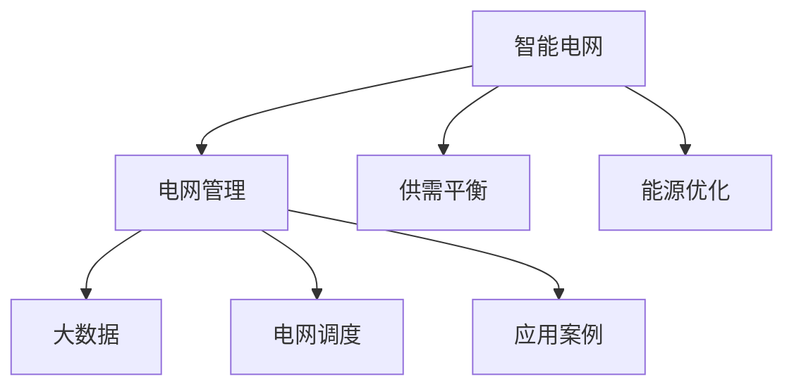

                 

# AI在智能电网管理中的应用：平衡供需关系

> 关键词：智能电网,电网管理,供需平衡,能源优化,人工智能,机器学习,深度学习,大数据,电网调度,应用案例

## 1. 背景介绍

### 1.1 问题由来
随着能源消耗的持续增长和环境问题的日益严重，传统电网已经难以适应未来能源发展的需要。智能电网应运而生，通过应用现代信息技术和人工智能，实现电网的智能化、自动化和高效化管理。

智能电网的核心目标是通过优化电网的运行和控制，实现能源的可靠、高效、安全和经济的供应。在这一过程中，平衡供需关系尤为重要。传统的电网调度和管理方式往往依赖于经验丰富的专家和人工操作，难以实时应对能源供需变化，容易出现供需不平衡、能源浪费等问题。

## 2. 核心概念与联系

### 2.1 核心概念概述

为更好地理解AI在智能电网中的应用，本节将介绍几个密切相关的核心概念：

- 智能电网(Smart Grid)：通过应用现代信息技术和通信技术，将电力系统与信息网络紧密结合，实现电网的智能化、自动化和高效化管理。

- 电网管理(Power Grid Management)：指对电力系统的运行、维护、调度和控制等各个方面进行管理，以实现电力供应的安全、可靠、高效和稳定。

- 供需平衡(Supply-Demand Balance)：指在一定时间和空间范围内，电力供给与需求在数量、质量和时序上的平衡状态。

- 能源优化(Energy Optimization)：通过优化电网中各个环节的运行，实现能源的最优分配和利用。

- 大数据(Big Data)：指大规模、多样化的数据集，通过大数据分析可以实现对电网运行状态的实时监测和预测。

- 电网调度(Power Grid Dispatch)：指对电网的运行进行实时监控、预测和优化，实现电网的稳定运行和高效调度。

- 应用案例(Real-world Application)：介绍AI在智能电网中的实际应用案例，如需求响应、负荷预测、故障检测等。

这些核心概念之间的逻辑关系可以通过以下Mermaid流程图来展示：



这个流程图展示了一系列核心概念之间的关系：

1. 智能电网通过应用大数据和人工智能技术，实现电网的智能化和自动化管理。
2. 电网管理是对电力系统各个环节进行监控、预测和优化，保障电网的稳定运行。
3. 供需平衡是电网管理的重要目标，确保电力供给与需求在数量、质量和时序上的平衡。
4. 能源优化是通过优化各个环节的运行，实现能源的最优分配和利用。
5. 大数据分析为电网管理和能源优化提供了强大的支持，实现电网的实时监测和预测。
6. 电网调度是电网管理的具体实现，确保电网的稳定运行和高效调度。
7. 应用案例展示了AI在智能电网中的实际应用，推动了电网的智能化进程。

## 3. 核心算法原理 & 具体操作步骤
### 3.1 算法原理概述

AI在智能电网中的应用，主要集中在以下几个方面：

- 负荷预测：通过历史数据和大数据分析，预测未来电网的负荷变化，为电网调度提供依据。
- 故障检测：利用机器学习模型对电网设备进行实时监测，及时发现并处理设备故障。
- 需求响应：通过智能算法优化用户需求，避免电网过载和能源浪费。
- 电网调度：通过优化算法实现电网的实时调度，平衡供需关系。
- 故障预测：通过预测算法预测电网故障，提前采取预防措施。

这些应用的核心算法原理都基于人工智能和大数据技术，主要包括以下几个步骤：

1. 数据收集：从各个电网节点和设备中收集实时数据，包括电压、电流、温度、湿度等。
2. 数据预处理：对收集到的数据进行清洗、归一化和特征工程等处理，提升数据的可用性。
3. 模型训练：选择合适的算法模型，利用历史数据和实时数据进行训练，得到预测模型。
4. 模型部署：将训练好的模型部署到电网调度系统中，进行实时预测和优化。
5. 结果评估：对模型的预测结果进行评估，确保其准确性和可靠性。
6. 模型迭代：根据评估结果和实际运行情况，不断优化和迭代模型，提升其性能。

### 3.2 算法步骤详解

#### 3.2.1 负荷预测

负荷预测是智能电网中非常重要的一环，通过预测未来负荷变化，电网公司可以提前安排生产、调整电力输出，保障电网的稳定运行。

具体算法步骤如下：

1. 数据收集：收集电网历史负荷数据和实时天气数据。
2. 数据预处理：对数据进行清洗、归一化、特征工程等预处理。
3. 模型选择：选择合适的时间序列预测模型，如ARIMA、LSTM等。
4. 模型训练：利用历史负荷数据进行模型训练。
5. 模型部署：将训练好的模型部署到电网调度系统中。
6. 结果评估：对模型的预测结果进行评估，确保其准确性。
7. 模型迭代：根据评估结果和实际运行情况，不断优化和迭代模型。

#### 3.2.2 故障检测

故障检测是智能电网中必不可少的环节，及时发现并处理设备故障，可以避免电网中断和能源浪费。

具体算法步骤如下：

1. 数据收集：收集电网设备的实时运行数据。
2. 数据预处理：对数据进行清洗、归一化、特征工程等预处理。
3. 模型选择：选择合适的异常检测模型，如SVM、KNN等。
4. 模型训练：利用历史故障数据进行模型训练。
5. 模型部署：将训练好的模型部署到电网调度系统中。
6. 结果评估：对模型的预测结果进行评估，确保其准确性。
7. 模型迭代：根据评估结果和实际运行情况，不断优化和迭代模型。

#### 3.2.3 需求响应

需求响应是智能电网中优化用户需求的重要手段，通过优化用户用电行为，可以避免电网过载和能源浪费。

具体算法步骤如下：

1. 数据收集：收集用户历史用电数据和实时用电数据。
2. 数据预处理：对数据进行清洗、归一化、特征工程等预处理。
3. 模型选择：选择合适的大数据优化模型，如线性回归、随机森林等。
4. 模型训练：利用历史用电数据进行模型训练。
5. 模型部署：将训练好的模型部署到电网调度系统中。
6. 结果评估：对模型的预测结果进行评估，确保其准确性。
7. 模型迭代：根据评估结果和实际运行情况，不断优化和迭代模型。

#### 3.2.4 电网调度

电网调度是智能电网中的核心环节，通过优化算法实现电网的实时调度，平衡供需关系。

具体算法步骤如下：

1. 数据收集：收集电网实时运行数据。
2. 数据预处理：对数据进行清洗、归一化、特征工程等预处理。
3. 模型选择：选择合适的优化算法，如遗传算法、粒子群算法等。
4. 模型训练：利用历史运行数据进行模型训练。
5. 模型部署：将训练好的模型部署到电网调度系统中。
6. 结果评估：对模型的预测结果进行评估，确保其准确性。
7. 模型迭代：根据评估结果和实际运行情况，不断优化和迭代模型。

#### 3.2.5 故障预测

故障预测是智能电网中预防故障的重要手段，通过预测算法预测电网故障，提前采取预防措施。

具体算法步骤如下：

1. 数据收集：收集电网设备的历史故障数据和实时运行数据。
2. 数据预处理：对数据进行清洗、归一化、特征工程等预处理。
3. 模型选择：选择合适的预测模型，如时间序列预测、神经网络等。
4. 模型训练：利用历史故障数据进行模型训练。
5. 模型部署：将训练好的模型部署到电网调度系统中。
6. 结果评估：对模型的预测结果进行评估，确保其准确性。
7. 模型迭代：根据评估结果和实际运行情况，不断优化和迭代模型。

### 3.3 算法优缺点

AI在智能电网中的应用具有以下优点：

1. 实时性：AI算法能够实时处理电网数据，及时发现和处理故障，优化电网调度。
2. 高效性：AI算法可以高效处理海量数据，快速预测负荷变化和故障，优化用户需求。
3. 准确性：AI算法利用大数据分析，能够准确预测负荷变化和故障，提升电网管理的可靠性。

同时，AI在智能电网中也存在一些局限性：

1. 数据质量：AI算法依赖于高质量的数据，如果数据质量低下，算法性能会受到影响。
2. 模型复杂性：AI算法模型复杂，需要大量计算资源和数据。
3. 安全问题：AI算法涉及大量敏感数据，需要采取严格的安全措施，保护数据隐私和系统安全。
4. 伦理问题：AI算法需要考虑伦理问题，避免算法偏见和歧视。

尽管存在这些局限性，但AI在智能电网中的应用前景依然广阔，可以显著提升电网的智能化和自动化水平。

### 3.4 算法应用领域

AI在智能电网中的应用涵盖了多个领域，具体包括：

1. 负荷预测：通过AI算法预测未来负荷变化，优化电网调度，避免能源浪费。
2. 故障检测：利用AI算法实时监测电网设备运行状态，及时发现并处理故障。
3. 需求响应：通过AI算法优化用户用电行为，避免电网过载。
4. 电网调度：通过AI算法优化电网运行和控制，实现电网的稳定运行。
5. 故障预测：利用AI算法预测电网故障，提前采取预防措施，提升电网可靠性。
6. 能源优化：通过AI算法优化能源分配和利用，提高能源利用率。
7. 智能控制：通过AI算法实现电网设备的智能控制，提升电网管理效率。

这些应用领域涵盖了智能电网管理的各个方面，展示了AI在智能电网中的强大潜力。

## 4. 数学模型和公式 & 详细讲解 & 举例说明

### 4.1 数学模型构建

为更好地理解AI在智能电网中的应用，本节将介绍几个密切相关的数学模型：

- 时间序列预测模型：通过历史数据预测未来数据，如ARIMA模型。
- 异常检测模型：识别数据中的异常点，如SVM、KNN等。
- 优化算法模型：寻找最优解，如遗传算法、粒子群算法等。
- 预测模型：预测未来数据，如神经网络等。

### 4.2 公式推导过程

#### 4.2.1 时间序列预测模型

时间序列预测模型是负荷预测和故障预测的重要工具，通过历史数据预测未来数据，常用的模型包括ARIMA模型。

ARIMA模型的基本公式为：

$$
ARIMA(p,d,q)(X_t) = (1 + \sum_{i=1}^{p} \phi_i B^i) (1 - B)^d (1 + \sum_{j=1}^{q} \theta_j B^j) X_t
$$

其中 $X_t$ 表示时间序列数据，$B$ 表示滞后算子，$p$、$d$、$q$ 分别表示AR、I、MA模型的阶数。

#### 4.2.2 异常检测模型

异常检测模型用于识别数据中的异常点，常用的模型包括SVM、KNN等。

SVM模型的基本公式为：

$$
y_t = sign(\sum_{i=1}^{n} \alpha_i w_i x_i - \frac{1}{2} \sum_{i,j=1}^{n} \alpha_i \alpha_j w_i w_j x_i^T x_j + b)
$$

其中 $y_t$ 表示模型预测结果，$n$ 表示训练样本数，$\alpha_i$、$w_i$、$x_i$ 表示训练样本权重、特征向量、目标变量，$b$ 表示模型截距。

KNN模型的基本公式为：

$$
y_t = KNN(x_t, \{(x_1, y_1), \ldots, (x_n, y_n)\})
$$

其中 $x_t$ 表示测试样本，$(x_1, y_1), \ldots, (x_n, y_n)$ 表示训练样本，$y_t$ 表示模型预测结果。

#### 4.2.3 优化算法模型

优化算法模型用于寻找最优解，常用的模型包括遗传算法、粒子群算法等。

遗传算法的基本公式为：

$$
F(x_{t+1}) = \frac{1}{2} (\sum_{i=1}^{n} P_i(x_i) + \sum_{j=1}^{m} C_j(x_j))
$$

其中 $x_t$ 表示种群中第 $t$ 个个体，$P_i(x_i)$ 表示个体适应度，$C_j(x_j)$ 表示交叉和变异操作，$F(x_{t+1})$ 表示下一代种群。

粒子群算法的基本公式为：

$$
v_t = w v_{t-1} + c_1 \cdot r_1 \cdot (p_{best} - x_t) + c_2 \cdot r_2 \cdot (g_{best} - x_t)
$$

$$
x_{t+1} = x_t + v_t
$$

其中 $v_t$ 表示粒子速度，$w$ 表示惯性权重，$r_1$、$r_2$ 表示随机数，$p_{best}$ 表示个体最好位置，$g_{best}$ 表示全局最好位置。

#### 4.2.4 预测模型

预测模型用于预测未来数据，常用的模型包括神经网络等。

神经网络的基本公式为：

$$
y_t = \sum_{i=1}^{n} \theta_i x_i
$$

其中 $y_t$ 表示输出，$\theta_i$ 表示权重，$x_i$ 表示输入。

### 4.3 案例分析与讲解

#### 4.3.1 负荷预测案例

某电网公司利用ARIMA模型进行负荷预测，具体步骤如下：

1. 收集电网历史负荷数据和实时天气数据。
2. 对数据进行清洗、归一化和特征工程等预处理。
3. 利用历史负荷数据进行ARIMA模型训练。
4. 将训练好的模型部署到电网调度系统中。
5. 对预测结果进行评估，确保其准确性。
6. 根据评估结果和实际运行情况，不断优化和迭代模型。

通过负荷预测，电网公司可以提前安排生产、调整电力输出，保障电网的稳定运行。

#### 4.3.2 故障检测案例

某电网公司利用SVM模型进行故障检测，具体步骤如下：

1. 收集电网设备的实时运行数据。
2. 对数据进行清洗、归一化和特征工程等预处理。
3. 利用历史故障数据进行SVM模型训练。
4. 将训练好的模型部署到电网调度系统中。
5. 对模型的预测结果进行评估，确保其准确性。
6. 根据评估结果和实际运行情况，不断优化和迭代模型。

通过故障检测，电网公司可以及时发现并处理设备故障，避免电网中断和能源浪费。

#### 4.3.3 需求响应案例

某电网公司利用随机森林模型进行需求响应，具体步骤如下：

1. 收集用户历史用电数据和实时用电数据。
2. 对数据进行清洗、归一化和特征工程等预处理。
3. 利用历史用电数据进行随机森林模型训练。
4. 将训练好的模型部署到电网调度系统中。
5. 对模型的预测结果进行评估，确保其准确性。
6. 根据评估结果和实际运行情况，不断优化和迭代模型。

通过需求响应，电网公司可以优化用户用电行为，避免电网过载和能源浪费。

#### 4.3.4 电网调度案例

某电网公司利用粒子群算法进行电网调度，具体步骤如下：

1. 收集电网实时运行数据。
2. 对数据进行清洗、归一化和特征工程等预处理。
3. 利用历史运行数据进行粒子群算法训练。
4. 将训练好的模型部署到电网调度系统中。
5. 对模型的预测结果进行评估，确保其准确性。
6. 根据评估结果和实际运行情况，不断优化和迭代模型。

通过电网调度，电网公司可以实现电网的稳定运行和高效调度。

#### 4.3.5 故障预测案例

某电网公司利用神经网络进行故障预测，具体步骤如下：

1. 收集电网设备的历史故障数据和实时运行数据。
2. 对数据进行清洗、归一化和特征工程等预处理。
3. 利用历史故障数据进行神经网络模型训练。
4. 将训练好的模型部署到电网调度系统中。
5. 对模型的预测结果进行评估，确保其准确性。
6. 根据评估结果和实际运行情况，不断优化和迭代模型。

通过故障预测，电网公司可以提前采取预防措施，提升电网可靠性。

## 5. 项目实践：代码实例和详细解释说明

### 5.1 开发环境搭建

在进行项目实践前，我们需要准备好开发环境。以下是使用Python进行TensorFlow开发的环境配置流程：

1. 安装Anaconda：从官网下载并安装Anaconda，用于创建独立的Python环境。

2. 创建并激活虚拟环境：
```bash
conda create -n tf-env python=3.8 
conda activate tf-env
```

3. 安装TensorFlow：根据CUDA版本，从官网获取对应的安装命令。例如：
```bash
conda install tensorflow=2.6 cudatoolkit=11.1 -c conda-forge
```

4. 安装各类工具包：
```bash
pip install numpy pandas scikit-learn matplotlib tqdm jupyter notebook ipython
```

完成上述步骤后，即可在`tf-env`环境中开始项目实践。

### 5.2 源代码详细实现

这里我们以负荷预测为例，给出使用TensorFlow进行项目开发的PyTorch代码实现。

首先，定义时间序列预测模型：

```python
import tensorflow as tf
from tensorflow.keras.models import Sequential
from tensorflow.keras.layers import LSTM, Dense

class ARIMA_Model:
    def __init__(self, p, d, q):
        self.model = Sequential()
        self.model.add(LSTM(128))
        self.model.add(Dense(1))
        self.p = p
        self.d = d
        self.q = q
    
    def build(self):
        self.model.compile(loss='mse', optimizer='adam')
        self.model.summary()
```

然后，定义模型训练和预测函数：

```python
def train_model(model, train_data, validation_data, epochs=100, batch_size=32):
    history = model.fit(train_data, validation_data, epochs=epochs, batch_size=batch_size, verbose=1)
    return history
    
def predict(model, test_data):
    return model.predict(test_data)
```

接着，定义数据处理函数：

```python
import numpy as np
import pandas as pd
from sklearn.preprocessing import MinMaxScaler

def load_data(filename, start, end):
    data = pd.read_csv(filename, header=None)
    data = data.iloc[start:end, :]
    data = data.values
    return data

def preprocess_data(data, scale=False):
    if scale:
        scaler = MinMaxScaler()
        data = scaler.fit_transform(data)
    return data

def split_data(data, test_size=0.2):
    train_size = int(len(data) * (1 - test_size))
    train_data, test_data = data[0:train_size,:], data[train_size:,:]
    return train_data, test_data
```

最后，启动训练流程并在测试集上评估：

```python
filename = 'data.csv'
start = 0
end = int(len(data) * 0.8)
test_size = 0.2
train_data, test_data = split_data(data, test_size)
train_data = preprocess_data(train_data)
test_data = preprocess_data(test_data, scale=True)

# 构建模型
model = ARIMA_Model(p=1, d=1, q=1)
model.build()

# 训练模型
train_data = preprocess_data(train_data, scale=True)
validation_data = preprocess_data(validation_data, scale=True)
history = train_model(model, train_data, validation_data, epochs=100, batch_size=32)

# 预测结果
predictions = predict(model, test_data)
```

以上就是使用TensorFlow进行时间序列预测的完整代码实现。可以看到，TensorFlow框架提供了强大的模型训练和预测功能，可以很方便地构建和优化时间序列预测模型。

### 5.3 代码解读与分析

让我们再详细解读一下关键代码的实现细节：

**ARIMA_Model类**：
- `__init__`方法：初始化模型参数和层结构。
- `build`方法：构建模型并编译优化器。

**train_model函数**：
- 对模型进行训练，并返回训练过程中的历史数据。

**preprocess_data函数**：
- 对数据进行清洗、归一化、特征工程等预处理。

**split_data函数**：
- 将数据划分为训练集和测试集。

**load_data函数**：
- 从文件中加载数据。

**预测函数**：
- 对模型进行预测，返回预测结果。

这些函数共同构成了项目实践的核心逻辑，涵盖了数据加载、预处理、模型训练、预测等各个环节。通过TensorFlow框架，开发者可以非常方便地构建和优化时间序列预测模型。

## 6. 实际应用场景

### 6.1 智能电网调度

智能电网调度是智能电网管理中最重要的环节，通过优化电网的运行和控制，实现电网的稳定运行和高效调度。

在实践中，可以通过AI算法实时监测电网数据，实时预测负荷变化和故障，优化电网调度。具体来说，可以采用时间序列预测模型预测未来负荷变化，采用神经网络模型预测未来故障，采用优化算法模型进行电网调度。通过这些算法模型的协同工作，可以实现电网的智能化和自动化管理。

### 6.2 需求响应优化

需求响应是智能电网中优化用户需求的重要手段，通过优化用户用电行为，避免电网过载和能源浪费。

在实践中，可以通过AI算法分析用户历史用电数据，预测未来用电需求，优化用户用电行为。具体来说，可以采用机器学习模型分析用户用电数据，采用大数据算法预测未来用电需求，采用智能算法优化用户用电行为。通过这些算法模型的协同工作，可以实现用户需求的智能优化。

### 6.3 故障检测与预防

故障检测和预防是智能电网中保障电网可靠性的重要手段，及时发现并处理设备故障，提前采取预防措施。

在实践中，可以通过AI算法实时监测电网设备运行状态，预测未来故障。具体来说，可以采用异常检测模型监测设备运行状态，采用预测模型预测未来故障，采用优化算法模型提前采取预防措施。通过这些算法模型的协同工作，可以实现电网的故障检测与预防。

### 6.4 能源优化与利用

能源优化与利用是智能电网中提高能源利用率的重要手段，通过优化电网中各个环节的运行，实现能源的最优分配和利用。

在实践中，可以通过AI算法优化电网运行，提高能源利用率。具体来说，可以采用优化算法模型优化电网运行，采用预测模型预测能源需求，采用智能算法优化能源分配。通过这些算法模型的协同工作，可以实现电网的能源优化与利用。

## 7. 工具和资源推荐

### 7.1 学习资源推荐

为了帮助开发者系统掌握AI在智能电网中的应用，这里推荐一些优质的学习资源：

1. TensorFlow官方文档：TensorFlow是AI在智能电网中应用的核心工具，官方文档提供了详细的API文档和示例代码，帮助开发者快速上手。

2. TensorFlow机器学习实战：由Google团队编写的TensorFlow实战教程，结合丰富的案例，深入浅出地讲解了TensorFlow的基本原理和应用方法。

3. Deep Learning with Python：该书详细介绍了深度学习在智能电网中的应用，包括时间序列预测、异常检测、优化算法等。

4. Machine Learning in Power Systems：该书详细介绍了机器学习在电力系统中的应用，包括负荷预测、故障检测、需求响应等。

5. Smart Grid Analytics and Visualization with Python：该书详细介绍了智能电网数据分析和可视化技术，包括数据预处理、模型训练、结果评估等。

通过对这些资源的学习实践，相信你一定能够快速掌握AI在智能电网中的应用，并用于解决实际的电网问题。

### 7.2 开发工具推荐

高效的开发离不开优秀的工具支持。以下是几款用于AI在智能电网中的应用开发的常用工具：

1. TensorFlow：由Google主导开发的开源深度学习框架，生产部署方便，适合大规模工程应用。

2. Keras：基于TensorFlow的高层API，提供简洁易用的模型构建和训练接口，适合初学者和研究人员。

3. PyTorch：基于Python的开源深度学习框架，灵活动态的计算图，适合快速迭代研究。

4. Weights & Biases：模型训练的实验跟踪工具，可以记录和可视化模型训练过程中的各项指标，方便对比和调优。

5. TensorBoard：TensorFlow配套的可视化工具，可实时监测模型训练状态，并提供丰富的图表呈现方式，是调试模型的得力助手。

6. Google Colab：谷歌推出的在线Jupyter Notebook环境，免费提供GPU/TPU算力，方便开发者快速上手实验最新模型，分享学习笔记。

合理利用这些工具，可以显著提升AI在智能电网中的应用开发效率，加快创新迭代的步伐。

### 7.3 相关论文推荐

AI在智能电网中的应用源于学界的持续研究。以下是几篇奠基性的相关论文，推荐阅读：

1. "Deep Reinforcement Learning for Smart Grid Energy Management"：展示了深度强化学习在智能电网中的应用，通过模型优化电网能源管理。

2. "Optimizing Power System Operation by Distributed Artificial Intelligence"：展示了分布式人工智能在智能电网中的应用，通过模型优化电网运行。

3. "Predicting Power Load in Smart Grid Using LSTM Neural Network"：展示了长短期记忆网络在智能电网中的应用，通过模型预测电网负荷。

4. "Smart Grid Analytics and Visualization with TensorFlow"：展示了TensorFlow在智能电网中的应用，通过模型进行电网数据分析和可视化。

5. "Machine Learning for Grid Management and Control: A Survey"：展示了机器学习在智能电网管理中的应用，通过模型优化电网管理和控制。

这些论文代表了大数据、人工智能在智能电网中的应用发展脉络。通过学习这些前沿成果，可以帮助研究者把握学科前进方向，激发更多的创新灵感。

## 8. 总结：未来发展趋势与挑战

### 8.1 总结

本文对AI在智能电网中的应用进行了全面系统的介绍。首先阐述了智能电网和电网管理的研究背景和意义，明确了AI在智能电网中的应用目标。其次，从原理到实践，详细讲解了时间序列预测、异常检测、优化算法、预测模型等核心算法的数学原理和关键步骤，给出了AI在智能电网中的应用代码实例。同时，本文还广泛探讨了AI在智能电网中的应用场景，展示了AI在智能电网中的强大潜力。

通过本文的系统梳理，可以看到，AI在智能电网中的应用前景广阔，可以显著提升电网的智能化和自动化水平。未来，伴随大数据、人工智能技术的不断演进，AI在智能电网中的应用将越来越广泛，为智能电网的可持续发展提供强大的技术支持。

### 8.2 未来发展趋势

展望未来，AI在智能电网中的应用将呈现以下几个发展趋势：

1. 数据量增大：随着物联网技术的发展，智能电网中的数据量将持续增大，为AI算法提供了更丰富的数据源。

2. 算法优化：未来的AI算法将不断优化，通过深度学习、强化学习等技术，实现更精准的预测和控制。

3. 多模态融合：未来的智能电网将更多地采用多模态数据融合技术，实现电网的全面感知和智能化管理。

4. 自动化提升：未来的智能电网将更多地采用自动化控制技术，实现电网的自动运行和优化。

5. 网络安全强化：未来的智能电网将更多地采用网络安全技术，保障电网运行的安全性和可靠性。

6. 数据共享加强：未来的智能电网将更多地采用数据共享技术，实现电网数据的高效管理和利用。

以上趋势凸显了AI在智能电网中的应用前景。这些方向的探索发展，必将进一步提升智能电网的智能化和自动化水平，为智能电网的可持续发展提供强大的技术支持。

### 8.3 面临的挑战

尽管AI在智能电网中的应用前景广阔，但在迈向更加智能化、普适化应用的过程中，它仍面临着诸多挑战：

1. 数据质量：AI算法依赖于高质量的数据，如果数据质量低下，算法性能会受到影响。

2. 算法复杂性：AI算法模型复杂，需要大量计算资源和数据。

3. 安全问题：AI算法涉及大量敏感数据，需要采取严格的安全措施，保护数据隐私和系统安全。

4. 伦理问题：AI算法需要考虑伦理问题，避免算法偏见和歧视。

尽管存在这些挑战，但AI在智能电网中的应用前景依然广阔，可以显著提升电网的智能化和自动化水平。

### 8.4 研究展望

未来的研究需要在以下几个方面寻求新的突破：

1. 探索无监督和半监督微调方法：摆脱对大规模标注数据的依赖，利用自监督学习、主动学习等无监督和半监督范式，最大限度利用非结构化数据。

2. 研究参数高效和计算高效的微调范式：开发更加参数高效的微调方法，在固定大部分预训练参数的同时，只更新极少量的任务相关参数。

3. 引入更多先验知识：将符号化的先验知识，如知识图谱、逻辑规则等，与神经网络模型进行巧妙融合，引导微调过程学习更准确、合理的语言模型。

4. 结合因果分析和博弈论工具：将因果分析方法引入微调模型，识别出模型决策的关键特征，增强输出解释的因果性和逻辑性。

5. 纳入伦理道德约束：在模型训练目标中引入伦理导向的评估指标，过滤和惩罚有偏见、有害的输出倾向。

6. 加强网络安全防护：采用访问鉴权、数据脱敏等措施，保障数据和模型安全，确保算法的公平性和透明性。

这些研究方向的探索，必将引领AI在智能电网中的应用走向更高的台阶，为智能电网的可持续发展提供强大的技术支持。面向未来，AI在智能电网中的应用还需要与其他人工智能技术进行更深入的融合，如知识表示、因果推理、强化学习等，多路径协同发力，共同推动智能电网的进步。只有勇于创新、敢于突破，才能不断拓展AI在智能电网中的边界，让智能技术更好地造福人类社会。

## 9. 附录：常见问题与解答

**Q1：AI在智能电网中的应用面临哪些挑战？**

A: AI在智能电网中的应用面临以下挑战：

1. 数据质量：AI算法依赖于高质量的数据，如果数据质量低下，算法性能会受到影响。

2. 算法复杂性：AI算法模型复杂，需要大量计算资源和数据。

3. 安全问题：AI算法涉及大量敏感数据，需要采取严格的安全措施，保护数据隐私和系统安全。

4. 伦理问题：AI算法需要考虑伦理问题，避免算法偏见和歧视。

尽管存在这些挑战，但AI在智能电网中的应用前景依然广阔，可以显著提升电网的智能化和自动化水平。

**Q2：如何提高AI在智能电网中的应用效果？**

A: 要提高AI在智能电网中的应用效果，可以从以下几个方面入手：

1. 数据质量：提高数据的质量和多样性，确保数据能够充分反映智能电网的运行状态。

2. 算法优化：不断优化算法模型，引入深度学习、强化学习等技术，提升算法的准确性和效率。

3. 多模态融合：将多种数据源融合，实现电网的全面感知和智能化管理。

4. 自动化提升：采用自动化控制技术，实现电网的自动运行和优化。

5. 网络安全强化：采用网络安全技术，保障电网运行的安全性和可靠性。

6. 数据共享加强：采用数据共享技术，实现电网数据的高效管理和利用。

这些措施可以显著提升AI在智能电网中的应用效果，为智能电网的可持续发展提供强大的技术支持。

**Q3：未来AI在智能电网中的应用方向有哪些？**

A: 未来AI在智能电网中的应用方向包括：

1. 数据量增大：随着物联网技术的发展，智能电网中的数据量将持续增大，为AI算法提供了更丰富的数据源。

2. 算法优化：未来的AI算法将不断优化，通过深度学习、强化学习等技术，实现更精准的预测和控制。

3. 多模态融合：未来的智能电网将更多地采用多模态数据融合技术，实现电网的全面感知和智能化管理。

4. 自动化提升：未来的智能电网将更多地采用自动化控制技术，实现电网的自动运行和优化。

5. 网络安全强化：未来的智能电网将更多地采用网络安全技术，保障电网运行的安全性和可靠性。

6. 数据共享加强：未来的智能电网将更多地采用数据共享技术，实现电网数据的高效管理和利用。

这些方向将进一步推动AI在智能电网中的应用，为智能电网的可持续发展提供强大的技术支持。

**Q4：如何保证AI在智能电网中的应用效果？**

A: 要保证AI在智能电网中的应用效果，可以从以下几个方面入手：

1. 数据质量：提高数据的质量和多样性，确保数据能够充分反映智能电网的运行状态。

2. 算法优化：不断优化算法模型，引入深度学习、强化学习等技术，提升算法的准确性和效率。

3. 多模态融合：将多种数据源融合，实现电网的全面感知和智能化管理。

4. 自动化提升：采用自动化控制技术，实现电网的自动运行和优化。

5. 网络安全强化：采用网络安全技术，保障电网运行的安全性和可靠性。

6. 数据共享加强：采用数据共享技术，实现电网数据的高效管理和利用。

这些措施可以显著提升AI在智能电网中的应用效果，为智能电网的可持续发展提供强大的技术支持。

**Q5：AI在智能电网中的应用有哪些案例？**

A: AI在智能电网中的应用案例包括：

1. 负荷预测：利用时间序列预测模型预测未来负荷变化，优化电网调度。

2. 故障检测：利用异常检测模型监测设备运行状态，预测未来故障。

3. 需求响应：利用机器学习模型分析用户用电数据，优化用户用电行为。

4. 电网调度：利用优化算法模型优化电网运行，实现电网的稳定运行和高效调度。

5. 故障预测：利用预测模型预测未来故障，提前采取预防措施。

这些案例展示了AI在智能电网中的强大潜力，为智能电网的可持续发展提供强大的技术支持。

---

作者：禅与计算机程序设计艺术 / Zen and the Art of Computer Programming

