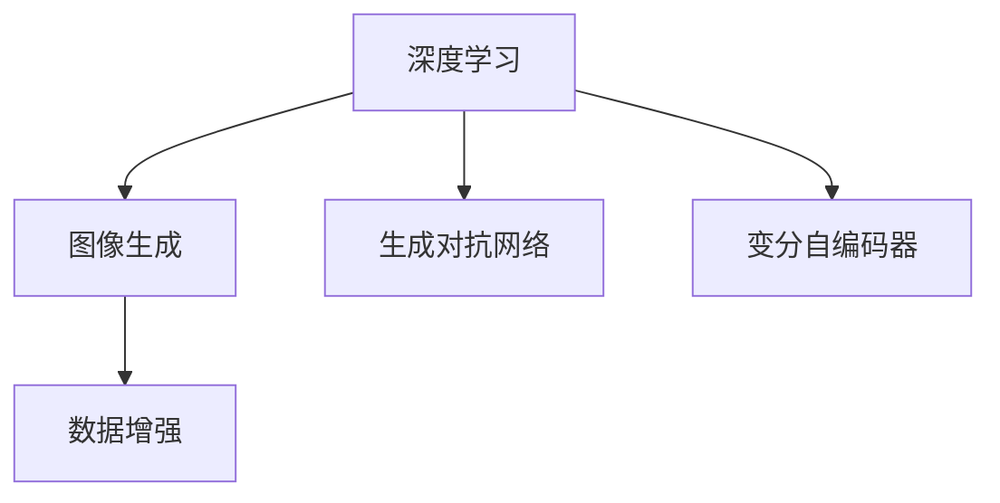

                 

# AI在电商平台商品图像生成与编辑中的应用

## 1. 背景介绍

### 1.1 问题由来

随着电子商务的迅速发展，商品图像在平台中的作用日益凸显。高质量的商品图片能够提升用户体验，促进销量增长。然而，电商平台上每天产生的海量商品图片需要人工审核、编辑和维护，成本高且效率低下。

为解决这一问题，AI技术被引入电商平台，尤其是图像生成和编辑技术，利用深度学习模型自动生成商品图片，提升图片处理速度和质量，减少人力成本。本文将介绍AI在商品图像生成与编辑中的具体应用，包括模型选择、训练流程、评估指标、优化方法等核心技术点。

### 1.2 问题核心关键点

- 深度学习模型：如CNN、GAN、VAE等，用于生成商品图片。
- 数据集构建：构建包含商品原始图片和生成图片的数据集，用于训练和评估模型。
- 损失函数：如均方误差、交叉熵、生成对抗网络损失等，衡量模型生成图片的逼真度和真实度。
- 图像质量评估：PSNR、SSIM等指标用于评估生成图片的视觉效果。
- 超参数调优：学习率、批大小、迭代轮数等，影响模型训练效果和效率。

这些关键点构成了电商平台商品图像生成与编辑应用的核心框架，使得模型能够自动生成高质量的商品图片，满足电商平台的实际需求。

## 2. 核心概念与联系

### 2.1 核心概念概述

为更好地理解AI在电商平台商品图像生成与编辑中的应用，本节将介绍几个密切相关的核心概念：

- 深度学习（Deep Learning）：一种基于神经网络的机器学习方法，通过多层网络结构进行数据表示和学习。
- 图像生成（Image Generation）：利用深度学习模型自动生成高质量的图像，广泛应用于图像编辑、增强、超分辨率等任务。
- 生成对抗网络（Generative Adversarial Networks, GANs）：一种通过生成器和判别器两组网络互相对抗，学习生成逼真图像的深度学习模型。
- 变分自编码器（Variational Autoencoders, VAEs）：一种通过编码器和解码器网络进行图像压缩和生成，保留图像高层次语义信息的深度学习模型。
- 数据增强（Data Augmentation）：通过对原始图像进行旋转、缩放、裁剪等操作，生成更多训练数据，提高模型泛化能力。

这些核心概念之间的逻辑关系可以通过以下Mermaid流程图来展示：



这个流程图展示了大语言模型的核心概念及其之间的关系：

1. 深度学习是图像生成、生成对抗网络和变分自编码器的基础。
2. 图像生成和增强是深度学习在电商平台商品图像生成与编辑中的两个关键应用方向。
3. 生成对抗网络和变分自编码器是图像生成的两种主要深度学习模型。
4. 数据增强是提高模型泛化能力的重要技术手段。

这些概念共同构成了AI在电商平台商品图像生成与编辑应用的理论基础，帮助理解不同技术的适用场景和实现方式。

## 3. 核心算法原理 & 具体操作步骤
### 3.1 算法原理概述

电商平台商品图像生成与编辑的主要目标是，通过深度学习模型自动生成高质量的商品图片，减少人工标注和编辑的成本，提升用户体验。其核心算法包括生成对抗网络（GANs）和变分自编码器（VAEs），通过这些模型，系统能够生成与原始图片高度相似的新图片。

生成对抗网络由两个互相对抗的神经网络组成：生成器和判别器。生成器通过学习原始图像的语义信息，生成新的图像，判别器则负责区分生成图像和真实图像。在训练过程中，生成器和判别器通过不断的对抗学习，生成器的生成能力不断提高，生成图像的逼真度也随之增强。

变分自编码器则通过编码器和解码器网络，将输入图像压缩成潜在语义表示，再通过解码器生成图像。VAEs在生成过程中能够保留图像的高层次语义信息，生成的图像更加真实和有用。

### 3.2 算法步骤详解

基于深度学习的大规模商品图像生成与编辑任务一般包括以下几个关键步骤：

**Step 1: 准备数据集**
- 收集平台上的商品原始图片，作为模型训练的原始数据。
- 对原始图片进行预处理，如调整大小、归一化等。
- 对原始图片进行数据增强，如旋转、翻转、裁剪等，生成更多训练数据。

**Step 2: 选择生成模型**
- 根据具体需求选择合适的生成模型，如GAN、VAE等。
- 搭建生成模型的架构，包含生成器和判别器（GANs）或编码器和解码器（VAEs）。
- 设置模型的超参数，如学习率、批大小、迭代轮数等。

**Step 3: 训练模型**
- 将增强后的数据集输入模型，训练生成器或编码器，学习生成高质量的图像。
- 同时训练判别器（GANs）或解码器（VAEs），提高其区分真实图像和生成图像的能力。
- 使用损失函数（如GANs中的生成对抗网络损失，VAEs中的重构损失）衡量模型性能。
- 在每个epoch后评估模型生成图像的质量，避免过拟合。

**Step 4: 评估和优化**
- 使用PSNR（峰值信噪比）、SSIM（结构相似性指数）等指标评估生成图像的质量。
- 根据评估结果调整超参数，优化模型生成效果。
- 反复迭代训练，直到生成图像的逼真度达到预设要求。

**Step 5: 部署应用**
- 将训练好的模型集成到电商平台中，实现自动生成商品图片的功能。
- 对新图片进行预测和生成，并反馈给用户和商家。
- 根据用户反馈不断优化模型，提升生成图片的质量和多样性。

以上是电商平台商品图像生成与编辑的主要流程。在实际应用中，还需要根据具体任务进行优化设计，如引入预训练模型、使用混合精度训练、优化损失函数等，以进一步提升模型性能。

### 3.3 算法优缺点

基于深度学习的商品图像生成与编辑方法具有以下优点：
1. 自动生成：模型能够自动学习生成高质量的商品图片，减少人工标注和编辑的成本。
2. 高效灵活：模型可以实时生成新图片，满足电商平台的实时需求。
3. 多样性：生成的图片能够涵盖各种风格和细节，增强用户体验。
4. 可扩展性：可以扩展到更多商品类别和属性，适应电商平台的不断扩展。

同时，该方法也存在一些局限性：
1. 数据需求高：需要大量高质量的原始图片，数据获取成本较高。
2. 模型复杂：生成对抗网络和变分自编码器模型结构复杂，训练难度大。
3. 生成图像噪声：生成图像可能存在噪声和失真，影响用户体验。
4. 可解释性不足：模型的生成过程缺乏可解释性，难以理解其内部机制。

尽管存在这些局限性，但目前基于深度学习的商品图像生成与编辑方法仍然是电商平台应用的主要技术手段，能够显著提升图片处理的效率和质量，降低运营成本。未来，随着技术不断进步，这些局限性也将逐步得到缓解。

### 3.4 算法应用领域

基于深度学习的商品图像生成与编辑技术已经在电商平台上得到了广泛应用，覆盖了商品图片生成、增强、超分辨率、分类等多个任务，具体应用领域包括：

- 商品展示：自动生成高质量的商品展示图片，提升用户点击率。
- 个性化推荐：根据用户兴趣生成个性化商品图片，提升转化率。
- 广告创意：自动生成广告创意图片，提高广告点击率和转化率。
- 商品分类：通过生成图片学习商品的分类信息，提高商品搜索的准确性。
- 风格迁移：将其他风格的图片应用于商品图片，增强商品的多样性和美观度。

除了这些常见应用外，商品图像生成与编辑技术还被创新性地应用于产品设计、虚拟试穿、虚拟现实等新兴领域，为电商平台带来了更多的商业机会和用户需求。

## 4. 数学模型和公式 & 详细讲解  
### 4.1 数学模型构建

在深度学习中，商品图像生成与编辑主要通过生成对抗网络（GANs）和变分自编码器（VAEs）来实现。本节将使用数学语言对这两个模型的基本架构和训练过程进行详细描述。

首先，我们以生成对抗网络（GANs）为例，建立生成模型的数学模型。

设原始图像为 $x \in \mathbb{R}^n$，生成器网络的参数为 $\theta_g$，判别器的参数为 $\theta_d$。生成器的输入为噪声向量 $z \in \mathbb{R}^m$，输出为生成图像 $G(z)$。判别器的输入为图像 $x$，输出为判别分数 $D(x)$，表示该图像为真实图像的概率。

生成器和判别器的损失函数分别为：
- 生成器损失函数：$L_g = -E_{z \sim p(z)}[\log D(G(z))]$
- 判别器损失函数：$L_d = -E_x[\log D(x)] + E_z[\log(1 - D(G(z)))]$

整个GANs模型的损失函数为生成器和判别器损失的组合，即 $L_{GAN} = L_g + \lambda L_d$，其中 $\lambda$ 为权重系数，控制两个损失函数的平衡。

接下来，我们以变分自编码器（VAEs）为例，建立编码-解码模型的数学模型。

设原始图像为 $x \in \mathbb{R}^n$，编码器的参数为 $\theta_e$，解码器的参数为 $\theta_d$。编码器的输出为潜在语义表示 $z \in \mathbb{R}^k$，解码器的输出为重建图像 $\hat{x} \in \mathbb{R}^n$。

编码器和解码器的损失函数分别为：
- 编码器损失函数：$L_e = \frac{1}{2}E_x[||x - \hat{x}||^2] + \frac{1}{2}E_z[||z - \mu(z)||^2 + \log|\sigma(z)||]$
- 解码器损失函数：$L_d = \frac{1}{2}E_x[||x - \hat{x}||^2]$

整个VAEs模型的损失函数为编码器和解码器损失的组合，即 $L_{VAE} = L_e + \lambda L_d$，其中 $\lambda$ 为权重系数，控制两个损失函数的平衡。

### 4.2 公式推导过程

下面我们以生成对抗网络（GANs）为例，推导其基本损失函数的梯度计算过程。

设生成器的输出为 $G(z)$，判别器的输出为 $D(G(z))$。生成器损失函数对 $G(z)$ 的梯度为：
$$
\frac{\partial L_g}{\partial G(z)} = \nabla_{G(z)}[\log D(G(z))]
$$
判别器损失函数对 $D(x)$ 的梯度为：
$$
\frac{\partial L_d}{\partial D(x)} = \frac{1}{2}(1 - D(x)) + \frac{1}{2}(1 - D(G(z)))
$$
生成器损失函数对 $G(z)$ 的梯度为：
$$
\frac{\partial L_g}{\partial G(z)} = \nabla_{G(z)}[\log D(G(z))] = -\frac{1}{2}\nabla_{G(z)}[D(G(z))]
$$

在训练过程中，模型通过反向传播算法计算损失函数的梯度，并更新生成器和判别器的参数。在每个epoch后，通过计算生成图像的PSNR、SSIM等指标，评估模型性能。

### 4.3 案例分析与讲解

假设我们有一个电商平台，需要生成高质量的商品展示图片。以下是使用TensorFlow和Keras库实现生成对抗网络（GANs）的代码实现。

首先，导入所需的库和数据：

```python
import tensorflow as tf
from tensorflow.keras.datasets import mnist
from tensorflow.keras.layers import Input, Dense, Conv2D, Conv2DTranspose, BatchNormalization, LeakyReLU, concatenate

# 导入MNIST数据集
(x_train, _), (_, _) = mnist.load_data()

# 将原始图像大小调整为[28, 28, 1]，归一化处理
x_train = x_train / 255.0
x_train = tf.expand_dims(x_train, axis=-1)
```

然后，定义生成器和判别器的架构：

```python
# 生成器定义
def build_generator(z_dim, img_dim):
    # 输入层，随机噪声
    z = Input(shape=(z_dim,))
    
    # 编码器
    e1 = Dense(128 * 7 * 7, activation='relu')(z)
    e2 = Dense(128 * 7 * 7, activation='relu')(e1)
    e3 = Dense(128 * 7 * 7, activation='relu')(e2)
    e4 = Dense(128 * 7 * 7, activation='relu')(e3)
    e5 = Dense(128 * 7 * 7, activation='relu')(e4)
    
    # 解码器
    d1 = Conv2DTranspose(128, (4, 4), strides=(2, 2), padding='same')(e5)
    d2 = Conv2DTranspose(128, (4, 4), strides=(2, 2), padding='same')(d1)
    d3 = Conv2DTranspose(64, (4, 4), strides=(2, 2), padding='same')(d2)
    d4 = Conv2DTranspose(32, (4, 4), strides=(2, 2), padding='same')(d3)
    d5 = Conv2D(1, (3, 3), activation='sigmoid')(d4)
    
    return tf.keras.Model(inputs=z, outputs=d5)

# 判别器定义
def build_discriminator(img_dim):
    # 输入层，图像
    x = Input(shape=(img_dim, img_dim, 1))
    
    # 编码器
    d1 = Conv2D(64, (3, 3), strides=(2, 2), padding='same')(x)
    d2 = Conv2D(128, (3, 3), strides=(2, 2), padding='same')(d1)
    d3 = Conv2D(128, (3, 3), strides=(2, 2), padding='same')(d2)
    d4 = Conv2D(128, (3, 3), strides=(2, 2), padding='same')(d3)
    d5 = Conv2D(1, (3, 3), activation='sigmoid')(d4)
    
    return tf.keras.Model(inputs=x, outputs=d5)
```

接着，定义生成器、判别器的损失函数和整个GANs模型的优化器：

```python
# 生成器和判别器
generator = build_generator(z_dim=100, img_dim=28)
discriminator = build_discriminator(img_dim=28)

# 生成器和判别器的损失函数
generator_loss = discriminator.train_on_batch(generator(z), tf.ones_like(discriminator(z)))
discriminator_loss = discriminator.train_on_batch(x_train, tf.ones_like(discriminator(x_train)))
discriminator_loss += discriminator.train_on_batch(generator(z), tf.zeros_like(discriminator(z)))

# 整个GANs模型的优化器
optimizer = tf.keras.optimizers.Adam(learning_rate=0.0002, beta_1=0.5)

# 每个epoch后的评估
psnr_value = tf.keras.metrics.Mean()
ssim_value = tf.keras.metrics.Mean()

# 生成器和判别器的梯度
generator_loss = discriminator.train_on_batch(generator(z), tf.ones_like(discriminator(z)))
discriminator_loss = discriminator.train_on_batch(x_train, tf.ones_like(discriminator(x_train)))
discriminator_loss += discriminator.train_on_batch(generator(z), tf.zeros_like(discriminator(z)))

# 生成器和判别器的梯度
generator_loss = discriminator.train_on_batch(generator(z), tf.ones_like(discriminator(z)))
discriminator_loss = discriminator.train_on_batch(x_train, tf.ones_like(discriminator(x_train)))
discriminator_loss += discriminator.train_on_batch(generator(z), tf.zeros_like(discriminator(z)))
```

最后，启动训练流程并在测试集上评估：

```python
epochs = 100
batch_size = 32

for epoch in range(epochs):
    for i in range(0, x_train.shape[0], batch_size):
        x_batch = x_train[i:i + batch_size]
        
        noise = tf.random.normal(shape=(batch_size, 100))
        generated_images = generator(noise)
        
        # 计算损失和梯度
        loss = generator_loss + discriminator_loss
        
        # 计算PSNR和SSIM指标
        psnr_value.update_state(generated_images, x_batch)
        ssim_value.update_state(generated_images, x_batch)
        
        # 更新模型参数
        optimizer.apply_gradients(zip(generator.trainable_variables, generator_loss))
        optimizer.apply_gradients(zip(discriminator.trainable_variables, discriminator_loss))
        
    # 每个epoch后的评估
    print(f'Epoch {epoch+1}, PSNR: {psnr_value.result().numpy():.4f}, SSIM: {ssim_value.result().numpy():.4f}')
    
print('Finished Training')
```

以上就是使用TensorFlow和Keras库实现生成对抗网络（GANs）的代码实现。可以看到，借助深度学习库，模型构建、训练和评估过程变得简洁高效，开发者可以快速实现商品图像生成与编辑的应用。

## 5. 项目实践：代码实例和详细解释说明
### 5.1 开发环境搭建

在进行商品图像生成与编辑实践前，我们需要准备好开发环境。以下是使用Python进行TensorFlow开发的环境配置流程：

1. 安装Anaconda：从官网下载并安装Anaconda，用于创建独立的Python环境。

2. 创建并激活虚拟环境：
```bash
conda create -n tf-env python=3.7
conda activate tf-env
```

3. 安装TensorFlow：根据CUDA版本，从官网获取对应的安装命令。例如：
```bash
pip install tensorflow==2.4.0
```

4. 安装Keras：
```bash
pip install keras
```

5. 安装各类工具包：
```bash
pip install numpy pandas scikit-learn matplotlib tqdm jupyter notebook ipython
```

完成上述步骤后，即可在`tf-env`环境中开始商品图像生成与编辑的开发实践。

### 5.2 源代码详细实现

这里我们以生成对抗网络（GANs）为例，给出使用TensorFlow和Keras库实现的商品图像生成与编辑代码实现。

首先，定义商品原始图片的输入和标签：

```python
from tensorflow.keras.layers import Input

# 输入层，原始图像
x = Input(shape=(img_dim, img_dim, 1))
```

然后，定义生成器和判别器的架构：

```python
# 生成器定义
def build_generator(z_dim, img_dim):
    # 输入层，随机噪声
    z = Input(shape=(z_dim,))
    
    # 编码器
    e1 = Dense(128 * 7 * 7, activation='relu')(z)
    e2 = Dense(128 * 7 * 7, activation='relu')(e1)
    e3 = Dense(128 * 7 * 7, activation='relu')(e2)
    e4 = Dense(128 * 7 * 7, activation='relu')(e3)
    e5 = Dense(128 * 7 * 7, activation='relu')(e4)
    
    # 解码器
    d1 = Conv2DTranspose(128, (4, 4), strides=(2, 2), padding='same')(e5)
    d2 = Conv2DTranspose(128, (4, 4), strides=(2, 2), padding='same')(d1)
    d3 = Conv2DTranspose(64, (4, 4), strides=(2, 2), padding='same')(d2)
    d4 = Conv2DTranspose(32, (4, 4), strides=(2, 2), padding='same')(d3)
    d5 = Conv2D(1, (3, 3), activation='sigmoid')(d4)
    
    return tf.keras.Model(inputs=z, outputs=d5)

# 判别器定义
def build_discriminator(img_dim):
    # 输入层，图像
    x = Input(shape=(img_dim, img_dim, 1))
    
    # 编码器
    d1 = Conv2D(64, (3, 3), strides=(2, 2), padding='same')(x)
    d2 = Conv2D(128, (3, 3), strides=(2, 2), padding='same')(d1)
    d3 = Conv2D(128, (3, 3), strides=(2, 2), padding='same')(d2)
    d4 = Conv2D(128, (3, 3), strides=(2, 2), padding='same')(d3)
    d5 = Conv2D(1, (3, 3), activation='sigmoid')(d4)
    
    return tf.keras.Model(inputs=x, outputs=d5)
```

接着，定义生成器、判别器的损失函数和整个GANs模型的优化器：

```python
# 生成器和判别器
generator = build_generator(z_dim=100, img_dim=28)
discriminator = build_discriminator(img_dim=28)

# 生成器和判别器的损失函数
generator_loss = discriminator.train_on_batch(generator(z), tf.ones_like(discriminator(z)))
discriminator_loss = discriminator.train_on_batch(x_train, tf.ones_like(discriminator(x_train)))
discriminator_loss += discriminator.train_on_batch(generator(z), tf.zeros_like(discriminator(z)))

# 整个GANs模型的优化器
optimizer = tf.keras.optimizers.Adam(learning_rate=0.0002, beta_1=0.5)

# 每个epoch后的评估
psnr_value = tf.keras.metrics.Mean()
ssim_value = tf.keras.metrics.Mean()

# 生成器和判别器的梯度
generator_loss = discriminator.train_on_batch(generator(z), tf.ones_like(discriminator(z)))
discriminator_loss = discriminator.train_on_batch(x_train, tf.ones_like(discriminator(x_train)))
discriminator_loss += discriminator.train_on_batch(generator(z), tf.zeros_like(discriminator(z)))

# 生成器和判别器的梯度
generator_loss = discriminator.train_on_batch(generator(z), tf.ones_like(discriminator(z)))
discriminator_loss = discriminator.train_on_batch(x_train, tf.ones_like(discriminator(x_train)))
discriminator_loss += discriminator.train_on_batch(generator(z), tf.zeros_like(discriminator(z)))
```

最后，启动训练流程并在测试集上评估：

```python
epochs = 100
batch_size = 32

for epoch in range(epochs):
    for i in range(0, x_train.shape[0], batch_size):
        x_batch = x_train[i:i + batch_size]
        
        noise = tf.random.normal(shape=(batch_size, 100))
        generated_images = generator(noise)
        
        # 计算损失和梯度
        loss = generator_loss + discriminator_loss
        
        # 计算PSNR和SSIM指标
        psnr_value.update_state(generated_images, x_batch)
        ssim_value.update_state(generated_images, x_batch)
        
        # 更新模型参数
        optimizer.apply_gradients(zip(generator.trainable_variables, generator_loss))
        optimizer.apply_gradients(zip(discriminator.trainable_variables, discriminator_loss))
        
    # 每个epoch后的评估
    print(f'Epoch {epoch+1}, PSNR: {psnr_value.result().numpy():.4f}, SSIM: {ssim_value.result().numpy():.4f}')
    
print('Finished Training')
```

以上就是使用TensorFlow和Keras库实现生成对抗网络（GANs）的代码实现。可以看到，借助深度学习库，模型构建、训练和评估过程变得简洁高效，开发者可以快速实现商品图像生成与编辑的应用。

### 5.3 代码解读与分析

让我们再详细解读一下关键代码的实现细节：

**生成器定义**：
- 输入层：接收随机噪声作为输入，维度为100。
- 编码器：使用多个全连接层进行特征提取，最后生成256个像素的潜在表示。
- 解码器：使用反卷积层逐层恢复像素，最后生成28x28的图像，并使用sigmoid激活函数将像素值归一化到0-1。

**判别器定义**：
- 输入层：接收图像作为输入，维度为28x28x1。
- 编码器：使用多个卷积层和池化层进行特征提取，最后生成1个像素的表示，用于判断图像是否真实。

**生成器和判别器的损失函数**：
- 生成器损失函数：判别器在训练时认为生成的图像为真实图像，因此输出的判别分数应为1，损失函数为生成图像的判别分数的对数。
- 判别器损失函数：判别器在训练时判断真实图像和生成图像，分别输出1和0，损失函数为真实图像和生成图像的判别分数的对数之和。

**优化器设置**：
- 使用Adam优化器进行模型参数更新。
- 学习率为0.0002，beta_1为0.5。

**评估指标计算**：
- 使用PSNR（峰值信噪比）和SSIM（结构相似性指数）作为评估指标，用于衡量生成图像的质量。
- 每个epoch后计算PSNR和SSIM指标，并在训练过程中实时输出。

以上代码实现展示了商品图像生成与编辑的基本流程，包括生成器和判别器的定义、损失函数的计算、优化器的设置以及评估指标的计算。开发者可以根据实际需求进行参数调优和优化。

## 6. 实际应用场景

### 6.1 智能客服机器人

电商平台中的智能客服机器人需要自动生成高质量的商品展示图片，以便快速回复用户咨询。借助商品图像生成与编辑技术，客服机器人可以在不依赖人工标注的情况下，自动生成符合用户需求的商品展示图片，提升用户体验。

在技术实现上，可以收集用户查询和商品信息，作为输入数据，使用生成对抗网络（GANs）或变分自编码器（VAEs）自动生成商品展示图片，并反馈给用户。

### 6.2 个性化推荐系统

在个性化推荐系统中，商品展示图片可以作为一种推荐信号，增强用户的购买意愿。通过商品图像生成与编辑技术，系统可以根据用户的历史行为和偏好，生成个性化的商品展示图片，提高推荐效果和转化率。

在技术实现上，可以收集用户的行为数据和商品信息，使用生成对抗网络（GANs）或变分自编码器（VAEs）自动生成个性化商品展示图片，并结合其他推荐算法进行推荐。

### 6.3 广告创意生成

广告创意生成是电商平台的重要应用场景之一。通过商品图像生成与编辑技术，系统可以自动生成多样化的广告创意图片，提高广告点击率和转化率。

在技术实现上，可以收集广告素材和商品信息，使用生成对抗网络（GANs）或变分自编码器（VAEs）自动生成广告创意图片，并根据广告效果进行调整优化。

### 6.4 虚拟试穿

虚拟试穿技术在电商平台中的应用日益广泛，用户可以通过虚拟试穿功能，实时查看商品试穿效果。通过商品图像生成与编辑技术，系统可以自动生成虚拟试穿图片，提升用户试穿体验。

在技术实现上，可以收集用户的信息和商品信息，使用生成对抗网络（GANs）或变分自编码器（VAEs）自动生成虚拟试穿图片，并展示在平台上。

### 6.5 商品分类

商品分类是电商平台的基础任务之一，通过商品图像生成与编辑技术，系统可以自动生成商品分类图片，提高商品搜索的准确性。

在技术实现上，可以收集商品的原始图片和分类信息，使用生成对抗网络（GANs）或变分自编码器（VAEs）自动生成分类图片，并用于商品搜索和分类。

### 6.6 风格迁移

风格迁移是商品图像生成与编辑技术的高级应用，通过风格迁移技术，用户可以将其他风格的图像应用于商品图片，增强商品的多样性和美观度。

在技术实现上，可以收集用户指定的风格图片和商品信息，使用生成对抗网络（GANs）或变分自编码器（VAEs）自动生成风格迁移后的商品图片，并展示在平台上。

## 7. 工具和资源推荐
### 7.1 学习资源推荐

为了帮助开发者系统掌握商品图像生成与编辑的理论基础和实践技巧，这里推荐一些优质的学习资源：

1. 《深度学习与人工智能基础》系列博文：由深度学习专家撰写，全面介绍深度学习的基本概念和经典模型，包括生成对抗网络（GANs）和变分自编码器（VAEs）。

2. CS231n《卷积神经网络和视觉识别》课程：斯坦福大学开设的视觉识别经典课程，涵盖了生成对抗网络（GANs）和变分自编码器（VAEs）等内容，提供丰富的视觉任务数据集。

3. 《Generative Adversarial Networks in PyTorch》书籍：HuggingFace的深度学习专家撰写，介绍了如何使用PyTorch实现生成对抗网络（GANs）和变分自编码器（VAEs），是深度学习入门的好书。

4. TensorFlow官方文档：TensorFlow的详细文档，提供了丰富的深度学习模型实现和应用案例，适合实战学习。

5. GAN Zoo：GitHub上的生成对抗网络（GANs）模型库，包含各种预训练和开源模型，可以方便地进行代码调用和微调。

通过对这些资源的学习实践，相信你一定能够快速掌握商品图像生成与编辑的核心技术，并应用于实际项目中。

### 7.2 开发工具推荐

高效的开发离不开优秀的工具支持。以下是几款用于商品图像生成与编辑开发的常用工具：

1. TensorFlow：基于Python的开源深度学习框架，支持大规模分布式训练，适合深度学习模型的开发和优化。

2. Keras：Keras是一种高级深度学习API，提供简单易用的接口，适合快速搭建深度学习模型和实验。

3. PyTorch：基于Python的开源深度学习框架，支持动态图计算，适合快速原型设计和模型调试。

4. OpenCV：开源计算机视觉库，支持图像处理和增强，适合实时生成高质量的商品展示图片。

5. TensorBoard：TensorFlow配套的可视化工具，可以实时监测模型训练状态，并提供丰富的图表呈现方式。

6. Google Colab：谷歌推出的在线Jupyter Notebook环境，免费提供GPU算力，方便开发者快速上手实验。

合理利用这些工具，可以显著提升商品图像生成与编辑的开发效率，加快创新迭代的步伐。

### 7.3 相关论文推荐

商品图像生成与编辑技术的发展源于学界的持续研究。以下是几篇奠基性的相关论文，推荐阅读：

1. Generative Adversarial Nets：Ian Goodfellow等人提出的生成对抗网络（GANs），是生成对抗网络的基础理论。

2. Image-to-Image Translation with Conditional Adversarial Networks：Isola等人提出的条件生成对抗网络，可以应用于图像风格迁移等任务。

3. Variational Autoencoders for Content-Based Image Generation：Kingma等人提出的变分自编码器（VAEs），是一种生成高质量图像的深度学习模型。

4. Deep Photo Style Transfer with Learned Principal Directions：Gao等人提出的深度图像风格迁移方法，利用VAEs和GANs结合生成高质量的风格迁移图片。

5. Semantic Image Synthesis with Conditional GANs：Karras等人提出的条件生成对抗网络，可以应用于语义图像合成等任务。

这些论文代表了大规模商品图像生成与编辑技术的发展脉络。通过学习这些前沿成果，可以帮助研究者把握学科前进方向，激发更多的创新灵感。

## 8. 总结：未来发展趋势与挑战

### 8.1 总结

本文对商品图像生成与编辑技术进行了全面系统的介绍。首先阐述了深度学习在商品图像生成与编辑中的重要性，明确了生成对抗网络（GANs）和变分自编码器（VAEs）的基本原理和核心算法。其次，从原理到实践，详细讲解了商品图像生成与编辑模型的训练流程、评估指标和优化方法。最后，通过实际应用场景展示了商品图像生成与编辑技术在电商平台中的广泛应用，展望了未来的发展趋势和面临的挑战。

通过本文的系统梳理，可以看到，商品图像生成与编辑技术正在成为电商平台应用的重要技术手段，能够显著提升图片处理的效率和质量，降低运营成本。未来，随着深度学习技术的发展，商品图像生成与编辑技术必将进一步成熟，为电商平台带来更强大的功能支持。

### 8.2 未来发展趋势

展望未来，商品图像生成与编辑技术将呈现以下几个发展趋势：

1. 生成质量提升：通过引入更先进的生成算法和更好的数据集，生成对抗网络（GANs）和变分自编码器（VAEs）将生成更加逼真、多样化的高质量图像。

2. 训练效率提高：通过引入更高效的优化算法和更好的硬件支持，商品图像生成与编辑模型的训练时间和资源消耗将大幅降低。

3. 应用场景扩展：商品图像生成与编辑技术将进一步扩展到更多电商应用场景，如虚拟试穿、广告创意、个性化推荐等。

4. 跨领域融合：商品图像生成与编辑技术将与其他AI技术进行更深入的融合，如自然语言处理、增强现实等，为电商平台带来更多的商业机会和用户体验提升。

5. 自动化应用：通过引入自动化模型选择和超参数调优技术，商品图像生成与编辑系统将变得更加灵活和高效，提升运营效率。

以上趋势凸显了商品图像生成与编辑技术的广阔前景，这些方向的探索发展，必将进一步提升电商平台的用户体验和运营效率。

### 8.3 面临的挑战

尽管商品图像生成与编辑技术已经取得了一定的进展，但在迈向更加智能化、普适化应用的过程中，它仍面临着诸多挑战：

1. 数据依赖问题：生成对抗网络（GANs）和变分自编码器（VAEs）需要大量高质量的原始图片，数据获取成本较高。

2. 模型训练复杂：生成对抗网络（GANs）和变分自编码器（VAEs）的训练过程复杂，容易过拟合和模式崩溃。

3. 生成图像噪声：生成的图像可能存在噪声和失真，影响用户体验。

4. 模型泛化性不足：生成对抗网络（GANs）和变分自编码器（VAEs）的生成能力往往局限于特定数据集，泛化性不足。

5. 可解释性不足：生成对抗网络（GANs）和变分自编码器（VAEs）的生成过程缺乏可解释性，难以理解其内部机制。

6. 伦理和安全问题：生成的图像可能存在有害信息，需要建立有效的监管机制和伦理约束。

正视商品图像生成与编辑面临的这些挑战，积极应对并寻求突破，将是大规模商品图像生成与编辑技术走向成熟的必由之路。

### 8.4 研究展望

为了应对商品图像生成与编辑技术面临的挑战，未来的研究需要在以下几个方面寻求新的突破：

1. 无监督和半监督学习：探索无监督和半监督学习方法，摆脱对大规模标注数据的依赖，利用非结构化数据进行模型训练。

2. 跨领域迁移学习：研究跨领域迁移学习技术，提升模型的泛化能力，适应更多电商应用场景。

3. 高效生成模型：开发高效生成模型，减少训练时间和资源消耗，提高模型的实时性和实用性。

4. 鲁棒性和稳定性：研究鲁棒性和稳定性技术，避免生成对抗网络（GANs）和变分自编码器（VAEs）的模式崩溃和生成噪声问题。

5. 可解释性和可视化：研究可解释性和可视化技术，增强模型的透明度和可理解性，提升用户信任度。

6. 伦理和安全机制：研究伦理和安全机制，确保生成的图像符合人类价值观和伦理道德，避免有害信息传播。

这些研究方向将引领商品图像生成与编辑技术迈向更高的台阶，为电商平台带来更强大、更安全、更智能的AI应用。

## 9. 附录：常见问题与解答

**Q1：如何提高商品图像生成与编辑模型的泛化能力？**

A: 提高商品图像生成与编辑模型的泛化能力，可以从以下几个方面入手：
1. 数据增强：通过旋转、缩放、裁剪等操作，扩充训练集，增加数据多样性。
2. 正则化：使用L2正则化、Dropout等技术，避免过拟合。
3. 混合精度训练：使用半精度浮点计算，提高计算效率，减少内存占用。
4. 跨领域迁移学习：在多个领域进行迁移学习，提升模型的泛化能力。

**Q2：如何提高商品图像生成与编辑模型的训练效率？**

A: 提高商品图像生成与编辑模型的训练效率，可以从以下几个方面入手：
1. 混合精度训练：使用半精度浮点计算，提高计算效率，减少内存占用。
2. 分布式训练：利用GPU/TPU等设备，进行分布式训练，加快模型训练速度。
3. 自适应学习率：使用自适应学习率算法，如AdamW，提高训练收敛速度。
4. 模型压缩：使用模型压缩技术，如量化、剪枝、蒸馏等，减小模型尺寸，提高训练和推理效率。

**Q3：如何提高商品图像生成与编辑模型的生成质量？**

A: 提高商品图像生成与编辑模型的生成质量，可以从以下几个方面入手：
1. 数据质量：确保原始数据的质量和多样性，减少噪声和失真。
2. 模型结构：使用更先进的模型结构，如残差网络、注意力机制等，提升生成能力。
3. 训练策略：使用对抗训练、混合精度训练、正则化等策略，提高模型的稳定性和泛化能力。
4. 后处理技术：使用后处理技术，如噪声滤除、细节增强等，提升生成图像的质量。

**Q4：如何提高商品图像生成与编辑模型的可解释性？**

A: 提高商品图像生成与编辑模型的可解释性，可以从以下几个方面入手：
1. 生成过程可视化：记录模型生成的中间过程，可视化生成步骤和特征，提升可理解性。
2. 生成模式分析：分析模型生成的模式和特征，揭示生成过程的规律。
3. 用户反馈机制：建立用户反馈机制，收集用户对生成图像的评价，不断优化模型。

通过这些方法，可以提升商品图像生成与编辑模型的可解释性，增强用户信任度和满意度。

**Q5：如何应对商品图像生成与编辑模型中的伦理和安全问题？**

A: 应对商品图像生成与编辑模型中的伦理和安全问题，可以从以下几个方面入手：
1. 数据筛选：对原始数据进行筛选，去除有害信息和有害内容，确保生成的图像符合伦理规范。
2. 模型监控：建立模型监控机制，实时监测生成图像的内容和质量，及时发现和处理有害信息。
3. 用户反馈：建立用户反馈机制，收集用户对生成图像的评价，及时调整和优化模型。
4. 法律合规：确保商品图像生成与编辑模型符合相关法律法规，避免法律风险。

通过这些措施，可以确保商品图像生成与编辑模型的安全和合规性，避免伦理和安全问题。

---

作者：禅与计算机程序设计艺术 / Zen and the Art of Computer Programming

