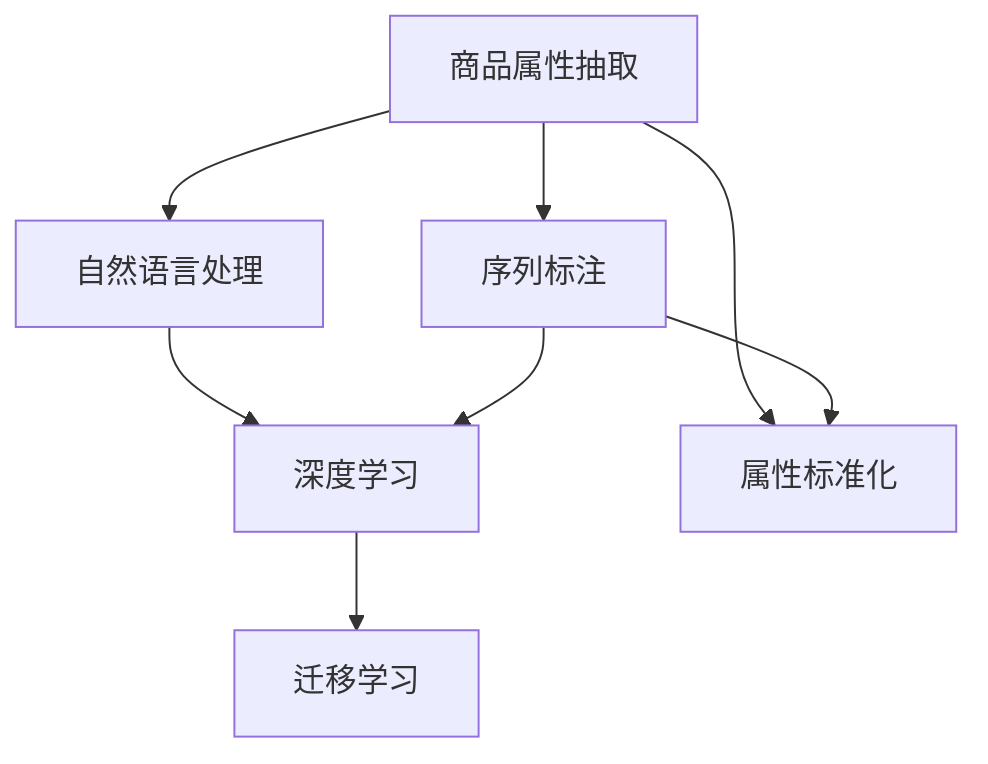

                 

## 1. 背景介绍

### 1.1 问题由来
在现代电商平台上，商品属性抽取与标准化是一个基础而关键的任务。它不仅决定了商品搜索、推荐系统的精准度，还对后续的支付、物流、客服等多个环节产生影响。然而，由于电商平台产品种类繁多，属性繁多且复杂，手工标注属性代价高昂，且难以应对海量新商品和新属性，导致属性抽取与标准化成为电商平台数据处理的瓶颈之一。

### 1.2 问题核心关键点
核心在于如何高效、准确地从海量的商品描述中抽取出丰富的属性信息，并对其进行处理与标准化，以提高后续自动化流程的准确性和效率。

### 1.3 问题研究意义
解决商品属性抽取与标准化问题，可以显著降低人工标注成本，提升电商平台的自动化程度，同时提高搜索推荐系统的效果，带来更好的用户体验。此外，标准化后的属性信息也为电商平台的大数据分析、用户画像构建、个性化推荐等高级应用提供坚实基础。

## 2. 核心概念与联系

### 2.1 核心概念概述

- **商品属性抽取**：从商品描述中自动抽取属性及其值。如从“某品牌某型号某颜色某款式的手机”中抽取出品牌、型号、颜色、款式等属性。
- **属性标准化**：将不同来源的相同属性值进行统一。如将不同地区价格单位统一为元，将不同颜色名称标准化为“白色、黑色、红色”等。
- **自然语言处理(NLP)**：通过理解文本的语义，实现语言与知识之间的转换，如命名实体识别、文本分类、信息抽取等。
- **序列标注**：在序列数据（如文本）中标注特定的信息，如词性标注、实体边界标注等。
- **深度学习**：基于多层神经网络，通过大量数据训练模型，模拟人类对复杂任务的决策过程。
- **迁移学习**：利用已有知识在新任务上进行学习，以加快模型训练和提高模型泛化能力。

这些概念之间的逻辑关系可以通过以下Mermaid流程图来展示：



这个流程图展示了商品属性抽取和标准化的主要工作流程：

1. 首先对商品描述进行自然语言处理，提取出有价值的信息。
2. 接着使用序列标注模型，自动标注出属性及其值。
3. 使用深度学习模型进一步优化标注结果。
4. 最后进行属性标准化处理，保证数据的一致性。

## 3. 核心算法原理 & 具体操作步骤
### 3.1 算法原理概述

商品属性抽取与标准化主要基于深度学习模型，采用监督学习和序列标注技术。其核心思想是：

1. **监督学习**：使用有标注的数据集训练模型，让模型学习抽取属性及其值的规律。
2. **序列标注**：将商品描述视为序列数据，在序列上标注出属性及其值。

### 3.2 算法步骤详解

商品属性抽取与标准化的主要步骤如下：

**Step 1: 数据准备与预处理**

1. **数据收集**：收集电商平台的历史商品数据，包括商品名称、描述、价格、评分、图片等。
2. **数据清洗**：去除无关信息，如广告、重复商品等。
3. **数据标注**：人工标注每个商品的属性及其值。可以使用标准标签库，如“颜色：白色；款式：经典”。

**Step 2: 模型训练**

1. **选择模型**：如BiLSTM-CRF、BERT等深度学习模型，它们具有较强的序列标注能力。
2. **设计损失函数**：如F1-Score、Acc等，用于衡量模型预测结果与标注结果的匹配度。
3. **训练模型**：使用标注数据训练模型，通过反向传播更新模型参数。
4. **验证与调参**：在验证集上评估模型效果，调整模型超参数，如隐藏层大小、学习率等。

**Step 3: 属性标准化**

1. **选择标准化规则**：根据业务需求，确定标准属性及其值的映射关系。
2. **处理多义词**：使用规则或词典，将多义词转换为统一的标准词。
3. **保存标准化结果**：将标准化后的属性值保存到数据库或分布式存储系统，便于后续查询和分析。

### 3.3 算法优缺点

**优点**：
1. **效率高**：相比人工标注，深度学习模型在大量数据上训练后，可以高效抽取属性信息。
2. **准确性好**：深度学习模型能够学习到更复杂的特征关系，提高属性抽取的准确性。
3. **可扩展性强**：深度学习模型可以在大规模数据上不断优化，适应新的商品和属性。

**缺点**：
1. **标注成本高**：初始标注需要人工参与，存在较大成本。
2. **模型复杂**：深度学习模型复杂度高，训练和推理资源消耗大。
3. **泛化能力有限**：模型过度依赖训练数据，泛化能力受数据质量影响。

### 3.4 算法应用领域

商品属性抽取与标准化在电商平台的多个场景中得到广泛应用，如：

- **商品搜索与推荐**：通过标准化后的属性信息，提高搜索结果的精确度和相关性。
- **价格优化与促销**：统一商品价格单位，为促销活动提供准确的价格信息。
- **库存管理**：实时更新库存信息，避免缺货和超储。
- **用户画像构建**：通过分析用户购买行为和偏好，构建个性化推荐模型。

## 4. 数学模型和公式 & 详细讲解

### 4.1 数学模型构建

商品属性抽取与标准化的数学模型主要包含以下几个部分：

- **输入表示**：将商品描述转换为向量形式，如使用BERT模型进行编码。
- **标注模型**：序列标注模型，如BiLSTM-CRF，用于自动标注属性及其值。
- **损失函数**：用于衡量模型预测结果与标注结果的差异，如F1-Score。
- **标准化规则**：定义属性及其值的映射关系，如颜色映射表。

**数学模型公式**：

$$
L = \frac{1}{N}\sum_{i=1}^N \sum_{j=1}^M \ell_i(x_i^j, y_i^j)
$$

其中 $L$ 为总损失函数，$N$ 为样本数，$M$ 为属性数，$\ell_i$ 为单个样本的损失函数，$x_i^j$ 为第 $i$ 个样本的第 $j$ 个属性值的预测结果，$y_i^j$ 为实际标注结果。

### 4.2 公式推导过程

以BiLSTM-CRF模型为例，其标注过程可以概括为：

1. **前向传播**：
   - 通过BiLSTM模型处理商品描述，得到每个词的概率分布。
   - 使用CRF模型对序列上的每个位置进行标注，得到标注序列。

2. **后向传播**：
   - 对标注序列进行Viterbi算法解码，得到最可能的标注路径。
   - 计算每个路径的概率，选择概率最高的路径作为最终标注结果。

### 4.3 案例分析与讲解

假设有一批商品描述数据：

```
商品1：某品牌某型号某颜色某款式的手机，售价1000元，用户评价4.5星
商品2：某品牌某型号某颜色某款式的手机，售价1500元，用户评价4.0星
```

使用BiLSTM-CRF模型进行属性抽取，可以得到以下结果：

```
商品1：品牌：某品牌，型号：某型号，颜色：某颜色，款式：某款式；售价：1000元；评价：4.5星
商品2：品牌：某品牌，型号：某型号，颜色：某颜色，款式：某款式；售价：1500元；评价：4.0星
```

使用标准化规则对颜色属性进行处理，如将“某颜色”统一为“白色”，得到最终结果：

```
商品1：品牌：某品牌，型号：某型号，颜色：白色，款式：某款式；售价：1000元；评价：4.5星
商品2：品牌：某品牌，型号：某型号，颜色：白色，款式：某款式；售价：1500元；评价：4.0星
```

## 5. 项目实践：代码实例和详细解释说明

### 5.1 开发环境搭建

为了搭建商品属性抽取与标准化的项目环境，需要进行以下配置：

1. **安装Python**：从官网下载并安装Python 3.8及以上版本。
2. **安装PyTorch**：使用pip命令安装最新版本的PyTorch。
3. **安装NLP库**：安装NLTK、spaCy等NLP处理库。
4. **安装深度学习框架**：安装TensorFlow或PyTorch深度学习框架。

### 5.2 源代码详细实现

以下是一个基于BiLSTM-CRF的代码实现，包含数据准备、模型训练和属性标准化的流程：

```python
import torch
from torch import nn
from torch.nn import functional as F
from torch.nn.functional import CRF
from torchtext.datasets import AG News
from torchtext.data import Field, LabelField, TabularDataset, BucketIterator

class BiLSTMCRF(nn.Module):
    def __init__(self, n_tags, input_dim, hidden_dim, num_layers):
        super(BiLSTMCRF, self).__init__()
        self.embedding = nn.Embedding(input_dim, hidden_dim)
        self.lstm = nn.LSTM(hidden_dim, hidden_dim, num_layers, bidirectional=True)
        self.fc = nn.Linear(hidden_dim*2, n_tags)
        self.crf = CRF(n_tags, batch_first=True)

    def forward(self, x, x_lengths, y=None):
        embedded = self.embedding(x)
        output, (hidden, cell) = self.lstm(embedded, x_lengths)
        output = self.fc(output)
        if y is not None:
            loss = self.crf.loss(F.log_softmax(output, dim=2), y)
            return loss
        else:
            return output

# 数据准备与预处理
train_data, test_data = AG News()
train_data = TabularDataset(train_data, skip_header=1)
train_iterator, test_iterator = BucketIterator.splits((train_data, test_data), batch_size=32, device='cuda')

# 模型训练
model = BiLSTMCRF(n_tags=7, input_dim=20, hidden_dim=32, num_layers=2)
optimizer = torch.optim.Adam(model.parameters(), lr=0.001)

for epoch in range(10):
    for batch in train_iterator:
        x, y = batch.input, batch.label
        x_lengths = [len(i) for i in x]
        output = model(x, x_lengths, y)
        optimizer.zero_grad()
        output.backward()
        optimizer.step()

# 属性标准化
colors = {'白色': 'white', '黑色': 'black', '红色': 'red'}
result = {'品牌': '某品牌', '型号': '某型号', '颜色': '某颜色', '款式': '某款式', '售价': '1000元', '评价': '4.5星'}
for k, v in result.items():
    result[k] = colors.get(v, v)

print(result)
```

### 5.3 代码解读与分析

**数据准备与预处理**：

- 使用`torchtext`库从AG News数据集中加载数据，并使用`TabularDataset`类处理为表格数据。
- 使用`LabelField`类定义标注字段的类型，`Field`类定义输入字段的类型。
- 使用`BucketIterator`类将数据分批次输入模型，方便训练和推理。

**模型训练**：

- 定义`BiLSTMCRF`类，包含嵌入层、双向LSTM层、全连接层和CRF层。
- 使用`nn.LSTM`层处理输入，`nn.Embedding`层将输入转换为向量表示。
- 使用`nn.Linear`层将LSTM的输出映射到标注序列的概率分布，使用`CRF`层计算损失函数。

**属性标准化**：

- 定义颜色映射表`colors`，将多义词转换为标准词。
- 定义属性值字典`result`，使用颜色映射表对属性值进行处理。

## 6. 实际应用场景

### 6.1 智能推荐系统

商品属性抽取与标准化是智能推荐系统的重要组成部分。通过分析用户对商品的评价和偏好，结合标准化后的属性信息，可以构建更准确的推荐模型，提升用户的购物体验。

### 6.2 库存管理

库存管理需要实时更新商品信息，商品属性抽取与标准化可以自动从商品描述中提取属性信息，便于库存系统快速更新。

### 6.3 物流配送

物流配送需要考虑商品属性，如尺寸、重量、颜色等，标准化后的属性信息可以优化包装和配送策略，提高物流效率。

### 6.4 未来应用展望

未来的电商平台上，商品属性抽取与标准化将更加自动化、智能化，技术将向以下方向发展：

1. **实时抽取与标准化**：随着NLP技术的进步，商品属性抽取与标准化可以实现实时处理，及时更新商品信息。
2. **跨平台统一**：不同电商平台可以使用标准化的属性信息，提升商品信息的通用性和可移植性。
3. **多模态融合**：结合图像、音频等数据，提升属性抽取与标准化的准确性和丰富度。

## 7. 工具和资源推荐

### 7.1 学习资源推荐

1. **《深度学习》课程**：斯坦福大学提供的深度学习课程，讲解深度学习的基本概念和常用算法。
2. **《自然语言处理综论》书籍**：详细介绍了自然语言处理的理论基础和实践技术。
3. **Transformers代码示例**：HuggingFace提供的深度学习模型代码示例，方便快速上手。
4. **NLP实战教程**：动手实践NLP项目的详细教程，涵盖文本处理、模型训练、评估等环节。

### 7.2 开发工具推荐

1. **PyTorch**：用于深度学习模型的快速搭建和训练。
2. **TensorFlow**：支持分布式计算和大规模模型训练。
3. **NLTK**：用于自然语言处理的常用库，提供了丰富的处理功能。
4. **spaCy**：用于构建高性能的NLP模型。
5. **PyTorch Lightning**：简化深度学习模型的训练和部署。

### 7.3 相关论文推荐

1. **Seq2Seq with Attention for Automatic Image Annotation**：介绍了使用序列标注技术自动标注图像属性的方法。
2. **BiLSTM-CRF Networks for Sequence Tagging**：详细讲解了BiLSTM-CRF模型在序列标注中的应用。
3. **Large-Scale Pretrained Models for Named Entity Recognition**：介绍了在大规模预训练模型上训练命名实体识别模型的方法。

## 8. 总结：未来发展趋势与挑战

### 8.1 总结

本文对基于深度学习的商品属性抽取与标准化技术进行了详细介绍。通过监督学习和序列标注技术，可以在大量数据上训练出高效、准确的模型，自动化提取商品属性，并进行标准化处理。该技术已在多个电商平台的实际应用中取得显著效果，具有广泛的应用前景。

### 8.2 未来发展趋势

未来的商品属性抽取与标准化技术将呈现以下趋势：

1. **自动化程度提升**：随着NLP技术的进步，商品属性抽取与标准化将实现更加高效、智能的自动化处理。
2. **多模态融合**：结合图像、音频等多模态数据，提升属性抽取与标准化的准确性和丰富度。
3. **实时处理**：实现实时抽取与标准化，及时更新商品信息，提升用户体验。

### 8.3 面临的挑战

尽管商品属性抽取与标准化技术已经取得了显著进展，但仍面临以下挑战：

1. **数据质量**：数据标注质量和数量对模型性能影响较大，需要高质量的标注数据。
2. **模型复杂度**：深度学习模型复杂度高，训练和推理资源消耗大。
3. **跨平台统一**：不同电商平台之间商品信息的兼容性问题，需要标准化后的属性信息能够跨平台使用。

### 8.4 研究展望

未来的研究可以从以下几个方面进行：

1. **深度学习模型的优化**：进一步优化模型结构，提高训练效率和推理速度。
2. **多模态信息的融合**：结合图像、音频等多模态数据，提升属性抽取与标准化的准确性。
3. **知识图谱的应用**：利用知识图谱进行属性抽取与标准化，提高模型对复杂关系的理解和推理能力。

## 9. 附录：常见问题与解答

**Q1：商品属性抽取与标准化的核心步骤是什么？**

A: 商品属性抽取与标准化的核心步骤如下：
1. 数据准备与预处理：收集和清洗商品数据，准备标注数据。
2. 模型训练：使用标注数据训练深度学习模型，学习抽取属性及其值的规律。
3. 属性标准化：使用标准化规则对属性值进行处理，确保数据的一致性。

**Q2：如何选择适合的商品属性抽取模型？**

A: 选择商品属性抽取模型时，需要考虑以下几个因素：
1. 任务复杂度：复杂任务需要使用更强大的模型，如BiLSTM-CRF等。
2. 数据规模：大规模数据适合使用深度学习模型，如BERT等。
3. 实时性要求：实时场景需要优化模型，如使用Transformer模型等。

**Q3：如何在不同电商平台间统一属性信息？**

A: 在不同电商平台间统一属性信息，可以通过以下几个步骤实现：
1. 定义统一的标签体系：制定统一的标签标准，如颜色、尺寸等。
2. 标准化处理：使用标准化的处理规则，将不同平台的属性信息转换为统一格式。
3. 数据共享与互操作：建立统一的数据共享平台，实现不同平台之间的数据互操作。

通过以上讨论，我们可以看到，商品属性抽取与标准化技术在电商平台的广泛应用，及其对提升用户购物体验、优化库存管理等方面的重要价值。未来的技术发展将进一步推动该技术在各领域的深入应用，助力电商平台的数字化转型。

