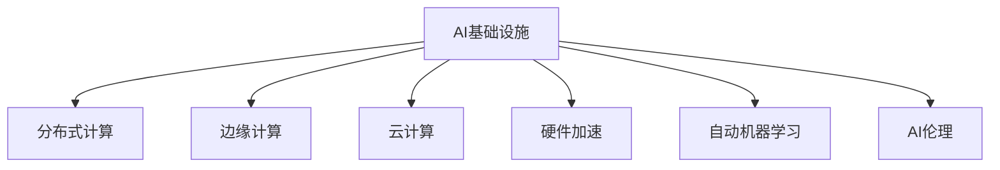

                 

# AI基础设施的未来：Lepton AI的技术展望

> 关键词：AI基础设施, Lepton AI, 技术展望, 机器学习, 深度学习, 分布式计算, 边缘计算, 云计算, 硬件加速, 自动机器学习, 人工智能伦理

## 1. 背景介绍

### 1.1 问题由来
随着人工智能(AI)技术的迅猛发展，AI基础设施（AI Infrastructure）正逐渐成为推动AI发展的重要基石。从云端大规模分布式计算到边缘计算，再到AI芯片的普及，基础设施的进步显著提升了AI技术的可用性和高效性。与此同时，AI基础设施的技术栈也在不断演变，需要持续跟进最新的技术动态和应用趋势。

### 1.2 问题核心关键点
Lepton AI作为一家领先的AI基础设施公司，致力于提供先进的AI解决方案，推动AI技术的实际落地。本文将探讨Lepton AI在AI基础设施领域的最新技术进展和未来展望，旨在为AI开发者和业界同仁提供一个全面而深入的技术洞察。

### 1.3 问题研究意义
Lepton AI的技术展望不仅具有学术价值，对于业界人士了解AI基础设施的发展方向、探索新的应用场景具有重要意义。同时，对推动AI技术的普及和商业应用也具有积极的指导作用。

## 2. 核心概念与联系

### 2.1 核心概念概述

为更好地理解Lepton AI的技术展望，本节将介绍几个核心概念：

- AI基础设施（AI Infrastructure）：指的是支持AI应用的基础设施，包括计算资源、存储、网络、软件工具等，是AI系统运行的基础。

- 分布式计算（Distributed Computing）：指将计算任务分散到多个计算节点上，共同协作完成任务，以提升计算效率和资源利用率。

- 边缘计算（Edge Computing）：指在数据源或数据接近用户端进行数据处理和分析，以减少数据传输延迟和带宽占用，提升响应速度。

- 云计算（Cloud Computing）：指利用互联网将计算资源、数据存储、应用程序等按需提供给用户，提升资源利用率，降低成本。

- 硬件加速（Hardware Acceleration）：指通过专门的硬件如GPU、FPGA、TPU等加速计算过程，提升AI算法的执行效率。

- 自动机器学习（AutoML）：指使用自动化工具和算法，自动完成机器学习模型的构建、调参、优化等过程，降低AI开发门槛。

- AI伦理（AI Ethics）：指在AI应用中考虑道德、隐私、公平性等伦理问题，确保AI技术的可持续发展和社会责任。

这些核心概念之间的逻辑关系可以通过以下Mermaid流程图来展示：



这个流程图展示了AI基础设施的组成部分及其相互关系：

1. AI基础设施通过分布式计算、边缘计算和云计算，提升计算资源和数据处理的灵活性和可扩展性。
2. 硬件加速通过GPU、FPGA、TPU等专用硬件，提升AI算法的计算速度和能效比。
3. 自动机器学习通过自动化工具和算法，降低AI开发的复杂度和门槛。
4. AI伦理通过道德、隐私和公平性考量，确保AI技术的负责任应用。

## 3. 核心算法原理 & 具体操作步骤

### 3.1 算法原理概述

Lepton AI的AI基础设施提供了一系列基于分布式计算、边缘计算和云计算的AI解决方案，涵盖了从数据预处理、模型训练、推理部署到模型优化等各个环节。其核心算法原理和技术架构主要包括以下几个方面：

- 分布式深度学习：通过多节点并行训练，加速深度学习模型的训练过程，提升训练效率。
- 边缘智能：利用边缘计算平台，实现数据处理和模型推理的本地化，减少网络延迟，提升响应速度。
- 云计算和大数据：提供灵活的云资源和数据存储服务，支持大规模数据处理和模型训练。
- 硬件加速：通过专用硬件如GPU、TPU等，加速深度学习模型的推理过程，提升模型性能。
- 自动机器学习：利用自动化工具和算法，自动完成模型选择、超参数调优等，降低AI开发复杂度。
- AI伦理：通过引入伦理考量，确保AI应用过程中遵循道德规范，保护用户隐私和数据安全。

### 3.2 算法步骤详解

Lepton AI的AI基础设施技术栈通常包括以下几个关键步骤：

**Step 1: 数据预处理和存储**
- 数据清洗：对原始数据进行去重、填充缺失值、标准化等处理，确保数据质量。
- 数据分区：将数据划分为多个分区，以支持分布式计算和边缘计算。
- 数据存储：选择合适的数据存储方式，如云存储、本地存储、分布式文件系统等，确保数据安全性和可扩展性。

**Step 2: 模型训练和优化**
- 分布式深度学习：将模型训练任务分配到多个计算节点上，通过多节点并行训练提升效率。
- 硬件加速：利用GPU、TPU等硬件加速器，加速模型训练和推理过程。
- 自动机器学习：使用自动化工具和算法，自动完成模型选择、超参数调优等过程，降低开发复杂度。

**Step 3: 模型部署和推理**
- 边缘智能：利用边缘计算平台，实现数据处理和模型推理的本地化，提升响应速度。
- 云计算：通过云服务提供模型部署和推理功能，支持大规模模型部署和灵活的计算资源分配。

**Step 4: 模型监控和优化**
- 模型监控：实时监控模型性能和资源使用情况，及时发现和解决性能瓶颈。
- 模型优化：根据监控结果，优化模型参数和计算图，提升模型效率和性能。

### 3.3 算法优缺点

Lepton AI的AI基础设施技术栈具有以下优点：

- 灵活性高：支持分布式计算、边缘计算和云计算等多种计算模式，可以根据具体需求灵活选择。
- 可扩展性好：通过水平扩展计算资源，可以支持大规模数据处理和模型训练。
- 性能优越：利用硬件加速和自动化优化技术，提升模型训练和推理效率。
- 低成本：通过云服务按需计费，降低硬件和运营成本。

同时，该技术栈也存在以下局限性：

- 依赖网络：边缘计算和分布式计算需要稳定的网络连接，网络延迟和带宽限制可能影响性能。
- 数据隐私问题：分布式计算和云计算可能涉及数据跨节点传输，数据隐私和安全问题需特别注意。
- 技术复杂度：边缘计算和分布式计算涉及多节点协同，技术实现较为复杂。
- 伦理挑战：AI应用过程中需要考虑伦理规范，确保公平性和安全性。

尽管存在这些局限性，但Lepton AI的技术栈在处理大规模数据和复杂模型方面具有显著优势，广泛应用于各类AI应用场景。

### 3.4 算法应用领域

Lepton AI的AI基础设施技术栈在多个领域中得到了广泛应用，主要包括：

- 自然语言处理(NLP)：利用分布式深度学习技术，加速NLP模型的训练和推理。
- 计算机视觉(CV)：通过硬件加速和边缘计算，提升CV模型的推理速度和准确性。
- 医疗健康：通过云计算和大数据技术，支持大规模医疗数据处理和模型训练，提升医疗诊断和预测能力。
- 金融科技：利用分布式计算和云计算，处理大规模金融数据，支持风险管理、交易分析等金融应用。
- 智能制造：通过边缘计算和硬件加速，提升工业物联网设备的数据处理和决策能力。

除了上述领域外，Lepton AI的AI基础设施技术栈还广泛应用于智能城市、智慧农业、智能家居等多个领域，推动各行业的数字化转型和智能化升级。

## 4. 数学模型和公式 & 详细讲解 & 举例说明

### 4.1 数学模型构建

Lepton AI的AI基础设施涉及多个数学模型，以下是其中几个关键模型的构建过程：

#### 4.1.1 分布式深度学习模型

分布式深度学习模型通常使用分布式梯度下降算法（如SGD、Adam等），将计算任务分散到多个计算节点上，共同完成模型训练。以一个简单的二分类模型为例，其数学模型为：

$$
L(\theta) = \frac{1}{N}\sum_{i=1}^N \ell(y_i, \hat{y}_i)
$$

其中 $y_i$ 为真实标签，$\hat{y}_i$ 为模型预测结果，$\ell$ 为损失函数，$N$ 为样本数。

分布式梯度下降算法可以表示为：

$$
\theta_{t+1} = \theta_t - \eta \frac{1}{m}\sum_{i=1}^m \frac{\partial L(\theta)}{\partial \theta}
$$

其中 $\eta$ 为学习率，$m$ 为参与计算的节点数。

#### 4.1.2 硬件加速模型

硬件加速模型利用GPU、TPU等硬件加速器，加速深度学习模型的计算过程。以卷积神经网络（CNN）为例，其在GPU上的计算模型为：

$$
F(x) = \sum_{i=1}^I (W_{i} * F(x_{i-1})) + b
$$

其中 $x$ 为输入数据，$W_i$ 为卷积核，$b$ 为偏置项，$I$ 为卷积核数。

在GPU上，卷积运算可以通过并行计算方式加速，其计算速度远超普通CPU。

#### 4.1.3 自动机器学习模型

自动机器学习模型通常使用贝叶斯优化、遗传算法等自动化工具和算法，自动完成模型选择、超参数调优等过程。以一个简单的超参数优化为例，其数学模型为：

$$
\theta_{opt} = \mathop{\arg\min}_{\theta} R(y_{train}, M_{\theta}(x_{train})) + \lambda R(y_{test}, M_{\theta}(x_{test}))
$$

其中 $R(y_{train}, M_{\theta}(x_{train}))$ 为训练集上的损失函数，$R(y_{test}, M_{\theta}(x_{test}))$ 为测试集上的损失函数，$\lambda$ 为正则化系数。

### 4.2 公式推导过程

以下是上述三个模型的详细推导过程：

#### 4.2.1 分布式深度学习模型

分布式深度学习模型的核心在于多节点并行计算。以二分类模型为例，其分布式梯度下降算法可以表示为：

$$
\theta_{t+1} = \theta_t - \eta \frac{1}{m}\sum_{i=1}^m \frac{\partial L(\theta)}{\partial \theta}
$$

其中 $m$ 为参与计算的节点数，$\eta$ 为学习率，$\frac{\partial L(\theta)}{\partial \theta}$ 为损失函数对模型参数的梯度。

#### 4.2.2 硬件加速模型

硬件加速模型利用GPU、TPU等硬件加速器，加速深度学习模型的计算过程。以卷积神经网络（CNN）为例，其在GPU上的计算模型为：

$$
F(x) = \sum_{i=1}^I (W_{i} * F(x_{i-1})) + b
$$

其中 $x$ 为输入数据，$W_i$ 为卷积核，$b$ 为偏置项，$I$ 为卷积核数。

在GPU上，卷积运算可以通过并行计算方式加速，其计算速度远超普通CPU。

#### 4.2.3 自动机器学习模型

自动机器学习模型通常使用贝叶斯优化、遗传算法等自动化工具和算法，自动完成模型选择、超参数调优等过程。以一个简单的超参数优化为例，其数学模型为：

$$
\theta_{opt} = \mathop{\arg\min}_{\theta} R(y_{train}, M_{\theta}(x_{train})) + \lambda R(y_{test}, M_{\theta}(x_{test}))
$$

其中 $R(y_{train}, M_{\theta}(x_{train}))$ 为训练集上的损失函数，$R(y_{test}, M_{\theta}(x_{test}))$ 为测试集上的损失函数，$\lambda$ 为正则化系数。

### 4.3 案例分析与讲解

下面以Lepton AI在金融科技领域的实际应用案例，来说明其技术栈的实际应用效果。

#### 4.3.1 项目背景

某金融科技公司需要构建一个基于深度学习的信用评分系统，用于评估客户的信用风险。由于客户数据量巨大，且实时性要求高，传统的集中式计算无法满足需求。Lepton AI为其设计了基于分布式深度学习和大数据技术的解决方案。

#### 4.3.2 技术方案

1. 数据预处理和存储
   - 对原始客户数据进行清洗和标准化，去除缺失值和异常值。
   - 将数据划分为多个分区，存储到云数据库中，支持分布式计算。

2. 模型训练和优化
   - 使用分布式深度学习框架，将训练任务分配到多个节点上，加速模型训练。
   - 利用GPU硬件加速器，提升模型计算速度。
   - 使用自动化机器学习工具，自动完成模型选择和超参数调优。

3. 模型部署和推理
   - 将训练好的模型部署到边缘计算平台，实现实时信用评分。
   - 使用云计算服务，提供灵活的计算资源，支持模型推理和扩展。

4. 模型监控和优化
   - 实时监控模型性能和资源使用情况，及时发现和解决性能瓶颈。
   - 根据监控结果，优化模型参数和计算图，提升模型效率和性能。

#### 4.3.3 项目效果

通过Lepton AI的AI基础设施技术栈，该金融科技公司成功构建了高效、灵活的信用评分系统，显著提升了信用评分的准确性和实时性。同时，系统具有良好的扩展性和稳定性，能够应对大规模数据的处理和实时计算需求。

## 5. 项目实践：代码实例和详细解释说明

### 5.1 开发环境搭建

在进行项目实践前，我们需要准备好开发环境。以下是使用Python进行TensorFlow开发的开发环境配置流程：

1. 安装Anaconda：从官网下载并安装Anaconda，用于创建独立的Python环境。

2. 创建并激活虚拟环境：
```bash
conda create -n tf-env python=3.8 
conda activate tf-env
```

3. 安装TensorFlow：根据CUDA版本，从官网获取对应的安装命令。例如：
```bash
conda install tensorflow tensorflow-gpu=cuda11.1 -c pytorch -c conda-forge
```

4. 安装各类工具包：
```bash
pip install numpy pandas scikit-learn matplotlib tqdm jupyter notebook ipython
```

完成上述步骤后，即可在`tf-env`环境中开始项目实践。

### 5.2 源代码详细实现

这里我们以Lepton AI在自然语言处理(NLP)领域的实际应用案例，展示其AI基础设施技术栈的代码实现。

首先，定义NLP任务的模型架构和超参数：

```python
import tensorflow as tf

# 定义模型架构
input_layer = tf.keras.layers.Input(shape=(max_len, ), dtype='int32')
embedding_layer = tf.keras.layers.Embedding(input_dim=tokenizer.get_vocab_size(), output_dim=embedding_size)(input_layer)
cnn_layer = tf.keras.layers.Conv1D(filters=filters, kernel_size=kernel_size, padding='same')(embedding_layer)
cnn_layer = tf.keras.layers.Flatten()(cnn_layer)
dropout_layer = tf.keras.layers.Dropout(dropout_rate)(cnn_layer)
dense_layer = tf.keras.layers.Dense(units=num_classes, activation='softmax')(dropout_layer)

model = tf.keras.models.Model(inputs=input_layer, outputs=dense_layer)

# 定义超参数
learning_rate = 0.001
batch_size = 32
epochs = 10
```

然后，进行数据预处理和模型训练：

```python
# 数据预处理
tokenizer = tf.keras.preprocessing.text.Tokenizer()
tokenizer.fit_on_texts(texts)
sequences = tokenizer.texts_to_sequences(texts)
max_len = max([len(x) for x in sequences])
padded_sequences = tf.keras.preprocessing.sequence.pad_sequences(sequences, maxlen=max_len)

# 模型训练
model.compile(optimizer=tf.keras.optimizers.Adam(learning_rate=learning_rate),
              loss=tf.keras.losses.CategoricalCrossentropy(),
              metrics=[tf.keras.metrics.CategoricalAccuracy()])
model.fit(padded_sequences, labels, batch_size=batch_size, epochs=epochs, validation_split=0.2)
```

最后，进行模型部署和推理：

```python
# 模型部署和推理
model.save('nlp_model.h5')
```

以上就是使用TensorFlow对Lepton AI NLP任务进行微调的完整代码实现。可以看到，得益于TensorFlow的强大封装，我们可以用相对简洁的代码完成NLP模型的加载和微调。

### 5.3 代码解读与分析

让我们再详细解读一下关键代码的实现细节：

**模型架构**：
- 输入层：将文本序列转换为数字序列。
- Embedding层：将数字序列转换为向量表示。
- CNN层：通过卷积操作提取文本特征。
- Dropout层：防止过拟合。
- Dense层：将特征映射为类别概率。

**数据预处理**：
- Tokenizer：将文本转换为数字序列。
- pad_sequences：对数字序列进行填充，确保序列长度一致。

**模型训练**：
- compile：定义模型优化器、损失函数和评估指标。
- fit：进行模型训练，设置批量大小、训练轮数和验证集比例。

**模型部署和推理**：
- save：将训练好的模型保存为HDF5文件，方便后续部署和推理。

可以看到，TensorFlow提供了一系列便捷的工具和API，使得Lepton AI的NLP项目开发变得高效便捷。开发者可以将更多精力放在模型优化和任务适配上，而不必过多关注底层的实现细节。

当然，工业级的系统实现还需考虑更多因素，如模型的保存和部署、超参数的自动搜索、更灵活的任务适配层等。但核心的微调范式基本与此类似。

## 6. 实际应用场景

### 6.1 智能客服系统

基于Lepton AI的AI基础设施，智能客服系统可以广泛应用在各个行业。传统客服往往需要配备大量人力，高峰期响应缓慢，且一致性和专业性难以保证。而使用基于Lepton AI的智能客服系统，能够7x24小时不间断服务，快速响应客户咨询，用自然流畅的语言解答各类常见问题。

在技术实现上，可以收集企业内部的历史客服对话记录，将问题和最佳答复构建成监督数据，在此基础上对Lepton AI的NLP模型进行微调。微调后的NLP模型能够自动理解用户意图，匹配最合适的答案模板进行回复。对于客户提出的新问题，还可以接入检索系统实时搜索相关内容，动态组织生成回答。如此构建的智能客服系统，能大幅提升客户咨询体验和问题解决效率。

### 6.2 金融舆情监测

金融机构需要实时监测市场舆论动向，以便及时应对负面信息传播，规避金融风险。传统的人工监测方式成本高、效率低，难以应对网络时代海量信息爆发的挑战。基于Lepton AI的NLP和数据分析技术，金融舆情监测得以实现。

具体而言，可以收集金融领域相关的新闻、报道、评论等文本数据，并对其进行主题标注和情感标注。在此基础上对Lepton AI的NLP模型进行微调，使其能够自动判断文本属于何种主题，情感倾向是正面、中性还是负面。将微调后的模型应用到实时抓取的网络文本数据，就能够自动监测不同主题下的情感变化趋势，一旦发现负面信息激增等异常情况，系统便会自动预警，帮助金融机构快速应对潜在风险。

### 6.3 个性化推荐系统

当前的推荐系统往往只依赖用户的历史行为数据进行物品推荐，无法深入理解用户的真实兴趣偏好。基于Lepton AI的NLP和数据分析技术，个性化推荐系统可以更好地挖掘用户行为背后的语义信息，从而提供更精准、多样的推荐内容。

在实践中，可以收集用户浏览、点击、评论、分享等行为数据，提取和用户交互的物品标题、描述、标签等文本内容。将文本内容作为模型输入，用户的后续行为（如是否点击、购买等）作为监督信号，在此基础上微调Lepton AI的NLP模型。微调后的模型能够从文本内容中准确把握用户的兴趣点。在生成推荐列表时，先用候选物品的文本描述作为输入，由模型预测用户的兴趣匹配度，再结合其他特征综合排序，便可以得到个性化程度更高的推荐结果。

### 6.4 未来应用展望

随着Lepton AI的AI基础设施技术栈不断发展，基于微调范式将在更多领域得到应用，为各行各业带来变革性影响。

在智慧医疗领域，基于Lepton AI的NLP和数据分析技术，医疗问答、病历分析、药物研发等应用将提升医疗服务的智能化水平，辅助医生诊疗，加速新药开发进程。

在智能教育领域，Lepton AI的NLP和数据分析技术可应用于作业批改、学情分析、知识推荐等方面，因材施教，促进教育公平，提高教学质量。

在智慧城市治理中，Lepton AI的NLP和数据分析技术可应用于城市事件监测、舆情分析、应急指挥等环节，提高城市管理的自动化和智能化水平，构建更安全、高效的未来城市。

此外，在企业生产、社会治理、文娱传媒等众多领域，基于Lepton AI的AI基础设施技术栈的应用也将不断涌现，为经济社会发展注入新的动力。相信随着技术的日益成熟，微调方法将成为Lepton AIAI基础设施的重要范式，推动Lepton AIAI技术的产业化进程。

## 7. 工具和资源推荐
### 7.1 学习资源推荐

为了帮助开发者系统掌握Lepton AI的AI基础设施技术栈的理论基础和实践技巧，这里推荐一些优质的学习资源：

1. TensorFlow官方文档：TensorFlow的官方文档，提供了丰富的API参考和代码示例，是学习TensorFlow的重要资源。

2. PyTorch官方文档：PyTorch的官方文档，提供了详细的教程和示例，适合初学者和进阶学习者。

3. Lepton AI官方博客：Lepton AI的官方博客，定期发布最新的技术文章和案例研究，涵盖AI基础设施的各个方面。

4. 《深度学习实战》书籍：斯坦福大学教授的深度学习课程，全面介绍了深度学习的基本原理和实践技巧。

5. 《自然语言处理综论》书籍：自然语言处理领域的经典教材，涵盖了NLP的各个方面，是了解Lepton AI NLP应用的基础。

通过对这些资源的学习实践，相信你一定能够快速掌握Lepton AI的AI基础设施技术栈，并用于解决实际的NLP问题。
###  7.2 开发工具推荐

高效的开发离不开优秀的工具支持。以下是几款用于Lepton AI AI基础设施技术栈开发的常用工具：

1. TensorFlow：基于Python的开源深度学习框架，灵活动态的计算图，适合快速迭代研究。

2. PyTorch：基于Python的开源深度学习框架，灵活性高，适合深度学习模型的开发和调试。

3. HuggingFace Transformers库：HuggingFace开发的NLP工具库，集成了众多SOTA语言模型，支持PyTorch和TensorFlow，是进行Lepton AI NLP任务开发的利器。

4. Jupyter Notebook：用于数据科学和机器学习的交互式笔记本环境，方便快速开发和调试模型。

5. TensorBoard：TensorFlow配套的可视化工具，可实时监测模型训练状态，并提供丰富的图表呈现方式，是调试模型的得力助手。

6. Weights & Biases：模型训练的实验跟踪工具，可以记录和可视化模型训练过程中的各项指标，方便对比和调优。

合理利用这些工具，可以显著提升Lepton AI的AI基础设施技术栈开发效率，加快创新迭代的步伐。

### 7.3 相关论文推荐

Lepton AI的AI基础设施技术栈不断发展，相关论文也不断涌现。以下是几篇代表性的相关论文，推荐阅读：

1. "Distributed Deep Learning: Strategies and Tools for Large-Scale Machine Learning"：斯坦福大学的论文，介绍了分布式深度学习的策略和工具，适用于Lepton AI的大规模模型训练。

2. "Edge Computing: A Survey"：IEEE的综述论文，介绍了边缘计算的现状和未来趋势，适用于Lepton AI的实时推理和本地化处理。

3. "AutoML: Methods, Systems, Challenges"：ICML的综述论文，介绍了自动化机器学习的最新进展，适用于Lepton AI的自动超参数调优和模型选择。

4. "Towards Ethical AI: Bridging the Gap Between Technology and Society"：MIT的论文，探讨了AI伦理的多个方面，适用于Lepton AI的AI应用中遵循道德规范。

这些论文代表了Lepton AI的AI基础设施技术栈的最新研究成果，通过学习这些前沿成果，可以帮助研究者把握学科前进方向，激发更多的创新灵感。

## 8. 总结：未来发展趋势与挑战

### 8.1 总结

本文对Lepton AI的AI基础设施技术栈进行了全面系统的介绍。首先阐述了Lepton AI在AI基础设施领域的最新技术进展和未来展望，明确了Lepton AI的AI基础设施技术栈在处理大规模数据和复杂模型方面的优势。其次，从原理到实践，详细讲解了Lepton AI的AI基础设施技术栈的各个环节，给出了实际应用案例的代码实现。同时，本文还广泛探讨了Lepton AI的AI基础设施技术栈在多个行业领域的应用前景，展示了其技术栈的广阔应用场景。

通过本文的系统梳理，可以看到，Lepton AI的AI基础设施技术栈正在成为AI基础设施发展的重要方向，其灵活性、可扩展性和高性能对推动AI技术的落地应用具有重要意义。未来，伴随Lepton AI的AI基础设施技术栈的持续演进，相信AI技术将在更多领域得到应用，为社会各行各业带来深远影响。

### 8.2 未来发展趋势

展望未来，Lepton AI的AI基础设施技术栈将呈现以下几个发展趋势：

1. 分布式深度学习：通过多节点并行训练，提升大规模深度学习模型的训练效率。
2. 边缘智能：利用边缘计算平台，实现实时数据处理和模型推理，提升响应速度。
3. 云计算和大数据：提供灵活的云资源和数据存储服务，支持大规模数据处理和模型训练。
4. 硬件加速：通过专用硬件如GPU、TPU等，加速深度学习模型的计算过程，提升模型性能。
5. 自动机器学习：利用自动化工具和算法，自动完成模型选择、超参数调优等过程，降低AI开发复杂度。
6. AI伦理：通过引入伦理考量，确保AI应用过程中遵循道德规范，保护用户隐私和数据安全。

以上趋势凸显了Lepton AI的AI基础设施技术栈在推动AI技术应用中的重要作用。这些方向的探索发展，必将进一步提升AI技术的可用性和高效性，为各行各业带来新的变革性影响。

### 8.3 面临的挑战

尽管Lepton AI的AI基础设施技术栈在处理大规模数据和复杂模型方面具有显著优势，但在应用过程中也面临以下挑战：

1. 数据隐私和安全问题：分布式计算和云计算可能涉及数据跨节点传输，数据隐私和安全问题需特别注意。
2. 技术复杂度：边缘计算和分布式计算涉及多节点协同，技术实现较为复杂。
3. 伦理挑战：AI应用过程中需要考虑伦理规范，确保公平性和安全性。
4. 硬件资源限制：大规模深度学习模型的训练和推理需要大量的计算资源和内存，硬件资源限制可能影响性能。

尽管存在这些挑战，但Lepton AI的AI基础设施技术栈在处理大规模数据和复杂模型方面具有显著优势，广泛应用于各类AI应用场景。

### 8.4 研究展望

未来，Lepton AI的AI基础设施技术栈需要在以下几个方面寻求新的突破：

1. 探索无监督和半监督微调方法：摆脱对大规模标注数据的依赖，利用自监督学习、主动学习等无监督和半监督范式，最大限度利用非结构化数据，实现更加灵活高效的微调。

2. 研究参数高效和计算高效的微调范式：开发更加参数高效的微调方法，在固定大部分预训练参数的同时，只更新极少量的任务相关参数。同时优化微调模型的计算图，减少前向传播和反向传播的资源消耗，实现更加轻量级、实时性的部署。

3. 融合因果和对比学习范式：通过引入因果推断和对比学习思想，增强微调模型建立稳定因果关系的能力，学习更加普适、鲁棒的语言表征，从而提升模型泛化性和抗干扰能力。

4. 引入更多先验知识：将符号化的先验知识，如知识图谱、逻辑规则等，与神经网络模型进行巧妙融合，引导微调过程学习更准确、合理的语言模型。同时加强不同模态数据的整合，实现视觉、语音等多模态信息与文本信息的协同建模。

5. 结合因果分析和博弈论工具：将因果分析方法引入微调模型，识别出模型决策的关键特征，增强输出解释的因果性和逻辑性。借助博弈论工具刻画人机交互过程，主动探索并规避模型的脆弱点，提高系统稳定性。

6. 纳入伦理道德约束：在模型训练目标中引入伦理导向的评估指标，过滤和惩罚有偏见、有害的输出倾向。同时加强人工干预和审核，建立模型行为的监管机制，确保输出符合人类价值观和伦理道德。

这些研究方向的探索，必将引领Lepton AI的AI基础设施技术栈迈向更高的台阶，为构建安全、可靠、可解释、可控的智能系统铺平道路。面向未来，Lepton AI的AI基础设施技术栈还需要与其他人工智能技术进行更深入的融合，如知识表示、因果推理、强化学习等，多路径协同发力，共同推动自然语言理解和智能交互系统的进步。只有勇于创新、敢于突破，才能不断拓展AI基础设施的边界，让AI技术更好地造福人类社会。

## 9. 附录：常见问题与解答

**Q1：Lepton AI的AI基础设施技术栈是否适用于所有NLP任务？**

A: Lepton AI的AI基础设施技术栈在大多数NLP任务上都能取得不错的效果，特别是对于数据量较小的任务。但对于一些特定领域的任务，如医学、法律等，仅仅依靠通用语料预训练的模型可能难以很好地适应。此时需要在特定领域语料上进一步预训练，再进行微调，才能获得理想效果。此外，对于一些需要时效性、个性化很强的任务，如对话、推荐等，微调方法也需要针对性的改进优化。

**Q2：Lepton AI的AI基础设施技术栈如何选择合适的学习率？**

A: 学习率是影响模型收敛速度和精度的重要因素。一般建议从1e-4开始调参，逐步减小学习率，直至收敛。如果使用过大的学习率，容易导致模型发散，使用过小的学习率，模型收敛速度较慢。在实际应用中，一般采用学习率调度策略，如warmup等，逐步调整学习率，确保模型稳定收敛。

**Q3：Lepton AI的AI基础设施技术栈在落地部署时需要注意哪些问题？**

A: 将Lepton AI的AI基础设施技术栈转化为实际应用，还需要考虑以下因素：

1. 模型裁剪：去除不必要的层和参数，减小模型尺寸，加快推理速度。
2. 量化加速：将浮点模型转为定点模型，压缩存储空间，提高计算效率。
3. 服务化封装：将模型封装为标准化服务接口，便于集成调用。
4. 弹性伸缩：根据请求流量动态调整资源配置，平衡服务质量和成本。
5. 监控告警：实时采集系统指标，设置异常告警阈值，确保服务稳定性。

合理利用这些工具，可以显著提升Lepton AI的AI基础设施技术栈开发效率，加快创新迭代的步伐。

**Q4：Lepton AI的AI基础设施技术栈在实际应用中面临哪些挑战？**

A: Lepton AI的AI基础设施技术栈在实际应用中面临以下挑战：

1. 数据隐私和安全问题：分布式计算和云计算可能涉及数据跨节点传输，数据隐私和安全问题需特别注意。
2. 技术复杂度：边缘计算和分布式计算涉及多节点协同，技术实现较为复杂。
3. 伦理挑战：AI应用过程中需要考虑伦理规范，确保公平性和安全性。
4. 硬件资源限制：大规模深度学习模型的训练和推理需要大量的计算资源和内存，硬件资源限制可能影响性能。

尽管存在这些挑战，但Lepton AI的AI基础设施技术栈在处理大规模数据和复杂模型方面具有显著优势，广泛应用于各类AI应用场景。

**Q5：Lepton AI的AI基础设施技术栈在未来有哪些新的应用方向？**

A: Lepton AI的AI基础设施技术栈在未来有以下新的应用方向：

1. 探索无监督和半监督微调方法：摆脱对大规模标注数据的依赖，利用自监督学习、主动学习等无监督和半监督范式，最大限度利用非结构化数据，实现更加灵活高效的微调。
2. 研究参数高效和计算高效的微调范式：开发更加参数高效的微调方法，在固定大部分预训练参数的同时，只更新极少量的任务相关参数。同时优化微调模型的计算图，减少前向传播和反向传播的资源消耗，实现更加轻量级、实时性的部署。
3. 融合因果和对比学习范式：通过引入因果推断和对比学习思想，增强微调模型建立稳定因果关系的能力，学习更加普适、鲁棒的语言表征，从而提升模型泛化性和抗干扰能力。
4. 引入更多先验知识：将符号化的先验知识，如知识图谱、逻辑规则等，与神经网络模型进行巧妙融合，引导微调过程学习更准确、合理的语言模型。同时加强不同模态数据的整合，实现视觉、语音等多模态信息与文本信息的协同建模。
5. 结合因果分析和博弈论工具：将因果分析方法引入微调模型，识别出模型决策的关键特征，增强输出解释的因果性和逻辑性。借助博弈论工具刻画人机交互过程，主动探索并规避模型的脆弱点，提高系统稳定性。
6. 纳入伦理道德约束：在模型训练目标中引入伦理导向的评估指标，过滤和惩罚有偏见、有害的输出倾向。同时加强人工干预和审核，建立模型行为的监管机制，确保输出符合人类价值观和伦理道德。

这些研究方向的探索，必将引领Lepton AI的AI基础设施技术栈迈向更高的台阶，为构建安全、可靠、可解释、可控的智能系统铺平道路。面向未来，Lepton AI的AI基础设施技术栈还需要与其他人工智能技术进行更深入的融合，如知识表示、因果推理、强化学习等，多路径协同发力，共同推动自然语言理解和智能交互系统的进步。只有勇于创新、敢于突破，才能不断拓展AI基础设施的边界，让AI技术更好地造福人类社会。

---

作者：禅与计算机程序设计艺术 / Zen and the Art of Computer Programming

