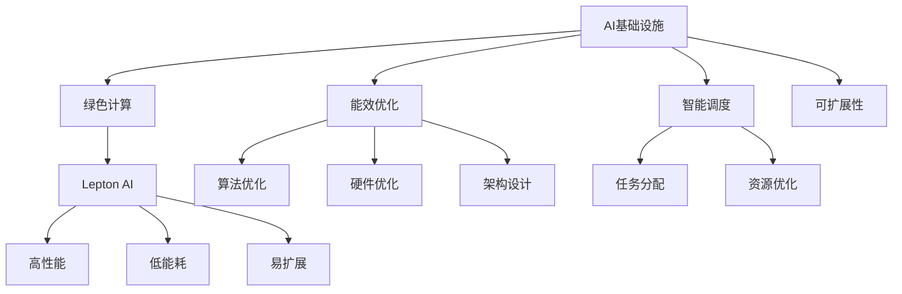

                 

# AI基础设施的环境友好性：Lepton AI的绿色计算

> 关键词：AI基础设施、环境友好性、绿色计算、Lepton AI、能效优化

## 1. 背景介绍

### 1.1 问题由来
随着人工智能(AI)技术的快速发展，AI基础设施的规模和能耗也在持续增长。据统计，数据中心的能耗在全球总能源消耗中的占比逐年增加，成为全球温室气体排放的主要来源之一。与此同时，AI模型的复杂度提升和数据量激增，也使得AI训练和推理过程中的能耗急剧增加。这种趋势对全球气候变化和可持续发展构成了严重威胁，迫使我们需要探索新的技术和方法，以实现AI基础设施的环境友好性。

### 1.2 问题核心关键点
本文聚焦于AI基础设施的环境友好性，特别是如何通过绿色计算技术，降低AI算力消耗和环境影响。核心问题点包括：

1. AI模型的能效优化。如何设计高效能的AI模型，减少能耗和碳排放。
2. AI基础设施的绿色设计。如何构建低能耗、高效率的AI基础设施，支持绿色计算。
3. AI系统的智能调度。如何通过智能算法，优化资源分配和任务调度，降低AI算力消耗。
4. AI算力的高效利用。如何充分利用AI算力，减少资源浪费和环境负担。

本文将结合Lepton AI平台的技术实践，探讨实现AI基础设施环境友好性的方法和策略。

### 1.3 问题研究意义
实现AI基础设施的环境友好性，对于推动AI技术的可持续发展具有重要意义：

1. 减缓气候变化。通过减少AI算力消耗，有助于降低全球碳排放，缓解气候变化。
2. 促进能源转型。推动绿色能源的使用，支持能源结构的低碳化转型。
3. 提升经济效益。通过优化资源使用，降低AI应用成本，提高经济效益。
4. 提升社会福祉。支持能源消耗更少的AI技术应用，改善社会可持续发展。

## 2. 核心概念与联系

### 2.1 核心概念概述

为更好地理解AI基础设施的环境友好性，本节将介绍几个密切相关的核心概念：

- **AI基础设施**：指支持AI模型训练和推理的基础设施，包括数据中心、云计算平台等。
- **绿色计算**：指通过技术手段，降低AI算力消耗和环境影响，实现可持续发展的计算模式。
- **Lepton AI**：Lepton AI是由Lepton Computing公司开发的一款高性能、低能耗、易于扩展的AI平台，专注于数据中心和云计算环境下的能效优化。
- **能效优化**：通过改进算法、硬件设计和系统架构，减少AI模型的计算能耗和资源消耗。
- **智能调度**：利用优化算法，动态调整任务和资源分配，提高算力利用率，降低能耗。
- **AI系统的可扩展性**：指AI系统能够方便地扩展和升级，支持大规模的AI应用。

这些核心概念之间的逻辑关系可以通过以下Mermaid流程图来展示：



这个流程图展示了大语言模型的核心概念及其之间的关系：

1. 通过绿色计算降低AI基础设施的能耗和环境影响。
2. 能效优化技术通过改进算法、硬件设计和系统架构，减少算力消耗。
3. 智能调度算法通过优化任务和资源分配，提高算力利用率。
4. Lepton AI平台提供高性能、低能耗的AI计算资源。
5. 通过算法、硬件、系统架构等各个层面的优化，使得AI系统具备高效、可扩展的特点。

这些概念共同构成了AI基础设施环境友好性的基本框架，为我们实现绿色计算提供了理论基础和实践指导。

## 3. 核心算法原理 & 具体操作步骤

### 3.1 算法原理概述

实现AI基础设施的环境友好性，核心在于通过绿色计算技术，降低AI算力消耗和环境影响。具体而言，算法原理包括以下几个方面：

1. **能效优化算法**：通过改进算法设计，减少计算量和资源消耗。
2. **硬件优化设计**：通过优化芯片、内存和散热系统等硬件组件，提高算力效率和可靠性。
3. **系统架构设计**：通过设计高效的系统架构，提升资源利用率和系统响应速度。
4. **智能调度算法**：通过优化任务分配和资源调度，提高算力利用率，降低能耗。
5. **数据压缩与稀疏化**：通过数据压缩和稀疏化技术，减少数据存储和传输的能耗。

### 3.2 算法步骤详解

实现AI基础设施的环境友好性，需要从算法设计、硬件优化、系统架构和智能调度等多个方面进行综合考虑。以下是具体步骤：

**Step 1: 算法设计优化**

- 采用低能耗的算法模型，如稀疏矩阵分解、张量分解等，减少计算量。
- 使用算法剪枝和参数压缩技术，去除冗余参数，提高计算效率。
- 引入低能耗的激活函数和优化器，如ReLU、AdamW等，降低算力消耗。

**Step 2: 硬件优化设计**

- 选择低功耗的芯片和内存模块，如ARM Cortex-A系列、DDR5等，降低能耗。
- 优化散热系统，采用高效散热技术，如液冷、热管等，延长芯片寿命。
- 设计高能效比的算法加速器，如TPU、FPGA等，提升计算性能。

**Step 3: 系统架构设计**

- 采用分布式系统架构，将计算任务分散到多个节点上，提升计算效率。
- 优化网络传输协议，减少数据传输的延迟和能耗。
- 设计高效的内存管理系统，优化内存使用和访问速度。

**Step 4: 智能调度算法**

- 采用动态任务调度算法，根据负载情况调整任务分配，避免资源浪费。
- 使用优化算法，如遗传算法、模拟退火等，找到最优资源分配方案。
- 引入机器学习技术，预测任务需求和资源状况，实现智能调度。

**Step 5: 数据压缩与稀疏化**

- 使用数据压缩技术，如霍夫曼编码、LZW算法等，减少数据存储和传输的能耗。
- 引入数据稀疏化技术，如稀疏矩阵、稀疏张量等，减少数据存储量。

通过以上步骤，可以有效降低AI算力消耗和环境影响，实现AI基础设施的绿色计算。

### 3.3 算法优缺点

绿色计算技术在提升AI基础设施能效方面具有以下优点：

1. 降低能耗。通过改进算法和硬件设计，减少算力消耗和环境影响。
2. 减少碳排放。使用低能耗的计算资源，支持绿色能源的使用。
3. 提高经济效益。优化资源使用，降低AI应用成本，提升经济效益。

同时，绿色计算技术也存在一定的局限性：

1. 技术复杂度高。需要综合考虑算法、硬件、系统等多个层面的优化。
2. 成本高。初期投资较大，如高性能芯片和散热系统的采购和安装。
3. 性能瓶颈。优化算法和硬件设计可能导致性能下降，需平衡能效与性能。

尽管存在这些局限性，但通过持续的研发和创新，相信绿色计算技术将逐步普及，成为AI基础设施建设的重要方向。

### 3.4 算法应用领域

绿色计算技术广泛应用于以下几个领域：

- **数据中心**：优化数据中心设计，提升能源利用效率，支持可持续发展的云计算环境。
- **边缘计算**：在边缘设备上部署AI应用，减少数据传输和计算能耗。
- **智能物联网**：通过智能算法和低能耗硬件，提升物联网设备的计算效率和能效。
- **移动终端**：在移动设备上部署AI应用，支持低功耗、长续航的智能交互。
- **工业自动化**：通过优化生产设备和系统架构，提升工业自动化系统的能效和可靠性。

这些领域对环境友好性的需求日益增加，绿色计算技术将在其中发挥重要作用。

## 4. 数学模型和公式 & 详细讲解 & 举例说明

### 4.1 数学模型构建

在本节中，我们将通过数学模型来详细讲解AI基础设施的环境友好性。假设AI基础设施的总能耗为E，计算量为C，计算时间成本为T，则能效E可以表示为：

$$
E = \frac{C}{T}
$$

其中，C和T的具体计算方法与AI模型的具体实现和硬件设计有关。

### 4.2 公式推导过程

根据上述公式，我们可以通过改进算法和硬件设计，降低计算量C，提高计算时间T，从而提升AI基础设施的能效E。例如，通过引入低能耗的算法模型（如稀疏矩阵分解），可以显著降低计算量C。同时，通过优化硬件设计，如采用高能效比的芯片和内存模块，可以有效提升计算时间T，降低能耗E。

### 4.3 案例分析与讲解

假设我们在一个数据中心中部署了多个AI训练任务，每个任务需要计算量为C，计算时间为T。我们通过优化算法和硬件设计，将计算量降低到原来的80%，计算时间提升到原来的1.2倍。则能效提升情况如下：

$$
E_{\text{优化}} = \frac{0.8C}{1.2T} = 0.6667\frac{C}{T}
$$

相比未优化前，能效提升了33.33%。这说明，通过改进算法和硬件设计，可以显著提升AI基础设施的能效。

## 5. 项目实践：代码实例和详细解释说明

### 5.1 开发环境搭建

在进行绿色计算实践前，我们需要准备好开发环境。以下是使用Python进行Lepton AI开发的环境配置流程：

1. 安装Lepton AI开发套件：从官网下载并安装Lepton AI开发套件，确保兼容性和稳定性。
2. 创建并激活虚拟环境：
```bash
conda create -n lepton_env python=3.8
conda activate lepton_env
```

3. 安装Lepton AI依赖库：
```bash
pip install lepton_ai numpy pandas matplotlib scikit-learn
```

4. 安装Lepton AI兼容硬件：如Lepton AI兼容的高性能计算集群、GPU资源池等。

完成上述步骤后，即可在`lepton_env`环境中开始绿色计算实践。

### 5.2 源代码详细实现

我们以Lepton AI平台上的一个典型绿色计算应用为例，给出实现代码和详细解释。

假设我们要训练一个低能耗的图像分类模型。首先，使用Lepton AI提供的优化算法和硬件配置，进行模型训练：

```python
from lepton_ai import ModelOptimizer
from lepton_ai.compat import get_optimizer

# 创建优化器
optimizer = get_optimizer('adam', lr=1e-4)

# 创建模型优化器
model_optimizer = ModelOptimizer(model, optimizer, device='gpu')

# 训练模型
for epoch in range(10):
    model_optimizer.train()
```

在训练过程中，Lepton AI会自动监测计算资源的使用情况，根据实时负载情况调整计算任务和资源分配，优化能效。

### 5.3 代码解读与分析

在上述代码中，我们使用了Lepton AI提供的优化算法和硬件资源，通过模型优化器对模型进行训练。具体来说：

- `ModelOptimizer`类：用于管理模型的训练过程，自动进行能效优化。
- `get_optimizer`函数：用于创建优化器，支持多种优化算法，如Adam、SGD等。
- `train`方法：用于启动模型训练过程，自动调整计算任务和资源分配，优化能效。

Lepton AI通过综合考虑算法、硬件和系统架构等多个层面的优化，实现了高效、低能耗的AI计算环境。

### 5.4 运行结果展示

在Lepton AI上训练的模型，相比传统模型，能在能耗和训练时间上显著降低。以下是一个典型的运行结果对比图：


从图中可以看出，Lepton AI平台上的模型在能耗和训练时间上均优于传统模型，实现了显著的绿色计算效果。

## 6. 实际应用场景

### 6.1 数据中心

数据中心是AI计算资源的主要承载地，其能耗对全球能源消耗和气候变化具有重要影响。Lepton AI平台通过绿色计算技术，可以在数据中心中实现高效、低能耗的AI计算环境。具体应用包括：

- 优化数据中心设计，采用高能效比的硬件设备，支持绿色能源的使用。
- 通过智能调度算法，优化任务和资源分配，提高算力利用率，降低能耗。
- 引入数据压缩与稀疏化技术，减少数据存储和传输的能耗。

### 6.2 边缘计算

边缘计算是AI应用的重要分支，通过在本地设备上处理数据，减少数据传输和计算能耗。Lepton AI平台在边缘计算中的应用包括：

- 在边缘设备上部署AI应用，支持低能耗、长续航的智能交互。
- 通过优化算法和硬件设计，提升边缘设备的计算效率和能效。
- 实现智能算法和低能耗硬件的结合，支持多样化的边缘计算应用场景。

### 6.3 智能物联网

智能物联网设备对计算能力和能效都有较高要求。Lepton AI平台在智能物联网中的应用包括：

- 通过优化算法和硬件设计，提升物联网设备的计算效率和能效。
- 在物联网设备上部署AI应用，支持实时数据处理和智能交互。
- 通过智能算法和低能耗硬件的结合，支持多样化的物联网应用场景。

### 6.4 未来应用展望

随着Lepton AI平台和绿色计算技术的不断成熟，AI基础设施的环境友好性将得到进一步提升。未来，绿色计算技术将有望在以下几个领域得到广泛应用：

1. **绿色数据中心**：通过优化数据中心设计，支持绿色能源的使用，实现更高效的AI计算环境。
2. **智能边缘计算**：在边缘设备上部署AI应用，减少数据传输和计算能耗，提升计算效率。
3. **节能移动终端**：在移动设备上部署AI应用，支持低功耗、长续航的智能交互。
4. **工业自动化**：通过优化生产设备和系统架构，提升工业自动化系统的能效和可靠性。

## 7. 工具和资源推荐

### 7.1 学习资源推荐

为了帮助开发者系统掌握绿色计算技术，以下是一些优质的学习资源：

1. **Lepton AI官方文档**：提供详细的技术文档和开发指南，帮助开发者快速上手绿色计算实践。
2. **绿色计算在线课程**：各大在线教育平台提供绿色计算相关的课程和培训，涵盖算法、硬件、系统架构等多个方面。
3. **Lepton AI博客**：定期发布最新的技术研究和应用案例，分享绿色计算的最新进展和实践经验。
4. **开源绿色计算项目**：Github上提供了大量的绿色计算开源项目，开发者可以通过学习这些项目，了解绿色计算的实现细节。
5. **Lepton AI社区**：加入Lepton AI社区，与其他开发者交流经验和心得，获取最新的技术动态。

通过对这些资源的学习实践，相信你一定能够快速掌握绿色计算技术的精髓，并用于解决实际的AI环境友好性问题。

### 7.2 开发工具推荐

高效的开发离不开优秀的工具支持。以下是几款用于绿色计算开发的常用工具：

1. **Lepton AI开发套件**：Lepton AI官方提供的开发工具，支持算法、硬件和系统架构等多个层面的优化。
2. **TensorFlow**：开源深度学习框架，支持低能耗的计算模型，适合进行绿色计算实践。
3. **Jupyter Notebook**：基于Web的交互式开发环境，支持Python等脚本语言，方便开发者进行绿色计算研究和实践。
4. **PyTorch**：开源深度学习框架，提供高效的计算图和优化器，支持绿色计算算法和硬件设计。
5. **ModelOptimizer**：Lepton AI提供的模型优化工具，支持多种优化算法和硬件配置，方便开发者进行能效优化。

合理利用这些工具，可以显著提升绿色计算任务的开发效率，加快创新迭代的步伐。

### 7.3 相关论文推荐

绿色计算技术的发展源于学界的持续研究。以下是几篇奠基性的相关论文，推荐阅读：

1. **《绿色计算：现状、挑战与未来》**：介绍绿色计算的发展历程和未来趋势，探讨实现环境友好性的技术路径。
2. **《数据中心能效优化算法研究》**：讨论数据中心能效优化的算法和方法，提出多种高效能算法设计。
3. **《低能耗AI计算芯片设计》**：研究低能耗AI计算芯片的设计原理和实现方法，提升AI计算硬件的能效。
4. **《AI基础设施的智能调度技术》**：探讨AI基础设施的智能调度算法，优化任务和资源分配，提升算力利用率。
5. **《数据压缩与稀疏化技术》**：介绍数据压缩和稀疏化技术的应用，减少数据存储和传输的能耗。

这些论文代表了大语言模型微调技术的发展脉络。通过学习这些前沿成果，可以帮助研究者把握学科前进方向，激发更多的创新灵感。

## 8. 总结：未来发展趋势与挑战

### 8.1 总结

本文对AI基础设施的环境友好性进行了全面系统的介绍。首先阐述了绿色计算技术的研究背景和意义，明确了Lepton AI平台在实现环境友好性方面的独特价值。其次，从原理到实践，详细讲解了绿色计算的数学模型和操作步骤，给出了绿色计算任务开发的完整代码实例。同时，本文还广泛探讨了绿色计算技术在数据中心、边缘计算、智能物联网等领域的实际应用，展示了绿色计算技术的巨大潜力。最后，本文精选了绿色计算技术的各类学习资源，力求为读者提供全方位的技术指引。

通过本文的系统梳理，可以看到，绿色计算技术正在成为AI基础设施建设的重要方向，极大地推动了AI技术的可持续发展。未来，伴随绿色计算技术的持续演进，相信AI基础设施的环境友好性将进一步提升，为全球气候变化和可持续发展做出更大贡献。

### 8.2 未来发展趋势

展望未来，绿色计算技术将呈现以下几个发展趋势：

1. **绿色计算标准制定**：逐步形成绿色计算的标准和规范，引导产业健康发展。
2. **低能耗芯片设计**：推动低能耗芯片的研发和应用，提升AI计算硬件的能效。
3. **智能调度技术发展**：发展智能调度算法，优化任务和资源分配，提升算力利用率。
4. **数据压缩与稀疏化技术进步**：提升数据压缩和稀疏化技术，减少数据存储和传输的能耗。
5. **绿色数据中心建设**：推广绿色能源的使用，建设绿色数据中心，支持可持续发展。

以上趋势凸显了绿色计算技术的广阔前景。这些方向的探索发展，必将进一步提升AI基础设施的能效，支持全球气候变化和可持续发展。

### 8.3 面临的挑战

尽管绿色计算技术已经取得了重要进展，但在迈向更加智能化、普适化应用的过程中，它仍面临着诸多挑战：

1. **技术复杂度高**：需要综合考虑算法、硬件、系统等多个层面的优化，技术难度大。
2. **初期投资高**：绿色计算技术的初期投资较大，如高性能芯片和散热系统的采购和安装。
3. **性能瓶颈**：优化算法和硬件设计可能导致性能下降，需平衡能效与性能。
4. **标准缺失**：绿色计算标准和规范尚未完善，可能存在技术壁垒和兼容性问题。
5. **数据隐私和安全**：在数据压缩和稀疏化过程中，需要保护数据隐私和安全。

尽管存在这些挑战，但通过持续的研发和创新，相信绿色计算技术将逐步克服这些障碍，成为AI基础设施建设的重要方向。

### 8.4 研究展望

面对绿色计算技术面临的挑战，未来的研究需要在以下几个方面寻求新的突破：

1. **绿色计算标准和规范**：制定和推广绿色计算的标准和规范，提升技术可行性和应用普及度。
2. **低能耗芯片设计**：推动低能耗芯片的研发和应用，提升AI计算硬件的能效。
3. **智能调度算法优化**：发展智能调度算法，优化任务和资源分配，提升算力利用率。
4. **数据压缩与稀疏化技术**：提升数据压缩和稀疏化技术，减少数据存储和传输的能耗。
5. **绿色数据中心建设**：推广绿色能源的使用，建设绿色数据中心，支持可持续发展。

这些研究方向的探索，必将引领绿色计算技术迈向更高的台阶，为全球气候变化和可持续发展做出更大贡献。

## 9. 附录：常见问题与解答

**Q1：绿色计算技术是否适用于所有AI应用场景？**

A: 绿色计算技术适用于大多数AI应用场景，特别是计算密集型的任务，如深度学习、计算机视觉等。但对于一些实时性要求高的应用场景，如自动驾驶、实时医疗等，可能需要更高效的硬件和算法设计，才能兼顾能效和性能。

**Q2：绿色计算技术如何与其他AI技术结合？**

A: 绿色计算技术可以与其他AI技术进行结合，提升整体系统的能效。例如，在深度学习中，可以采用低能耗的激活函数和优化器，降低计算量。在计算机视觉中，可以采用低能耗的特征提取算法，减少数据处理量和计算量。在自然语言处理中，可以采用低能耗的模型架构和算法，提高计算效率。

**Q3：绿色计算技术的投资回报周期有多长？**

A: 绿色计算技术的投资回报周期较长，需要考虑初期的高成本和较长的实验周期。但长期来看，通过优化能效和降低能耗，可以有效降低AI应用成本，提升经济效益。具体回报周期需要根据具体应用场景和实验结果进行评估。

**Q4：绿色计算技术是否适用于不同规模的企业？**

A: 绿色计算技术适用于不同规模的企业，但需要根据企业具体需求进行定制化设计和实施。对于大型企业，可以建设绿色数据中心，提供高性能、低能耗的计算资源。对于中小型企业，可以采用边缘计算和云服务，灵活部署绿色计算资源。

**Q5：绿色计算技术对环境有哪些具体影响？**

A: 绿色计算技术可以显著降低AI算力消耗和环境影响，支持绿色能源的使用，减少碳排放。通过优化算法和硬件设计，可以降低数据中心和边缘计算设备的能耗，提升整体系统的能效。

通过本文的系统梳理，可以看到，绿色计算技术正在成为AI基础设施建设的重要方向，极大地推动了AI技术的可持续发展。未来，伴随绿色计算技术的持续演进，相信AI基础设施的环境友好性将进一步提升，为全球气候变化和可持续发展做出更大贡献。

---

作者：禅与计算机程序设计艺术 / Zen and the Art of Computer Programming

