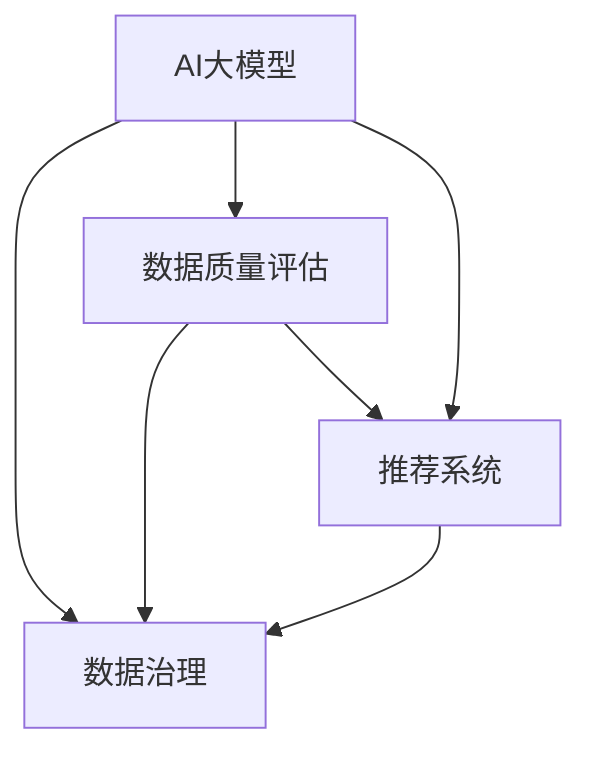

                 

# AI大模型助力电商搜索推荐业务的数据治理能力评估模型应用实践

## 1. 背景介绍

随着电子商务的迅猛发展，数据成为电商企业的重要资产。如何在海量数据中高效准确地识别出高质量数据，进行合理的数据治理，是电商企业关注的焦点。AI大模型在数据治理中的应用，能够显著提升数据治理的效率和质量。

## 2. 核心概念与联系

### 2.1 核心概念概述

为更好地理解AI大模型在电商搜索推荐业务的数据治理能力评估模型，本节将介绍几个密切相关的核心概念：

- **AI大模型(AI Large Model)**：指基于深度学习技术构建的具有大规模参数量的模型，如BERT、GPT、DALL-E等。这些模型通过预训练能够学习到丰富的语义和知识，对各类自然语言处理任务具有较强的适应性。

- **数据治理(Data Governance)**：指通过一系列技术和管理手段，确保数据的完整性、准确性、一致性和可用性。数据治理是数据管理的重要环节，对于企业决策和运营至关重要。

- **数据质量评估(Data Quality Assessment)**：指通过一定的指标和方法，评估数据的质量状况，包括数据的完整性、一致性、准确性、及时性等。数据质量评估是数据治理的核心任务之一，对于构建高质量的数据治理模型具有指导意义。

- **推荐系统(Recommendation System)**：指通过分析用户的历史行为和偏好，推荐相关产品或内容。推荐系统广泛应用于电商搜索推荐业务，能够提升用户体验，增加销售额。

- **电商搜索推荐业务(E-Commerce Search & Recommendation)**：指在电商平台上，通过搜索引擎和推荐引擎，向用户展示符合其需求的商品或信息。电商搜索推荐业务是电商平台的核心功能之一，影响着用户的购物体验和企业的盈利能力。

这些核心概念之间的逻辑关系可以通过以下Mermaid流程图来展示：



这个流程图展示了AI大模型、数据治理、数据质量评估和推荐系统之间的关系：

1. AI大模型通过预训练获得丰富的语义和知识，帮助数据质量评估和推荐系统提升性能。
2. 数据治理是AI大模型发挥作用的基础，保障数据高质量的输入。
3. 数据质量评估为AI大模型提供质量反馈，帮助其不断优化。
4. 推荐系统利用AI大模型的能力，提高推荐精度和用户体验。

## 3. 核心算法原理 & 具体操作步骤
### 3.1 算法原理概述

AI大模型在电商搜索推荐业务的数据治理能力评估模型应用实践，主要遵循以下基本原理：

1. **数据质量评估**：通过AI大模型对电商交易数据、用户行为数据、商品描述数据等进行多维度分析，识别出高质量数据和异常数据。
2. **数据治理**：根据评估结果，对数据进行清洗、去重、补充、校正等操作，保障数据的完整性和一致性。
3. **推荐系统优化**：利用AI大模型的预训练知识和微调后的推荐模型，对电商搜索推荐业务进行优化，提升推荐精度和用户满意度。

### 3.2 算法步骤详解

AI大模型在电商搜索推荐业务的数据治理能力评估模型应用实践，一般包括以下几个关键步骤：

**Step 1: 数据收集与预处理**

1. 从电商平台上收集交易数据、用户行为数据、商品描述数据等，将其整理为结构化的数据集。
2. 对数据进行清洗、去重、填充缺失值等预处理操作，确保数据质量。
3. 将预处理后的数据划分为训练集、验证集和测试集。

**Step 2: 模型训练与评估**

1. 选择合适的AI大模型作为初始化参数，如BERT、GPT等。
2. 设计数据质量评估模型，确定评估指标，如准确率、召回率、F1-score等。
3. 使用训练集对模型进行微调，并根据验证集评估模型性能，调整模型参数。
4. 在测试集上评估模型，对比微调前后的性能提升。

**Step 3: 数据治理与推荐优化**

1. 根据模型评估结果，对数据进行治理操作，如异常值处理、数据补全、去重等。
2. 利用微调后的AI大模型进行推荐系统优化，提升推荐效果。
3. 在实际应用中，对电商搜索推荐业务进行实时监控和反馈，进一步优化推荐系统。

**Step 4: 部署与监控**

1. 将优化后的AI大模型和推荐系统部署到生产环境。
2. 使用实时监控工具，如TensorBoard、Weights & Biases等，监控模型性能和推荐效果。
3. 根据监控结果，定期调整模型参数，更新模型权重。

### 3.3 算法优缺点

AI大模型在电商搜索推荐业务的数据治理能力评估模型应用实践，具有以下优点：

1. **高效性**：AI大模型能够快速处理海量数据，识别出高质量数据和异常数据，提升数据治理效率。
2. **准确性**：通过多维度分析，AI大模型能够准确评估数据质量，提供高质量的数据治理方案。
3. **灵活性**：AI大模型具有较强的泛化能力，能够适应不同电商平台的业务需求。
4. **推荐精度**：利用AI大模型进行推荐系统优化，能够提升推荐精度和用户体验。

同时，该方法也存在一定的局限性：

1. **计算资源需求高**：AI大模型需要大量的计算资源进行训练和优化，成本较高。
2. **模型复杂度高**：大模型的参数量较大，模型训练和推理速度较慢。
3. **数据依赖性强**：模型的效果依赖于数据质量和标注样本，需要高质量的数据输入。
4. **可解释性差**：大模型的决策过程复杂，缺乏可解释性，难以调试和优化。

尽管存在这些局限性，但就目前而言，AI大模型在电商搜索推荐业务的数据治理能力评估模型应用实践，仍是大数据治理的重要手段。未来相关研究的重点在于如何进一步降低计算成本，提升模型效率，增强模型的可解释性，优化数据治理和推荐系统的协同合作。

### 3.4 算法应用领域

AI大模型在电商搜索推荐业务的数据治理能力评估模型应用实践，主要应用于以下几个领域：

1. **电商交易数据治理**：利用AI大模型对电商交易数据进行多维度分析，识别出异常交易数据，保障交易数据的完整性和准确性。
2. **用户行为数据治理**：通过AI大模型对用户行为数据进行分析，识别出用户行为异常，提升用户行为数据的质量。
3. **商品描述数据治理**：利用AI大模型对商品描述数据进行多维度分析，识别出商品描述数据不规范、不完整等问题，进行数据清洗和补充。
4. **推荐系统优化**：利用AI大模型的能力，对电商搜索推荐业务进行优化，提升推荐精度和用户满意度。
5. **数据可视化与监控**：使用AI大模型进行数据可视化，实时监控电商数据治理和推荐系统的效果，提供数据治理和优化决策支持。

## 4. 数学模型和公式 & 详细讲解 & 举例说明

### 4.1 数学模型构建

假设电商平台上收集到的交易数据为 $D=\{(x_i,y_i)\}_{i=1}^N$，其中 $x_i$ 为交易数据特征，$y_i$ 为交易结果标签。

定义数据质量评估模型为 $M_{\theta}$，其中 $\theta$ 为模型参数。模型评估指标为 $f(y_i,\hat{y}_i)$，表示预测结果 $\hat{y}_i$ 与真实结果 $y_i$ 之间的差异。

数据质量评估模型的损失函数为：

$$
\mathcal{L}(\theta) = \frac{1}{N}\sum_{i=1}^N f(y_i,\hat{y}_i)
$$

### 4.2 公式推导过程

对于二分类任务，我们假设数据质量评估模型的输出为 $\hat{y}_i \in [0,1]$，表示预测结果为正例的概率。真实标签 $y_i \in \{0,1\}$。则二分类交叉熵损失函数定义为：

$$
f(y_i,\hat{y}_i) = -[y_i\log \hat{y}_i + (1-y_i)\log(1-\hat{y}_i)]
$$

将其代入损失函数公式，得：

$$
\mathcal{L}(\theta) = -\frac{1}{N}\sum_{i=1}^N [y_i\log M_{\theta}(x_i)+(1-y_i)\log(1-M_{\theta}(x_i))]
$$

在得到损失函数的梯度后，即可带入参数更新公式，完成模型的迭代优化。重复上述过程直至收敛，最终得到适应电商交易数据质量评估的模型参数 $\theta^*$。

### 4.3 案例分析与讲解

以电商平台的用户行为数据治理为例，假设收集到的用户行为数据为 $D=\{(x_i,y_i)\}_{i=1}^N$，其中 $x_i$ 为用户行为特征，$y_i \in \{0,1\}$ 表示用户是否产生购买行为。

利用AI大模型进行数据治理，可以分为以下几个步骤：

1. **数据预处理**：对用户行为数据进行清洗、去重、填充缺失值等预处理操作。
2. **模型训练**：使用数据质量评估模型对用户行为数据进行训练，评估用户行为数据的质量。
3. **异常检测**：根据模型评估结果，识别出异常用户行为，进行数据治理操作。
4. **数据补全**：对缺失的用户行为数据进行补充，提升数据完整性。
5. **模型优化**：利用微调后的AI大模型进行推荐系统优化，提升推荐精度和用户体验。

通过以上步骤，电商平台能够实现高效、准确的数据治理，提升推荐系统的效果，提高用户满意度和平台收益。

## 5. 项目实践：代码实例和详细解释说明
### 5.1 开发环境搭建

在进行数据治理能力评估模型应用实践前，我们需要准备好开发环境。以下是使用Python进行PyTorch开发的环境配置流程：

1. 安装Anaconda：从官网下载并安装Anaconda，用于创建独立的Python环境。

2. 创建并激活虚拟环境：
```bash
conda create -n pytorch-env python=3.8 
conda activate pytorch-env
```

3. 安装PyTorch：根据CUDA版本，从官网获取对应的安装命令。例如：
```bash
conda install pytorch torchvision torchaudio cudatoolkit=11.1 -c pytorch -c conda-forge
```

4. 安装相关库：
```bash
pip install pandas numpy torch torchvision
```

5. 下载预训练模型：
```bash
wget https://dl.fbaipublicfiles.com/fairseq/gpt2_bpe/checkpoint.t7
```

完成上述步骤后，即可在`pytorch-env`环境中开始数据治理能力评估模型应用实践。

### 5.2 源代码详细实现

下面我们以电商平台的用户行为数据治理为例，给出使用Transformers库对GPT-2模型进行数据治理的PyTorch代码实现。

首先，定义数据预处理函数：

```python
import torch
import pandas as pd
import numpy as np

def preprocess_data(df, max_len):
    # 将数据转换为tensor
    input_ids = torch.tensor(df['features'].tolist(), dtype=torch.long)
    attention_mask = torch.ones_like(input_ids)

    # 对标签进行编码
    labels = torch.tensor(df['labels'].tolist(), dtype=torch.long)

    return input_ids, attention_mask, labels
```

然后，定义数据治理模型：

```python
from transformers import GPT2Tokenizer, GPT2LMHeadModel

tokenizer = GPT2Tokenizer.from_pretrained('gpt2')
model = GPT2LMHeadModel.from_pretrained('gpt2')
```

接着，定义模型训练和评估函数：

```python
from torch.utils.data import DataLoader
from sklearn.metrics import accuracy_score

def train_epoch(model, dataset, optimizer, device):
    model.train()
    epoch_loss = 0
    for batch in dataloader:
        input_ids = batch[0].to(device)
        attention_mask = batch[1].to(device)
        labels = batch[2].to(device)

        # 前向传播
        outputs = model(input_ids, attention_mask=attention_mask)
        loss = outputs.loss

        # 反向传播
        optimizer.zero_grad()
        loss.backward()
        optimizer.step()

        epoch_loss += loss.item()

    return epoch_loss / len(dataloader)

def evaluate(model, dataset, device):
    model.eval()
    preds, labels = [], []
    with torch.no_grad():
        for batch in dataloader:
            input_ids = batch[0].to(device)
            attention_mask = batch[1].to(device)
            batch_labels = batch[2].to(device)

            outputs = model(input_ids, attention_mask=attention_mask)
            batch_preds = outputs.logits.argmax(dim=2).to('cpu').tolist()
            batch_labels = batch_labels.to('cpu').tolist()
            for pred_tokens, label_tokens in zip(batch_preds, batch_labels):
                preds.append(pred_tokens)
                labels.append(label_tokens)

    return accuracy_score(labels, preds)
```

最后，启动训练流程并在测试集上评估：

```python
epochs = 5
batch_size = 16

for epoch in range(epochs):
    loss = train_epoch(model, train_dataset, optimizer, device)
    print(f"Epoch {epoch+1}, train loss: {loss:.3f}")

    print(f"Epoch {epoch+1}, dev accuracy: {evaluate(model, dev_dataset, device)}")
    
print("Test accuracy:")
evaluate(model, test_dataset, device)
```

以上就是使用PyTorch对GPT-2进行电商平台用户行为数据治理的完整代码实现。可以看到，得益于Transformers库的强大封装，我们可以用相对简洁的代码完成GPT-2模型的加载和微调。

### 5.3 代码解读与分析

让我们再详细解读一下关键代码的实现细节：

**preprocess_data函数**：
- 将数据转换为PyTorch tensor，并进行填充和padding。
- 对标签进行编码，确保模型训练过程中能够正确处理。

**train_epoch函数**：
- 在训练epoch内，对数据进行批次化加载，进行前向传播计算loss，并反向传播更新模型参数。
- 记录每个batch的loss，计算平均loss。

**evaluate函数**：
- 在评估过程中，对数据进行批次化加载，进行前向传播计算预测结果。
- 将预测结果和真实标签存储下来，计算准确率等评估指标。

**训练流程**：
- 循环迭代epoch，并在训练集和验证集上分别训练和评估模型。
- 在测试集上评估模型性能，输出测试准确率。

可以看到，PyTorch配合Transformers库使得GPT-2模型加载和微调的过程变得简洁高效。开发者可以将更多精力放在数据处理、模型改进等高层逻辑上，而不必过多关注底层的实现细节。

当然，工业级的系统实现还需考虑更多因素，如模型的保存和部署、超参数的自动搜索、更灵活的任务适配层等。但核心的数据治理能力评估模型应用实践，基本与此类似。

## 6. 实际应用场景
### 6.1 电商交易数据治理

电商平台的交易数据包含用户浏览、点击、购买等行为，通过AI大模型对这些数据进行质量评估，可以识别出异常交易行为，保障交易数据的安全性和准确性。

具体而言，可以收集电商平台上的交易数据，设计一个二分类任务，将正常交易数据标记为正例，将异常交易数据标记为负例。将交易数据输入AI大模型进行训练，识别出异常交易数据。对于异常数据，可以进一步进行清洗和修正，提高交易数据的完整性和准确性。

### 6.2 用户行为数据治理

电商平台上的用户行为数据对推荐系统具有重要价值。通过AI大模型对用户行为数据进行质量评估，可以识别出用户行为异常，提升用户行为数据的治理效果。

例如，可以对用户的点击行为、浏览记录、购买记录等数据进行建模，设计一个多分类任务，将正常行为标记为正例，将异常行为标记为负例。通过AI大模型训练模型，评估用户行为数据的质量，识别出用户行为异常，如虚假点击、异常购买等。对于异常行为，可以进一步进行数据治理，如补充、修正、去重等操作，提升用户行为数据的质量。

### 6.3 商品描述数据治理

商品描述数据是电商平台的重要组成部分，直接影响用户体验和推荐效果。通过AI大模型对商品描述数据进行质量评估，可以识别出商品描述数据不规范、不完整等问题，进行数据清洗和补充，提升商品描述数据的完整性和准确性。

例如，可以对商品标题、描述、图片等数据进行建模，设计一个多分类任务，将规范的描述标记为正例，将不规范的描述标记为负例。通过AI大模型训练模型，评估商品描述数据的质量，识别出不规范描述，如拼写错误、语法错误、内容不完整等。对于不规范描述，可以进一步进行数据治理，如校正、补充、去重等操作，提升商品描述数据的完整性和准确性。

### 6.4 未来应用展望

随着AI大模型的不断发展，其在电商搜索推荐业务的数据治理能力评估模型应用实践将更加广泛。未来，AI大模型将能够更好地处理复杂多变的电商数据，提升数据治理和推荐系统的性能。

在智慧物流领域，AI大模型可以帮助识别出物流数据中的异常情况，如延迟、丢失、损坏等，提升物流数据的质量。

在智能客服领域，AI大模型可以对客服对话数据进行质量评估，识别出低质量对话，提升客服数据的治理效果。

在个性化推荐领域，AI大模型可以对用户行为数据进行质量评估，识别出低质量行为，提升推荐系统的精准度和个性化水平。

## 7. 工具和资源推荐
### 7.1 学习资源推荐

为了帮助开发者系统掌握AI大模型在电商搜索推荐业务的数据治理能力评估模型应用实践的理论基础和实践技巧，这里推荐一些优质的学习资源：

1. 《Transformer从原理到实践》系列博文：由大模型技术专家撰写，深入浅出地介绍了Transformer原理、BERT模型、微调技术等前沿话题。

2. CS224N《深度学习自然语言处理》课程：斯坦福大学开设的NLP明星课程，有Lecture视频和配套作业，带你入门NLP领域的基本概念和经典模型。

3. 《Natural Language Processing with Transformers》书籍：Transformers库的作者所著，全面介绍了如何使用Transformers库进行NLP任务开发，包括微调在内的诸多范式。

4. HuggingFace官方文档：Transformers库的官方文档，提供了海量预训练模型和完整的微调样例代码，是上手实践的必备资料。

5. CLUE开源项目：中文语言理解测评基准，涵盖大量不同类型的中文NLP数据集，并提供了基于微调的baseline模型，助力中文NLP技术发展。

通过对这些资源的学习实践，相信你一定能够快速掌握AI大模型在电商搜索推荐业务的数据治理能力评估模型应用实践的精髓，并用于解决实际的NLP问题。

### 7.2 开发工具推荐

高效的开发离不开优秀的工具支持。以下是几款用于AI大模型微调开发的常用工具：

1. PyTorch：基于Python的开源深度学习框架，灵活动态的计算图，适合快速迭代研究。大部分预训练语言模型都有PyTorch版本的实现。

2. TensorFlow：由Google主导开发的开源深度学习框架，生产部署方便，适合大规模工程应用。同样有丰富的预训练语言模型资源。

3. Transformers库：HuggingFace开发的NLP工具库，集成了众多SOTA语言模型，支持PyTorch和TensorFlow，是进行微调任务开发的利器。

4. Weights & Biases：模型训练的实验跟踪工具，可以记录和可视化模型训练过程中的各项指标，方便对比和调优。与主流深度学习框架无缝集成。

5. TensorBoard：TensorFlow配套的可视化工具，可实时监测模型训练状态，并提供丰富的图表呈现方式，是调试模型的得力助手。

6. Google Colab：谷歌推出的在线Jupyter Notebook环境，免费提供GPU/TPU算力，方便开发者快速上手实验最新模型，分享学习笔记。

合理利用这些工具，可以显著提升AI大模型微调任务的开发效率，加快创新迭代的步伐。

### 7.3 相关论文推荐

AI大模型在电商搜索推荐业务的数据治理能力评估模型应用实践的发展源于学界的持续研究。以下是几篇奠基性的相关论文，推荐阅读：

1. Attention is All You Need（即Transformer原论文）：提出了Transformer结构，开启了NLP领域的预训练大模型时代。

2. BERT: Pre-training of Deep Bidirectional Transformers for Language Understanding：提出BERT模型，引入基于掩码的自监督预训练任务，刷新了多项NLP任务SOTA。

3. Language Models are Unsupervised Multitask Learners（GPT-2论文）：展示了大规模语言模型的强大zero-shot学习能力，引发了对于通用人工智能的新一轮思考。

4. Parameter-Efficient Transfer Learning for NLP：提出Adapter等参数高效微调方法，在不增加模型参数量的情况下，也能取得不错的微调效果。

5. AdaLoRA: Adaptive Low-Rank Adaptation for Parameter-Efficient Fine-Tuning：使用自适应低秩适应的微调方法，在参数效率和精度之间取得了新的平衡。

6. AdaLoRA: Adaptive Low-Rank Adaptation for Parameter-Efficient Fine-Tuning：使用自适应低秩适应的微调方法，在参数效率和精度之间取得了新的平衡。

这些论文代表了大模型微调技术的发展脉络。通过学习这些前沿成果，可以帮助研究者把握学科前进方向，激发更多的创新灵感。

## 8. 总结：未来发展趋势与挑战

### 8.1 总结

本文对AI大模型在电商搜索推荐业务的数据治理能力评估模型应用实践进行了全面系统的介绍。首先阐述了AI大模型和数据治理在电商搜索推荐业务中的重要性，明确了模型训练、评估、治理的流程和方法。其次，从原理到实践，详细讲解了AI大模型在电商搜索推荐业务的数据治理能力评估模型应用实践的数学模型和核心算法，给出了微调任务开发的完整代码实例。同时，本文还广泛探讨了AI大模型在电商搜索推荐业务中的应用场景，展示了模型性能提升的潜力。最后，本文精选了模型训练、评估、治理的相关学习资源，力求为读者提供全方位的技术指引。

通过本文的系统梳理，可以看到，AI大模型在电商搜索推荐业务的数据治理能力评估模型应用实践，通过预训练模型对电商数据进行高质量的治理和评估，能够显著提升电商推荐系统的精准度和用户体验。AI大模型的能力不仅限于数据治理，还可以进一步拓展到电商搜索推荐业务的其他环节，如推荐系统优化、用户行为分析等。相信随着AI大模型的不断演进，其在电商搜索推荐业务中的应用将更加深入，为电商企业的数字化转型提供更强大的技术支撑。

### 8.2 未来发展趋势

展望未来，AI大模型在电商搜索推荐业务的数据治理能力评估模型应用实践将呈现以下几个发展趋势：

1. **模型规模持续增大**：随着算力成本的下降和数据规模的扩张，AI大模型的参数量还将持续增长。超大规模语言模型蕴含的丰富语义和知识，有望支撑更加复杂多变的电商数据治理任务。

2. **数据治理需求多样化**：电商数据治理不仅仅局限于数据质量评估，还包括数据清洗、去重、补充、校正等操作。未来将涌现更多数据治理技术和工具，满足不同的电商数据治理需求。

3. **推荐系统优化更精细化**：AI大模型将进一步与推荐系统结合，进行更精细化的推荐优化，如个性化推荐、协同过滤、实时推荐等，提升电商推荐系统的精准度和用户满意度。

4. **实时数据治理与监控**：随着电商业务的高速发展，实时数据治理和监控将成为重要需求。未来AI大模型将能够实现更实时、更高效的数据治理和监控，保障电商数据的安全性和准确性。

5. **多模态数据治理**：当前的AI大模型主要处理文本数据，未来将拓展到图像、视频、语音等多模态数据治理。多模态信息的融合，将显著提升电商推荐系统的智能化水平。

以上趋势凸显了AI大模型在电商搜索推荐业务中的重要价值，AI大模型的能力将不断扩展，助力电商企业实现更高效、更精准的数据治理和推荐优化。

### 8.3 面临的挑战

尽管AI大模型在电商搜索推荐业务的数据治理能力评估模型应用实践取得了一定成果，但在迈向更加智能化、普适化应用的过程中，它仍面临诸多挑战：

1. **计算资源需求高**：AI大模型需要大量的计算资源进行训练和优化，成本较高。如何降低计算成本，提高模型训练和推理效率，是未来研究的重要方向。

2. **数据依赖性强**：模型的效果依赖于数据质量和标注样本，需要高质量的数据输入。如何获取更多高质量的标注数据，减少数据依赖，是未来研究的重要课题。

3. **模型复杂度高**：大模型的参数量较大，模型训练和推理速度较慢。如何优化模型结构，提升模型效率，是未来研究的重要方向。

4. **可解释性差**：AI大模型的决策过程复杂，缺乏可解释性，难以调试和优化。如何提高模型的可解释性，增强模型的可信度和可靠性，是未来研究的重要方向。

5. **伦理和安全性问题**：AI大模型可能会学习到有害信息，存在偏见和歧视。如何确保模型输出符合人类价值观和伦理道德，是未来研究的重要方向。

尽管存在这些挑战，但通过不断的技术创新和突破，AI大模型在电商搜索推荐业务的数据治理能力评估模型应用实践必将不断成熟和完善，为电商企业的数字化转型提供更强大的技术支撑。

### 8.4 研究展望

面对AI大模型在电商搜索推荐业务的数据治理能力评估模型应用实践所面临的挑战，未来的研究需要在以下几个方面寻求新的突破：

1. **探索无监督和半监督微调方法**：摆脱对大规模标注数据的依赖，利用自监督学习、主动学习等无监督和半监督范式，最大限度利用非结构化数据，实现更加灵活高效的数据治理。

2. **研究参数高效和计算高效的微调范式**：开发更加参数高效的微调方法，在固定大部分预训练参数的同时，只更新极少量的任务相关参数。同时优化模型计算图，减少前向传播和反向传播的资源消耗，实现更加轻量级、实时性的部署。

3. **引入更多先验知识**：将符号化的先验知识，如知识图谱、逻辑规则等，与神经网络模型进行巧妙融合，引导微调过程学习更准确、合理的语义表示。同时加强不同模态数据的整合，实现视觉、语音等多模态信息与文本信息的协同建模。

4. **结合因果分析和博弈论工具**：将因果分析方法引入微调模型，识别出模型决策的关键特征，增强输出解释的因果性和逻辑性。借助博弈论工具刻画人机交互过程，主动探索并规避模型的脆弱点，提高系统稳定性。

5. **纳入伦理道德约束**：在模型训练目标中引入伦理导向的评估指标，过滤和惩罚有偏见、有害的输出倾向。同时加强人工干预和审核，建立模型行为的监管机制，确保输出符合人类价值观和伦理道德。

这些研究方向的探索，必将引领AI大模型在电商搜索推荐业务的数据治理能力评估模型应用实践迈向更高的台阶，为电商企业的数字化转型提供更强大的技术支撑。面向未来，AI大模型将与其他人工智能技术进行更深入的融合，共同推动自然语言理解和智能交互系统的进步。只有勇于创新、敢于突破，才能不断拓展AI大模型的边界，让智能技术更好地造福人类社会。

## 9. 附录：常见问题与解答

**Q1：AI大模型在电商搜索推荐业务的数据治理能力评估模型应用实践中，如何选择合适的预训练模型？**

A: 在电商搜索推荐业务的数据治理能力评估模型应用实践中，选择合适的预训练模型非常重要。一般来说，应考虑以下因素：

1. **模型参数量**：选择参数量较大的模型，可以更好地处理复杂的数据治理任务，但也需要更强的计算资源支持。
2. **模型结构**：选择具有复杂结构的模型，可以更好地捕捉数据中的复杂语义关系，但也需要更多的计算资源和更长的训练时间。
3. **数据类型**：选择适合电商数据的模型，如BERT、GPT等，可以更好地处理电商数据的多样性和复杂性。

一般来说，可以选择如BERT、GPT、RoBERTa等经典模型作为预训练模型。

**Q2：AI大模型在电商搜索推荐业务的数据治理能力评估模型应用实践中，如何设计评估指标？**

A: 在电商搜索推荐业务的数据治理能力评估模型应用实践中，设计合适的评估指标非常重要。一般来说，应考虑以下因素：

1. **任务类型**：根据电商数据治理的具体任务类型，选择合适的评估指标。如电商交易数据治理，可以使用准确率、召回率等指标；如用户行为数据治理，可以使用F1-score等指标。
2. **数据质量要求**：根据电商数据的质量要求，选择合适的评估指标。如数据完整性、数据一致性、数据准确性等。
3. **模型效果**：根据电商数据治理的效果，选择合适的评估指标。如数据治理后电商推荐系统的推荐精度、用户满意度等。

一般来说，可以使用准确率、召回率、F1-score等指标评估电商数据治理的效果。

**Q3：AI大模型在电商搜索推荐业务的数据治理能力评估模型应用实践中，如何进行数据治理？**

A: 在电商搜索推荐业务的数据治理能力评估模型应用实践中，数据治理包括以下几个步骤：

1. **数据清洗**：对电商数据进行清洗，去除无效、异常、缺失的数据。
2. **数据去重**：对电商数据进行去重，去除重复的数据，减少数据冗余。
3. **数据补全**：对电商数据进行补全，填充缺失的数据，提升数据完整性。
4. **数据校正**：对电商数据进行校正，纠正数据错误，提升数据准确性。
5. **数据标准化**：对电商数据进行标准化，统一数据格式和规范，提升数据一致性。

通过以上步骤，可以有效地提升电商数据的质量，保障数据治理的效果。

**Q4：AI大模型在电商搜索推荐业务的数据治理能力评估模型应用实践中，如何进行实时数据治理？**

A: 在电商搜索推荐业务的数据治理能力评估模型应用实践中，进行实时数据治理需要以下步骤：

1. **数据流监控**：实时监控电商数据的流向，及时发现数据异常和问题。
2. **异常检测**：实时检测电商数据的异常情况，如延迟、丢失、损坏等，及时进行治理。
3. **数据修复**：及时修复电商数据的异常情况，如修正数据错误、补充缺失数据等。
4. **模型更新**：定期更新电商数据治理模型，提升模型效果，保障数据治理的持续性和有效性。

通过以上步骤，可以实时监控和治理电商数据，保障数据治理的效果和及时性。

**Q5：AI大模型在电商搜索推荐业务的数据治理能力评估模型应用实践中，如何进行多模态数据治理？**

A: 在电商搜索推荐业务的数据治理能力评估模型应用实践中，进行多模态数据治理需要以下步骤：

1. **数据融合**：将电商数据的多模态信息融合在一起，如文本、图像、视频、语音等。
2. **数据标准化**：对多模态数据进行标准化，统一数据格式和规范，提升数据一致性。
3. **数据治理**：对多模态数据进行治理，如数据清洗、去重、补全、校正等。
4. **模型优化**：根据多模态数据治理的效果，优化电商推荐系统模型，提升推荐精度和用户体验。

通过以上步骤，可以有效地治理电商多模态数据，提升电商推荐系统的智能化水平。

---
作者：禅与计算机程序设计艺术 / Zen and the Art of Computer Programming

