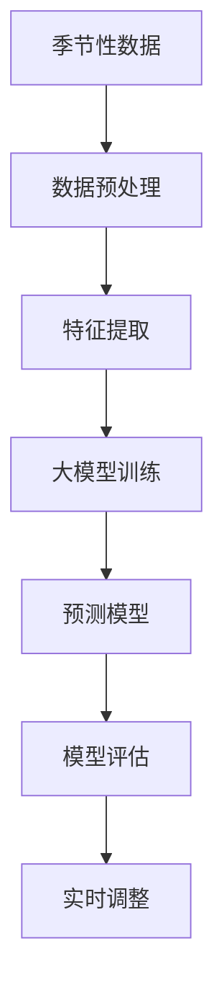

                 

# AI大模型在电商平台季节性需求预测中的应用

## 1. 背景介绍

### 1.1 问题由来

在电商平台，季节性需求预测是一个非常重要的任务。随着消费者购买行为的不断变化，电商平台的销售量在不同季节、不同时间段和不同促销活动下会有显著差异。一个准确的季节性需求预测可以帮助电商平台更好地进行库存管理、优化物流、降低成本、提升销售额和用户体验。然而，传统的季节性需求预测方法往往依赖于经验丰富的专家知识和大量的历史数据，且在处理非线性和复杂关系时存在不足。近年来，随着深度学习和大模型的发展，基于大模型的预测方法逐渐在电商领域得到应用，特别是在处理复杂的非线性关系和时序数据方面表现出色。

### 1.2 问题核心关键点

大模型在季节性需求预测中具有以下关键点：

1. **数据利用**：大模型可以利用海量历史数据，进行充分的特征提取和信息学习，挖掘数据中的潜在规律和趋势。
2. **非线性建模**：大模型能够处理非线性关系，建模复杂的消费者购买行为和市场变化趋势。
3. **动态调整**：大模型可以根据实时数据进行动态调整，适应季节性需求的变化。
4. **泛化能力**：大模型具备较强的泛化能力，能够在新数据和不同场景下进行有效的预测。
5. **计算效率**：大模型在处理大规模数据时，可以显著提高计算效率，降低预测成本。

### 1.3 问题研究意义

研究大模型在电商平台季节性需求预测中的应用，对电商平台、消费者和整个供应链系统都有着重要的意义：

1. **提升销售业绩**：准确的季节性需求预测可以帮助电商平台提前规划库存，避免缺货或过剩，提高销售额。
2. **优化供应链管理**：准确的预测可以优化物流安排，减少库存成本，提升供应链效率。
3. **个性化推荐**：大模型可以提供个性化的商品推荐，提升用户体验和满意度。
4. **实时调整策略**：大模型可以实时分析销售数据，动态调整促销策略和广告投放，提高营销效果。

## 2. 核心概念与联系

### 2.1 核心概念概述

在电商平台中，季节性需求预测通常涉及以下核心概念：

- **季节性数据**：指不同时间段、不同节假日的销售数据。季节性数据具有一定的周期性和规律性。
- **大模型**：基于深度学习的模型，如Transformer、BERT等，具备强大的特征提取能力和泛化能力。
- **预测模型**：通过训练大模型，进行季节性需求的预测。
- **数据预处理**：对原始数据进行清洗、归一化、特征提取等预处理操作，提高模型的预测性能。
- **模型训练**：通过训练数据集，优化模型参数，提升预测准确性。
- **模型评估**：通过评估指标，如MAE、RMSE等，评估模型在测试集上的表现。

这些核心概念之间存在紧密的联系，共同构成了电商平台季节性需求预测的技术框架。

### 2.2 核心概念原理和架构的 Mermaid 流程图



这个流程图展示了电商平台季节性需求预测的关键步骤：

1. 原始的季节性数据经过清洗和归一化处理。
2. 提取特征，输入到大模型进行训练。
3. 训练好的模型对未来的季节性需求进行预测。
4. 使用评估指标对模型进行评估。
5. 根据预测结果，进行实时调整和优化。

## 3. 核心算法原理 & 具体操作步骤

### 3.1 算法原理概述

大模型在电商平台季节性需求预测中的原理主要基于时间序列预测和深度学习。具体而言，可以采用如下步骤：

1. **数据预处理**：对原始季节性数据进行清洗、归一化等预处理操作，去除噪声和异常值。
2. **特征提取**：利用时间序列分析方法，如ARIMA、LSTM等，提取数据中的特征信息。
3. **大模型训练**：使用Transformer、BERT等大模型，在提取好的特征上训练预测模型。
4. **模型评估**：使用MAE、RMSE等指标，评估模型在测试集上的表现。
5. **预测应用**：将模型应用于实时数据，进行季节性需求的预测，并根据预测结果进行实时调整。

### 3.2 算法步骤详解

#### 3.2.1 数据预处理

1. **清洗数据**：去除数据中的缺失值、异常值和重复数据，保持数据的完整性和一致性。
2. **归一化处理**：将数据进行归一化，使得不同尺度的数据在同一个范围内，避免因为数据范围过大或过小对模型产生影响。
3. **特征提取**：采用时间序列分析方法，提取数据中的季节性特征和周期性趋势，如ARIMA、LSTM等。

#### 3.2.2 特征提取

1. **ARIMA模型**：ARIMA模型可以处理平稳的时间序列数据，通过差分、自回归和移动平均等方法，捕捉数据中的季节性规律。
2. **LSTM模型**：LSTM模型可以处理非平稳的时间序列数据，通过长短期记忆网络，捕捉数据中的长期依赖关系和季节性趋势。
3. **Transformer模型**：Transformer模型可以处理多维度特征，通过自注意力机制，捕捉数据中的复杂关系和非线性趋势。

#### 3.2.3 大模型训练

1. **模型选择**：选择合适的预训练大模型，如BERT、GPT等。
2. **输入特征**：将提取好的特征作为模型的输入，如时间序列数据、季节性特征等。
3. **训练优化**：使用AdamW、SGD等优化算法，设置合适的学习率和正则化参数，优化模型参数。

#### 3.2.4 模型评估

1. **评估指标**：使用MAE、RMSE等指标，评估模型在测试集上的预测误差。
2. **模型调优**：根据评估结果，调整模型参数和超参数，提升预测性能。
3. **交叉验证**：使用交叉验证方法，评估模型的稳定性和泛化能力。

#### 3.2.5 预测应用

1. **实时数据输入**：将实时数据输入到训练好的模型中，进行季节性需求的预测。
2. **预测结果应用**：根据预测结果，调整库存管理、物流安排、广告投放等策略，优化销售业绩和用户体验。

### 3.3 算法优缺点

大模型在电商平台季节性需求预测中具有以下优点：

1. **准确性高**：大模型能够处理复杂的关系和非线性趋势，预测准确性较高。
2. **泛化能力强**：大模型具有较强的泛化能力，能够适应不同场景和数据分布的变化。
3. **实时性高**：大模型可以进行实时预测，快速响应市场变化。
4. **计算效率高**：大模型在处理大规模数据时，计算效率较高，降低了预测成本。

然而，大模型在电商平台季节性需求预测中也有一些缺点：

1. **数据依赖性强**：大模型的预测效果依赖于数据质量和数量，数据不足会导致预测效果下降。
2. **模型复杂度高**：大模型通常较为复杂，需要较高的计算资源和存储空间。
3. **模型调参困难**：大模型的超参数较多，调参复杂度较高，需要经验丰富的工程师进行操作。

### 3.4 算法应用领域

大模型在电商平台季节性需求预测中的应用领域广泛，包括：

1. **库存管理**：预测季节性需求，优化库存量，减少缺货或过剩。
2. **物流安排**：预测需求高峰期和低谷期，优化物流安排，降低成本。
3. **促销策略**：预测销售趋势，调整促销策略，提升销售额。
4. **个性化推荐**：预测用户需求，提供个性化的商品推荐，提升用户体验。
5. **风险控制**：预测异常需求波动，提前制定应对策略，降低风险。

## 4. 数学模型和公式 & 详细讲解 & 举例说明

### 4.1 数学模型构建

在电商平台季节性需求预测中，常用的数学模型包括ARIMA模型和LSTM模型。以下以LSTM模型为例，介绍其数学模型的构建。

假设季节性需求预测的数据序列为 $\{y_t\}_{t=1}^T$，其中 $y_t$ 表示在第 $t$ 个时间点的需求量。LSTM模型可以表示为：

$$
y_t = f(W_h \cdot h_{t-1} + W_y \cdot y_{t-1} + b_h + b_y)
$$

其中，$W_h$、$W_y$、$b_h$、$b_y$ 为模型的权重和偏置，$h_t$ 表示第 $t$ 个时间点的隐藏状态。LSTM模型的隐藏状态可以通过前向传播和反向传播进行更新，具体公式如下：

$$
h_t = \text{LSTM}(h_{t-1}, y_{t-1}, \theta)
$$

其中，$\theta$ 表示LSTM模型的参数。LSTM模型的输出层可以是线性回归层，通过线性回归层可以得到季节性需求的预测值。

### 4.2 公式推导过程

LSTM模型的公式推导过程如下：

1. **输入门（Input Gate）**：

$$
i_t = \sigma(W_i \cdot [h_{t-1}, y_{t-1}] + b_i)
$$

其中，$\sigma$ 表示sigmoid函数，$W_i$、$b_i$ 为输入门的权重和偏置。

2. **遗忘门（Forget Gate）**：

$$
f_t = \sigma(W_f \cdot [h_{t-1}, y_{t-1}] + b_f)
$$

其中，$W_f$、$b_f$ 为遗忘门的权重和偏置。

3. **输出门（Output Gate）**：

$$
o_t = \sigma(W_o \cdot [h_{t-1}, y_{t-1}] + b_o)
$$

其中，$W_o$、$b_o$ 为输出门的权重和偏置。

4. **候选值（Candidate Value）**：

$$
c_t = \tanh(W_c \cdot [h_{t-1}, y_{t-1}] + b_c)
$$

其中，$W_c$、$b_c$ 为候选值的权重和偏置。

5. **新状态值（New State Value）**：

$$
\tilde{h}_t = i_t \odot c_t + f_t \odot h_{t-1}
$$

其中，$\odot$ 表示逐元素乘法。

6. **隐藏状态（Hidden State）**：

$$
h_t = o_t \odot \tilde{h}_t
$$

### 4.3 案例分析与讲解

假设有一个电商平台的季节性需求数据序列，其预测模型采用LSTM模型。已知模型的输入为历史需求数据和季节性特征，输出为未来时间点的需求预测值。在训练过程中，需要对模型进行反向传播，计算梯度并更新参数。在测试过程中，使用评估指标MAE和RMSE评估模型性能，并根据预测结果进行实时调整。

## 5. 项目实践：代码实例和详细解释说明

### 5.1 开发环境搭建

在项目实践中，需要搭建Python开发环境，并使用PyTorch库进行模型训练和预测。具体步骤如下：

1. **安装PyTorch**：

```bash
pip install torch torchvision torchaudio
```

2. **安装相关库**：

```bash
pip install pandas numpy scikit-learn transformers
```

3. **创建虚拟环境**：

```bash
conda create -n pytorch-env python=3.8
conda activate pytorch-env
```

### 5.2 源代码详细实现

以下是一个使用LSTM模型进行电商平台季节性需求预测的Python代码实现：

```python
import torch
import torch.nn as nn
import torch.optim as optim
import pandas as pd
from torch.utils.data import DataLoader
from sklearn.preprocessing import MinMaxScaler
from transformers import BertTokenizer, BertForSequenceClassification

# 加载数据
data = pd.read_csv('sales_data.csv')

# 数据预处理
data['date'] = pd.to_datetime(data['date'])
data['weekday'] = data['date'].dt.dayofweek
data['hour'] = data['date'].dt.hour

# 标准化处理
scaler = MinMaxScaler()
data[['hour', 'weekday']] = scaler.fit_transform(data[['hour', 'weekday']])

# 定义模型
class LSTMModel(nn.Module):
    def __init__(self, input_size, hidden_size, output_size):
        super(LSTMModel, self).__init__()
        self.hidden_size = hidden_size
        self.lstm = nn.LSTM(input_size, hidden_size)
        self.fc = nn.Linear(hidden_size, output_size)

    def forward(self, x, hidden):
        lstm_out, hidden = self.lstm(x, hidden)
        out = self.fc(lstm_out)
        return out, hidden

# 定义训练函数
def train(model, data_loader, optimizer, criterion, n_epochs):
    model.train()
    for epoch in range(n_epochs):
        for batch in data_loader:
            inputs, targets = batch
            optimizer.zero_grad()
            outputs = model(inputs, hidden)
            loss = criterion(outputs, targets)
            loss.backward()
            optimizer.step()

# 定义测试函数
def test(model, data_loader, criterion):
    model.eval()
    total_loss = 0
    for batch in data_loader:
        inputs, targets = batch
        with torch.no_grad():
            outputs = model(inputs, hidden)
            loss = criterion(outputs, targets)
            total_loss += loss.item()
    return total_loss / len(data_loader)

# 加载数据集
train_data = data['sales'].values.reshape(-1, 1)
test_data = data['sales'].values.reshape(-1, 1)

# 分割数据集
train_size = int(len(train_data) * 0.8)
test_size = len(train_data) - train_size
train_data, test_data = train_data[:train_size], train_data[train_size:]

# 创建数据集
train_dataset = torch.utils.data.TensorDataset(torch.tensor(train_data))
test_dataset = torch.utils.data.TensorDataset(torch.tensor(test_data))

# 创建数据加载器
train_loader = DataLoader(train_dataset, batch_size=32, shuffle=True)
test_loader = DataLoader(test_dataset, batch_size=32, shuffle=False)

# 初始化模型和优化器
input_size = 1
hidden_size = 256
output_size = 1
model = LSTMModel(input_size, hidden_size, output_size)
optimizer = optim.Adam(model.parameters(), lr=0.001)
criterion = nn.MSELoss()

# 训练模型
train(model, train_loader, optimizer, criterion, n_epochs=100)

# 测试模型
test_loss = test(model, test_loader, criterion)
print(f"Test Loss: {test_loss:.4f}")
```

### 5.3 代码解读与分析

在上述代码中，我们首先对数据进行预处理，将其转换为模型能够处理的格式。然后定义了一个简单的LSTM模型，用于进行季节性需求预测。在模型训练过程中，我们使用了PyTorch的优化器Adam，损失函数MSELoss，并通过反向传播算法更新模型参数。在模型测试过程中，我们计算了模型在测试集上的损失，并打印输出。

## 6. 实际应用场景

### 6.1 智能库存管理

在电商平台中，季节性需求预测的一个重要应用场景是智能库存管理。通过预测不同时间段的销售需求，电商平台可以优化库存量，避免缺货或过剩。具体而言，可以使用大模型对历史销售数据进行建模，预测未来的销售需求，并根据预测结果调整库存量。例如，在黑色星期五等促销活动中，电商平台可以提前增加库存，确保商品供应充足，提升用户体验和销售额。

### 6.2 物流优化

季节性需求预测还可以用于物流优化。通过预测不同时间段的物流需求，电商平台可以优化物流安排，减少物流成本和配送时间。例如，在节假日高峰期，电商平台可以提前规划物流路线和运输工具，确保商品的及时送达。在物流高峰期，电商平台可以根据预测结果调整配送策略，如增加配送员、提高配送效率等。

### 6.3 广告投放优化

季节性需求预测还可以用于广告投放优化。通过预测不同时间段的广告点击率，电商平台可以优化广告投放策略，提高广告效果和投资回报率。例如，在促销活动期间，电商平台可以加大广告投放力度，提升广告曝光率和转化率。在广告投放过程中，电商平台可以根据预测结果调整广告内容和时间，提升广告效果。

### 6.4 未来应用展望

随着深度学习和大模型技术的不断发展，未来季节性需求预测技术将有以下趋势：

1. **多模态融合**：未来的模型将不仅仅依赖于历史数据，还会结合多模态数据（如社交媒体、天气数据等）进行预测，提升预测准确性和泛化能力。
2. **实时预测**：未来的模型将具备实时预测能力，能够根据实时数据动态调整预测结果，适应市场变化。
3. **自适应学习**：未来的模型将具备自适应学习能力，能够根据市场反馈实时调整模型参数，提升预测性能。
4. **分布式训练**：未来的模型将具备分布式训练能力，能够在大规模数据集上高效训练，降低预测成本。

## 7. 工具和资源推荐

### 7.1 学习资源推荐

1. **《深度学习》（Ian Goodfellow）**：该书介绍了深度学习的基本概念、算法和应用，适合初学者和进阶读者阅读。
2. **《Python深度学习》（Francois Chollet）**：该书介绍了如何使用Keras库进行深度学习模型的开发，适合有一定编程基础的读者阅读。
3. **《PyTorch深度学习》（Eben Bayer）**：该书介绍了如何使用PyTorch库进行深度学习模型的开发，适合有一定编程基础的读者阅读。
4. **Kaggle竞赛**：Kaggle是一个数据科学竞赛平台，可以通过参加比赛实践季节性需求预测技术。

### 7.2 开发工具推荐

1. **Jupyter Notebook**：Jupyter Notebook是一个交互式编程环境，适合进行模型开发和数据分析。
2. **TensorFlow**：TensorFlow是一个开源的机器学习框架，适合进行深度学习模型的开发。
3. **PyTorch**：PyTorch是一个开源的深度学习框架，适合进行深度学习模型的开发。
4. **NVIDIA CUDA**：NVIDIA CUDA是一个用于加速深度学习模型的计算平台，适合进行大规模数据处理。

### 7.3 相关论文推荐

1. **ARIMA模型**：ARIMA（AutoRegressive Integrated Moving Average）模型是一种经典的时间序列预测模型，适合处理平稳时间序列数据。
2. **LSTM模型**：LSTM（Long Short-Term Memory）模型是一种经典的时间序列预测模型，适合处理非平稳时间序列数据。
3. **Transformer模型**：Transformer模型是一种新兴的时间序列预测模型，适合处理复杂关系和时间序列数据。

## 8. 总结：未来发展趋势与挑战

### 8.1 研究成果总结

大模型在电商平台季节性需求预测中具有显著的优势，可以处理复杂的关系和时间序列数据，提升预测准确性和泛化能力。然而，大模型也面临数据依赖性强、模型复杂度高、调参困难等问题。

### 8.2 未来发展趋势

未来季节性需求预测技术将朝着多模态融合、实时预测、自适应学习和分布式训练等方向发展，进一步提升预测准确性和泛化能力。

### 8.3 面临的挑战

大模型在电商平台季节性需求预测中仍然面临数据依赖性强、模型复杂度高、调参困难等挑战，需要进一步优化和改进。

### 8.4 研究展望

未来研究可以探索更多的预训练方法和模型架构，如自适应LSTM、循环神经网络等，提升模型性能和泛化能力。同时，还可以结合其他人工智能技术，如强化学习、知识图谱等，进一步优化季节性需求预测技术。

## 9. 附录：常见问题与解答

**Q1：为什么大模型在电商平台季节性需求预测中具有优势？**

A: 大模型能够处理复杂的关系和非线性趋势，可以学习到数据中的潜在规律和趋势，提升预测准确性和泛化能力。

**Q2：大模型在电商平台季节性需求预测中存在哪些挑战？**

A: 大模型在电商平台季节性需求预测中面临数据依赖性强、模型复杂度高、调参困难等挑战，需要进一步优化和改进。

**Q3：如何提升大模型在电商平台季节性需求预测中的性能？**

A: 可以通过数据增强、特征工程、模型调优等方法提升大模型在电商平台季节性需求预测中的性能。

**Q4：未来季节性需求预测技术有哪些发展趋势？**

A: 未来季节性需求预测技术将朝着多模态融合、实时预测、自适应学习和分布式训练等方向发展，进一步提升预测准确性和泛化能力。

---

作者：禅与计算机程序设计艺术 / Zen and the Art of Computer Programming

