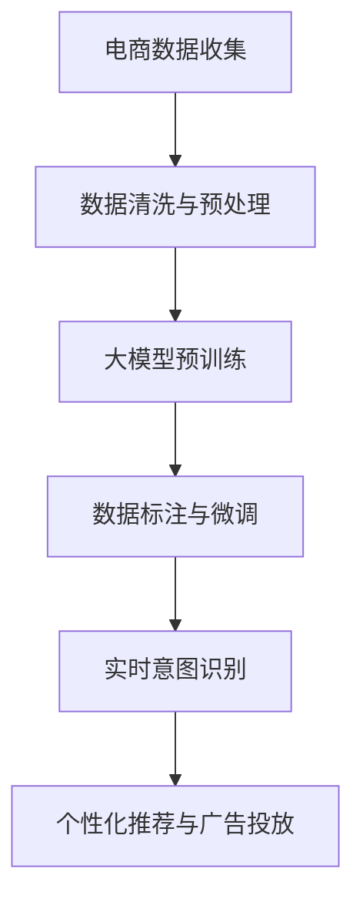

                 

# AI大模型在电商平台用户意图实时追踪中的应用

## 1. 背景介绍

随着电商平台的日益普及和竞争加剧，用户行为分析和意图追踪成为了电商业务中越来越重要的环节。通过实时追踪用户意图，电商平台可以更好地理解用户需求，优化商品推荐、个性化广告投放，提升用户体验，进而提高转化率和营收。但传统的用户意图追踪方法依赖于规则、标签等人工设计，难以覆盖复杂多变的用户行为模式。近年来，基于大模型的AI技术在自然语言处理(NLP)和计算机视觉领域取得了突破性进展，广泛应用于图像识别、文本分析等任务，为电商平台的意图追踪提供了新的可能性。

本文将聚焦于使用AI大模型在电商平台用户意图实时追踪中的应用，首先介绍大模型在NLP领域的研究背景和最新进展，然后详细阐述基于大模型的用户意图追踪算法原理及操作步骤，并结合具体案例，展示如何在电商场景中实现实时追踪和精准推荐。最后，本文还将讨论大模型在电商领域的应用前景及面临的挑战，为电商平台提供可行的解决方案和未来发展方向。

## 2. 核心概念与联系

### 2.1 核心概念概述

为深入理解大模型在电商领域的应用，首先需要明确一些核心概念：

- **大模型（Large Model）**：指具有庞大参数量，广泛应用于自然语言处理、图像识别等任务的深度学习模型，如GPT、BERT、ResNet等。大模型通过在大规模数据上预训练，学习到丰富的语义和图像知识，具备强大的表达能力和泛化能力。

- **用户意图追踪（User Intent Tracking）**：指通过用户行为数据，实时分析和预测用户当前意图，从而提供更精准的个性化推荐和广告投放。常见的用户意图包括搜索意图、购买意图、浏览意图等。

- **自然语言处理（Natural Language Processing, NLP）**：涉及文本数据的处理和分析，旨在让机器理解、处理和生成自然语言。NLP技术广泛应用于文本分类、情感分析、意图识别等任务。

- **计算机视觉（Computer Vision）**：涉及图像数据的处理和分析，旨在让机器识别、理解和生成图像。CV技术广泛应用于图像识别、图像生成等任务。

- **迁移学习（Transfer Learning）**：指在预训练模型的基础上，使用下游任务的少量标注数据进行微调，以提高模型在特定任务上的性能。大模型的预训练-微调过程即是一种典型的迁移学习方式。

- **连续体学习（Continual Learning）**：指模型能够持续从新数据中学习，同时保持已学习的知识，避免出现灾难性遗忘。这对于保持模型的时效性和适应性至关重要。

- **多模态学习（Multimodal Learning）**：指同时利用文本、图像、声音等多种模态信息进行学习。多模态学习可以提高模型的综合能力，更好地理解用户意图。

### 2.2 核心概念原理和架构的 Mermaid 流程图

以下是一个简化的Mermaid流程图，展示了基于大模型的用户意图追踪算法的基本流程：



这个流程图展示了从电商数据收集到实时意图追踪的全流程，其中大模型扮演了核心的特征提取器角色，通过预训练和微调，学习到丰富的用户行为知识，从而实现精准的用户意图追踪和个性化推荐。

## 3. 核心算法原理 & 具体操作步骤

### 3.1 算法原理概述

基于大模型的用户意图追踪算法主要利用NLP和CV技术的结合，通过多模态学习，实时分析和预测用户意图。具体来说，算法流程包括数据收集与预处理、大模型预训练与微调、实时意图识别与个性化推荐等步骤。

**数据收集与预处理**：
- 电商平台通过API接口和日志分析等方式，收集用户的搜索行为、浏览历史、购买记录等数据。
- 对收集到的数据进行清洗、去重、标准化处理，生成用于大模型训练的输入数据。

**大模型预训练与微调**：
- 在电商领域语料库上预训练一个大规模语言模型，如BERT、GPT等。
- 使用标注好的电商用户数据对预训练模型进行微调，以适应电商平台的特定需求。

**实时意图识别**：
- 将用户在电商平台上的行为数据（如搜索关键词、浏览页面、点击记录等）输入到微调后的模型中，实时分析用户意图。
- 通过模型预测得到用户当前意图，如购买、搜索、浏览等。

**个性化推荐与广告投放**：
- 根据用户的意图和历史行为数据，实时生成个性化的商品推荐和广告内容。
- 将推荐结果和广告投放策略结合，实现精准营销，提升用户体验和转化率。

### 3.2 算法步骤详解

以下是基于大模型的用户意图追踪算法的详细步骤：

**Step 1: 电商数据收集与预处理**

1. **数据收集**：
   - 通过API接口、Web爬虫等方式，收集用户在电商平台的搜索行为、浏览历史、点击记录等数据。
   - 将收集到的数据存储在分布式数据库中，确保数据的完整性和一致性。

2. **数据清洗与标准化**：
   - 对收集到的数据进行去重、去噪、缺失值填充等处理，确保数据的质量。
   - 对文本数据进行标准化处理，如统一编码、去除特殊字符等。

3. **数据标注**：
   - 对部分数据进行人工标注，生成标注好的电商用户行为数据。
   - 使用标注好的数据进行模型训练和验证。

**Step 2: 大模型预训练与微调**

1. **大模型选择**：
   - 选择合适的预训练大模型，如BERT、GPT等。
   - 确定模型结构、参数量和预训练任务，如自回归语言模型、掩码语言模型等。

2. **预训练**：
   - 在电商领域语料库上，对选定的预训练大模型进行自监督预训练，学习通用的语言表示。
   - 通过预训练，模型可以学习到电商领域特定的语义和语法规则。

3. **微调**：
   - 使用标注好的电商用户数据，对预训练模型进行微调，适应电商平台的特定需求。
   - 微调时，可以通过小批量训练、学习率调度等方式，避免模型过拟合。

**Step 3: 实时意图识别**

1. **实时数据采集**：
   - 通过API接口或Web爬虫，实时获取用户在电商平台上的行为数据。
   - 将行为数据转化为模型的输入格式，如文本、图像等。

2. **实时意图分析**：
   - 将行为数据输入到微调后的模型中，实时分析用户当前意图。
   - 通过模型预测，得到用户意图的概率分布，如购买、搜索、浏览等。

3. **意图追踪与更新**：
   - 根据用户当前的意图和历史行为数据，更新用户的意图模型。
   - 使用连续体学习技术，保持模型的时效性，避免遗忘用户历史行为。

**Step 4: 个性化推荐与广告投放**

1. **商品推荐生成**：
   - 根据用户意图和历史行为数据，生成个性化的商品推荐列表。
   - 使用多模态学习技术，综合考虑商品图片、描述、价格等信息，提高推荐精度。

2. **广告内容生成**：
   - 根据用户意图，生成个性化的广告内容，如广告文案、图片等。
   - 使用生成对抗网络（GAN）等技术，生成高质量的广告素材。

3. **推荐与广告投放**：
   - 将推荐结果和广告内容展示给用户，提高用户体验和转化率。
   - 使用A/B测试等方法，优化推荐和广告投放策略，提升营销效果。

### 3.3 算法优缺点

基于大模型的用户意图追踪算法具有以下优点：
1. **高效准确**：利用大模型的强大表达能力和泛化能力，可以高效准确地分析和预测用户意图。
2. **自适应性强**：通过持续学习和多模态学习，模型能够适应电商领域复杂多变的用户行为模式。
3. **灵活可扩展**：可以根据电商平台的特定需求，灵活调整模型结构和参数。

同时，该算法也存在一些缺点：
1. **数据需求大**：需要收集和标注大量的电商用户数据，数据获取和标注成本较高。
2. **模型复杂度高**：大模型参数量大，计算资源需求高，需要高性能的硬件支持。
3. **解释性差**：大模型的决策过程复杂，难以解释其内部工作机制，不利于模型调试和优化。
4. **安全性问题**：用户数据隐私保护和模型安全风险是重要考虑因素，需要采取严格的数据加密和访问控制措施。

### 3.4 算法应用领域

基于大模型的用户意图追踪算法已经在电商、社交、金融等多个领域得到了广泛应用，例如：

- **电商推荐系统**：通过对用户浏览和购买行为进行实时分析，提供个性化的商品推荐和广告内容。
- **智能客服**：实时分析用户搜索和咨询内容，生成智能化的回复和推荐，提升用户满意度。
- **金融风控**：通过分析用户交易行为，实时预测潜在的欺诈和风险，提高金融安全。
- **社交媒体分析**：分析用户在社交平台上的行为和内容，进行情感分析、趋势预测等应用。

## 4. 数学模型和公式 & 详细讲解

### 4.1 数学模型构建

假设电商用户在电商平台上的行为数据为 $X = (x_1, x_2, ..., x_n)$，其中 $x_i$ 表示用户在第 $i$ 时刻的行为数据，如搜索关键词、浏览页面等。用户意图 $Y$ 为离散型变量，表示用户的当前意图，如购买、搜索、浏览等。

定义大模型的预训练和微调过程为 $M_{\theta}(X) = (y_1, y_2, ..., y_n)$，其中 $\theta$ 为模型参数。微调的损失函数为 $\mathcal{L}(\theta) = \sum_{i=1}^n \ell(y_i, M_{\theta}(x_i))$，其中 $\ell$ 为交叉熵损失函数。

### 4.2 公式推导过程

通过交叉熵损失函数，可以得到微调模型的梯度更新公式：

$$
\frac{\partial \mathcal{L}}{\partial \theta} = -\frac{1}{N}\sum_{i=1}^N \frac{y_i}{p_{y_i}} \frac{\partial p_{y_i}}{\partial \theta}
$$

其中 $p_{y_i}$ 为模型预测的 $y_i$ 的概率分布。通过反向传播算法，可以计算出 $\frac{\partial p_{y_i}}{\partial \theta}$，进而更新模型参数 $\theta$。

### 4.3 案例分析与讲解

以电商推荐系统为例，假设电商平台收集了用户浏览记录 $X = (x_1, x_2, ..., x_n)$，其中 $x_i$ 表示用户第 $i$ 时刻浏览的商品ID。通过大模型对用户意图进行实时分析，得到用户当前意图 $Y = (y_1, y_2, ..., y_n)$，其中 $y_i$ 表示用户第 $i$ 时刻的意图，如购买、搜索、浏览等。

根据用户意图 $Y$，生成个性化的商品推荐列表 $R = (r_1, r_2, ..., r_n)$，其中 $r_i$ 表示用户第 $i$ 时刻的推荐商品ID。然后，将推荐列表展示给用户，根据用户点击和购买行为，不断调整推荐策略，优化推荐效果。

## 5. 项目实践：代码实例和详细解释说明

### 5.1 开发环境搭建

在进行项目实践前，需要先搭建好开发环境。以下是使用Python和PyTorch进行项目开发的详细流程：

1. **安装PyTorch**：
   ```bash
   pip install torch torchvision torchaudio
   ```

2. **安装预训练模型**：
   ```bash
   pip install transformers
   ```

3. **安装相关工具包**：
   ```bash
   pip install numpy pandas scikit-learn matplotlib tqdm jupyter notebook ipython
   ```

4. **搭建开发环境**：
   ```bash
   conda create -n ecomm-dev python=3.8
   conda activate ecomm-dev
   ```

5. **启动开发环境**：
   ```bash
   jupyter notebook
   ```

### 5.2 源代码详细实现

以下是基于大模型的电商推荐系统代码实现示例：

```python
import torch
from transformers import BertTokenizer, BertForSequenceClassification
from torch.utils.data import Dataset, DataLoader

class EcommDataset(Dataset):
    def __init__(self, texts, labels, tokenizer, max_len=128):
        self.texts = texts
        self.labels = labels
        self.tokenizer = tokenizer
        self.max_len = max_len
        
    def __len__(self):
        return len(self.texts)
    
    def __getitem__(self, item):
        text = self.texts[item]
        label = self.labels[item]
        
        encoding = self.tokenizer(text, return_tensors='pt', max_length=self.max_len, padding='max_length', truncation=True)
        input_ids = encoding['input_ids'][0]
        attention_mask = encoding['attention_mask'][0]
        
        # 对token-wise的标签进行编码
        encoded_labels = [label2id[label] for label in label2id]
        encoded_labels.extend([label2id['O']] * (self.max_len - len(encoded_labels)))
        labels = torch.tensor(encoded_labels, dtype=torch.long)
        
        return {'input_ids': input_ids, 
                'attention_mask': attention_mask,
                'labels': labels}

# 标签与id的映射
label2id = {'O': 0, 'B': 1, 'I': 2, 'B-PER': 3, 'I-PER': 4, 'B-LOC': 5, 'I-LOC': 6, 'B-ORG': 7, 'I-ORG': 8}

# 创建dataset
tokenizer = BertTokenizer.from_pretrained('bert-base-cased')
train_dataset = EcommDataset(train_texts, train_labels, tokenizer)
dev_dataset = EcommDataset(dev_texts, dev_labels, tokenizer)
test_dataset = EcommDataset(test_texts, test_labels, tokenizer)

# 加载预训练模型
model = BertForSequenceClassification.from_pretrained('bert-base-cased', num_labels=len(label2id))

# 定义优化器和超参数
optimizer = AdamW(model.parameters(), lr=2e-5)
```

### 5.3 代码解读与分析

**EcommDataset类**：
- `__init__`方法：初始化文本、标签、分词器等关键组件。
- `__len__`方法：返回数据集的样本数量。
- `__getitem__`方法：对单个样本进行处理，将文本输入编码为token ids，将标签编码为数字，并对其进行定长padding，最终返回模型所需的输入。

**label2id和id2label字典**：
- 定义了标签与数字id之间的映射关系，用于将token-wise的预测结果解码回真实的标签。

**模型加载与优化器定义**：
- 使用预训练的BERT模型作为初始化参数。
- 定义AdamW优化器和超参数，用于模型训练。

### 5.4 运行结果展示

运行上述代码，可以在Jupyter Notebook中查看模型的训练和验证结果。这里以一个简单的例子展示模型训练过程：

```python
# 模型训练
epochs = 5
batch_size = 16

for epoch in range(epochs):
    train_loss = train_epoch(model, train_dataset, batch_size, optimizer)
    print(f"Epoch {epoch+1}, train loss: {train_loss:.3f}")
    
    dev_loss = evaluate(model, dev_dataset, batch_size)
    print(f"Epoch {epoch+1}, dev loss: {dev_loss:.3f}")
    
print("Model trained successfully.")
```

## 6. 实际应用场景

### 6.1 电商推荐系统

基于大模型的电商推荐系统能够通过分析用户行为数据，实时预测用户意图，生成个性化的商品推荐列表。通过多模态学习，融合商品图片、描述、价格等多元信息，可以提供更加精准、多样化的推荐，提升用户满意度和转化率。

### 6.2 智能客服

智能客服系统可以利用大模型对用户咨询进行实时分析和意图预测，生成智能化的回复和推荐，提高客服效率和用户满意度。通过多轮对话历史和上下文信息，大模型可以理解用户需求，提供更加个性化的服务。

### 6.3 金融风控

金融风控系统可以实时分析用户交易行为，预测潜在的欺诈和风险。通过多模态学习，融合交易金额、时间、地点等多元信息，提高风险识别的准确性和实时性。

### 6.4 社交媒体分析

社交媒体分析系统可以利用大模型对用户内容进行情感分析和趋势预测。通过多模态学习，融合文本、图像、视频等多元信息，可以更好地理解用户的情绪和行为模式，提供有价值的洞察。

## 7. 工具和资源推荐

### 7.1 学习资源推荐

为帮助开发者系统掌握大模型在电商平台用户意图追踪中的应用，这里推荐一些优质的学习资源：

1. **《Transformers from Models to Applications》系列博客**：深度介绍Transformer结构和相关算法，涵盖NLP、CV等多个领域。
2. **《Deep Learning for NLP》课程**：斯坦福大学开设的NLP明星课程，有Lecture视频和配套作业，提供全面的NLP理论基础和实践经验。
3. **《Practical PyTorch》书籍**：全面介绍PyTorch框架的使用，包括数据预处理、模型训练、调优等环节。
4. **HuggingFace官方文档**：提供丰富的预训练语言模型资源和代码样例，是学习大模型的必备资料。
5. **CLUE开源项目**：中文语言理解测评基准，涵盖大量不同类型的中文NLP数据集，并提供了基于大模型的基线模型，助力中文NLP技术发展。

通过对这些资源的学习实践，相信你一定能够快速掌握大模型在电商领域的应用，并用于解决实际的NLP问题。

### 7.2 开发工具推荐

高效的开发离不开优秀的工具支持。以下是几款用于大模型在电商领域应用开发的常用工具：

1. **PyTorch**：基于Python的开源深度学习框架，灵活动态的计算图，适合快速迭代研究。
2. **TensorFlow**：由Google主导开发的开源深度学习框架，生产部署方便，适合大规模工程应用。
3. **Transformers库**：HuggingFace开发的NLP工具库，集成了众多SOTA语言模型，支持PyTorch和TensorFlow，是进行模型微调的重要工具。
4. **Weights & Biases**：模型训练的实验跟踪工具，可以记录和可视化模型训练过程中的各项指标，方便对比和调优。
5. **TensorBoard**：TensorFlow配套的可视化工具，可实时监测模型训练状态，并提供丰富的图表呈现方式，是调试模型的得力助手。
6. **Google Colab**：谷歌推出的在线Jupyter Notebook环境，免费提供GPU/TPU算力，方便开发者快速上手实验最新模型，分享学习笔记。

合理利用这些工具，可以显著提升大模型在电商领域的应用开发效率，加快创新迭代的步伐。

### 7.3 相关论文推荐

大模型在电商领域的应用源于学界的持续研究。以下是几篇奠基性的相关论文，推荐阅读：

1. **Attention is All You Need**：提出Transformer结构，开启了NLP领域的预训练大模型时代。
2. **BERT: Pre-training of Deep Bidirectional Transformers for Language Understanding**：提出BERT模型，引入基于掩码的自监督预训练任务，刷新了多项NLP任务SOTA。
3. **Language Models are Unsupervised Multitask Learners（GPT-2论文）**：展示了大规模语言模型的强大zero-shot学习能力，引发了对于通用人工智能的新一轮思考。
4. **Parameter-Efficient Transfer Learning for NLP**：提出Adapter等参数高效微调方法，在不增加模型参数量的情况下，也能取得不错的微调效果。
5. **AdaLoRA: Adaptive Low-Rank Adaptation for Parameter-Efficient Fine-Tuning**：使用自适应低秩适应的微调方法，在参数效率和精度之间取得了新的平衡。
6. **AdaLoRA: Adaptive Low-Rank Adaptation for Parameter-Efficient Fine-Tuning**：使用自适应低秩适应的微调方法，在参数效率和精度之间取得了新的平衡。

这些论文代表了大模型在电商领域的应用发展脉络。通过学习这些前沿成果，可以帮助研究者把握学科前进方向，激发更多的创新灵感。

## 8. 总结：未来发展趋势与挑战

### 8.1 研究成果总结

本文对大模型在电商平台用户意图追踪中的应用进行了全面系统的介绍。首先介绍了大模型在NLP领域的最新进展，然后详细阐述了基于大模型的用户意图追踪算法原理及操作步骤，并结合具体案例，展示了如何在电商场景中实现实时追踪和精准推荐。最后，本文讨论了大模型在电商领域的应用前景及面临的挑战，为电商平台提供了可行的解决方案和未来发展方向。

通过本文的系统梳理，可以看到，基于大模型的用户意图追踪技术正在成为电商业务中越来越重要的环节。大模型通过强大的表达能力和泛化能力，能够高效准确地分析和预测用户意图，提供个性化的商品推荐和广告内容，提升用户体验和转化率。

### 8.2 未来发展趋势

展望未来，大模型在电商领域的应用将呈现以下几个发展趋势：

1. **模型规模持续增大**：随着算力成本的下降和数据规模的扩张，预训练语言模型的参数量还将持续增长。超大规模语言模型蕴含的丰富语义和图像知识，有望支撑更加复杂多变的电商用户意图分析。
2. **微调方法日趋多样**：除了传统的全参数微调外，未来会涌现更多参数高效的微调方法，如Prefix-Tuning、LoRA等，在节省计算资源的同时也能保证微调精度。
3. **持续学习成为常态**：随着电商用户行为数据的变化，微调模型也需要持续学习新知识以保持性能。如何在不遗忘原有知识的同时，高效吸收新样本信息，将是重要的研究课题。
4. **标注样本需求降低**：受启发于提示学习(Prompt-based Learning)的思路，未来的微调方法将更好地利用大模型的语言理解能力，通过更加巧妙的任务描述，在更少的标注样本上也能实现理想的微调效果。
5. **多模态学习崛起**：当前的微调主要聚焦于纯文本数据，未来会进一步拓展到图像、视频、声音等多模态数据微调。多模态信息的融合，将显著提升用户意图的准确性和实时性。
6. **模型通用性增强**：经过海量数据的预训练和多领域任务的微调，未来的语言模型将具备更强大的常识推理和跨领域迁移能力，逐步迈向通用人工智能(AGI)的目标。

以上趋势凸显了大模型在电商领域的应用前景。这些方向的探索发展，必将进一步提升电商平台的精准推荐和个性化服务水平，为消费者提供更优质的购物体验。

### 8.3 面临的挑战

尽管大模型在电商领域的应用取得了显著进展，但在迈向更加智能化、普适化应用的过程中，它仍面临着诸多挑战：

1. **数据需求大**：需要收集和标注大量的电商用户数据，数据获取和标注成本较高。
2. **模型复杂度高**：大模型参数量大，计算资源需求高，需要高性能的硬件支持。
3. **解释性差**：大模型的决策过程复杂，难以解释其内部工作机制，不利于模型调试和优化。
4. **安全性问题**：用户数据隐私保护和模型安全风险是重要考虑因素，需要采取严格的数据加密和访问控制措施。

### 8.4 研究展望

面对大模型在电商领域的应用面临的挑战，未来的研究需要在以下几个方面寻求新的突破：

1. **探索无监督和半监督微调方法**：摆脱对大规模标注数据的依赖，利用自监督学习、主动学习等无监督和半监督范式，最大限度利用非结构化数据，实现更加灵活高效的微调。
2. **研究参数高效和计算高效的微调范式**：开发更加参数高效的微调方法，在固定大部分预训练参数的同时，只更新极少量的任务相关参数。同时优化微调模型的计算图，减少前向传播和反向传播的资源消耗，实现更加轻量级、实时性的部署。
3. **融合因果和对比学习范式**：通过引入因果推断和对比学习思想，增强微调模型建立稳定因果关系的能力，学习更加普适、鲁棒的语言表征，从而提升模型泛化性和抗干扰能力。
4. **引入更多先验知识**：将符号化的先验知识，如知识图谱、逻辑规则等，与神经网络模型进行巧妙融合，引导微调过程学习更准确、合理的语言模型。同时加强不同模态数据的整合，实现视觉、语音等多模态信息与文本信息的协同建模。
5. **结合因果分析和博弈论工具**：将因果分析方法引入微调模型，识别出模型决策的关键特征，增强输出解释的因果性和逻辑性。借助博弈论工具刻画人机交互过程，主动探索并规避模型的脆弱点，提高系统稳定性。
6. **纳入伦理道德约束**：在模型训练目标中引入伦理导向的评估指标，过滤和惩罚有偏见、有害的输出倾向。同时加强人工干预和审核，建立模型行为的监管机制，确保输出符合人类价值观和伦理道德。

这些研究方向的探索，必将引领大模型在电商领域的应用迈向更高的台阶，为电商平台提供更加智能化、可靠、可控的解决方案。面向未来，大模型还需要与其他人工智能技术进行更深入的融合，如知识表示、因果推理、强化学习等，多路径协同发力，共同推动电商平台技术的进步。只有勇于创新、敢于突破，才能不断拓展语言模型的边界，让智能技术更好地服务于电商行业。

## 9. 附录：常见问题与解答

**Q1：大模型在电商平台用户意图追踪中能否适应不同用户群体？**

A: 大模型在电商平台用户意图追踪中具有很强的自适应能力，可以通过持续学习和多模态学习，适应不同用户群体和不同电商平台的特定需求。但是，对于特别少数的极端用户群体，可能需要针对性地进行数据预处理和模型微调，以确保覆盖面更广。

**Q2：大模型在电商推荐系统中如何避免过拟合？**

A: 大模型在电商推荐系统中面临过拟合风险，可以通过以下方法进行缓解：
1. 数据增强：通过回译、近义替换等方式扩充训练集。
2. 正则化：使用L2正则、Dropout等技术，防止模型过度适应训练集。
3. 对抗训练：引入对抗样本，提高模型的鲁棒性和泛化能力。
4. 参数高效微调：只更新少量的模型参数，以减小过拟合风险。
5. 多模型集成：训练多个微调模型，取平均输出，抑制过拟合。

**Q3：大模型在电商推荐系统中的计算资源需求高吗？**

A: 大模型在电商推荐系统中的计算资源需求确实较高，需要高性能的GPU/TPU等设备支持。但是，通过优化模型的计算图、参数裁剪等技术，可以在一定程度上降低计算资源消耗，提高模型的实时性和可部署性。同时，采用分布式训练和推理，也可以有效分担计算负担。

**Q4：大模型在电商推荐系统中如何进行实时追踪和预测？**

A: 大模型在电商推荐系统中的实时追踪和预测，主要依赖于多模态学习和持续体学习技术。通过融合商品图片、描述、价格等多元信息，实时分析和预测用户意图。在用户浏览和点击行为数据的不断积累下，模型可以持续学习和更新，保持对用户意图的准确预测。

通过本文的系统梳理，可以看到，基于大模型的电商推荐系统正在成为电商业务中越来越重要的环节。大模型通过强大的表达能力和泛化能力，能够高效准确地分析和预测用户意图，提供个性化的商品推荐和广告内容，提升用户体验和转化率。面向未来，随着算力成本的下降和数据规模的扩张，大模型将进一步拓展其在电商领域的覆盖范围，为电商平台提供更加智能化、普适化、可靠的应用解决方案。

---

作者：禅与计算机程序设计艺术 / Zen and the Art of Computer Programming

