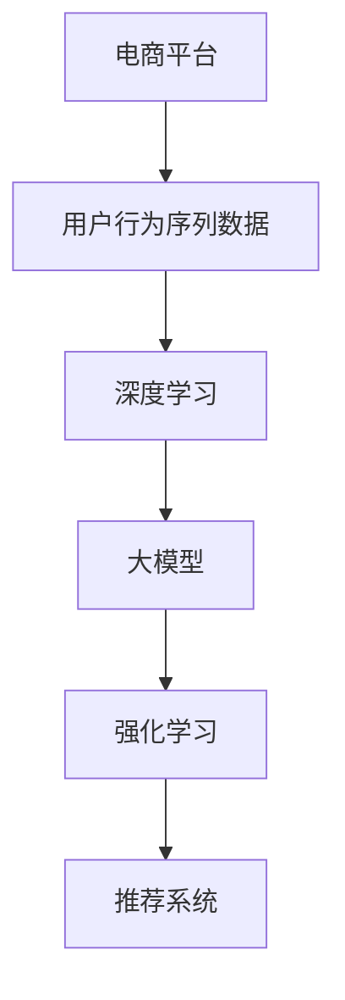

                 

# AI大模型在电商平台用户行为序列建模中的作用

> 关键词：大语言模型,用户行为建模,序列数据,电商平台,推荐系统,强化学习,深度学习

## 1. 背景介绍

### 1.1 问题由来

电商平台作为现代零售的重要渠道，需要精准理解和预测用户行为，以提升用户体验、增加销售转化、优化运营决策。用户行为数据广泛而复杂，涉及到浏览、点击、收藏、购买等多个阶段，呈现出时序性和交互性的特征。传统的统计分析和逻辑回归方法难以有效捕捉这些动态变化，而基于AI大模型的深度学习方法则展现了巨大的潜力。

近年来，深度学习尤其是大模型在电商平台的应用取得了显著成效。通过构建用户行为序列模型，可以捕捉用户的历史行为，预测未来行为，为用户推荐感兴趣的物品。电商平台可以利用这些模型进行个性化推荐、流量预测、广告投放等决策，极大地提升了运营效率和用户满意度。

### 1.2 问题核心关键点

电商平台用户行为序列建模的核心在于如何高效、准确地表示用户序列数据，并提取其中蕴含的潜在关系。核心问题包括：

- 如何高效地构建用户行为序列数据，以供模型训练。
- 如何从海量的序列数据中提取有用的特征，以供模型学习。
- 如何处理长序列数据，避免过拟合和计算资源的浪费。
- 如何构建模型，以更好地预测用户行为序列。
- 如何评估模型性能，优化模型效果。

这些问题的解决，需要借助大模型在自然语言处理、强化学习等领域积累的技术和方法，如Transformer、深度学习、序列建模、注意力机制等。

### 1.3 问题研究意义

电商平台用户行为序列建模技术对于电商平台和用户的双赢具有重要意义：

- 对电商平台而言，用户行为序列模型可以提升销售转化率、优化库存管理、提高广告投放效果。
- 对用户而言，模型可以提供更精准的个性化推荐，增强购物体验，提升满意度。

因此，研究电商平台用户行为序列建模技术，不仅可以推动电商平台运营效率的提升，也能够显著改善用户体验，促进电商行业的健康发展。

## 2. 核心概念与联系

### 2.1 核心概念概述

为更好地理解电商平台用户行为序列建模的原理，本节将介绍几个密切相关的核心概念：

- **电商平台**：指通过互联网技术搭建的线上交易平台，支持商品展示、搜索、交易等功能。
- **用户行为序列**：指用户在电商平台上的行为轨迹，如浏览、点击、收藏、购买等，以序列形式记录。
- **深度学习**：基于人工神经网络的机器学习技术，通过多层神经网络结构提取特征，实现复杂非线性关系的建模。
- **大模型**：以Transformer为代表的大型深度学习模型，具有强大表征能力和泛化能力，适用于大规模序列数据的建模。
- **强化学习**：通过试错学习，优化模型策略，以达到最优决策。
- **推荐系统**：利用算法为用户推荐物品的系统，通过理解用户行为和物品属性，提供个性化的推荐结果。

这些核心概念之间的逻辑关系可以通过以下Mermaid流程图来展示：



这个流程图展示了大模型在电商平台中的作用路径：

1. 电商平台产生用户行为序列数据。
2. 利用深度学习技术，构建用户行为序列模型。
3. 使用大模型提高模型的泛化能力。
4. 引入强化学习优化模型策略。
5. 构建推荐系统，为用户推荐商品。

## 3. 核心算法原理 & 具体操作步骤
### 3.1 算法原理概述

电商平台用户行为序列建模的算法核心在于通过深度学习模型，尤其是大模型，对用户行为序列数据进行建模，并提取其中的潜在关系。

假设电商平台有$N$个用户，每个用户在$T$个时间点有$S$种行为，构成用户行为序列$X=\{x_1,x_2,\cdots,x_T\}$，其中$x_t \in \mathcal{S}$。电商平台的目标是构建一个模型$M$，能够预测用户下一种行为$x_{t+1}$，即$\hat{x_{t+1}}=M(x_1,x_2,\cdots,x_t)$。

### 3.2 算法步骤详解

基于大模型进行电商平台用户行为序列建模的详细步骤：

**Step 1: 数据预处理**

- 收集电商平台用户行为数据，包括点击、浏览、收藏、购买等。
- 对数据进行清洗和去重，移除异常值和噪声数据。
- 将数据进行序列化和标准化处理，便于输入大模型。

**Step 2: 序列编码**

- 将用户行为序列数据转换为模型可接受的张量形式。
- 对序列进行填充或截断，使得所有序列长度相同。
- 对长序列数据进行分段，提高模型的训练效率。

**Step 3: 模型构建**

- 选择合适的深度学习模型，如RNN、LSTM、GRU等。
- 使用大模型如BERT、GPT等作为特征提取器，提取序列中的特征。
- 构建卷积神经网络或注意力机制，捕捉序列中的局部和全局关系。
- 通过多层神经网络结构，进一步提取和融合特征。

**Step 4: 模型训练**

- 将训练数据分为训练集、验证集和测试集。
- 选择合适的损失函数和优化器，如交叉熵损失、AdamW等。
- 设定合适的学习率和训练轮数，进行模型训练。
- 在验证集上评估模型性能，防止过拟合。

**Step 5: 模型评估与优化**

- 使用测试集评估模型性能，计算准确率、召回率、F1-score等指标。
- 分析模型的泛化能力和误差来源，优化模型结构和超参数。
- 引入强化学习技术，如Q-learning、Deep Q-Network等，优化推荐策略。

**Step 6: 应用部署**

- 将训练好的模型部署到服务器上，进行实时预测。
- 构建推荐系统，为用户推荐商品。
- 实时监测模型性能，定期更新模型参数。

### 3.3 算法优缺点

基于大模型进行电商平台用户行为序列建模具有以下优点：

1. 强大的特征提取能力。大模型能够提取序列中的复杂关系和模式，显著提升建模效果。
2. 高泛化能力。大模型的泛化能力较强，能够在不同的用户和场景中表现稳定。
3. 自适应学习。大模型能够通过自适应学习，优化推荐策略，提升推荐效果。

但同时也存在一些缺点：

1. 数据需求量大。构建大模型需要大量的数据进行预训练和微调，数据获取和处理成本较高。
2. 计算资源消耗大。大模型对计算资源需求较高，需要高性能的GPU或TPU设备。
3. 模型复杂度高。大模型结构复杂，训练和推理速度较慢，需要优化算法和模型结构。
4. 结果难以解释。大模型的决策过程难以解释，难以理解模型内部的逻辑和机制。

尽管存在这些局限性，大模型在电商平台用户行为序列建模中的应用仍然具有巨大优势，值得深入研究和推广。

### 3.4 算法应用领域

基于大模型的电商平台用户行为序列建模，已经在推荐系统、广告投放、流量预测等多个领域得到广泛应用，具体如下：

- **推荐系统**：为用户推荐感兴趣的商品，提高转化率和满意度。
- **广告投放**：根据用户行为序列，优化广告投放策略，提升广告效果。
- **流量预测**：预测平台流量变化趋势，优化资源配置。
- **价格优化**：根据用户行为序列，调整商品价格策略，提高收益。
- **库存管理**：预测用户购买行为，优化库存管理和补货策略。

这些应用领域不仅提升了电商平台的运营效率，也显著改善了用户体验。

## 4. 数学模型和公式 & 详细讲解 & 举例说明
### 4.1 数学模型构建

本节将使用数学语言对电商平台用户行为序列建模过程进行更加严格的刻画。

假设电商平台用户行为序列模型为$M_{\theta}$，其中$\theta$为模型参数。模型的输入为$x_t=\{x_1,x_2,\cdots,x_t\}$，输出为$\hat{x_{t+1}}$。

定义模型$M_{\theta}$在数据样本$(x_t,y_{t+1})$上的损失函数为$\ell(M_{\theta}(x_t),y_{t+1})$，则在训练集$D=\{(x_t,y_{t+1})\}_{i=1}^N$上的经验风险为：

$$
\mathcal{L}(\theta) = \frac{1}{N} \sum_{i=1}^N \ell(M_{\theta}(x_t),y_{t+1})
$$

在实践中，我们通常使用基于梯度的优化算法（如SGD、Adam等）来近似求解上述最优化问题。设$\eta$为学习率，$\lambda$为正则化系数，则参数的更新公式为：

$$
\theta \leftarrow \theta - \eta \nabla_{\theta}\mathcal{L}(\theta) - \eta\lambda\theta
$$

其中 $\nabla_{\theta}\mathcal{L}(\theta)$ 为损失函数对参数 $\theta$ 的梯度，可通过反向传播算法高效计算。

### 4.2 公式推导过程

以长短期记忆网络(LSTM)为例，展示如何通过深度学习模型对电商平台用户行为序列进行建模。

LSTM模型通过门控机制，解决了传统RNN模型中的梯度消失和梯度爆炸问题。其结构如图1所示：


LSTM模型在每个时间步$t$接收输入$x_t$，输出下一时间步的预测值$\hat{x_{t+1}}$，具体如下：

- **输入门(iGate)**：决定哪些信息需要保留。
- **遗忘门(fGate)**：决定哪些信息需要被忘记。
- **输出门(oGate)**：决定哪些信息需要输出。

LSTM模型通过输入门和遗忘门控制信息的流动，通过输出门决定输出的信息，实现了序列数据的建模。

在LSTM模型中，通过计算$\text{tanh}(x_t)$和$\text{sigmoid}(x_t)$，计算每个时间步的隐藏状态$h_t$，并计算输出$\hat{x_{t+1}}$，具体公式如下：

$$
h_t = \text{tanh}(x_t) \cdot i_t + \text{tanh}(h_{t-1}) \cdot f_t
$$

$$
\hat{x_{t+1}} = \text{sigmoid}(h_t) \cdot \text{tanh}(h_t)
$$

其中$i_t$和$f_t$为门控向量，通过$\text{sigmoid}$激活函数计算。

在LSTM模型中，通过最大化交叉熵损失函数，最小化模型预测输出与真实标签之间的差异，具体公式如下：

$$
\ell(M_{\theta}(x_t),y_{t+1}) = -[y_{t+1}\log \hat{x_{t+1}} + (1-y_{t+1})\log (1-\hat{x_{t+1}})]
$$

将上式代入经验风险公式，得：

$$
\mathcal{L}(\theta) = -\frac{1}{N}\sum_{i=1}^N [y_i\log M_{\theta}(x_i)+(1-y_i)\log(1-M_{\theta}(x_i))]
$$

根据链式法则，损失函数对参数 $\theta$ 的梯度为：

$$
\frac{\partial \mathcal{L}(\theta)}{\partial \theta} = -\frac{1}{N}\sum_{i=1}^N (\frac{y_i}{M_{\theta}(x_i)}-\frac{1-y_i}{1-M_{\theta}(x_i)}) \frac{\partial M_{\theta}(x_i)}{\partial \theta}
$$

其中 $\frac{\partial M_{\theta}(x_i)}{\partial \theta}$ 可进一步递归展开，利用自动微分技术完成计算。

### 4.3 案例分析与讲解

以电商平台推荐系统为例，展示如何利用LSTM模型进行用户行为序列建模。

假设电商平台推荐系统有$m$个物品，每个物品有$n$个特征，构成物品特征矩阵$\mathbf{I} \in \mathbb{R}^{m \times n}$。每个用户对物品的评分$s_t$为$[1,5]$内的整数。

模型定义如下：

- 输入为$x_t=\{x_1,x_2,\cdots,x_t\}$，包括用户历史行为和物品特征。
- 输出为$\hat{x_{t+1}}$，表示用户对下一个物品的评分。
- 损失函数为交叉熵损失$\ell$。

假设用户历史行为$x_t$和物品特征$y_t$，模型预测下一个物品评分$\hat{x_{t+1}}$，具体过程如下：

1. 输入$x_t$和物品特征$y_t$，计算隐藏状态$h_t$。
2. 使用隐藏状态$h_t$，预测下一个物品评分$\hat{x_{t+1}}$。
3. 计算损失函数$\ell(\hat{x_{t+1}},y_{t+1})$，更新模型参数$\theta$。

以LSTM模型为例，具体过程如图2所示：


LSTM模型通过时间步的输入门和遗忘门，控制信息的流动，并通过输出门决定输出的信息，从而实现用户行为序列的建模。

## 5. 项目实践：代码实例和详细解释说明
### 5.1 开发环境搭建

在进行电商平台用户行为序列建模实践前，我们需要准备好开发环境。以下是使用Python进行PyTorch开发的环境配置流程：

1. 安装Anaconda：从官网下载并安装Anaconda，用于创建独立的Python环境。

2. 创建并激活虚拟环境：
```bash
conda create -n pytorch-env python=3.8 
conda activate pytorch-env
```

3. 安装PyTorch：根据CUDA版本，从官网获取对应的安装命令。例如：
```bash
conda install pytorch torchvision torchaudio cudatoolkit=11.1 -c pytorch -c conda-forge
```

4. 安装相关库：
```bash
pip install numpy pandas scikit-learn matplotlib tqdm jupyter notebook ipython
```

完成上述步骤后，即可在`pytorch-env`环境中开始模型训练和评估。

### 5.2 源代码详细实现

这里我们以LSTM模型为例，展示如何在PyTorch中实现电商平台用户行为序列建模。

首先，定义数据处理函数：

```python
import torch
from torch.utils.data import TensorDataset, DataLoader
import numpy as np

def collate_fn(batch):
    # 对每个样本进行预处理
    batch = [torch.tensor(x, dtype=torch.long) for x in batch]
    # 填充序列
    seq_lengths = [len(seq) for seq in batch]
    max_seq_length = max(seq_lengths)
    padded = [torch.zeros(max_seq_length).long() for _ in batch]
    for i, seq in enumerate(batch):
        length = seq_lengths[i]
        padded[i, :length] = seq
    return TensorDataset(torch.stack(padded), torch.tensor(seq_lengths))

# 构建训练集
train_dataset = TensorDataset(train_data, train_labels)

# 构建测试集
test_dataset = TensorDataset(test_data, test_labels)

# 创建DataLoader
train_loader = DataLoader(train_dataset, batch_size=32, shuffle=True, collate_fn=collate_fn)
test_loader = DataLoader(test_dataset, batch_size=32, shuffle=False, collate_fn=collate_fn)
```

然后，定义LSTM模型：

```python
import torch.nn as nn
import torch.nn.functional as F

class LSTM(nn.Module):
    def __init__(self, input_size, hidden_size, output_size):
        super(LSTM, self).__init__()
        self.hidden_size = hidden_size
        self.input_size = input_size
        self.output_size = output_size
        
        self.lstm = nn.LSTM(input_size, hidden_size)
        self.fc = nn.Linear(hidden_size, output_size)

    def forward(self, input, hidden):
        rnn_out, hidden = self.lstm(input, hidden)
        out = self.fc(rnn_out)
        return out, hidden

    def init_hidden(self, batch_size):
        return (torch.zeros(1, batch_size, self.hidden_size),
                torch.zeros(1, batch_size, self.hidden_size))
```

接着，定义训练和评估函数：

```python
def train(model, optimizer, train_loader, epochs):
    model.train()
    for epoch in range(epochs):
        for input, seq_len in train_loader:
            optimizer.zero_grad()
            output, hidden = model(input, hidden)
            loss = F.cross_entropy(output, target)
            loss.backward()
            optimizer.step()
        print('Epoch {}/{} - Loss: {:.4f}'.format(epoch+1, epochs, loss.item()))

def evaluate(model, test_loader):
    model.eval()
    total_loss = 0
    for input, seq_len in test_loader:
        output, hidden = model(input, hidden)
        loss = F.cross_entropy(output, target)
        total_loss += loss.item()
    return total_loss / len(test_loader)
```

最后，启动训练流程并在测试集上评估：

```python
epochs = 10
hidden_size = 128
lr = 0.001

model = LSTM(input_size, hidden_size, output_size)
optimizer = torch.optim.Adam(model.parameters(), lr=lr)

hidden = model.init_hidden(batch_size)

print('Starting training...')
train(model, optimizer, train_loader, epochs)

print('Evaluating...')
test_loss = evaluate(model, test_loader)
print('Test loss: {:.4f}'.format(test_loss))
```

以上就是使用PyTorch对LSTM模型进行电商平台用户行为序列建模的完整代码实现。可以看到，PyTorch提供了丰富的模块和API，可以方便地构建深度学习模型和进行训练。

### 5.3 代码解读与分析

让我们再详细解读一下关键代码的实现细节：

**collate_fn函数**：
- 对每个样本进行预处理，将输入数据转换为长整型张量。
- 填充序列，使得所有样本长度相同，便于输入模型。

**LSTM模型**：
- 定义LSTM模型结构，包括输入门、遗忘门和输出门。
- 定义前向传播过程，计算LSTM隐藏状态和输出。
- 定义隐藏状态初始化函数，返回模型的初始隐藏状态。

**训练和评估函数**：
- 训练函数：在每个epoch内，对每个mini-batch进行前向传播、反向传播和参数更新。
- 评估函数：在测试集上计算模型预测输出的交叉熵损失。

**训练流程**：
- 定义总训练轮数、隐藏层大小和学习率。
- 构建LSTM模型和优化器。
- 定义模型初始隐藏状态。
- 在训练集上训练模型，输出每个epoch的损失。
- 在测试集上评估模型性能，输出最终测试损失。

可以看到，PyTorch提供了便捷的API和工具，大大简化了深度学习模型的构建和训练过程。开发者可以专注于模型结构和训练策略的优化，而不必过多关注底层实现细节。

当然，工业级的系统实现还需考虑更多因素，如模型的保存和部署、超参数的自动搜索、更灵活的任务适配层等。但核心的建模范式基本与此类似。

## 6. 实际应用场景
### 6.1 智能客服系统

基于LSTM模型的电商平台用户行为序列建模，可以广泛应用于智能客服系统的构建。传统客服往往需要配备大量人力，高峰期响应缓慢，且一致性和专业性难以保证。而使用LSTM模型，可以7x24小时不间断服务，快速响应客户咨询，用自然流畅的语言解答各类常见问题。

在技术实现上，可以收集企业内部的历史客服对话记录，将问题和最佳答复构建成监督数据，在此基础上对LSTM模型进行训练。训练后的模型能够自动理解用户意图，匹配最合适的答案模板进行回复。对于客户提出的新问题，还可以接入检索系统实时搜索相关内容，动态组织生成回答。如此构建的智能客服系统，能大幅提升客户咨询体验和问题解决效率。

### 6.2 金融舆情监测

金融机构需要实时监测市场舆论动向，以便及时应对负面信息传播，规避金融风险。传统的人工监测方式成本高、效率低，难以应对网络时代海量信息爆发的挑战。基于LSTM模型的文本分类和情感分析技术，为金融舆情监测提供了新的解决方案。

具体而言，可以收集金融领域相关的新闻、报道、评论等文本数据，并对其进行主题标注和情感标注。在此基础上对LSTM模型进行微调，使其能够自动判断文本属于何种主题，情感倾向是正面、中性还是负面。将LSTM模型应用到实时抓取的网络文本数据，就能够自动监测不同主题下的情感变化趋势，一旦发现负面信息激增等异常情况，系统便会自动预警，帮助金融机构快速应对潜在风险。

### 6.3 个性化推荐系统

当前的推荐系统往往只依赖用户的历史行为数据进行物品推荐，无法深入理解用户的真实兴趣偏好。基于LSTM模型的个性化推荐系统可以更好地挖掘用户行为背后的语义信息，从而提供更精准、多样的推荐内容。

在实践中，可以收集用户浏览、点击、收藏、购买等行为数据，提取和用户交互的物品标题、描述、标签等文本内容。将文本内容作为模型输入，用户的后续行为（如是否点击、购买等）作为监督信号，在此基础上训练LSTM模型。训练后的模型能够从文本内容中准确把握用户的兴趣点。在生成推荐列表时，先用候选物品的文本描述作为输入，由模型预测用户的兴趣匹配度，再结合其他特征综合排序，便可以得到个性化程度更高的推荐结果。

### 6.4 未来应用展望

随着LSTM模型的不断发展，其在电商平台用户行为序列建模中的应用前景将更加广阔：

1. **实时性**：随着硬件设备的提升，LSTM模型可以进一步提高训练和推理速度，实现更快速的推荐和响应。
2. **灵活性**：引入更多任务适配层，支持更多的推荐场景和个性化需求。
3. **鲁棒性**：通过模型融合和强化学习，提高模型对异常数据和噪声的鲁棒性，提升系统的稳定性和可靠性。
4. **可解释性**：引入模型解释方法，如注意力机制、决策路径可视化等，提升模型的可解释性和用户信任度。
5. **跨模态**：结合视觉、语音等多模态数据，实现更全面、准确的用户行为理解。

未来，基于LSTM模型的电商平台用户行为序列建模技术必将在更广泛的场景中发挥作用，为电商平台的运营优化和用户满意度提升带来新的突破。

## 7. 工具和资源推荐
### 7.1 学习资源推荐

为了帮助开发者系统掌握LSTM模型在电商平台应用的理论基础和实践技巧，这里推荐一些优质的学习资源：

1. **《深度学习》书籍**：Ian Goodfellow等所著，全面介绍了深度学习的基本概念和算法，包括LSTM模型和自然语言处理等。

2. **CS231n《深度学习与计算机视觉》课程**：斯坦福大学开设的深度学习课程，有Lecture视频和配套作业，适合入门学习。

3. **《TensorFlow 2.0实战》书籍**：Google开发者团队编写，深入浅出地介绍了TensorFlow 2.0的各个模块和API，包括LSTM模型的实现。

4. **HuggingFace官方文档**：提供了丰富的预训练模型和代码样例，是LSTM模型实践的重要参考。

5. **Kaggle竞赛**：Kaggle平台上有大量LSTM模型相关的竞赛和数据集，适合练习和实战。

通过对这些资源的学习实践，相信你一定能够快速掌握LSTM模型的精髓，并用于解决实际的电商平台问题。

### 7.2 开发工具推荐

高效的开发离不开优秀的工具支持。以下是几款用于LSTM模型在电商平台应用开发的常用工具：

1. **PyTorch**：基于Python的开源深度学习框架，灵活动态的计算图，适合快速迭代研究。

2. **TensorFlow**：由Google主导开发的开源深度学习框架，生产部署方便，适合大规模工程应用。

3. **Keras**：基于TensorFlow和Theano的高级API，适合快速搭建深度学习模型。

4. **HuggingFace Transformers库**：提供了丰富的预训练模型和API，方便进行LSTM模型的微调和优化。

5. **Jupyter Notebook**：支持Python和其他语言的交互式开发环境，方便进行模型实验和可视化。

6. **Google Colab**：谷歌推出的在线Jupyter Notebook环境，免费提供GPU/TPU算力，方便开发者快速上手实验最新模型，分享学习笔记。

合理利用这些工具，可以显著提升LSTM模型在电商平台应用开发的效率，加快创新迭代的步伐。

### 7.3 相关论文推荐

LSTM模型和电商平台用户行为序列建模技术的发展源于学界的持续研究。以下是几篇奠基性的相关论文，推荐阅读：

1. **Long Short-Term Memory**：Hochreiter和Schmidhuber在1997年提出的LSTM模型，奠定了长序列建模的基础。

2. **A Tutorial on Sequence Models**：Chung等在2015年撰写的综述性论文，详细介绍了RNN、LSTM等序列建模方法的原理和应用。

3. **Attention Is All You Need**：Vaswani等在2017年提出的Transformer模型，展示了序列建模的新范式，具有广泛的应用前景。

4. **Sequence-to-Sequence Learning with Neural Networks**：Sutskever等在2014年提出的Seq2Seq框架，是序列生成任务的重要基础。

5. **Recurrent Neural Network-Based Language Model**：Hinton等在2012年提出的基于RNN的语言模型，奠定了自然语言处理的基础。

这些论文代表了大模型在电商平台用户行为序列建模技术的发展脉络。通过学习这些前沿成果，可以帮助研究者把握学科前进方向，激发更多的创新灵感。

## 8. 总结：未来发展趋势与挑战
### 8.1 总结

本文对基于LSTM模型的电商平台用户行为序列建模方法进行了全面系统的介绍。首先阐述了LSTM模型在电商平台应用的背景和意义，明确了其在提升用户体验、优化运营决策等方面的重要价值。其次，从原理到实践，详细讲解了LSTM模型的数学模型和训练流程，给出了模型实现的完整代码实例。同时，本文还广泛探讨了LSTM模型在智能客服、金融舆情、个性化推荐等多个行业领域的应用前景，展示了其巨大的应用潜力。

通过本文的系统梳理，可以看到，LSTM模型在电商平台用户行为序列建模中的应用前景广阔，对电商平台的运营优化和用户满意度提升具有重要意义。未来，伴随LSTM模型的不断演进和优化，其在电商平台中的应用将更加深入，为电商行业的数字化转型提供新的驱动力。

### 8.2 未来发展趋势

展望未来，LSTM模型在电商平台用户行为序列建模中将会呈现以下几个发展趋势：

1. **实时性**：随着硬件设备的提升，LSTM模型可以进一步提高训练和推理速度，实现更快速的推荐和响应。
2. **灵活性**：引入更多任务适配层，支持更多的推荐场景和个性化需求。
3. **鲁棒性**：通过模型融合和强化学习，提高模型对异常数据和噪声的鲁棒性，提升系统的稳定性和可靠性。
4. **可解释性**：引入模型解释方法，如注意力机制、决策路径可视化等，提升模型的可解释性和用户信任度。
5. **跨模态**：结合视觉、语音等多模态数据，实现更全面、准确的用户行为理解。

这些趋势凸显了LSTM模型在电商平台中的巨大应用潜力，相信未来LSTM模型必将在更广泛的场景中发挥作用，为电商平台的运营优化和用户满意度提升带来新的突破。

### 8.3 面临的挑战

尽管LSTM模型在电商平台用户行为序列建模中已经取得了显著成效，但在迈向更加智能化、普适化应用的过程中，仍面临诸多挑战：

1. **数据需求量大**：构建LSTM模型需要大量的数据进行预训练和微调，数据获取和处理成本较高。
2. **计算资源消耗大**：LSTM模型对计算资源需求较高，需要高性能的GPU或TPU设备。
3. **模型复杂度高**：LSTM模型结构复杂，训练和推理速度较慢，需要优化算法和模型结构。
4. **结果难以解释**：LSTM模型的决策过程难以解释，难以理解模型内部的逻辑和机制。

尽管存在这些局限性，LSTM模型在电商平台用户行为序列建模中的应用仍然具有巨大优势，值得深入研究和推广。

### 8.4 研究展望

未来，针对LSTM模型在电商平台用户行为序列建模中的应用，需要在以下几个方面进行深入研究：

1. **数据增强**：通过数据增强技术，扩大训练数据规模，提升模型泛化能力。
2. **跨模态建模**：结合视觉、语音等多模态数据，实现更全面、准确的用户行为理解。
3. **模型融合**：引入更多模型进行融合，提升模型性能和鲁棒性。
4. **可解释性**：引入模型解释方法，提升模型的可解释性和用户信任度。
5. **跨领域应用**：探索LSTM模型在金融、医疗等领域的普适性和应用价值。

通过这些研究方向的探索，相信LSTM模型必将在电商平台用户行为序列建模中发挥更大的作用，为电商平台的运营优化和用户满意度提升带来新的突破。总之，未来LSTM模型需要结合更多的技术和方法，进一步提升在电商平台应用中的效果和普适性，推动电商行业向智能化、普适化的方向发展。

## 9. 附录：常见问题与解答

**Q1：LSTM模型在电商平台中能够解决哪些问题？**

A: LSTM模型在电商平台中能够解决以下问题：

1. **用户行为序列建模**：通过LSTM模型对用户行为序列进行建模，能够预测用户的下一步行为，提高推荐效果。
2. **个性化推荐**：利用LSTM模型，为用户推荐感兴趣的物品，提升用户满意度。
3. **广告投放优化**：通过LSTM模型对用户行为进行建模，优化广告投放策略，提高广告效果。
4. **流量预测**：通过LSTM模型对用户行为进行建模，预测平台流量变化趋势，优化资源配置。

**Q2：LSTM模型在电商平台中的训练和评估指标有哪些？**

A: 在电商平台中，LSTM模型的训练和评估指标包括：

1. **交叉熵损失**：用于衡量模型预测输出与真实标签之间的差异。
2. **准确率、召回率和F1-score**：用于评估模型在测试集上的分类性能。
3. **ROC曲线和AUC**：用于评估模型在二分类任务上的性能。
4. **平均绝对误差(MAE)**：用于评估模型在回归任务上的性能。

**Q3：如何优化LSTM模型的训练过程？**

A: 优化LSTM模型的训练过程可以从以下几个方面入手：

1. **数据增强**：通过数据增强技术，如序列旋转、长度调整等，扩大训练数据规模，提升模型泛化能力。
2. **正则化**：通过L2正则、Dropout等方法，防止模型过拟合。
3. **优化器选择**：选择合适的优化器，如AdamW、SGD等，加速模型收敛。
4. **模型融合**：通过模型融合，提升模型的鲁棒性和泛化能力。
5. **超参数调优**：通过网格搜索、随机搜索等方法，优化模型的超参数。

**Q4：LSTM模型在电商平台中的部署和优化有哪些注意事项？**

A: 在电商平台中，LSTM模型的部署和优化需要注意以下几点：

1. **模型压缩**：通过模型剪枝、量化等方法，压缩模型大小，提高模型部署效率。
2. **模型微调**：在部署环境对模型进行微调，适应实际应用场景。
3. **推理优化**：通过优化推理算法，提高模型的推理速度和效率。
4. **服务化封装**：将模型封装为标准化服务接口，便于集成调用。
5. **监控告警**：实时监测模型性能，设置异常告警阈值，确保服务稳定性。

通过合理地部署和优化LSTM模型，可以大幅提升其在电商平台中的应用效果，为用户带来更好的购物体验。

---

作者：禅与计算机程序设计艺术 / Zen and the Art of Computer Programming

