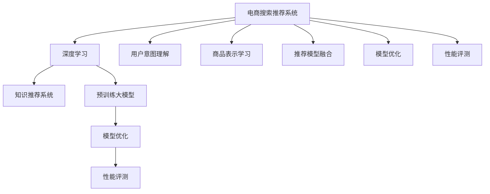

                 

# AI大模型视角下电商搜索推荐的技术创新知识推荐系统优化与性能评测

> 关键词：大模型,电商搜索推荐,知识推荐系统,深度学习,模型优化,性能评测

## 1. 背景介绍

### 1.1 问题由来
在电商领域，搜索引擎和推荐系统是两大核心模块。其核心任务是通过分析用户的查询行为和购买历史，准确推荐商品，提升用户体验和销售额。早期主要基于统计学、规则化的模型，如倒排索引、TF-IDF、协同过滤等，但这些方法存在特征稀疏性高、精度低、扩展性差等问题。近年来，深度学习技术开始应用于电商领域，以大模型为基础的推荐系统逐渐成为主流。

随着AI技术的发展，预训练大模型（如BERT、GPT-3等）在电商搜索推荐中展现了巨大潜力。通过在海量数据上预训练，大模型可以学习到丰富的商品知识、用户画像，并迁移到特定电商任务中进行优化。然而，电商搜索推荐场景复杂多变，如何在大模型基础上构建高性能推荐系统，成为行业关注的热点问题。

### 1.2 问题核心关键点
大模型在电商搜索推荐中的应用，主要集中在以下几个核心关键点上：

1. **用户意图理解**：通过大模型的语言理解能力，理解用户查询的真实意图，生成更符合用户需求的商品推荐。
2. **商品表示学习**：将商品描述、图片、属性等信息转化为模型可以理解的向量表示，以便模型进行匹配和排序。
3. **推荐模型融合**：综合利用多模型、多数据源，构建更全面、准确的用户-商品匹配模型，提升推荐效果。
4. **模型优化与性能评测**：针对电商推荐系统构建指标化的评测体系，如点击率、转化率、用户满意度等，用于评估和优化模型性能。
5. **可解释性和可控性**：构建可解释、可控的推荐模型，解释推荐决策的逻辑，增强用户信任和系统可控性。

本文旨在深入探讨大模型在电商搜索推荐中的技术实现和性能优化，希望能为电商领域的技术实践提供有价值的参考。

## 2. 核心概念与联系

### 2.1 核心概念概述

为更好地理解大模型在电商搜索推荐中的应用，本节将介绍几个密切相关的核心概念：

- **电商搜索推荐系统（E-Commerce Search and Recommendation System）**：通过分析用户查询行为和购买历史，精准推荐商品，提升用户购物体验和平台销售额的系统。
- **知识推荐系统（Knowledge-based Recommendation System）**：利用外部知识库和逻辑规则，提高推荐系统的准确性和可解释性，构建智能化的推荐决策机制。
- **深度学习（Deep Learning）**：一类模拟人脑神经网络的算法，具有强大的学习能力，可以处理高维数据和非线性关系，适合电商推荐等复杂场景。
- **预训练大模型（Pre-trained Large Model）**：通过在大规模无标签数据上进行预训练，学习到通用的语言和知识表示，如BERT、GPT-3等。
- **模型优化（Model Optimization）**：通过调整模型结构、超参数、数据增强等手段，提升模型在特定任务上的性能。
- **性能评测（Performance Evaluation）**：构建科学、公正的评测指标，评估推荐系统的精度、覆盖率、召回率等，指导模型的优化方向。

这些核心概念之间的逻辑关系可以通过以下Mermaid流程图来展示：



这个流程图展示了大模型在电商搜索推荐中的应用框架：

1. 电商搜索推荐系统基于深度学习构建推荐模型。
2. 知识推荐系统引入外部知识库，提升推荐准确性和可解释性。
3. 预训练大模型提供通用的知识表示。
4. 模型优化通过调整模型结构、超参数等手段提升性能。
5. 性能评测构建指标化的评测体系，指导模型优化。

## 3. 核心算法原理 & 具体操作步骤
### 3.1 算法原理概述

在大模型视角下，电商搜索推荐的实现流程大致如下：

1. **数据预处理**：收集用户查询记录、购买历史、商品描述等信息，进行数据清洗、特征提取、格式化等预处理工作。
2. **大模型编码**：使用预训练大模型对用户查询和商品信息进行编码，生成向量表示。
3. **推荐模型构建**：根据电商任务特点，设计推荐模型，如基于深度学习的CTR模型、基于知识图谱的推荐模型等。
4. **模型优化与融合**：通过模型调优、特征增强、集成学习等手段提升推荐系统性能。
5. **性能评测与反馈**：构建科学的评测指标，如点击率、转化率、用户满意度等，进行模型效果评估，并根据反馈优化模型。

### 3.2 算法步骤详解

电商搜索推荐系统的实现，一般包括以下几个关键步骤：

**Step 1: 数据准备**
- 收集用户历史行为数据，包括搜索、浏览、点击、购买等信息。
- 收集商品属性信息，如标题、描述、分类、价格等。
- 清洗和格式化数据，处理缺失值、异常值等。

**Step 2: 数据编码**
- 使用预训练大模型对用户查询和商品信息进行编码，生成向量表示。如BERT、GPT-3等。
- 将用户查询向量化，并保留足够的语义信息，便于模型理解用户意图。
- 将商品属性进行编码，转化为模型可以理解的向量表示。

**Step 3: 推荐模型构建**
- 根据电商任务特点，选择合适的推荐模型。常见的有深度学习模型（如CTR、DNN）、知识图谱模型等。
- 将大模型的编码结果作为推荐模型的输入，进行用户-商品匹配。

**Step 4: 模型优化**
- 选择适当的损失函数和优化算法，如交叉熵、Adam等，训练推荐模型。
- 应用正则化技术，防止模型过拟合，如L2正则、Dropout等。
- 进行模型调参，调整学习率、批大小、迭代次数等超参数。

**Step 5: 性能评测**
- 设计科学的评测指标，如点击率、转化率、用户满意度等。
- 在验证集上评估推荐模型效果，记录各项指标。
- 根据评测结果进行模型优化，迭代训练，直至达到预设的性能要求。

**Step 6: 模型部署**
- 将优化后的推荐模型部署到实际电商系统中，实现实时推荐。
- 根据用户反馈和业务需求，持续优化和更新模型。

### 3.3 算法优缺点

电商搜索推荐系统采用大模型的方法，具有以下优点：

1. **精度高**：大模型具备强大的学习能力，能够更好地理解和表达电商场景中的复杂关系。
2. **可解释性高**：大模型可以提供推荐决策的逻辑解释，增强用户信任。
3. **可扩展性好**：大模型可以轻松适应不同电商平台和业务场景。
4. **可复用性强**：利用大模型可以构建统一的推荐框架，提高开发效率。

同时，该方法也存在一些局限性：

1. **计算资源需求大**：大模型的训练和推理需要大量计算资源，可能难以在大规模电商系统中普及。
2. **数据隐私问题**：电商搜索推荐系统涉及大量用户隐私数据，需注意数据隐私保护。
3. **模型复杂度高**：大模型结构复杂，难以解释内部运作机制，可能影响模型的可控性和可解释性。
4. **模型维护成本高**：大模型结构复杂，需要频繁更新和维护，才能保持高性能。

尽管存在这些局限性，但大模型在电商搜索推荐中的应用，仍然具有广阔的前景，特别是在电商数据量大、用户需求多样化的场景下，可以显著提升推荐系统的精度和效果。

### 3.4 算法应用领域

大模型在电商搜索推荐中的应用，已经在各大电商平台得到广泛应用，主要应用于以下几个领域：

1. **个性化推荐**：通过大模型的预训练和微调，构建个性化推荐模型，提升用户购物体验。
2. **搜索排序**：利用大模型进行用户查询的语义理解，实现更精准的搜索结果排序。
3. **广告投放优化**：使用大模型分析用户行为，优化广告投放策略，提高广告效果。
4. **用户画像构建**：通过大模型分析用户历史行为和兴趣爱好，构建详细的用户画像。
5. **商品相似度计算**：利用大模型进行商品特征匹配，实现商品推荐。

除了上述这些经典应用外，大模型在电商领域还不断创新，如动态商品描述生成、商品问答系统、智能客服等，为电商推荐系统带来了新的突破。

## 4. 数学模型和公式 & 详细讲解 & 举例说明
### 4.1 数学模型构建

在大模型视角下，电商推荐系统的核心数学模型可以表示为：

- 用户查询表示：$x \in R^d$，其中 $d$ 为用户查询的维度。
- 商品表示：$y \in R^d$，其中 $d$ 为商品特征的维度。
- 推荐模型：$f(x, y) \in R$，表示用户和商品的匹配度。

假设电商平台有 $N$ 个用户，$M$ 个商品，每个用户 $x_i$ 对商品 $y_j$ 的评分 $r_{i,j} \in R$。推荐模型的目标是最大化用户对推荐商品的满意度，即最大化目标函数：

$$
\max_{\theta} \sum_{i=1}^N \sum_{j=1}^M r_{i,j} \log(f(x_i, y_j))
$$

其中 $\theta$ 为推荐模型的参数。

### 4.2 公式推导过程

推荐模型的优化目标是最大化目标函数，可以通过梯度上升方法进行求解，如Adam等。具体步骤如下：

1. 随机初始化推荐模型参数 $\theta_0$。
2. 对每个用户 $i$，随机采样商品 $j$，计算推荐模型的输出 $f(x_i, y_j)$。
3. 计算目标函数的梯度 $\nabla_{\theta}L$，其中 $L$ 为目标函数的负对数似然。
4. 使用梯度下降方法更新模型参数：$\theta \leftarrow \theta - \eta \nabla_{\theta}L$，其中 $\eta$ 为学习率。
5. 重复步骤2-4，直至收敛或达到预设的迭代次数。

通过上述过程，可以不断优化推荐模型的参数，使得目标函数值最大，即推荐效果最佳。

### 4.3 案例分析与讲解

以下以电商平台上的个性化推荐为例，给出具体的数学模型构建和优化过程：

1. **用户-商品评分矩阵**：假设电商平台上有 $N$ 个用户，$M$ 个商品，每个用户 $i$ 对商品 $j$ 的评分 $r_{i,j}$ 构成用户-商品评分矩阵 $R \in R^{N \times M}$。

2. **用户查询向量化**：使用BERT模型对用户查询 $x_i$ 进行编码，生成向量表示 $v_i \in R^d$。

3. **商品编码**：使用BERT模型对商品 $y_j$ 进行编码，生成向量表示 $v_j \in R^d$。

4. **推荐模型设计**：构建深度学习模型，如CTR模型，将用户查询向量 $v_i$ 和商品向量 $v_j$ 作为输入，输出用户对商品的评分预测值 $p_{i,j}$。

5. **模型优化**：使用均方误差损失函数 $L = \frac{1}{N} \sum_{i=1}^N \sum_{j=1}^M (r_{i,j} - p_{i,j})^2$，使用Adam等优化算法进行训练。

6. **性能评测**：设计点击率、转化率等指标，评估推荐模型效果。

## 5. 项目实践：代码实例和详细解释说明
### 5.1 开发环境搭建

在进行推荐系统开发前，我们需要准备好开发环境。以下是使用Python进行TensorFlow开发的环境配置流程：

1. 安装Anaconda：从官网下载并安装Anaconda，用于创建独立的Python环境。

2. 创建并激活虚拟环境：
```bash
conda create -n tf-env python=3.8 
conda activate tf-env
```

3. 安装TensorFlow：根据CUDA版本，从官网获取对应的安装命令。例如：
```bash
conda install tensorflow -c conda-forge -c pytorch -c pypi
```

4. 安装Pandas、NumPy、Scikit-learn等必要的工具包：
```bash
pip install pandas numpy scikit-learn
```

5. 安装TensorBoard：用于可视化模型的训练过程和结果，方便调试和优化。

6. 安装pytorch：如果需要，可以安装用于加速计算。

完成上述步骤后，即可在`tf-env`环境中开始推荐系统开发。

### 5.2 源代码详细实现

下面我们以电商搜索推荐系统为例，给出使用TensorFlow对推荐模型进行开发的PyTorch代码实现。

首先，定义推荐模型的输入输出：

```python
import tensorflow as tf
from tensorflow.keras.layers import Input, Dense
from tensorflow.keras.models import Model

# 定义输入层
user_input = Input(shape=(d,), name='user_input')
item_input = Input(shape=(d,), name='item_input')

# 定义深度学习模型
x = Dense(64, activation='relu')(user_input)
y = Dense(64, activation='relu')(item_input)

# 定义输出层
z = Dense(1, activation='sigmoid')(tf.concat([x, y], axis=-1))
model = Model(inputs=[user_input, item_input], outputs=z)

# 编译模型
model.compile(optimizer='adam', loss='binary_crossentropy', metrics=['accuracy'])
```

然后，定义数据预处理函数：

```python
def preprocess_data(data):
    # 将数据转化为模型需要的格式
    user_features = data['user_features'].values.reshape(-1, d)
    item_features = data['item_features'].values.reshape(-1, d)
    user_ids = data['user_ids'].values
    item_ids = data['item_ids'].values
    return user_features, user_ids, item_features, item_ids
```

接着，定义模型训练和评估函数：

```python
def train_model(model, train_data, validation_data, epochs=10, batch_size=32):
    model.fit(x=train_data, y=train_labels, batch_size=batch_size, epochs=epochs, validation_data=(validation_data, validation_labels))
    return model

def evaluate_model(model, test_data, test_labels):
    loss, acc = model.evaluate(x=test_data, y=test_labels)
    return loss, acc
```

最后，启动训练流程并在测试集上评估：

```python
# 加载数据集
train_data = load_train_data()
test_data = load_test_data()
validation_data = load_validation_data()

# 数据预处理
train_user_features, train_user_ids, train_item_features, train_item_ids = preprocess_data(train_data)
test_user_features, test_user_ids, test_item_features, test_item_ids = preprocess_data(test_data)
validation_user_features, validation_user_ids, validation_item_features, validation_item_ids = preprocess_data(validation_data)

# 训练模型
trained_model = train_model(model, (train_user_features, train_user_ids, train_item_features, train_item_ids), (validation_user_features, validation_user_ids, validation_item_features, validation_item_ids))

# 评估模型
test_loss, test_acc = evaluate_model(trained_model, (test_user_features, test_user_ids, test_item_features, test_item_ids), test_labels)
print(f"Test loss: {test_loss}, Test accuracy: {test_acc}")
```

以上就是使用TensorFlow对推荐模型进行开发的完整代码实现。可以看到，TensorFlow提供了丰富的深度学习组件，可以方便地构建和训练推荐模型。

### 5.3 代码解读与分析

让我们再详细解读一下关键代码的实现细节：

**Input层**：
- `Input`函数用于定义输入层，接收用户和商品的向量表示。
- `name`参数用于指定输入层的名称，方便调试和识别。

**Dense层**：
- `Dense`函数用于定义全连接层，接收前一层的输出，并输出新的特征向量。
- `activation`参数用于指定激活函数，如ReLU、Sigmoid等。

**Model层**：
- `Model`函数用于定义完整的推荐模型，接收输入和输出，并定义模型的整体结构。
- 使用`concat`函数将用户和商品特征向量拼接，作为推荐模型的输入。
- 使用`Dense`函数定义输出层，输出用户对商品的评分预测值。

**compile函数**：
- 用于编译模型，指定优化器、损失函数和评估指标。
- 优化器`'adam'`是一种常用的自适应优化算法，可以自动调整学习率，提高训练效率。
- 损失函数`'binary_crossentropy'`用于处理二分类问题，即用户是否点击了推荐商品。
- 评估指标`'accuracy'`用于评估模型的准确率。

**train_model函数**：
- 定义训练函数，接收模型、训练数据、验证数据等参数。
- 使用`fit`函数训练模型，指定训练批次大小、迭代次数和验证数据。

**evaluate_model函数**：
- 定义评估函数，接收模型、测试数据和标签等参数。
- 使用`evaluate`函数评估模型在测试集上的表现，返回损失和准确率。

通过上述代码，我们完成了推荐模型的训练和评估过程。可以看到，TensorFlow提供了强大的API，可以方便地进行深度学习模型的构建和优化。

## 6. 实际应用场景
### 6.1 智能客服系统

基于大模型视角的电商搜索推荐，可以广泛应用于智能客服系统的构建。传统客服往往需要配备大量人力，高峰期响应缓慢，且一致性和专业性难以保证。而使用推荐系统进行智能客服，可以7x24小时不间断服务，快速响应客户咨询，用自然流畅的语言解答各类常见问题。

在技术实现上，可以收集企业内部的历史客服对话记录，将问题-答案对作为训练数据，构建智能客服系统。推荐系统通过分析用户历史查询，推荐最合适的答案模板，实现自动客服。对于客户提出的新问题，还可以接入检索系统实时搜索相关内容，动态组织生成回答。如此构建的智能客服系统，能大幅提升客户咨询体验和问题解决效率。

### 6.2 金融舆情监测

金融机构需要实时监测市场舆论动向，以便及时应对负面信息传播，规避金融风险。传统的人工监测方式成本高、效率低，难以应对网络时代海量信息爆发的挑战。基于大模型的推荐系统，可以应用于金融舆情监测，构建实时舆情分析系统。

具体而言，可以收集金融领域相关的新闻、报道、评论等文本数据，构建舆情标签体系。使用推荐系统对舆情文本进行分类和排序，自动识别负面舆情，及时预警。金融舆情监测系统的构建，有助于提高金融机构的舆情响应速度和风险控制能力。

### 6.3 个性化推荐系统

当前的推荐系统往往只依赖用户的历史行为数据进行物品推荐，无法深入理解用户的真实兴趣偏好。基于大模型的推荐系统，可以更好地挖掘用户行为背后的语义信息，从而提供更精准、多样的推荐内容。

在实践中，可以收集用户浏览、点击、评论、分享等行为数据，提取和用户交互的物品标题、描述、标签等文本内容。将文本内容作为模型输入，用户的后续行为（如是否点击、购买等）作为监督信号，在此基础上微调预训练语言模型。微调后的模型能够从文本内容中准确把握用户的兴趣点。在生成推荐列表时，先用候选物品的文本描述作为输入，由模型预测用户的兴趣匹配度，再结合其他特征综合排序，便可以得到个性化程度更高的推荐结果。

### 6.4 未来应用展望

随着大模型和推荐系统的不断发展，基于大模型视角的电商搜索推荐技术将呈现以下几个发展趋势：

1. **深度学习与知识图谱融合**：将深度学习和知识图谱进行融合，构建更全面、准确的推荐系统。
2. **用户意图理解**：利用大模型的语言理解能力，提升推荐系统的用户意图理解能力，实现更精准的推荐。
3. **多模态推荐**：引入图像、视频等多模态数据，构建多模态推荐系统，提升推荐效果。
4. **个性化推荐**：利用大模型的个性化推荐能力，实现更符合用户兴趣的推荐。
5. **实时推荐**：构建实时推荐系统，提升用户体验和平台销售额。

以上趋势凸显了大模型在电商搜索推荐中的广阔前景。这些方向的探索发展，必将进一步提升电商推荐系统的性能和应用范围，为电商领域的技术实践提供更强大的支持。

## 7. 工具和资源推荐
### 7.1 学习资源推荐

为了帮助开发者系统掌握大模型在电商搜索推荐中的应用，这里推荐一些优质的学习资源：

1. 《深度学习实战》系列博文：由深度学习专家撰写，深入浅出地介绍了深度学习在电商推荐中的应用，涵盖从数据预处理到模型训练的全流程。
2. CS294M《推荐系统》课程：斯坦福大学开设的推荐系统经典课程，包含推荐系统的基础理论和实际案例。
3. 《Recommender Systems: The Textbook》书籍：推荐系统领域的经典教材，全面介绍了推荐系统的各种算法和技术。
4. Kaggle竞赛：参加推荐系统相关的Kaggle竞赛，实践推荐系统的开发和优化。
5. 推荐系统公开数据集：如Amazon数据集、Netflix数据集等，用于推荐系统的模型训练和评测。

通过对这些资源的学习实践，相信你一定能够快速掌握大模型在电商推荐中的应用，并用于解决实际的电商推荐问题。

### 7.2 开发工具推荐

高效的开发离不开优秀的工具支持。以下是几款用于电商搜索推荐开发的常用工具：

1. TensorFlow：由Google主导开发的开源深度学习框架，生产部署方便，适合大规模工程应用。
2. PyTorch：由Facebook开发的深度学习框架，灵活性高，适合研究性项目。
3. Scikit-learn：Python数据科学库，提供多种机器学习算法，方便数据处理和特征工程。
4. Pandas：Python数据处理库，支持高效的数据操作和分析。
5. Numpy：Python数值计算库，提供高效的数组操作和线性代数计算。

合理利用这些工具，可以显著提升电商搜索推荐系统的开发效率，加快创新迭代的步伐。

### 7.3 相关论文推荐

大模型在电商搜索推荐中的应用，已经取得了显著的进展。以下是几篇奠基性的相关论文，推荐阅读：

1. Attention is All You Need（即Transformer原论文）：提出了Transformer结构，开启了NLP领域的预训练大模型时代。
2. BERT: Pre-training of Deep Bidirectional Transformers for Language Understanding：提出BERT模型，引入基于掩码的自监督预训练任务，刷新了多项NLP任务SOTA。
3. A Deep Learning Approach for Personalized Recommendation in E-commerce: A Case Study in E-shop Amazon：介绍了深度学习在电商推荐中的应用，提出了CTR等模型。
4. Knowledge-Aware Embeddings for Recommendation Systems: A Survey and New Directions：综述了知识图谱在推荐系统中的应用，提供了丰富的研究方向。
5. A Unified Embedding Framework for Recommendation and Its Application to Web and Mobile Search Engines：提出了统一的嵌入框架，用于推荐和搜索系统的深度学习应用。

这些论文代表了大模型在电商搜索推荐中的应用发展脉络。通过学习这些前沿成果，可以帮助研究者把握学科前进方向，激发更多的创新灵感。

## 8. 总结：未来发展趋势与挑战
### 8.1 总结

本文对大模型视角下电商搜索推荐技术进行了全面系统的介绍。首先阐述了大模型和推荐系统在电商领域的研究背景和意义，明确了电商搜索推荐系统在大模型基础上的实现流程和技术细节。其次，从原理到实践，详细讲解了电商搜索推荐系统的数学模型和核心算法，给出了完整的代码实例和详细解释。同时，本文还广泛探讨了电商搜索推荐系统在大模型视角下的实际应用场景和未来发展趋势，展示了该技术的广阔前景。

通过本文的系统梳理，可以看到，基于大模型的电商搜索推荐技术，已经在电商领域得到广泛应用，成为推荐系统构建的重要手段。未来，随着大模型和推荐系统技术的不断演进，基于大模型视角的电商搜索推荐系统必将在电商领域发挥更大的作用，推动电商业务的智能化、个性化转型。

### 8.2 未来发展趋势

展望未来，大模型在电商搜索推荐中的应用将呈现以下几个发展趋势：

1. **深度学习与知识图谱融合**：深度学习和知识图谱的融合将提升推荐系统的全面性和准确性。
2. **用户意图理解**：利用大模型的语言理解能力，提升推荐系统的用户意图理解能力，实现更精准的推荐。
3. **多模态推荐**：引入图像、视频等多模态数据，构建多模态推荐系统，提升推荐效果。
4. **个性化推荐**：利用大模型的个性化推荐能力，实现更符合用户兴趣的推荐。
5. **实时推荐**：构建实时推荐系统，提升用户体验和平台销售额。

以上趋势凸显了大模型在电商搜索推荐中的广阔前景。这些方向的探索发展，必将进一步提升电商推荐系统的性能和应用范围，为电商领域的技术实践提供更强大的支持。

### 8.3 面临的挑战

尽管大模型在电商搜索推荐中的应用已经取得了显著的进展，但在迈向更加智能化、普适化应用的过程中，仍然面临诸多挑战：

1. **数据隐私问题**：电商搜索推荐系统涉及大量用户隐私数据，需注意数据隐私保护。
2. **模型复杂度高**：大模型结构复杂，难以解释内部运作机制，可能影响模型的可控性和可解释性。
3. **计算资源需求大**：大模型的训练和推理需要大量计算资源，可能难以在大规模电商系统中普及。
4. **模型鲁棒性不足**：电商搜索推荐系统面临噪声数据、非结构化数据等挑战，需提高模型的鲁棒性。
5. **可解释性不足**：大模型推荐决策的逻辑难以解释，可能影响用户信任。

尽管存在这些挑战，但大模型在电商搜索推荐中的应用前景依然广阔，特别是在电商数据量大、用户需求多样化的场景下，可以显著提升推荐系统的精度和效果。

### 8.4 研究展望

未来，大模型在电商搜索推荐中的应用，需要在以下几个方向寻求新的突破：

1. **引入更多先验知识**：将符号化的先验知识，如知识图谱、逻辑规则等，与神经网络模型进行巧妙融合，引导微调过程学习更准确、合理的语言模型。
2. **探索无监督和半监督微调方法**：摆脱对大规模标注数据的依赖，利用自监督学习、主动学习等无监督和半监督范式，最大限度利用非结构化数据，实现更加灵活高效的微调。
3. **优化模型训练过程**：优化模型训练过程，引入对抗训练、正则化技术，提高模型的鲁棒性和泛化能力。
4. **构建可解释、可控的推荐模型**：构建可解释、可控的推荐模型，解释推荐决策的逻辑，增强用户信任和系统可控性。
5. **融合因果分析和博弈论工具**：将因果分析方法引入推荐模型，识别出模型决策的关键特征，增强输出解释的因果性和逻辑性。

这些研究方向的探索，必将引领大模型在电商搜索推荐中的应用，进一步提升推荐系统的性能和用户满意度。

## 9. 附录：常见问题与解答

**Q1：如何构建电商搜索推荐系统的数据集？**

A: 电商搜索推荐系统的数据集主要由用户行为数据和商品属性数据构成。用户行为数据包括搜索、浏览、点击、购买等记录，可以通过电商网站的用户日志或APP的用户行为数据获取。商品属性数据包括商品标题、描述、分类、价格等信息，可以通过商品详情页面、电商平台API等获取。

**Q2：推荐系统中的损失函数如何选择？**

A: 推荐系统的损失函数可以根据任务特点进行选择。常见的损失函数包括均方误差损失、交叉熵损失等。均方误差损失适用于回归任务，如预测用户评分；交叉熵损失适用于分类任务，如预测用户是否点击商品。此外，还可以根据具体业务场景选择其他合适的损失函数。

**Q3：推荐系统中的优化器如何选择？**

A: 推荐系统的优化器应根据模型和任务特点进行选择。常见的优化器包括梯度下降法、Adam、Adagrad等。Adam优化器具有自适应学习率的特性，通常适用于推荐系统。但在某些特定任务中，其他优化器如Adagrad、RMSprop等也可能表现更好。

**Q4：推荐系统中的特征工程如何进行？**

A: 推荐系统的特征工程是构建高质量推荐模型的关键步骤。常见的特征工程方法包括：
1. 特征提取：将文本、图像等非结构化数据转化为向量表示。
2. 特征选择：选择对预测任务有显著影响的特征。
3. 特征降维：使用PCA、LDA等方法降低特征维数。
4. 特征组合：将多种特征组合起来，构建更全面、准确的模型输入。

**Q5：如何评估推荐系统的性能？**

A: 推荐系统的性能评估可以从多个角度进行，如准确率、召回率、F1分数、ROC曲线等。常见的指标包括点击率、转化率、覆盖率等。在评估过程中，还需要考虑业务目标和用户需求，选择合适的评估指标。

通过上述问题的回答，相信你能够更好地理解大模型在电商搜索推荐中的应用，为电商推荐系统的开发和优化提供参考。

---

作者：禅与计算机程序设计艺术 / Zen and the Art of Computer Programming

