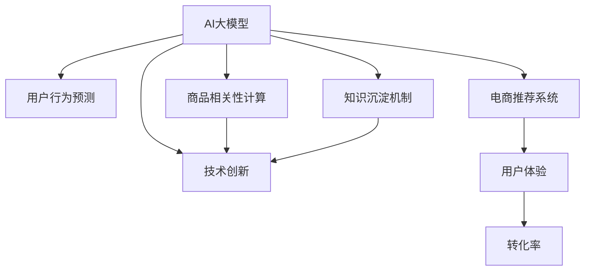

                 

# AI大模型视角下电商搜索推荐的技术创新知识沉淀机制优化

## 1. 背景介绍

随着人工智能技术的不断发展，电商搜索推荐系统逐渐由传统的基于规则和人工特征的方案，转变为基于AI大模型的深度学习方案。AI大模型通过海量数据训练，提取用户行为与商品特征的深层关联，能够更好地理解用户需求，提供个性化推荐，极大地提升了电商平台的用户体验和转化率。

然而，随着业务场景的快速变化，电商搜索推荐系统也需要持续更新和迭代。在面对复杂多变的市场需求时，如何高效地进行技术创新和知识沉淀，成为一个重要的课题。为了系统化地探讨这一问题，本文将从AI大模型的视角，分析电商搜索推荐系统中的技术创新和知识沉淀机制，并提出一系列优化策略。

## 2. 核心概念与联系

### 2.1 核心概念概述

在本节中，我们将介绍几个与电商搜索推荐系统密切相关的核心概念，并解释它们之间的联系。

- **AI大模型**：以深度神经网络为代表的大规模模型，通过训练能够提取复杂特征和模式。在电商推荐中，大模型可用于用户行为预测、商品相关性计算等任务。
- **知识沉淀机制**：指通过系统化的方法，将AI大模型的学习经验和成果存储下来，便于后续的复用和更新。在电商推荐中，知识沉淀机制可以用于提升推荐模型的准确性和鲁棒性。
- **技术创新**：指在电商推荐系统设计和实现过程中，引入新的算法、模型或技术，以解决现有问题或提升系统性能。常见的技术创新包括增强学习、因果推理等。

这些核心概念之间相互关联，共同构成了电商搜索推荐系统的技术基础。大模型提供了强大的数据处理和特征提取能力，知识沉淀机制确保了技术创新成果的积累和复用，技术创新则推动了系统性能的不断提升。

### 2.2 核心概念原理和架构的 Mermaid 流程图



此流程图展示了AI大模型、用户行为预测、商品相关性计算、知识沉淀机制和技术创新在电商推荐系统中的作用和联系。

## 3. 核心算法原理 & 具体操作步骤

### 3.1 算法原理概述

电商搜索推荐系统的核心算法原理基于协同过滤和推荐系统的一般理论，并引入了AI大模型的深度学习框架。具体步骤如下：

1. **用户行为数据收集**：收集用户浏览、点击、购买等行为数据。
2. **特征工程**：对数据进行特征提取和预处理。
3. **大模型训练**：使用大模型（如Transformers、BERT）在处理后的数据上进行预训练。
4. **推荐模型微调**：在大模型基础上，进行微调，以适应电商推荐的任务。
5. **知识沉淀和优化**：将微调后的模型参数、特征工程方法、模型架构等存储为知识库，便于后续的复用和更新。

### 3.2 算法步骤详解

#### 步骤一：用户行为数据收集

电商平台的推荐系统需要收集用户行为数据，包括浏览历史、点击行为、购买记录等。这些数据经过清洗和预处理，成为推荐模型的输入。

#### 步骤二：特征工程

在电商推荐中，特征工程的重要性不言而喻。特征工程包括数据标准化、特征提取、特征组合等步骤。例如，可以将用户行为时间、浏览商品类别等信息作为特征输入到模型中。

#### 步骤三：大模型训练

使用大模型（如Transformer、BERT）对电商推荐任务进行预训练。预训练的过程通常包括无监督学习，如语言建模，以及特定任务的学习，如句子分类。

#### 步骤四：推荐模型微调

在大模型预训练的基础上，进行推荐模型的微调。微调的目标是最小化损失函数，使得模型在电商推荐任务上表现更佳。微调通常使用监督学习的方法，即在有标注数据的情况下进行训练。

#### 步骤五：知识沉淀和优化

将微调后的模型参数、特征工程方法、模型架构等存储为知识库，用于后续的复用和优化。例如，可以使用自动化工具进行参数调优、特征选择等，以提升模型性能。

### 3.3 算法优缺点

**优点**：

1. **高效性**：使用大模型进行电商推荐，能够快速处理大规模数据，提高推荐效率。
2. **准确性**：大模型提取特征的能力强，能够提供更为精准的推荐结果。
3. **可扩展性**：大模型可以轻易地适配不同任务和数据分布，具有较强的泛化能力。

**缺点**：

1. **资源消耗大**：大模型的训练和推理资源消耗大，需要高性能的计算设备和数据存储。
2. **解释性不足**：大模型的黑盒性质导致其推荐结果难以解释，难以满足合规要求。
3. **对抗攻击风险**：大模型容易受到对抗样本攻击，导致推荐结果出错。

### 3.4 算法应用领域

电商搜索推荐系统是AI大模型应用的典型场景之一。除了电商，类似的技术创新和知识沉淀机制也适用于金融、社交媒体、新闻推荐等多个领域。

## 4. 数学模型和公式 & 详细讲解 & 举例说明

### 4.1 数学模型构建

在电商推荐系统中，常用的数学模型包括协同过滤模型和深度学习模型。

- **协同过滤模型**：基于用户和商品之间的相似度，通过矩阵分解进行推荐。
- **深度学习模型**：使用大模型进行用户行为预测和商品相关性计算。

### 4.2 公式推导过程

以深度学习模型为例，假设使用大模型进行电商推荐，其输入为$x_i$，输出为$y_i$，损失函数为$L(y_i,\hat{y}_i)$，优化目标为最小化损失函数。具体公式如下：

$$
\min_{\theta} \frac{1}{N}\sum_{i=1}^N L(y_i, \hat{y}_i(\theta))
$$

其中，$\theta$为模型参数。

### 4.3 案例分析与讲解

假设有一个电商网站，通过收集用户的浏览记录和点击行为，使用大模型进行推荐。具体步骤如下：

1. **数据收集**：收集用户浏览和点击记录。
2. **特征提取**：将用户ID、商品ID、浏览时间等信息作为特征输入。
3. **大模型预训练**：使用大模型（如BERT）进行预训练，提取用户行为和商品特征的表示。
4. **模型微调**：在大模型预训练的基础上，使用用户行为数据进行微调，优化推荐模型。
5. **知识沉淀**：将微调后的模型参数、特征工程方法、模型架构等存储为知识库，便于后续使用。

## 5. 项目实践：代码实例和详细解释说明

### 5.1 开发环境搭建

1. **选择框架**：选择深度学习框架如TensorFlow或PyTorch进行电商推荐系统的开发。
2. **安装依赖**：安装必要的依赖库，如TensorFlow或PyTorch、Keras等。
3. **环境配置**：配置GPU环境，确保大模型能够高效运行。

### 5.2 源代码详细实现

以下是一个使用TensorFlow进行电商推荐系统的代码实现。

```python
import tensorflow as tf
from tensorflow.keras.models import Model
from tensorflow.keras.layers import Input, Dense, Embedding, Concatenate

# 定义模型
def build_model(vocab_size, embedding_dim, hidden_dim):
    user_input = Input(shape=(vocab_size,))
    item_input = Input(shape=(vocab_size,))
    user_embed = Embedding(vocab_size, embedding_dim)(user_input)
    item_embed = Embedding(vocab_size, embedding_dim)(item_input)
    concat = Concatenate()([user_embed, item_embed])
    hidden_layer = Dense(hidden_dim, activation='relu')(concat)
    output_layer = Dense(1, activation='sigmoid')(hidden_layer)
    model = Model(inputs=[user_input, item_input], outputs=output_layer)
    return model

# 训练模型
def train_model(model, train_data, validation_data, epochs):
    model.compile(optimizer='adam', loss='binary_crossentropy', metrics=['accuracy'])
    model.fit(train_data, validation_data=validation_data, epochs=epochs)
```

### 5.3 代码解读与分析

**模型定义**：
- `build_model`函数定义了电商推荐系统的模型结构，包括用户输入、商品输入、嵌入层、隐藏层和输出层。
- 使用`Embedding`层将用户ID和商品ID转换为嵌入向量。
- 使用`Concatenate`层将用户和商品的嵌入向量拼接。
- 使用`Dense`层进行非线性变换。
- 使用`Model`类将输入和输出定义为模型的输入和输出。

**模型训练**：
- `train_model`函数定义了模型训练的流程，使用`compile`方法配置优化器、损失函数和评估指标。
- 使用`fit`方法进行模型训练，指定训练数据和验证数据，以及训练轮数。

### 5.4 运行结果展示

通过以上代码实现，可以训练出一个电商推荐模型。模型在训练集和验证集上的性能表现可以通过`train_model`函数中的`fit`方法输出。

## 6. 实际应用场景

### 6.1 电商搜索推荐

电商搜索推荐是AI大模型应用最广泛的场景之一。通过使用大模型进行推荐，电商网站能够实现个性化的商品推荐，提升用户体验和转化率。

### 6.2 金融投资

金融投资中，推荐系统可用于分析用户投资行为，提供个性化的投资建议。使用大模型进行金融推荐，能够提高推荐的准确性和个性化程度。

### 6.3 新闻推荐

新闻推荐中，推荐系统用于分析用户阅读行为，推荐相关新闻内容。使用大模型进行新闻推荐，能够提高推荐的个性化和相关性。

### 6.4 未来应用展望

未来，AI大模型将在更多的领域中得到应用。随着技术的发展，预计将出现以下趋势：

1. **多模态推荐**：将文本、图像、视频等多模态数据融合，提升推荐效果。
2. **因果推荐**：使用因果推理方法，提高推荐系统的公平性和透明性。
3. **个性化推荐**：使用生成对抗网络（GAN）等技术，实现更个性化的推荐。
4. **实时推荐**：使用流式计算框架，实现实时推荐。

## 7. 工具和资源推荐

### 7.1 学习资源推荐

1. **《深度学习》书籍**：推荐阅读《深度学习》一书，了解深度学习的基本概念和实现方法。
2. **《TensorFlow官方文档》**：阅读TensorFlow官方文档，了解如何使用TensorFlow进行模型训练和部署。
3. **Kaggle竞赛**：参加Kaggle竞赛，通过实践项目提升模型构建和调优能力。

### 7.2 开发工具推荐

1. **TensorFlow**：TensorFlow是深度学习领域的主流框架，支持分布式训练和大规模模型构建。
2. **PyTorch**：PyTorch是另一个流行的深度学习框架，支持动态计算图和高效的模型训练。
3. **Jupyter Notebook**：Jupyter Notebook是一个交互式开发环境，方便快速进行模型实验和调试。

### 7.3 相关论文推荐

1. **《深度学习》论文**：深入了解深度学习的基本理论和实现方法。
2. **《电商推荐系统》论文**：了解电商推荐系统的理论和实现方法。
3. **《因果推理》论文**：了解因果推理在推荐系统中的应用。

## 8. 总结：未来发展趋势与挑战

### 8.1 研究成果总结

本文从AI大模型的视角，分析了电商搜索推荐系统中的技术创新和知识沉淀机制。通过系统化的方法，可以优化电商推荐系统的设计，提升其性能和稳定性。

### 8.2 未来发展趋势

未来，电商搜索推荐系统将迎来以下几个趋势：

1. **多模态推荐**：将文本、图像、视频等多模态数据融合，提升推荐效果。
2. **因果推荐**：使用因果推理方法，提高推荐系统的公平性和透明性。
3. **个性化推荐**：使用生成对抗网络（GAN）等技术，实现更个性化的推荐。
4. **实时推荐**：使用流式计算框架，实现实时推荐。

### 8.3 面临的挑战

尽管AI大模型在电商推荐中发挥了重要作用，但仍然面临一些挑战：

1. **数据隐私**：电商推荐系统需要处理大量用户数据，如何保护用户隐私是一个重要问题。
2. **模型可解释性**：大模型的黑盒性质导致其推荐结果难以解释，难以满足合规要求。
3. **对抗攻击**：大模型容易受到对抗样本攻击，导致推荐结果出错。

### 8.4 研究展望

未来的研究可以从以下几个方向进行：

1. **数据隐私保护**：使用差分隐私等技术，保护用户隐私。
2. **模型可解释性**：引入可解释性方法，如LIME、SHAP等，提升模型的透明度。
3. **对抗攻击防御**：引入对抗攻击防御技术，如生成对抗网络（GAN）等，增强模型的鲁棒性。

## 9. 附录：常见问题与解答

### 常见问题

**Q1：大模型在电商推荐中的具体应用是什么？**

**A1**: 大模型在电商推荐中的应用主要包括以下几个方面：
1. **用户行为预测**：使用大模型预测用户购买意愿，生成推荐列表。
2. **商品相关性计算**：使用大模型计算商品之间的相似度，推荐相关商品。
3. **个性化推荐**：使用大模型根据用户历史行为，生成个性化推荐。

**Q2：如何优化电商推荐系统的推荐效果？**

**A2**: 电商推荐系统的推荐效果可以通过以下几个方面进行优化：
1. **数据预处理**：清洗和预处理用户行为数据，提升特征提取效果。
2. **模型优化**：使用深度学习模型进行电商推荐，提升推荐准确性。
3. **知识沉淀**：将推荐模型参数和特征工程方法存储为知识库，便于后续复用。

**Q3：电商推荐系统中的大模型应该如何选择？**

**A3**: 电商推荐系统中的大模型可以根据以下几个方面进行选择：
1. **模型规模**：选择具有较大规模的大模型，能够更好地处理大规模数据。
2. **预训练任务**：选择适合电商推荐任务的大模型，如BERT、GPT等。
3. **推理速度**：选择推理速度较快的大模型，提高推荐系统响应速度。

**Q4：电商推荐系统中的知识沉淀机制如何实现？**

**A4**: 电商推荐系统中的知识沉淀机制可以通过以下几个步骤实现：
1. **参数存储**：将微调后的模型参数存储为知识库。
2. **特征工程**：将特征工程方法存储为知识库，便于后续复用。
3. **模型架构**：将推荐模型架构存储为知识库，便于后续优化。

### 解答

**A1**: 大模型在电商推荐中的应用主要包括以下几个方面：
1. **用户行为预测**：使用大模型预测用户购买意愿，生成推荐列表。
2. **商品相关性计算**：使用大模型计算商品之间的相似度，推荐相关商品。
3. **个性化推荐**：使用大模型根据用户历史行为，生成个性化推荐。

**A2**: 电商推荐系统的推荐效果可以通过以下几个方面进行优化：
1. **数据预处理**：清洗和预处理用户行为数据，提升特征提取效果。
2. **模型优化**：使用深度学习模型进行电商推荐，提升推荐准确性。
3. **知识沉淀**：将推荐模型参数和特征工程方法存储为知识库，便于后续复用。

**A3**: 电商推荐系统中的大模型可以根据以下几个方面进行选择：
1. **模型规模**：选择具有较大规模的大模型，能够更好地处理大规模数据。
2. **预训练任务**：选择适合电商推荐任务的大模型，如BERT、GPT等。
3. **推理速度**：选择推理速度较快的大模型，提高推荐系统响应速度。

**A4**: 电商推荐系统中的知识沉淀机制可以通过以下几个步骤实现：
1. **参数存储**：将微调后的模型参数存储为知识库。
2. **特征工程**：将特征工程方法存储为知识库，便于后续复用。
3. **模型架构**：将推荐模型架构存储为知识库，便于后续优化。

---

作者：禅与计算机程序设计艺术 / Zen and the Art of Computer Programming

