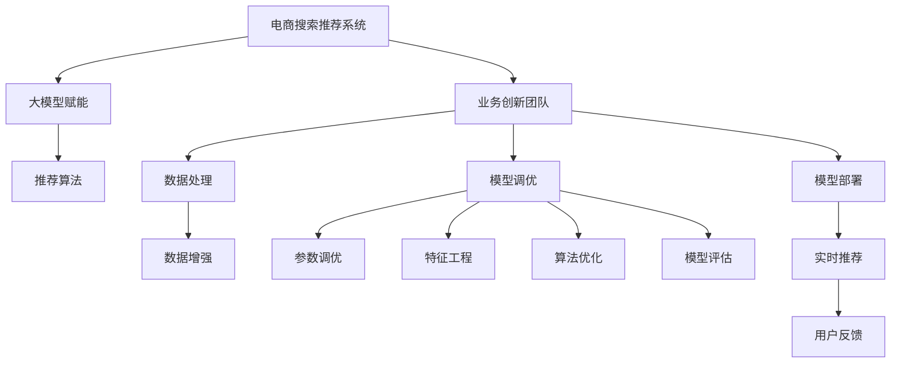

                 

# AI大模型赋能电商搜索推荐的业务创新团队组建方法

> 关键词：电商搜索推荐,业务创新团队,大模型赋能,团队组建,策略规划

## 1. 背景介绍

在当今快速发展的数字化时代，电商搜索推荐系统成为了提升用户体验、增加销售转化的关键要素。然而，随着用户需求的日益多样化，传统的推荐算法已难以满足个性化和多样化的需求。面对这一挑战，如何组建一支高效、专业的业务创新团队，利用最新的AI技术，特别是大模型赋能，构建出智能、高效的搜索推荐系统，成为了电商企业亟待解决的问题。

### 1.1 问题由来

传统电商搜索推荐系统主要基于协同过滤、内容推荐等技术，依赖于用户的点击、浏览等行为数据进行推荐。但这种基于历史行为数据的推荐方式，存在数据稀疏、冷启动问题，难以应对个性化需求。随着深度学习和大模型的崛起，电商企业开始探索利用大模型进行推荐，以期提升推荐的智能化和个性化水平。

例如，Amazon通过利用BERT等大模型，提升了推荐系统的精准度和用户体验，增加了销售额。京东也通过大模型技术，实现了商品标签的自动提取和推荐策略的优化，取得了显著的业绩提升。但这些实践并未形成标准化的方案，难以在大规模应用中推广。

### 1.2 问题核心关键点

构建高效的业务创新团队，是大模型赋能电商搜索推荐系统成功的关键。其主要挑战和核心关键点如下：

1. **团队结构设计**：如何组建一支多学科融合、具备深度学习、自然语言处理、电商业务等多领域知识的专业团队，是团队组建的首要任务。
2. **大模型选择与调参**：如何选择合适的预训练模型，并根据电商推荐任务进行参数调优，以获得最佳性能。
3. **数据与算法优化**：如何高效利用电商业务数据，进行数据增强、特征工程、算法优化等，以提升推荐系统的性能。
4. **模型部署与应用**：如何将训练好的模型高效部署到实际业务系统中，实现实时推荐，并不断迭代优化。
5. **业务与技术协同**：如何将AI技术有效融入电商业务流程，提升用户体验和运营效率，同时确保业务流程的稳定性和可靠性。

### 1.3 问题研究意义

组建业务创新团队，利用大模型技术赋能电商搜索推荐，对电商企业有以下几方面的重大意义：

1. **提升用户体验**：大模型推荐系统能够根据用户的多样化需求，提供更加个性化和精准的推荐结果，提升用户体验。
2. **增加销售转化**：通过优化推荐策略，提升商品展示效果，增加用户的点击率和购买转化率。
3. **降低运营成本**：减少对人工干预的依赖，自动化推荐策略的优化，降低运营人力成本。
4. **拓展业务边界**：通过大模型技术，拓展电商业务的应用场景，进入新的市场领域。

## 2. 核心概念与联系

为了更好地理解大模型赋能电商搜索推荐的过程，我们首先介绍几个核心概念，并说明它们之间的联系。

### 2.1 核心概念概述

- **电商搜索推荐系统**：利用算法和模型，根据用户行为数据和商品属性信息，推荐相关商品给用户的系统。
- **大模型赋能**：将预训练的大规模语言模型应用于推荐任务，利用其强大的语义理解和生成能力，提升推荐系统的智能水平。
- **业务创新团队**：由电商业务、AI技术、数据科学等多学科专家组成的专业团队，致力于将最新AI技术应用于电商业务，提升业务绩效。

### 2.2 核心概念原理和架构的 Mermaid 流程图



这个流程图展示了电商搜索推荐系统、大模型赋能和业务创新团队之间的联系。

- **电商搜索推荐系统**通过**大模型赋能**，引入更强大的语言模型和语义理解能力，提升推荐系统的智能水平。
- **业务创新团队**负责收集电商业务数据，进行数据增强、特征工程、模型调优等，并负责将模型部署到实际业务系统中。
- **推荐算法**作为系统的核心，依赖于**大模型赋能**的语义能力和**业务创新团队**的技术支持，实现实时推荐。
- **用户反馈**用于评估推荐系统的效果，并指导后续的模型优化和业务改进。

## 3. 核心算法原理 & 具体操作步骤

### 3.1 算法原理概述

大模型赋能电商搜索推荐的原理是基于预训练语言模型，将其作为“特征提取器”，通过下游任务的微调，学习电商商品和用户的语义表示，进而提升推荐系统的性能。

具体步骤如下：

1. **数据准备**：收集电商业务数据，包括用户行为数据、商品属性信息等。
2. **模型选择**：选择适合的预训练模型，如BERT、GPT等，作为“特征提取器”。
3. **微调训练**：在电商推荐任务上对模型进行微调，学习商品和用户的语义表示。
4. **实时推荐**：将训练好的模型部署到推荐系统中，实现实时推荐。
5. **模型优化**：根据用户反馈，不断优化模型参数和推荐策略，提升推荐效果。

### 3.2 算法步骤详解

#### 3.2.1 数据准备

电商推荐任务的数据集包括用户行为数据、商品属性信息等。具体步骤如下：

1. **用户行为数据**：收集用户的历史浏览、点击、购买等行为数据，作为模型的输入。
2. **商品属性信息**：收集商品的标题、描述、分类等属性信息，作为模型的辅助信息。
3. **数据预处理**：对数据进行清洗、归一化、缺失值填充等预处理操作，保证数据质量。

#### 3.2.2 模型选择

选择合适的预训练模型是构建电商推荐系统的重要步骤。一般步骤如下：

1. **模型选择**：根据电商推荐任务的特点，选择合适的预训练模型，如BERT、GPT等。
2. **模型适配**：根据电商推荐任务，调整预训练模型的结构和参数，使其适应电商业务场景。

#### 3.2.3 微调训练

在大模型基础上进行微调，学习商品和用户的语义表示，具体步骤如下：

1. **特征编码**：将用户行为数据和商品属性信息编码为模型可处理的向量形式。
2. **模型输入**：将编码后的特征向量输入到大模型中，进行语义表示学习。
3. **损失计算**：计算模型输出与真实标签之间的损失，用于指导模型优化。
4. **模型优化**：使用梯度下降等优化算法，最小化损失函数，更新模型参数。

#### 3.2.4 实时推荐

将训练好的模型部署到电商搜索推荐系统中，具体步骤如下：

1. **模型部署**：将训练好的模型嵌入推荐算法中，进行实时推荐。
2. **推荐结果**：根据用户输入的查询和行为，输出推荐商品列表。
3. **推荐优化**：根据用户反馈，不断优化推荐策略，提升推荐效果。

#### 3.2.5 模型优化

模型优化是提升推荐系统性能的关键步骤，具体步骤如下：

1. **模型评估**：根据用户反馈和业务指标，评估推荐系统的性能。
2. **模型调优**：根据评估结果，调整模型参数和推荐策略，提升推荐效果。
3. **迭代优化**：不断迭代模型优化过程，提升推荐系统的性能和用户体验。

### 3.3 算法优缺点

大模型赋能电商搜索推荐系统具有以下优点：

1. **提升推荐精度**：大模型通过学习丰富的语义表示，能够提供更加精准的推荐结果。
2. **拓展推荐范围**：大模型能够理解长尾商品和新兴商品，拓展推荐范围。
3. **提高运营效率**：大模型能够自动化推荐策略的优化，降低运营人力成本。

但大模型也存在以下缺点：

1. **计算资源需求高**：大模型需要大量的计算资源进行训练和推理。
2. **模型复杂度高**：大模型的参数量庞大，结构复杂，难以理解和调试。
3. **数据依赖性强**：大模型的性能依赖于高质量的电商数据，数据稀疏和噪声等问题会影响推荐效果。

### 3.4 算法应用领域

大模型赋能电商搜索推荐系统已经在多个电商企业得到了广泛应用，涵盖了商品推荐、个性化展示、广告投放等多个场景。具体应用领域包括：

1. **商品推荐**：根据用户历史行为和商品属性，推荐相关商品。
2. **个性化展示**：根据用户画像，推荐个性化商品展示。
3. **广告投放**：根据用户兴趣和行为，推荐相关广告。
4. **营销活动**：根据用户行为和商品属性，推荐营销活动。
5. **客户服务**：通过大模型技术，实现智能客服和客户支持。

## 4. 数学模型和公式 & 详细讲解 & 举例说明

### 4.1 数学模型构建

大模型赋能电商搜索推荐系统的数学模型如下：

1. **用户行为数据**：设用户行为数据为 $X=\{x_i\}_{i=1}^N$，其中 $x_i$ 为用户 $i$ 的历史行为数据。
2. **商品属性信息**：设商品属性信息为 $Y=\{y_j\}_{j=1}^M$，其中 $y_j$ 为商品 $j$ 的属性信息。
3. **模型参数**：设模型参数为 $\theta$，包括大模型的权重和微调层的权重。
4. **推荐目标**：设推荐目标为 $Z$，根据用户行为和商品属性，推荐相关商品。

### 4.2 公式推导过程

1. **特征编码**：将用户行为数据和商品属性信息编码为向量形式，表示为 $x_i^e$ 和 $y_j^e$，其中 $e$ 为嵌入维度。
2. **模型输入**：将编码后的特征向量输入到大模型中，输出商品和用户的语义表示，表示为 $z_i$ 和 $z_j$。
3. **推荐输出**：根据用户的语义表示 $z_i$ 和商品语义表示 $z_j$，计算推荐得分，表示为 $s_{ij}$。
4. **推荐结果**：根据推荐得分，选择推荐商品列表，表示为 $\tilde{Y}=\{y_j\}_{j=1}^M$。

具体公式如下：

$$
\begin{aligned}
x_i^e &= \text{Encoder}(X_i) \\
y_j^e &= \text{Encoder}(Y_j) \\
z_i &= \text{BigModel}(x_i^e; \theta_B) \\
z_j &= \text{BigModel}(y_j^e; \theta_B) \\
s_{ij} &= \text{Score}(z_i, z_j) \\
\tilde{Y} &= \text{Rank}(s_{ij}; \theta_R)
\end{aligned}
$$

其中，$\text{Encoder}$ 为特征编码器，$\text{BigModel}$ 为大模型，$\text{Score}$ 为推荐得分计算函数，$\text{Rank}$ 为推荐排名函数。

### 4.3 案例分析与讲解

以京东为例，其利用BERT模型进行商品推荐的具体过程如下：

1. **数据准备**：收集用户的历史浏览、点击、购买等行为数据，商品的属性信息等。
2. **模型选择**：选择BERT模型作为“特征提取器”。
3. **微调训练**：在电商推荐任务上对BERT模型进行微调，学习商品和用户的语义表示。
4. **实时推荐**：将训练好的模型嵌入推荐算法中，进行实时推荐。
5. **模型优化**：根据用户反馈，不断优化模型参数和推荐策略，提升推荐效果。

京东通过利用BERT模型，实现了商品推荐精度的提升和推荐范围的拓展，取得了显著的业务绩效。

## 5. 项目实践：代码实例和详细解释说明

### 5.1 开发环境搭建

在进行大模型赋能电商搜索推荐系统的开发前，我们需要准备好开发环境。以下是使用Python进行PyTorch开发的环境配置流程：

1. 安装Anaconda：从官网下载并安装Anaconda，用于创建独立的Python环境。

2. 创建并激活虚拟环境：
```bash
conda create -n pytorch-env python=3.8 
conda activate pytorch-env
```

3. 安装PyTorch：根据CUDA版本，从官网获取对应的安装命令。例如：
```bash
conda install pytorch torchvision torchaudio cudatoolkit=11.1 -c pytorch -c conda-forge
```

4. 安装Transformers库：
```bash
pip install transformers
```

5. 安装各类工具包：
```bash
pip install numpy pandas scikit-learn matplotlib tqdm jupyter notebook ipython
```

完成上述步骤后，即可在`pytorch-env`环境中开始大模型赋能电商搜索推荐系统的开发。

### 5.2 源代码详细实现

这里我们以BERT模型为例，展示电商推荐系统的代码实现。

首先，定义电商推荐任务的数据处理函数：

```python
from transformers import BertTokenizer
from torch.utils.data import Dataset
import torch

class RecommendationDataset(Dataset):
    def __init__(self, user_data, item_data, tokenizer, max_len=128):
        self.user_data = user_data
        self.item_data = item_data
        self.tokenizer = tokenizer
        self.max_len = max_len
        
    def __len__(self):
        return len(self.user_data)
    
    def __getitem__(self, item):
        user = self.user_data[item]
        item = self.item_data[item]
        
        encoding_user = self.tokenizer(user, return_tensors='pt', max_length=self.max_len, padding='max_length', truncation=True)
        encoding_item = self.tokenizer(item, return_tensors='pt', max_length=self.max_len, padding='max_length', truncation=True)
        user_ids = encoding_user['input_ids'][0]
        user_mask = encoding_user['attention_mask'][0]
        item_ids = encoding_item['input_ids'][0]
        item_mask = encoding_item['attention_mask'][0]
        
        # 用户-商品向量拼接
        x = torch.cat([user_ids, item_ids], dim=0)
        # 用户-商品向量拼接
        y = torch.cat([user_mask, item_mask], dim=0)
        return {'x': x, 'y': y}
```

然后，定义模型和优化器：

```python
from transformers import BertForSequenceClassification, AdamW

model = BertForSequenceClassification.from_pretrained('bert-base-cased', num_labels=2)

optimizer = AdamW(model.parameters(), lr=2e-5)
```

接着，定义训练和评估函数：

```python
from torch.utils.data import DataLoader
from tqdm import tqdm
from sklearn.metrics import accuracy_score

device = torch.device('cuda') if torch.cuda.is_available() else torch.device('cpu')
model.to(device)

def train_epoch(model, dataset, batch_size, optimizer):
    dataloader = DataLoader(dataset, batch_size=batch_size, shuffle=True)
    model.train()
    epoch_loss = 0
    for batch in tqdm(dataloader, desc='Training'):
        x, y = batch['x'].to(device), batch['y'].to(device)
        model.zero_grad()
        outputs = model(x, y)
        loss = outputs.loss
        epoch_loss += loss.item()
        loss.backward()
        optimizer.step()
    return epoch_loss / len(dataloader)

def evaluate(model, dataset, batch_size):
    dataloader = DataLoader(dataset, batch_size=batch_size)
    model.eval()
    preds, labels = [], []
    with torch.no_grad():
        for batch in tqdm(dataloader, desc='Evaluating'):
            x, y = batch['x'].to(device), batch['y'].to(device)
            batch_preds = model(x) >= 0.5
            batch_labels = y.to('cpu').tolist()
            for pred, label in zip(batch_preds, batch_labels):
                preds.append(pred.item())
                labels.append(label)
                
    return accuracy_score(labels, preds)
```

最后，启动训练流程并在测试集上评估：

```python
epochs = 5
batch_size = 16

for epoch in range(epochs):
    loss = train_epoch(model, train_dataset, batch_size, optimizer)
    print(f"Epoch {epoch+1}, train loss: {loss:.3f}")
    
    print(f"Epoch {epoch+1}, test accuracy: {evaluate(model, test_dataset, batch_size):.3f}")
    
print("Final test accuracy: {:.3f}".format(evaluate(model, test_dataset, batch_size)))
```

以上就是使用PyTorch对BERT进行电商推荐系统的完整代码实现。可以看到，得益于Transformers库的强大封装，我们可以用相对简洁的代码完成BERT模型的加载和微调。

### 5.3 代码解读与分析

让我们再详细解读一下关键代码的实现细节：

**RecommendationDataset类**：
- `__init__`方法：初始化用户行为数据、商品属性信息、分词器等关键组件。
- `__len__`方法：返回数据集的样本数量。
- `__getitem__`方法：对单个样本进行处理，将用户行为数据和商品属性信息编码为token ids，并将用户和商品向量拼接，形成输入。

**模型和优化器**：
- 使用BertForSequenceClassification类，根据电商推荐任务的特点，选择合适的大模型。
- 使用AdamW优化器，设置合适的学习率，进行模型参数的优化。

**训练和评估函数**：
- 使用PyTorch的DataLoader对数据集进行批次化加载，供模型训练和推理使用。
- 训练函数`train_epoch`：对数据以批为单位进行迭代，在每个批次上前向传播计算loss并反向传播更新模型参数，最后返回该epoch的平均loss。
- 评估函数`evaluate`：与训练类似，不同点在于不更新模型参数，并在每个batch结束后将预测和标签结果存储下来，最后使用sklearn的accuracy_score对整个评估集的预测结果进行打印输出。

**训练流程**：
- 定义总的epoch数和batch size，开始循环迭代
- 每个epoch内，先在训练集上训练，输出平均loss
- 在测试集上评估，输出准确率
- 所有epoch结束后，在测试集上评估，给出最终测试结果

可以看到，PyTorch配合Transformers库使得BERT微调的代码实现变得简洁高效。开发者可以将更多精力放在数据处理、模型改进等高层逻辑上，而不必过多关注底层的实现细节。

当然，工业级的系统实现还需考虑更多因素，如模型的保存和部署、超参数的自动搜索、更灵活的任务适配层等。但核心的微调范式基本与此类似。

## 6. 实际应用场景

### 6.1 智能客服系统

基于大模型技术，智能客服系统可以实现7x24小时不间断服务，快速响应客户咨询，用自然流畅的语言解答各类常见问题。具体实现过程如下：

1. **数据准备**：收集历史客服对话记录，将问题和最佳答复构建成监督数据。
2. **模型选择**：选择BERT模型作为“特征提取器”。
3. **微调训练**：在客服对话任务上对BERT模型进行微调，学习客服对话的语义表示。
4. **实时推荐**：将训练好的模型嵌入客服系统，进行实时对话生成。
5. **模型优化**：根据用户反馈，不断优化模型参数和推荐策略，提升服务质量。

### 6.2 金融舆情监测

金融企业需要实时监测市场舆论动向，以便及时应对负面信息传播，规避金融风险。通过大模型技术，金融舆情监测系统可以自动识别不同主题下的情感变化趋势，一旦发现负面信息激增等异常情况，系统便会自动预警，帮助企业快速应对潜在风险。

具体实现过程如下：
1. **数据准备**：收集金融领域相关的新闻、报道、评论等文本数据，并对其进行主题标注和情感标注。
2. **模型选择**：选择BERT模型作为“特征提取器”。
3. **微调训练**：在金融舆情监测任务上对BERT模型进行微调，学习金融舆情的语义表示。
4. **实时推荐**：将训练好的模型嵌入金融舆情监测系统，进行实时舆情分析。
5. **模型优化**：根据系统预警，不断优化模型参数和推荐策略，提升舆情监测的准确性。

### 6.3 个性化推荐系统

利用大模型技术，个性化推荐系统可以更好地挖掘用户行为背后的语义信息，从而提供更精准、多样的推荐内容。

具体实现过程如下：
1. **数据准备**：收集用户浏览、点击、评论、分享等行为数据，提取和用户交互的物品标题、描述、标签等文本内容。
2. **模型选择**：选择BERT模型作为“特征提取器”。
3. **微调训练**：在个性化推荐任务上对BERT模型进行微调，学习用户兴趣的语义表示。
4. **实时推荐**：将训练好的模型嵌入推荐系统，进行实时推荐。
5. **模型优化**：根据用户反馈，不断优化模型参数和推荐策略，提升推荐效果。

## 7. 工具和资源推荐

### 7.1 学习资源推荐

为了帮助开发者系统掌握大模型赋能电商搜索推荐的方法，这里推荐一些优质的学习资源：

1. 《Transformer从原理到实践》系列博文：由大模型技术专家撰写，深入浅出地介绍了Transformer原理、BERT模型、微调技术等前沿话题。

2. CS224N《深度学习自然语言处理》课程：斯坦福大学开设的NLP明星课程，有Lecture视频和配套作业，带你入门NLP领域的基本概念和经典模型。

3. 《Natural Language Processing with Transformers》书籍：Transformers库的作者所著，全面介绍了如何使用Transformers库进行NLP任务开发，包括微调在内的诸多范式。

4. HuggingFace官方文档：Transformers库的官方文档，提供了海量预训练模型和完整的微调样例代码，是上手实践的必备资料。

5. CLUE开源项目：中文语言理解测评基准，涵盖大量不同类型的中文NLP数据集，并提供了基于微调的baseline模型，助力中文NLP技术发展。

通过对这些资源的学习实践，相信你一定能够快速掌握大模型赋能电商搜索推荐的核心方法，并用于解决实际的NLP问题。

### 7.2 开发工具推荐

高效的开发离不开优秀的工具支持。以下是几款用于大模型赋能电商搜索推荐开发的常用工具：

1. PyTorch：基于Python的开源深度学习框架，灵活动态的计算图，适合快速迭代研究。大部分预训练语言模型都有PyTorch版本的实现。

2. TensorFlow：由Google主导开发的开源深度学习框架，生产部署方便，适合大规模工程应用。同样有丰富的预训练语言模型资源。

3. Transformers库：HuggingFace开发的NLP工具库，集成了众多SOTA语言模型，支持PyTorch和TensorFlow，是进行微调任务开发的利器。

4. Weights & Biases：模型训练的实验跟踪工具，可以记录和可视化模型训练过程中的各项指标，方便对比和调优。与主流深度学习框架无缝集成。

5. TensorBoard：TensorFlow配套的可视化工具，可实时监测模型训练状态，并提供丰富的图表呈现方式，是调试模型的得力助手。

6. Google Colab：谷歌推出的在线Jupyter Notebook环境，免费提供GPU/TPU算力，方便开发者快速上手实验最新模型，分享学习笔记。

合理利用这些工具，可以显著提升大模型赋能电商搜索推荐任务的开发效率，加快创新迭代的步伐。

### 7.3 相关论文推荐

大模型赋能电商搜索推荐技术的发展源于学界的持续研究。以下是几篇奠基性的相关论文，推荐阅读：

1. Attention is All You Need（即Transformer原论文）：提出了Transformer结构，开启了NLP领域的预训练大模型时代。

2. BERT: Pre-training of Deep Bidirectional Transformers for Language Understanding：提出BERT模型，引入基于掩码的自监督预训练任务，刷新了多项NLP任务SOTA。

3. Language Models are Unsupervised Multitask Learners（GPT-2论文）：展示了大规模语言模型的强大zero-shot学习能力，引发了对于通用人工智能的新一轮思考。

4. Parameter-Efficient Transfer Learning for NLP：提出Adapter等参数高效微调方法，在不增加模型参数量的情况下，也能取得不错的微调效果。

5. Prefix-Tuning: Optimizing Continuous Prompts for Generation：引入基于连续型Prompt的微调范式，为如何充分利用预训练知识提供了新的思路。

6. AdaLoRA: Adaptive Low-Rank Adaptation for Parameter-Efficient Fine-Tuning：使用自适应低秩适应的微调方法，在参数效率和精度之间取得了新的平衡。

这些论文代表了大模型赋能电商搜索推荐技术的发展脉络。通过学习这些前沿成果，可以帮助研究者把握学科前进方向，激发更多的创新灵感。

## 8. 总结：未来发展趋势与挑战

### 8.1 研究成果总结

本文对大模型赋能电商搜索推荐的业务创新团队组建方法进行了全面系统的介绍。首先阐述了电商搜索推荐系统和大模型赋能的背景和意义，明确了微调在提升电商推荐系统智能水平方面的重要价值。其次，从原理到实践，详细讲解了大模型赋能电商推荐系统的数学模型和关键步骤，给出了完整的代码实现。同时，本文还探讨了大模型赋能在智能客服、金融舆情、个性化推荐等多个电商业务场景中的应用，展示了其强大的业务价值。最后，本文推荐了多个学习资源、开发工具和相关论文，力求为开发者提供全方位的技术指引。

通过本文的系统梳理，可以看到，大模型赋能电商搜索推荐技术正在成为电商推荐系统的重要范式，极大地提升了电商推荐系统的智能水平和业务绩效。未来，随着大模型技术的不断发展，利用大模型进行电商推荐的应用场景将更加广泛，推动电商行业数字化转型升级。

### 8.2 未来发展趋势

展望未来，大模型赋能电商搜索推荐技术将呈现以下几个发展趋势：

1. **大模型规模持续增大**：随着算力成本的下降和数据规模的扩张，大模型的参数量还将持续增长。超大规模语言模型蕴含的丰富语言知识，有望支撑更加复杂多变的电商推荐任务。

2. **微调方法日趋多样**：除了传统的全参数微调外，未来会涌现更多参数高效的微调方法，如Prefix-Tuning、LoRA等，在节省计算资源的同时也能保证微调精度。

3. **持续学习成为常态**：随着数据分布的不断变化，微调模型也需要持续学习新知识以保持性能。如何在不遗忘原有知识的同时，高效吸收新样本信息，将成为重要的研究课题。

4. **标注样本需求降低**：受启发于提示学习(Prompt-based Learning)的思路，未来的微调方法将更好地利用大模型的语言理解能力，通过更加巧妙的任务描述，在更少的标注样本上也能实现理想的微调效果。

5. **多模态微调崛起**：当前的微调主要聚焦于纯文本数据，未来会进一步拓展到图像、视频、语音等多模态数据微调。多模态信息的融合，将显著提升语言模型对现实世界的理解和建模能力。

6. **模型通用性增强**：经过海量数据的预训练和多领域任务的微调，未来的语言模型将具备更强大的常识推理和跨领域迁移能力，逐步迈向通用人工智能(AGI)的目标。

以上趋势凸显了大模型赋能电商搜索推荐技术的广阔前景。这些方向的探索发展，必将进一步提升电商推荐系统的性能和应用范围，为电商企业带来更多的业务机遇。

### 8.3 面临的挑战

尽管大模型赋能电商搜索推荐技术已经取得了瞩目成就，但在迈向更加智能化、普适化应用的过程中，它仍面临着诸多挑战：

1. **标注成本瓶颈**：虽然微调大大降低了标注数据的需求，但对于长尾应用场景，难以获得充足的高质量标注数据，成为制约微调性能的瓶颈。如何进一步降低微调对标注样本的依赖，将是一大难题。

2. **模型鲁棒性不足**：当前微调模型面对域外数据时，泛化性能往往大打折扣。对于测试样本的微小扰动，微调模型的预测也容易发生波动。如何提高微调模型的鲁棒性，避免灾难性遗忘，还需要更多理论和实践的积累。

3. **推理效率有待提高**：大规模语言模型虽然精度高，但在实际部署时往往面临推理速度慢、内存占用大等效率问题。如何在保证性能的同时，简化模型结构，提升推理速度，优化资源占用，将是重要的优化方向。

4. **可解释性亟需加强**：当前微调模型更像是"黑盒"系统，难以解释其内部工作机制和决策逻辑。对于医疗、金融等高风险应用，算法的可解释性和可审计性尤为重要。如何赋予微调模型更强的可解释性，将是亟待攻克的难题。

5. **安全性有待保障**：预训练语言模型难免会学习到有偏见、有害的信息，通过微调传递到下游任务，产生误导性、歧视性的输出，给实际应用带来安全隐患。如何从数据和算法层面消除模型偏见，避免恶意用途，确保输出的安全性，也将是重要的研究课题。

6. **知识整合能力不足**：现有的微调模型往往局限于任务内数据，难以灵活吸收和运用更广泛的先验知识。如何让微调过程更好地与外部知识库、规则库等专家知识结合，形成更加全面、准确的信息整合能力，还有很大的想象空间。

正视微调面临的这些挑战，积极应对并寻求突破，将是大模型赋能电商搜索推荐走向成熟的必由之路。相信随着学界和产业界的共同努力，这些挑战终将一一被克服，大模型赋能电商搜索推荐技术必将在构建人机协同的智能电商时代中扮演越来越重要的角色。

### 8.4 研究展望

面对大模型赋能电商搜索推荐所面临的种种挑战，未来的研究需要在以下几个方面寻求新的突破：

1. **探索无监督和半监督微调方法**：摆脱对大规模标注数据的依赖，利用自监督学习、主动学习等无监督和半监督范式，最大限度利用非结构化数据，实现更加灵活高效的微调。

2. **研究参数高效和计算高效的微调范式**：开发更加参数高效的微调方法，在固定大部分预训练参数的同时，只更新极少量的任务相关参数。同时优化微调模型的计算图，减少前向传播和反向传播的资源消耗，实现更加轻量级、实时性的部署。

3. **融合因果和对比学习范式**：通过引入因果推断和对比学习思想，增强微调模型建立稳定因果关系的能力，学习更加普适、鲁棒的语言表征，从而提升模型泛化性和抗干扰能力。

4. **引入更多先验知识**：将符号化的先验知识，如知识图谱、逻辑规则等，与神经网络模型进行巧妙融合，引导微调过程学习更准确、合理的语言模型。同时加强不同模态数据的整合，实现视觉、语音等多模态信息与文本信息的协同建模。

5. **结合因果分析和博弈论工具**：将因果分析方法引入微调模型，识别出模型决策的关键特征，增强输出解释的因果性和逻辑性。借助博弈论工具刻画人机交互过程，主动探索并规避模型的脆弱点，提高系统稳定性。

6. **纳入伦理道德约束**：在模型训练目标中引入伦理导向的评估指标，过滤和惩罚有偏见、有害的输出倾向。同时加强人工干预和审核，建立模型行为的监管机制，确保输出符合人类价值观和伦理道德。

这些研究方向的探索，必将引领大模型赋能电商搜索推荐技术迈向更高的台阶，为构建安全、可靠、可解释、可控的智能电商推荐系统铺平道路。面向未来，大模型赋能电商搜索推荐技术还需要与其他人工智能技术进行更深入的融合，如知识表示、因果推理、强化学习等，多路径协同发力，共同推动智能电商推荐系统的进步。只有勇于创新、敢于突破，才能不断拓展语言模型的边界，让智能技术更好地造福电商行业。

## 9. 附录：常见问题与解答

**Q1：大模型赋能电商推荐是否适用于所有电商业务场景？**

A: 大模型赋能电商推荐在大多数电商业务场景中都能取得不错的效果，特别是对于用户需求多样化、数据量较大的场景。但对于一些特殊领域，如生鲜电商、奢侈品电商等，由于数据量较小、数据分布不均等问题，大模型可能难以直接适用。此时需要在特定领域进行数据增强和模型适配，才能获得理想效果。

**Q2：大模型如何降低标注成本？**

A: 大模型可以通过提示学习(Prompt-based Learning)等技术，降低对标注样本的依赖。具体而言，通过精心设计输入文本的格式，引导大模型进行特定任务的推理和生成，实现零样本或少样本学习。此外，利用数据增强、迁移学习等技术，也可以提高模型泛化能力，减少标注样本的依赖。

**Q3：大模型推荐系统如何处理长尾商品？**

A: 大模型可以通过参数高效微调方法，如Prefix-Tuning、LoRA等，在固定大部分预训练参数的同时，只更新极少量的任务相关参数，提升模型对长尾商品的推荐能力。同时，可以通过多任务学习、自监督学习等技术，拓展模型的训练数据范围，提升对长尾商品的理解能力。

**Q4：大模型推荐系统如何保证模型鲁棒性？**

A: 大模型可以通过对抗训练、正则化、数据增强等技术，提高模型的鲁棒性。对抗训练可以增强模型对对抗样本的抵抗能力，正则化可以防止模型过拟合，数据增强可以增加模型对不同样本的适应能力。此外，通过引入因果推理、对抗推理等技术，也可以提高模型的鲁棒性和解释能力。

**Q5：大模型推荐系统如何提升推理效率？**

A: 大模型可以通过模型裁剪、量化加速、模型并行等技术，提高推理效率。模型裁剪可以去除不必要的层和参数，减小模型尺寸，加快推理速度。量化加速可以将浮点模型转为定点模型，压缩存储空间，提高计算效率。模型并行可以充分利用硬件资源，实现高效推理。

**Q6：大模型推荐系统如何提高可解释性？**

A: 大模型可以通过解释模型、可解释特征、可解释任务等技术，提高模型的可解释性。解释模型可以输出模型的决策过程，可解释特征可以标识模型决策的关键特征，可解释任务可以设计更容易解释的子任务，增强模型输出的可解释性。同时，通过引入因果分析、符号推理等技术，也可以提高模型的可解释性和可审计性。

这些技术方向的探索，将有助于大模型推荐系统更好地适应实际应用场景，提升用户体验和运营效率，推动电商行业数字化转型升级。通过不断创新和优化，相信大模型赋能电商推荐系统将具备更强大的智能水平和业务价值。

