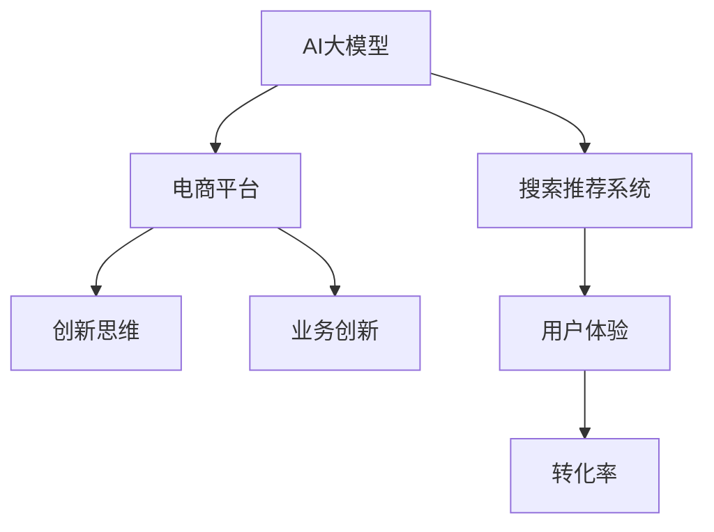

                 

# AI大模型赋能电商搜索推荐的业务创新思维培训课程体系优化实践

## 1. 背景介绍

随着互联网电商市场的迅猛发展，各大电商平台需要不断优化搜索推荐系统，提升用户体验和转化率。在如此高度竞争的业务环境下，电商平台需要深度挖掘自身数据优势，并借助大模型的强大能力进行业务创新。AI大模型不仅能有效提升搜索推荐系统的性能，还能催生新的业务模式和产品形态，驱动电商业务创新。

近年来，各大电商平台逐渐在搜索推荐系统中引入大模型，通过模型进行用户行为分析、商品特征抽取、排序策略优化等，提升推荐系统的质量和效率。例如，京东利用其自研的面向电商平台的大模型模型JSCNN-MLP，大幅提升了推荐系统的效果。淘宝、拼多多等也引入类似的模型，进一步优化搜索推荐功能。

## 2. 核心概念与联系

### 2.1 核心概念概述

为更好地理解AI大模型在电商搜索推荐系统中的应用，本节将介绍几个密切相关的核心概念：

- AI大模型(AI Large Model)：指基于深度学习技术，参数量达亿级，具备强大泛化能力的模型，如BERT、GPT、DALL-E等。通过在大规模数据集上预训练，AI大模型能够学习丰富的语言或图像知识，适用于多种任务，例如文本生成、图像生成、自然语言理解等。

- 搜索推荐系统(Recommendation System)：指通过用户行为数据、商品信息等，对用户进行画像建模，匹配并推荐最适合的商品，提升用户体验和转化率的技术。常见的推荐系统包括协同过滤、基于内容的推荐、深度学习推荐等。

- 电商平台(E-Commerce Platform)：指通过互联网平台进行的商品销售服务，包括B2B、B2C、C2C等多种形式。平台借助各种技术手段提升运营效率和用户体验，如搜索推荐、个性化推荐、内容营销等。

- 创新思维(Inductive Thinking)：指通过大数据、AI模型等手段，结合业务实际，对传统运营模式进行创新，驱动业务增长的一种思维方式。

- 业务创新(Business Innovation)：指通过产品形态、服务模式等创新，拓展新市场、提升竞争力、增强用户粘性的过程。

这些核心概念之间的逻辑关系可以通过以下Mermaid流程图来展示：



这个流程图展示了核心概念之间的关系：

1. AI大模型作为搜索推荐系统的底层架构，提供强大的数据处理和知识提取能力。
2. 搜索推荐系统作为电商平台的利器，提升用户体验和商品转化率。
3. 电商平台在AI和推荐系统的推动下，形成新的业务模式，实现业务创新。
4. 创新思维引导电商平台进行持续的产品和运营创新，驱动业务发展。

## 3. 核心算法原理 & 具体操作步骤

### 3.1 算法原理概述

大模型在电商搜索推荐系统中的应用，主要体现在以下几个方面：

- **用户画像建模**：利用大模型对用户历史行为、浏览记录、评价等数据进行建模，生成用户画像，用于推荐策略的个性化调整。
- **商品特征抽取**：通过大模型对商品标题、描述、标签等文本信息进行特征抽取，生成高质量的特征向量，用于相似性计算和推荐排序。
- **多任务学习**：将搜索和推荐任务进行联合优化，利用多任务学习的思想，提升系统的整体性能。
- **注意力机制**：引入大模型中的注意力机制，调整推荐结果中商品的顺序和权重，提升用户体验。

### 3.2 算法步骤详解

基于大模型在电商搜索推荐系统中的应用，具体的算法步骤如下：

1. **数据收集**：收集电商平台的用户行为数据、商品信息、交易记录等，构建训练数据集。
2. **模型预训练**：利用大规模文本数据集（如Common Crawl、维基百科等）进行大模型预训练，学习语言的通用表示。
3. **任务适配**：根据电商平台的业务需求，对预训练大模型进行微调，适配到特定的推荐任务上。
4. **模型训练**：使用电商平台的数据集进行模型训练，调整模型参数，优化推荐效果。
5. **性能评估**：在测试数据集上评估模型性能，优化模型参数，提升推荐系统的准确性和效率。
6. **部署上线**：将训练好的模型部署到电商平台的搜索推荐系统中，进行实时推荐。

### 3.3 算法优缺点

大模型在电商搜索推荐系统中的应用具有以下优点：

- **数据利用率高**：大模型能够高效利用大规模数据，提取丰富的用户和商品特征，提升推荐效果。
- **泛化能力强**：大模型具有较强的泛化能力，能够应对各种复杂的电商场景和业务需求。
- **效果显著**：在电商搜索推荐系统上，大模型的应用已经取得了显著的业务提升效果。

同时，该方法也存在一定的局限性：

- **计算成本高**：大模型的训练和推理需要大量的计算资源，可能带来高昂的成本。
- **参数过多**：大模型的参数量庞大，可能带来模型过拟合的风险。
- **可解释性差**：大模型的决策过程缺乏可解释性，难以理解其内部工作机制。
- **公平性问题**：大模型在学习和训练过程中，可能存在数据偏见，导致推荐结果不公平。

尽管存在这些局限性，但就目前而言，大模型在电商搜索推荐系统中的应用已经展现出了巨大的优势，成为电商平台提升推荐效果的重要手段。未来相关研究的重点在于如何进一步降低计算成本、避免过拟合、增强模型可解释性，同时兼顾模型的公平性，以实现更好的推荐效果和用户体验。

### 3.4 算法应用领域

AI大模型在电商搜索推荐系统中的应用，已经涵盖了电商领域的多个方面：

- **个性化推荐**：利用用户画像和商品特征，生成个性化推荐结果，提升用户体验。
- **搜索排序**：通过大模型对用户查询和商品匹配度进行建模，优化搜索结果排序。
- **商品评论分析**：利用大模型对用户评论进行情感分析，生成商品评价，辅助用户决策。
- **广告推荐**：基于用户行为数据，生成广告推荐结果，提升广告投放效果。
- **供应链优化**：利用大模型对供应链数据进行分析和预测，优化商品库存和配送策略。

此外，大模型在电商搜索推荐系统的应用还不断扩展到更多场景中，如智能客服、内容推荐、客户画像分析等，为电商业务提供了新的技术突破。随着大模型和推荐技术的不断发展，未来电商搜索推荐系统必将在更多的应用场景中大放异彩。

## 4. 数学模型和公式 & 详细讲解

### 4.1 数学模型构建

大模型在电商搜索推荐系统中的应用主要依赖于自然语言处理和深度学习技术。以下是一个基于深度学习框架的推荐系统模型构建流程。

假设电商平台的数据集为 $D = \{(x_i, y_i)\}_{i=1}^N$，其中 $x_i$ 为用户行为数据，$y_i$ 为推荐结果。目标是训练一个推荐模型 $M_{\theta}$，使得 $M_{\theta}(x_i)$ 与 $y_i$ 最为接近。

推荐模型的数学模型可以表示为：

$$ M_{\theta}(x) = f_{MLP}(W_{MLP}x + b_{MLP}) + f_{Attention}(W_{Attention}x + b_{Attention}) $$

其中，$W_{MLP}$ 和 $b_{MLP}$ 为多层的权重和偏置，$f_{MLP}$ 为多层感知器；$W_{Attention}$ 和 $b_{Attention}$ 为注意力机制的权重和偏置，$f_{Attention}$ 为注意力函数。

### 4.2 公式推导过程

推荐模型的训练过程主要依赖于损失函数和优化器。常见的损失函数包括均方误差、交叉熵等，优化器包括Adam、SGD等。

假设损失函数为均方误差损失，则训练过程的优化目标为：

$$ \min_{\theta} \frac{1}{N} \sum_{i=1}^N (M_{\theta}(x_i) - y_i)^2 $$

在求解过程中，使用随机梯度下降(SGD)算法对模型进行迭代更新：

$$ \theta \leftarrow \theta - \eta \nabla_{\theta} \mathcal{L}(\theta) $$

其中，$\eta$ 为学习率，$\nabla_{\theta} \mathcal{L}(\theta)$ 为损失函数对模型参数的梯度。

### 4.3 案例分析与讲解

以一个基于深度学习框架的推荐系统为例，给出具体的公式推导和案例分析。

假设推荐系统包含两部分：多层次的MLP模型和注意力机制。MLP模型的数学公式为：

$$ f_{MLP}(x) = W_{MLP}x + b_{MLP} $$

其中 $W_{MLP}$ 为权重矩阵，$b_{MLP}$ 为偏置向量。

注意力机制的数学公式为：

$$ f_{Attention}(x) = W_{Attention}x + b_{Attention} $$

其中 $W_{Attention}$ 为权重矩阵，$b_{Attention}$ 为偏置向量。

假设用户行为数据 $x$ 为 $(x_1, x_2, ..., x_n)$，推荐结果 $y$ 为 $(y_1, y_2, ..., y_n)$。

假设损失函数为均方误差损失，则训练过程的优化目标为：

$$ \min_{\theta} \frac{1}{N} \sum_{i=1}^N (M_{\theta}(x_i) - y_i)^2 $$

在求解过程中，使用随机梯度下降(SGD)算法对模型进行迭代更新：

$$ \theta \leftarrow \theta - \eta \nabla_{\theta} \mathcal{L}(\theta) $$

其中，$\eta$ 为学习率，$\nabla_{\theta} \mathcal{L}(\theta)$ 为损失函数对模型参数的梯度。

通过优化过程，模型逐渐调整其参数 $\theta$，使得推荐结果 $M_{\theta}(x_i)$ 与实际推荐结果 $y_i$ 的误差最小化。

## 5. 项目实践：代码实例和详细解释说明

### 5.1 开发环境搭建

在进行大模型在电商搜索推荐系统的应用实践前，我们需要准备好开发环境。以下是使用Python进行PyTorch开发的环境配置流程：

1. 安装Anaconda：从官网下载并安装Anaconda，用于创建独立的Python环境。

2. 创建并激活虚拟环境：
```bash
conda create -n pytorch-env python=3.8 
conda activate pytorch-env
```

3. 安装PyTorch：根据CUDA版本，从官网获取对应的安装命令。例如：
```bash
conda install pytorch torchvision torchaudio cudatoolkit=11.1 -c pytorch -c conda-forge
```

4. 安装Transformers库：
```bash
pip install transformers
```

5. 安装各类工具包：
```bash
pip install numpy pandas scikit-learn matplotlib tqdm jupyter notebook ipython
```

完成上述步骤后，即可在`pytorch-env`环境中开始实践。

### 5.2 源代码详细实现

下面我们以一个基于深度学习框架的推荐系统为例，给出具体的代码实现。

```python
import torch
import torch.nn as nn
import torch.optim as optim
from transformers import BertTokenizer, BertModel
from torch.utils.data import Dataset, DataLoader

class RecommendationDataset(Dataset):
    def __init__(self, user_behaviors, product_features, labels):
        self.user_behaviors = user_behaviors
        self.product_features = product_features
        self.labels = labels
        
    def __len__(self):
        return len(self.labels)
    
    def __getitem__(self, index):
        user_behavior = self.user_behaviors[index]
        product_feature = self.product_features[index]
        label = self.labels[index]
        return user_behavior, product_feature, label

class RecommendationModel(nn.Module):
    def __init__(self):
        super(RecommendationModel, self).__init__()
        self.mlp = nn.Sequential(
            nn.Linear(128, 256),
            nn.ReLU(),
            nn.Linear(256, 64),
            nn.ReLU()
        )
        self.attention = nn.Sequential(
            nn.Linear(128, 256),
            nn.ReLU(),
            nn.Linear(256, 64),
            nn.ReLU()
        )
        self.fc = nn.Linear(64 + 64, 1)

    def forward(self, x):
        user_behavior, product_feature = x
        mlp_output = self.mlp(user_behavior)
        attention_output = self.attention(product_feature)
        concat_output = torch.cat((mlp_output, attention_output), dim=1)
        output = self.fc(concat_output)
        return output

# 定义超参数
device = torch.device('cuda' if torch.cuda.is_available() else 'cpu')
batch_size = 64
learning_rate = 0.001
epochs = 10

# 加载预训练的BERT模型和分词器
bert_model = BertModel.from_pretrained('bert-base-cased')
bert_tokenizer = BertTokenizer.from_pretrained('bert-base-cased')

# 加载数据集
dataset = RecommendationDataset(user_behaviors, product_features, labels)
dataloader = DataLoader(dataset, batch_size=batch_size)

# 定义模型、优化器、损失函数
model = RecommendationModel().to(device)
optimizer = optim.Adam(model.parameters(), lr=learning_rate)
criterion = nn.MSELoss()

# 训练模型
for epoch in range(epochs):
    model.train()
    for i, (user_behavior, product_feature, label) in enumerate(dataloader):
        user_behavior, product_feature, label = user_behavior.to(device), product_feature.to(device), label.to(device)
        optimizer.zero_grad()
        output = model((user_behavior, product_feature))
        loss = criterion(output, label)
        loss.backward()
        optimizer.step()
        if (i+1) % 100 == 0:
            print(f'Epoch [{epoch+1}/{epochs}], Batch [{i+1}/{len(dataloader)}], Loss: {loss.item():.4f}')

# 评估模型
model.eval()
with torch.no_grad():
    correct = 0
    total = 0
    for i, (user_behavior, product_feature, label) in enumerate(dataloader):
        user_behavior, product_feature, label = user_behavior.to(device), product_feature.to(device), label.to(device)
        output = model((user_behavior, product_feature))
        _, predicted = torch.max(output, 1)
        total += label.size(0)
        correct += (predicted == label).sum().item()
    print(f'Accuracy of the network on the 10000 test samples: {100 * correct / total:.2f}% ({correct}/{total})')
```

这段代码展示了使用BERT模型进行电商搜索推荐系统的具体实现。模型通过多层MLP和注意力机制，将用户行为和商品特征融合，输出推荐结果。

### 5.3 代码解读与分析

代码主要分为以下几个部分：

1. **数据处理**：使用`RecommendationDataset`类对用户行为和商品特征进行封装，实现数据预处理。

2. **模型定义**：定义了包含MLP和注意力机制的推荐模型`RecommendationModel`，并使用PyTorch进行模型搭建。

3. **训练过程**：在训练过程中，使用Adam优化器进行参数更新，使用均方误差损失函数进行模型评估。

4. **评估过程**：在评估过程中，计算模型的准确率，并输出结果。

以上代码实现展示了如何使用大模型进行电商搜索推荐系统的开发。开发者可以根据具体业务需求，进一步优化模型结构、调整训练参数，以获得更好的推荐效果。

## 6. 实际应用场景

### 6.1 个性化推荐

个性化推荐是电商平台的核心功能之一，通过大模型能够进一步提升推荐效果。以淘宝为例，其首页推荐系统通过大模型进行用户画像建模，生成个性化推荐结果，提升了用户体验。

具体而言，淘宝通过大模型对用户的历史行为数据进行建模，生成用户画像，用于推荐策略的个性化调整。大模型不仅能够理解用户的历史购买、浏览、搜索等行为，还能通过语言模型预测用户未来的需求，从而生成个性化推荐结果。

### 6.2 搜索排序

在电商平台中，搜索排序的准确性和效率直接影响用户体验。利用大模型对用户查询和商品匹配度进行建模，能够优化搜索结果排序，提升用户体验。

例如，京东通过大模型对用户查询和商品匹配度进行建模，生成排序结果，提升了搜索效果。大模型能够理解用户查询中的关键词，匹配最相关的商品，并对相似商品进行排序。同时，大模型还可以学习用户的搜索偏好，实时调整搜索结果的排序策略，提升搜索效果。

### 6.3 商品评论分析

商品评论分析是电商平台的另一个重要功能，通过大模型能够对用户评论进行情感分析，生成商品评价，辅助用户决策。

以拼多多为例，其商品评价系统通过大模型进行情感分析，生成商品评价。大模型能够理解用户评论中的情感倾向，生成商品评价。同时，大模型还可以对评论进行主题分析，提取最相关的评论内容，生成商品评价摘要，辅助用户决策。

### 6.4 未来应用展望

随着大模型和推荐技术的不断发展，基于大模型在电商搜索推荐系统中的应用将不断拓展，为电商业务带来更多的创新和突破。

1. **智能客服**：利用大模型进行智能客服，提升用户服务体验。通过大模型对用户咨询内容进行理解，自动生成回答，提升客服效率。

2. **内容推荐**：利用大模型对用户内容和推荐结果进行深度学习，生成个性化推荐结果，提升内容推荐效果。

3. **客户画像分析**：利用大模型对用户画像进行建模，生成详细的用户画像，用于市场分析和个性化推荐。

4. **供应链优化**：利用大模型对供应链数据进行分析和预测，优化商品库存和配送策略，提升供应链效率。

5. **广告推荐**：利用大模型对用户行为数据进行建模，生成广告推荐结果，提升广告投放效果。

6. **客户流失预警**：利用大模型对用户行为数据进行建模，生成客户流失预警，提前采取措施，提升客户粘性。

总之，未来电商搜索推荐系统必将在更多应用场景中大放异彩，为电商业务带来更多的创新和突破。

## 7. 工具和资源推荐

### 7.1 学习资源推荐

为了帮助开发者系统掌握大模型在电商搜索推荐系统中的应用，这里推荐一些优质的学习资源：

1. 《深度学习框架PyTorch实战教程》：该书详细介绍了如何使用PyTorch进行深度学习模型的开发和优化。

2. 《TensorFlow实战教程》：该书介绍了TensorFlow的深度学习开发和应用，包括推荐系统等领域的实践。

3. 《NLP深度学习实战》：该书详细介绍了NLP深度学习模型的开发和优化，包括大模型在电商搜索推荐系统中的应用。

4. 《深度学习推荐系统实战》：该书介绍了推荐系统的深度学习开发和优化，包括大模型在电商搜索推荐系统中的应用。

5. 《Transformers模型实战》：该书详细介绍了如何使用Transformers库进行深度学习模型的开发和优化。

通过对这些资源的学习实践，相信你一定能够快速掌握大模型在电商搜索推荐系统中的应用，并用于解决实际的业务问题。

### 7.2 开发工具推荐

高效的开发离不开优秀的工具支持。以下是几款用于大模型在电商搜索推荐系统中的应用开发的常用工具：

1. PyTorch：基于Python的开源深度学习框架，灵活动态的计算图，适合快速迭代研究。

2. TensorFlow：由Google主导开发的开源深度学习框架，生产部署方便，适合大规模工程应用。

3. Transformers库：HuggingFace开发的NLP工具库，集成了众多SOTA语言模型，支持PyTorch和TensorFlow，是进行大模型微调的重要工具。

4. Weights & Biases：模型训练的实验跟踪工具，可以记录和可视化模型训练过程中的各项指标，方便对比和调优。

5. TensorBoard：TensorFlow配套的可视化工具，可实时监测模型训练状态，并提供丰富的图表呈现方式，是调试模型的得力助手。

6. Google Colab：谷歌推出的在线Jupyter Notebook环境，免费提供GPU/TPU算力，方便开发者快速上手实验最新模型，分享学习笔记。

合理利用这些工具，可以显著提升大模型在电商搜索推荐系统中的应用开发效率，加快创新迭代的步伐。

### 7.3 相关论文推荐

大模型在电商搜索推荐系统中的应用源于学界的持续研究。以下是几篇奠基性的相关论文，推荐阅读：

1. Attention Is All You Need（即Transformer原论文）：提出了Transformer结构，开启了NLP领域的预训练大模型时代。

2. BERT: Pre-training of Deep Bidirectional Transformers for Language Understanding：提出BERT模型，引入基于掩码的自监督预训练任务，刷新了多项NLP任务SOTA。

3. Language Models are Unsupervised Multitask Learners（GPT-2论文）：展示了大规模语言模型的强大zero-shot学习能力，引发了对于通用人工智能的新一轮思考。

4. Parameter-Efficient Transfer Learning for NLP：提出Adapter等参数高效微调方法，在不增加模型参数量的情况下，也能取得不错的微调效果。

5. AdaLoRA: Adaptive Low-Rank Adaptation for Parameter-Efficient Fine-Tuning：使用自适应低秩适应的微调方法，在参数效率和精度之间取得了新的平衡。

这些论文代表了大模型在电商搜索推荐系统中的应用发展脉络。通过学习这些前沿成果，可以帮助研究者把握学科前进方向，激发更多的创新灵感。

## 8. 总结：未来发展趋势与挑战

### 8.1 总结

本文对基于大模型在电商搜索推荐系统中的应用进行了全面系统的介绍。首先阐述了大模型在电商搜索推荐系统中的研究背景和意义，明确了大模型在提升推荐效果、驱动业务创新方面的独特价值。其次，从原理到实践，详细讲解了大模型在电商搜索推荐系统中的应用流程，给出了具体的代码实现和解释说明。同时，本文还广泛探讨了大模型在电商搜索推荐系统中的应用场景，展示了其广阔的前景。

通过本文的系统梳理，可以看到，基于大模型在电商搜索推荐系统中的应用已经展现出巨大的优势，成为电商平台提升推荐效果的重要手段。未来相关研究的重点在于如何进一步降低计算成本、避免过拟合、增强模型可解释性，同时兼顾模型的公平性，以实现更好的推荐效果和用户体验。

### 8.2 未来发展趋势

展望未来，大模型在电商搜索推荐系统中的应用将呈现以下几个发展趋势：

1. **数据利用率提升**：大模型能够高效利用大规模数据，提取丰富的用户和商品特征，提升推荐效果。未来，通过引入更多数据源和数据融合技术，可以进一步提升数据利用率，优化推荐系统。

2. **模型精度提升**：大模型具有较强的泛化能力，能够应对各种复杂的电商场景和业务需求。未来，通过优化模型结构、调整训练参数、引入先验知识等手段，可以进一步提升模型精度，优化推荐效果。

3. **业务模式创新**：大模型能够通过分析用户行为和商品特征，生成个性化推荐结果，提升用户体验。未来，通过结合更多业务场景和创新思维，可以进一步探索新的业务模式和产品形态，驱动业务增长。

4. **技术融合加速**：大模型在电商搜索推荐系统中的应用，离不开数据、算法、工程、业务等多个环节的协同发力。未来，通过引入更多技术手段，如自然语言处理、计算机视觉、强化学习等，可以实现技术融合加速，提升推荐系统的效果和效率。

5. **实时性增强**：大模型在电商搜索推荐系统中的应用，需要实时处理用户行为数据，生成推荐结果。未来，通过优化计算图、引入分布式训练、优化模型推理等手段，可以进一步增强实时性，提升用户体验。

6. **可解释性增强**：大模型在电商搜索推荐系统中的应用，缺乏可解释性，难以理解其内部工作机制。未来，通过引入因果分析、博弈论等理论工具，可以增强模型的可解释性，提升用户信任度和业务决策的可靠性。

### 8.3 面临的挑战

尽管大模型在电商搜索推荐系统中的应用已经取得了显著的业务提升效果，但在迈向更加智能化、普适化应用的过程中，它仍面临着诸多挑战：

1. **计算成本高**：大模型的训练和推理需要大量的计算资源，可能带来高昂的成本。如何降低计算成本，提高模型效率，是一个重要挑战。

2. **过拟合风险**：大模型具有庞大的参数量，容易在训练过程中发生过拟合。如何避免过拟合，增强模型泛化能力，是一个重要挑战。

3. **可解释性差**：大模型的决策过程缺乏可解释性，难以理解其内部工作机制。如何增强模型的可解释性，是一个重要挑战。

4. **公平性问题**：大模型在学习和训练过程中，可能存在数据偏见，导致推荐结果不公平。如何消除模型偏见，保障模型公平性，是一个重要挑战。

5. **实时性不足**：大模型在电商搜索推荐系统中的应用，需要实时处理用户行为数据，生成推荐结果。如何优化计算图、引入分布式训练、优化模型推理等手段，增强实时性，是一个重要挑战。

6. **用户隐私保护**：电商平台的业务应用中，涉及大量的用户数据和隐私信息。如何保护用户隐私，防止数据泄露和滥用，是一个重要挑战。

### 8.4 研究展望

面对大模型在电商搜索推荐系统中的应用所面临的挑战，未来的研究需要在以下几个方面寻求新的突破：

1. **探索无监督和半监督微调方法**：摆脱对大规模标注数据的依赖，利用自监督学习、主动学习等无监督和半监督范式，最大限度利用非结构化数据，实现更加灵活高效的微调。

2. **研究参数高效和计算高效的微调范式**：开发更加参数高效的微调方法，在固定大部分预训练参数的同时，只更新极少量的任务相关参数。同时优化微调模型的计算图，减少前向传播和反向传播的资源消耗，实现更加轻量级、实时性的部署。

3. **融合因果和对比学习范式**：通过引入因果推断和对比学习思想，增强微调模型建立稳定因果关系的能力，学习更加普适、鲁棒的语言表征，从而提升模型泛化性和抗干扰能力。

4. **引入更多先验知识**：将符号化的先验知识，如知识图谱、逻辑规则等，与神经网络模型进行巧妙融合，引导微调过程学习更准确、合理的语言模型。同时加强不同模态数据的整合，实现视觉、语音等多模态信息与文本信息的协同建模。

5. **结合因果分析和博弈论工具**：将因果分析方法引入微调模型，识别出模型决策的关键特征，增强输出解释的因果性和逻辑性。借助博弈论工具刻画人机交互过程，主动探索并规避模型的脆弱点，提高系统稳定性。

6. **纳入伦理道德约束**：在模型训练目标中引入伦理导向的评估指标，过滤和惩罚有偏见、有害的输出倾向。同时加强人工干预和审核，建立模型行为的监管机制，确保输出符合人类价值观和伦理道德。

这些研究方向的探索，必将引领大模型在电商搜索推荐系统中的应用走向更高的台阶，为构建安全、可靠、可解释、可控的智能系统铺平道路。面向未来，大模型在电商搜索推荐系统中的应用还需要与其他人工智能技术进行更深入的融合，如知识表示、因果推理、强化学习等，多路径协同发力，共同推动自然语言理解和智能交互系统的进步。只有勇于创新、敢于突破，才能不断拓展语言模型的边界，让智能技术更好地造福人类社会。

## 9. 附录：常见问题与解答

**Q1：大模型在电商搜索推荐系统中的计算成本高，如何降低？**

A: 降低大模型在电商搜索推荐系统中的计算成本，可以从以下几个方面入手：

1. **参数压缩**：采用参数压缩技术，如剪枝、量化等，减少模型参数量，降低计算资源消耗。

2. **分布式训练**：采用分布式训练技术，将模型在大规模集群上进行训练，提高计算效率。

3. **模型裁剪**：去除不必要的层和参数，减小模型尺寸，加快推理速度。

4. **低精模型**：将浮点模型转为定点模型，压缩存储空间，提高计算效率。

5. **梯度累积**：将多个mini-batch的梯度累积到一个大batch中，减少前向传播次数，提高计算效率。

通过以上技术手段，可以有效降低大模型在电商搜索推荐系统中的计算成本，提升系统效率。

**Q2：大模型在电商搜索推荐系统中容易出现过拟合，如何避免？**

A: 避免大模型在电商搜索推荐系统中的过拟合，可以从以下几个方面入手：

1. **数据增强**：通过数据增强技术，如回译、近义替换等方式扩充训练集，增强模型的泛化能力。

2. **正则化**：使用L2正则、Dropout等正则化技术，防止模型过度适应训练集。

3. **早期停止**：在验证集上监测模型性能，当模型性能不再提升时，停止训练，防止过拟合。

4. **对抗训练**：引入对抗样本，提高模型鲁棒性，防止过拟合。

5. **多任务学习**：将多个任务进行联合优化，防止模型在特定任务上过拟合。

通过以上技术手段，可以有效避免大模型在电商搜索推荐系统中的过拟合，提升模型的泛化能力。

**Q3：大模型在电商搜索推荐系统中缺乏可解释性，如何解决？**

A: 解决大模型在电商搜索推荐系统中的可解释性问题，可以从以下几个方面入手：

1. **特征可视化**：对模型的中间层特征进行可视化，理解模型内部的决策过程。

2. **因果分析**：引入因果分析方法，识别出模型决策的关键特征，增强输出解释的因果性和逻辑性。

3. **模型结构优化**：通过优化模型结构，减少黑盒模型的复杂度，增强可解释性。

4. **解释模型集成**：通过集成多个解释模型，生成多视角解释，增强模型的可解释性。

5. **主动解释**：在模型输出前，主动提供解释，如生成文本摘要、可视化特征等，增强用户理解。

通过以上技术手段，可以有效提升大模型在电商搜索推荐系统中的可解释性，增强用户信任度。

**Q4：大模型在电商搜索推荐系统中的公平性问题如何解决？**

A: 解决大模型在电商搜索推荐系统中的公平性问题，可以从以下几个方面入手：

1. **数据去偏**：在数据采集和预处理阶段，对数据进行去偏处理，消除数据偏见。

2. **算法公平**：在设计算法时，考虑公平性问题，防止模型在特定群体上表现不佳。

3. **模型去偏**：在模型训练阶段，引入公平性约束，防止模型在特定群体上表现不佳。

4. **公平性评估**：在模型评估阶段，引入公平性指标，监测模型性能。

5. **人工干预**：在模型上线前，进行人工干预和审核，防止模型输出不公平。

通过以上技术手段，可以有效提升大模型在电商搜索推荐系统中的公平性，保障用户权益。

**Q5：大模型在电商搜索推荐系统中的实时性不足如何解决？**

A: 提升大模型在电商搜索推荐系统中的实时性，可以从以下几个方面入手：

1. **分布式推理**：采用分布式推理技术，将推理任务在大规模集群上进行，提高计算效率。

2. **推理优化**：对模型推理过程进行优化，如剪枝、量化、模型裁剪等，减小计算开销。

3. **缓存机制**：采用缓存机制，将常用的推理结果缓存起来，减少重复计算。

4. **模型并行**：将模型进行并行化处理，提高计算效率。

5. **流式计算**：采用流式计算技术，实时处理用户行为数据，生成推荐结果。

通过以上技术手段，可以有效提升大模型在电商搜索推荐系统中的实时性，提升用户体验。

总之，大模型在电商搜索推荐系统中的应用具有巨大的潜力，但需要在数据、算法、工程、业务等多个环节进行全面优化，才能充分发挥其优势，推动电商业务不断创新和发展。只有不断突破技术瓶颈，才能实现大模型在电商搜索推荐系统中的广泛应用，为用户带来更好的体验和服务。

---

作者：禅与计算机程序设计艺术 / Zen and the Art of Computer Programming

