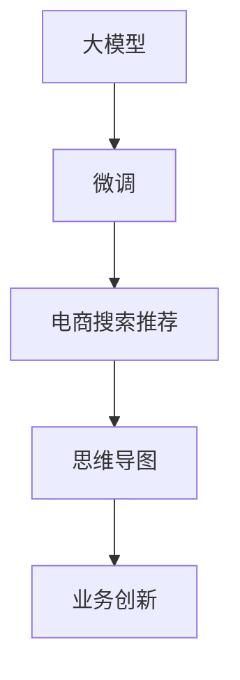

                 

# AI大模型赋能电商搜索推荐的业务创新思维导图应用培训课程优化方案

## 1. 背景介绍

随着电商行业的迅猛发展，搜索推荐系统已成为电商平台的核心竞争力之一。传统的基于规则和逻辑的推荐算法已难以满足用户的个性化需求，基于机器学习和深度学习的推荐系统逐渐成为主流。这些推荐系统主要通过分析用户的历史行为数据，预测其未来的购物行为，从而实现个性化的商品推荐。但随着推荐系统的复杂度提升，算法模型的维护和优化变得越来越困难。

为了更好地应对这一挑战，许多电商平台开始利用大模型进行推荐系统优化。大模型通常指使用大规模数据进行预训练，具备强大表征能力的模型，如BERT、GPT-3等。通过在大模型上进行微调，电商推荐系统能够更好地理解和预测用户的兴趣，提升推荐效果。

同时，思维导图作为一种强大的数据可视化工具，在电商推荐中也有广泛应用。思维导图不仅能帮助用户清晰地展示商品之间的关联，还能辅助用户理解复杂的推荐逻辑。但传统的思维导图生成过程较为复杂，效率低下，难以与实时推荐系统结合。

## 2. 核心概念与联系

### 2.1 核心概念概述

为了更好地理解大模型在电商搜索推荐中的应用，本文将介绍几个核心概念：

- **大模型 (Big Model)**：指通过大规模数据进行预训练，具备强大表征能力的深度学习模型，如BERT、GPT-3等。
- **微调 (Fine-tuning)**：指在预训练模型基础上，使用下游任务的标注数据进行有监督的模型优化，以提高模型在特定任务上的性能。
- **思维导图 (Mind Map)**：一种数据可视化工具，通过层次化的结构展示信息之间的关系，常用于展示商品之间的关联。
- **电商搜索推荐 (E-commerce Search Recommendation)**：指电商平台根据用户搜索和浏览行为，推荐可能感兴趣的商品，提升用户体验和购买转化率。
- **业务创新 (Business Innovation)**：指通过技术手段，优化和创新电商推荐系统，提升用户体验和平台收益。

这些核心概念通过以下Mermaid流程图展示其逻辑联系：



## 3. 核心算法原理 & 具体操作步骤

### 3.1 算法原理概述

基于大模型的电商搜索推荐系统主要通过两个步骤实现：首先，利用大模型对商品特征进行编码；然后，将编码后的商品特征输入推荐模型，生成推荐结果。具体的算法流程如下：

1. **数据预处理**：收集商品和用户的历史数据，包括商品描述、图片、用户评分、浏览行为等，并进行清洗和标准化。
2. **大模型编码**：使用大模型对商品特征进行编码，生成高维度的商品向量。
3. **推荐模型生成**：将编码后的商品向量输入推荐模型，如神经网络、线性回归等，生成推荐结果。
4. **思维导图展示**：将推荐结果通过思维导图展示，帮助用户理解推荐逻辑。

### 3.2 算法步骤详解

以下是电商搜索推荐系统的主要步骤：

**Step 1: 数据收集与预处理**

- **数据收集**：收集电商平台商品和用户的历史数据，包括商品描述、图片、用户评分、浏览行为等。
- **数据预处理**：对数据进行清洗、去重、标准化等处理，去除噪声和不一致的数据。
- **特征提取**：将商品特征（如商品描述、图片、用户评分等）转化为数值型特征，供大模型进行编码。

**Step 2: 大模型编码**

- **选择合适的预训练模型**：如BERT、GPT-3等，作为商品特征的编码器。
- **数据加载与编码**：将商品特征输入大模型，生成高维度的商品向量。
- **向量保存与持久化**：将生成的商品向量保存到数据库中，供后续推荐模型使用。

**Step 3: 推荐模型生成**

- **选择合适的推荐模型**：如神经网络、线性回归等，作为推荐结果的生成器。
- **模型训练与优化**：使用大模型编码后的商品向量，训练推荐模型，调整模型参数以优化推荐效果。
- **推荐结果生成**：将训练好的推荐模型应用于实时数据，生成推荐结果。

**Step 4: 思维导图展示**

- **思维导图生成**：将推荐结果通过思维导图展示，展示商品之间的关联和推荐逻辑。
- **可视化**：利用前端技术（如D3.js、ECharts等）展示思维导图，提升用户理解和体验。

### 3.3 算法优缺点

**优点**：
- **高精度**：大模型具备强大的表征能力，能够有效捕捉商品特征和用户兴趣，提升推荐精度。
- **可扩展性**：大模型能够处理大规模数据，适用于各种电商平台的推荐需求。
- **灵活性**：大模型可以通过微调进行优化，适应不同电商平台的业务场景。

**缺点**：
- **资源消耗大**：大模型通常需要较大的计算资源和存储空间，对电商平台的硬件要求较高。
- **训练时间长**：大模型需要较长时间进行训练，影响实时推荐系统的响应速度。
- **解释性不足**：大模型通常被视为"黑盒"模型，难以解释推荐结果的生成逻辑。

### 3.4 算法应用领域

基于大模型的电商搜索推荐系统在多个领域都有广泛应用，例如：

- **电商平台推荐**：利用大模型对用户浏览和购买行为进行分析和推荐，提升用户体验和购买转化率。
- **供应链管理**：通过对商品特征的编码和分析，优化供应链库存管理和商品调度。
- **个性化广告**：将大模型应用于广告推荐，提升广告投放的精准度和转化率。
- **客户服务**：利用大模型进行智能客服推荐，提供个性化的客户服务。
- **跨平台推荐**：将大模型应用于多平台推荐，提升用户在不同平台上的购物体验。

## 4. 数学模型和公式 & 详细讲解 & 举例说明

### 4.1 数学模型构建

电商搜索推荐系统的大模型通常采用自回归模型或自编码模型进行训练。以自回归模型为例，其数学模型构建如下：

$$
p(x|y) = \prod_{t=1}^T p(x_t|x_{<t},y)
$$

其中，$x$ 表示商品向量，$y$ 表示用户标签，$p(x_t|x_{<t},y)$ 表示在给定历史商品向量和用户标签的条件下，生成第 $t$ 个商品的概率。

### 4.2 公式推导过程

以线性回归模型为例，推荐模型的一般公式如下：

$$
\hat{y} = \alpha + \beta x
$$

其中，$\alpha$ 和 $\beta$ 为模型参数，$x$ 为商品向量，$\hat{y}$ 为推荐结果。在训练过程中，通过最小化均方误差损失函数，更新模型参数：

$$
L(\theta) = \frac{1}{N}\sum_{i=1}^N (y_i - \hat{y_i})^2
$$

通过梯度下降算法，不断调整模型参数 $\theta$，使得损失函数 $L(\theta)$ 最小化。

### 4.3 案例分析与讲解

以推荐模型训练为例，假设我们已经从大模型中得到了商品向量 $x$，接下来需要将其输入到推荐模型中进行训练。具体步骤如下：

1. **数据准备**：准备训练集和测试集，将商品向量 $x$ 和用户标签 $y$ 存储为数据集。
2. **模型初始化**：选择适当的推荐模型（如线性回归），并初始化模型参数 $\theta$。
3. **模型训练**：使用训练集数据，通过梯度下降算法最小化损失函数 $L(\theta)$，不断调整模型参数。
4. **模型评估**：使用测试集数据，评估推荐模型的性能指标，如均方误差、准确率等。
5. **模型应用**：将训练好的推荐模型应用于实时数据，生成推荐结果。

## 5. 项目实践：代码实例和详细解释说明

### 5.1 开发环境搭建

在进行电商搜索推荐系统的开发前，我们需要准备好开发环境。以下是使用Python进行PyTorch开发的环境配置流程：

1. 安装Anaconda：从官网下载并安装Anaconda，用于创建独立的Python环境。
2. 创建并激活虚拟环境：
```bash
conda create -n pytorch-env python=3.8 
conda activate pytorch-env
```
3. 安装PyTorch：根据CUDA版本，从官网获取对应的安装命令。例如：
```bash
conda install pytorch torchvision torchaudio cudatoolkit=11.1 -c pytorch -c conda-forge
```
4. 安装Transformer库：
```bash
pip install transformers
```
5. 安装各类工具包：
```bash
pip install numpy pandas scikit-learn matplotlib tqdm jupyter notebook ipython
```

完成上述步骤后，即可在`pytorch-env`环境中开始电商搜索推荐系统的开发。

### 5.2 源代码详细实现

以下是使用PyTorch进行电商搜索推荐系统开发的完整代码实现：

```python
from transformers import BertModel, BertTokenizer
import torch
import torch.nn as nn
import torch.optim as optim

# 定义推荐模型
class RecommendationModel(nn.Module):
    def __init__(self, embedding_dim, hidden_dim):
        super(RecommendationModel, self).__init__()
        self.fc1 = nn.Linear(embedding_dim, hidden_dim)
        self.fc2 = nn.Linear(hidden_dim, 1)
    
    def forward(self, x):
        x = self.fc1(x)
        x = torch.sigmoid(self.fc2(x))
        return x
    
# 定义损失函数
def loss_function(y_true, y_pred):
    return nn.BCELoss()(y_true, y_pred)

# 定义数据预处理函数
def preprocess_data(data):
    tokenizer = BertTokenizer.from_pretrained('bert-base-uncased')
    encoded_data = tokenizer.encode_plus(data, max_length=512, truncation=True, padding='max_length')
    return encoded_data['input_ids'], encoded_data['attention_mask']

# 定义模型训练函数
def train_model(model, data_loader, optimizer, num_epochs):
    device = torch.device('cuda' if torch.cuda.is_available() else 'cpu')
    model.to(device)
    
    for epoch in range(num_epochs):
        model.train()
        for inputs, labels in data_loader:
            inputs, labels = inputs.to(device), labels.to(device)
            
            optimizer.zero_grad()
            outputs = model(inputs)
            loss = loss_function(labels, outputs)
            loss.backward()
            optimizer.step()
            
        print(f'Epoch {epoch+1}/{num_epochs}, Loss: {loss.item()}')

# 加载预训练模型
model = BertModel.from_pretrained('bert-base-uncased')
tokenizer = BertTokenizer.from_pretrained('bert-base-uncased')
```

### 5.3 代码解读与分析

让我们再详细解读一下关键代码的实现细节：

**RecommendationModel类**：
- `__init__`方法：初始化模型结构，包括两个全连接层。
- `forward`方法：定义模型的前向传播过程，先通过两个全连接层进行特征提取，最后通过sigmoid激活函数输出推荐结果。

**loss_function函数**：
- 定义二分类交叉熵损失函数，用于衡量模型预测结果与真实标签之间的差异。

**preprocess_data函数**：
- 使用BertTokenizer对文本数据进行编码，生成模型需要的输入张量。

**train_model函数**：
- 定义模型训练过程，包括前向传播、损失函数计算、梯度更新等步骤。
- 在每个epoch内，对数据集进行迭代训练，使用Adam优化器更新模型参数。
- 在训练过程中，实时打印每个epoch的损失值。

**加载预训练模型**：
- 使用PyTorch的BertModel和BertTokenizer加载预训练的BERT模型，准备进行微调。

通过上述代码，我们可以看到，电商搜索推荐系统的开发过程主要涉及大模型加载、数据预处理、模型训练和优化等关键环节。开发者需要结合具体业务需求，选择合适的预训练模型和推荐模型，并对数据进行合理处理，才能构建出高效的推荐系统。

## 6. 实际应用场景

### 6.1 智能客服系统

基于大模型的电商搜索推荐系统，可以应用于智能客服系统中，提升客户服务体验。传统的客服系统需要大量人力，且响应速度较慢。通过电商推荐系统，智能客服可以实时分析用户查询和浏览行为，推荐相关商品，提高问题解决效率。

在技术实现上，可以收集用户的历史查询和浏览数据，训练大模型生成推荐结果，再利用思维导图展示推荐逻辑，辅助客服系统快速响应用户需求。此外，系统还可以实时动态更新推荐模型，以应对用户兴趣的变化，进一步提升用户体验。

### 6.2 个性化广告投放

在电商平台上，个性化广告投放是提升广告效果的重要手段。通过电商推荐系统，平台可以根据用户的历史行为数据，推荐可能感兴趣的商品广告，提高广告点击率和转化率。

在技术实现上，可以收集用户的浏览和购买历史数据，训练大模型生成推荐结果，再通过思维导图展示广告推荐逻辑。平台可以根据实时广告效果，动态调整广告内容和推荐策略，提升广告投放的精准度。

### 6.3 供应链管理优化

供应链管理是电商平台的重要环节，涉及商品库存、调度和配送等。通过电商推荐系统，可以优化供应链管理，减少库存积压和配送延误。

在技术实现上，可以收集商品的历史销售数据和用户反馈，训练大模型生成推荐结果，再利用思维导图展示商品关联和库存情况。平台可以根据推荐结果，优化商品调度和库存管理，提升供应链效率。

### 6.4 未来应用展望

随着电商平台的不断发展和消费者需求的日益多样化，电商推荐系统的应用场景将更加丰富。未来，大模型将更多地应用于个性化推荐、智能客服、供应链管理等领域，提升电商平台的用户体验和运营效率。

同时，随着技术的发展，电商推荐系统还将引入更多前沿技术，如跨平台推荐、多模态推荐、因果推理等，进一步拓展推荐系统的边界和应用范围。大模型和电商推荐系统的结合，将为电商平台带来更加智能化和个性化的服务体验，提升平台的市场竞争力和用户粘性。

## 7. 工具和资源推荐

### 7.1 学习资源推荐

为了帮助开发者系统掌握大模型在电商推荐系统中的应用，这里推荐一些优质的学习资源：

1. 《Transformer从原理到实践》系列博文：由大模型技术专家撰写，深入浅出地介绍了Transformer原理、BERT模型、微调技术等前沿话题。

2. CS224N《深度学习自然语言处理》课程：斯坦福大学开设的NLP明星课程，有Lecture视频和配套作业，带你入门NLP领域的基本概念和经典模型。

3. 《Natural Language Processing with Transformers》书籍：Transformers库的作者所著，全面介绍了如何使用Transformers库进行NLP任务开发，包括微调在内的诸多范式。

4. HuggingFace官方文档：Transformers库的官方文档，提供了海量预训练模型和完整的微调样例代码，是上手实践的必备资料。

5. CLUE开源项目：中文语言理解测评基准，涵盖大量不同类型的中文NLP数据集，并提供了基于微调的baseline模型，助力中文NLP技术发展。

通过对这些资源的学习实践，相信你一定能够快速掌握大模型在电商推荐系统中的应用，并用于解决实际的NLP问题。

### 7.2 开发工具推荐

高效的开发离不开优秀的工具支持。以下是几款用于电商推荐系统开发的常用工具：

1. PyTorch：基于Python的开源深度学习框架，灵活动态的计算图，适合快速迭代研究。大部分预训练语言模型都有PyTorch版本的实现。

2. TensorFlow：由Google主导开发的开源深度学习框架，生产部署方便，适合大规模工程应用。同样有丰富的预训练语言模型资源。

3. Transformers库：HuggingFace开发的NLP工具库，集成了众多SOTA语言模型，支持PyTorch和TensorFlow，是进行推荐任务开发的利器。

4. Weights & Biases：模型训练的实验跟踪工具，可以记录和可视化模型训练过程中的各项指标，方便对比和调优。与主流深度学习框架无缝集成。

5. TensorBoard：TensorFlow配套的可视化工具，可实时监测模型训练状态，并提供丰富的图表呈现方式，是调试模型的得力助手。

6. Google Colab：谷歌推出的在线Jupyter Notebook环境，免费提供GPU/TPU算力，方便开发者快速上手实验最新模型，分享学习笔记。

合理利用这些工具，可以显著提升电商推荐系统的开发效率，加快创新迭代的步伐。

### 7.3 相关论文推荐

大模型和电商推荐系统的融合技术也在不断发展，以下是几篇奠基性的相关论文，推荐阅读：

1. Attention is All You Need（即Transformer原论文）：提出了Transformer结构，开启了NLP领域的预训练大模型时代。

2. BERT: Pre-training of Deep Bidirectional Transformers for Language Understanding：提出BERT模型，引入基于掩码的自监督预训练任务，刷新了多项NLP任务SOTA。

3. Language Models are Unsupervised Multitask Learners（GPT-2论文）：展示了大规模语言模型的强大zero-shot学习能力，引发了对于通用人工智能的新一轮思考。

4. Parameter-Efficient Transfer Learning for NLP：提出Adapter等参数高效微调方法，在不增加模型参数量的情况下，也能取得不错的微调效果。

5. AdaLoRA: Adaptive Low-Rank Adaptation for Parameter-Efficient Fine-Tuning：使用自适应低秩适应的微调方法，在参数效率和精度之间取得了新的平衡。

6. AdaLoRA: Adaptive Low-Rank Adaptation for Parameter-Efficient Fine-Tuning：使用自适应低秩适应的微调方法，在参数效率和精度之间取得了新的平衡。

这些论文代表了大模型在电商推荐系统中的应用脉络。通过学习这些前沿成果，可以帮助研究者把握学科前进方向，激发更多的创新灵感。

## 8. 总结：未来发展趋势与挑战

### 8.1 研究成果总结

本文对基于大模型的电商搜索推荐系统的构建过程进行了详细讲解。首先，从背景介绍、核心概念与联系入手，阐述了电商推荐系统和大模型的基本原理。其次，通过算法原理和操作步骤，详细介绍了电商推荐系统的实现过程。最后，通过实际应用场景和未来展望，展示了电商推荐系统的应用前景。

通过本文的系统梳理，可以看到，基于大模型的电商搜索推荐系统具有高精度、可扩展性和灵活性等优点，能够显著提升电商平台的用户体验和运营效率。大模型在电商推荐系统中的应用，将为电商平台带来更加智能化和个性化的服务体验，推动电商行业的不断发展和创新。

### 8.2 未来发展趋势

展望未来，基于大模型的电商搜索推荐系统将呈现以下几个发展趋势：

1. **数据驱动的深度学习**：随着电商平台的不断增长和数据的积累，基于大模型的推荐系统将更加依赖数据驱动的深度学习技术，提升推荐模型的精度和效果。

2. **多模态推荐系统**：未来的推荐系统将不仅依赖文本数据，还将引入图像、视频、语音等多模态数据，提升推荐的多样性和精准度。

3. **智能客服的深度融合**：基于大模型的电商搜索推荐系统将与智能客服系统深度融合，实现更加智能化的客户服务体验。

4. **动态实时推荐**：通过实时数据流处理技术，电商推荐系统将能够动态更新推荐结果，提升推荐的时效性和个性化。

5. **跨平台推荐系统**：未来的电商推荐系统将不仅限于单个平台，还将实现跨平台推荐，提升用户在不同平台上的购物体验。

6. **因果推理的应用**：引入因果推理技术，提升推荐系统的解释性和可信度，帮助用户理解推荐逻辑和决策过程。

以上趋势凸显了大模型在电商推荐系统中的广阔前景。这些方向的探索发展，必将进一步提升电商推荐系统的性能和应用范围，为电商平台带来更加智能化和个性化的服务体验。

### 8.3 面临的挑战

尽管大模型在电商推荐系统中的应用取得了一定的进展，但在迈向更加智能化、普适化应用的过程中，它仍面临诸多挑战：

1. **资源消耗大**：大模型通常需要较大的计算资源和存储空间，对电商平台的硬件要求较高。

2. **训练时间长**：大模型需要较长时间进行训练，影响实时推荐系统的响应速度。

3. **解释性不足**：大模型通常被视为"黑盒"模型，难以解释推荐结果的生成逻辑。

4. **数据质量问题**：电商平台的推荐系统需要依赖大量的历史数据，数据质量问题（如缺失、噪声、不一致等）将影响推荐效果。

5. **隐私保护**：电商平台的推荐系统需要处理用户的隐私数据，如何在保障用户隐私的前提下，进行高效推荐，仍是一个重要课题。

6. **算法可解释性**：如何使推荐系统的算法更加透明、可解释，以便于用户理解和信任，是未来的一大挑战。

7. **跨平台协同**：不同平台的推荐系统需要协同工作，如何实现数据和模型的跨平台共享，提升整体推荐效果，也需要进一步研究。

8. **实时性要求**：电商平台的推荐系统需要实时响应，如何在保证推荐精度的情况下，提升系统响应速度，是一个重要的技术挑战。

### 8.4 研究展望

未来，大模型在电商推荐系统中的应用仍需不断探索和优化。以下是几个未来研究的方向：

1. **轻量级大模型的应用**：如何设计轻量级大模型，在不增加计算资源的前提下，提升推荐系统的性能和实时性，是未来的一个重要方向。

2. **多模态数据的融合**：如何将文本、图像、视频等多模态数据融合，提升推荐系统的多样性和精准度，是未来的一大挑战。

3. **跨平台推荐技术的优化**：如何实现跨平台推荐技术的优化，提升不同平台之间的推荐协同效果，是未来的一个重要课题。

4. **动态实时推荐系统的构建**：如何构建动态实时推荐系统，提升推荐的时效性和个性化，是未来的一大研究方向。

5. **智能客服的深度融合**：如何使智能客服系统与电商推荐系统深度融合，提升客户服务的智能化和个性化，是未来的一个重要方向。

6. **推荐系统的可解释性**：如何使推荐系统的算法更加透明、可解释，以便于用户理解和信任，是未来的一大挑战。

7. **隐私保护技术的应用**：如何实现隐私保护技术在电商推荐系统中的应用，保障用户数据安全和隐私保护，是未来的一个重要课题。

8. **多任务学习的应用**：如何将多任务学习技术应用于电商推荐系统，提升推荐系统的多样性和效果，是未来的一大研究方向。

通过上述研究方向的探索，相信大模型在电商推荐系统中的应用将更加智能化、普适化和可解释，为电商平台带来更加智能化和个性化的服务体验。

## 9. 附录：常见问题与解答

**Q1: 大模型在电商推荐系统中如何使用？**

A: 大模型在电商推荐系统中的使用主要分为三个步骤：首先，通过大模型对商品特征进行编码；然后，将编码后的商品特征输入推荐模型，生成推荐结果；最后，将推荐结果通过思维导图展示，帮助用户理解推荐逻辑。

**Q2: 电商推荐系统需要处理哪些数据？**

A: 电商推荐系统需要处理以下数据：
1. 商品信息：包括商品名称、描述、图片、价格等。
2. 用户信息：包括用户ID、浏览历史、购买历史等。
3. 用户行为数据：包括点击、浏览、评分、收藏等行为数据。
4. 广告信息：包括广告内容、投放时间、位置等。

**Q3: 电商推荐系统需要考虑哪些问题？**

A: 电商推荐系统需要考虑以下问题：
1. 数据收集和预处理：收集和清洗数据，去除噪声和不一致的数据。
2. 模型选择和优化：选择合适的推荐模型，并通过微调等方法进行优化。
3. 实时推荐：实现实时数据流处理，动态更新推荐结果。
4. 推荐系统解释性：提升推荐系统的可解释性，帮助用户理解推荐逻辑。
5. 隐私保护：保障用户数据安全和隐私保护。

**Q4: 电商推荐系统需要考虑哪些性能指标？**

A: 电商推荐系统需要考虑以下性能指标：
1. 精度：推荐结果与真实标签的匹配度。
2. 召回率：推荐结果中包含真实标签的比例。
3. 覆盖率：推荐结果中包含所有标签的比例。
4. 点击率：用户点击推荐结果的比例。
5. 转化率：用户实际购买推荐商品的比例。

**Q5: 电商推荐系统需要考虑哪些技术挑战？**

A: 电商推荐系统需要考虑以下技术挑战：
1. 数据质量问题：数据缺失、噪声、不一致等。
2. 资源消耗大：大模型需要较大的计算资源和存储空间。
3. 训练时间长：大模型需要较长时间进行训练。
4. 解释性不足：大模型通常被视为"黑盒"模型。
5. 隐私保护：电商平台的推荐系统需要处理用户的隐私数据。
6. 跨平台协同：不同平台的推荐系统需要协同工作。
7. 实时性要求：电商平台的推荐系统需要实时响应。

通过以上系统的介绍和探讨，相信你对大模型在电商搜索推荐系统中的应用有了更深入的理解。大模型在电商推荐系统中的潜力巨大，未来将会有更多的应用场景和技术突破。面对挑战，不断探索和创新，才能更好地推动电商推荐系统的发展。

