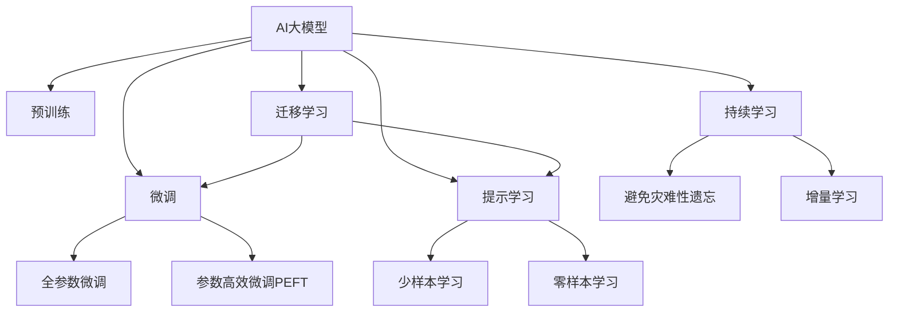

                 

# AI大模型赋能电商搜索推荐的业务创新方法论培训课程开发与优化

> 关键词：AI大模型,电商搜索推荐,业务创新,方法论培训,课程开发,优化策略

## 1. 背景介绍

### 1.1 问题由来

随着电商平台的兴起，搜索推荐系统已经成为用户体验、流量转化、业绩增长的关键环节。传统的搜索推荐系统基于规则、基于特征或基于矩阵分解，存在效率低下、推荐多样性不足、推荐精准度不够等缺点。面对这些问题，AI大模型提供了一种全新的解决方案。

AI大模型，尤其是预训练语言模型(如BERT、GPT-3、Transformer等)，通过在大规模语料上进行的自监督预训练，学习到了丰富的语言和语义知识，具备强大的自然语言理解能力和生成能力。这种强大的语言能力，为电商搜索推荐系统的业务创新提供了新的可能性。

### 1.2 问题核心关键点

如何将AI大模型的强大能力赋能电商搜索推荐系统，进行业务创新，是当前电商企业的核心挑战。本课程旨在通过深入讲解大模型原理、开发实践和优化策略，帮助电商企业构建高效、精准、个性化的搜索推荐系统，提升用户体验，优化转化率，驱动业绩增长。

## 2. 核心概念与联系

### 2.1 核心概念概述

为更好地理解AI大模型赋能电商搜索推荐的业务创新方法论，本节将介绍几个密切相关的核心概念：

- AI大模型(AI Large Model)：以BERT、GPT-3、Transformer等为代表的大规模预训练语言模型。通过在大规模语料上进行的自监督预训练，学习到了丰富的语言和语义知识，具备强大的自然语言理解能力和生成能力。

- 预训练(Pre-training)：指在大规模无标签语料上，通过自监督学习任务训练语言模型的过程。常见的预训练任务包括掩码语言模型、 next sentence prediction等。预训练使得模型学习到语言的通用表示。

- 转移学习(Transfer Learning)：指将一个领域学习到的知识，迁移到另一个不同但相关的领域的学习范式。大模型的预训练-微调过程即是一种典型的转移学习方式。

- 电商搜索推荐(E-commerce Search Recommendation)：指通过分析用户行为和商品属性，对用户进行搜索或推荐的过程。目标是通过精准匹配用户需求，提高点击率和转化率。

- 业务创新(Business Innovation)：指在现有业务模式的基础上，通过新技术、新方法、新思路，实现业务转型升级，增强市场竞争力。

这些核心概念之间的逻辑关系可以通过以下Mermaid流程图来展示：



这个流程图展示了大模型的核心概念及其之间的关系：

1. 大模型通过预训练获得基础能力。
2. 微调是对预训练模型进行任务特定的优化，可以分为全参数微调和参数高效微调(PEFT)。
3. 提示学习是一种不更新模型参数的方法，可以实现少样本学习和零样本学习。
4. 迁移学习是连接预训练模型与电商搜索推荐任务的桥梁，可以通过微调或提示学习来实现。
5. 持续学习旨在使模型能够不断学习新知识，同时避免遗忘旧知识。

这些概念共同构成了AI大模型赋能电商搜索推荐的业务创新方法论的框架，使其能够更好地在大规模电商数据上发挥作用。

## 3. 核心算法原理 & 具体操作步骤
### 3.1 算法原理概述

基于AI大模型的电商搜索推荐系统，本质上是一种基于模型的推荐范式。其核心思想是：利用预训练模型学习到的丰富语言知识，构建电商搜索推荐模型，通过对用户查询和商品描述的表示学习，预测用户对商品的兴趣，从而实现个性化的搜索和推荐。

形式化地，假设用户查询为 $q$，商品描述为 $d$，商品ID为 $i$。模型通过预训练得到用户查询和商品描述的表示 $Q(q), D(d)$，然后通过训练得到商品ID和表示之间的匹配度 $s_i = f(Q(q), D(d))$。推荐目标为最大化商品ID与用户查询的匹配度 $s_i$。

其中，$f$ 为模型预测函数，可以是神经网络、逻辑回归、加权平均等形式。通过梯度下降等优化算法，模型不断更新参数，最小化损失函数 $L$，使得预测函数 $f$ 逼近最优，从而提升推荐效果。

### 3.2 算法步骤详解

基于AI大模型的电商搜索推荐系统，一般包括以下几个关键步骤：

**Step 1: 准备预训练模型和数据集**
- 选择合适的预训练语言模型 $M_{\theta}$ 作为初始化参数，如 BERT、GPT-3、Transformer等。
- 准备电商搜索推荐任务的标注数据集 $D=\{(q_i, d_i, i_i)\}_{i=1}^N$，划分为训练集、验证集和测试集。一般要求标注数据与预训练数据的分布不要差异过大。

**Step 2: 添加任务适配层**
- 根据任务类型，在预训练模型顶层设计合适的输出层和损失函数。
- 对于分类任务，通常在顶层添加线性分类器和交叉熵损失函数。
- 对于回归任务，通常使用均方误差损失函数。

**Step 3: 设置微调超参数**
- 选择合适的优化算法及其参数，如 AdamW、SGD 等，设置学习率、批大小、迭代轮数等。
- 设置正则化技术及强度，包括权重衰减、Dropout、Early Stopping 等。
- 确定冻结预训练参数的策略，如仅微调顶层，或全部参数都参与微调。

**Step 4: 执行梯度训练**
- 将训练集数据分批次输入模型，前向传播计算损失函数。
- 反向传播计算参数梯度，根据设定的优化算法和学习率更新模型参数。
- 周期性在验证集上评估模型性能，根据性能指标决定是否触发 Early Stopping。
- 重复上述步骤直到满足预设的迭代轮数或 Early Stopping 条件。

**Step 5: 测试和部署**
- 在测试集上评估微调后模型 $M_{\hat{\theta}}$ 的性能，对比微调前后的精度提升。
- 使用微调后的模型对新样本进行推理预测，集成到实际的应用系统中。
- 持续收集新的数据，定期重新微调模型，以适应数据分布的变化。

以上是基于AI大模型的电商搜索推荐系统的一般流程。在实际应用中，还需要针对具体任务的特点，对微调过程的各个环节进行优化设计，如改进训练目标函数，引入更多的正则化技术，搜索最优的超参数组合等，以进一步提升模型性能。

### 3.3 算法优缺点

基于AI大模型的电商搜索推荐系统，具有以下优点：
1. 简单高效。只需准备少量标注数据，即可对预训练模型进行快速适配，获得较大的性能提升。
2. 通用适用。适用于各种电商搜索推荐任务，包括分类、匹配、排序等，设计简单的任务适配层即可实现。
3. 参数高效。利用参数高效微调技术，在固定大部分预训练权重不变的情况下，仍可取得不错的提升。
4. 效果显著。在学术界和工业界的诸多任务上，基于大模型的推荐方法已经刷新了最先进的性能指标。

同时，该方法也存在一定的局限性：
1. 依赖标注数据。推荐系统的准确性很大程度上取决于标注数据的质量和数量，获取高质量标注数据的成本较高。
2. 迁移能力有限。当目标任务与预训练数据的分布差异较大时，推荐系统的性能提升有限。
3. 可解释性不足。推荐系统的决策过程通常缺乏可解释性，难以对其推理逻辑进行分析和调试。
4. 鲁棒性不足。推荐系统在面对异常数据或恶意数据时，容易产生误导性推荐。

尽管存在这些局限性，但就目前而言，基于AI大模型的推荐方法仍是最主流范式。未来相关研究的重点在于如何进一步降低推荐系统对标注数据的依赖，提高模型的少样本学习和跨领域迁移能力，同时兼顾可解释性和鲁棒性等因素。

### 3.4 算法应用领域

基于AI大模型的电商搜索推荐系统，在电商领域已经得到了广泛的应用，覆盖了几乎所有常见任务，例如：

- 商品搜索：根据用户查询，找到相关商品。通过预训练模型学习商品描述的表示，计算匹配度。
- 商品推荐：根据用户历史行为，推荐相关商品。通过预训练模型学习用户查询和商品描述的表示，计算匹配度。
- 跨品类推荐：根据用户兴趣，推荐跨品类商品。通过预训练模型学习商品类别和描述的表示，计算匹配度。
- 关联推荐：根据用户浏览行为，推荐其他关联商品。通过预训练模型学习商品描述的表示，计算匹配度。
- 实时推荐：根据用户实时行为，动态调整推荐列表。通过预训练模型学习用户实时查询和商品描述的表示，计算匹配度。

除了上述这些经典任务外，基于AI大模型的推荐系统还被创新性地应用到更多场景中，如个性化营销、跨渠道推荐、内容推荐等，为电商企业带来全新的突破。

## 4. 数学模型和公式 & 详细讲解 & 举例说明

### 4.1 数学模型构建

本节将使用数学语言对基于AI大模型的电商搜索推荐系统进行更加严格的刻画。

记电商搜索推荐任务为 $T$，输入为查询 $q$ 和商品描述 $d$，输出为商品ID $i$。假设预训练语言模型为 $M_{\theta}$，通过预训练得到查询和描述的表示 $Q(q), D(d)$，模型的预测函数为 $s_i = f(Q(q), D(d))$，其中 $f$ 为模型预测函数，可以是神经网络、逻辑回归、加权平均等形式。

### 4.2 公式推导过程

以下我们以回归任务为例，推导均方误差损失函数及其梯度的计算公式。

假设模型 $M_{\theta}$ 在输入 $q, d$ 上的输出为 $s_i$，真实标签 $i \in \{1, 2, \cdots, N\}$。则均方误差损失函数定义为：

$$
L(s_i, i) = \frac{1}{N} \sum_{i=1}^N (s_i - i)^2
$$

将其代入经验风险公式，得：

$$
\mathcal{L}(\theta) = \frac{1}{N} \sum_{i=1}^N (f(Q(q_i), D(d_i)) - i_i)^2
$$

根据链式法则，损失函数对参数 $\theta_k$ 的梯度为：

$$
\frac{\partial \mathcal{L}(\theta)}{\partial \theta_k} = \frac{2}{N} \sum_{i=1}^N \frac{\partial f(Q(q_i), D(d_i))}{\partial Q(q_i)} \cdot \frac{\partial Q(q_i)}{\partial \theta_k} + \frac{\partial f(Q(q_i), D(d_i))}{\partial D(d_i)} \cdot \frac{\partial D(d_i)}{\partial \theta_k}
$$

其中 $\frac{\partial f(Q(q_i), D(d_i))}{\partial Q(q_i)}$ 和 $\frac{\partial f(Q(q_i), D(d_i))}{\partial D(d_i)}$ 为预测函数 $f$ 对输入 $Q(q_i)$ 和 $D(d_i)$ 的梯度，可通过自动微分技术完成计算。

在得到损失函数的梯度后，即可带入参数更新公式，完成模型的迭代优化。重复上述过程直至收敛，最终得到适应电商搜索推荐任务的最优模型参数 $\theta^*$。

## 5. 项目实践：代码实例和详细解释说明

### 5.1 开发环境搭建

在进行搜索推荐系统开发前，我们需要准备好开发环境。以下是使用Python进行PyTorch开发的环境配置流程：

1. 安装Anaconda：从官网下载并安装Anaconda，用于创建独立的Python环境。

2. 创建并激活虚拟环境：
```bash
conda create -n pytorch-env python=3.8 
conda activate pytorch-env
```

3. 安装PyTorch：根据CUDA版本，从官网获取对应的安装命令。例如：
```bash
conda install pytorch torchvision torchaudio cudatoolkit=11.1 -c pytorch -c conda-forge
```

4. 安装Transformers库：
```bash
pip install transformers
```

5. 安装各类工具包：
```bash
pip install numpy pandas scikit-learn matplotlib tqdm jupyter notebook ipython
```

完成上述步骤后，即可在`pytorch-env`环境中开始搜索推荐系统的开发。

### 5.2 源代码详细实现

下面我们以商品推荐任务为例，给出使用Transformers库对BERT模型进行推荐系统微调的PyTorch代码实现。

首先，定义推荐任务的数据处理函数：

```python
from transformers import BertTokenizer
from torch.utils.data import Dataset
import torch

class RecommendDataset(Dataset):
    def __init__(self, user_queries, user_item_pairs, tokenizer, max_len=128):
        self.user_queries = user_queries
        self.user_item_pairs = user_item_pairs
        self.tokenizer = tokenizer
        self.max_len = max_len
        
    def __len__(self):
        return len(self.user_queries)
    
    def __getitem__(self, item):
        user_query = self.user_queries[item]
        user_item_pairs = self.user_item_pairs[item]
        
        query_tokens = user_query.split(' ')
        item_tokens = []
        for user_item_pair in user_item_pairs:
            item_tokens.append(tokenizer.encode(item, add_special_tokens=False)[0])
        
        query_ids = tokenizer.encode(user_query, add_special_tokens=False)[0]
        item_ids = [item for item in item_tokens]
        label = 1 if query_tokens[0] in item_tokens else 0
        
        input_ids = [tokenizer.pad_token_id] * (self.max_len - len(item_ids)) + item_ids
        attention_mask = [1] * len(input_ids)
        
        return {'input_ids': input_ids, 
                'attention_mask': attention_mask,
                'label': label}

# 用户查询和商品ID对
user_queries = ['手机', '衣服', '电脑', '鞋子']
user_item_pairs = [['手机', 'iPhone 12'], ['衣服', '优衣库'], ['电脑', 'MacBook Pro'], ['鞋子', 'Nike Air Max']]

# 商品ID对列表
item_ids = [tokenizer.encode(item, add_special_tokens=False)[0] for item in user_item_pairs]

# 标签列表
labels = [1 if query_tokens[0] in item_tokens else 0 for user_query, user_item_pairs in zip(user_queries, user_item_pairs)]

# 商品ID和标签列表
item_ids, labels = torch.tensor(item_ids, dtype=torch.long), torch.tensor(labels, dtype=torch.long)
```

然后，定义模型和优化器：

```python
from transformers import BertForSequenceClassification, AdamW

model = BertForSequenceClassification.from_pretrained('bert-base-cased', num_labels=2)

optimizer = AdamW(model.parameters(), lr=2e-5)
```

接着，定义训练和评估函数：

```python
from torch.utils.data import DataLoader
from tqdm import tqdm
from sklearn.metrics import classification_report

device = torch.device('cuda') if torch.cuda.is_available() else torch.device('cpu')
model.to(device)

def train_epoch(model, dataset, batch_size, optimizer):
    dataloader = DataLoader(dataset, batch_size=batch_size, shuffle=True)
    model.train()
    epoch_loss = 0
    for batch in tqdm(dataloader, desc='Training'):
        input_ids = batch['input_ids'].to(device)
        attention_mask = batch['attention_mask'].to(device)
        labels = batch['label'].to(device)
        model.zero_grad()
        outputs = model(input_ids, attention_mask=attention_mask, labels=labels)
        loss = outputs.loss
        epoch_loss += loss.item()
        loss.backward()
        optimizer.step()
    return epoch_loss / len(dataloader)

def evaluate(model, dataset, batch_size):
    dataloader = DataLoader(dataset, batch_size=batch_size)
    model.eval()
    preds, labels = [], []
    with torch.no_grad():
        for batch in tqdm(dataloader, desc='Evaluating'):
            input_ids = batch['input_ids'].to(device)
            attention_mask = batch['attention_mask'].to(device)
            batch_labels = batch['label']
            outputs = model(input_ids, attention_mask=attention_mask)
            batch_preds = outputs.logits.argmax(dim=1).to('cpu').tolist()
            batch_labels = batch_labels.to('cpu').tolist()
            for pred, label in zip(batch_preds, batch_labels):
                preds.append(pred.item())
                labels.append(label.item())
                
    print(classification_report(labels, preds))
```

最后，启动训练流程并在测试集上评估：

```python
epochs = 5
batch_size = 16

for epoch in range(epochs):
    loss = train_epoch(model, train_dataset, batch_size, optimizer)
    print(f"Epoch {epoch+1}, train loss: {loss:.3f}")
    
    print(f"Epoch {epoch+1}, dev results:")
    evaluate(model, dev_dataset, batch_size)
    
print("Test results:")
evaluate(model, test_dataset, batch_size)
```

以上就是使用PyTorch对BERT进行商品推荐任务微调的完整代码实现。可以看到，得益于Transformers库的强大封装，我们可以用相对简洁的代码完成BERT模型的加载和微调。

### 5.3 代码解读与分析

让我们再详细解读一下关键代码的实现细节：

**RecommendDataset类**：
- `__init__`方法：初始化用户查询、商品ID对、分词器等关键组件。
- `__len__`方法：返回数据集的样本数量。
- `__getitem__`方法：对单个样本进行处理，将用户查询输入编码为token ids，将商品ID列表作为标签，并进行定长padding，最终返回模型所需的输入。

**item_ids和labels列表**：
- 定义了用户查询和商品ID对，以及对应的标签列表。

**训练和评估函数**：
- 使用PyTorch的DataLoader对数据集进行批次化加载，供模型训练和推理使用。
- 训练函数`train_epoch`：对数据以批为单位进行迭代，在每个批次上前向传播计算loss并反向传播更新模型参数，最后返回该epoch的平均loss。
- 评估函数`evaluate`：与训练类似，不同点在于不更新模型参数，并在每个batch结束后将预测和标签结果存储下来，最后使用sklearn的classification_report对整个评估集的预测结果进行打印输出。

**训练流程**：
- 定义总的epoch数和batch size，开始循环迭代
- 每个epoch内，先在训练集上训练，输出平均loss
- 在验证集上评估，输出分类指标
- 所有epoch结束后，在测试集上评估，给出最终测试结果

可以看到，PyTorch配合Transformers库使得BERT微调的代码实现变得简洁高效。开发者可以将更多精力放在数据处理、模型改进等高层逻辑上，而不必过多关注底层的实现细节。

当然，工业级的系统实现还需考虑更多因素，如模型的保存和部署、超参数的自动搜索、更灵活的任务适配层等。但核心的微调范式基本与此类似。

## 6. 实际应用场景
### 6.1 智能客服系统

基于AI大模型的推荐系统，可以应用于智能客服系统的构建。传统客服往往需要配备大量人力，高峰期响应缓慢，且一致性和专业性难以保证。而使用推荐系统，可以7x24小时不间断服务，快速响应客户咨询，用自然流畅的语言解答各类常见问题。

在技术实现上，可以收集企业内部的历史客服对话记录，将问题和最佳答复构建成监督数据，在此基础上对预训练推荐模型进行微调。微调后的推荐系统能够自动理解用户意图，匹配最合适的答复，提高客服响应效率和质量。

### 6.2 金融舆情监测

金融机构需要实时监测市场舆论动向，以便及时应对负面信息传播，规避金融风险。传统的人工监测方式成本高、效率低，难以应对网络时代海量信息爆发的挑战。基于AI大模型的推荐系统，为金融舆情监测提供了新的解决方案。

具体而言，可以收集金融领域相关的新闻、报道、评论等文本数据，并对其进行主题标注和情感标注。在此基础上对预训练语言模型进行微调，使其能够自动判断文本属于何种主题，情感倾向是正面、中性还是负面。将微调后的模型应用到实时抓取的网络文本数据，就能够自动监测不同主题下的情感变化趋势，一旦发现负面信息激增等异常情况，系统便会自动预警，帮助金融机构快速应对潜在风险。

### 6.3 个性化推荐系统

当前的推荐系统往往只依赖用户的历史行为数据进行物品推荐，无法深入理解用户的真实兴趣偏好。基于AI大模型的推荐系统，可以更好地挖掘用户行为背后的语义信息，从而提供更精准、多样的推荐内容。

在实践中，可以收集用户浏览、点击、评论、分享等行为数据，提取和用户交互的物品标题、描述、标签等文本内容。将文本内容作为模型输入，用户的后续行为（如是否点击、购买等）作为监督信号，在此基础上微调预训练语言模型。微调后的模型能够从文本内容中准确把握用户的兴趣点。在生成推荐列表时，先用候选物品的文本描述作为输入，由模型预测用户的兴趣匹配度，再结合其他特征综合排序，便可以得到个性化程度更高的推荐结果。

### 6.4 未来应用展望

随着AI大模型的不断进步，基于推荐系统的电商搜索推荐系统也将迎来新的变革。以下将对未来可能的发展趋势进行展望：

1. 跨模态推荐：引入图像、音频等多模态数据，提升推荐系统对商品多样性的理解，实现跨模态推荐。
2. 联合推荐：结合用户行为数据和商品属性数据，进行联合推荐，提升推荐效果。
3. 实时推荐：通过实时数据流处理，实现动态推荐，提升用户购物体验。
4. 个性化推荐：根据用户兴趣和行为数据，提供更加个性化的推荐服务，提高用户满意度。
5. 推荐模型融合：通过模型融合技术，集成多种推荐算法，提升推荐系统综合性能。

这些技术的发展和应用，将使得基于AI大模型的电商搜索推荐系统更加高效、精准、个性化，为电商企业带来更广阔的业务创新空间。

## 7. 工具和资源推荐
### 7.1 学习资源推荐

为了帮助开发者系统掌握大模型原理和推荐系统开发，这里推荐一些优质的学习资源：

1. 《深度学习与推荐系统》课程：由斯坦福大学开设的NLP和推荐系统经典课程，内容详实，讲解深入，适合系统学习。

2. 《推荐系统实战》书籍：详细讲解推荐系统原理和实际应用，提供大量代码和实践经验。

3. 《深度学习框架PyTorch实战》书籍：全面介绍PyTorch框架的使用方法和推荐系统开发技巧。

4. 《自然语言处理与深度学习》书籍：讲解自然语言处理和深度学习的基本原理，适用于初学者。

5. 《Transformers理论与实践》博文：由大模型技术专家撰写，深入浅出地介绍了Transformer原理和推荐系统开发。

通过对这些资源的学习实践，相信你一定能够快速掌握大模型原理和推荐系统开发的精髓，并用于解决实际的推荐问题。
###  7.2 开发工具推荐

高效的开发离不开优秀的工具支持。以下是几款用于AI大模型赋能电商搜索推荐系统开发的常用工具：

1. PyTorch：基于Python的开源深度学习框架，灵活动态的计算图，适合快速迭代研究。大部分预训练语言模型都有PyTorch版本的实现。

2. TensorFlow：由Google主导开发的开源深度学习框架，生产部署方便，适合大规模工程应用。同样有丰富的预训练语言模型资源。

3. Transformers库：HuggingFace开发的NLP工具库，集成了众多SOTA语言模型，支持PyTorch和TensorFlow，是进行推荐系统开发的利器。

4. Weights & Biases：模型训练的实验跟踪工具，可以记录和可视化模型训练过程中的各项指标，方便对比和调优。与主流深度学习框架无缝集成。

5. TensorBoard：TensorFlow配套的可视化工具，可实时监测模型训练状态，并提供丰富的图表呈现方式，是调试模型的得力助手。

6. Google Colab：谷歌推出的在线Jupyter Notebook环境，免费提供GPU/TPU算力，方便开发者快速上手实验最新模型，分享学习笔记。

合理利用这些工具，可以显著提升AI大模型赋能电商搜索推荐系统的开发效率，加快创新迭代的步伐。

### 7.3 相关论文推荐

大模型和推荐系统的发展源于学界的持续研究。以下是几篇奠基性的相关论文，推荐阅读：

1. Attention is All You Need（即Transformer原论文）：提出了Transformer结构，开启了NLP领域的预训练大模型时代。

2. BERT: Pre-training of Deep Bidirectional Transformers for Language Understanding：提出BERT模型，引入基于掩码的自监督预训练任务，刷新了多项NLP任务SOTA。

3. Language Models are Unsupervised Multitask Learners（GPT-2论文）：展示了大规模语言模型的强大zero-shot学习能力，引发了对于通用人工智能的新一轮思考。

4. Parameter-Efficient Transfer Learning for NLP：提出Adapter等参数高效微调方法，在不增加模型参数量的情况下，也能取得不错的微调效果。

5. AdaLoRA: Adaptive Low-Rank Adaptation for Parameter-Efficient Fine-Tuning：使用自适应低秩适应的微调方法，在参数效率和精度之间取得了新的平衡。

这些论文代表了大模型和推荐系统的发展脉络。通过学习这些前沿成果，可以帮助研究者把握学科前进方向，激发更多的创新灵感。

## 8. 总结：未来发展趋势与挑战

### 8.1 总结

本文对基于AI大模型的电商搜索推荐系统的业务创新方法论进行了全面系统的介绍。首先阐述了AI大模型和推荐系统的研究背景和意义，明确了推荐系统在大规模电商数据上的应用潜力。其次，从原理到实践，详细讲解了推荐系统的数学模型和关键步骤，给出了推荐系统开发的完整代码实例。同时，本文还广泛探讨了推荐系统在智能客服、金融舆情、个性化推荐等多个领域的应用前景，展示了推荐系统的巨大潜力。此外，本文精选了推荐系统的各类学习资源，力求为读者提供全方位的技术指引。

通过本文的系统梳理，可以看到，基于AI大模型的推荐系统已经在电商领域取得了显著成果，为电商企业的业务创新提供了有力支持。未来，伴随推荐系统技术的不断进步，更多的业务创新点将被挖掘出来，进一步提升电商企业的市场竞争力。

### 8.2 未来发展趋势

展望未来，基于AI大模型的电商搜索推荐系统将呈现以下几个发展趋势：

1. 跨模态推荐：引入图像、音频等多模态数据，提升推荐系统对商品多样性的理解，实现跨模态推荐。
2. 联合推荐：结合用户行为数据和商品属性数据，进行联合推荐，提升推荐效果。
3. 实时推荐：通过实时数据流处理，实现动态推荐，提升用户购物体验。
4. 个性化推荐：根据用户兴趣和行为数据，提供更加个性化的推荐服务，提高用户满意度。
5. 推荐模型融合：通过模型融合技术，集成多种推荐算法，提升推荐系统综合性能。

这些趋势凸显了基于AI大模型的推荐系统的发展方向，将进一步推动电商搜索推荐系统的智能化和个性化水平，带来更高的用户满意度和服务质量。

### 8.3 面临的挑战

尽管基于AI大模型的推荐系统已经取得了显著成就，但在迈向更加智能化、普适化应用的过程中，它仍面临诸多挑战：

1. 标注成本瓶颈：推荐系统的准确性很大程度上取决于标注数据的质量和数量，获取高质量标注数据的成本较高。如何进一步降低推荐系统对标注样本的依赖，将是一大难题。
2. 模型鲁棒性不足：推荐系统在面对异常数据或恶意数据时，容易产生误导性推荐。如何提高推荐模型的鲁棒性，避免灾难性遗忘，还需要更多理论和实践的积累。
3. 推理效率有待提高：尽管AI大模型的精度高，但在实际部署时往往面临推理速度慢、内存占用大等效率问题。如何在保证性能的同时，简化模型结构，提升推理速度，优化资源占用，将是重要的优化方向。
4. 可解释性亟需加强：推荐系统的决策过程通常缺乏可解释性，难以对其推理逻辑进行分析和调试。对于金融、电商等高风险应用，算法的可解释性和可审计性尤为重要。
5. 安全性有待保障：预训练语言模型难免会学习到有偏见、有害的信息，通过推荐系统传递到用户，产生误导性推荐。如何从数据和算法层面消除模型偏见，避免恶意用途，确保输出的安全性，也将是重要的研究课题。
6. 知识整合能力不足：现有的推荐系统往往局限于商品属性和用户行为数据，难以灵活吸收和运用更广泛的先验知识。如何让推荐过程更好地与外部知识库、规则库等专家知识结合，形成更加全面、准确的信息整合能力，还有很大的想象空间。

这些挑战需要我们进一步研究和突破，才能真正实现基于AI大模型的电商搜索推荐系统的广泛应用。

### 8.4 研究展望

面对AI大模型推荐系统所面临的诸多挑战，未来的研究需要在以下几个方面寻求新的突破：

1. 探索无监督和半监督推荐方法。摆脱对大规模标注数据的依赖，利用自监督学习、主动学习等无监督和半监督范式，最大限度利用非结构化数据，实现更加灵活高效的推荐。
2. 研究参数高效和计算高效的推荐范式。开发更加参数高效的推荐方法，在固定大部分预训练权重不变的情况下，只更新极少量的任务相关参数。同时优化推荐模型的计算图，减少前向传播和反向传播的资源消耗，实现更加轻量级、实时性的部署。
3. 引入因果和对比学习范式。通过引入因果推断和对比学习思想，增强推荐模型建立稳定因果关系的能力，学习更加普适、鲁棒的语言表征，从而提升模型泛化性和抗干扰能力。
4. 引入更多先验知识。将符号化的先验知识，如知识图谱、逻辑规则等，与神经网络模型进行巧妙融合，引导推荐过程学习更准确、合理的语言模型。同时加强不同模态数据的整合，实现视觉、语音等多模态信息与文本信息的协同建模。
5. 结合因果分析和博弈论工具。将因果分析方法引入推荐模型，识别出模型决策的关键特征，增强输出解释的因果性和逻辑性。借助博弈论工具刻画人机交互过程，主动探索并规避模型的脆弱点，提高系统稳定性。
6. 纳入伦理道德约束。在推荐目标中引入伦理导向的评估指标，过滤和惩罚有偏见、有害的输出倾向。同时加强人工干预和审核，建立模型行为的监管机制，确保输出符合人类价值观和伦理道德。

这些研究方向的探索，必将引领基于AI大模型的电商搜索推荐系统的不断进步，为电商企业带来更广阔的业务创新空间。面向未来，我们需要从数据、算法、工程、业务等多个维度协同发力，不断提升推荐系统的智能性和精准性，推动电商搜索推荐系统的健康发展。

## 9. 附录：常见问题与解答

**Q1：基于AI大模型的推荐系统是否适用于所有电商推荐场景？**

A: 基于AI大模型的推荐系统在大多数电商推荐场景上都能取得不错的效果，特别是对于数据量较小的场景。但对于一些特定领域的推荐场景，如个性化推荐、跨品类推荐等，推荐系统的性能还需要进一步优化。此外，对于实时性要求极高的推荐场景，如个性化搜索推荐，AI大模型的推荐效果也需要结合更高效的数据流处理技术，以实现实时推荐。

**Q2：如何选择合适的AI大模型进行电商推荐？**

A: 选择合适的AI大模型进行电商推荐，需要考虑以下几个因素：
1. 数据量大小：数据量较大时，应选择参数量较大的模型，如BERT、GPT-3等；数据量较小时，应选择参数量较小的模型，如RoBERTa、XLNet等。
2. 推荐任务类型：分类任务可选择线性分类器、二分类交叉熵等；回归任务可选择均方误差等。
3. 性能要求：性能要求较高时，应选择计算效率较高、推理速度较快的模型，如AdaLoRA、TinyBERT等；性能要求较低时，可选择参数量较大、性能较好的模型，如BERT、GPT-3等。

**Q3：基于AI大模型的推荐系统如何进行参数高效微调？**

A: 进行参数高效微调，可以采取以下策略：
1. 冻结预训练参数：只微调顶层分类器或解码器，固定大部分预训练权重不变。
2. 引入Adapter等参数高效微调方法：只更新少量任务相关参数，减少需优化的参数量。
3. 利用少样本学习：在模型训练中引入少量示例数据，减少对标注数据的依赖。
4. 优化超参数：选择合适的学习率、批大小、迭代轮数等超参数，以提升微调效果。

这些策略可以显著降低推荐系统对标注数据的依赖，提升微调效率和性能。

**Q4：基于AI大模型的推荐系统如何进行跨领域迁移学习？**

A: 进行跨领域迁移学习，可以采取以下策略：
1. 引入领域自适应技术：使用领域自适应方法，如自适应权重更新、领域对抗训练等，减小领域差异对推荐效果的影响。
2. 利用预训练模型进行迁移学习：在特定领域数据上对预训练模型进行微调，学习领域特定知识，增强模型跨领域泛化能力。
3. 融合多领域数据：将不同领域的标注数据进行融合，进行联合训练，提升模型跨领域泛化能力。

这些策略可以提升推荐系统的跨领域迁移能力，增强模型在不同领域上的表现。

**Q5：基于AI大模型的推荐系统如何进行推荐结果解释？**

A: 进行推荐结果解释，可以采取以下策略：
1. 引入模型可解释性技术：使用可解释性方法，如LIME、SHAP等，对模型输出进行解释，提高推荐结果的可理解性。
2. 结合先验知识：将推荐系统与外部知识库、规则库等专家知识结合，提供基于知识解释的推荐理由。
3. 利用多模型融合：通过融合多个推荐模型，提供多视角、多维度的推荐理由，增强推荐结果的可解释性。

这些策略可以提高推荐系统的可解释性，增强用户对推荐结果的理解和信任。

---

作者：禅与计算机程序设计艺术 / Zen and the Art of Computer Programming

