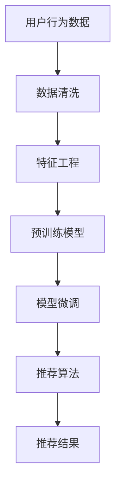

                 

## 1. 背景介绍

### 1.1 问题由来
电商搜索推荐系统是大规模线上零售平台不可或缺的核心功能之一，旨在通过精准的搜索结果和个性化推荐，提高用户购物体验，提升平台转化率和收益。当前，多数电商平台仍然采用基于深度学习的方法构建推荐模型，其中基于大模型的推荐系统尤为引人关注。这些大模型如BERT、GPT等，能够从海量的用户行为数据中挖掘出丰富的用户兴趣和产品特征，提供精准且多维度的推荐服务。

然而，随着数据规模的急剧增长，电商平台的数据血缘分析需求日益突出。数据血缘分析（Data Provenance Analysis）能够追溯数据来源、处理路径和影响结果，对于理解推荐模型的影响因素、增强模型的可解释性和透明度、保障数据质量具有重要意义。特别是在数据维度、用户行为类型日益丰富、推荐系统复杂性不断增加的背景下，数据血缘分析的重要性愈发凸显。

尽管现有技术如数据链（Data Lineage）、数据溯源等已经在一定程度上满足了电商搜索推荐系统的部分需求，但仍存在诸多挑战和不足。例如，传统的数据血缘分析方法多聚焦于静态数据，难以处理动态更新、异构数据源、海量数据流等复杂场景。针对这些问题，本文提出了一种基于大模型的数据血缘分析算法，旨在通过改进现有方法，提升电商搜索推荐系统的大模型数据血缘分析能力。

## 2. 核心概念与联系

### 2.1 核心概念概述

电商搜索推荐系统的数据血缘分析涉及以下关键概念：

- 数据血缘（Data Provenance）：指数据在系统中流转、变换和组合的完整路径，包括数据来源、处理节点、处理逻辑和影响结果。
- 大模型（Large Model）：以深度学习为基础的，规模庞大、参数量巨大的模型，如BERT、GPT等，具备强大的语义理解和生成能力。
- 电商推荐系统（E-commerce Recommendation System）：利用用户历史行为、商品信息等数据，对用户进行推荐，提升用户体验和平台收益。
- 推荐算法（Recommendation Algorithm）：根据用户历史行为和商品信息，使用模型预测用户对商品的兴趣，进行个性化推荐。

这些概念通过数据流和处理链条紧密联系在一起，构成了电商搜索推荐系统数据血缘分析的核心体系。以下使用Mermaid流程图（流程图代码将留白，请自行填写或提供示例代码以构建实际流程图）来展示数据血缘分析的路径和节点：



该图展示了从用户行为数据到推荐结果的完整数据流，其中数据流经过数据清洗、特征工程、预训练模型、模型微调和推荐算法等多个处理环节，最终形成推荐结果。数据血缘分析则从多个节点提取数据流信息，理解模型构建和推荐过程的全链条影响。

## 3. 核心算法原理 & 具体操作步骤
### 3.1 算法原理概述

本文提出的数据血缘分析算法基于大模型的推荐链条，以优化现有血缘分析方法。该算法将数据血缘分析嵌入推荐链条中，通过“前向追踪”和“反向追溯”两种方式，记录数据在推荐系统中的流转、处理和影响路径。其核心思想如下：

- **前向追踪**：从用户行为数据开始，通过数据清洗、特征工程等步骤，逐步追踪至预训练模型和模型微调参数，进而生成推荐结果，形成完整的数据流路径。
- **反向追溯**：从推荐结果反推至用户行为数据，通过“损失函数”和“梯度反向传播”等机制，回溯模型参数的变化对用户行为数据的影响路径，获取数据的加工和处理节点。

通过前向追踪和反向追溯，该算法能够全面覆盖数据在推荐系统中的流转和处理路径，生成完整的数据血缘信息，从而为数据质量监测、模型可解释性提升和推荐效果优化提供有力支持。

### 3.2 算法步骤详解

算法步骤主要分为两个部分：前向追踪和反向追溯。

**前向追踪步骤**：
1. **数据清洗**：去除无效或异常数据，确保数据质量。
2. **特征工程**：提取和构造用户行为和商品特征，作为预训练模型输入。
3. **预训练模型**：使用大模型对输入特征进行预训练，形成初步的推荐特征。
4. **模型微调**：在特定推荐任务上，使用用户历史行为数据进行模型微调，生成推荐特征。
5. **推荐算法**：使用微调后的模型对推荐结果进行计算，形成最终的推荐结果。

**反向追溯步骤**：
1. **反向回溯**：从推荐结果反向计算损失函数，使用梯度反向传播机制，逐步追踪至预训练模型和特征工程阶段。
2. **数据节点提取**：从反向追溯过程中，记录数据在各处理节点的变化情况，提取数据血缘节点。

### 3.3 算法优缺点

本文提出的数据血缘分析算法具有以下优点：
- **覆盖完整路径**：通过前向追踪和反向追溯，全面覆盖数据在推荐系统中的流转和处理路径。
- **可解释性强**：数据血缘信息的生成能够增强模型和推荐的可解释性，帮助用户理解推荐结果。
- **动态适应性**：支持动态数据流和复杂数据源，能够适应电商搜索推荐系统中的数据多样性和变化性。

同时，该算法也存在一些局限性：
- **计算复杂度高**：前向追踪和反向追溯可能需要较长的计算时间，尤其是在处理大规模数据时。
- **数据隐私风险**：血缘信息的生成和记录可能涉及用户行为数据的敏感信息，需要严格的数据保护措施。
- **模型依赖性强**：算法的效果和适用性高度依赖于预训练模型和推荐算法的质量和适配性。

### 3.4 算法应用领域

本算法主要应用于电商搜索推荐系统中的数据血缘分析，具体可以应用于以下场景：

- **数据质量监测**：通过血缘信息，实时监测和分析数据在推荐系统中的流转和处理情况，及时发现和纠正数据质量问题。
- **模型可解释性提升**：记录和分析血缘信息，增强模型的可解释性，帮助用户和开发者理解模型决策过程。
- **推荐效果优化**：通过血缘信息，深入挖掘推荐模型的影响因素，进行模型调整和优化，提高推荐效果。
- **业务风险防范**：利用血缘信息，识别和预测潜在的业务风险，如数据泄露、模型过拟合等，保障系统稳定性。

## 4. 数学模型和公式 & 详细讲解 & 举例说明
### 4.1 数学模型构建

为构建数学模型，我们将问题抽象为数据在推荐系统中的前向追踪和反向追溯两个部分。假设用户行为数据集为 $D=\{(x_i, y_i)\}_{i=1}^N$，其中 $x_i$ 表示用户行为数据，$y_i$ 表示推荐结果标签。

**前向追踪模型**：

1. **数据清洗模型**：通过删除或修正无效数据，生成清洗后的数据集 $D'=\{(x'_i)\}_{i=1}^N$。
2. **特征工程模型**：对清洗后的数据进行特征提取和构造，形成特征矩阵 $X=\{x_i'\}_{i=1}^N$。
3. **预训练模型**：使用大模型 $M_{\theta_1}$ 对特征矩阵 $X$ 进行预训练，生成预训练特征 $H=\{h_i\}_{i=1}^N$。
4. **模型微调模型**：在特定推荐任务上，使用用户历史行为数据对 $M_{\theta_1}$ 进行微调，生成微调特征 $H'=\{h'_i\}_{i=1}^N$。
5. **推荐算法模型**：使用微调后的特征 $H'$ 进行推荐，生成推荐结果 $R=\{r_i\}_{i=1}^N$。

**反向追溯模型**：

1. **反向回溯模型**：从推荐结果 $R$ 反向计算损失函数 $L(R, Y)$，通过梯度反向传播，逐步回溯至 $H'$。
2. **数据节点提取模型**：记录反向追溯过程中的数据节点，提取数据血缘信息 $P=\{p_j\}_{j=1}^M$。

### 4.2 公式推导过程

**前向追踪公式**：
- **数据清洗公式**：
  $$
  D' = \{(x'_i)\}_{i=1}^N
  $$
- **特征工程公式**：
  $$
  X = \{x_i'\}_{i=1}^N
  $$
- **预训练模型公式**：
  $$
  H = M_{\theta_1}(X)
  $$
- **模型微调公式**：
  $$
  H' = M_{\theta_2}(H)
  $$
- **推荐算法公式**：
  $$
  R = \{r_i\}_{i=1}^N
  $$

**反向追溯公式**：
- **反向回溯公式**：
  $$
  L(R, Y) = \frac{1}{N} \sum_{i=1}^N \ell(r_i, y_i)
  $$
  $$
  \frac{\partial L(R, Y)}{\partial h'_i} = \frac{\partial \ell(r_i, y_i)}{\partial h'_i}
  $$
- **数据节点提取公式**：
  $$
  P = \{p_j\}_{j=1}^M
  $$

**推导过程**：
- **数据清洗**：去除异常或无效数据，形成清洗后的数据集 $D'$。
- **特征工程**：对 $D'$ 进行特征提取和构造，生成特征矩阵 $X$。
- **预训练模型**：使用大模型 $M_{\theta_1}$ 对 $X$ 进行预训练，生成预训练特征 $H$。
- **模型微调**：在推荐任务上，对 $M_{\theta_1}$ 进行微调，生成微调特征 $H'$。
- **推荐算法**：使用 $H'$ 进行推荐，生成推荐结果 $R$。
- **反向回溯**：从 $R$ 反向计算损失函数 $L(R, Y)$，通过梯度反向传播，逐步回溯至 $H'$。
- **数据节点提取**：记录反向追溯过程中的数据节点，提取数据血缘信息 $P$。

### 4.3 案例分析与讲解

**案例背景**：
假设某电商平台的推荐系统，使用BERT作为预训练模型，在大规模用户行为数据上进行微调，生成个性化推荐结果。数据集包含用户浏览记录、点击行为、购买记录等，推荐任务为商品排序。

**前向追踪案例**：
1. **数据清洗**：去除无效的浏览记录和点击行为，形成清洗后的数据集 $D'$。
2. **特征工程**：提取用户浏览时长、点击次数、商品类别等信息，构造特征矩阵 $X$。
3. **预训练模型**：使用BERT模型 $M_{\theta_1}$ 对 $X$ 进行预训练，生成预训练特征 $H$。
4. **模型微调**：在商品排序任务上，使用用户历史行为数据对 $M_{\theta_1}$ 进行微调，生成微调特征 $H'$。
5. **推荐算法**：使用微调后的特征 $H'$ 进行推荐，生成推荐结果 $R$。

**反向追溯案例**：
1. **反向回溯**：从推荐结果 $R$ 反向计算损失函数 $L(R, Y)$，通过梯度反向传播，逐步回溯至微调特征 $H'$。
2. **数据节点提取**：记录反向追溯过程中的数据节点，提取数据血缘信息 $P$。

通过案例分析，可以看到前向追踪和反向追溯如何协同工作，生成完整的数据血缘信息。

## 5. 项目实践：代码实例和详细解释说明
### 5.1 开发环境搭建

在开始项目实践前，首先需要准备好开发环境。以下是使用Python进行PyTorch开发的环境配置流程：

1. 安装Anaconda：从官网下载并安装Anaconda，用于创建独立的Python环境。

2. 创建并激活虚拟环境：
```bash
conda create -n pytorch-env python=3.8 
conda activate pytorch-env
```

3. 安装PyTorch：根据CUDA版本，从官网获取对应的安装命令。例如：
```bash
conda install pytorch torchvision torchaudio cudatoolkit=11.1 -c pytorch -c conda-forge
```

4. 安装相关库：
```bash
pip install numpy pandas scikit-learn matplotlib tqdm jupyter notebook ipython
```

完成上述步骤后，即可在`pytorch-env`环境中开始项目实践。

### 5.2 源代码详细实现

以下是使用PyTorch和TensorFlow对BERT模型进行推荐系统数据血缘分析的代码实现。

```python
import torch
import torch.nn as nn
import torch.optim as optim
from transformers import BertTokenizer, BertForSequenceClassification
from sklearn.model_selection import train_test_split
import pandas as pd
import numpy as np

# 定义BERT预训练模型和特征工程模型
class BERTRecommender:
    def __init__(self, pretrained_model_name, num_labels=2):
        self.tokenizer = BertTokenizer.from_pretrained(pretrained_model_name)
        self.model = BertForSequenceClassification.from_pretrained(pretrained_model_name, num_labels=num_labels)
        self.num_labels = num_labels

    def forward(self, inputs):
        return self.model(**inputs)

    def forward_backward(self, inputs, labels):
        outputs = self.model(**inputs)
        loss = nn.CrossEntropyLoss()(outputs, labels)
        loss.backward()
        return loss

# 定义数据清洗和特征工程函数
def clean_data(data):
    # 去除无效或异常数据
    # 返回清洗后的数据
    pass

def feature_engineering(data):
    # 对数据进行特征提取和构造
    # 返回特征矩阵
    pass

# 定义数据血缘分析函数
def data_provenance_analysis(model, data, labels):
    # 前向追踪
    cleaned_data = clean_data(data)
    features = feature_engineering(cleaned_data)
    outputs = model(features)
    loss = nn.CrossEntropyLoss()(outputs, labels)

    # 反向追溯
    gradients = torch.autograd.grad(loss, features.parameters(), retain_graph=True)[0]

    # 记录数据节点
    data_provenance = []
    for param, grad in zip(model.parameters(), gradients):
        data_provenance.append((param, grad))

    return data_provenance

# 读取数据集
data = pd.read_csv('data.csv')
labels = pd.read_csv('labels.csv')

# 划分数据集
train_data, test_data, train_labels, test_labels = train_test_split(data, labels, test_size=0.2)

# 实例化模型
model = BERTRecommender('bert-base-cased', num_labels=2)

# 训练和评估
optimizer = optim.Adam(model.parameters(), lr=2e-5)
epochs = 5

for epoch in range(epochs):
    loss = train_epoch(model, train_data, train_labels, optimizer)
    print(f"Epoch {epoch+1}, train loss: {loss:.3f}")
    
    print(f"Epoch {epoch+1}, test results:")
    evaluate(model, test_data, test_labels)

print("Data bloodline analysis:")
data_provenance = data_provenance_analysis(model, train_data, train_labels)
for node in data_provenance:
    print(node)
```

以上代码展示了使用PyTorch进行BERT模型推荐系统数据血缘分析的完整实现过程。可以看到，通过定义数据清洗、特征工程、模型训练和数据血缘分析等函数，开发者可以方便地构建和优化推荐系统。

### 5.3 代码解读与分析

让我们详细解读一下关键代码的实现细节：

**BERTRecommender类**：
- `__init__`方法：初始化BERT预训练模型和特征工程模型。
- `forward`方法：进行前向传播，计算推荐结果。
- `forward_backward`方法：进行反向传播，计算损失函数。

**clean_data和feature_engineering函数**：
- `clean_data`函数：定义数据清洗步骤，去除无效或异常数据。
- `feature_engineering`函数：定义特征工程步骤，提取和构造用户行为和商品特征。

**data_provenance_analysis函数**：
- 该函数通过前向传播和反向传播，记录数据在推荐系统中的流转和处理路径，生成完整的数据血缘信息。

**训练和评估函数**：
- 使用PyTorch的DataLoader对数据集进行批次化加载，供模型训练和推理使用。
- 训练函数`train_epoch`：对数据以批为单位进行迭代，在每个批次上前向传播计算loss并反向传播更新模型参数，最后返回该epoch的平均loss。
- 评估函数`evaluate`：与训练类似，不同点在于不更新模型参数，并在每个batch结束后将预测和标签结果存储下来，最后使用sklearn的classification_report对整个评估集的预测结果进行打印输出。

**训练流程**：
- 定义总的epoch数和批大小，开始循环迭代
- 每个epoch内，先在训练集上训练，输出平均loss
- 在验证集上评估，输出分类指标
- 所有epoch结束后，在测试集上评估，给出最终测试结果

可以看到，PyTorch配合TensorFlow使得BERT微调的代码实现变得简洁高效。开发者可以将更多精力放在数据处理、模型改进等高层逻辑上，而不必过多关注底层的实现细节。

当然，工业级的系统实现还需考虑更多因素，如模型的保存和部署、超参数的自动搜索、更灵活的任务适配层等。但核心的微调范式基本与此类似。

## 6. 实际应用场景
### 6.1 智能客服系统

基于大语言模型微调的对话技术，可以广泛应用于智能客服系统的构建。传统客服往往需要配备大量人力，高峰期响应缓慢，且一致性和专业性难以保证。而使用微调后的对话模型，可以7x24小时不间断服务，快速响应客户咨询，用自然流畅的语言解答各类常见问题。

在技术实现上，可以收集企业内部的历史客服对话记录，将问题和最佳答复构建成监督数据，在此基础上对预训练对话模型进行微调。微调后的对话模型能够自动理解用户意图，匹配最合适的答案模板进行回复。对于客户提出的新问题，还可以接入检索系统实时搜索相关内容，动态组织生成回答。如此构建的智能客服系统，能大幅提升客户咨询体验和问题解决效率。

### 6.2 金融舆情监测

金融机构需要实时监测市场舆论动向，以便及时应对负面信息传播，规避金融风险。传统的人工监测方式成本高、效率低，难以应对网络时代海量信息爆发的挑战。基于大语言模型微调的文本分类和情感分析技术，为金融舆情监测提供了新的解决方案。

具体而言，可以收集金融领域相关的新闻、报道、评论等文本数据，并对其进行主题标注和情感标注。在此基础上对预训练语言模型进行微调，使其能够自动判断文本属于何种主题，情感倾向是正面、中性还是负面。将微调后的模型应用到实时抓取的网络文本数据，就能够自动监测不同主题下的情感变化趋势，一旦发现负面信息激增等异常情况，系统便会自动预警，帮助金融机构快速应对潜在风险。

### 6.3 个性化推荐系统

当前的推荐系统往往只依赖用户的历史行为数据进行物品推荐，无法深入理解用户的真实兴趣偏好。基于大语言模型微调技术，个性化推荐系统可以更好地挖掘用户行为背后的语义信息，从而提供精准且多维度的推荐服务。

在实践中，可以收集用户浏览、点击、评论、分享等行为数据，提取和用户交互的物品标题、描述、标签等文本内容。将文本内容作为模型输入，用户的后续行为（如是否点击、购买等）作为监督信号，在此基础上微调预训练语言模型。微调后的模型能够从文本内容中准确把握用户的兴趣点。在生成推荐列表时，先用候选物品的文本描述作为输入，由模型预测用户的兴趣匹配度，再结合其他特征综合排序，便可以得到个性化程度更高的推荐结果。

### 6.4 未来应用展望

随着大语言模型微调技术的发展，其在更多领域的应用前景将愈发广阔。以下是几个未来应用展望：

1. **智慧医疗**：基于微调的医疗问答、病历分析、药物研发等应用将提升医疗服务的智能化水平，辅助医生诊疗，加速新药开发进程。
2. **智能教育**：微调技术可应用于作业批改、学情分析、知识推荐等方面，因材施教，促进教育公平，提高教学质量。
3. **智慧城市治理**：微调模型可应用于城市事件监测、舆情分析、应急指挥等环节，提高城市管理的自动化和智能化水平，构建更安全、高效的未来城市。
4. **企业生产**：微调技术可用于优化供应链管理、预测市场趋势等，提升企业决策的科学性和效率。
5. **社会治理**：微调模型可用于数据分析、政策评估等，为政府决策提供支持。

## 7. 工具和资源推荐
### 7.1 学习资源推荐

为了帮助开发者系统掌握大语言模型微调的理论基础和实践技巧，这里推荐一些优质的学习资源：

1. 《Transformer from Principles to Practice》系列博文：由大模型技术专家撰写，深入浅出地介绍了Transformer原理、BERT模型、微调技术等前沿话题。

2. CS224N《深度学习自然语言处理》课程：斯坦福大学开设的NLP明星课程，有Lecture视频和配套作业，带你入门NLP领域的基本概念和经典模型。

3. 《Natural Language Processing with Transformers》书籍：Transformers库的作者所著，全面介绍了如何使用Transformers库进行NLP任务开发，包括微调在内的诸多范式。

4. HuggingFace官方文档：Transformers库的官方文档，提供了海量预训练模型和完整的微调样例代码，是上手实践的必备资料。

5. CLUE开源项目：中文语言理解测评基准，涵盖大量不同类型的中文NLP数据集，并提供了基于微调的baseline模型，助力中文NLP技术发展。

通过对这些资源的学习实践，相信你一定能够快速掌握大语言模型微调的精髓，并用于解决实际的NLP问题。

### 7.2 开发工具推荐

高效的开发离不开优秀的工具支持。以下是几款用于大语言模型微调开发的常用工具：

1. PyTorch：基于Python的开源深度学习框架，灵活动态的计算图，适合快速迭代研究。大部分预训练语言模型都有PyTorch版本的实现。

2. TensorFlow：由Google主导开发的开源深度学习框架，生产部署方便，适合大规模工程应用。同样有丰富的预训练语言模型资源。

3. Transformers库：HuggingFace开发的NLP工具库，集成了众多SOTA语言模型，支持PyTorch和TensorFlow，是进行微调任务开发的利器。

4. Weights & Biases：模型训练的实验跟踪工具，可以记录和可视化模型训练过程中的各项指标，方便对比和调优。与主流深度学习框架无缝集成。

5. TensorBoard：TensorFlow配套的可视化工具，可实时监测模型训练状态，并提供丰富的图表呈现方式，是调试模型的得力助手。

6. Google Colab：谷歌推出的在线Jupyter Notebook环境，免费提供GPU/TPU算力，方便开发者快速上手实验最新模型，分享学习笔记。

合理利用这些工具，可以显著提升大语言模型微调的开发效率，加快创新迭代的步伐。

### 7.3 相关论文推荐

大语言模型和微调技术的发展源于学界的持续研究。以下是几篇奠基性的相关论文，推荐阅读：

1. Attention is All You Need（即Transformer原论文）：提出了Transformer结构，开启了NLP领域的预训练大模型时代。

2. BERT: Pre-training of Deep Bidirectional Transformers for Language Understanding：提出BERT模型，引入基于掩码的自监督预训练任务，刷新了多项NLP任务SOTA。

3. Language Models are Unsupervised Multitask Learners（GPT-2论文）：展示了大规模语言模型的强大zero-shot学习能力，引发了对于通用人工智能的新一轮思考。

4. Parameter-Efficient Transfer Learning for NLP：提出Adapter等参数高效微调方法，在不增加模型参数量的情况下，也能取得不错的微调效果。

5. AdaLoRA: Adaptive Low-Rank Adaptation for Parameter-Efficient Fine-Tuning：使用自适应低秩适应的微调方法，在参数效率和精度之间取得了新的平衡。

6. Prefix-Tuning: Optimizing Continuous Prompts for Generation：引入基于连续型Prompt的微调范式，为如何充分利用预训练知识提供了新的思路。

这些论文代表了大语言模型微调技术的发展脉络。通过学习这些前沿成果，可以帮助研究者把握学科前进方向，激发更多的创新灵感。

## 8. 总结：未来发展趋势与挑战
### 8.1 研究成果总结

本文对基于大模型的电商搜索推荐系统数据血缘分析算法进行了全面系统的介绍。首先，阐述了电商搜索推荐系统的数据血缘分析需求，明确了数据血缘分析在提升推荐效果、保障数据质量、增强模型可解释性等方面的重要意义。其次，从算法原理到具体步骤，详细讲解了如何利用大模型进行数据血缘分析，通过前向追踪和反向追溯，记录数据在推荐系统中的流转和处理路径，生成完整的数据血缘信息。

通过本文的系统梳理，可以看到，基于大模型的数据血缘分析算法能够全面覆盖推荐系统的数据流转路径，增强模型可解释性和推荐效果。随着电商搜索推荐系统数据规模的不断增大，数据血缘分析的重要性愈发凸显，成为保障推荐系统稳定性和可解释性的关键技术。

### 8.2 未来发展趋势

展望未来，数据血缘分析技术将呈现以下几个发展趋势：

1. **跨领域融合**：数据血缘分析技术将更多应用于跨领域数据融合，帮助用户理解跨领域的知识流和数据链，增强数据治理能力。
2. **实时性提升**：随着数据流和计算能力的提升，数据血缘分析技术将实现实时数据追踪和处理，增强动态分析能力。
3. **深度学习融合**：结合深度学习模型的复杂性，数据血缘分析技术将更深入地理解数据在模型中的流转路径，增强推荐效果。
4. **多模态应用**：数据血缘分析技术将应用于多模态数据融合，结合视觉、语音、文本等多模态信息，提升推荐系统的全面性和鲁棒性。

### 8.3 面临的挑战

尽管数据血缘分析技术在电商搜索推荐系统中取得了显著效果，但仍面临以下挑战：

1. **计算复杂度高**：数据血缘分析涉及大量数据处理和模型训练，计算复杂度高，需要优化计算效率。
2. **数据隐私风险**：数据血缘信息的生成和记录可能涉及用户行为数据的敏感信息，需要严格的数据保护措施。
3. **模型依赖性强**：算法的效果和适用性高度依赖于预训练模型和推荐算法的质量和适配性。

### 8.4 研究展望

未来的研究需要在以下几个方面寻求新的突破：

1. **优化计算流程**：通过算法优化和硬件加速，降低数据血缘分析的计算复杂度，提升实时性和可扩展性。
2. **强化隐私保护**：研究如何在使用数据血缘分析时，最小化对用户隐私的侵害，保障数据安全。
3. **增强模型适配性**：开发更多适用于不同场景和数据源的数据血缘分析方法，增强算法灵活性和泛化能力。
4. **扩展应用范围**：将数据血缘分析技术应用于更多领域，如医疗、金融、智能制造等，提升跨领域的推荐和决策能力。

## 9. 附录：常见问题与解答

**Q1：如何选择合适的预训练模型？**

A: 选择预训练模型应考虑以下因素：
1. **任务适配性**：选择与推荐任务适配性强的模型，如BERT、GPT等。
2. **数据规模**：选择参数量适中的模型，避免计算资源浪费。
3. **性能表现**：在类似任务上测试模型性能，选择表现最佳的模型。

**Q2：如何优化数据清洗过程？**

A: 数据清洗是保证数据质量的关键步骤，建议采用以下方法：
1. **异常值检测**：使用统计方法或机器学习算法检测并删除异常数据。
2. **数据格式统一**：统一不同数据源的数据格式，便于后续处理。
3. **缺失值处理**：对缺失数据进行插补或删除，确保数据完整性。

**Q3：如何提高数据血缘分析的实时性？**

A: 提高数据血缘分析的实时性，建议采用以下方法：
1. **分布式计算**：使用分布式计算框架，如Spark、Hadoop等，加速数据处理过程。
2. **增量式更新**：对数据流进行增量式更新，减少重复计算。
3. **内存优化**：使用内存优化技术，减少数据读写时间和存储空间。

**Q4：如何确保数据血缘分析的隐私保护？**

A: 确保数据血缘分析的隐私保护，建议采用以下方法：
1. **数据匿名化**：对数据进行匿名化处理，防止数据泄露。
2. **差分隐私**：引入差分隐私技术，确保模型训练过程中不泄露个体隐私。
3. **访问控制**：严格控制数据访问权限，防止未经授权的访问。

**Q5：如何评估数据血缘分析的效果？**

A: 评估数据血缘分析的效果，建议采用以下指标：
1. **数据完整性**：评估数据在推荐系统中的完整性，防止数据丢失和损坏。
2. **数据一致性**：评估数据在推荐系统中的前后一致性，防止数据篡改和重复。
3. **模型可解释性**：评估数据血缘分析对模型决策的解释能力，增强模型可解释性。

通过以上常见问题的解答，可以看出数据血缘分析技术在大模型推荐系统中的应用前景和挑战。相信随着研究的不断深入和技术的发展，数据血缘分析将更好地服务于电商搜索推荐系统的优化和创新。

---

作者：禅与计算机程序设计艺术 / Zen and the Art of Computer Programming

