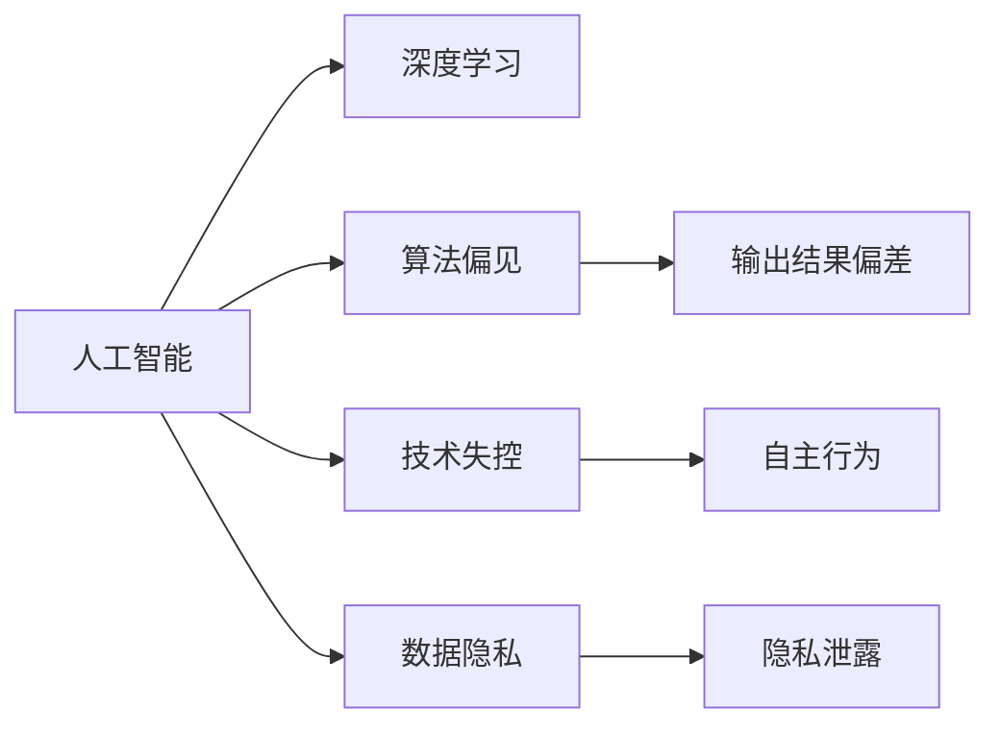

                 

## 1. 背景介绍

### 1.1 问题由来
在过去十年中，人工智能（AI）特别是深度学习技术取得了飞速发展，并广泛渗透到各个行业。从语音识别到自然语言处理，从图像识别到自动驾驶，AI的应用如火如荼。然而，随之而来的问题也越来越多，诸如数据隐私、算法偏见、技术失控等议题引起了广泛关注。

人工智能的发展在给人们带来便利的同时，也引发了一些伦理和社会问题。公众对AI技术的认知存在不少误区，例如“AI将取代人类工作”、“AI能力无限强大”等观点。这些观点忽略了AI技术的局限性和潜在的风险，甚至在某种程度上助长了对AI技术的误解和恐惧。

### 1.2 问题核心关键点
AI技术发展迅速，但公众对其能力、风险和未来趋势的认知存在较大偏差。本文旨在从技术角度深入剖析AI的现状和未来，纠正部分公众对AI技术的误解，并探讨AI技术发展的正确方向。

## 2. 核心概念与联系

### 2.1 核心概念概述

- **人工智能**：指通过机器学习、深度学习等技术，使计算机系统具备类似人类的认知和智能能力。
- **深度学习**：一种基于神经网络的机器学习技术，广泛应用于图像识别、自然语言处理、语音识别等领域。
- **算法偏见**：指AI模型在训练过程中可能学习到的数据偏见，导致输出结果不公平或歧视。
- **技术失控**：指AI系统可能失去控制，自主做出不符合人类期望的行为。
- **数据隐私**：指在AI模型训练和应用过程中保护用户隐私数据的权利和责任。

这些核心概念之间的逻辑关系可以通过以下Mermaid流程图来展示：



这个流程图展示了人工智能技术在发展过程中可能遇到的各类问题，以及这些问题间的相互关系。

## 3. 核心算法原理 & 具体操作步骤

### 3.1 算法原理概述

深度学习算法是现代AI技术的核心。它通过构建多层神经网络，利用反向传播算法训练模型参数，从而实现对复杂数据的非线性映射和模式识别。然而，深度学习算法的强大能力同样带来了一些挑战，例如模型过于复杂、训练数据需求量大、泛化能力有限等。

### 3.2 算法步骤详解

深度学习模型的训练一般包括以下步骤：

1. **数据准备**：收集标注数据，并进行数据预处理，如标准化、归一化、数据增强等。
2. **模型构建**：选择适当的神经网络架构，定义损失函数、优化器等训练参数。
3. **模型训练**：将数据输入模型，利用优化算法更新模型参数，最小化损失函数。
4. **模型评估**：在验证集上评估模型性能，选择合适的超参数进行调优。
5. **模型部署**：将训练好的模型部署到实际应用场景中，进行推理预测。

### 3.3 算法优缺点

深度学习算法的优点包括：

- 强大的模式识别能力，适用于复杂非线性数据的处理。
- 自动化特征学习，减少了人工特征工程的工作量。
- 在许多任务上取得了SOTA性能。

然而，深度学习算法也存在一些缺点：

- 模型过于复杂，训练和推理耗时耗资。
- 数据需求量大，难以获得高质量标注数据。
- 泛化能力有限，容易过拟合。
- 解释性差，黑盒模型难以解释决策过程。

### 3.4 算法应用领域

深度学习算法已广泛应用于图像识别、语音识别、自然语言处理、推荐系统等多个领域。例如：

- 图像识别：如面部识别、物体识别等。
- 语音识别：如语音转文本、情感分析等。
- 自然语言处理：如机器翻译、文本摘要、问答系统等。
- 推荐系统：如电商推荐、内容推荐等。

## 4. 数学模型和公式 & 详细讲解 & 举例说明

### 4.1 数学模型构建

深度学习模型通常基于多层神经网络构建，以最大化某个损失函数 $L$。损失函数可以是均方误差（回归任务）或交叉熵（分类任务）。训练的目标是最小化损失函数，即：

$$
\min_{\theta} L(y,f(x;\theta))
$$

其中 $y$ 为真实标签，$f(x;\theta)$ 为模型在输入 $x$ 下的预测输出，$\theta$ 为模型参数。

### 4.2 公式推导过程

以一个简单的线性回归模型为例，假设模型为 $f(x;\theta) = \theta_0 + \theta_1 x_1 + \theta_2 x_2$，训练样本为 $(x_i,y_i)$，损失函数为均方误差。则训练过程的数学推导如下：

1. 定义损失函数：
$$
L(y,f(x;\theta)) = \frac{1}{2} \sum_{i=1}^n (y_i - f(x_i;\theta))^2
$$

2. 对损失函数求导，得到梯度：
$$
\frac{\partial L}{\partial \theta_0} = -\sum_{i=1}^n (y_i - f(x_i;\theta))
$$
$$
\frac{\partial L}{\partial \theta_1} = -\sum_{i=1}^n (x_{1,i} - f(x_i;\theta)) y_i
$$
$$
\frac{\partial L}{\partial \theta_2} = -\sum_{i=1}^n (x_{2,i} - f(x_i;\theta)) y_i
$$

3. 利用梯度下降算法更新参数：
$$
\theta_j \leftarrow \theta_j - \alpha \frac{\partial L}{\partial \theta_j}
$$

其中 $\alpha$ 为学习率，需要根据具体问题进行调整。

### 4.3 案例分析与讲解

以一个简单的图像分类任务为例，假设模型为卷积神经网络（CNN），输入为 $28 \times 28$ 的灰度图像，输出为0或1，分别代表不是猫和是猫。

- 数据准备：收集猫和非猫的图片，并进行标准化处理。
- 模型构建：使用卷积层、池化层和全连接层构建CNN模型，损失函数为交叉熵。
- 模型训练：将数据输入模型，利用反向传播算法更新参数。
- 模型评估：在验证集上评估模型性能，选择合适的超参数进行调优。

## 5. 项目实践：代码实例和详细解释说明

### 5.1 开发环境搭建

在进行深度学习模型开发前，需要准备Python环境和相关库。

1. 安装Python和Anaconda：下载并安装Python和Anaconda，用于创建和管理虚拟环境。
2. 创建虚拟环境：
```bash
conda create -n myenv python=3.8
conda activate myenv
```

3. 安装深度学习库：
```bash
pip install torch torchvision torchtext
```

### 5.2 源代码详细实现

以下是一个简单的线性回归模型的Python代码实现，利用PyTorch库：

```python
import torch
import torch.nn as nn
import torch.optim as optim

# 定义模型
class LinearRegression(nn.Module):
    def __init__(self, input_dim, output_dim):
        super(LinearRegression, self).__init__()
        self.linear = nn.Linear(input_dim, output_dim)

    def forward(self, x):
        return self.linear(x)

# 加载数据
train_x = torch.randn(100, 2)
train_y = train_x[:, 0] + torch.randn(100, 1) * 0.1
test_x = torch.randn(10, 2)
test_y = test_x[:, 0] + torch.randn(10, 1) * 0.1

# 定义模型
model = LinearRegression(2, 1)

# 定义损失函数和优化器
criterion = nn.MSELoss()
optimizer = optim.SGD(model.parameters(), lr=0.01)

# 训练模型
for epoch in range(1000):
    optimizer.zero_grad()
    outputs = model(train_x)
    loss = criterion(outputs, train_y)
    loss.backward()
    optimizer.step()

    if epoch % 100 == 0:
        print('Epoch {}, Loss {}'.format(epoch, loss.item()))

# 评估模型
test_outputs = model(test_x)
print('Test Predictions: ', test_outputs.numpy())
print('Test Loss: ', criterion(test_outputs, test_y).item())
```

### 5.3 代码解读与分析

以上代码展示了线性回归模型的构建和训练过程。

- 定义了线性回归模型类 `LinearRegression`，继承自 `nn.Module`。
- 使用 `torch.randn` 生成训练集和测试集数据。
- 定义模型、损失函数和优化器。
- 使用 `for` 循环训练模型，并输出损失函数值。
- 在训练过程中，使用 `optimizer.zero_grad()` 清空梯度，`loss.backward()` 计算梯度，`optimizer.step()` 更新模型参数。

## 6. 实际应用场景

### 6.1 医疗影像分析

深度学习算法在医疗影像分析中有着广泛应用。通过训练深度学习模型，医生可以更快、更准确地诊断疾病。例如，利用卷积神经网络（CNN）对CT或MRI图像进行分类，帮助医生识别肿瘤、病灶等异常区域。

### 6.2 自然语言处理

深度学习算法在自然语言处理（NLP）中也有着重要应用。例如，通过训练语言模型，可以实现自动摘要、机器翻译、情感分析等任务。利用预训练语言模型，如BERT、GPT，可以快速微调成特定任务，并取得优异效果。

### 6.3 金融风控

深度学习算法在金融领域也有重要应用。例如，利用深度学习模型进行信用评分、风险预测、反欺诈检测等。通过训练模型，金融机构可以更准确地评估用户信用风险，防范金融欺诈行为。

## 7. 工具和资源推荐

### 7.1 学习资源推荐

1. 《深度学习》书籍：Ian Goodfellow、Yoshua Bengio和Aaron Courville所著，深入讲解了深度学习的基本原理和算法。
2. Coursera深度学习课程：Andrew Ng开设的深度学习课程，从基础到高级，涵盖深度学习各个方面。
3. PyTorch官方文档：PyTorch官方文档，详细介绍了PyTorch库的使用方法和API。
4. Kaggle竞赛：Kaggle是数据科学竞赛平台，提供了丰富的数据集和模型，适合进行深度学习实践。

### 7.2 开发工具推荐

1. PyTorch：由Facebook开发的深度学习框架，易于使用，支持动态计算图。
2. TensorFlow：由Google开发的深度学习框架，支持分布式训练，适合大规模工程应用。
3. Jupyter Notebook：开源的交互式计算环境，适合进行深度学习实验和分析。

### 7.3 相关论文推荐

1. AlexNet：Hinton等人提出的卷积神经网络，开创了深度学习在图像识别中的应用。
2. ResNet：He等人提出的残差网络，解决了深度网络退化问题。
3. Transformer：Vaswani等人提出的自注意力机制，极大地提升了NLP任务的性能。
4. GPT系列：OpenAI提出的生成预训练变换器模型，展示了预训练模型在生成任务中的强大能力。

## 8. 总结：未来发展趋势与挑战

### 8.1 总结

本文从技术角度剖析了AI的发展现状和未来趋势。深度学习技术虽然带来了强大的计算能力，但也存在诸多挑战，如模型复杂性、数据需求、泛化能力等。通过深入了解这些技术细节，可以更好地理解AI技术的局限性和潜在风险，避免对AI技术的误解和恐惧。

### 8.2 未来发展趋势

未来AI技术将继续快速发展，面临的挑战和机遇并存。以下是几个重要趋势：

1. **模型轻量化**：随着硬件性能的提升，模型轻量化技术（如MobileNet、SqueezeNet）将更加成熟，适应更多场景。
2. **联邦学习**：分布式训练和联邦学习将使AI技术在数据隐私保护方面取得突破，提高模型泛化能力。
3. **可解释性AI**：可解释性AI技术（如LIME、SHAP）将使AI模型更具透明性和可信度。
4. **多模态学习**：多模态学习技术将使AI模型更好地理解和处理图像、文本、语音等多种数据。

### 8.3 面临的挑战

AI技术发展过程中面临诸多挑战，需要各方共同努力解决。

1. **数据隐私**：如何在保证数据隐私的前提下，充分利用数据进行模型训练，是一个重要挑战。
2. **算法偏见**：如何设计公平、无偏见的算法，避免数据偏见对模型输出的影响，是一个长期任务。
3. **技术失控**：如何控制AI系统的行为，避免其自主做出不符合人类期望的行为，是一个关键问题。
4. **伦理道德**：如何在AI技术应用过程中，遵守伦理道德规范，保障用户权益，是一个复杂问题。

### 8.4 研究展望

未来AI研究需要从多个角度进行探索：

1. **公平性研究**：设计公平、无偏见的算法，确保AI系统的决策公正。
2. **可解释性研究**：提升AI模型的透明性和可信度，确保其决策过程可解释。
3. **伦理研究**：建立AI技术的伦理框架，确保其应用符合社会价值观。
4. **多模态学习**：开发多模态学习技术，提升AI模型对复杂数据源的理解能力。

## 9. 附录：常见问题与解答

**Q1: 什么是深度学习？**

A: 深度学习是一种基于神经网络的机器学习技术，通过构建多层神经网络，利用反向传播算法训练模型参数，从而实现对复杂数据的非线性映射和模式识别。

**Q2: 深度学习算法有哪些优点和缺点？**

A: 优点包括：
- 强大的模式识别能力，适用于复杂非线性数据的处理。
- 自动化特征学习，减少了人工特征工程的工作量。
- 在许多任务上取得了SOTA性能。

缺点包括：
- 模型过于复杂，训练和推理耗时耗资。
- 数据需求量大，难以获得高质量标注数据。
- 泛化能力有限，容易过拟合。
- 解释性差，黑盒模型难以解释决策过程。

**Q3: 深度学习算法在未来发展中可能面临哪些挑战？**

A: 未来深度学习面临的挑战包括：
- 数据隐私：如何在保证数据隐私的前提下，充分利用数据进行模型训练。
- 算法偏见：如何设计公平、无偏见的算法，避免数据偏见对模型输出的影响。
- 技术失控：如何控制AI系统的行为，避免其自主做出不符合人类期望的行为。
- 伦理道德：如何在AI技术应用过程中，遵守伦理道德规范，保障用户权益。

---

作者：禅与计算机程序设计艺术 / Zen and the Art of Computer Programming

